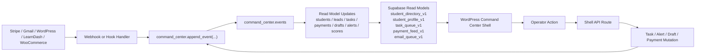

# MAC-6 - MissionMed Command Center Core Infrastructure

**Date:** 2026-03-27
**Status:** Complete - source package created
**Locked Architecture:** WordPress shell + Supabase backend + webhook/event-based integrations only

## 1. Core Package

MAC-6 turns the locked MAC-3 architecture into a concrete source package:

- Supabase migration for the canonical `command_center` schema
- WordPress admin-shell plugin for Dashboard, Students, and Student Profile
- API route contracts for `get students`, `get student detail`, `get tasks`, `update tasks`, `get payments`, and `get emails`
- Event-sourcing write path that keeps page loads read-only against Supabase

## 2. Full Schema

Source of truth:

- `supabase/migrations/20260327195500_mac_6_command_center_core_infrastructure.sql`

Tables created:

| Table | Purpose | Core Keys |
|------|---------|-----------|
| `command_center.leads` | Pre-enrollment operator record | `id`, `assigned_to`, `lead_status`, `funnel_stage`, `lead_source` |
| `command_center.students` | Canonical student record | `id`, `originating_lead_id`, `program_tier`, `student_status`, `assigned_to` |
| `command_center.events` | Append-only event log | `id`, `lead_id`, `student_id`, `aggregate_type`, `event_type`, `payload`, `occurred_at` |
| `command_center.tasks` | Operator work queue | `id`, `student_id`, `lead_id`, `assigned_to`, `priority`, `task_status`, `due_at` |
| `command_center.payments` | Stripe/Woo normalized ledger | `id`, `student_id`, `lead_id`, `processor_name`, `payment_type`, `payment_status`, `amount` |
| `command_center.email_drafts` | Human-reviewed Gmail drafts | `id`, `student_id`, `lead_id`, `gmail_thread_id`, `draft_status`, `ai_confidence` |
| `command_center.notes` | Internal operator notes | `id`, `student_id`, `lead_id`, `author`, `note_kind`, `pinned` |
| `command_center.alerts` | Urgency and exception layer | `id`, `student_id`, `lead_id`, `task_id`, `severity`, `alert_status` |
| `command_center.lead_scores` | AI conversion scoring snapshots | `id`, `lead_id`, `score`, `confidence`, `signals`, `computed_at` |

Relationship rules:

- `students.originating_lead_id -> leads.id`
- `events` anchor to `lead_id`, `student_id`, or `system`
- `tasks`, `payments`, `email_drafts`, `notes`, and `alerts` all require a lead or student link
- `lead_scores.lead_id -> leads.id`
- `alerts.task_id -> tasks.id`
- `source_event_id` fields preserve causality back to the event log

Event-sourcing structure:

- `command_center.events` is append-only and stores webhook/action payloads
- `command_center.append_event(...)` is the canonical write helper
- Read models are exposed through:
  - `command_center.student_directory_v1`
  - `command_center.student_profile_v1`
  - `command_center.task_queue_v1`
  - `command_center.payment_feed_v1`
  - `command_center.email_queue_v1`

Index strategy:

- Unique identity: email + source-record dedupe
- Operator routing: assignment, status, priority, due-date indexes
- Timeline reads: student/lead event indexes by `occurred_at desc`
- Alert hygiene: one open alert per `dedupe_key`
- Financial lookups: payment status + account/payment identifiers

## 3. Integration Architecture

### Stripe

- Entry: Stripe webhooks only
- Writes:
  - `events` with `event_type = charge.*`, `refund.*`, `invoice.*`
  - `payments` normalized ledger rows
  - `alerts` for failed charges, disputes, overdue installments
- Operator actions:
  - refund
  - retry charge
  - mark plan adjustment

### Gmail

- Entry: Gmail push notifications + background catch-up sync
- Writes:
  - `events` with `event_type = gmail.message.received|sent`
  - `email_drafts` when AI proposes a response
  - `alerts` for stale inbound threads
- Operator actions:
  - open draft
  - edit draft
  - send via Gmail API

### WordPress / LearnDash / WooCommerce

- Entry: WordPress action hooks, LearnDash completion hooks, Woo order hooks
- Writes:
  - `leads` on form submissions and consultation intake
  - `students` on enrollment conversion
  - `events` for progress, bookings, enrollment, and status changes
  - `tasks` for onboarding and follow-up automation
- Rule:
  - no direct source-system API calls on page load
  - WordPress is auth + shell only, not the operational database

## 4. API Structure

WordPress shell namespace:

- `GET /wp-json/missionmed-command-center/v1/students`
- `GET /wp-json/missionmed-command-center/v1/students/{student_id}`
- `GET /wp-json/missionmed-command-center/v1/tasks`
- `PATCH /wp-json/missionmed-command-center/v1/tasks/{task_id}`
- `GET /wp-json/missionmed-command-center/v1/payments`
- `GET /wp-json/missionmed-command-center/v1/emails`

API design rules:

- Shell routes are for authenticated staff only
- Shell routes should read from Supabase read models, not live source APIs
- Task mutation writes an action event, then updates the task row
- All connector writes should pass through `command_center.append_event(...)`

Expected backend mapping:

| Endpoint | Primary Read Model / Table |
|------|------------------------------|
| `GET students` | `command_center.student_directory_v1` |
| `GET student detail` | `command_center.student_profile_v1` + related tasks/payments/notes/alerts/events |
| `GET tasks` | `command_center.task_queue_v1` |
| `PATCH tasks/{id}` | `command_center.tasks` + `command_center.events` |
| `GET payments` | `command_center.payment_feed_v1` |
| `GET emails` | `command_center.email_queue_v1` |

## 5. Folder / File Structure

```text
MissionMed/
├── 08_AI_SYSTEM/
│   └── COMMAND_CENTER_CORE/
│       └── MAC-6_Command_Center_Core_Infrastructure.md
├── missionmed-command-center/
│   ├── assets/
│   │   ├── command-center.css
│   │   └── command-center.js
│   ├── includes/
│   │   ├── class-mmac-command-center-page.php
│   │   └── class-mmac-command-center-rest.php
│   └── missionmed-command-center.php
└── supabase/
    └── migrations/
        └── 20260327195500_mac_6_command_center_core_infrastructure.sql
```

## 6. Minimal UI Shell

Shell location:

- `missionmed-command-center/missionmed-command-center.php`

Views shipped:

- `Dashboard`
  - Students Needing Action
  - New Leads Snapshot
  - Email Queue
  - Tasks Due
- `Students`
  - searchable directory
  - stage / risk / owner visibility
- `Student Profile`
  - overview hero
  - tasks
  - payments
  - alerts
  - notes
  - email drafts
  - recent timeline

UI constraints followed:

- premium navy/gold visual direction
- scoped CSS under `#mmac-command-center`
- vanilla JS only
- no dependence on Elementor or React

## 7. Data Flow



## 8. Implementation Steps

1. Apply the Supabase migration in a non-production project and validate the read models.
2. Replace the preview adapter in the WordPress shell with a Supabase-backed adapter.
3. Wire Stripe, Gmail, WooCommerce, and LearnDash handlers to `command_center.append_event(...)`.
4. Turn dashboard panels from preview payloads into live read-model queries.
5. Add role-aware filtering for Brian, Dr. J, and Phil.
6. Add policy and replay tooling for webhook retries and dead-letter events.
7. Launch with Dashboard + Students + Profile only, then expand to payments actions and full lead pipeline.

## 9. Red Team

Weaknesses:

- The WordPress shell currently ships in preview-data mode until the Supabase adapter is wired.
- Lead dashboard data is still snapshot-based in the shell because the requested phase did not include a lead-list endpoint.
- RLS is intentionally not broadened yet; service-role or server-side shell access remains the safe default.

Risks:

- If connectors bypass `append_event(...)`, the timeline will drift from the read models.
- If task updates write rows without event logging, operator history becomes incomplete.
- If the shell starts querying Stripe or Gmail on page load, the core performance decision breaks immediately.

Mitigations:

- Treat `events` as mandatory write path, not optional audit trail.
- Keep all page loads read-only against Supabase views.
- Promote the live Supabase adapter as the next blocking implementation step before production rollout.
