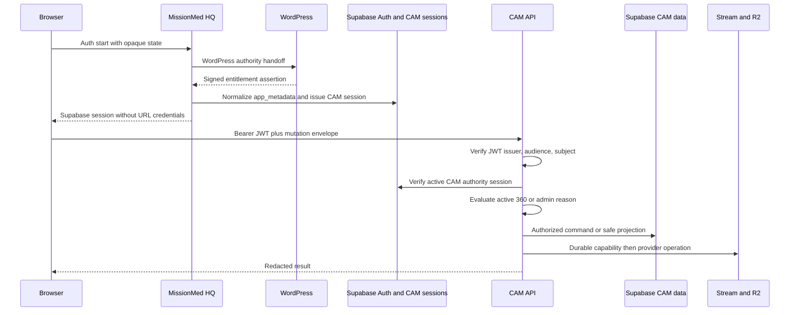

# Y2-3100 Discovery Synthesis

## Truthful Result

`DISCOVERY_COMPLETE_WITH_INTEGRATION_BLOCKED`

The CAM donor provides mature identity, entitlement, persistence, media, review, deletion, and audit boundaries. It does not contain an adaptive interviewer runtime. The isolated Phase 0 Brain failed the frozen central-capability gate, so this synthesis is a map for the next research ticket, not an authorization to integrate.

## Verified Authority Sequence

- **VERIFIED:** Matrix and Arena are launch adapters, not identity or entitlement authorities.
- **VERIFIED:** CAM API is the public policy gateway; provider credentials remain server-side.
- **UNKNOWN:** The exact tracked canonical source corresponding to the inspected accepted 4008A candidate remains unresolved.

## Blueprint Mapping

| Blueprint capability | Repository reality | Classification |
|---|---|---|
| Browser interview room | CAM has capture views and a capture FSM, but no adaptive WebRTC room | Foundation donor only |
| MissionMed Brain | Isolated deterministic Phase 0 harness | Killed by frozen central-capability gate |
| Transcription | Source placeholder exists but is unmounted and excluded | Inactive |
| Session ledger | Isolated file ledger only; not CAM or CIE integrated | Research harness |
| Persona and interview plan | Versioned synthetic harness contracts; CAM has four scripted cards | Research only |
| Model adapter | Public interface exists, but no provider-backed semantic implementation was certified | Partial foundation |
| Voice and avatar | Typed inactive adapters | Inactive |
| Stream and R2 | Durable media and sidecar donors exist | Production CAM donor |
| Mentor review | Exact grants, notes, one Order, safe projections | Production CAM donor |
| CIE timeline/Moments | Separate foundation contracts, no Y2 runtime integration | Future boundary |

## Additive Integration Sketch

If a later capability gate passes, the smallest bounded architecture is:

1. Add server-side default-off interviewer flags and health readiness.
2. Add immutable interview session, turn-event, ledger-revision, consent, visibility, and transcript-revision contracts.
3. Reuse JWT, CAM authority sessions, entitlement, mutation envelopes, receipts, audit, exact grants, Stream/R2 capabilities, and deletion closure.
4. Keep the Brain worker isolated behind an internal job/command contract with no public credentials or broad service-role access.
5. Register every artifact in deletion closure before enabling writes.
6. Run synthetic DEV shadow evaluation only; no student-visible output.
7. Add human reviewer projection only after exact-grant, privacy, and educational-validity gates.
8. Make student activation a separate release decision.

## Contradiction Register

- **VERIFIED:** There is no mounted interviewer route or interviewer persistence table.
- **VERIFIED:** The visible "Interviewer" step is scripted `cast`/`meet`, not adaptive conversation.
- **VERIFIED:** `PACKS` is empty and disabled.
- **VERIFIED:** Transcript and RISE routes are unmounted.
- **VERIFIED:** No runtime consent-receipt table or route was found.
- **VERIFIED:** No reusable `PersonaPanel` component was found.
- **VERIFIED:** Current Stream MIME validation is video-oriented; generic audio-only upload is not an existing contract.
- **VERIFIED:** No WebRTC/TURN/LiveKit/egress configuration or worker service exists in the inspected CAM source.
- **VERIFIED:** The Brain holdout result forbids Y1 integration, voice, avatar, pilot, staging, and production.
- **UNKNOWN:** The inspected accepted CAM candidate has not been proven to be the exact tracked canonical source.
- **UNKNOWN:** The isolated Y2 Engineering OS registration receipt is not merged into current MissionMed_OS authority.

## Workstream Decision

| Workstream | Decision |
|---|---|
| Y2-3100 discovery | Complete with named unknowns |
| Y2-3101 Phase 0 Brain | `KILL_RULE_TRIGGERED` |
| Y2-3102 ten-student pilot | Not authorized and not ready |
| Y1 CAM integration | Not started and not authorized |
| Voice/avatar/vendor work | Inactive |
| Production or staging | Untouched |

## Exact Next Ticket

`Y2-3103: Provider-Neutral Semantic Model Adapter Bakeoff and New Frozen Holdout`

It must first repair protected-topic authority, sensitive-data minimization, Unicode/code-switching support, encoded-injection handling, model/claim provenance, and ledger concurrency. It must then evaluate at least one genuinely semantic provider-neutral adapter against a newly frozen, independently authored holdout. The opened Y2-3101 holdout must not be reused for tuning.
