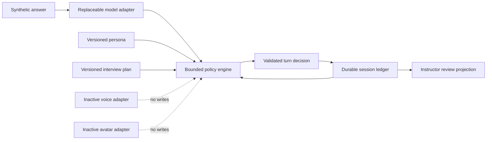

# Y2-3101 Brain Architecture

## Purpose

The harness proves the shape of a MissionMed-owned, provider-neutral, text-only Interviewer Brain. It is an isolated research foundation, not a student-facing runtime and not evidence of production readiness.

## Components

| Component | Location | Responsibility |
|---|---|---|
| Brain coordinator | `interviewer-brain/src/brain.mjs` | Validates persona/plan binding, invokes analysis and policy, resolves evidence, commits atomically |
| Rule model adapter | `interviewer-brain/src/adapters/ruleModelAdapter.mjs` | Deterministic bounded text feature extraction; no network |
| Policy engine | `interviewer-brain/src/policyEngine.mjs` | Selects the next move, enforces caps and guardrails |
| Session ledger | `interviewer-brain/src/fileSessionLedger.mjs` | Hash-chained events/revisions, atomic file replacement, idempotency and stale-writer rejection |
| Ledger reducer | `interviewer-brain/src/ledgerState.mjs` | Claims, callbacks, threads, STAR coverage, reconnect state |
| Contracts | `interviewer-brain/src/contracts.mjs` | Runtime field authority, versions, exact keys, hashes and prohibited language |
| Grounding | `interviewer-brain/src/grounding.mjs` | Persona/plan/focus evidence references |
| Instructor projection | `interviewer-brain/src/instructorReport.mjs` | Concise event/evidence/rationale view without private reasoning |
| Inactive capabilities | `interviewer-brain/src/adapters/inactiveCapabilityAdapter.mjs` | Fail-closed typed voice/avatar boundaries |

## Decision Flow

1. Load and validate immutable persona and plan assets.
2. Start a synthetic session with configuration hashes in the ledger.
3. Analyze the untrusted learner text through the replaceable model adapter.
4. Select one bounded move through MissionMed policy.
5. Resolve every selected grounding ID against the authorized evidence catalog.
6. Validate the structured decision and commit event plus state revision atomically.
7. Project only structured evidence, selected rationale tags, and guard results for instructor review.

## Y1 Integration Boundary

Future integration must adopt Y1 CAM authentication, active-session checks, purpose-specific consent, deletion closure, audit, explicit review grants, and protected media capability issuance. The Phase 0 harness creates none of those authorities. It emits synthetic contracts that can later be translated behind an additive, default-off Y1 adapter.

## What the Architecture Proved

- Durable deterministic state can govern callbacks across process restart.
- Every committed decision can be tied to configuration versions and evidence references.
- Probe caps and forbidden-claim rules can be enforced outside a provider.
- Model, voice, and avatar providers can remain replaceable.
- Instructor visibility does not require private chain-of-thought.

## What the Architecture Did Not Prove

- General answer-specific semantic adaptivity.
- Robust contradiction classification beyond narrow deterministic patterns.
- Full STAR targeting on unseen language.
- Voice, interruption, latency, ASR, TTS, or provider recovery.
- Production persistence, Y1 authorization, consent, deletion, or RLS integration.

The frozen holdout demonstrated that the architectural boundaries are useful but the current deterministic analysis/policy implementation is not sufficiently capable for expansion.
