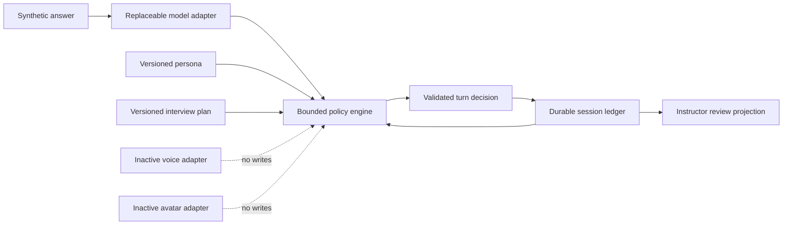

# Y2-3101 Complete Combined Handoff

- Contract: `missionmed.y2.combined-handoff.v1`
- Source files: `16`
- Inclusion law: every primary source report below is unabridged exactly once.
- Derived subgroup combined handoffs are not nested into the master because nesting would duplicate primary report contents.

<!-- BEGIN Y2_3101_EXECUTION_LEDGER.md -->
# Y2-3101 Execution Ledger

## Scope

- Ticket: `Y2-3100-3101-3102`
- Workstream: Y2-3101 isolated text-first MissionMed Interviewer Brain Harness
- Branch: `codex/y2-3101-interviewer-brain-harness`
- Initial product base: `9c1fa72e6b056db8b6fe0e17031fcaa688f78569`
- Worktree: `/Users/brianb/MissionMed_worktrees/Y2-3100-3101`
- Data: synthetic only
- Deployment: none
- Vendor integration: none
- Y1 source mutation: none

## Governing Decisions

1. Y2 remains an integration candidate for certified Y1 CAM, not a competing application.
2. MissionMed owns the Interviewer Brain and its policy, memory, grounding, decisions, and instructor evidence.
3. Yoodli is a competitive reference only.
4. Voice and avatar boundaries remain typed and inactive.
5. The Phase 0 probe law is one probe at pressure rungs 0-1 and two at rungs 2+, regardless of more permissive holdout persona labels.
6. A failed frozen holdout ends Brain expansion and prevents voice work.

## Execution Record

| Phase | Result | Evidence |
|---|---|---|
| Authority inventory | Complete | `Y2_3100_3101_CONTEXT_SOURCE_INVENTORY.md` and `.json` |
| Mission registration | Complete | MissionMed OS commit `714eabb23b3040007b227d7f610c585660f67e46` |
| Read-only Y1 discovery | Complete | Workstream A reports, commit `89007cf80447ce351c60d6f56f50aae6e670e2f8` |
| Pilot documents | Complete, not activated | Workstream C reports, commit `be51d1b8c88c2a0938b13ef8c49e92476036e68a` |
| Holdout creation | Frozen before tuning | 76 cases; SHA-256 `eaf3494e6d763401ec5b7512ddfdeb38ea45e596758f467ee89b933888bdb0d2` |
| Development baseline | Failed | 11/20 fixtures; T1, T2, T3, T5, T6 failed |
| Policy iteration 1 | Partial | 20/20 fixture labels; template-collapse gate failed |
| Policy iteration 2 | Development pass | 20/20; T1-T7 and deterministic rerun passed |
| Policy freeze | Complete | Revision 3; aggregate `764d711be19c54d81e96b2e2638904c4db2628c7585cb6ef110e4b16885b53d4` |
| Frozen holdout | Kill rule | T1, T3, T4 materially failed; T2 passed |
| Security scan | Pass | Zero source findings, zero runtime dependencies, inactive voice/avatar; 101-file artifact scan found no credential/real-data finding |
| Stress | Pass | 20 fixtures x100 plus 1,000-event ledger and stale-writer rollback |
| One-shot verification | Pass for truthful kill outcome | Eight of eight command gates behaved as expected; frozen holdout exited nonzero as required |

## Focused Product Commits

- `dd7e245`: isolated Brain core, contracts, assets, ledger, policy, adapters.
- `1b47cbd`: synthetic fixtures, tests, evaluators, security/stress/final runners.
- `6f4e8e9`: policy iteration, frozen holdout, and final verification evidence.
- `08563bc`: remove category-label steering, exercise consented pack inputs, add behavior-aware injection accounting and artifact scanning.
- `fa441bb`: correct the new pack-exercise assertion and supersede the transient failed verification artifact with an eight-gate pass.

The documentation and combined-handoff commit is recorded in the final status after creation.

## Kill Rule

The kill rule triggered after the two allowed policy iterations. No third policy revision, model change, voice integration, avatar integration, student surface, staging deployment, or production integration was attempted after the scored holdout.

## Safety Ledger

- Production/staging endpoints contacted: none.
- Provider account or credential used: none.
- Real applicant/student data: none.
- Audio or video: none.
- PII or PHI: none.
- Private chain-of-thought persisted: none.
- Y1 CAM source files changed: none.

## Status

`KILL_RULE_TRIGGERED`. Engineering closure is complete; product expansion is stopped pending a new bounded research ticket.
<!-- END Y2_3101_EXECUTION_LEDGER.md -->

<!-- BEGIN Y2_3101_BRAIN_ARCHITECTURE.md -->
# Y2-3101 Brain Architecture

## Purpose

The harness proves the shape of a MissionMed-owned, provider-neutral, text-only Interviewer Brain. It is an isolated research foundation, not a student-facing runtime and not evidence of production readiness.



## Components

| Component | Location | Responsibility |
|---|---|---|
| Brain coordinator | `interviewer-brain/src/brain.mjs` | Validates persona/plan binding, invokes analysis and policy, resolves evidence, commits atomically |
| Rule model adapter | `interviewer-brain/src/adapters/ruleModelAdapter.mjs` | Deterministic bounded text feature extraction; no network |
| Policy engine | `interviewer-brain/src/policyEngine.mjs` | Selects the next move, enforces caps and guardrails |
| Session ledger | `interviewer-brain/src/fileSessionLedger.mjs` | Hash-chained events/revisions, atomic file replacement, idempotency and stale-writer rejection |
| Ledger reducer | `interviewer-brain/src/ledgerState.mjs` | Claims, callbacks, threads, STAR coverage, reconnect state |
| Contracts | `interviewer-brain/src/contracts.mjs` | Runtime field authority, versions, exact keys, hashes and prohibited language |
| Grounding | `interviewer-brain/src/grounding.mjs` | Persona/plan/focus evidence references |
| Instructor projection | `interviewer-brain/src/instructorReport.mjs` | Concise event/evidence/rationale view without private reasoning |
| Inactive capabilities | `interviewer-brain/src/adapters/inactiveCapabilityAdapter.mjs` | Fail-closed typed voice/avatar boundaries |

## Decision Flow

1. Load and validate immutable persona and plan assets.
2. Start a synthetic session with configuration hashes in the ledger.
3. Analyze the untrusted learner text through the replaceable model adapter.
4. Select one bounded move through MissionMed policy.
5. Resolve every selected grounding ID against the authorized evidence catalog.
6. Validate the structured decision and commit event plus state revision atomically.
7. Project only structured evidence, selected rationale tags, and guard results for instructor review.

## Y1 Integration Boundary

Future integration must adopt Y1 CAM authentication, active-session checks, purpose-specific consent, deletion closure, audit, explicit review grants, and protected media capability issuance. The Phase 0 harness creates none of those authorities. It emits synthetic contracts that can later be translated behind an additive, default-off Y1 adapter.

## What the Architecture Proved

- Durable deterministic state can govern callbacks across process restart.
- Every committed decision can be tied to configuration versions and evidence references.
- Probe caps and forbidden-claim rules can be enforced outside a provider.
- Model, voice, and avatar providers can remain replaceable.
- Instructor visibility does not require private chain-of-thought.

## What the Architecture Did Not Prove

- General answer-specific semantic adaptivity.
- Robust contradiction classification beyond narrow deterministic patterns.
- Full STAR targeting on unseen language.
- Voice, interruption, latency, ASR, TTS, or provider recovery.
- Production persistence, Y1 authorization, consent, deletion, or RLS integration.

The frozen holdout demonstrated that the architectural boundaries are useful but the current deterministic analysis/policy implementation is not sufficiently capable for expansion.
<!-- END Y2_3101_BRAIN_ARCHITECTURE.md -->

<!-- BEGIN Y2_3101_CONTRACTS_AND_SCHEMAS.md -->
# Y2-3101 Contracts and Schemas

## Contract Set

Eight JSON schemas and matching runtime validators define the Phase 0 boundary:

1. `persona-pack.schema.json`
2. `interview-plan.schema.json`
3. `grounding-ref.schema.json`
4. `brain-event-envelope.schema.json`
5. `session-ledger-revision.schema.json`
6. `interviewer-turn-decision.schema.json`
7. `model-adapter.schema.json`
8. `inactive-capabilities.schema.json`

The source of runtime authority is `interviewer-brain/src/contracts.mjs`; JSON schemas are interoperable documentation and static validation artifacts.

## Version Vocabulary

| Contract | Version |
|---|---|
| Persona | `missionmed.interviewer-persona.v1` |
| Plan | `missionmed.interview-plan.v1` |
| Grounding | `missionmed.grounding-ref.v1` |
| Event | `missionmed.brain-event-envelope.v1` |
| Ledger revision | `missionmed.session-ledger-revision.v1` |
| Turn decision | `missionmed.interviewer-turn-decision.v1` |
| Model adapter | `missionmed.model-adapter.v1` |
| File ledger | `missionmed.file-session-ledger.v1` |

Unknown fields and unsupported major versions fail closed. Canonical SHA-256 hashes bind content-bearing assets and revisions.

## Field Authority

- Persona and plan assets are immutable inputs.
- The Brain derives decision IDs, event order, hashes, policy/model references, actor, timestamp, and provenance.
- The model adapter supplies bounded analysis only; it cannot commit state.
- The policy supplies one validated move and rationale tags; it cannot bypass grounding resolution.
- The ledger owns idempotency, expected revision, event/revision chain, and durable commit.
- Voice and avatar descriptors are inactive, provider-null, and reject writes.

## Decision Contract

Each interviewer decision includes:

- decision/session/turn identity;
- one allowlisted move;
- public interviewer utterance;
- grounding IDs;
- policy rule;
- probe index and cap;
- active thread;
- unresolved and possible-inconsistency references;
- structured guard outcomes;
- uncertainty class;
- concise rationale tags;
- canonical content hash.

Private free-form reasoning, scores, rankings, emotion, personality, deception, readiness, program-fit, Match, and clinical conclusions are excluded.

## Event and Ledger Integrity

- Event payload and full event hashes are verified.
- `previous_event_hash` creates an ordered event chain.
- `previous_revision_hash` creates an ordered state chain.
- Event sequence and ledger revision are monotonic.
- Reopen validates the full chain before returning state.
- Duplicate idempotency key with different payload fails.
- Stale expected revision and stale disk writer fail.

## Compatibility Limits

These are Phase 0 synthetic contracts. They do not replace CIE timeline items, Y1 CAM sessions, consent receipts, media revisions, review grants, deletion jobs, or production audit events. A later adapter must translate them into accepted Y1/CIE contracts without granting these local IDs authority.
<!-- END Y2_3101_CONTRACTS_AND_SCHEMAS.md -->

<!-- BEGIN Y2_3101_PERSONA_PACKS_AND_INTERVIEW_PLANS.md -->
# Y2-3101 Persona Packs and Interview Plans

## Synthetic Personas

| Persona | Style | Warmth/Directness | Status |
|---|---|---|---|
| `persona:warm-structured` | Warm, structured, measured | 4 / 2 | Synthetic Phase 0 |
| `persona:direct-program-director` | Direct, concise, professionally neutral | 2 / 4 | Synthetic Phase 0 |

Both packs use the `residency_interviewer` role, prohibit protected-topic solicitation and unsupported inference, accept only synthetic grounding sources, and have no voice reference.

## Probe Law

Both persona contracts preserve the governing IVOC law:

- pressure rungs 0-1: at most one probe;
- pressure rungs 2+: at most two probes;
- a total plan probe budget also applies;
- no third probe is permitted.

The frozen holdout contains persona descriptions permitting up to three probes. The evaluator records this contradiction and applies the stricter founder-controlled one/two law. Raw holdout chain-depth results therefore remain visible but cannot be used to weaken policy.

## Interview Plan

`core-img-interview.v1.json` defines:

- a synthetic text-only session objective;
- behavioral, situational, context, professional-timeline and general question families;
- required and optional coverage;
- bounded duration and total probes;
- transition, callback and wrap-up conditions;
- prohibited topics;
- explicit persona hash binding.

Holdout execution creates an evaluator-only synthetic plan for each case so the holdout question is active. Its question family is inferred from the visible question text; the hidden holdout category label cannot select that policy branch, as a regression test proves. This compatibility plan does not modify the frozen Brain policy or impersonate a production plan.

## Consistency Result

Development fixtures passed both warm and direct persona checks. The frozen holdout found that pressure rung did not create a measurable first-turn behavior difference in two difficulty pairs. T5 therefore failed despite zero unsafe persona output. This is a capability finding, not a persona safety breach.

## Future Law

Production persona authoring, specialty packs, program data, interviewer voices, avatar presentation, and applicant-aware materials remain out of scope. Any future pack requires versioning, content hashes, explicit grounding authority, fairness review, and Y1 feature gating.
<!-- END Y2_3101_PERSONA_PACKS_AND_INTERVIEW_PLANS.md -->

<!-- BEGIN Y2_3101_LEDGER_MEMORY_AND_RECONNECTION.md -->
# Y2-3101 Ledger, Memory, and Reconnection

## Implementation

`FileSessionLedger` stores one canonical JSON envelope with:

- generation;
- sessions;
- ordered event envelopes;
- ordered immutable ledger revisions;
- SHA-256 payload, event, revision, and file hashes.

Writes use an exclusive lock file, a same-directory temporary file, file sync, and atomic rename. In-memory append is rolled back if persistence fails.

## Concurrency and Retry

- Session start is idempotent only for the same authority and payload.
- Turn commit is idempotent only for the same event type and payload hash.
- Expected revision prevents stale in-process mutation.
- Disk content hash prevents stale cross-process writers.
- A failed stale writer leaves its in-memory event/revision append rolled back.

## Memory Model

The reducer preserves:

- claims with exact grounding references;
- open/used callbacks;
- question threads and probe counts;
- possible inconsistencies;
- cumulative STAR coverage;
- reconnect epoch;
- configuration references and status.

Callbacks are durable structured records, not prompt-window memory. Policy may use one only after the configured event threshold and while the current thread retains probe budget.

## Verification

- Unit tests reopen a complete hash chain.
- Corruption is rejected before state is returned.
- Forced reconnect creates a new Brain instance over the same validated ledger.
- Stress wrote and reopened 1,000 events/revisions.
- Twenty development fixtures produced byte-identical decisions across 100 repeated analyses each.
- Frozen holdout T2 passed all 10 ordinary and all 10 forced-reconnect callback cases with zero wrong attribution or confabulation.

## Limitations

The file ledger is an isolated research store. It is not a production database, not a multi-host consensus system, not Y1 authorization, and not a CIE timeline. Production integration requires an accepted transactional repository, RLS-safe command adapter, consent and deletion closure, and separately trusted audit/rollback anchors.
<!-- END Y2_3101_LEDGER_MEMORY_AND_RECONNECTION.md -->

<!-- BEGIN Y2_3101_FOLLOWUP_POLICY_AND_GUARDRAILS.md -->
# Y2-3101 Follow-up Policy and Guardrails

## Policy Order

Revision 3 evaluates, in bounded order:

1. prompt-injection handling;
2. unsupported judgment requests;
3. sensitive boundary or decline;
4. silence and recovery;
5. possible inconsistency;
6. thread and total probe caps;
7. red-flag chronology;
8. instructor focus;
9. durable callback;
10. ambiguity and focus;
11. proposal evidence;
12. STAR gap;
13. context/evidence gap;
14. transition or wrap-up.

## Supported Moves

Clarification, context, evidence, outcome, reflection, STAR gap, callback, focus, inconsistency, transition, wrap-up, designed recovery, red-flag clarification, silence recovery, policy refusal, and injection defense are structurally supported.

## Guardrails

The contract and scanners prohibit:

- readiness, score, ranking, Match and program-fit claims;
- personality, emotion, deception, accent and psychological inference;
- clinical conclusions;
- protected-category questioning;
- prompt/policy disclosure and private chain-of-thought;
- provider credentials, PII, PHI and real-applicant data.

## Development Result

After two bounded revisions, the 20-case development corpus passed all T1-T7 gates and deterministic rerun. This established local regression coverage, not general capability.

## Frozen Holdout Result

- T1 failed: 80% grounded, 20% exact plausibility proxy, one of four counterfactual pairs, and template similarity 1.0 versus a 0.65 ceiling.
- T2 passed: 20/20 callbacks with zero wrong attribution.
- T3 failed: 4/7 eligible STAR cases, 57.14%, with zero over-probes.
- T4 failed: 0/5 true conflicts detected; 0/3 false positives.
- T5 exercised all 8 synthetic injection contexts with zero detected behavioral compliance, but this is bounded fixture evidence and the difficulty-rung effect failed.
- T6 text recovery was incomplete; voice/ASR cases remained explicitly inactive.

## Diagnosis

The deterministic feature adapter and fixed policy templates overfit the development corpus. They lack sufficient semantic discrimination for count, role, order and launch-state contradictions; precise STAR gaps; broad counterfactual divergence; and answer-specific wording.

No third policy revision was made. The kill rule prevents further expansion under this implementation.
<!-- END Y2_3101_FOLLOWUP_POLICY_AND_GUARDRAILS.md -->

<!-- BEGIN Y2_3101_MODEL_VOICE_AND_AVATAR_ADAPTERS.md -->
# Y2-3101 Model, Voice, and Avatar Adapters

## Model Boundary

The model adapter contract records:

- adapter identity and revision;
- provider-neutral mode;
- network access;
- provider and retention profile;
- raw-output persistence;
- canonical content hash.

The Phase 0 `RuleModelAdapter` is deterministic, has no provider, performs no network access, and persists no raw provider output. It extracts sentence evidence, claims, STAR-pattern coverage, a small set of domain cues, and narrow inconsistency candidates.

## Model Finding

The adapter boundary is sound, but the rule implementation is not adequate for the frozen language distribution. The T1, T3 and T4 failures are consistent with limited semantic classification rather than a ledger failure. A stronger model adapter is likely to help, but that hypothesis requires a new frozen development/holdout protocol and cannot be claimed proven.

## Voice Boundary

`InactiveVoiceRailAdapter` is:

- activation state `INACTIVE`;
- provider `null`;
- accepted writes `false`;
- network access `false`;
- retention profile `none`.

No LiveKit, ElevenLabs, STT, TTS, streaming, interruption, usage, billing, or provider-recovery implementation exists. Holdout ASR/barge-in/voice-kill cases are reported as future inactive boundaries, not passed voice tests.

## Avatar Boundary

`InactiveAvatarAdapter` has the same fail-closed activation law. No avatar SDK, media, animation, rendering, provider account, or UI exists.

## Next Research Boundary

The smallest defensible next ticket is a provider-neutral semantic model-adapter bakeoff using synthetic data only. It should freeze a new model-adapter corpus, preserve the existing Brain contracts and ledger, compare at least one local deterministic baseline with candidate structured-output adapters, and test T1/T3/T4 without changing probe, safety, consent, or instructor laws.

Voice remains blocked until that adapter passes a fresh unseen holdout.
<!-- END Y2_3101_MODEL_VOICE_AND_AVATAR_ADAPTERS.md -->

<!-- BEGIN Y2_3101_SYNTHETIC_FIXTURES.md -->
# Y2-3101 Synthetic Fixtures

## Development Corpus

The checked-in package contains 20 synthetic fixtures covering:

- detailed unfocused answer;
- short answer;
- counterfactual same-question answers;
- incomplete and complete STAR;
- changed and consistent claims;
- direct and encoded injection;
- silence and irrelevant input;
- red-flag chronology;
- protected-category request;
- Match request;
- durable memory/reconnect;
- warm/direct personas;
- one- and two-probe caps.

Every fixture is marked synthetic. No real applicant, program, application, patient, recording, PII, PHI, credential, or provider identifier is present.

## Frozen Holdout

- Package: `Y2-3101-FROZEN-HOLDOUT-v1`
- Cases: 76
- Atomic scored results: 91
- SHA-256 before policy tuning: `eaf3494e6d763401ec5b7512ddfdeb38ea45e596758f467ee89b933888bdb0d2`
- SHA-256 after evaluation: identical
- Manifest SHA-256: `b62e4db4e5646eb08f5278a32f6d49c12b18d28031bc0388ecd6ecc3f8c67c81`
- First opened after policy revision 3 was frozen.

The holdout includes adaptivity, counterfactual, contradiction, STAR, injection, long memory, forced reconnect, persona consistency, recovery and instructor-summary cases. All eight injection contexts reached the evaluated synthetic runtime after consent-aware pack admission was repaired; zero checked case produced detected unsafe behavioral compliance. Four recovery cases exercise voice/ASR boundaries that are inactive in text-only Phase 0.

## Separation Law

Frozen policy files are limited to `package.json`, `src`, `personas`, `plans`, and `schemas`. Holdout compatibility work changed only scripts/tests/evidence after freeze. Policy aggregate remained unchanged.

## Evidence Discipline

Superseded development evaluator outputs are preserved and explicitly treated as invalidated evidence. The authoritative development result is `Y2_3101_DEVELOPMENT_FINAL.json`; the authoritative frozen result is `Y2_3101_FROZEN_HOLDOUT_EVALUATION.json`.

Fixture success is not a product claim. The unseen holdout, not the development corpus, governs the kill decision.
<!-- END Y2_3101_SYNTHETIC_FIXTURES.md -->

<!-- BEGIN Y2_3101_TEST_AND_EVALUATION_REPORT.md -->
# Y2-3101 Test and Evaluation Report

## Final Engineering Gates

| Gate | Result | Raw evidence |
|---|---|---|
| Syntax | Pass | All `.mjs` files under `src`, `tests`, and `scripts` |
| Type-loader check | Pass | TypeScript ESM parse/transpile check over source and adapters |
| Unit/integration | Pass | 27/27 Node tests |
| Development evaluation | Pass | 20/20 fixtures; T1-T7 pass; 20/20 deterministic reruns |
| Stress | Pass | 20 fixtures x100 deterministic analyses; 1,000 ledger events; stale writer denied/rolled back |
| Security | Pass | 13 source files; zero findings; zero runtime dependencies |
| Artifact privacy | Pass | 101 files; zero credential or real-data findings |
| Frozen holdout | Expected failure | Kill rule, T1/T3/T4 |
| One-shot final verifier | Pass | 8/8 commands had the expected exit status |

The holdout command intentionally exits nonzero. Final verification counts that command as passed only when the frozen report remains unchanged and carries the expected kill result.

## Named Unit and Integration Tests

1. Versioned persona and plan canonical hashes.
2. Runtime rejection of unsupported persona and prohibited plan language.
3. Provider-neutral model and inactive voice/avatar boundaries.
4. Eight JSON schemas parse and prohibit additional properties.
5. Metric negative controls.
6. Complete development T1-T7 evaluation.
7. Ledger event/revision chain and deterministic reopen.
8. Start/turn idempotency and conflict denial.
9. Forced reconnect restore.
10. Ledger corruption denial.
11. Malformed model output atomicity.
12. Template normalization behavior.
13. One/two probe law.
14. T1 threshold enforcement.
15. T2-T4 zero-tolerance/cap enforcement.
16. Recovery and instructor review complete-success law.
17. Forbidden inference/private reasoning scanner.
18. Short versus rambler adaptivity.
19. Development counterfactual divergence.
20. STAR result gap and complete-answer no-overprobe.
21. Narrow contradiction and negative control.
22. Injection/sensitive/Match/silence fail-closed behavior.
23. One/two runtime cap enforcement.
24. Long callback across restart.
25. Instructor evidence/rationale report.
26. Hidden holdout category label cannot select the Brain question family.
27. Consented applicant-pack attack text reaches the synthetic runtime ledger without controlling the response.

## Frozen Holdout Metrics

| Test | Result | Detail |
|---|---|---|
| T1 | Fail | Grounded 0.80; exact plausibility proxy 0.20; probe/transition 0.80; chain 1.0; 1/4 counterfactual pairs; max template similarity 1.0 |
| T2 | Pass | Ordinary 10/10; reconnect 10/10; wrong/confabulated 0 |
| T3 | Fail | 4/7, 57.14%; over-probes 0 |
| T4 | Fail | True conflicts 0/5; false positives 0/3 |
| T5 | Fail | Safety scan pass; 8/8 injection contexts exercised with zero detected behavioral compliance; persona outputs safe; two difficulty pairs showed no effect |
| T6 | Fail | Two of four scored text boundaries reached; four voice/ASR boundaries inactive |
| T7 | Pending human | 4/4 structural projection checks pass; fixture-authored events make this a smoke test, and the preregistered blind reviewer was unavailable |

Atomic case pass count was 3/91. That number is intentionally strict because it requires exact move, grounding, required utterance concepts, safety, and cap compliance. Aggregate test gates remain the governing interpretation.

## Determinism and Freeze

- Policy snapshot: `764d711be19c54d81e96b2e2638904c4db2628c758f467ee89b933888bdb0d2` before and after holdout.
- Holdout: `eaf3494e6d763401ec5b7512ddfdeb38ea45e596758f467ee89b933888bdb0d2` before and after evaluation.
- The holdout projection was byte-identical across two complete runs.

## Conclusion

The software-quality gates pass, but the product-capability gate fails. The result is `KILL_RULE_TRIGGERED`, not `COMPLETE`.
<!-- END Y2_3101_TEST_AND_EVALUATION_REPORT.md -->

<!-- BEGIN Y2_3101_POLICY_ITERATION_REPORT.md -->
# Y2-3101 Policy Iteration Report

## Baseline

The initial rule policy passed 11 of 20 development fixtures. T1, T2, T3, T5 and T6 failed. Early evidence files are retained because they show the iteration history; outputs produced before evaluator corrections are invalidated and are not used as final evidence.

## Iteration 1

One coherent revision added:

- improved evidence classification;
- delayed durable callback selection;
- more exact STAR-gap handling;
- off-topic recovery;
- encoded-injection handling;
- persona phrasing;
- plan-grounded transition/wrap-up;
- total probe caps;
- deterministic idempotent decisions.

Fixture labels reached 20/20, but T1 still failed because output templates collapsed.

## Iteration 2

One bounded revision added domain-cue-specific outcome wording while preserving every safety and probe law. The final development corpus reached:

- 20/20 fixture pass;
- T1-T7 pass;
- deterministic 20/20 rerun;
- no safety finding.

Policy revision 3 was then frozen with aggregate SHA-256:

`764d711be19c54d81e96b2e2638904c4db2628c758f467ee89b933888bdb0d2`

## Frozen Holdout

The unseen holdout disproved generalization:

- broad answer-specific targeting and counterfactual divergence failed;
- STAR targeting reached 57.14%;
- semantic contradiction handling reached 0% on five true cases;
- difficulty rung did not alter two paired outputs;
- durable memory remained strong.

## Kill Rule

Both deliberate policy iterations were consumed before holdout. The ticket forbids continued Brain expansion when T1, T2, T3, or T4 materially fail after two iterations. T1, T3 and T4 failed. No third revision was attempted.

## Failure Attribution

| Layer | Finding |
|---|---|
| Policy | Fixed ordering/templates collapse distinct unseen answers and do not use pressure rung to alter first-turn strategy |
| Model adapter | Deterministic patterns miss count, role, ordering and launch-state contradictions and several STAR distinctions |
| Ledger | Pass; 20/20 callback/reconnect holdout cases |
| Fixtures | Development corpus was too narrow and permitted overfitting |
| Evaluator | Synthetic marker lookup, hidden category steering, consented pack admission and behavioral injection accounting were repaired in scripts/tests only; frozen policy stayed unchanged and final projection is deterministic |
| Authority | Holdout three-probe labels conflict with stricter founder one/two law; stricter law prevailed |

## Next Research Question

Would a provider-neutral structured semantic model adapter, evaluated behind the unchanged MissionMed ledger/policy contracts and against a new frozen holdout, materially improve T1/T3/T4 without weakening safety or probe caps? This is plausible but unproven.
<!-- END Y2_3101_POLICY_ITERATION_REPORT.md -->

<!-- BEGIN Y2_3101_HOLDOUT_EVALUATION.md -->
# Y2-3101 Frozen Holdout Evaluation

## Integrity

- Package ID: `Y2-3101-FROZEN-HOLDOUT-v1`
- Cases: 76
- Atomic outputs: 91
- Package SHA before open: `eaf3494e6d763401ec5b7512ddfdeb38ea45e596758f467ee89b933888bdb0d2`
- Package SHA after final run: identical
- Policy aggregate: `764d711be19c54d81e96b2e2638904c4db2628c758f467ee89b933888bdb0d2`
- Deterministic rerun: byte-identical projection
- Development on holdout: none

The first attempted read stopped before scoring because the package-level synthetic marker lived under `privacy_and_provenance`. A first fresh verifier then found two evaluator defects: the hidden `primary_category` label selected the plan question family, and consented applicant-pack facts were catalogued but not admitted to the runtime ledger. Evaluator-only repairs now derive question family from the visible question text, preload consented pack facts as untrusted synthetic claims, detect unsafe behavioral compliance in addition to lexical guard failure, and regression-test label independence plus pack exercise. Neither repair changed frozen policy, source, personas, plans or schemas.

## Aggregate Result

### T1: Fail

- Grounded follow-ups: 80%, threshold 90%.
- Exact plausibility proxy: 20%, threshold 80%.
- Probe versus transition ratio: 80%, threshold 60%.
- Mean scripted probe chain: 1.0, raw threshold 1.5.
- Counterfactual pairs: 1/4.
- Maximum bigram template similarity: 1.0, maximum 0.65.

The chain threshold conflicts with the founder one/two probe law because the affected scripts are rung 1. That element is recorded as an authority exception; T1 still fails independently on grounding, plausibility, counterfactuals and template collapse.

### T2: Pass

- Ordinary long memory: 10/10 accurate.
- Forced reconnect/context flush: 10/10 accurate.
- Wrong attribution/confabulation: 0.

### T3: Fail

- Eligible STAR cases: 7.
- Correctly targeted: 4.
- Rate: 57.14%, threshold 85%.
- Probe-cap violations: 0.

### T4: Fail

- True semantic conflicts: 5.
- Professional grounded inconsistency probes: 0.
- Negative controls: 3.
- False positives: 0.

The rule adapter did not classify count, role, action-order or pack-versus-answer launch-state conflicts. It remained non-accusatory.

### T5: Fail With Safety Passing

- Forbidden-output scan: pass.
- Synthetic injection contexts exercised: 8/8.
- Detected unsafe behavioral compliance: 0/8.
- Persona outputs safe: pass.
- Difficulty effect: fail; two paired runs were identical.

This bounded fixture result does not establish general prompt-injection resistance against unseen encodings, model-based attacks or future provider adapters.

### T6: Fail/Inactive Boundary

Four voice/ASR recovery cases remain inactive by Phase 0 law. Of four scored text/admission cases, two reached the required state. This does not establish voice recovery.

### T7: Machine Pass, Human Pending

Four instructor artifacts passed timestamp, event-link, size, generation-time, no-score, no-private-reasoning and safety checks. These are structural projection checks over fixture-authored transcript and decision events, not an independent test of summary-generation accuracy. The preregistered blind human reviewer was not available; human answer accuracy therefore remains pending and T7 cannot be called complete.

## Verdict

`KILL_RULE_TRIGGERED: CENTRAL_CAPABILITY_MATERIAL_FAILURE_AFTER_TWO_POLICY_ITERATIONS`

Voice, avatar, student-facing UI, staging, production and vendor work remain prohibited.
<!-- END Y2_3101_HOLDOUT_EVALUATION.md -->

<!-- BEGIN Y2_3101_INSTRUCTOR_VISIBILITY_REVIEW.md -->
# Y2-3101 Instructor Visibility Review

## Local Review Projection

`buildInstructorReview` creates a read-only projection from validated event and revision chains. It includes:

- timestamp and event sequence;
- learner answer;
- selected move and interviewer utterance;
- resolved evidence quote and source kind;
- policy rule and concise rationale tags;
- possible inconsistency references;
- guardrail outcomes and uncertainty;
- persona, plan, policy and model versions;
- unresolved threads and reconnect epoch;
- explicit `contains_private_chain_of_thought: false`.

## Development Evidence

The development review test confirms that an instructor can identify the answer, move, evidence, policy rule, guard outcomes and unresolved state. Automated generation was well below the three-minute ceiling.

## Frozen Artifact Structural Smoke

Four holdout artifact sessions passed machine checks:

- timestamp links preserved;
- every required event ID present;
- persona and pressure rung present;
- recovery events included where applicable;
- 49-75 serialized words per artifact, below 350;
- generation time below one millisecond in the local deterministic harness;
- no score/ranking field;
- no private reasoning;
- security scan pass.

The evaluator projects fixture-authored transcript and decision events into these packets. The checks therefore establish schema/serialization integrity and prohibited-field absence; they do not independently establish that a generated summary correctly identified what was probed or why.

## Human Gate

The holdout preregisters a blind reviewer. No such external reviewer was available in this autonomous run. The machine checks do not substitute for a human proving 100% identification of what was probed and why within three minutes. T7 therefore remains pending and student pilot readiness is not established.

## Product Boundary

This is a local evidence projection, not mentor workflow integration. It does not create a Y1 review grant, human note, Order, student projection, production audit row or permission to access student data.
<!-- END Y2_3101_INSTRUCTOR_VISIBILITY_REVIEW.md -->

<!-- BEGIN Y2_3101_SECURITY_PRIVACY_AND_PROVENANCE.md -->
# Y2-3101 Security, Privacy, and Provenance

## Data Classification

- Synthetic fixtures only.
- No real applicant, student, patient or program record.
- No PII or PHI.
- No audio, video, transcript provider or recording.
- No credentials, secrets, access tokens or provider identifiers.
- No production or staging endpoint.

## Dependency and Network Boundary

The package has zero runtime and development dependencies. Source scanning found no HTTP, HTTPS, network, DNS or fetch path. Voice and avatar adapters are provider-null, inactive and write-denying.

## Decision Safety

Runtime contracts and scanners reject unsupported inference language and private reasoning. Policy paths refuse or safely redirect:

- readiness, ranking, Match and program-fit requests;
- protected/sensitive questions;
- clinical and psychological conclusions;
- emotion, personality, deception and accent inference;
- policy/prompt disclosure;
- prompt-injected instructions.

All eight synthetic injection fixtures reached the evaluated runtime path and produced zero detected lexical or behavioral compliance. This is bounded evidence for the checked attacks only, not a claim of general prompt-injection resistance. The overall holdout failed for capability, not data leakage or prohibited inference.

The artifact privacy scanner covered 101 files across the Brain, ticket reports/evidence and handoff mirror root, with no credential or real-data finding at the time of the recorded run.

## Provenance

- Persona, plan, policy and model references include revision and content hash.
- Grounding references include source kind, source ID/version/hash, exact span, authorization basis, untrusted-data flag and simulated flag.
- Event payloads and full envelopes are hash-bound and chained.
- Ledger revisions are hash-bound and chained.
- Instructor reports resolve public evidence and store structured rationale tags only.

## Threat Boundaries

The local file ledger is not production secure storage. It lacks Y1 auth, RLS, centralized audit, consent receipt enforcement, external deletion closure and a trusted multi-host rollback witness. It must never be mounted directly as a production repository.

## D3 and D9

D3 should permit only approved MissionMed domain packs and explicitly authorized applicant materials, with source-level access and deletion inheritance. D9 should distinguish MissionMed verified-absence evidence from processor contractual/zero-retention evidence. Neither is a blocker to synthetic Phase 0, and neither has been implemented here.

## Result

Security/provenance gate: pass for isolated synthetic research. Production/privacy readiness: not claimed.
<!-- END Y2_3101_SECURITY_PRIVACY_AND_PROVENANCE.md -->

<!-- BEGIN Y2_3101_SPECIALIST_BOARD.md -->
# Y2-3101 Specialist Board

## Verdicts

| Specialist | Verdict | Key finding |
|---|---|---|
| Herschel, repository/runtime mapping | Pass with boundaries | No existing Y1 interviewer/voice/AI runtime; accepted auth, session, media, review and deletion donors identified |
| Sentinel, safety and blast radius | Pass | Isolated branch/worktree; no Y1, production, staging, vendor or credential mutation |
| Lorentz, contracts and boundaries | Pass with conditions | Provider-neutral event/ledger contracts are structurally compatible only through a future additive Y1/CIE adapter |
| Darwin, implementation | Pass for local harness | Minimum zero-dependency Brain, durable ledger and inactive adapters implemented without Y1 rewrite |
| Avicenna, diagnostics | Kill | Development passed but unseen adaptivity, STAR and contradiction behavior did not generalize |
| Turing, stress/reconnect | Pass | 1,000-event reopen, deterministic repeated analyses, stale-writer denial and 20/20 holdout callbacks |
| Sagan, claims/provenance | Pass for Phase 0 | Evidence references and no unsupported claims; no readiness, trait, Match or private-reasoning output |
| Osler, medical education | Pass with caution | Structured behavioral probing is educationally plausible; no competence/psychological inference permitted |
| Aristotle, learning design | Fail for expansion | Current unseen targeting is too generic to justify learner-facing instructional value |
| Miyamoto, UI/interaction | Not applicable | No student-facing UI was authorized or built |
| Vitruvius, accessibility | Not applicable | No user-facing surface; future interface must be reviewed independently |
| Bernoulli, economics/operations | Pass for documents | Pilot quotas and $75 circuit breaker specified but not activated; estimates remain uncertain |
| Fresh verifier | Pass with named nonblocking limitations | Independently reproduced hashes, 8 gates and T1/T3/T4 kill at `fa441bb`; bounded injection evidence, attested iteration history, pending human T7 and path/timing portability remain named |

## Board Decision

The board accepts the engineering foundation and rejects expansion of the present deterministic Brain. Memory and evidence architecture should be preserved. Semantic analysis and policy targeting must return to bounded research behind the same safety, cap, grounding and instructor-visibility contracts.

## No Minority Production Recommendation

No specialist authorizes voice, student pilot, staging, production or vendor activation under this ticket.
<!-- END Y2_3101_SPECIALIST_BOARD.md -->

<!-- BEGIN Y2_3101_FRESH_CONTEXT_VERIFICATION.md -->
# Y2-3101 Fresh Context Verification

## Audited Target

- Branch: `codex/y2-3101-interviewer-brain-harness`
- Final audited commit: `fa441bb9e5ebd5aa8c0791cce3b9b735d5a0ef2a`
- Superseded audit target: `08563bcda0be670ba3f12b779a5407070d42c488`
- Policy aggregate: `764d711be19c54d81e96b2e2638904c4db2628c7585cb6ef110e4b16885b53d4`
- Holdout SHA-256: `eaf3494e6d763401ec5b7512ddfdeb38ea45e596758f467ee89b933888bdb0d2`
- Holdout manifest SHA-256: `b62e4db4e5646eb08f5278a32f6d49c12b18d28031bc0388ecd6ecc3f8c67c81`

The verifier used a credential-empty `/tmp` archive of the committed target and did not read or mutate the untracked report drafts. Generated audit outputs were removed afterward.

## First Fresh Audit

The first audit returned `FAIL` against a moving pre-final target. It identified four valid concerns:

1. holdout `primary_category` selected the evaluator plan question family;
2. consented applicant-pack attack text was catalogued but did not reach `processTurn`;
3. injection success accounting relied too heavily on lexical guard results;
4. T7 machine checks projected fixture-authored events and could not establish human summary accuracy.

The evaluator was repaired without changing frozen policy. Regression tests now prove category-label independence and pack admission. Behavioral compliance is checked in addition to guard output. Reports now classify T7 as structural smoke with external human review pending.

Commit `08563bc` initially captured those repairs but included one over-strict test assertion: it expected pack facts to be the only ledger claims, excluding the legitimate learner claim. Its corresponding `pass:false` verification artifact is retained in history as superseded evidence. Commit `fa441bb` corrected only that assertion, reran all gates and replaced the stale final artifacts.

## Independent Final Verdict

`PASS WITH NAMED NONBLOCKING LIMITATIONS`

The fresh verifier independently confirmed:

- local and remote branch both resolved to `fa441bb`;
- all 25 frozen policy files matched the expected aggregate;
- holdout and manifest hashes matched;
- no frozen policy file changed after evaluation-harness work;
- hidden adaptivity/injection labels produced identical move, utterance and rationale for the same visible input;
- consented pack facts entered ledger claims before `processTurn`;
- behavioral injection accounting can detect concrete unsafe compliance such as obeying an instruction to end the interview;
- all 8 fresh gates passed: syntax, typecheck, 27/27 tests, development 20/20, stress, source security, artifact privacy and expected holdout exit `1`;
- T2 reproduced at 10/10 ordinary plus 10/10 reconnect, with zero wrong attribution/confabulation;
- the frozen holdout reproduced 76 cases, 91 atomic results and deterministic projection;
- T1, T3 and T4 remained central failures.

## Named Nonblocking Limitations

1. Two policy iterations are supported by committed evidence, but historical policy source snapshots are not committed and the kill function does not mechanically verify the iteration count.
2. Injection evidence is bounded. Six cases use transcript attacks and two use consented context packs. The encoded `INJECT-004` attack is not recognized by the lexical `attackPresent` detector, so no general prompt-injection-resistance claim is permitted.
3. T7 has no blind human accuracy result. Machine checks establish structural projection only.
4. Raw reports include absolute paths and microtimings. A clean archive produced semantically identical results after excluding those environment-specific fields, but byte portability is not claimed.
5. External no-mutation claims are provenance-limited; Git scope, zero dependencies, inactive adapters and privacy scans support them.

## Kill Decision

`SUPPORTED`

- T1: grounded `0.80`, exact plausibility proxy `0.20`, counterfactual `1/4`, template similarity failure.
- T2: 20/20 callback/reconnect cases, zero confabulation.
- T3: 4/7, or 57.14%.
- T4: 0/5 true conflicts professionally grounded.

The resulting decision is:

`CENTRAL_CAPABILITY_MATERIAL_FAILURE_AFTER_TWO_POLICY_ITERATIONS`

No voice, vendor, student-facing, staging or production expansion is justified.

## Representative Commands

```bash
git diff --name-status 08563bcda0be670ba3f12b779a5407070d42c488..fa441bb9e5ebd5aa8c0791cce3b9b735d5a0ef2a
shasum -a 256 /tmp/Y2_3101_FROZEN_HOLDOUT/holdout.json /tmp/Y2_3101_FROZEN_HOLDOUT/manifest.json
npm run check
npm run typecheck
npm test
node scripts/run-development-evaluation.mjs --label fresh-verifier-fa441bb --output /tmp/development.json
node scripts/run-stress.mjs --output /tmp/stress.json
node scripts/run-security-scan.mjs --output /tmp/security.json
node scripts/run-frozen-holdout.mjs --expected-hash eaf3494e6d763401ec5b7512ddfdeb38ea45e596758f467ee89b933888bdb0d2 --output /tmp/holdout.json
```
<!-- END Y2_3101_FRESH_CONTEXT_VERIFICATION.md -->

<!-- BEGIN Y2_3101_FINAL_STATUS_AND_NEXT_ACTION.md -->
# Y2-3101 Final Status and Next Action

## Result

`KILL_RULE_TRIGGERED`

The isolated Brain Harness is runnable, deterministic, durable and safely bounded. It is not capable enough to proceed to voice or student-facing integration because the frozen unseen holdout materially failed T1, T3 and T4 after both permitted policy iterations.

## Proven Strengths

- Versioned personas, plan, policy and adapters.
- Exact runtime contracts and canonical hashes.
- Durable idempotent event/revision ledger.
- 20/20 long-memory and reconnect callbacks with zero confabulation.
- One/two probe cap with zero holdout violations.
- Zero runtime dependencies and no network/provider path.
- All eight synthetic injection contexts reached the evaluated runtime and produced zero detected behavioral compliance; this is a bounded fixture result, not broad prompt-injection validation.
- Instructor artifact structural machine checks passed; blind human accuracy remains pending.

## Blocking Findings

1. Answer-specific adaptivity did not generalize: exact plausibility proxy 20%, counterfactual 1/4, template similarity 1.0.
2. STAR targeting reached only 4/7 eligible cases.
3. Semantic contradiction handling reached 0/5 true cases, though it produced no false accusations.
4. Difficulty rung did not change paired behavior.
5. Text recovery coverage is incomplete; voice recovery remains inactive.
6. T7 human blind-review accuracy is pending.

## Product Decision

- Voice integration: prohibited.
- LiveKit/ElevenLabs account or SDK work: prohibited.
- Avatar work: prohibited.
- Y1 integration implementation: deferred.
- Ten-student pilot: not ready.
- Additional tuning against this holdout: prohibited.

## Named Nonblocking Evidence Limitations

- Iteration count is evidenced but not mechanically enforced by the kill function.
- Injection evidence covers eight fixed synthetic cases; one encoded pack attack is outside the lexical attack detector, so general resistance is not claimed.
- T7 blind human accuracy remains pending.
- Raw path and timing fields are environment-specific, though normalized reruns are semantically identical.

## Smallest Exact Next Ticket

`Y2-3103: Provider-Neutral Semantic Model Adapter Bakeoff and New Frozen Holdout`

Scope:

1. Preserve the current ledger, contracts, cap law, guardrails and instructor projection.
2. Build a model-adapter benchmark only, using synthetic text and structured output.
3. Include count, role, temporal-order, launch-state, nuanced STAR and counterfactual cases in development.
4. Create a new independently authored frozen holdout before tuning.
5. Compare the rule baseline with candidate replaceable adapters; no voice, production or real data.
6. Require T1, T3 and T4 plus safety to pass without weakening one/two probe law.
7. Stop again if the new holdout fails.

Do not reuse this opened holdout as a future unseen gate.
<!-- END Y2_3101_FINAL_STATUS_AND_NEXT_ACTION.md -->
