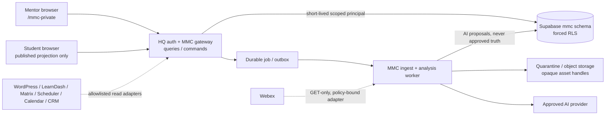

# 01 Executive Architecture Decision

RESULT: `ONE_CAM_V2_ARCHITECTURE_SELECTED`

## Decision

MMC will remain an authenticated, same-origin MissionMed HQ product surface, but the current monolithic execution topology will not become the production architecture. CAM v2 separates four bounded planes:

1. **Experience plane** — role-scoped mentor and student applications. The mentor application remains mounted at `/mmc-private/`; a future student route consumes only published projections. Neither browser receives privileged credentials or filesystem paths.
2. **Gateway and trust plane** — a thin MMC route module behind existing HQ session authorization, capability checks, CSRF, and no-index behavior. It exposes versioned queries and commands, validates object scope, and mints only short-lived role-specific RLS principals: mentor access is active-assignment scoped; student access is exact-subject and split into `publication_read`, typed `self_author`, and `respond` capabilities; workload access is job-lease/capability scoped.
3. **Canonical data plane** — additive `mmc.*` tables and transactional commands under forced RLS. Canonical objects, evidence, review decisions, publications, jobs, idempotency records, and audit events are distinct. Full-state browser synchronization is retired.
4. **Asynchronous processing plane** — a least-privilege MMC ingest/analysis worker with durable jobs, leases, retry, quotas, and opaque asset handles. Webex remains read-only. Media never passes through the browser or an arbitrary request-supplied local path.

## Why this is the selected path

The existing HQ mount already has valuable fail-closed controls in `missionmed-hq/server.mjs:3078-3315`: route-specific authorization, disabled-by-default persistence, short-lived RLS JWTs, and no browser service-role path. Replacing that shell would create needless auth and ecosystem risk. Keeping filesystem scanning, Webex downloads, OpenAI calls, and multi-row persistence inside synchronous HTTP requests would preserve the highest-risk defects in `missionmed-hq/routes/mmc-coaching-pipeline.mjs` and `missionmed-hq/lib/mmc-coaching-import-worker.mjs`. The split architecture preserves the good boundary and removes the wrong execution ownership.

The mounted client under `missionmed-hq/public/mmc-private/` is the sole current implementation authority. `mmc-v1-core/` becomes a frozen behavioral oracle. `/mmc-partner-demo/` is preserved only as historical synthetic feature archaeology; its design is rejected and has zero target-authority weight. They must not evolve as three independent product implementations.

## Non-negotiable trust rules

- An AI result begins as an immutable proposal. It cannot affect briefing, risk, readiness, actions, memory, or student publication until its evidence is verified and a named mentor approves it.
- A browser assertion is never identity evidence. Only source-specific server adapters may create attested evidence envelopes.
- “Verified” applies to a specific claim or subject link and names the verifier, evidence, time, and scope; it is never a blanket domain badge.
- Unknown remains unknown. Sensitive disclosure count, meeting count, or record count may not masquerade as risk, readiness, or relationship trust.
- Student visibility is a separate versioned publication object, not a boolean on mentor-owned data.
- Every mutation is a versioned command with idempotency, authorization, audit, and a per-object result.
- Canonical multi-object mutation, idempotency result, lineage, audit, and outbox commit in one database transaction; external effects alone use sagas.
- Worker jobs use workload identity plus CAS lease-generation fencing and consumer inbox deduplication; stale workers cannot commit.
- Fixture, local, staging, and live modes are structurally isolated; an empty authoritative store stays empty.
- External sources remain read-only unless a separate owner grants authority. Webex policy is server-owned and request input can only narrow it.
- Separate server-attested authority grants gate acquisition, transcript processing, AI transfer, and publication; consent/title/sidecars/browser input never substitute.
- Initial student and sensitive browser responses are `no-store`; no durable offline sensitive cache exists without a separate encrypted-storage decision.

## Canonical operating model

The mentor loop is:

`TRIAGE → PREPARE → CONDUCT → CAPTURE → REVIEW → APPROVE → FOLLOW THROUGH → MEASURE → PREPARE AGAIN`.

The student loop is:

`UNDERSTAND PLAN → ACT → SUBMIT/UPDATE → ACKNOWLEDGE → REQUEST CORRECTION → SEE APPROVED PROGRESS`.

The pipeline loop is:

`DISCOVERED → QUARANTINED → PAIR/CONSENT VERIFIED → SUBJECT LINK VERIFIED → ANALYSIS QUEUED → AI PROPOSAL → EVIDENCE CHECKED → MENTOR REVIEWED → APPROVED OPERATIONAL → OPTIONAL STUDENT PUBLICATION`.

No single action combines identity approval, real analysis, operational promotion, and publication.

## Decision ledger

| ID | Decision | Status | Reason |
| --- | --- | --- | --- |
| ADR-005-01 | Keep the same-origin HQ mount as the experience/auth gateway. | ACCEPTED | Reuses proven private-route controls without broad auth rewiring. |
| ADR-005-02 | Move long-running media and AI work to a durable asynchronous processing plane. | ACCEPTED | Removes filesystem/provider work from request lifecycle and enables retry/idempotency. |
| ADR-005-03 | Use versioned commands and canonical records, not whole-state synchronization or full event sourcing. | ACCEPTED | Fixes concurrency/deletion defects without imposing an unnecessary event-sourced rewrite. |
| ADR-005-04 | Publish immutable student projections from an allowlist. | ACCEPTED | Prevents mentor-note and unreviewed-AI leakage. |
| ADR-005-05 | Make evidence, review, sensitivity, and publication orthogonal state dimensions. | ACCEPTED | Avoids misleading omnibus statuses. |
| ADR-005-06 | Separate mentor work from role-gated Pipeline Operations. | ACCEPTED | Preserves cognitive focus and tighter administrative authorization. |
| ADR-005-07 | Preserve historical migrations and add corrective migrations only. | ACCEPTED | Maintains history and follows MissionMed migration authority. |
| ADR-005-08 | Treat the current branch as implementation archaeology, not production certification. | ACCEPTED | Live credentials, consent authority, staging application, and production topology remain unproved. |
| ADR-005-09 | Use distinct mentor, student, operator, and workload principals; prohibit runtime service-role/BYPASSRLS. | ACCEPTED | Prevents confused-deputy and cross-role authority collapse. |
| ADR-005-10 | Use stage-specific Authority Grants and an advising-policy registry. | ACCEPTED | Evidence alone does not establish processing consent or safe advising. |
| ADR-005-11 | Adopt single-writer v1→v2 cutover with no dual-write. | ACCEPTED | Prevents a second canonical fork during migration. |
| ADR-005-12 | Make student-authored goals/preferences/responses first-class, preserving authorship. | ACCEPTED | Student agency cannot be reduced to mentor-approved downstream status. |

## Authority boundaries

This architecture authorizes subsequent local implementation planning only. It does not authorize migration application, live AI, Webex pull, production credentials, deployment, shared auth/CSRF changes, Matrix changes, or writes to any protected external system. Any shared `missionmed-hq/server.mjs` modification requires a scoped decision record and broad regression proof.

## Architecture score

Current implementation architecture: **5.1/10**. Post-red-team proposed architecture specification: **9.2/10**, conditional on the release gates in reports 16, 18, 22, and 23. The proposed score describes the completeness and safety of this blueprint; it is not a claim that unimplemented code already passes.
