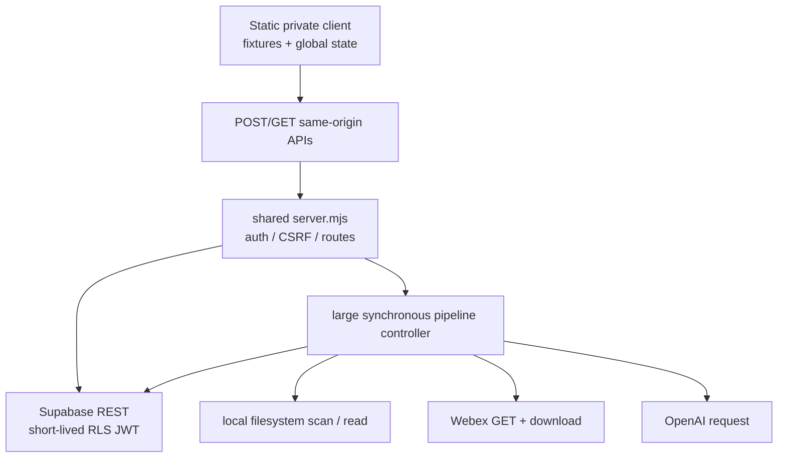

# 02 Current Reality and Gap Audit

RESULT: `CURRENT_REALITY_VERIFIED`

## Product and runtime reality

The canonical branch is a strong local engineering baseline, not a production-ready mentor operating system. The current product is a static JavaScript client seeded by fixtures, mounted by shared `missionmed-hq/server.mjs`, with same-origin persistence and coaching-pipeline APIs. Persistence defaults disabled. Preserved migrations describe 15 forced-RLS MMC tables but Prompt 004A did not apply them. The private route correctly redirects an unauthenticated local browser to WordPress authorization; the synthetic partner demo loads independently.

The code trace is:

## Classified findings

| Class | Finding | Evidence / consequence |
| --- | --- | --- |
| VERIFIED | Private mount is role/capability gated, no-index, and persistence is disabled by default. | `missionmed-hq/server.mjs:3078-3209` |
| VERIFIED | MMC uses an anon key plus short-lived RLS user token rather than a browser service role. | `missionmed-hq/server.mjs:3259-3315` |
| VERIFIED | Current client begins with fixture records and merges/hydrates authoritative state conditionally. | `missionmed-hq/public/mmc-private/src/mmc-ownership-layer.js:160-439` |
| VERIFIED | An authoritative empty array does not replace fixtures; fixture state can resurrect. | `mmc-ownership-layer.js:404-428` |
| VERIFIED | Whole-state optimistic writes have no version, rollback, deletion semantics, or per-record results. | `mmc-ownership-layer.js:508-570`; `server.mjs:3792-3868` |
| VERIFIED | Current Student View is static Amara fixture HTML, not an authenticated projection. | `missionmed-hq/public/mmc-private/index.html:1401-1584` |
| VERIFIED | Post-session action controls are rendered but their edits are not read on save. | `missionmed-hq/public/mmc-private/src/app.js:2069-2162` |
| VERIFIED | Raw live notes are copied into a potentially student-visible summary. | `app.js:2135-2162` |
| VERIFIED | AI analysis is persisted before review and the snapshot is hard-coded reviewed. | `missionmed-hq/routes/mmc-coaching-pipeline.mjs:1893-2182` |
| VERIFIED | Browser-entered roster JSON can be promoted as strong evidence; empirical local tests produced `VERIFIED` from fabricated unverified anchors. | `app.js:596-656`; `mmc-roster-verification-lane.mjs:161-297` |
| VERIFIED | Transcript resolution can read broad local paths, follows symlinks, and sends whole text to AI without an artifact broker. | `mmc-coaching-pipeline.mjs:1840-1890,2318-2496` |
| VERIFIED | Webex host matching, request-scoped paths/force, credential fallback, buffering, and overwrite behavior are unsafe for production. | `missionmed-hq/lib/mmc-webex-triggered-pull.mjs:13-35,193-303,416-524` |
| VERIFIED | Sequential multi-row analysis writes are nontransactional and non-idempotent. | `mmc-coaching-pipeline.mjs:1977-2182` |
| VERIFIED | The private product uses pointer-only controls, lacks a semantic dialog, and overflows at 390px; partner demo keeps a 980px floor. | `index.html:20-52,1591-1621`; `styles.css:19,32-36,323-333`; partner demo `index.html:37-49,258-263` |
| VERIFIED | Current screenshot 06 captured selected-student disagreement; later screenshots and the continuity validator show the repair. | Prompt 004A screenshot set and `missionmed-hq/tests/mmc-selection-continuity-validation.mjs` |
| LIKELY | Shared HQ is the correct long-term auth gateway. | It owns established session authorization; production deployment topology still needs platform proof. |
| UNKNOWN | Production student identity authority, student login host, consent basis, retention schedule, provider data terms, and approved source adapters. | No local artifact establishes these decisions. They are explicit future gates, not architecture blockers. |
| UNKNOWN | Whether MMC migrations exist in any shared staging database. | No credentialed inspection was authorized. |
| ASSUMPTION | Dr Brian remains the primary mentor/operator, students are likely mobile-first, and same-origin mediation remains the safest access pattern. | These shape the blueprint but require usability/platform validation before production. |
| PROTECTED | Matrix, Scheduler, Calendar, WordPress, LearnDash, Daily Drills, Webex account, R2, Stream, File Vault, shared auth/CSRF, production Supabase/Railway. | Read-only reference or no-touch until owner-specific authority. |
| OBSOLETE | Treating `mmc-v1-core/` or the partner demo as a coequal production UI. | Both remain valuable test/narrative evidence, not current runtime authority. |
| DO NOT TOUCH | Historical migrations, production data, credentials, media, `video_registry.json`, and protected bootstraps in this architecture run. | Preserved unchanged. |

## Current mentor reality

The intended loop is coherent: attention-ranked Directory, Profile, Call Prep, Session Command, Post-Session, Actions, and Meeting Intelligence. Selection continuity has a deterministic validator and currently passes. The strongest current product value is longitudinal context and a visible next-best-move concept.

The implementation still contains hard-coded students, fixed dates, static panels, inconsistent selector populations, placeholder live-capture text, a global `activeSessionId`, no multiple-session guard, and a long Pipeline Admin embedded inside Meeting Intelligence. Static counts and scores sometimes contradict fixtures. “Action” changes owner semantics across Quick Capture and session capture. These defects come from parallel fixture fragments, global state, and cloned surfaces—not merely styling.

## Current student reality

There is no student operating product. There is a static preview and a synthetic partner-demo projection. Current RLS denial of student access is the safe state. The architecture must add a separately authenticated, allowlisted, versioned publication read model before any student route is enabled.

## Current intelligence reality

Deterministic briefing functions are useful prototypes, but their formulas infer risk from sensitive disclosure count, reduce risk from meeting count, fabricate a nonzero goal baseline, and infer relationship trust from record counts. Outputs are labeled `VERIFIED` despite mixed fixtures and inference. Evidence items from AI are structurally checked, not verified against transcript spans. Consequential outputs currently cannot be treated as trustworthy operational intelligence.

## Current accessibility and responsive reality

Desktop information density is promising but visually noisy. Mobile is not an alternate interaction model; it is a clipped desktop canvas. Clickable `div` navigation and rows, placeholder-only labels, absent focus trapping/restoration, no live regions, very small muted text, and no reduced-motion behavior make WCAG 2.2 AA unproved and visibly unlikely. Existing tests have no accessibility or phone/tablet assertions.

## Why defects escaped validation

Current validators assert route hooks, source tokens, basic continuity, and safe static patterns. Separate private/core/demo implementations can each satisfy independent tests while their semantics drift. A render success does not prove selected-student consistency, saved edits, identity authority, AI review gating, responsive reflow, or persistence recovery. CAM v2 therefore adopts behavior/state fixtures, cross-layer contracts, browser assertions, accessibility automation, and failure injection as first-class release gates.

## Gap priority

1. **P0 trust and boundary closure:** local-file confinement, exact credential origins, server-attested identity, affirmative AI/Webex enablement, review-before-operation, fixture isolation.
2. **P0 canonical state:** commands, versions, idempotency, transactional promotion, publication projection, evidence spans.
3. **P1 operating experience:** semantic responsive shell, one-minute brief, pinned active session, post-session review, review inbox, separate Operations.
4. **P1 asynchronous pipeline:** durable queue, opaque assets, policy-bound Webex, retry/reconciliation, consent and retention gates.
5. **P1 student experience:** authenticated published projection, correction/withdrawal/acknowledgement, cross-student proof.
6. **P2 outcomes and polish:** calibrated outcomes, explainability, workload optimization, partner narrative adapter.

## Current baseline scores

| Dimension | Score | Why |
| --- | ---: | --- |
| Architecture | 5.1 | Strong local guardrails, wrong synchronous boundaries and state model. |
| UI | 5.8 | Distinctive dense desktop concept, inconsistent hierarchy and broken mobile. |
| UX | 5.0 | Coherent intent, substantial static/decorative and recovery gaps. |
| Security/privacy | 5.4 | RLS/auth foundation is real; file, credential, identity, AI-review, and publication gates are not production safe. |
| Accessibility/responsive | 2.4 | Major semantic, keyboard, contrast, focus, and overflow debt make the present core loop inaccessible to some users. |
| Mentor workflow | 6.2 | A visible loop exists, but state cannot yet be trusted end to end. |
| Student workflow | 2.0 | Preview only; no authenticated operating loop. |
