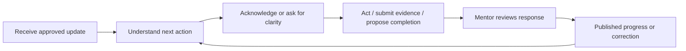

# 05 Student Experience and Visibility Constitution

RESULT: `STUDENT_PROJECTION_CONTRACT_DEFINED`

## Experience promise

The student should always understand what was agreed, what comes next, who owns it, when it matters, how progress is determined, and how to correct a misunderstanding. The student product is mobile-first, motivating without manipulation, and honest about uncertainty. It is not a filtered copy of the mentor console.

## Separate product boundary

The current static Student View at `missionmed-hq/public/mmc-private/index.html:1401-1584` is historical concept evidence only. It must not be incrementally connected to live state. CAM v2 introduces:

- separate authenticated student routes and principal resolution;
- student-specific RLS or a server-mediated equivalent proven by adversarial tests;
- an immutable, versioned `Publication` projection composed only of allowlisted `PublicationItem` records;
- exact subject, assignment, approver, approval time, source version, and policy version;
- correction, supersession, withdrawal, acknowledgement, and audit behavior.

Mentor-owned rows are never exposed by changing a visibility enum. Publication copies a reviewed, redacted representation into a student-owned read model. Current student denial remains the safe default until this exists.

## Student information architecture

The mobile bottom navigation has five destinations:

1. **Today** — up to three next actions, next deadline, and newly published mentor update.
2. **Plan** — goals and milestones with criteria, dates, owners, and plain-language progress.
3. **Tasks** — agreed commitments with acknowledge, clarify, submit evidence, and propose-complete actions.
4. **Updates** — versioned mentor-approved session summaries and feedback, with correction/withdrawal notices.
5. **Files** — only authorized submissions and their review state.

These are five information destinations, not necessarily five simultaneous 320px controls. At 390px and above the bottom bar is Today, Plan, Tasks, Updates, More (Files lives in More). At 320–389px it is Today, Plan, Tasks, More; More contains Updates and Files with the same stable URLs and no lost capability.

Notifications link to these objects and never reveal sensitive content on a lock screen. A privacy/activity area shows what was published, corrected, withdrawn, or acknowledged and who acted.

## Student operating loop

The student is a co-author, not only a downstream recipient. Canonical student-authored records cover stated goals, priorities, specialty interests, preferences, constraints the student chooses to disclose, communication preferences, reflections, blocker reports, completion attestations, consent choices, and notification choices. The student can say “This is not my goal,” decline, defer, renegotiate, propose an alternative, correct/withdraw their own statement, and request an escalation outside the challenged mentor. These actions never modify the mentor’s private source object. Mentor and student views reference the same bounded commitment identity while preserving separate authorship and review history.

`ACKNOWLEDGED`, `AGREED`, `DISPUTED`, `SELF_REPORTED_COMPLETE`, and `MENTOR_VERIFIED_COMPLETE` are distinct. The UI never converts acknowledgement into agreement or student attestation into mentor verification. Escalation ownership and policy are a required institutional dependency before live launch.

## Visibility lifecycle

The required business states are represented explicitly, with state transitions rather than a single enum forced onto every object:

`DRAFT → REVIEW_REQUIRED → APPROVED → PUBLISHED → ACKNOWLEDGED`.

Orthogonal restrictions are `MENTOR_ONLY` and `SENSITIVE`. Corrective terminal/branch states are `CORRECTED`, `SUPERSEDED`, `WITHDRAWN`, and `EXPIRED`.

| From | To | Authorized actor | Required proof |
| --- | --- | --- | --- |
| Draft candidate | Review required | mentor/system | source object, proposed redaction, reason |
| Review required | Approved | assigned mentor/admin by policy | explicit item-level decision and preview |
| Approved | Published | assigned mentor/publisher | current assignment, publication version, idempotency key |
| Published | Acknowledged | exact student principal | publication/item version |
| Published | Corrected/Superseded | assigned mentor/publisher | replacement link and correction reason |
| Published | Withdrawn | assigned mentor/admin | reason, immediate denial, audit event |
| Any eligible | Expired | policy/system | policy/date and non-destructive history |

Publication approval and publication execution are separate commands. Preview renders exactly the payload the student principal would receive, through the student authorization path—not through a privileged mentor DOM simulation.

Publication items are a kind-specific discriminated union—not arbitrary JSON or a pointer escape hatch. Each allowed kind (for example task, milestone, plan update, session summary, feedback, correction, or content-free withdrawal tombstone) has a bounded schema, safe plain-text limits, permitted source kinds/fields, and rendering rules. Every source version and embedded reference must bind to the publication's exact tenant/environment/subject; arbitrary object IDs, HTML, URLs, cross-subject references, and unknown fields are rejected. Sanitization is defense in depth after structural allowlisting. The human preview, committed serialization, and readback are compared through the exact student principal.

Assignment and student entitlement are separate authorities. An expired or revoked mentor assignment blocks that mentor's reads, commands, retries, and new publication immediately. It does not, by itself, erase or deny an exact student's previously published projection. The projection remains available only while its own publication, retention, correction, expiry, and withdrawal policies permit; every transition is audited and rendered truthfully.

## Absolute exclusions

The publication builder rejects:

- mentor memory, private notes, or “handle with care” context;
- raw audio/video/transcript or unrestricted transcript quotes;
- internal attention/risk rationale and confidence heuristics;
- unresolved/probable/conflicted identity;
- AI proposals or unverified evidence spans;
- cross-student references;
- private source paths, provider IDs, credentials, prompt internals, or operational logs;
- sensitive categories unless a distinct policy explicitly makes a safe redacted item eligible;
- new publication candidates authorized only by an expired/revoked assignment, or any fixture/live mode mismatch.

Eligibility is enforced in database/server contracts and tested with hostile payloads. Hiding fields in CSS or client code is not a control.

## Readiness and progress language

Students see objective milestone status, not a universal match-readiness score. Each domain states: requirement, current evidence, missing item, update date, and person/source responsible. “Unknown” and “waiting for review” are legitimate. Copy never guarantees matching, ranks peers, implies diagnosis, or labels a person high risk.

Progress celebrates verified completion and growth against the student’s own prior state. There are no peer leaderboards, guilt streaks, shame copy, or notifications that expose a negative label. A missed date becomes “This checkpoint needs a new plan” with a clarify/reschedule path.

## Correction and agency

Every summary/feedback item has “Ask a question” and “Request correction.” The student can identify the disputed sentence and add context. This creates a review item; it does not erase mentor history. Corrected versions prominently identify what changed. Withdrawn guidance disappears from every active-content endpoint immediately. A separate minimal activity tombstone may tell the previously authorized exact student only that an update was withdrawn, when, and the safe contact path; it contains none of the withdrawn content or private reason. Other principals receive an indistinguishable not-found response.

## Accessibility, privacy, and mobile rules

- 16px minimum form text on phones, 44×44px targets, semantic headings/forms/status, and no horizontal product overflow at 320/390px or 200% zoom.
- Plain language targets approximately eighth-grade comprehension unless official terminology is necessary and explained.
- Dates include timezone/locale; relative dates never stand alone.
- Sensitive notification bodies are generic by default; already delivered OS notifications cannot be remotely erased.
- Session timeout, shared-device sign-out, and screenshot/export policy require privacy review before live launch.
- A student can export their published plan/history and see retention/contact information without exposing mentor-only records. Exported, printed, screenshotted, or already displayed copies cannot be technically recalled; the product states this honestly.

Initial CAM v2 serves protected student content with `Cache-Control: no-store`, no Service Worker storage, and no durable sensitive browser cache. “Offline” means an honest unavailable state, not retained publication content. A future encrypted, device-bound cache requires a separate storage ADR, maximum TTL, reauthentication, reconnect invalidation, and disclosure that withdrawal cannot erase an already viewed copy.

## Proof of isolation

Release requires an automated RLS/server/browser matrix for: exact student with separately tested publication-read, typed-self-author, and respond capabilities; another student; assigned mentor; unassigned mentor; former mentor principal under expired/revoked assignment; exact student's still-eligible existing publication after mentor assignment expiry; administrator; anonymous; fixture/live mismatch; withdrawn active content and its content-free tombstone; superseded version; unreviewed AI; mentor-private object; cross-student embedded reference. Every forbidden case must produce no row and no metadata leakage. A single leak blocks release.

## Success criteria

- At least 90% of representative students identify their next action, owner, and date within 30 seconds.
- At least 90% correctly distinguish “published mentor guidance” from “student-reported progress.”
- Task acknowledgement/clarification is keyboard, touch, and screen-reader complete.
- A committed withdrawal denies every active-content read beginning after commit. Only the separately authorized content-free exact-student activity tombstone may remain; connected application cache/notification invalidation targets p95 <60 seconds. No false promise is made about a disconnected or exported copy.
- Zero private, sensitive, unreviewed-AI, unresolved-identity, or cross-student disclosures in the complete test matrix.
- Student comprehension and psychological-safety research includes IMG learners and differing English fluency; no production score is claimed before that research.

Target student workflow architecture score: **9.2/10**, conditional on authentication, policy, RLS, usability, and accessibility proof.
