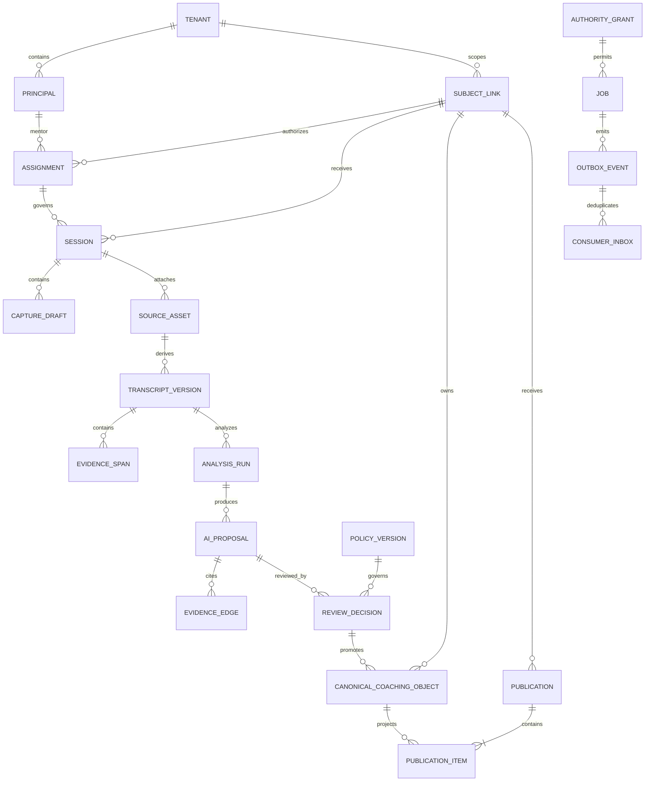

# 07 Canonical Object and State Architecture

RESULT: `CANONICAL_MODEL_DEFINED`

## Modeling decision

CAM v2 uses normalized canonical records plus immutable evidence/review/audit history and derived read projections. It does not use browser fixture arrays as authority, and it does not require a wholesale event-sourced rewrite. Commands update a bounded aggregate transactionally, record an audit event/outbox item, and return the new version. Projections can be rebuilt from canonical state and recorded decisions.

## Universal object envelope

Every persisted object carries the applicable subset of a base contract:

```text
id, tenant_id, subject_id?, assignment_id?, owner_principal_id
kind, schema_version, object_version
source_authority, source_ref?, source_observed_at?, source_hash?
environment, visibility, sensitivity, review_state, publication_state
freshness_state, effective_at, expires_at?, supersedes_id?, revoked_at?
created_by, created_at, updated_by, updated_at
correlation_id, last_command_id
```

This is a logical contract, not one nullable “god table.” Identity, coaching, evidence, job, policy, audit, and publication classes use kind-specific tables and required columns. Database constraints reject impossible combinations: a private note cannot have publication state; a mentor-authored coaching object requires tenant, environment, subject link, and active-at-write mentor assignment; a student-authored statement/response requires the exact resolved student principal plus current typed `self_author`/`respond` capability and policy but no mentor assignment; a publication item requires a publication and eligible approved source version; a job cannot change tenant/environment; fixture IDs cannot satisfy staging/live foreign keys. RLS uses both `USING` and `WITH CHECK`, plus transition guards for high-consequence states.

Factual assertions and AI-derived claims additionally require source/evidence span IDs, origin (`OBSERVED`, `DETERMINISTIC`, or `AI_PROPOSAL`), confidence method/value where meaningful, reviewer/decision, and correction chain. An explicit `HUMAN_JUDGMENT` instead requires the human author, rationale, advising-policy version, uncertainty, inputs considered, and decision; it cannot contain an unsupported factual assertion or inherit an AI/evidence badge. API resources expose opaque IDs and policy-filtered fields, never absolute paths or credentials. Mutation APIs are commands containing `command_id`, `idempotency_key`, `expected_version`, target, payload, and purpose; responses return per-object status, new version, audit ID, and retry/conflict information.

## Cardinalities and aggregate boundaries



Aggregate transaction boundaries are explicit:

- **Identity aggregate:** subject link + identity decision + assignment change + audit + outbox.
- **Session close aggregate:** session version + accepted coaching objects + proposal lineage + audit + outbox in one database transaction.
- **Publication aggregate:** publication/version/items + policy evaluation + audit + outbox in one transaction.
- **Job aggregate:** lease generation/state/attempt/result metadata + audit/outbox; external effects occur after commit and are reconciled.
- **Policy aggregate:** immutable policy version and activation decision; activation never rewrites prior decisions.

A saga is permitted only for external effects after a committed canonical transaction. It is not an alternative to atomic canonical promotion.

## Identity, access, and source objects

| Object | Owner/source authority | Lifecycle and review | Visibility/evidence | Correction/failure behavior |
| --- | --- | --- | --- | --- |
| Student (`Subject`) | Approved canonical identity source, not MMC | referenced → active → inactive/merged | Identifier-minimized; no confidence score | MMC cannot rewrite; source correction creates new subject-link decision. |
| Mentor (`PrincipalProfile`) | HQ/approved auth authority | active → suspended/revoked | Role/capability scoped | Auth source wins; profile cache expires/revalidates. |
| Subject Link | MMC decision over attested external anchors | unverified → probable/review/conflict → verified-local-link → revoked | Mentor/admin only; every anchor envelope and decision retained | Never call canonical identity; correction/revocation blocks downstream commands and starts reattachment review. |
| Assignment | MMC relationship authorization referencing source principals | proposed → active → expired/revoked/reassigned | Assigned mentor/admin; evidence is authority and date range | Optimistic version; expiry/revocation immediately denies that mentor's new reads/writes/retries/publications, without silently revoking the student's separately governed existing projection entitlement. |
| Meeting Source | External provider record via allowlisted adapter | observed → stale/disappeared | Operational roles; immutable provenance | Source disappearance preserves tombstone, never silently deletes history. |
| Source Asset | MMC ingest metadata; bytes in controlled storage | discovered → quarantined → pair/consent verified → attached → retained/expired | Operations only; hash, MIME, size, provider ref | Idempotent by source+hash; mismatch/conflict quarantines; opaque handle only. |
| Transcript | Controlled derived/source artifact | imported → chunked → verified → superseded/withdrawn | Restricted; consent/purpose/retention required | No broad path; hash/version correction; downstream claims become stale on supersession. |
| Transcript Chunk / Evidence Span | Deterministic broker/verifier | created → valid/invalid/superseded | Smallest permitted evidence projection | Quote must exact-match normalized bytes; invalid span blocks claim approval. |
| Authority Grant | Approved institutional/subject authority | proposed → active → expired/revoked | Typed scopes: acquisition, transcript processing, AI transfer, publication policy; server-attested source/basis/version/effective dates | Rechecked before download, provider transfer, promotion, publication; revocation fences later effects. |
| Advising Policy Version | Named clinical-education/domain owner | draft → reviewed → active → retired | Domain, approved source/version/date, eligible/prohibited inputs, allowed output, reviewer role, uncertainty/alternatives/expiry | Immutable; source expiry makes dependent recommendation stale; no AI activation authority. |
| Retention/Disposition Policy | Privacy/legal owner | draft → active → superseded/legal hold | Object class, copies/providers/caches/backups/audit, retention/purge/hold basis | Required before live data; disposition is audited and never implied by UI deletion. |

## Mentor and coaching objects

| Object | Owner/source | Lifecycle | Evidence/review/freshness | UI and failure behavior |
| --- | --- | --- | --- | --- |
| Session | Assigned mentor; scheduled source optional | draft → active → paused → review → closed/cancelled | Subject/assignment pinned; one active-session guard; durable save state | Session Command; resume after interruption; version conflict cannot change subject. |
| Observation | Observer/source | draft/imported/proposed → reviewed → accepted/rejected/superseded | Factual bounded claim with evidence; confidence method by source | History/evidence inspector; unsupported observations abstain. |
| Recommendation | Mentor or reviewed AI proposal | proposed → mentor-reviewed → active → completed/deferred/rejected/superseded | Rationale, evidence, counterevidence, scope, expiry | Shown as next move only when approved/current; never a permanent student trait. |
| Attention Signal (`Risk` replacement) | Deterministic policy over eligible objects | current → stale/cleared/superseded | Exact component reasons; no sensitive/session-count inputs | Today reason, not person badge; partial inputs suppress dependent conclusion. |
| Milestone Assessment (`Readiness` replacement) | Explicit rubric + evidence | unknown/partial/blocked/ready → superseded | Domain-specific; evidence coverage and date | Plan/brief; no universal match probability or default numeric baseline. |
| Task | Named owner | draft → accepted → in progress/blocked/completed/cancelled/superseded | Source and acceptance; due date/timezone; student/mentor projections differ | Plan/Work; retry safe; blocked/cancelled excluded from failure metrics. |
| Promise (`Commitment`) | Mentor or student owner | proposed → acknowledged → due/completed/renegotiated/withdrawn | Session/publication source; explicit owner and recipient | Work/Plan; mentor service debt separate from student follow-through. |
| Goal | Student/mentor jointly governed | proposed → agreed → active/paused/achieved/withdrawn | Meaning, owner, review date; no blanket verified flag | Plan; absent goal means unknown, not 35%. |
| Milestone | Goal/rubric owner | planned → evidence pending → met/not met/blocked/superseded | Verifiable criteria and evidence | Plan; progress derives only from eligible milestone states. |
| Open Loop | Derived or mentor-created tracker | open → waiting/blocked/resolved/dismissed/superseded | Reason, source objects, owner, next review | Today/Work; derivation version prevents duplicates. |
| Mentor Memory | Mentor | draft → confirmed → stale/corrected/archived | Mentor-only by default; source/purpose/age; sensitive sub-class | Private inspector; never directly publish; correction keeps history. |
| Private Note | Mentor | draft → saved → corrected/archived | Always mentor-private/sensitive as classified | Never eligible for publication or student queries. |
| Student-visible Summary | Publication candidate, not a visibility flag | draft → reviewed → publication item/withdrawn | Allowlisted redacted fields; approved evidence only | Post-session preview; cannot reuse raw notes. |
| Student Statement | Exact student principal | self-reported draft → submitted/active → corrected/withdrawn/superseded | Student-authored goal, preference, constraint, reflection, blocker; provenance and consent | Mentor cannot rewrite; may respond/reference under policy; escalation route preserved. |
| Student Response/Attestation | Exact student principal | proposed → acknowledged/agreed/disputed/self-reported-complete/withdrawn | Bounded response to publication/task; versioned authorship | Never auto-converts to mentor verification; duplicate-safe and correctable. |
| Student Consent/Notification Choice | Exact student plus policy authority | selected → active → changed/revoked/expired | Scope, purpose, channel/device, effective time; no dark pattern | Revocation affects future eligible operations; history retained minimally. |

## Intelligence, review, and control objects

| Object | Purpose and owner | Lifecycle | Invariants |
| --- | --- | --- | --- |
| AI Proposal / Claim | Immutable provider output tied to Analysis Run | generated → evidence checking → review → accepted/rejected/superseded | Cannot mutate canonical coaching state; prompt/model/run and evidence required. |
| Prompt Version | Admin-governed immutable definition | draft → tested → active → retired/rolled back | Activating changes future runs only; previous outputs retain exact version. |
| Analysis Run | Worker job over an exact asset/transcript version | queued → leased → running → proposed/partial/failed/cancelled | Idempotency/lease/attempt/cost/latency; never marks review itself. |
| Review Item | Queue entry for an authorized human | open → claimed → deferred/approved/rejected/escalated | Target/version/evidence/reviewer/decision; stale target forces re-review. |
| Review Decision | Immutable human decision | recorded → superseded/revoked | Names actor, role, purpose, exact input/output hashes, reason. |
| Intelligence Snapshot | Rebuildable approved read projection | current → stale → superseded | Contains only eligible approved objects; never the system of record. |
| Publication | Immutable student projection version | draft → approved → published → corrected/superseded/withdrawn/expired | Exact student principal, items, policy, hash, approver; deny by default. |
| Publication Item | Kind-specific allowlisted redacted copy | candidate → approved → published → withdrawn | Bounded discriminated schema and safe plain text; exact publication/source subject binding; no arbitrary pointer/HTML/URL/unknown field; source version retained internally. |
| Identity Candidate / Decision | Attested matching proposal and immutable human/system decision | candidate → probable/review/conflict/verified-local/rejected/revoked | No name/email/title-only verification; server evidence envelopes only. |
| Job / Operation | Durable async work | queued → leased → running → retry-scheduled/succeeded/failed/dead-letter/cancelled | Idempotency, lease expiry, attempt budget, safe resume, owner/SLO. |
| Outbox Event | Transactional downstream intent | pending → delivered/retried/dead-letter | Written in same transaction as canonical command. |
| Audit Event | Append-only accountability record | created; never edited | Actor/effective role/subject/assignment/action/purpose/object/before-after hash/correlation/outcome. |
| Notification | Policy-filtered pointer, not content authority | queued → sent/delivered/read/failed/withdrawn | Generic sensitive body; links reauthorize at open time. |
| Lineage Edge | System-owned immutable typed relation from source through publication | created → invalidated only through source revocation | `source → span → proposal → accepted object → snapshot → publication`, with transform/version; enables descendant traversal, staleness, revocation, and audit without deleting history. |

## Orthogonal state dimensions

One omnibus `status` cannot encode truth. Each object exposes only applicable dimensions:

| Dimension | Values |
| --- | --- |
| Environment | FIXTURE · LOCAL · STAGING · LIVE |
| Persistence | UNSAVED · SAVING · SAVED · RETRYING · CONFLICT · FAILED |
| Source authority | OBSERVED · IMPORTED · USER_REPORTED · DETERMINISTIC · AI_PROPOSAL · HUMAN_JUDGMENT |
| Freshness | CURRENT · STALE · EXPIRED · SOURCE_MISSING |
| Review | NOT_REQUIRED · REVIEW_REQUIRED · IN_REVIEW · APPROVED · REJECTED · SUPERSEDED · REVOKED |
| Identity | UNVERIFIED · PROBABLE · MANUAL_REVIEW · CONFLICT · VERIFIED_LOCAL_LINK · REVOKED |
| Sensitivity | NORMAL · RESTRICTED · SENSITIVE |
| Visibility | MENTOR_PRIVATE · OPERATIONS_RESTRICTED · PUBLICATION_CANDIDATE · STUDENT_PROJECTION |
| Publication | NOT_ELIGIBLE · DRAFT · APPROVED · PUBLISHED · ACKNOWLEDGED · CORRECTED · SUPERSEDED · WITHDRAWN · EXPIRED |
| Job | QUEUED · LEASED · RUNNING · RETRY_SCHEDULED · SUCCEEDED · FAILED · DEAD_LETTER · CANCELLED |

## Command and consistency rules

- `expected_version` conflicts return 409 with policy-filtered current/attempted versions; no silent last-write-wins.
- Tenant, actor, effective role, environment, subject authorization, and applicable assignment/grant are server-derived. The unique idempotency scope binds server-derived tenant + environment + principal + command kind + target + schema version + client key; its hash covers the complete normalized semantic command, including expected version, purpose, and payload. Retention exceeds the maximum retry/replay window. Same scope/key/same hash rechecks current authorization before returning a newly policy-filtered result; same scope/key/different hash returns 409. A revoked actor never receives cached protected output.
- Canonical multi-object approval uses one database transaction for object versions, idempotency result, audit, lineage, and outbox. External effects alone use a resumable saga.
- Deletes are normally state transitions/tombstones under retention policy; no source media deletion is implied.
- Fixture records cannot cross into staging/live tables, jobs, or publications.
- Query projection carries environment, freshness, and partial-section metadata. An empty list is authoritative.
- Reanalysis produces new proposals; it cannot overwrite accepted human objects.
- Student/mentor/worker clients never supply tenant or environment. Deployment/auth context binds them and composite foreign keys prevent cross-tenant/environment reference.
- One-active-session is a database uniqueness/transition invariant per mentor, with explicit lease/takeover recovery across devices.

## Failure invariants

No failure may change subject, broaden visibility, erase accepted input, duplicate an operation, convert unknown to verified, or label pending work saved. Revocation and correction propagate to projections and caches within defined SLOs while retaining audit history.

Implementation is staged: 006 starts with the minimum kernel named in report 21. Derived attention/readiness/open-loop/snapshot/notification concepts remain typed rebuildable projections until evidence justifies independent persistence. This object catalog is the final semantic authority, not an instruction to create one table per noun on day one.
