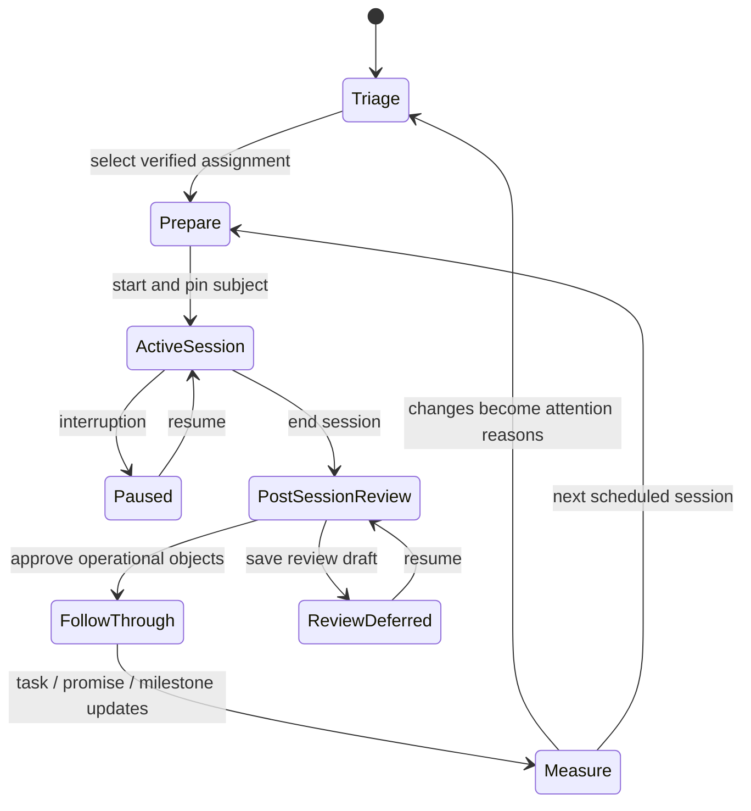

# 09 Mentor Operating Loop

RESULT: `END_TO_END_MENTOR_LOOP_SPECIFIED`

## State machine

Identity conflict, expired assignment, missing consent, unsupported evidence, persistence conflict, or permission loss branches to an explicit safe state; it never silently advances.

## 1. Triage

Today ranks actionable conditions. The first tier shows up to three rows and one upcoming-call brief; a clearly labeled disclosure exposes up to four additional rows without turning the first viewport into an alert wall. Each row includes:

- student and active assignment;
- reason now and category;
- source/review/freshness;
- owner and objective due date;
- one next action;
- inspect/correct/defer controls.

Priority is deterministic and explainable. Time-sensitive deadlines and overdue mentor obligations can outrank a student task. Sensitive context cannot contribute. Unknown data creates a data-sufficiency item, not a student-risk score.

## 2. Prepare

Prep loads from approved canonical objects and identifies partial/stale sections independently. It shows changes since the last approved session, commitments by owner, goal/milestone evidence, one proposed call objective, and private context. AI proposals are visibly proposals and excluded from the default call brief until approved. Dr Brian can pin objects, correct a claim, and accept/edit/defer the proposed agenda.

Entry gate: verified local subject link, active assignment, environment match, and authorization. Missing identity or assignment routes to Reviews, not a bypass.

## 3. Conduct and capture

Starting creates a versioned Session command and pins `subject_id`, `assignment_id`, objective, and start time. Navigation cannot silently switch the session student. Live capture supports typed semantic items and a free note stream. A network indicator distinguishes `SAVING`, `SAVED`, `OFFLINE/NOT SAVED`, and `FAILED`; no transient toast is the only proof.

Captures are drafts until post-session review. Initial CAM v2 has no durable sensitive offline browser store: when disconnected, the interface says that unsent memory-only content is **not saved** and may be lost on close or reload. Any later scoped/encrypted persistence requires a separate approved storage ADR and idempotent sync contract. Browser close/reload tests prove the exact behavior instead of promising recovery that does not exist.

## 4. Review

Post-Session Review compares:

- mentor-captured draft;
- deterministic extraction;
- evidence-checked AI proposals;
- prior canonical state.

It never copies raw notes into a publication candidate by default. Each proposed summary/action/promise/memory/open-loop/timeline event receives an individual decision, owner, due date, sensitivity, evidence, and optional publication candidacy. Rejection and defer are first-class. A stale source or changed assignment invalidates the review before commit.

## 5. Commit and publish separately

“Commit session” uses one database transaction to create only approved operational object versions, close the Session, record the idempotency outcome, and write audit, lineage, and outbox records. Publication candidates remain drafts. A separate publication workflow renders the exact student projection, requires another explicit capability/decision, and supports withdrawal.

The canonical mutation is all-or-nothing; inability to make that transaction atomic blocks implementation. If the response is lost after commit, the same server-derived idempotency identity returns the recorded result after current authorization is rechecked. Resumable sagas are permitted only for external effects driven from the committed outbox. No duplicate task or memory can result.

## 6. Follow through

Work groups objects by owner, due window, and consequence. Mentor promises receive equal visibility. Task state distinguishes blocked external dependency, renegotiated date, cancelled, disputed, and complete. Open-loop aging respects waiting states and escalation policy. A completion requires evidence or named human confirmation appropriate to the task; it does not increase a universal score.

## 7. Measure and learn

The loop learns from accepted/rejected AI proposals, corrected claims, alert usefulness, mentor prep time, post-session closure, commitment follow-through, student acknowledgement, and evidence-backed milestone transitions. It never optimizes for more sessions, more notes, more AI acceptance, or higher risk/readiness scores.

## Recovery cases

| Failure | Required recovery |
| --- | --- |
| Network lost during call | Mark unsent memory-only content `NOT SAVED`; reconnect idempotently or stop capture. Durable offline storage is absent in the initial release. |
| Page/tab closes | Resume exact session/draft or say what was lost; never create a second active session. |
| Assignment expires | Lock commands, preserve safe draft, clear protected cache, route to access review. |
| Student selection attempted | Require pause/end before switching; session subject remains immutable. |
| Commit response lost | Recheck current authority, replay the same idempotency identity, and read back the one atomic outcome; never imply a partial canonical commit. |
| Version conflict | Compare versions, reapply or discard; no automatic merge of sensitive/publication/identity fields. |
| Source becomes stale | Mark affected claims and recommendations stale; require refresh/re-review. |
| AI unavailable | Mentor loop remains functional; manual capture/review is the fallback. |
| Browser refresh during review | Restore durable review draft and focus, or clearly state absence. |

## Behavioral acceptance suite

- Representative triage cases meet the 60-second orientation goal.
- Subject ID remains identical across route, prep, session, captures, review, commit, and publication candidate.
- Two start clicks/tabs create one active session.
- Ten repeated command retries create one canonical object/version outcome.
- Edited action text, inclusion, owner, date, privacy, and evidence read back exactly.
- Rejecting one proposal cannot block or accidentally accept another.
- AI/provider failure cannot block manual session completion.
- Closing/reopening and offline/reconnect scenarios never lie about saved state.
- Mentor-only and sensitive content are absent from publication payload fixtures.
- Every state is keyboard, screen-reader, phone, tablet, laptop, and desktop complete.
