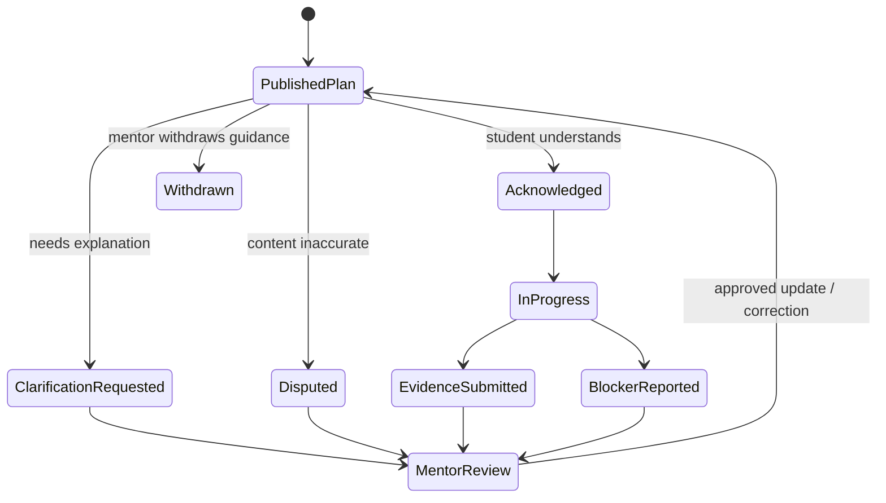

# 10 Student Operating Loop

RESULT: `END_TO_END_STUDENT_LOOP_SPECIFIED`

## State machine

These are student-projection and response states. They do not modify private mentor objects directly.

## 1. Receive

An authenticated student receives a generic notification pointing to a newly published object. Opening reauthorizes the exact principal and publication version. The interface displays publisher, date, source type appropriate for student viewing, and whether the update corrects/supersedes earlier guidance.

## 2. Understand

Today shows at most three next actions with verb, owner, date/timezone, why it matters in plain language, and related goal/milestone. Plan shows objective criteria and evidence; it does not show internal attention/risk logic or an unexplained readiness percent. Unknown and waiting-for-review remain explicit.

## 3. Acknowledge, clarify, or dispute

The student can:

- acknowledge understanding;
- ask a scoped clarification;
- propose a date change;
- flag a blocker;
- dispute an inaccurate sentence;
- request correction of a published record.
- state or revise their own goal, priority, preference, communication need, reflection, and permitted constraint;
- decline a recommendation, propose an alternative, or escalate an unresolved correction outside the mentor relationship under institutional policy.

Disagreement is safe and never contributes to negative scoring. `ACKNOWLEDGED`, `AGREED`, `DISPUTED`, `SELF_REPORTED_COMPLETE`, and `MENTOR_VERIFIED_COMPLETE` are separate states. Acknowledgement means received/understood, not agreement or completion. Students own versions/corrections/withdrawals of their own statements; mentors cannot rewrite them.

## 4. Act and submit

Tasks expose permitted actions for their type: start/in progress, submit a note or authorized file reference, propose completion, or report a blocker. Files retain their source system and review status. Submissions use versioned idempotent commands, preserve input on failure, and clearly state pending/saved/conflict. Student cannot mark mentor-owned tasks complete.

## 5. Mentor response

Student responses create mentor review/work items with age and SLO. A proposed completion becomes complete only when policy or a named reviewer accepts it. A blocker changes the task to blocked without treating it as failure. Correction requests show received, under review, resolved, or escalated.

## 6. Progress and continuity

The student sees evidence-backed milestone transitions, their self-reported state, mentor-verified completion where relevant, mentor promise state, and a privacy-safe history of published updates. Growth compares only with their own prior state and objective criteria. Any long-lag match outcome is descriptive and never attributed causally to MMC.

## Publication corrections

- `CORRECTED` creates a new active version and visibly names changed content.
- `SUPERSEDED` links old guidance to the replacement and removes it from active tasks.
- `WITHDRAWN` immediately denies the withdrawn active-content resource. A separate content-free activity tombstone may show the previously authorized exact student only that an update was withdrawn, when, and a safe contact path; unrelated/unauthorized principals receive an indistinguishable not-found response.
- `EXPIRED` leaves history but removes stale actionability.
- Connected caches/notification pointers receive best-effort invalidation within the security SLO. Initial release uses private `no-store` responses and no durable student Service Worker/cache. Disconnected, exported, printed, screenshotted, or already delivered copies cannot be remotely erased.

## Empty and failure behavior

First-use empty state explains that only eligible published and student-authored items appear and offers no fake fixtures. Filtered empty names filters. Initial-release offline state contains no protected cached publication content and explains that reconnection is required. Permission loss clears protected content without a flash. A conflict preserves a permitted student draft and current server version. Session expiry warns before timeout, offers safe extension/reauthentication, and returns to the same safe route after sign-in when policy permits.

## Psychological-safety language

- “Needs a new plan” replaces blame.
- “Waiting for mentor review” replaces failure when review is the blocker.
- “Evidence not yet available” replaces a fabricated score.
- Advice states its source/date and can be questioned.
- No peer rank, streak guilt, guaranteed-match copy, diagnostic language, inferred emotion, or shame notification.

## Acceptance suite

- 90% of representative students identify next action, owner, and date in 30 seconds.
- 90% distinguish mentor-published guidance, student-reported progress, and AI-assisted content after a short first-use explanation.
- Another student, anonymous principal, a former mentor after assignment expiry, a revoked active-content publication, and a cross-student embedded reference receive zero object/metadata. An exact student's separately governed existing publication entitlement is not silently revoked by mentor assignment expiry.
- A student can acknowledge, clarify, dispute, block, submit, and propose completion with keyboard, touch, and screen reader at 320/390px and 200% zoom.
- Duplicate click/retry creates one response; acknowledged writes survive reload.
- Every active-content read beginning after withdrawal commit is denied; only the separately authorized content-free exact-student activity tombstone may remain. Connected invalidation targets p95 <60 seconds; offline/export limitations are disclosed rather than falsely called erased.
- Private notes, sensitive context, raw transcript, internal attention, unresolved identity, prompt/model internals, and unreviewed AI are absent from every publication fixture.
- Blocked, disputed, cancelled, and externally dependent tasks are excluded from failure metrics.
- Student research includes IMG learners, differing English fluency, and accessibility needs before production certification.
