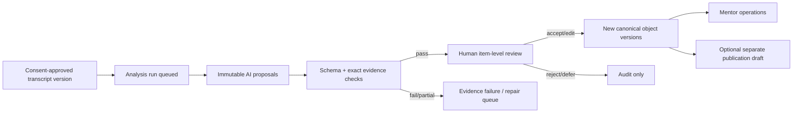

# 11 Trust, Evidence, Confidence, and AI System

RESULT: `HUMAN_GOVERNED_INTELLIGENCE_CONTRACT_DEFINED`

## Trust vocabulary

The current use of `VERIFIED` across local heuristics, configuration availability, identity, and briefing is retired. CAM v2 distinguishes:

| Origin/state | Meaning | May affect mentor operations? | May reach student? |
| --- | --- | --- | --- |
| Source observed | Attested adapter captured a bounded value | After scope/freshness rules | Only through approved projection |
| Deterministic derived | Versioned rule computed from eligible sources | If rule/output is approved and current | Only if explicitly eligible/published |
| AI proposal | Model-generated claim or suggested object | No | No |
| Evidence checked | Proposal’s cited spans and schema passed deterministic checks | No | No |
| Mentor approved | Named mentor accepted/edited the proposal | Yes, as a new canonical object | Still requires publication |
| Conflicted/stale/disputed | Support is contradictory, old, or challenged | Suppressed or review-only | Correction/status only as policy permits |

“Verified” is reserved for a bounded subject link, evidence span, or claim with named verification method—not a student or entire domain.

## Consequential claim envelope

Every recommendation, attention reason, milestone assessment, summary fact, action extraction, or relationship claim carries:

```text
claim_id · claim_type · text · origin · source_ids · evidence_span_ids
evidence_coverage · confidence_method · confidence_value?
observed_at · freshness_state · prompt_version? · model_id? · analysis_run_id?
review_state · reviewer_id? · reviewed_at? · decision_reason?
visibility · sensitivity · publication_state
supersedes_id? · disputed_at? · revoked_at?
```

Confidence is bounded to the specific claim. Numeric confidence is displayed only when its calibration method and sample are valid; otherwise use `SUPPORTED`, `LIMITED SUPPORT`, `CONFLICTED`, or `UNKNOWN` with explanation. Confidence never substitutes for review.

## Advising-policy registry

Evidence grounding does not make a recommendation educationally safe. Every consequential recommendation references an immutable active policy envelope:

```text
policy_id · advising_domain · approved_source/version/date · owner
eligible_inputs · prohibited_inputs · student_stated_goal/preferences
allowed_output_class · required_uncertainty · required_alternatives
expiry/review_date · reviewer_role · correction/escalation_path
```

Policies cover objective milestone guidance, deadline interpretation, application/interview/personal-statement advising categories, and student communication. Official NRMP/FREIDA/program guidance carries source date/expiry. Rank-list strategy, legal/immigration advice, clinical guidance, diagnosis, personality/motivation inference, and guaranteed-match language are outside AI output authority. Protected attributes and proxies cannot disadvantage attention or advice. A narrowly relevant, explicitly student-supplied eligibility fact requires consent, provenance, purpose, and explanation. A next-best move states how it fits the student’s stated goal, alternatives, counterevidence, uncertainty, and expiry.

## Evidence model

Transcripts are brokered into immutable chunks. An evidence span names asset/transcript version, chunk ID, normalized character/time range, speaker mapping, exact quote hash, source-observed time, and verifier version. Quote eligibility requires deterministic normalized exact match and valid offset/speaker attribution. Quote presence does not prove entailment, completeness, or absence of contradiction; those remain explicit support/contradiction/coverage checks and named human review. The UI may show the shortest necessary quote plus surrounding context under policy; it never shows a local filesystem path.

Non-transcript evidence uses an attested source envelope: adapter ID/version, approved source system, source record opaque ID/HMAC, observed time, read-authority decision, payload hash, field path, and freshness. Browser-authored JSON cannot create this envelope.

## Evidence inspector

The right inspector answers, in order:

1. What exactly is being claimed?
2. Is it observed, deterministic, AI-proposed, or human judgment?
3. Which source and exact span support it?
4. When was it observed, and is it stale?
5. What evidence is missing or contradictory?
6. Which prompt/model/run produced it, if any?
7. Who reviewed, edited, approved, disputed, corrected, or revoked it?
8. Can it affect operations or student publication?

The inspector supports open source context, mark unsupported, correct, dispute, supersede, and audit history. Source content is minimized and authorization is rechecked.

## Explanation views

- **Why this student needs attention:** transparent condition components, due date, owner, source age, exclusions, and correction. Never a personality label.
- **Why this changed:** before/after object versions, command/source event, reviewer, and timestamp.
- **Milestone readiness:** explicit rubric criteria, present/missing evidence, blockers, and unknowns; no holistic match probability.
- **Next best move:** objective, rationale, evidence/counterevidence, expected benefit, time horizon, alternatives, expiry, and mentor decision.

## AI lifecycle



AI writes only Analysis Runs, Proposals, and Evidence Claims. It cannot directly create active tasks, memory, open loops, risk/readiness signals, assignments, or publications. Accepting creates a new human-reviewed canonical version with source linkage. Reanalysis cannot overwrite that version.

## Provider and prompt controls

- AI enablement is an affirmative MMC-specific flag plus approved model registry; presence of any shared/fallback API key is insufficient.
- Dedicated least-privilege credential ownership replaces global key fallback; secrets are never returned or logged.
- Prompt versions are immutable, tested on a deterministic evaluation set, explicitly activated, and rollback affects future jobs only.
- Model allowlist, max input/output, chunking/map-reduce policy, timeout, retry budget, token/cost budget, provider retention/residency decision, and consent/minimization gate are mandatory.
- Transcript instructions are untrusted data. System prompt and schema prohibit following embedded instructions; adversarial prompt-injection fixtures are release blockers.
- Full-session coverage records which chunks were analyzed; head truncation is forbidden as silent completeness.

## Review experience

The review inbox groups proposals by session but decisions are item-level. Each shows claim, source quote, missing/conflicting evidence, confidence basis, sensitivity, suggested object/owner/date, policy version, and impact if accepted. Actions: accept, edit then accept, reject with reason, defer, request evidence, mark sensitive. Every edit is rechecked against evidence and policy. An unsupported factual assertion cannot be accepted under any origin. A mentor may author a recommendation or professional judgment that does not masquerade as an unsupported fact only as explicit `HUMAN_JUDGMENT`, with named rationale, policy version, uncertainty, and human accountability; it carries no AI/evidence badge. Original proposal, edit diff, and decision remain immutable. Bulk acceptance is disabled for identity, sensitive, publication, attention/readiness, and low-confidence claims.

The UI never labels a run “reviewed” because one item was reviewed. A run summary reports counts by state. A stale source or corrected transcript invalidates affected proposals and accepted derived objects according to policy.

## Low, missing, and conflicting evidence

- Missing evidence produces abstention and a review/data-sufficiency item.
- Low support cannot create an operational recommendation; it may suggest a question for the mentor if clearly labeled.
- Conflicting evidence displays both sources and blocks automatic promotion.
- A model’s self-reported confidence is never the displayed confidence method.
- Sensitive context may guide respectful phrasing after mentor confirmation but never numeric attention/risk.

## Rollback, correction, and override

Prompt/model rollback stops future selection; it does not rewrite history. A bad analysis run is revoked, its proposals removed from eligible projections, and every accepted descendant is marked for human reassessment—never silently deleted. A human override records actor, reason, before/after hash, evidence considered, and expiry. Corrections supersede immutable prior versions and notify affected publication workflows.

## Audit and evaluation

Audit records actor/effective role, subject, assignment, purpose, source, claim, action, before/after hash, correlation, prompt/model/run, and result. Evaluation measures exact-span rate, supported factual precision, unsupported-claim rejection, human edit distance, correction/revocation rate, confidence calibration by claim class, latency/cost, and disparate error patterns under approved governance. A high AI acceptance rate is not inherently success.

## Release gates

- 100% of eligible transcript evidence exact-matches stable spans.
- 0 unreviewed proposals in operational or student queries.
- 0 canonical duplicates after repeated analysis/retry.
- Malformed, injected, oversized, partial, and contradictory inputs fail closed to review.
- Every accepted AI-derived factual claim traces to evidence, run, review decision, and current source version. Every accepted `HUMAN_JUDGMENT` traces to its human author, rationale, policy, uncertainty, inputs considered, and decision; it may not contain an unsupported factual assertion or inherit an AI/evidence badge.
- Immutable lineage edges connect source → span → proposal → accepted object → snapshot → publication, so correction/revocation can find every descendant.
- Model/prompt rollback, revocation, correction, assignment expiry, and publication withdrawal pass end-to-end.
- Differential/adversarial advising evaluation covers IMG backgrounds, languages, visa situations, disability, gender, and other protected contexts under approved privacy governance; prohibited inference classes always reject.
