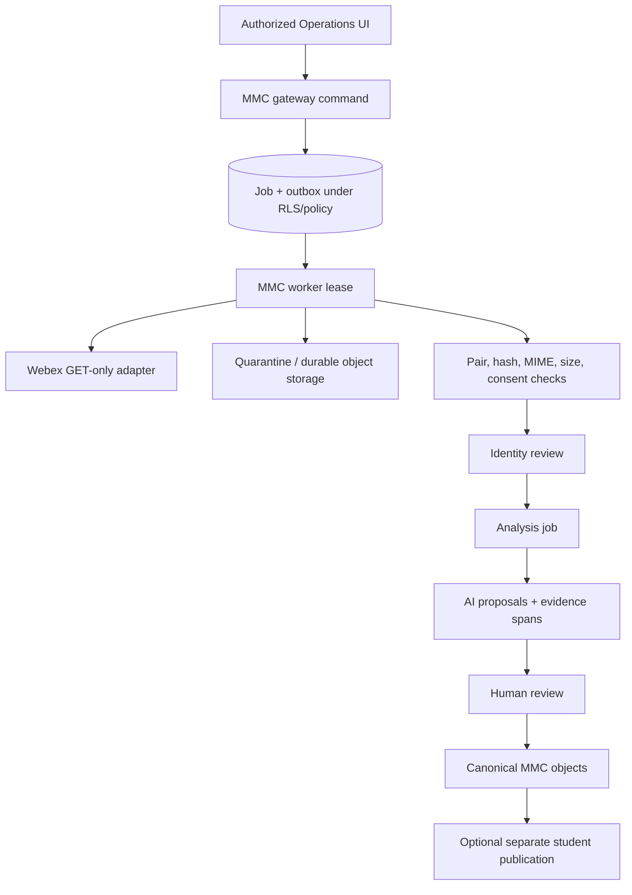

# 13 Webex, Media, and Coaching Pipeline Architecture

RESULT: `ASYNCHRONOUS_FAIL_CLOSED_PIPELINE_SELECTED`

## Topology

The shared HQ request server is not a filesystem bridge or media processor. It authorizes commands and returns redacted queries. A separate least-privilege MMC ingest/analysis worker uses a dedicated workload identity and lease-scoped RPC capabilities, consumes durable jobs, reads/writes only an approved encrypted quarantine/object-storage boundary, and persists through transactional command/RPC contracts. It never receives `service_role`, `BYPASSRLS`, table-wide access, or tenant/environment from payloads. Browser and request payloads use opaque asset handles only.



## Lifecycle

The product-facing lifecycle preserves requested labels while adding mandatory safety gates:

```text
DISCOVERED
→ TRIGGER ALLOWED
→ ACQUISITION AUTHORITY VERIFIED
→ DOWNLOADED TO QUARANTINE
→ PAIR COMPLETE / INTEGRITY VERIFIED
→ TRANSCRIPT PROCESSING AUTHORITY VERIFIED
→ IMPORTED
→ IDENTITY REVIEW
→ VERIFIED LOCAL SUBJECT LINK
→ ATTACHED
→ AI TRANSFER AUTHORITY RECHECKED
→ ANALYSIS QUEUED / ANALYZED TO AI PROPOSAL
→ EVIDENCE CHECKED
→ HUMAN REVIEWED
→ MMC PERSISTED AS APPROVED OBJECTS
→ PUBLICATION POLICY + EXACT APPROVAL VERIFIED
→ OPTIONAL STUDENT PUBLISHED
```

Metadata-only discovery may precede acquisition authority; content download may not. Trigger codes, titles, sidecars, filenames, and browser input carry zero consent/processing authority. Separate server-attested Authority Grants cover acquisition, transcript processing, AI-provider transfer, and publication policy. Each is rechecked immediately before download, provider send, canonical promotion, and publication, so mid-job revocation fences later effects. `DOWNLOADED`, `ANALYZED`, or `PERSISTED` never implies identity, evidence, human review, or publication approval. Every stage has owner, entry/exit invariant, timestamps, attempt, error class, and audit.

## Trigger policy

- `[MM-IGNORE]` always wins and cannot be overridden by request flags.
- Default allowed code remains `[MM-ADV]`; group/mock-interview/personal-statement codes require separately approved policy.
- Server configuration owns the allowlist. A request can narrow selection, never add triggers or use `force` to bypass disabled state.
- Matching is deterministic, case/whitespace behavior versioned, and title alone never verifies identity.
- Discovery is read-only and does not mutate Webex recordings, titles, retention, or settings.

## Webex adapter boundary

MMC uses a dedicated least-privilege credential only after explicit authority; no Scheduler/global fallback. Every token-bearing API hop uses an exact approved `https` origin. Redirect following is off by default; if an endpoint contract requires it, each destination origin is independently exact-allowlisted before any credential is forwarded. Suffix or dot-boundary host matching is never sufficient. Requests enforce timeouts, response/content-type allowlist, streaming byte quota, rate limits, and redacted errors.

Downloads stream over TLS to a random encrypted temporary object/file in a `0700` quarantine boundary with `0600` local content, calculate hash incrementally, fsync, verify declared/actual size and sniffed MIME, scan under a bounded malware policy, then atomically commit to a content-addressed object. Existing names are never overwritten; identical hash deduplicates, different hash creates conflict. Keys are environment/tenant scoped, managed/rotated by the approved KMS/storage authority, and never logged. Partial files are removed/quarantined according to policy without deleting provider data.

## Source/pair validation

Only server-configured roots or object-storage prefixes are valid. Request-supplied `dropZonePath` is rejected. Local reads anchor at an already-open approved root directory descriptor and walk every component with `openat` plus `O_NOFOLLOW` (or use `openat2` with `RESOLVE_BENEATH | RESOLVE_NO_SYMLINKS` where available), rejecting `..`, absolute paths, symlinks, mounts/policy-disallowed device changes, and non-regular final objects. Post-open `fstat`/device/inode, size and stability checks occur on the held descriptor before streaming; realpath confinement or final-component `O_NOFOLLOW` alone is insufficient against ancestry/TOCTOU races. Extension/MIME/content allowlist, maximum size, bounded malware/secret-pattern checks where appropriate, stable-ready marker or two observations, and streaming hashes are required. Student uploads enter the identical quarantine/authorization/MIME/size/malware/retention boundary. Sidecar metadata is untrusted hint data; it cannot declare consent, identity, or verification.

A pair is identified by source provider ID/version plus recording/transcript content hashes. Missing transcript, missing video, multiple candidates, unstable size, MIME mismatch, or hash collision routes to explicit review. Analysis can use transcript-only if policy allows and UI states the absence of video; it never fabricates completeness.

## Idempotency and recovery

- Unique source key prevents duplicate assets across rediscovery.
- Operation idempotency binds the server-derived tenant/environment/principal or workload/operation kind/target/schema plus client key and hashes the complete normalized semantic operation, including policy/purpose and payload. It prevents duplicate import/analysis/projection on repeated clicks, lease expiry, or provider retry; replay always reauthorizes before returning a policy-filtered result.
- A lease acquisition uses compare-and-swap to increment a monotonically increasing generation/fencing token. Every transition/provider-result/promotion compares `job_id + owner + generation + state + payload_hash`; stale generations are rejected even after a slow worker resumes.
- Jobs use owner/generation/expiry, heartbeat, dependency graph, attempt budget, exponential backoff with jitter, retry-after, cancellation propagation, poison-message dead letter, clock-skew tolerance, delayed-duplicate handling, and reconciliation.
- Outbox delivery is at-least-once. A transactional consumer inbox keyed by consumer + event ID proves one **database consumer effect**. Nontransactional provider side effects remain at-least-once unless the provider honors a stable idempotency key; otherwise the worker uses read-before/reconcile, records ambiguity, and never claims exactly-once delivery. Dispatcher leases, restart recovery, backlog age, and outbox/inbox reconciliation are explicit.
- Derived rows use unique `(analysis_run_id, object_kind, ordinal/stable_hash)` identities.
- Canonical promotion, versions, idempotency result, lineage, audit, and outbox use one database transaction. A resumable saga is allowed only for external effects after that commit.
- A worker crash, network timeout, partial download, provider 429/500, database failure, malformed AI output, or reviewer delay has a deterministic recovery fixture.

## Queue experience and ownership

Operations shows stage, source, opaque asset ID, subject-link state, consent state, age, owner, attempts, next retry, error class, SLO, and one safe action. It never exposes token, absolute path, raw transcript, or sensitive notes. Queue aging targets: critical privacy/identity conflict immediately paged; routine jobs visible by 15 minutes; provider-enabled ready pair terminal processing p95 within 30 minutes excluding human review; routine human review triaged within one business day. Targets require staging baselines.

## Retention and no-delete boundaries

Recording bytes, transcript bytes, provider copies, derived evidence, approved coaching objects, caches, backups, audit, and publication each have an activated Retention/Disposition Policy covering expiry, purge, legal hold, key disposal, restore copies, and minimal audit retention. This architecture does not authorize source deletion or Webex mutation. Authority withdrawal stops future processing and revokes eligible projections while preserving the minimal audit/legal record under approved policy; already exported/viewed content cannot be recalled. No “cleanup” command moves/deletes historical Mac media.

## Path spelling compatibility

`MissionWebexVidoes` and `MissionWebexVideos` are legacy read-source aliases behind a compatibility adapter. Discovery inventories both read-only, assigns canonical opaque handles, and detects duplicate/collision hashes. New configuration uses the correctly spelled canonical name. No file is moved, renamed, overwritten, or deleted to normalize spelling.

## Explicit protected-system separation

- Do not start or reuse the Daily Drills watcher.
- Do not read/write `video_registry.json`.
- Do not write R2 or Cloudflare Stream.
- Do not mutate Scheduler, Calendar, Webex, File Vault, Matrix, or WordPress/LearnDash.
- Do not share Scheduler/Webex credentials or tokens.
- Do not make the request server scan arbitrary disks.

## Pipeline acceptance

- Trigger deny/ignore/allow precedence passes deterministic tests; clients cannot broaden policy.
- Exact-origin credential tests reject attacker suffix/redirect hosts.
- Large/invalid/partial/duplicate downloads respect quotas, never overwrite, and leave recoverable state.
- Symlink-to-secret and arbitrary-root fixtures are rejected before provider/AI access.
- Ten identical imports/retries create one source, one run, and one proposal set.
- Across 1,000 lease races, exactly one current generation exists and every stale completion is rejected; 10,000 shuffled outbox events with 10× duplicates produce one consumer effect each and no loss.
- Acquisition/download requires its stage-specific Authority Grant, worker capability, exact source/environment match, and quarantine policy; it may create an unattached quarantined asset before identity is resolved. Attaching that asset to a subject requires a verified local subject link and active assignment, and transcript processing/AI transfer each require their own current Authority Grant. No later gate is borrowed backward or skipped forward.
- AI proposals remain non-operational until evidence and mentor review.
- No source delete, Webex mutation, watcher, registry, R2, Stream, Scheduler, or Calendar write occurs in the suite.
