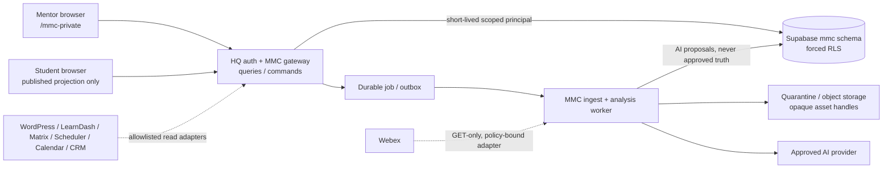
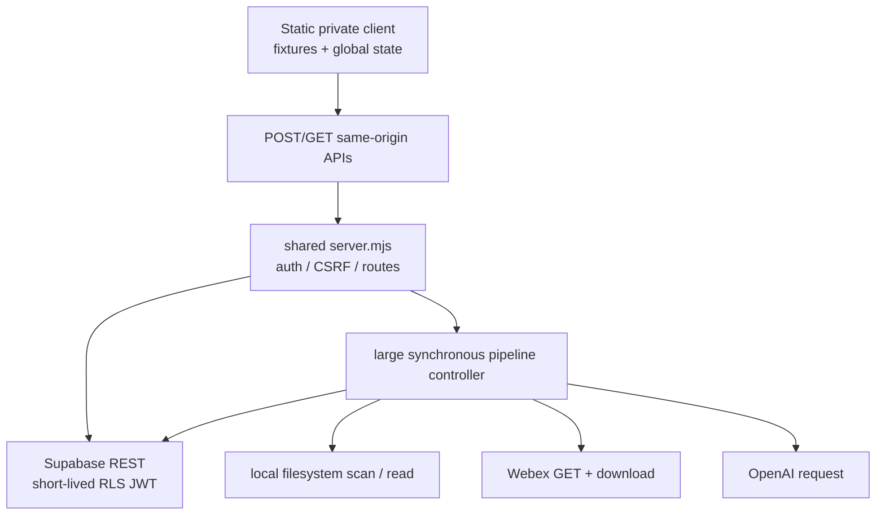
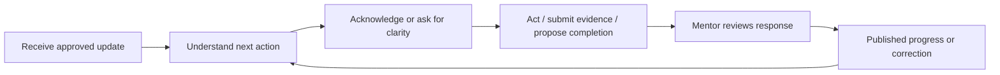
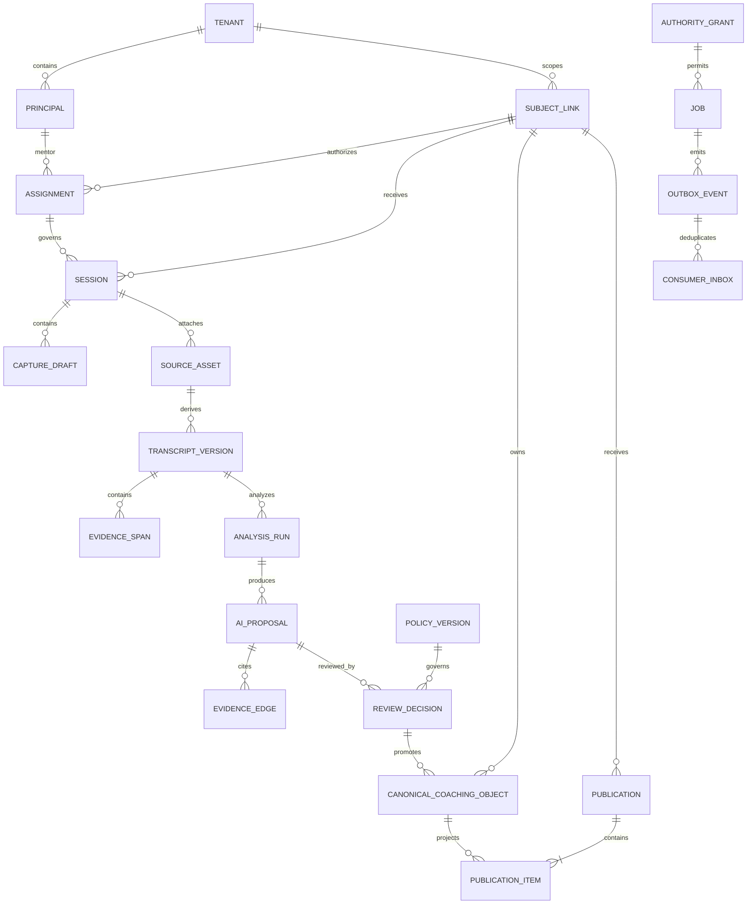
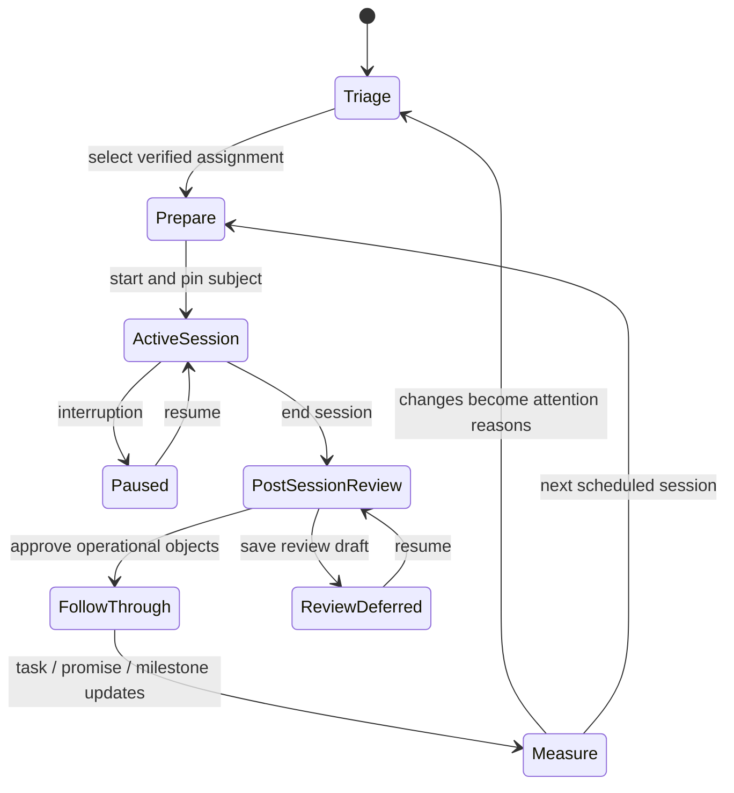
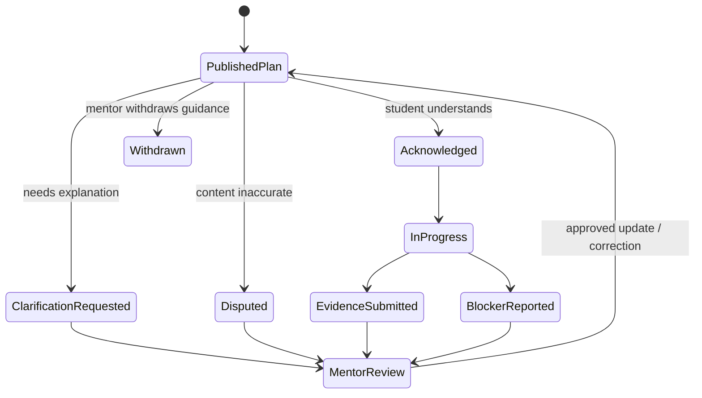
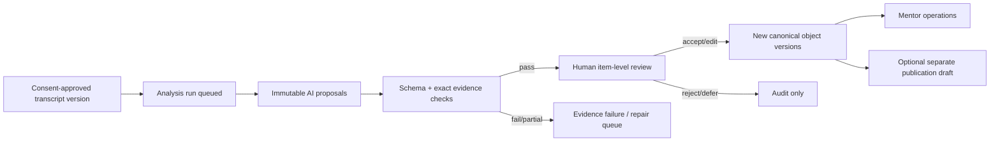
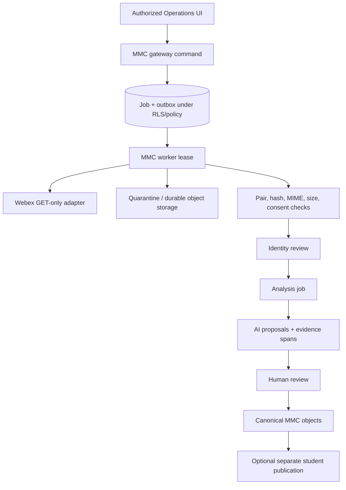
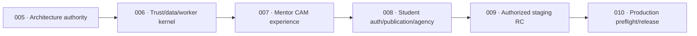

# 01 Executive Architecture Decision

RESULT: `ONE_CAM_V2_ARCHITECTURE_SELECTED`

## Decision

MMC will remain an authenticated, same-origin MissionMed HQ product surface, but the current monolithic execution topology will not become the production architecture. CAM v2 separates four bounded planes:

1. **Experience plane** — role-scoped mentor and student applications. The mentor application remains mounted at `/mmc-private/`; a future student route consumes only published projections. Neither browser receives privileged credentials or filesystem paths.
2. **Gateway and trust plane** — a thin MMC route module behind existing HQ session authorization, capability checks, CSRF, and no-index behavior. It exposes versioned queries and commands, validates object scope, and mints only short-lived role-specific RLS principals: mentor access is active-assignment scoped; student access is exact-subject and split into `publication_read`, typed `self_author`, and `respond` capabilities; workload access is job-lease/capability scoped.
3. **Canonical data plane** — additive `mmc.*` tables and transactional commands under forced RLS. Canonical objects, evidence, review decisions, publications, jobs, idempotency records, and audit events are distinct. Full-state browser synchronization is retired.
4. **Asynchronous processing plane** — a least-privilege MMC ingest/analysis worker with durable jobs, leases, retry, quotas, and opaque asset handles. Webex remains read-only. Media never passes through the browser or an arbitrary request-supplied local path.



## Why this is the selected path

The existing HQ mount already has valuable fail-closed controls in `missionmed-hq/server.mjs:3078-3315`: route-specific authorization, disabled-by-default persistence, short-lived RLS JWTs, and no browser service-role path. Replacing that shell would create needless auth and ecosystem risk. Keeping filesystem scanning, Webex downloads, OpenAI calls, and multi-row persistence inside synchronous HTTP requests would preserve the highest-risk defects in `missionmed-hq/routes/mmc-coaching-pipeline.mjs` and `missionmed-hq/lib/mmc-coaching-import-worker.mjs`. The split architecture preserves the good boundary and removes the wrong execution ownership.

The mounted client under `missionmed-hq/public/mmc-private/` is the sole current implementation authority. `mmc-v1-core/` becomes a frozen behavioral oracle. `/mmc-partner-demo/` is preserved only as historical synthetic feature archaeology; its design is rejected and has zero target-authority weight. They must not evolve as three independent product implementations.

## Non-negotiable trust rules

- An AI result begins as an immutable proposal. It cannot affect briefing, risk, readiness, actions, memory, or student publication until its evidence is verified and a named mentor approves it.
- A browser assertion is never identity evidence. Only source-specific server adapters may create attested evidence envelopes.
- “Verified” applies to a specific claim or subject link and names the verifier, evidence, time, and scope; it is never a blanket domain badge.
- Unknown remains unknown. Sensitive disclosure count, meeting count, or record count may not masquerade as risk, readiness, or relationship trust.
- Student visibility is a separate versioned publication object, not a boolean on mentor-owned data.
- Every mutation is a versioned command with idempotency, authorization, audit, and a per-object result.
- Canonical multi-object mutation, idempotency result, lineage, audit, and outbox commit in one database transaction; external effects alone use sagas.
- Worker jobs use workload identity plus CAS lease-generation fencing and consumer inbox deduplication; stale workers cannot commit.
- Fixture, local, staging, and live modes are structurally isolated; an empty authoritative store stays empty.
- External sources remain read-only unless a separate owner grants authority. Webex policy is server-owned and request input can only narrow it.
- Separate server-attested authority grants gate acquisition, transcript processing, AI transfer, and publication; consent/title/sidecars/browser input never substitute.
- Initial student and sensitive browser responses are `no-store`; no durable offline sensitive cache exists without a separate encrypted-storage decision.

## Canonical operating model

The mentor loop is:

`TRIAGE → PREPARE → CONDUCT → CAPTURE → REVIEW → APPROVE → FOLLOW THROUGH → MEASURE → PREPARE AGAIN`.

The student loop is:

`UNDERSTAND PLAN → ACT → SUBMIT/UPDATE → ACKNOWLEDGE → REQUEST CORRECTION → SEE APPROVED PROGRESS`.

The pipeline loop is:

`DISCOVERED → QUARANTINED → PAIR/CONSENT VERIFIED → SUBJECT LINK VERIFIED → ANALYSIS QUEUED → AI PROPOSAL → EVIDENCE CHECKED → MENTOR REVIEWED → APPROVED OPERATIONAL → OPTIONAL STUDENT PUBLICATION`.

No single action combines identity approval, real analysis, operational promotion, and publication.

## Decision ledger

| ID | Decision | Status | Reason |
| --- | --- | --- | --- |
| ADR-005-01 | Keep the same-origin HQ mount as the experience/auth gateway. | ACCEPTED | Reuses proven private-route controls without broad auth rewiring. |
| ADR-005-02 | Move long-running media and AI work to a durable asynchronous processing plane. | ACCEPTED | Removes filesystem/provider work from request lifecycle and enables retry/idempotency. |
| ADR-005-03 | Use versioned commands and canonical records, not whole-state synchronization or full event sourcing. | ACCEPTED | Fixes concurrency/deletion defects without imposing an unnecessary event-sourced rewrite. |
| ADR-005-04 | Publish immutable student projections from an allowlist. | ACCEPTED | Prevents mentor-note and unreviewed-AI leakage. |
| ADR-005-05 | Make evidence, review, sensitivity, and publication orthogonal state dimensions. | ACCEPTED | Avoids misleading omnibus statuses. |
| ADR-005-06 | Separate mentor work from role-gated Pipeline Operations. | ACCEPTED | Preserves cognitive focus and tighter administrative authorization. |
| ADR-005-07 | Preserve historical migrations and add corrective migrations only. | ACCEPTED | Maintains history and follows MissionMed migration authority. |
| ADR-005-08 | Treat the current branch as implementation archaeology, not production certification. | ACCEPTED | Live credentials, consent authority, staging application, and production topology remain unproved. |
| ADR-005-09 | Use distinct mentor, student, operator, and workload principals; prohibit runtime service-role/BYPASSRLS. | ACCEPTED | Prevents confused-deputy and cross-role authority collapse. |
| ADR-005-10 | Use stage-specific Authority Grants and an advising-policy registry. | ACCEPTED | Evidence alone does not establish processing consent or safe advising. |
| ADR-005-11 | Adopt single-writer v1→v2 cutover with no dual-write. | ACCEPTED | Prevents a second canonical fork during migration. |
| ADR-005-12 | Make student-authored goals/preferences/responses first-class, preserving authorship. | ACCEPTED | Student agency cannot be reduced to mentor-approved downstream status. |

## Authority boundaries

This architecture authorizes subsequent local implementation planning only. It does not authorize migration application, live AI, Webex pull, production credentials, deployment, shared auth/CSRF changes, Matrix changes, or writes to any protected external system. Any shared `missionmed-hq/server.mjs` modification requires a scoped decision record and broad regression proof.

## Architecture score

Current implementation architecture: **5.1/10**. Post-red-team proposed architecture specification: **9.2/10**, conditional on the release gates in reports 16, 18, 22, and 23. The proposed score describes the completeness and safety of this blueprint; it is not a claim that unimplemented code already passes.

# 02 Current Reality and Gap Audit

RESULT: `CURRENT_REALITY_VERIFIED`

## Product and runtime reality

The canonical branch is a strong local engineering baseline, not a production-ready mentor operating system. The current product is a static JavaScript client seeded by fixtures, mounted by shared `missionmed-hq/server.mjs`, with same-origin persistence and coaching-pipeline APIs. Persistence defaults disabled. Preserved migrations describe 15 forced-RLS MMC tables but Prompt 004A did not apply them. The private route correctly redirects an unauthenticated local browser to WordPress authorization; the synthetic partner demo loads independently.

The code trace is:



## Classified findings

| Class | Finding | Evidence / consequence |
| --- | --- | --- |
| VERIFIED | Private mount is role/capability gated, no-index, and persistence is disabled by default. | `missionmed-hq/server.mjs:3078-3209` |
| VERIFIED | MMC uses an anon key plus short-lived RLS user token rather than a browser service role. | `missionmed-hq/server.mjs:3259-3315` |
| VERIFIED | Current client begins with fixture records and merges/hydrates authoritative state conditionally. | `missionmed-hq/public/mmc-private/src/mmc-ownership-layer.js:160-439` |
| VERIFIED | An authoritative empty array does not replace fixtures; fixture state can resurrect. | `mmc-ownership-layer.js:404-428` |
| VERIFIED | Whole-state optimistic writes have no version, rollback, deletion semantics, or per-record results. | `mmc-ownership-layer.js:508-570`; `server.mjs:3792-3868` |
| VERIFIED | Current Student View is static Amara fixture HTML, not an authenticated projection. | `missionmed-hq/public/mmc-private/index.html:1401-1584` |
| VERIFIED | Post-session action controls are rendered but their edits are not read on save. | `missionmed-hq/public/mmc-private/src/app.js:2069-2162` |
| VERIFIED | Raw live notes are copied into a potentially student-visible summary. | `app.js:2135-2162` |
| VERIFIED | AI analysis is persisted before review and the snapshot is hard-coded reviewed. | `missionmed-hq/routes/mmc-coaching-pipeline.mjs:1893-2182` |
| VERIFIED | Browser-entered roster JSON can be promoted as strong evidence; empirical local tests produced `VERIFIED` from fabricated unverified anchors. | `app.js:596-656`; `mmc-roster-verification-lane.mjs:161-297` |
| VERIFIED | Transcript resolution can read broad local paths, follows symlinks, and sends whole text to AI without an artifact broker. | `mmc-coaching-pipeline.mjs:1840-1890,2318-2496` |
| VERIFIED | Webex host matching, request-scoped paths/force, credential fallback, buffering, and overwrite behavior are unsafe for production. | `missionmed-hq/lib/mmc-webex-triggered-pull.mjs:13-35,193-303,416-524` |
| VERIFIED | Sequential multi-row analysis writes are nontransactional and non-idempotent. | `mmc-coaching-pipeline.mjs:1977-2182` |
| VERIFIED | The private product uses pointer-only controls, lacks a semantic dialog, and overflows at 390px; partner demo keeps a 980px floor. | `index.html:20-52,1591-1621`; `styles.css:19,32-36,323-333`; partner demo `index.html:37-49,258-263` |
| VERIFIED | Current screenshot 06 captured selected-student disagreement; later screenshots and the continuity validator show the repair. | Prompt 004A screenshot set and `missionmed-hq/tests/mmc-selection-continuity-validation.mjs` |
| LIKELY | Shared HQ is the correct long-term auth gateway. | It owns established session authorization; production deployment topology still needs platform proof. |
| UNKNOWN | Production student identity authority, student login host, consent basis, retention schedule, provider data terms, and approved source adapters. | No local artifact establishes these decisions. They are explicit future gates, not architecture blockers. |
| UNKNOWN | Whether MMC migrations exist in any shared staging database. | No credentialed inspection was authorized. |
| ASSUMPTION | Dr Brian remains the primary mentor/operator, students are likely mobile-first, and same-origin mediation remains the safest access pattern. | These shape the blueprint but require usability/platform validation before production. |
| PROTECTED | Matrix, Scheduler, Calendar, WordPress, LearnDash, Daily Drills, Webex account, R2, Stream, File Vault, shared auth/CSRF, production Supabase/Railway. | Read-only reference or no-touch until owner-specific authority. |
| OBSOLETE | Treating `mmc-v1-core/` or the partner demo as a coequal production UI. | Both remain valuable test/narrative evidence, not current runtime authority. |
| DO NOT TOUCH | Historical migrations, production data, credentials, media, `video_registry.json`, and protected bootstraps in this architecture run. | Preserved unchanged. |

## Current mentor reality

The intended loop is coherent: attention-ranked Directory, Profile, Call Prep, Session Command, Post-Session, Actions, and Meeting Intelligence. Selection continuity has a deterministic validator and currently passes. The strongest current product value is longitudinal context and a visible next-best-move concept.

The implementation still contains hard-coded students, fixed dates, static panels, inconsistent selector populations, placeholder live-capture text, a global `activeSessionId`, no multiple-session guard, and a long Pipeline Admin embedded inside Meeting Intelligence. Static counts and scores sometimes contradict fixtures. “Action” changes owner semantics across Quick Capture and session capture. These defects come from parallel fixture fragments, global state, and cloned surfaces—not merely styling.

## Current student reality

There is no student operating product. There is a static preview and a synthetic partner-demo projection. Current RLS denial of student access is the safe state. The architecture must add a separately authenticated, allowlisted, versioned publication read model before any student route is enabled.

## Current intelligence reality

Deterministic briefing functions are useful prototypes, but their formulas infer risk from sensitive disclosure count, reduce risk from meeting count, fabricate a nonzero goal baseline, and infer relationship trust from record counts. Outputs are labeled `VERIFIED` despite mixed fixtures and inference. Evidence items from AI are structurally checked, not verified against transcript spans. Consequential outputs currently cannot be treated as trustworthy operational intelligence.

## Current accessibility and responsive reality

Desktop information density is promising but visually noisy. Mobile is not an alternate interaction model; it is a clipped desktop canvas. Clickable `div` navigation and rows, placeholder-only labels, absent focus trapping/restoration, no live regions, very small muted text, and no reduced-motion behavior make WCAG 2.2 AA unproved and visibly unlikely. Existing tests have no accessibility or phone/tablet assertions.

## Why defects escaped validation

Current validators assert route hooks, source tokens, basic continuity, and safe static patterns. Separate private/core/demo implementations can each satisfy independent tests while their semantics drift. A render success does not prove selected-student consistency, saved edits, identity authority, AI review gating, responsive reflow, or persistence recovery. CAM v2 therefore adopts behavior/state fixtures, cross-layer contracts, browser assertions, accessibility automation, and failure injection as first-class release gates.

## Gap priority

1. **P0 trust and boundary closure:** local-file confinement, exact credential origins, server-attested identity, affirmative AI/Webex enablement, review-before-operation, fixture isolation.
2. **P0 canonical state:** commands, versions, idempotency, transactional promotion, publication projection, evidence spans.
3. **P1 operating experience:** semantic responsive shell, one-minute brief, pinned active session, post-session review, review inbox, separate Operations.
4. **P1 asynchronous pipeline:** durable queue, opaque assets, policy-bound Webex, retry/reconciliation, consent and retention gates.
5. **P1 student experience:** authenticated published projection, correction/withdrawal/acknowledgement, cross-student proof.
6. **P2 outcomes and polish:** calibrated outcomes, explainability, workload optimization, partner narrative adapter.

## Current baseline scores

| Dimension | Score | Why |
| --- | ---: | --- |
| Architecture | 5.1 | Strong local guardrails, wrong synchronous boundaries and state model. |
| UI | 5.8 | Distinctive dense desktop concept, inconsistent hierarchy and broken mobile. |
| UX | 5.0 | Coherent intent, substantial static/decorative and recovery gaps. |
| Security/privacy | 5.4 | RLS/auth foundation is real; file, credential, identity, AI-review, and publication gates are not production safe. |
| Accessibility/responsive | 2.4 | Major semantic, keyboard, contrast, focus, and overflow debt make the present core loop inaccessible to some users. |
| Mentor workflow | 6.2 | A visible loop exists, but state cannot yet be trusted end to end. |
| Student workflow | 2.0 | Preview only; no authenticated operating loop. |

# 03 Product Constitution

RESULT: `PRODUCT_AUTHORITY_DEFINED`

## What MMC is

Matrix Mentor Console is a human-controlled mentor intelligence operating system. It helps Dr Brian decide who needs attention, understand why, prepare a high-quality conversation, capture commitments without losing presence, review machine assistance, follow through, and preserve longitudinal advising continuity. It gives each student a separate, privacy-safe view of only the goals, tasks, milestones, summaries, feedback, and updates deliberately published to them.

MMC turns approved source evidence into reviewable coaching continuity. It does not turn a transcript into unquestioned truth.

## What MMC is not

- Not a generic CRM, EHR, surveillance dashboard, transcript warehouse, autonomous advisor, clinical decision tool, or match-prediction engine.
- Not a source of truth for WordPress, LearnDash, Matrix, Scheduler, Calendar, CRM, Webex, or residency-program data.
- Not permission to infer mental state, character, motivation, immigration status, or match probability from weak signals.
- Not a way to expose mentor notes by relabeling a field “student visible.”
- Not a substitute for Dr Brian’s judgment, a student’s agency, or official NRMP/program information.

## Primary users and jobs

| User | Job to be done | Success experience |
| --- | --- | --- |
| Dr Brian, mentor/operator | Know the most consequential next action for every student and close coaching loops. | Finds who/why/what-next in under 60 seconds; prepares a call in under 3 minutes; reviews outputs instead of reconstructing history. |
| Student | Understand the agreed plan, act, see progress, and correct misunderstandings safely. | Knows the next three actions, owners, dates, and rationale without seeing private or speculative reasoning. |
| MMC operator/admin | Resolve identity, pipeline, evidence, and review exceptions safely. | Works prioritized queues with source evidence, audit, retry, and no hidden advancement. |

## Product principles

1. **Decision before decoration.** Every primary surface answers a concrete operational question.
2. **One minute to orientation.** Today and student briefing expose change, urgency, ownership, evidence age, and next action before detail.
3. **Presence during the call.** Live capture favors a few semantic shortcuts, voice/keyboard efficiency, and recovery; it does not demand database administration.
4. **Review before consequence.** AI, identity, publication, and sensitive-state changes are proposals until an authorized human approves them.
5. **One object, many projections.** Tasks, goals, commitments, evidence, and sessions have one canonical state, reused by every screen.
6. **Progressive disclosure.** Urgent decisions stay visible; provenance and longitudinal detail remain one action away.
7. **Unknown is useful.** Missing evidence is displayed and routed; it is never converted into a reassuring score.
8. **Student agency.** Students can acknowledge, complete, comment, and request correction; they are not passive recipients of a mentor score.
9. **Interruption is normal.** Every multistep workflow can resume safely and exposes what saved.
10. **Protected ecosystems stay protected.** Integration uses narrow read adapters and MMC-owned writes only.

## Trust and evidence constitution

- Consequential claims name source, evidence span/pointer, age, origin (`observed`, `deterministic`, or `AI proposal`), confidence basis, review state, and supersession state.
- Confidence describes support for a bounded claim; it is not certainty about a person.
- Deterministic output and AI inference use different labels, icons, semantics, and accessible text.
- AI may summarize, extract proposals, organize evidence, and suggest questions. It may not verify identity, approve itself, publish to students, diagnose, or promise outcomes.
- Evidence is necessary but not sufficient for safe advice. Every consequential recommendation also names an active, human-approved advising-policy version and starts from the student’s stated goal/preferences rather than a system-imposed objective.
- A mentor override records reason and does not erase the prior evidence or decision.
- Corrections supersede; they do not silently rewrite history.

## Privacy and psychological-safety constitution

- Default visibility is mentor-only. Sensitive data receives an additional purpose and access gate.
- Student publication is an allowlisted copy with explicit approver, version, preview, and withdrawal. Private notes, internal risk rationale, raw transcripts, identity conflicts, and unreviewed AI are never eligible.
- Risk language describes an actionable workflow condition, not a personal trait. Use “deadline at risk because…” rather than “high-risk student.”
- Readiness is decomposed by objective domain and data sufficiency. No guaranteed match outcome, clinical inference, or unexplained composite score.
- Sensitive disclosures never increase a risk score merely because they exist.
- Visa, disability, nationality, race, ethnicity, religion, gender, pregnancy, health, language, age, socioeconomic context, and proxies are never inferred or used to disadvantage prioritization. An explicitly supplied eligibility fact may be used only for a narrow legitimate purpose with consent, provenance, explanation, and policy authority.
- UI language is plain, culturally comprehensible, and avoids shame, coercion, and false certainty. Official NRMP/FREIDA terminology is used only with source date and disclaimer.

## Human-control constitution

Humans approve identity links, evidence promotion, operational recommendations, and publication separately. High-consequence actions show target, scope, evidence, side effects, and rollback before confirmation. Bulk actions cannot cross students or conceal partial failure. Assignment revocation immediately removes that mentor's query, command, retry, and new-publication authority. It does not silently revoke an exact student's entitlement to an already-published projection; withdrawal, correction, expiry, and student-publication policy govern that separate lifecycle.

## Outcome constitution

MMC measures preparation time, follow-up latency, commitment closure, open-loop age, milestone movement, student acknowledgement, correction rate, review burden, identity accuracy, and pipeline reliability. These are operating and learning signals. They must not be presented as causal proof of a residency match or as a student ranking.

## 2035 vision

By 2035, MMC should act as an evidence-grounded continuity layer across a student’s longitudinal advising journey: it remembers approved commitments, detects unresolved loops, helps a mentor ask better questions, adapts communication to the student’s stated needs, and gives the student a transparent plan. It remains legible, reversible, source-aware, and human-governed as models and integrations change.

## Non-goals for CAM v2 implementation

- Autonomous outreach, application submission, rank-list strategy, or student scoring.
- Writes to external source systems.
- Production migration or deployment without separate authority.
- A broad MissionMed server/framework rewrite.
- Replacing official program data or mentor expertise.
- Training models on student data without a distinct data-governance decision.

## Rejected product patterns

- Red/yellow/green person labels without reason and recourse.
- A universal “readiness” gauge.
- Engagement streaks, shame-based overdue copy, or manipulative nudges.
- Chat-first navigation that hides objects, sources, and approval state.
- One-button “approve identity + analyze + publish.”
- Infinite dashboard cards and cloned detail fragments.
- Silent AI personalization or sensitive inference.

## Success measures and targets

| Measure | Architecture target | Guardrail |
| --- | --- | --- |
| Find highest-priority student and reason | Median ≤30 seconds; p90 ≤60 seconds in usability test | Reason and evidence age must be visible. |
| Prepare a scheduled call | Median ≤3 minutes after data is available | No claim may bypass review. |
| Record and assign a commitment | ≤20 seconds, keyboard and touch | Owner/date explicit; saved state announced. |
| Post-session review | Median ≤5 minutes for a normal session | Summary, action, privacy, and publication decisions separated. |
| Student understands next actions | ≥90% identify owner/date/next step in comprehension test | No internal risk score or private reasoning shown. |
| Cross-student or private-data leak | 0 in automated, manual, and staging tests | Any occurrence blocks release. |
| Duplicate processing on retry | 0 for deterministic retry suite | Idempotency proof required. |
| Evidence-linked AI-derived factual claims and factual premises used in consequential guidance | 100% | Missing support blocks the factual assertion. A mentor recommendation may proceed only as explicit `HUMAN_JUDGMENT` with named rationale, policy, and uncertainty—not as an unsupported fact or AI-verified claim. |
| Accessibility | WCAG 2.2 AA acceptance suite passes | No horizontal overflow at named viewports/200% zoom. |

Product success must be assessed with students and mentors across differing English fluency, IMG backgrounds, devices, and accessibility needs. A higher dashboard score is never itself a product outcome.

# 04 Mentor Experience Constitution

RESULT: `MENTOR_COMMAND_MODEL_DEFINED`

## Experience promise

Dr Brian should open MMC and know, within one minute, who needs him, why now, what changed, what he promised, and the safest next action. The system should make a good mentoring conversation easier without turning the conversation into clerical work. Detail remains available, but urgency and next action always win the first screen.

## The mentor questions

Every design decision must improve at least one of these questions:

1. Who needs attention today?
2. Why now, and how reliable is that reason?
3. What changed since the last meaningful interaction?
4. What did I or the student promise?
5. What is due, blocked, stale, or unresolved?
6. What should I remember and ask next?
7. What must I capture during the call?
8. What needs my review after the call?
9. What should the student see, and what must remain private?
10. What should carry into the next meeting?

## The one-minute brief

Today opens on a ranked attention queue, not aggregate KPIs. The initial tier contains the three most actionable items, followed by an explicit “four more” disclosure. The first tier shows only student, one actionable reason, due state, and one safe next action. Source, review, freshness, owner detail, and correction controls collapse into one accessible trust affordance and inspector. Priority is a transparent ordering of conditions, not a person score.

The attention dimensions are:

- **Deadline pressure:** an objective dated event is approaching or overdue.
- **Follow-through gap:** an accepted commitment has not progressed by its agreed checkpoint.
- **Review wait:** identity, evidence, analysis, or publication is waiting on an authorized person.
- **Readiness gap:** an explicit milestone requirement is incomplete, with source and rubric.
- **Data insufficiency:** required evidence is absent or stale.
- **Support context:** a mentor-approved handling note, never a numeric risk input.

Sensitive disclosures, raw meeting count, memory count, cultural/language difference, or inferred emotional state cannot raise attention. A reason always includes recourse: inspect evidence, correct, defer, contact, or dismiss with a reason.

Ordering is deterministic: true privacy/safety decision owned by the mentor; authoritative deadline consequence; overdue mentor promise; scheduled-call preparation; student commitment follow-through; review wait; data sufficiency. Within a class, earliest objective due time wins, then oldest first-observed time, then stable object ID. Duplicate reasons for one object/student collapse; no student occupies more than one initial-tier slot unless a separately classified safety decision exists. Deferred/dismissed items store reason and expiry, reappear only after material source/version change or expiry, and carry age escalation so low-priority work cannot starve. Per-day alert budgets and usefulness/dismissal review are release contracts.

## Student Workspace

The canonical student route is `/students/:studentId`. It pins verified subject link, assignment, environment, and freshness in the header. It has four stable tabs:

- **Overview:** what changed, next safe move, upcoming call, key commitments, data sufficiency, and private handling context.
- **Plan:** goals, milestones, tasks, promises, and open loops from canonical objects.
- **History:** sessions, approved observations, timeline, corrections, and supersession.
- **Files:** authorized artifacts and review state; external systems remain source owners.

Call Prep is an Overview focus mode. Mentor Memory is a private evidence/context inspector. Meeting Intelligence is a session detail and evidence view. These are not peer destinations competing in navigation.

## Call Prep

Call Prep fits one laptop viewport before deeper disclosure. It contains:

1. the call objective and reason this conversation matters now;
2. changes since the last approved interaction;
3. unresolved mentor and student commitments;
4. the next best question/action with source and review state;
5. the upcoming objective milestone;
6. private “handle with care” context with purpose and age;
7. data gaps or conflicts that constrain advice.

The mentor can mark an item stale, correct it, open evidence, or pin it to the call. Preparation target is a median of two minutes and p90 of three minutes in representative usability tests.

## Session Command

Starting a session freezes the subject and assignment in a visible banner. Student switching is disabled until the session is paused or ended. At most one active session exists per mentor unless an explicit recovery flow resumes another.

The workspace shows one objective, prior commitments, elapsed time, save/connectivity state, and a low-friction note stream. Quick capture creates a typed draft: student task, mentor task, mutual commitment, private memory, question, flag, or publication candidate. Each capture supports keyboard, touch, and an optional timestamp. Generic placeholder records are forbidden.

Capture must never publish, infer identity, or approve AI. Initial CAM v2 has no durable sensitive offline browser persistence: on disconnect, unsent memory-only content is labeled `NOT SAVED`, the loss-on-close/reload risk is explicit, and reconnect is idempotent. Any future encrypted/scoped offline persistence requires a separate approved storage ADR and is not an implementation option under this authority.

## Post-Session Review

Ending the call opens a resumable review, not a one-click save. Sections are independently reviewable:

- factual summary;
- student and mentor commitments;
- owner and due date;
- goals/milestones affected;
- private notes and sensitive context;
- AI proposals with verified evidence spans;
- candidate student publication items.

Each item can be edit, approve, reject, defer, or mark needs evidence. A review cannot imply that checkbox/input edits saved unless readback proves the resulting version. Partial failures identify exactly what saved and can be retried idempotently.

Review targets are complexity-banded, never incentives to rubber-stamp: a small manual session with at most three captures targets median ≤90 seconds; a bounded AI-assisted session with at most ten proposals targets median ≤3 minutes and p90 ≤5 minutes; larger/complex/sensitive sessions are explicitly deferred into the Review inbox with no speed penalty. Consequential items and sensitive/identity/publication decisions cannot be bulk approved.

## Work and Reviews

**Work** is Dr Brian’s cross-student obligations surface: mentor tasks, student tasks awaiting mentor action, promises, follow-ups, decisions, and aged open loops. Filters use ownership, consequence, due window, program/cohort, and evidence freshness.

**Reviews** is the human-decision inbox: AI claims, student publication, identity conflicts, and selected media exceptions. Pipeline administration, trigger policy, source diagnostics, and job repair live in a separate role-gated Operations workspace. Administrative machinery never auto-mounts inside normal Meeting Intelligence.

## Search and quick capture

`Cmd/Ctrl+K` searches students, canonical objects, sessions, and commands. Results state source, scope, and visibility. Global Quick Capture requires a student and explicit type before text; it cannot default a generic “action” to a hidden owner. If no verified assignment exists, it can create an unassigned mentor draft but cannot attach to a student.

## Switching, cohorts, and interruption

- Routes, not mutable globals, own selected student and tab state.
- Unsaved work blocks or safely stores navigation; back/forward restores the same subject, tab, filters, and scroll when safe.
- Opening a second tab does not silently overwrite a first; version conflict requires compare/reapply/discard.
- Cohort/program filters are saved mentor preferences, never authorization filters.
- Interrupted sessions and reviews show a resume card with last durable save, queued writes, and conflicts.
- Assignment expiry immediately locks new commands while preserving an appropriately redacted historical record.

## Mentor acceptance criteria

- Four of five representative mentors identify student, reason, trust state, and next action in 60 seconds or less.
- A call is prepared in a median of two minutes without opening more than one inspector.
- A basic typed capture takes median ≤10 seconds and p90 ≤20 seconds; a complete commitment with owner/date targets ≤20 seconds.
- Post-session review meets the complexity bands above, and every accepted object reads back with correct owner, due date, visibility, reviewer, and version.
- Subject continuity survives route changes, reload, back/forward, session resume, review, and multi-tab conflict.
- No private/sensitive object or AI proposal can be included in a student publication without a separate explicit decision.
- Every recommendation displays why, evidence age, origin, review state, and how to correct it.

Post-red-team mentor workflow architecture score: **9.3/10**, subject to implementation and observed usability evidence.

# 05 Student Experience and Visibility Constitution

RESULT: `STUDENT_PROJECTION_CONTRACT_DEFINED`

## Experience promise

The student should always understand what was agreed, what comes next, who owns it, when it matters, how progress is determined, and how to correct a misunderstanding. The student product is mobile-first, motivating without manipulation, and honest about uncertainty. It is not a filtered copy of the mentor console.

## Separate product boundary

The current static Student View at `missionmed-hq/public/mmc-private/index.html:1401-1584` is historical concept evidence only. It must not be incrementally connected to live state. CAM v2 introduces:

- separate authenticated student routes and principal resolution;
- student-specific RLS or a server-mediated equivalent proven by adversarial tests;
- an immutable, versioned `Publication` projection composed only of allowlisted `PublicationItem` records;
- exact subject, assignment, approver, approval time, source version, and policy version;
- correction, supersession, withdrawal, acknowledgement, and audit behavior.

Mentor-owned rows are never exposed by changing a visibility enum. Publication copies a reviewed, redacted representation into a student-owned read model. Current student denial remains the safe default until this exists.

## Student information architecture

The mobile bottom navigation has five destinations:

1. **Today** — up to three next actions, next deadline, and newly published mentor update.
2. **Plan** — goals and milestones with criteria, dates, owners, and plain-language progress.
3. **Tasks** — agreed commitments with acknowledge, clarify, submit evidence, and propose-complete actions.
4. **Updates** — versioned mentor-approved session summaries and feedback, with correction/withdrawal notices.
5. **Files** — only authorized submissions and their review state.

These are five information destinations, not necessarily five simultaneous 320px controls. At 390px and above the bottom bar is Today, Plan, Tasks, Updates, More (Files lives in More). At 320–389px it is Today, Plan, Tasks, More; More contains Updates and Files with the same stable URLs and no lost capability.

Notifications link to these objects and never reveal sensitive content on a lock screen. A privacy/activity area shows what was published, corrected, withdrawn, or acknowledged and who acted.

## Student operating loop



The student is a co-author, not only a downstream recipient. Canonical student-authored records cover stated goals, priorities, specialty interests, preferences, constraints the student chooses to disclose, communication preferences, reflections, blocker reports, completion attestations, consent choices, and notification choices. The student can say “This is not my goal,” decline, defer, renegotiate, propose an alternative, correct/withdraw their own statement, and request an escalation outside the challenged mentor. These actions never modify the mentor’s private source object. Mentor and student views reference the same bounded commitment identity while preserving separate authorship and review history.

`ACKNOWLEDGED`, `AGREED`, `DISPUTED`, `SELF_REPORTED_COMPLETE`, and `MENTOR_VERIFIED_COMPLETE` are distinct. The UI never converts acknowledgement into agreement or student attestation into mentor verification. Escalation ownership and policy are a required institutional dependency before live launch.

## Visibility lifecycle

The required business states are represented explicitly, with state transitions rather than a single enum forced onto every object:

`DRAFT → REVIEW_REQUIRED → APPROVED → PUBLISHED → ACKNOWLEDGED`.

Orthogonal restrictions are `MENTOR_ONLY` and `SENSITIVE`. Corrective terminal/branch states are `CORRECTED`, `SUPERSEDED`, `WITHDRAWN`, and `EXPIRED`.

| From | To | Authorized actor | Required proof |
| --- | --- | --- | --- |
| Draft candidate | Review required | mentor/system | source object, proposed redaction, reason |
| Review required | Approved | assigned mentor/admin by policy | explicit item-level decision and preview |
| Approved | Published | assigned mentor/publisher | current assignment, publication version, idempotency key |
| Published | Acknowledged | exact student principal | publication/item version |
| Published | Corrected/Superseded | assigned mentor/publisher | replacement link and correction reason |
| Published | Withdrawn | assigned mentor/admin | reason, immediate denial, audit event |
| Any eligible | Expired | policy/system | policy/date and non-destructive history |

Publication approval and publication execution are separate commands. Preview renders exactly the payload the student principal would receive, through the student authorization path—not through a privileged mentor DOM simulation.

Publication items are a kind-specific discriminated union—not arbitrary JSON or a pointer escape hatch. Each allowed kind (for example task, milestone, plan update, session summary, feedback, correction, or content-free withdrawal tombstone) has a bounded schema, safe plain-text limits, permitted source kinds/fields, and rendering rules. Every source version and embedded reference must bind to the publication's exact tenant/environment/subject; arbitrary object IDs, HTML, URLs, cross-subject references, and unknown fields are rejected. Sanitization is defense in depth after structural allowlisting. The human preview, committed serialization, and readback are compared through the exact student principal.

Assignment and student entitlement are separate authorities. An expired or revoked mentor assignment blocks that mentor's reads, commands, retries, and new publication immediately. It does not, by itself, erase or deny an exact student's previously published projection. The projection remains available only while its own publication, retention, correction, expiry, and withdrawal policies permit; every transition is audited and rendered truthfully.

## Absolute exclusions

The publication builder rejects:

- mentor memory, private notes, or “handle with care” context;
- raw audio/video/transcript or unrestricted transcript quotes;
- internal attention/risk rationale and confidence heuristics;
- unresolved/probable/conflicted identity;
- AI proposals or unverified evidence spans;
- cross-student references;
- private source paths, provider IDs, credentials, prompt internals, or operational logs;
- sensitive categories unless a distinct policy explicitly makes a safe redacted item eligible;
- new publication candidates authorized only by an expired/revoked assignment, or any fixture/live mode mismatch.

Eligibility is enforced in database/server contracts and tested with hostile payloads. Hiding fields in CSS or client code is not a control.

## Readiness and progress language

Students see objective milestone status, not a universal match-readiness score. Each domain states: requirement, current evidence, missing item, update date, and person/source responsible. “Unknown” and “waiting for review” are legitimate. Copy never guarantees matching, ranks peers, implies diagnosis, or labels a person high risk.

Progress celebrates verified completion and growth against the student’s own prior state. There are no peer leaderboards, guilt streaks, shame copy, or notifications that expose a negative label. A missed date becomes “This checkpoint needs a new plan” with a clarify/reschedule path.

## Correction and agency

Every summary/feedback item has “Ask a question” and “Request correction.” The student can identify the disputed sentence and add context. This creates a review item; it does not erase mentor history. Corrected versions prominently identify what changed. Withdrawn guidance disappears from every active-content endpoint immediately. A separate minimal activity tombstone may tell the previously authorized exact student only that an update was withdrawn, when, and the safe contact path; it contains none of the withdrawn content or private reason. Other principals receive an indistinguishable not-found response.

## Accessibility, privacy, and mobile rules

- 16px minimum form text on phones, 44×44px targets, semantic headings/forms/status, and no horizontal product overflow at 320/390px or 200% zoom.
- Plain language targets approximately eighth-grade comprehension unless official terminology is necessary and explained.
- Dates include timezone/locale; relative dates never stand alone.
- Sensitive notification bodies are generic by default; already delivered OS notifications cannot be remotely erased.
- Session timeout, shared-device sign-out, and screenshot/export policy require privacy review before live launch.
- A student can export their published plan/history and see retention/contact information without exposing mentor-only records. Exported, printed, screenshotted, or already displayed copies cannot be technically recalled; the product states this honestly.

Initial CAM v2 serves protected student content with `Cache-Control: no-store`, no Service Worker storage, and no durable sensitive browser cache. “Offline” means an honest unavailable state, not retained publication content. A future encrypted, device-bound cache requires a separate storage ADR, maximum TTL, reauthentication, reconnect invalidation, and disclosure that withdrawal cannot erase an already viewed copy.

## Proof of isolation

Release requires an automated RLS/server/browser matrix for: exact student with separately tested publication-read, typed-self-author, and respond capabilities; another student; assigned mentor; unassigned mentor; former mentor principal under expired/revoked assignment; exact student's still-eligible existing publication after mentor assignment expiry; administrator; anonymous; fixture/live mismatch; withdrawn active content and its content-free tombstone; superseded version; unreviewed AI; mentor-private object; cross-student embedded reference. Every forbidden case must produce no row and no metadata leakage. A single leak blocks release.

## Success criteria

- At least 90% of representative students identify their next action, owner, and date within 30 seconds.
- At least 90% correctly distinguish “published mentor guidance” from “student-reported progress.”
- Task acknowledgement/clarification is keyboard, touch, and screen-reader complete.
- A committed withdrawal denies every active-content read beginning after commit. Only the separately authorized content-free exact-student activity tombstone may remain; connected application cache/notification invalidation targets p95 <60 seconds. No false promise is made about a disconnected or exported copy.
- Zero private, sensitive, unreviewed-AI, unresolved-identity, or cross-student disclosures in the complete test matrix.
- Student comprehension and psychological-safety research includes IMG learners and differing English fluency; no production score is claimed before that research.

Target student workflow architecture score: **9.2/10**, conditional on authentication, policy, RLS, usability, and accessibility proof.

# 06 CAM v2 Visual and Interaction Constitution

RESULT: `MMC_CAM_V2_DESIGN_AUTHORITY_DEFINED`

## Corrected evidence hierarchy

1. Verified MMC functionality, ownership, security, and workflow requirements.
2. CAM v2 family authority and the strongest current MissionMed translations.
3. Dr Brian’s mentor operating needs.
4. Student clarity, motivation, privacy, accessibility, and psychological safety.
5. Current implementation and protected-system constraints.
6. Existing MMC screenshots as reality evidence.
7. Partner Demo last, solely as design-rejected historical feature archaeology.

The Partner Demo has zero design-authority weight. No CAM decision or score depends on fidelity to it.

## CAM sources and transferable laws

The strongest located family evidence is:

- `MM-CAM-THEME-D-001_SEASON_ONE_Design_Instructions.md`, which defines the deep-ink palette, Archivo/Rajdhani roles, crafted geometry, single next action, human-gold versus machine-cyan semantics, honest self-referenced growth, reduced motion, and no-guilt law.
- the 407F Definitive Timeline identified in `R1_MISSIONMED_CAMPUS_5003.../06_CAM_V2_FIDELITY_INVENTORY.md` as the canonical CAM visual/experiential reference: stable chrome, dominant workspace vessel, progressive disclosure, inspector, and restrained semantic accents.
- the reconciled MissionMed OS shell in `MM-SPINE-017.../shell/index.html`: a 232px operator rail, focus mode, command palette, honest freshness state, mobile drawer, semantic dialogs, keyboard focus, and one-action Mission Control.
- File Vault’s `02_UX_CONSTITUTION.md` and `08_CAM_TRANSLATION.md`: calm command, causal motion, one dominant artifact, right-slot drawer discipline, honest states, and role lens without truth drift.
- ACTN’s `ACTN_302A_CAM_V2_TRANSLATION.md`: deep ink, warm accent budget, hairline edges, stable chrome, product-specific signature, and explicit refusal to copy a sibling’s metaphor.

The Arena-specific XP, particle count, gamification vocabulary, and pixel-parity recipes are not blindly transferred. MMC is a serious mentor command system. It adopts the family grammar and restraint, then creates a mentor-specific operating signature.

## MMC visual signature

MMC is a dark cinematic studio around one living **Mentor Brief**. The shell recedes; the chosen student, next decision, and evidence surface form the dominant vessel. A slim longitudinal “continuity thread” connects last commitment, current evidence, today’s decision, and next checkpoint. This thread, plus the evidence inspector, makes MMC recognizable without card wallpaper.

### Token roles

| Role | Family mapping | MMC use |
| --- | --- | --- |
| Deep ink / layered navy | CAM `--bg`, `--bg2`, `--card` family | Environmental canvas, rail, work vessel; never pure black. |
| Ember | CAM `--em → --em2` | One primary command and active navigation only. |
| Human gold | CAM `--gd` | Mentor-authored/approved judgment, never machine output or generic CTA. |
| Machine cyan | CAM `--cy` | Source/evidence/focus and deterministic machine state. |
| Violet | CAM `--vi` | AI proposal and student-publication boundary, always with text/icon. |
| Green | CAM `--gn` | Confirmed completion or successful durable save. |
| Red | CAM `--rd` | Destructive action, true block, or security/privacy failure only. |
| Primary/mid/dim text | CAM text family | Dim text still passes contrast for its size and importance. |

No screen uses more than one action accent plus necessary status colors. Color never carries state alone.

Initial executable tokens inherit the verified CAM family baseline: `bg #0b0e14`, `bg2 #101623`, `surface #141b2b`, `edge #243046`, `strong-edge #31405c`, `text #e8eefb`, `mid #a9b7d0`, `dim #7d8ba6`, `ember #ffb340`, `ember2 #ff7a3d`, `cyan #39d6ff`, `violet #8a7dff`, `gold #ffd76a`, `green #4ade9d`, `red #ff5470`, and dark CTA ink `#140b00`. Computed WCAG contrast against `bg/surface` respectively is: text 16.61/14.78, mid 9.54/8.49, dim 5.63/5.01, ember 10.83/9.64, cyan 11.26/10.02, violet 5.94/5.29, gold 13.96/12.43, green 11.25/10.01, red 6.21/5.53. CTA ink is 10.93 on ember and 7.52 on ember2. These base pairs pass normal-text thresholds; every translucent/hover/disabled/focus combination still requires computed tests. Token values can change only through a recorded CAM/accessibility review, not ad hoc screen hexes.

## Typography and geometry

- Archivo or the ratified CAM display family carries headings, body, and commands; Rajdhani carries numerals and short operational metadata. A production CSP/font-loading decision is required.
- Body copy defaults to 16px with 1.45–1.6 line height; meaningful metadata is at least 14px; 12px is reserved for nonessential annotations; inputs are at least 16px on mobile. Tiny tracked uppercase is reserved for short nonessential labels, never narrative or critical evidence.
- Major titles may use CAM’s restrained italic/skew signature. Body text, student guidance, and evidence quotes never skew.
- Work vessels use 14–16px geometry and a quiet top light; controls use deliberate 4–10px geometry and clipped silhouettes where accessible. Pills are exceptional.
- Borders and shadows create depth quietly. No neon outline on every card, glass stack, or rainbow status mosaic.

## Workspace composition

Each route has one dominant vessel, one supporting context region, and an optional inspector. Today’s vessel is the attention queue; Student Overview’s is the one-minute brief; Plan’s is the commitment path; Session’s is live capture; Post-Session’s is the review diff; Reviews’ is the current decision; Student Today’s is the next action.

A desktop inspector occupies a right slot for evidence, provenance, history, and audit. At laptop width it becomes a drawer; on mobile it is a route-level sheet. Only one drawer/overlay is active. Maximum card nesting is two levels. Five to seven items precede pagination/disclosure.

### Route-level anatomy

| Route | Dominant vessel | Fixed first tier | Progressive/inspector tier | Primary command |
| --- | --- | --- | --- | --- |
| Mentor Today | three-item attention stack | student · one reason · due · next action | four-more list, source/review/freshness, dismissal history | act on top item |
| Student Overview | continuity brief | identity/assignment · what changed · next move · next call | evidence, private handling, data gaps, history | prepare call |
| Plan | goal/milestone path | current goal · next checkpoint · commitments by owner | evidence/rubric, superseded plan, open loops | update agreed plan |
| Call Prep | focused brief | objective · changes · promises · three pinned questions | evidence inspector and optional history | start session |
| Session | capture stage | pinned identity · objective · save state · note stream | prior commitments/reference disclosure | add typed capture / end |
| Post-Session Review | object diff | small-session decisions or current proposal | evidence, privacy, policy, prior version | commit reviewed objects |
| Work | responsibility queue | due mentor/student commitments grouped by owner | filters, blockers, history | complete/follow up |
| Reviews | one decision workspace | queue mode · target · reason · age | evidence/policy/audit inspector | approve/edit/reject one item |
| Operations | queue health stage | work mode · oldest/SLO · active incident | job trace, retry, provider/prompt health | safe stage-specific action |
| Student Today | three next actions | owner · date · plain-language why | publisher/history/correction | acknowledge/clarify |
| Student Plan | self-authored goal path | stated goal · milestone · evidence state | versions, mentor published guidance | edit/propose plan |
| Student Tasks | task list | state · owner · date · permitted action | blocker/history/evidence | update/submit |
| Student Updates | publication history | newest approved/corrected update | exact version/correction/withdrawal | acknowledge/dispute |
| Student Files | authorized manifest | file · owner · scan/review state | version/feedback | upload/replace safely |

Desktop Today anatomy:

```text
┌ CAM rail ┬ context header: TODAY · LIVE/LOCAL · saved ───────────────┐
│ Today    │ WHO NEEDS YOU                                             │
│ Students │ ┌ #1 student · reason · due ─────────────── [next action]│
│ Work     │ ├ #2 student · reason · due ─────────────── [next action]│
│ Reviews  │ └ #3 student · reason · due ─────────────── [next action]│
│          │   four more ▸                                               │
│          │ ┌ NEXT CALL · one-minute brief ─────┬ evidence inspector ┐│
│ Ops*     │ │ changed · commitments · objective │ source · age · why ││
└──────────┴─┴────────────────────────────────────┴─────────────────────┴┘
```

Mobile mentor anatomy:

```text
┌ TODAY · mode/save ───────────────┐
│ #1 reason                        │
│ Student · due                    │
│ [one next action]  [trust ▸]     │
│ #2 …                             │
│ #3 …                             │
│ four more ▸                      │
├ Today · Students · Work · More ─┤
└──────────────────────────────────┘
```

The continuity thread is functional, never decoration: an ordered sequence of last approved commitment → materially changed evidence → current decision → next checkpoint. Each node links a canonical version/evidence state; unsupported nodes do not render. The graphic has the same semantic `<ol>`/text alternative and collapses to a vertical list on narrow screens.

At 1440 the stage may show rail + vessel + inspector; 1280 reduces rail/inspector widths; 1024 compacts rail and drawers the inspector; 768 uses single-column master/detail; 390 uses one-column plus bottom navigation; 320 moves lower-frequency destinations into More. Density budgets are: three initial attention items, one primary action/region, at most two nesting levels, 55–75 characters/line, truncate only nonessential labels with accessible full text, wrap names and consequential content, and paginate/virtualize only with the accessible fallback in report 14.

## Interaction laws

1. One visually dominant command per region.
2. Hover, press, and save animations confirm causality; nothing pulses at attention speed indefinitely.
3. Motion is 150–220ms for controls and 220–350ms for route/workspace transitions. Reduced motion converts transforms to immediate/opacity changes and freezes ambient life.
4. Ambient breathing is **off by default**. A future opt-in may use a very slow cycle only after distraction, performance, motion, and user-value testing; it stops when hidden and under reduced motion. No decorative particles compete with decisions.
5. `Cmd/Ctrl+K` opens global search/commands; Escape retreats one layer; visible focus never disappears; shortcuts have non-keyboard equivalents.
6. A Focus mode isolates Call Prep, active Session, or one review decision and retains exactly one primary action.
7. Save/connectivity/environment state is persistent and truthful. Skeletons beyond 600ms gain a status line; partial results remain visible.
8. Confirmation is reserved for destructive, irreversible, privacy-changing, or high-consequence actions and always states target/scope/rollback.

## Evidence and state grammar

Trust state appears beside the object, not as a global colored banner. Compact labels pair text and icon:

- `SOURCE OBSERVED`, `SYSTEM DERIVED`, `AI PROPOSAL`, `MENTOR APPROVED`;
- `CURRENT`, `STALE`, `EXPIRED`;
- `MENTOR ONLY`, `SENSITIVE`, `PUBLICATION CANDIDATE`, `PUBLISHED`, `WITHDRAWN`;
- `UNSAVED`, `SAVING`, `SAVED`, `OFFLINE / NOT SAVED`, `CONFLICT`, `FAILED`;
- environment `FIXTURE`, `LOCAL`, `STAGING`, `LIVE` in persistent chrome.

The evidence inspector answers source, exact span/pointer, date, origin, model/prompt/run where applicable, confidence basis, reviewer, correction, and publication state. “Verified” is never used for a heuristic.

## Responsive shell

| Width | Shell | Workspace |
| --- | --- | --- |
| 1280–1440+ | 232–240px collapsible rail, sticky context header, dominant stage, optional 320–380px inspector | Side-by-side only when each region remains readable. |
| 1024–1279 | 72px compact rail, inspector drawer | Two-column content collapses by task priority. |
| 768–1023 | overlay/drawer navigation, route-based master/detail | Tables transform; no squeezed three-column canvas. |
| 320–767 | bottom navigation for Today/Students/Work/Reviews/More, sticky contextual command | One column, route-level detail/sheet, no horizontal product overflow. |

At 200% zoom, effective viewport rules apply. Tables may have an explicitly labeled data-grid scroll region only when the content itself is intrinsically tabular; primary product surfaces never require horizontal page scrolling.

## Explicit non-inheritance

CAM v2 is not the existing private UI recolored and is not Partner Demo 2.0. The following are rejected: equal-weight KPI/card walls, eleven feature destinations, horizontal student chips, static safety theater, tiny muted labels, multicolor badge noise, fixed desktop minimum widths, synthetic completeness, and a static student preview in the mentor DOM.

## Design acceptance

- A blinded reviewer can identify the dominant decision and primary action in five seconds.
- The four mentor destinations and five student destinations remain stable at every viewport.
- CAM family resemblance is visible through depth, type, action accent, geometry, stable chrome, and causal motion, while the continuity thread/evidence studio is unmistakably MMC.
- WCAG 2.2 AA, reduced motion, high contrast, 200% zoom, no-overflow, and keyboard/screen-reader routes pass the report 14/22 suites.
- Five representative mentors and five representative students meet the task/comprehension thresholds in reports 04/05.
- Before full UI implementation, MegaRun 007 must render a disposable contract-driven prototype of every route anatomy at all named widths and run the five-second hierarchy, task, long-content, contrast, accessibility, and CAM sibling reviews. The prototype is evidence, not runtime authority.
- Partner Demo fidelity is absent from the score rubric.

Post-red-team proposed UI architecture score: **9.2/10**. Proposed UX architecture score: **9.3/10**. Both are implementation targets, not visual-production certification.

# Partner Demo Rejection and CAM v2 Replacement

RESULT: `PARTNER_DEMO_DESIGN_AUTHORITY_REJECTED`

## Status

The existing `/mmc-partner-demo/` is:

`HISTORICAL · SYNTHETIC · FUNCTIONAL-CONCEPT REFERENCE ONLY · DESIGN REJECTED · NOT CAM V2.0 AUTHORITY`.

The file remains preserved as historical evidence. Its navigation, visual language, hierarchy, density, typography, spacing, card patterns, colors, responsive behavior, and interactions have zero authority over the redesigned MMC.

## Why it is rejected

- Eleven peer destinations expose a feature inventory instead of Dr Brian’s operating jobs (`missionmed-hq/public/mmc-partner-demo/index.html:274-288`).
- KPI tiles and a safety panel occupy the first visual tier before the mentor’s actual decision.
- Uniform navy rectangles, rainbow accents, small labels, and repeated card grids create a generic dark SaaS dashboard rather than a focused MissionMed command center.
- Global navigation, student chips, risk labels, open loops, a brief, and demo controls compete at once, weakening attention hierarchy.
- Profile, memory, goals, timeline, and preview are presented as separate destinations even when they are projections of the same canonical objects.
- Student Preview appears inside the mentor product and obscures the required authentication/publication boundary.
- Pipeline and mentoring concepts are not separated by role or consequence.
- The fixed 980px narrow-screen floor (`index.html:258-259`) directly contradicts the 320/390px and 200% zoom requirements.
- Synthetic scripted outcomes can look complete without proving identity, persistence, evidence, review, accessibility, or student safety.

The demo feels dated because it applies a dashboard template to a longitudinal human workflow. It is cluttered because every possible capability receives a peer card or navigation label. It lacks CAM v2 hierarchy because there is no dominant work vessel, one-next-action law, evidence inspector, focus mode, or meaningful responsive transformation.

## Functional concepts retained independently

Only concepts supported by current MMC functionality and user jobs survive:

- prepare → conduct → capture → review → follow through continuity;
- goals, milestones, tasks, promises, open loops, sessions, memory, and timeline as product objects;
- a privacy-safe student benefit projection;
- a clearly synthetic public narrative surface, if it remains useful;
- a selected-student briefing and next-action concept.

These concepts would be selected if the Partner Demo had never existed. No demo-specific layout or interaction survives with them.

## Patterns that must not survive

- Feature-count navigation and KPI-first home.
- Horizontal chips as global student selection.
- Separate screens that duplicate the same student state.
- Equal-weight rectangular card wallpaper.
- One unexplained risk/readiness score.
- Safety text used as decorative wallpaper.
- Synthetic “live” completeness or fixture ambiguity.
- Static Student View inside mentor navigation.
- Fixed-width desktop canvas and horizontal mobile overflow.
- Tiny uppercase body labels, color-only state, and decorative AI styling.
- Pipeline administration embedded in mentor session review.

## CAM v2 replacement

CAM v2 replaces the demo with a job-centered mentor command system: Today, Students, Work, Reviews, plus a role-gated Operations workspace. Each screen has one dominant vessel and action, a route-scoped student identity, progressive detail, and a provenance inspector. The deep-ink family shell, ember action budget, human-gold/machine-cyan semantics, crafted geometry, causal motion, Focus mode, and responsive navigation make the product recognizably MissionMed. A separate authenticated student projection provides only versioned approved content.

| Partner Demo pattern | Problem | CAM v2 replacement | User benefit |
| --- | --- | --- | --- |
| Eleven-item feature rail | Requires subsystem choice before the job is understood | Today / Students / Work / Reviews | Faster orientation and stable mental model |
| KPI wall | Counts do not explain why or what next | Ranked attention queue with source age and action | Decision in under one minute |
| Horizontal student chips | Scales poorly and creates mutable selection ambiguity | Search plus route-scoped `/students/:id` context | Deep links and consistent identity |
| Separate Profile and Memory | Duplicates student truth | Student Overview plus private inspector | One coherent brief with detail on demand |
| Goals and Timeline as peers | Fragments longitudinal state | Plan and History tabs | Predictable homes for canonical objects |
| Pipeline inside Meeting | Mixes mentoring with privileged administration | Role-gated Operations and Reviews | Calmer mentoring and safer permissions |
| One risk badge | Hides evidence and can stigmatize | Deadline/follow-through/readiness/data-support dimensions | Explainable, fairer action |
| Uniform card grid | Makes everything equally important | Dominant work vessel, support region, inspector | Lower cognitive load |
| Static Student Preview | Has no auth or publication proof | Separate versioned student projection | Real privacy and agency |
| Fixed desktop rail/min-width | Breaks phone, tablet, and zoom | Compact rail, drawer, mobile bottom navigation | Usable everywhere |
| Global safety banners | Become background noise | Persistent environment/save indicator plus object trust cues | Truth stays visible at the point of decision |
| Synthetic outcomes | Can simulate success without contracts | Deterministic empty/partial/error/adversarial fixtures | Honest validation |
| Rainbow status accents | Creates decorative competition | Ember action, gold human, cyan machine, semantic exceptions | Faster visual parsing |
| Generic dashboard cards | Feels like SaaS/CRM skin | CAM continuity thread and evidence studio | Distinctive mentor command identity |

## Revalidation statement

Every architecture recommendation was reviewed after the steering correction. Unsupported Partner Demo inheritance was removed. The proposed UI/UX scores use mentor task speed, student comprehension, trust, CAM family coherence, accessibility, responsiveness, and implementation safety—never fidelity to the Partner Demo. The selected architecture would be identical if the demo had never existed.

# 07 Canonical Object and State Architecture

RESULT: `CANONICAL_MODEL_DEFINED`

## Modeling decision

CAM v2 uses normalized canonical records plus immutable evidence/review/audit history and derived read projections. It does not use browser fixture arrays as authority, and it does not require a wholesale event-sourced rewrite. Commands update a bounded aggregate transactionally, record an audit event/outbox item, and return the new version. Projections can be rebuilt from canonical state and recorded decisions.

## Universal object envelope

Every persisted object carries the applicable subset of a base contract:

```text
id, tenant_id, subject_id?, assignment_id?, owner_principal_id
kind, schema_version, object_version
source_authority, source_ref?, source_observed_at?, source_hash?
environment, visibility, sensitivity, review_state, publication_state
freshness_state, effective_at, expires_at?, supersedes_id?, revoked_at?
created_by, created_at, updated_by, updated_at
correlation_id, last_command_id
```

This is a logical contract, not one nullable “god table.” Identity, coaching, evidence, job, policy, audit, and publication classes use kind-specific tables and required columns. Database constraints reject impossible combinations: a private note cannot have publication state; a mentor-authored coaching object requires tenant, environment, subject link, and active-at-write mentor assignment; a student-authored statement/response requires the exact resolved student principal plus current typed `self_author`/`respond` capability and policy but no mentor assignment; a publication item requires a publication and eligible approved source version; a job cannot change tenant/environment; fixture IDs cannot satisfy staging/live foreign keys. RLS uses both `USING` and `WITH CHECK`, plus transition guards for high-consequence states.

Factual assertions and AI-derived claims additionally require source/evidence span IDs, origin (`OBSERVED`, `DETERMINISTIC`, or `AI_PROPOSAL`), confidence method/value where meaningful, reviewer/decision, and correction chain. An explicit `HUMAN_JUDGMENT` instead requires the human author, rationale, advising-policy version, uncertainty, inputs considered, and decision; it cannot contain an unsupported factual assertion or inherit an AI/evidence badge. API resources expose opaque IDs and policy-filtered fields, never absolute paths or credentials. Mutation APIs are commands containing `command_id`, `idempotency_key`, `expected_version`, target, payload, and purpose; responses return per-object status, new version, audit ID, and retry/conflict information.

## Cardinalities and aggregate boundaries



Aggregate transaction boundaries are explicit:

- **Identity aggregate:** subject link + identity decision + assignment change + audit + outbox.
- **Session close aggregate:** session version + accepted coaching objects + proposal lineage + audit + outbox in one database transaction.
- **Publication aggregate:** publication/version/items + policy evaluation + audit + outbox in one transaction.
- **Job aggregate:** lease generation/state/attempt/result metadata + audit/outbox; external effects occur after commit and are reconciled.
- **Policy aggregate:** immutable policy version and activation decision; activation never rewrites prior decisions.

A saga is permitted only for external effects after a committed canonical transaction. It is not an alternative to atomic canonical promotion.

## Identity, access, and source objects

| Object | Owner/source authority | Lifecycle and review | Visibility/evidence | Correction/failure behavior |
| --- | --- | --- | --- | --- |
| Student (`Subject`) | Approved canonical identity source, not MMC | referenced → active → inactive/merged | Identifier-minimized; no confidence score | MMC cannot rewrite; source correction creates new subject-link decision. |
| Mentor (`PrincipalProfile`) | HQ/approved auth authority | active → suspended/revoked | Role/capability scoped | Auth source wins; profile cache expires/revalidates. |
| Subject Link | MMC decision over attested external anchors | unverified → probable/review/conflict → verified-local-link → revoked | Mentor/admin only; every anchor envelope and decision retained | Never call canonical identity; correction/revocation blocks downstream commands and starts reattachment review. |
| Assignment | MMC relationship authorization referencing source principals | proposed → active → expired/revoked/reassigned | Assigned mentor/admin; evidence is authority and date range | Optimistic version; expiry/revocation immediately denies that mentor's new reads/writes/retries/publications, without silently revoking the student's separately governed existing projection entitlement. |
| Meeting Source | External provider record via allowlisted adapter | observed → stale/disappeared | Operational roles; immutable provenance | Source disappearance preserves tombstone, never silently deletes history. |
| Source Asset | MMC ingest metadata; bytes in controlled storage | discovered → quarantined → pair/consent verified → attached → retained/expired | Operations only; hash, MIME, size, provider ref | Idempotent by source+hash; mismatch/conflict quarantines; opaque handle only. |
| Transcript | Controlled derived/source artifact | imported → chunked → verified → superseded/withdrawn | Restricted; consent/purpose/retention required | No broad path; hash/version correction; downstream claims become stale on supersession. |
| Transcript Chunk / Evidence Span | Deterministic broker/verifier | created → valid/invalid/superseded | Smallest permitted evidence projection | Quote must exact-match normalized bytes; invalid span blocks claim approval. |
| Authority Grant | Approved institutional/subject authority | proposed → active → expired/revoked | Typed scopes: acquisition, transcript processing, AI transfer, publication policy; server-attested source/basis/version/effective dates | Rechecked before download, provider transfer, promotion, publication; revocation fences later effects. |
| Advising Policy Version | Named clinical-education/domain owner | draft → reviewed → active → retired | Domain, approved source/version/date, eligible/prohibited inputs, allowed output, reviewer role, uncertainty/alternatives/expiry | Immutable; source expiry makes dependent recommendation stale; no AI activation authority. |
| Retention/Disposition Policy | Privacy/legal owner | draft → active → superseded/legal hold | Object class, copies/providers/caches/backups/audit, retention/purge/hold basis | Required before live data; disposition is audited and never implied by UI deletion. |

## Mentor and coaching objects

| Object | Owner/source | Lifecycle | Evidence/review/freshness | UI and failure behavior |
| --- | --- | --- | --- | --- |
| Session | Assigned mentor; scheduled source optional | draft → active → paused → review → closed/cancelled | Subject/assignment pinned; one active-session guard; durable save state | Session Command; resume after interruption; version conflict cannot change subject. |
| Observation | Observer/source | draft/imported/proposed → reviewed → accepted/rejected/superseded | Factual bounded claim with evidence; confidence method by source | History/evidence inspector; unsupported observations abstain. |
| Recommendation | Mentor or reviewed AI proposal | proposed → mentor-reviewed → active → completed/deferred/rejected/superseded | Rationale, evidence, counterevidence, scope, expiry | Shown as next move only when approved/current; never a permanent student trait. |
| Attention Signal (`Risk` replacement) | Deterministic policy over eligible objects | current → stale/cleared/superseded | Exact component reasons; no sensitive/session-count inputs | Today reason, not person badge; partial inputs suppress dependent conclusion. |
| Milestone Assessment (`Readiness` replacement) | Explicit rubric + evidence | unknown/partial/blocked/ready → superseded | Domain-specific; evidence coverage and date | Plan/brief; no universal match probability or default numeric baseline. |
| Task | Named owner | draft → accepted → in progress/blocked/completed/cancelled/superseded | Source and acceptance; due date/timezone; student/mentor projections differ | Plan/Work; retry safe; blocked/cancelled excluded from failure metrics. |
| Promise (`Commitment`) | Mentor or student owner | proposed → acknowledged → due/completed/renegotiated/withdrawn | Session/publication source; explicit owner and recipient | Work/Plan; mentor service debt separate from student follow-through. |
| Goal | Student/mentor jointly governed | proposed → agreed → active/paused/achieved/withdrawn | Meaning, owner, review date; no blanket verified flag | Plan; absent goal means unknown, not 35%. |
| Milestone | Goal/rubric owner | planned → evidence pending → met/not met/blocked/superseded | Verifiable criteria and evidence | Plan; progress derives only from eligible milestone states. |
| Open Loop | Derived or mentor-created tracker | open → waiting/blocked/resolved/dismissed/superseded | Reason, source objects, owner, next review | Today/Work; derivation version prevents duplicates. |
| Mentor Memory | Mentor | draft → confirmed → stale/corrected/archived | Mentor-only by default; source/purpose/age; sensitive sub-class | Private inspector; never directly publish; correction keeps history. |
| Private Note | Mentor | draft → saved → corrected/archived | Always mentor-private/sensitive as classified | Never eligible for publication or student queries. |
| Student-visible Summary | Publication candidate, not a visibility flag | draft → reviewed → publication item/withdrawn | Allowlisted redacted fields; approved evidence only | Post-session preview; cannot reuse raw notes. |
| Student Statement | Exact student principal | self-reported draft → submitted/active → corrected/withdrawn/superseded | Student-authored goal, preference, constraint, reflection, blocker; provenance and consent | Mentor cannot rewrite; may respond/reference under policy; escalation route preserved. |
| Student Response/Attestation | Exact student principal | proposed → acknowledged/agreed/disputed/self-reported-complete/withdrawn | Bounded response to publication/task; versioned authorship | Never auto-converts to mentor verification; duplicate-safe and correctable. |
| Student Consent/Notification Choice | Exact student plus policy authority | selected → active → changed/revoked/expired | Scope, purpose, channel/device, effective time; no dark pattern | Revocation affects future eligible operations; history retained minimally. |

## Intelligence, review, and control objects

| Object | Purpose and owner | Lifecycle | Invariants |
| --- | --- | --- | --- |
| AI Proposal / Claim | Immutable provider output tied to Analysis Run | generated → evidence checking → review → accepted/rejected/superseded | Cannot mutate canonical coaching state; prompt/model/run and evidence required. |
| Prompt Version | Admin-governed immutable definition | draft → tested → active → retired/rolled back | Activating changes future runs only; previous outputs retain exact version. |
| Analysis Run | Worker job over an exact asset/transcript version | queued → leased → running → proposed/partial/failed/cancelled | Idempotency/lease/attempt/cost/latency; never marks review itself. |
| Review Item | Queue entry for an authorized human | open → claimed → deferred/approved/rejected/escalated | Target/version/evidence/reviewer/decision; stale target forces re-review. |
| Review Decision | Immutable human decision | recorded → superseded/revoked | Names actor, role, purpose, exact input/output hashes, reason. |
| Intelligence Snapshot | Rebuildable approved read projection | current → stale → superseded | Contains only eligible approved objects; never the system of record. |
| Publication | Immutable student projection version | draft → approved → published → corrected/superseded/withdrawn/expired | Exact student principal, items, policy, hash, approver; deny by default. |
| Publication Item | Kind-specific allowlisted redacted copy | candidate → approved → published → withdrawn | Bounded discriminated schema and safe plain text; exact publication/source subject binding; no arbitrary pointer/HTML/URL/unknown field; source version retained internally. |
| Identity Candidate / Decision | Attested matching proposal and immutable human/system decision | candidate → probable/review/conflict/verified-local/rejected/revoked | No name/email/title-only verification; server evidence envelopes only. |
| Job / Operation | Durable async work | queued → leased → running → retry-scheduled/succeeded/failed/dead-letter/cancelled | Idempotency, lease expiry, attempt budget, safe resume, owner/SLO. |
| Outbox Event | Transactional downstream intent | pending → delivered/retried/dead-letter | Written in same transaction as canonical command. |
| Audit Event | Append-only accountability record | created; never edited | Actor/effective role/subject/assignment/action/purpose/object/before-after hash/correlation/outcome. |
| Notification | Policy-filtered pointer, not content authority | queued → sent/delivered/read/failed/withdrawn | Generic sensitive body; links reauthorize at open time. |
| Lineage Edge | System-owned immutable typed relation from source through publication | created → invalidated only through source revocation | `source → span → proposal → accepted object → snapshot → publication`, with transform/version; enables descendant traversal, staleness, revocation, and audit without deleting history. |

## Orthogonal state dimensions

One omnibus `status` cannot encode truth. Each object exposes only applicable dimensions:

| Dimension | Values |
| --- | --- |
| Environment | FIXTURE · LOCAL · STAGING · LIVE |
| Persistence | UNSAVED · SAVING · SAVED · RETRYING · CONFLICT · FAILED |
| Source authority | OBSERVED · IMPORTED · USER_REPORTED · DETERMINISTIC · AI_PROPOSAL · HUMAN_JUDGMENT |
| Freshness | CURRENT · STALE · EXPIRED · SOURCE_MISSING |
| Review | NOT_REQUIRED · REVIEW_REQUIRED · IN_REVIEW · APPROVED · REJECTED · SUPERSEDED · REVOKED |
| Identity | UNVERIFIED · PROBABLE · MANUAL_REVIEW · CONFLICT · VERIFIED_LOCAL_LINK · REVOKED |
| Sensitivity | NORMAL · RESTRICTED · SENSITIVE |
| Visibility | MENTOR_PRIVATE · OPERATIONS_RESTRICTED · PUBLICATION_CANDIDATE · STUDENT_PROJECTION |
| Publication | NOT_ELIGIBLE · DRAFT · APPROVED · PUBLISHED · ACKNOWLEDGED · CORRECTED · SUPERSEDED · WITHDRAWN · EXPIRED |
| Job | QUEUED · LEASED · RUNNING · RETRY_SCHEDULED · SUCCEEDED · FAILED · DEAD_LETTER · CANCELLED |

## Command and consistency rules

- `expected_version` conflicts return 409 with policy-filtered current/attempted versions; no silent last-write-wins.
- Tenant, actor, effective role, environment, subject authorization, and applicable assignment/grant are server-derived. The unique idempotency scope binds server-derived tenant + environment + principal + command kind + target + schema version + client key; its hash covers the complete normalized semantic command, including expected version, purpose, and payload. Retention exceeds the maximum retry/replay window. Same scope/key/same hash rechecks current authorization before returning a newly policy-filtered result; same scope/key/different hash returns 409. A revoked actor never receives cached protected output.
- Canonical multi-object approval uses one database transaction for object versions, idempotency result, audit, lineage, and outbox. External effects alone use a resumable saga.
- Deletes are normally state transitions/tombstones under retention policy; no source media deletion is implied.
- Fixture records cannot cross into staging/live tables, jobs, or publications.
- Query projection carries environment, freshness, and partial-section metadata. An empty list is authoritative.
- Reanalysis produces new proposals; it cannot overwrite accepted human objects.
- Student/mentor/worker clients never supply tenant or environment. Deployment/auth context binds them and composite foreign keys prevent cross-tenant/environment reference.
- One-active-session is a database uniqueness/transition invariant per mentor, with explicit lease/takeover recovery across devices.

## Failure invariants

No failure may change subject, broaden visibility, erase accepted input, duplicate an operation, convert unknown to verified, or label pending work saved. Revocation and correction propagate to projections and caches within defined SLOs while retaining audit history.

Implementation is staged: 006 starts with the minimum kernel named in report 21. Derived attention/readiness/open-loop/snapshot/notification concepts remain typed rebuildable projections until evidence justifies independent persistence. This object catalog is the final semantic authority, not an instruction to create one table per noun on day one.

# 08 Information Architecture and Navigation

RESULT: `FINAL_NAVIGATION_SELECTED`

## Mentor destinations

The mentor product has four primary destinations:

| Destination | Question | Contents |
| --- | --- | --- |
| Today | Who needs me and what is the next safe action? | Attention queue, next calls, mentor promises, review waits, changes. |
| Students | What is true and useful for this student? | Roster/search and route-scoped Student Workspace. |
| Work | What commitments require follow-through? | Tasks, promises, open loops, decisions, ownership/due filters. |
| Reviews | What requires human judgment? | AI claim, publication, identity, and selected media review queues. |

`Operations` is a capability-gated workspace switch for pipeline, roster adapters, Webex policy, jobs, prompts, audit, and system health. Search/command palette and Quick Capture are global controls. Environment, freshness, connectivity, save state, and account role live in stable shell chrome.

## Student destinations

Student navigation is separate: Today, Plan, Tasks, Updates, Files. It has no route to mentor memory, internal attention, Operations, AI proposals, or identity evidence.

## Destination resolution

| Current concept | CAM v2 placement |
| --- | --- |
| Student Profile | `/students/:id/overview` contextual workspace |
| Call Prep / Mentor Memory | Overview Focus mode + private inspector |
| Sessions / Meeting Intelligence | `/students/:id/history/sessions/:sessionId`; evidence/session detail |
| Goals | Student Plan tab and Work filters |
| Promises | Canonical commitments in Plan/Work |
| Open Loops | Plan/Work projection; attention only when actionable |
| Timeline | Student History projection |
| Actions | Work primary destination |
| Review queues | Reviews primary destination |
| Student Preview | Contextual exact publication preview through student authorization |
| Pipeline Admin / Webex controls | Operations, capability gated |
| System/environment status | persistent compact shell state + Operations health detail |

## Route contract

```text
/mmc-private/today
/mmc-private/students
/mmc-private/students/:subjectLinkId/overview
/mmc-private/students/:subjectLinkId/plan
/mmc-private/students/:subjectLinkId/history
/mmc-private/students/:subjectLinkId/history/sessions/:sessionId
/mmc-private/students/:subjectLinkId/files
/mmc-private/students/:subjectLinkId/prep
/mmc-private/sessions/:sessionId/live
/mmc-private/sessions/:sessionId/review
/mmc-private/work
/mmc-private/reviews/:queueKind?/:reviewId?
/mmc-private/operations/:area?/:itemId?
```

Student URLs use a distinct authenticated route family and publication IDs; they never reuse a mentor subject-link URL.

## Desktop and laptop

At 1280px and above, a labeled CAM operator rail holds the four destinations, with Operations isolated at the bottom when authorized. Student context appears in a sticky workspace header after a student route is open. A dominant stage occupies the center and an optional evidence inspector the right. The inspector never becomes a second source of truth.

At 1024–1279px, the rail compacts and exposes accessible names on focus/hover; the inspector becomes a drawer. The top bar never wraps. Search, Quick Capture, and one primary action remain visible; secondary commands move to an overflow menu.

## Tablet and mobile

At 768–1023px, navigation uses an overlay rail or portrait bottom navigation. Master/detail becomes route-based queue → detail. At less than 768px, bottom navigation provides Today, Students, Work, Reviews, and More; one column and a sticky non-obscuring contextual action replace desktop splits. Operations is available through More only to authorized roles. Every desktop action remains reachable at 320px, though dense batch work becomes sequential.

## Back, deep links, and state restoration

- Every primary screen and selected object has a URL. Navigation uses real links, browser history, and `aria-current`.
- Back returns from inspector/detail to the originating queue with filters, selected row, scroll, and focus restored.
- A route change focuses the view `h1` and announces it once; background refresh never steals focus.
- Reload rehydrates subject, tab, filter, review, and safe draft state from server authority, not a mutable global selector.
- A link to an unauthorized/expired object reveals no protected metadata and routes to an honest permission/not-found state.

## Multi-tab and unsaved work

Each command has `expected_version`. A second tab receives changed-version notification and marks its draft conflict before write. Safe drafts can be retained by policy; sensitive content is never silently stored in unapproved localStorage. Navigation from unsaved work offers Save Draft, Discard, or Stay. Save Draft must receive durable acknowledgement before claiming saved.

## Keyboard model

- Skip link → primary nav → contextual header → main action/content → inspector.
- `Cmd/Ctrl+K` search/commands, `/` focus search when appropriate, `?` shortcuts, Escape retreat, and optional documented destination keys.
- Arrow-key roving behavior is used only in true tabs/menus/listboxes; plain navigation remains normal links.
- Live Session Focus mode has explicit enter/exit and cannot strand focus.

## IA constraints

- A feature does not earn a nav item merely because it has a table.
- One object cannot have conflicting state in Overview, Plan, Work, History, and Preview.
- Contextual detail belongs in an inspector, not another dashboard card.
- Pipeline mechanics cannot interrupt the mentor loop unless a decision actually needs the mentor.
- Student publication is a product boundary, not a preview tab.
- Partner Demo navigation has no authority and is explicitly rejected in the dedicated report.

## Navigation acceptance

All deep links, reloads, back/forward paths, cross-student attempts, session resume, review return, tab conflicts, keyboard paths, mobile drawers/bottom navigation, and focus restoration must pass deterministic browser tests at every required viewport. The architecture fails if any hidden mutable selection can disagree with the route.

# 09 Mentor Operating Loop

RESULT: `END_TO_END_MENTOR_LOOP_SPECIFIED`

## State machine



Identity conflict, expired assignment, missing consent, unsupported evidence, persistence conflict, or permission loss branches to an explicit safe state; it never silently advances.

## 1. Triage

Today ranks actionable conditions. The first tier shows up to three rows and one upcoming-call brief; a clearly labeled disclosure exposes up to four additional rows without turning the first viewport into an alert wall. Each row includes:

- student and active assignment;
- reason now and category;
- source/review/freshness;
- owner and objective due date;
- one next action;
- inspect/correct/defer controls.

Priority is deterministic and explainable. Time-sensitive deadlines and overdue mentor obligations can outrank a student task. Sensitive context cannot contribute. Unknown data creates a data-sufficiency item, not a student-risk score.

## 2. Prepare

Prep loads from approved canonical objects and identifies partial/stale sections independently. It shows changes since the last approved session, commitments by owner, goal/milestone evidence, one proposed call objective, and private context. AI proposals are visibly proposals and excluded from the default call brief until approved. Dr Brian can pin objects, correct a claim, and accept/edit/defer the proposed agenda.

Entry gate: verified local subject link, active assignment, environment match, and authorization. Missing identity or assignment routes to Reviews, not a bypass.

## 3. Conduct and capture

Starting creates a versioned Session command and pins `subject_id`, `assignment_id`, objective, and start time. Navigation cannot silently switch the session student. Live capture supports typed semantic items and a free note stream. A network indicator distinguishes `SAVING`, `SAVED`, `OFFLINE/NOT SAVED`, and `FAILED`; no transient toast is the only proof.

Captures are drafts until post-session review. Initial CAM v2 has no durable sensitive offline browser store: when disconnected, the interface says that unsent memory-only content is **not saved** and may be lost on close or reload. Any later scoped/encrypted persistence requires a separate approved storage ADR and idempotent sync contract. Browser close/reload tests prove the exact behavior instead of promising recovery that does not exist.

## 4. Review

Post-Session Review compares:

- mentor-captured draft;
- deterministic extraction;
- evidence-checked AI proposals;
- prior canonical state.

It never copies raw notes into a publication candidate by default. Each proposed summary/action/promise/memory/open-loop/timeline event receives an individual decision, owner, due date, sensitivity, evidence, and optional publication candidacy. Rejection and defer are first-class. A stale source or changed assignment invalidates the review before commit.

## 5. Commit and publish separately

“Commit session” uses one database transaction to create only approved operational object versions, close the Session, record the idempotency outcome, and write audit, lineage, and outbox records. Publication candidates remain drafts. A separate publication workflow renders the exact student projection, requires another explicit capability/decision, and supports withdrawal.

The canonical mutation is all-or-nothing; inability to make that transaction atomic blocks implementation. If the response is lost after commit, the same server-derived idempotency identity returns the recorded result after current authorization is rechecked. Resumable sagas are permitted only for external effects driven from the committed outbox. No duplicate task or memory can result.

## 6. Follow through

Work groups objects by owner, due window, and consequence. Mentor promises receive equal visibility. Task state distinguishes blocked external dependency, renegotiated date, cancelled, disputed, and complete. Open-loop aging respects waiting states and escalation policy. A completion requires evidence or named human confirmation appropriate to the task; it does not increase a universal score.

## 7. Measure and learn

The loop learns from accepted/rejected AI proposals, corrected claims, alert usefulness, mentor prep time, post-session closure, commitment follow-through, student acknowledgement, and evidence-backed milestone transitions. It never optimizes for more sessions, more notes, more AI acceptance, or higher risk/readiness scores.

## Recovery cases

| Failure | Required recovery |
| --- | --- |
| Network lost during call | Mark unsent memory-only content `NOT SAVED`; reconnect idempotently or stop capture. Durable offline storage is absent in the initial release. |
| Page/tab closes | Resume exact session/draft or say what was lost; never create a second active session. |
| Assignment expires | Lock commands, preserve safe draft, clear protected cache, route to access review. |
| Student selection attempted | Require pause/end before switching; session subject remains immutable. |
| Commit response lost | Recheck current authority, replay the same idempotency identity, and read back the one atomic outcome; never imply a partial canonical commit. |
| Version conflict | Compare versions, reapply or discard; no automatic merge of sensitive/publication/identity fields. |
| Source becomes stale | Mark affected claims and recommendations stale; require refresh/re-review. |
| AI unavailable | Mentor loop remains functional; manual capture/review is the fallback. |
| Browser refresh during review | Restore durable review draft and focus, or clearly state absence. |

## Behavioral acceptance suite

- Representative triage cases meet the 60-second orientation goal.
- Subject ID remains identical across route, prep, session, captures, review, commit, and publication candidate.
- Two start clicks/tabs create one active session.
- Ten repeated command retries create one canonical object/version outcome.
- Edited action text, inclusion, owner, date, privacy, and evidence read back exactly.
- Rejecting one proposal cannot block or accidentally accept another.
- AI/provider failure cannot block manual session completion.
- Closing/reopening and offline/reconnect scenarios never lie about saved state.
- Mentor-only and sensitive content are absent from publication payload fixtures.
- Every state is keyboard, screen-reader, phone, tablet, laptop, and desktop complete.

# 10 Student Operating Loop

RESULT: `END_TO_END_STUDENT_LOOP_SPECIFIED`

## State machine



These are student-projection and response states. They do not modify private mentor objects directly.

## 1. Receive

An authenticated student receives a generic notification pointing to a newly published object. Opening reauthorizes the exact principal and publication version. The interface displays publisher, date, source type appropriate for student viewing, and whether the update corrects/supersedes earlier guidance.

## 2. Understand

Today shows at most three next actions with verb, owner, date/timezone, why it matters in plain language, and related goal/milestone. Plan shows objective criteria and evidence; it does not show internal attention/risk logic or an unexplained readiness percent. Unknown and waiting-for-review remain explicit.

## 3. Acknowledge, clarify, or dispute

The student can:

- acknowledge understanding;
- ask a scoped clarification;
- propose a date change;
- flag a blocker;
- dispute an inaccurate sentence;
- request correction of a published record.
- state or revise their own goal, priority, preference, communication need, reflection, and permitted constraint;
- decline a recommendation, propose an alternative, or escalate an unresolved correction outside the mentor relationship under institutional policy.

Disagreement is safe and never contributes to negative scoring. `ACKNOWLEDGED`, `AGREED`, `DISPUTED`, `SELF_REPORTED_COMPLETE`, and `MENTOR_VERIFIED_COMPLETE` are separate states. Acknowledgement means received/understood, not agreement or completion. Students own versions/corrections/withdrawals of their own statements; mentors cannot rewrite them.

## 4. Act and submit

Tasks expose permitted actions for their type: start/in progress, submit a note or authorized file reference, propose completion, or report a blocker. Files retain their source system and review status. Submissions use versioned idempotent commands, preserve input on failure, and clearly state pending/saved/conflict. Student cannot mark mentor-owned tasks complete.

## 5. Mentor response

Student responses create mentor review/work items with age and SLO. A proposed completion becomes complete only when policy or a named reviewer accepts it. A blocker changes the task to blocked without treating it as failure. Correction requests show received, under review, resolved, or escalated.

## 6. Progress and continuity

The student sees evidence-backed milestone transitions, their self-reported state, mentor-verified completion where relevant, mentor promise state, and a privacy-safe history of published updates. Growth compares only with their own prior state and objective criteria. Any long-lag match outcome is descriptive and never attributed causally to MMC.

## Publication corrections

- `CORRECTED` creates a new active version and visibly names changed content.
- `SUPERSEDED` links old guidance to the replacement and removes it from active tasks.
- `WITHDRAWN` immediately denies the withdrawn active-content resource. A separate content-free activity tombstone may show the previously authorized exact student only that an update was withdrawn, when, and a safe contact path; unrelated/unauthorized principals receive an indistinguishable not-found response.
- `EXPIRED` leaves history but removes stale actionability.
- Connected caches/notification pointers receive best-effort invalidation within the security SLO. Initial release uses private `no-store` responses and no durable student Service Worker/cache. Disconnected, exported, printed, screenshotted, or already delivered copies cannot be remotely erased.

## Empty and failure behavior

First-use empty state explains that only eligible published and student-authored items appear and offers no fake fixtures. Filtered empty names filters. Initial-release offline state contains no protected cached publication content and explains that reconnection is required. Permission loss clears protected content without a flash. A conflict preserves a permitted student draft and current server version. Session expiry warns before timeout, offers safe extension/reauthentication, and returns to the same safe route after sign-in when policy permits.

## Psychological-safety language

- “Needs a new plan” replaces blame.
- “Waiting for mentor review” replaces failure when review is the blocker.
- “Evidence not yet available” replaces a fabricated score.
- Advice states its source/date and can be questioned.
- No peer rank, streak guilt, guaranteed-match copy, diagnostic language, inferred emotion, or shame notification.

## Acceptance suite

- 90% of representative students identify next action, owner, and date in 30 seconds.
- 90% distinguish mentor-published guidance, student-reported progress, and AI-assisted content after a short first-use explanation.
- Another student, anonymous principal, a former mentor after assignment expiry, a revoked active-content publication, and a cross-student embedded reference receive zero object/metadata. An exact student's separately governed existing publication entitlement is not silently revoked by mentor assignment expiry.
- A student can acknowledge, clarify, dispute, block, submit, and propose completion with keyboard, touch, and screen reader at 320/390px and 200% zoom.
- Duplicate click/retry creates one response; acknowledged writes survive reload.
- Every active-content read beginning after withdrawal commit is denied; only the separately authorized content-free exact-student activity tombstone may remain. Connected invalidation targets p95 <60 seconds; offline/export limitations are disclosed rather than falsely called erased.
- Private notes, sensitive context, raw transcript, internal attention, unresolved identity, prompt/model internals, and unreviewed AI are absent from every publication fixture.
- Blocked, disputed, cancelled, and externally dependent tasks are excluded from failure metrics.
- Student research includes IMG learners, differing English fluency, and accessibility needs before production certification.

# 11 Trust, Evidence, Confidence, and AI System

RESULT: `HUMAN_GOVERNED_INTELLIGENCE_CONTRACT_DEFINED`

## Trust vocabulary

The current use of `VERIFIED` across local heuristics, configuration availability, identity, and briefing is retired. CAM v2 distinguishes:

| Origin/state | Meaning | May affect mentor operations? | May reach student? |
| --- | --- | --- | --- |
| Source observed | Attested adapter captured a bounded value | After scope/freshness rules | Only through approved projection |
| Deterministic derived | Versioned rule computed from eligible sources | If rule/output is approved and current | Only if explicitly eligible/published |
| AI proposal | Model-generated claim or suggested object | No | No |
| Evidence checked | Proposal’s cited spans and schema passed deterministic checks | No | No |
| Mentor approved | Named mentor accepted/edited the proposal | Yes, as a new canonical object | Still requires publication |
| Conflicted/stale/disputed | Support is contradictory, old, or challenged | Suppressed or review-only | Correction/status only as policy permits |

“Verified” is reserved for a bounded subject link, evidence span, or claim with named verification method—not a student or entire domain.

## Consequential claim envelope

Every recommendation, attention reason, milestone assessment, summary fact, action extraction, or relationship claim carries:

```text
claim_id · claim_type · text · origin · source_ids · evidence_span_ids
evidence_coverage · confidence_method · confidence_value?
observed_at · freshness_state · prompt_version? · model_id? · analysis_run_id?
review_state · reviewer_id? · reviewed_at? · decision_reason?
visibility · sensitivity · publication_state
supersedes_id? · disputed_at? · revoked_at?
```

Confidence is bounded to the specific claim. Numeric confidence is displayed only when its calibration method and sample are valid; otherwise use `SUPPORTED`, `LIMITED SUPPORT`, `CONFLICTED`, or `UNKNOWN` with explanation. Confidence never substitutes for review.

## Advising-policy registry

Evidence grounding does not make a recommendation educationally safe. Every consequential recommendation references an immutable active policy envelope:

```text
policy_id · advising_domain · approved_source/version/date · owner
eligible_inputs · prohibited_inputs · student_stated_goal/preferences
allowed_output_class · required_uncertainty · required_alternatives
expiry/review_date · reviewer_role · correction/escalation_path
```

Policies cover objective milestone guidance, deadline interpretation, application/interview/personal-statement advising categories, and student communication. Official NRMP/FREIDA/program guidance carries source date/expiry. Rank-list strategy, legal/immigration advice, clinical guidance, diagnosis, personality/motivation inference, and guaranteed-match language are outside AI output authority. Protected attributes and proxies cannot disadvantage attention or advice. A narrowly relevant, explicitly student-supplied eligibility fact requires consent, provenance, purpose, and explanation. A next-best move states how it fits the student’s stated goal, alternatives, counterevidence, uncertainty, and expiry.

## Evidence model

Transcripts are brokered into immutable chunks. An evidence span names asset/transcript version, chunk ID, normalized character/time range, speaker mapping, exact quote hash, source-observed time, and verifier version. Quote eligibility requires deterministic normalized exact match and valid offset/speaker attribution. Quote presence does not prove entailment, completeness, or absence of contradiction; those remain explicit support/contradiction/coverage checks and named human review. The UI may show the shortest necessary quote plus surrounding context under policy; it never shows a local filesystem path.

Non-transcript evidence uses an attested source envelope: adapter ID/version, approved source system, source record opaque ID/HMAC, observed time, read-authority decision, payload hash, field path, and freshness. Browser-authored JSON cannot create this envelope.

## Evidence inspector

The right inspector answers, in order:

1. What exactly is being claimed?
2. Is it observed, deterministic, AI-proposed, or human judgment?
3. Which source and exact span support it?
4. When was it observed, and is it stale?
5. What evidence is missing or contradictory?
6. Which prompt/model/run produced it, if any?
7. Who reviewed, edited, approved, disputed, corrected, or revoked it?
8. Can it affect operations or student publication?

The inspector supports open source context, mark unsupported, correct, dispute, supersede, and audit history. Source content is minimized and authorization is rechecked.

## Explanation views

- **Why this student needs attention:** transparent condition components, due date, owner, source age, exclusions, and correction. Never a personality label.
- **Why this changed:** before/after object versions, command/source event, reviewer, and timestamp.
- **Milestone readiness:** explicit rubric criteria, present/missing evidence, blockers, and unknowns; no holistic match probability.
- **Next best move:** objective, rationale, evidence/counterevidence, expected benefit, time horizon, alternatives, expiry, and mentor decision.

## AI lifecycle



AI writes only Analysis Runs, Proposals, and Evidence Claims. It cannot directly create active tasks, memory, open loops, risk/readiness signals, assignments, or publications. Accepting creates a new human-reviewed canonical version with source linkage. Reanalysis cannot overwrite that version.

## Provider and prompt controls

- AI enablement is an affirmative MMC-specific flag plus approved model registry; presence of any shared/fallback API key is insufficient.
- Dedicated least-privilege credential ownership replaces global key fallback; secrets are never returned or logged.
- Prompt versions are immutable, tested on a deterministic evaluation set, explicitly activated, and rollback affects future jobs only.
- Model allowlist, max input/output, chunking/map-reduce policy, timeout, retry budget, token/cost budget, provider retention/residency decision, and consent/minimization gate are mandatory.
- Transcript instructions are untrusted data. System prompt and schema prohibit following embedded instructions; adversarial prompt-injection fixtures are release blockers.
- Full-session coverage records which chunks were analyzed; head truncation is forbidden as silent completeness.

## Review experience

The review inbox groups proposals by session but decisions are item-level. Each shows claim, source quote, missing/conflicting evidence, confidence basis, sensitivity, suggested object/owner/date, policy version, and impact if accepted. Actions: accept, edit then accept, reject with reason, defer, request evidence, mark sensitive. Every edit is rechecked against evidence and policy. An unsupported factual assertion cannot be accepted under any origin. A mentor may author a recommendation or professional judgment that does not masquerade as an unsupported fact only as explicit `HUMAN_JUDGMENT`, with named rationale, policy version, uncertainty, and human accountability; it carries no AI/evidence badge. Original proposal, edit diff, and decision remain immutable. Bulk acceptance is disabled for identity, sensitive, publication, attention/readiness, and low-confidence claims.

The UI never labels a run “reviewed” because one item was reviewed. A run summary reports counts by state. A stale source or corrected transcript invalidates affected proposals and accepted derived objects according to policy.

## Low, missing, and conflicting evidence

- Missing evidence produces abstention and a review/data-sufficiency item.
- Low support cannot create an operational recommendation; it may suggest a question for the mentor if clearly labeled.
- Conflicting evidence displays both sources and blocks automatic promotion.
- A model’s self-reported confidence is never the displayed confidence method.
- Sensitive context may guide respectful phrasing after mentor confirmation but never numeric attention/risk.

## Rollback, correction, and override

Prompt/model rollback stops future selection; it does not rewrite history. A bad analysis run is revoked, its proposals removed from eligible projections, and every accepted descendant is marked for human reassessment—never silently deleted. A human override records actor, reason, before/after hash, evidence considered, and expiry. Corrections supersede immutable prior versions and notify affected publication workflows.

## Audit and evaluation

Audit records actor/effective role, subject, assignment, purpose, source, claim, action, before/after hash, correlation, prompt/model/run, and result. Evaluation measures exact-span rate, supported factual precision, unsupported-claim rejection, human edit distance, correction/revocation rate, confidence calibration by claim class, latency/cost, and disparate error patterns under approved governance. A high AI acceptance rate is not inherently success.

## Release gates

- 100% of eligible transcript evidence exact-matches stable spans.
- 0 unreviewed proposals in operational or student queries.
- 0 canonical duplicates after repeated analysis/retry.
- Malformed, injected, oversized, partial, and contradictory inputs fail closed to review.
- Every accepted AI-derived factual claim traces to evidence, run, review decision, and current source version. Every accepted `HUMAN_JUDGMENT` traces to its human author, rationale, policy, uncertainty, inputs considered, and decision; it may not contain an unsupported factual assertion or inherit an AI/evidence badge.
- Immutable lineage edges connect source → span → proposal → accepted object → snapshot → publication, so correction/revocation can find every descendant.
- Model/prompt rollback, revocation, correction, assignment expiry, and publication withdrawal pass end-to-end.
- Differential/adversarial advising evaluation covers IMG backgrounds, languages, visa situations, disability, gender, and other protected contexts under approved privacy governance; prohibited inference classes always reject.

# 12 Identity, Roster, and Assignment Architecture

RESULT: `IDENTITY_FAIL_CLOSED_ARCHITECTURE_DEFINED`

## Authority rule

MMC does not own canonical student identity. It owns a versioned `verified_local_subject_link` connecting an external canonical subject reference to MMC coaching objects, plus a separate mentor Assignment. The current route’s `canonical_student_identity: true` claim conflicts with the foundation migration’s explicit non-authoritative reference model and must not survive.

Identity answers “which subject does this evidence refer to?” Assignment answers “which mentor may act for this subject now?” Neither implies the other.

## States

`UNVERIFIED`, `PROBABLE`, `MANUAL_REVIEW`, `CONFLICT`, `VERIFIED_LOCAL_LINK`, and `REVOKED` are the canonical identity decision states. The familiar display label `VERIFIED` may be used only with the full text “Verified local subject link,” never “canonical student.”

Automatic promotion requires policy-approved strong anchors from at least two genuinely independent upstream authority families, no fixture/tenant conflict, current evidence, threshold calibration, and no contradictory anchor. Separate adapters or fields that repeat one upstream record are one source. A name, email, filename, Webex title, Calendar title, meeting title, or caller-supplied confidence alone can never verify a student. Live automatic promotion remains disabled until a predeclared labeled evaluation, including at least 5,000 adversarial negative pairs, demonstrates zero false positives; human review remains the default.

## Attested source envelope

Only a server-side allowlisted adapter can issue:

```text
adapter_id/version · source_system · upstream_authority_family/root_record_id
source_record_opaque_id
subject_anchor_type/value_digest · observed_at · expires_at
read_authority_decision · tenant/environment · payload_hash
evidence_status · signature/HMAC · correlation_id
```

The verifier checks an approved strong-anchor registry, adapter allowlist, signature, evidence status, freshness, tenant/environment, anchor semantics, upstream lineage, and independence. Two labels/adapters derived from one upstream authority are one source. Unknown source types are not strong by default. Browser-entered JSON remains a diagnostic note and has zero verification weight.

## Candidate comparison

The review screen shows source asset/session, proposed subject, competing candidates, active assignments, each anchor’s source/type/status/freshness, conflicts, confidence method, and downstream impact. It never preselects a candidate solely from name/title. Reviewer actions are select candidate, reject all, request evidence, mark duplicate, or escalate. “Approve and analyze” is split into separate decisions and capabilities.

## Decision rules

- Fixture IDs and real assets are structurally different environments; no override can bridge them.
- Name/email/title matching can discover candidates only.
- A conflict blocks automatic and ordinary manual verification until resolved or an explicitly governed override cites an already attested strong anchor.
- Admin approval cannot manufacture a source reference; it chooses among verified source candidates and records reason.
- Low confidence and stale evidence route to review.
- Identity decision is versioned and idempotent; it never mutates external systems.
- Media attachment, analysis, and publication recheck current identity and assignment at command execution.

## Assignment lifecycle

Assignment states are `PROPOSED → ACTIVE → EXPIRED/REVOKED/REASSIGNED`. Activation requires verified principals, subject link, scope, effective dates, granting authority, and audit. Assignment does not promote identity. Expiration/revocation immediately denies that former mentor's reads, writes, job retries, source attachment, review approval, and new publication; that mentor's cached protected data is cleared. It does not silently revoke the exact student's separately authorized access to an existing publication projection, whose correction/withdrawal/expiry/retention lifecycle is independent. Historical mentor access follows retention/legal policy and is never inferred from a former assignment.

## Merge, duplicate, and historical identity

- Duplicate candidates remain separate until an authorized merge decision.
- Merge creates a surviving link plus immutable alias/tombstone and a reconciliation job; it does not delete evidence.
- Cross-subject object movement requires per-object review, before/after hashes, and rollback—not a bulk database ID rewrite.
- Historical identifiers retain validity interval and source; UI shows prior name/ID only under appropriate need.
- A split correction can restore wrongly merged subjects and identifies every affected session/object/publication.

## Correction and revocation

Correction creates a new Identity Decision, marks the prior decision superseded/revoked, freezes dependent jobs, and queues impact review. Operational objects are not silently moved. Publications derived from a wrong link are withdrawn immediately and treated as a privacy incident. Reanalysis waits for explicit reattachment approval.

## Audit and rollback

Every candidate generation, evidence read, comparison, decision, override, merge/split, assignment activation/expiry, attachment, and denied action records actor, role, subject/assignment, source digests, decision policy/version, reason, before/after hashes, and correlation. Rollback is a new decision, not audit deletion.

## Roster and UI behavior

Roster is a read projection of subject links and assignments, not browser JSON. Rows show identity state, independent-source count, newest evidence date, conflict, assignment scope/expiry, and safe next action. Strong anchors open in the evidence inspector with sensitive values minimized. No green “verified” treatment appears without accessible state text.

## Isolation and adversarial suite

Required cases include fabricated browser anchors, unverified evidence status, unknown source type, two fields from one system, same-name subjects, changed email, fixture ID, cross-tenant anchor, stale anchor, conflicting immutable IDs, revoked assignment, expired reviewer page, duplicate approval click, merge then split, wrong-subject real media, and publication after revocation.

Release gates:

- Fabricated/caller-authored/name/email/title-only evidence produces no verified link.
- Automatic verification requires two attested independent upstream authority families and the 5,000-pair adversarial evaluation; any false positive is release blocking and keeps live automatic promotion disabled.
- Manual decision cannot bypass fixture, tenant, or unresolved conflict protection.
- All identity and assignment changes are reversible/auditable.
- Cross-subject and inactive-assignment server/RLS/browser matrices return no data or write effect.
- Real media never attaches to a fixture or unresolved subject.

# 13 Webex, Media, and Coaching Pipeline Architecture

RESULT: `ASYNCHRONOUS_FAIL_CLOSED_PIPELINE_SELECTED`

## Topology

The shared HQ request server is not a filesystem bridge or media processor. It authorizes commands and returns redacted queries. A separate least-privilege MMC ingest/analysis worker uses a dedicated workload identity and lease-scoped RPC capabilities, consumes durable jobs, reads/writes only an approved encrypted quarantine/object-storage boundary, and persists through transactional command/RPC contracts. It never receives `service_role`, `BYPASSRLS`, table-wide access, or tenant/environment from payloads. Browser and request payloads use opaque asset handles only.



## Lifecycle

The product-facing lifecycle preserves requested labels while adding mandatory safety gates:

```text
DISCOVERED
→ TRIGGER ALLOWED
→ ACQUISITION AUTHORITY VERIFIED
→ DOWNLOADED TO QUARANTINE
→ PAIR COMPLETE / INTEGRITY VERIFIED
→ TRANSCRIPT PROCESSING AUTHORITY VERIFIED
→ IMPORTED
→ IDENTITY REVIEW
→ VERIFIED LOCAL SUBJECT LINK
→ ATTACHED
→ AI TRANSFER AUTHORITY RECHECKED
→ ANALYSIS QUEUED / ANALYZED TO AI PROPOSAL
→ EVIDENCE CHECKED
→ HUMAN REVIEWED
→ MMC PERSISTED AS APPROVED OBJECTS
→ PUBLICATION POLICY + EXACT APPROVAL VERIFIED
→ OPTIONAL STUDENT PUBLISHED
```

Metadata-only discovery may precede acquisition authority; content download may not. Trigger codes, titles, sidecars, filenames, and browser input carry zero consent/processing authority. Separate server-attested Authority Grants cover acquisition, transcript processing, AI-provider transfer, and publication policy. Each is rechecked immediately before download, provider send, canonical promotion, and publication, so mid-job revocation fences later effects. `DOWNLOADED`, `ANALYZED`, or `PERSISTED` never implies identity, evidence, human review, or publication approval. Every stage has owner, entry/exit invariant, timestamps, attempt, error class, and audit.

## Trigger policy

- `[MM-IGNORE]` always wins and cannot be overridden by request flags.
- Default allowed code remains `[MM-ADV]`; group/mock-interview/personal-statement codes require separately approved policy.
- Server configuration owns the allowlist. A request can narrow selection, never add triggers or use `force` to bypass disabled state.
- Matching is deterministic, case/whitespace behavior versioned, and title alone never verifies identity.
- Discovery is read-only and does not mutate Webex recordings, titles, retention, or settings.

## Webex adapter boundary

MMC uses a dedicated least-privilege credential only after explicit authority; no Scheduler/global fallback. Every token-bearing API hop uses an exact approved `https` origin. Redirect following is off by default; if an endpoint contract requires it, each destination origin is independently exact-allowlisted before any credential is forwarded. Suffix or dot-boundary host matching is never sufficient. Requests enforce timeouts, response/content-type allowlist, streaming byte quota, rate limits, and redacted errors.

Downloads stream over TLS to a random encrypted temporary object/file in a `0700` quarantine boundary with `0600` local content, calculate hash incrementally, fsync, verify declared/actual size and sniffed MIME, scan under a bounded malware policy, then atomically commit to a content-addressed object. Existing names are never overwritten; identical hash deduplicates, different hash creates conflict. Keys are environment/tenant scoped, managed/rotated by the approved KMS/storage authority, and never logged. Partial files are removed/quarantined according to policy without deleting provider data.

## Source/pair validation

Only server-configured roots or object-storage prefixes are valid. Request-supplied `dropZonePath` is rejected. Local reads anchor at an already-open approved root directory descriptor and walk every component with `openat` plus `O_NOFOLLOW` (or use `openat2` with `RESOLVE_BENEATH | RESOLVE_NO_SYMLINKS` where available), rejecting `..`, absolute paths, symlinks, mounts/policy-disallowed device changes, and non-regular final objects. Post-open `fstat`/device/inode, size and stability checks occur on the held descriptor before streaming; realpath confinement or final-component `O_NOFOLLOW` alone is insufficient against ancestry/TOCTOU races. Extension/MIME/content allowlist, maximum size, bounded malware/secret-pattern checks where appropriate, stable-ready marker or two observations, and streaming hashes are required. Student uploads enter the identical quarantine/authorization/MIME/size/malware/retention boundary. Sidecar metadata is untrusted hint data; it cannot declare consent, identity, or verification.

A pair is identified by source provider ID/version plus recording/transcript content hashes. Missing transcript, missing video, multiple candidates, unstable size, MIME mismatch, or hash collision routes to explicit review. Analysis can use transcript-only if policy allows and UI states the absence of video; it never fabricates completeness.

## Idempotency and recovery

- Unique source key prevents duplicate assets across rediscovery.
- Operation idempotency binds the server-derived tenant/environment/principal or workload/operation kind/target/schema plus client key and hashes the complete normalized semantic operation, including policy/purpose and payload. It prevents duplicate import/analysis/projection on repeated clicks, lease expiry, or provider retry; replay always reauthorizes before returning a policy-filtered result.
- A lease acquisition uses compare-and-swap to increment a monotonically increasing generation/fencing token. Every transition/provider-result/promotion compares `job_id + owner + generation + state + payload_hash`; stale generations are rejected even after a slow worker resumes.
- Jobs use owner/generation/expiry, heartbeat, dependency graph, attempt budget, exponential backoff with jitter, retry-after, cancellation propagation, poison-message dead letter, clock-skew tolerance, delayed-duplicate handling, and reconciliation.
- Outbox delivery is at-least-once. A transactional consumer inbox keyed by consumer + event ID proves one **database consumer effect**. Nontransactional provider side effects remain at-least-once unless the provider honors a stable idempotency key; otherwise the worker uses read-before/reconcile, records ambiguity, and never claims exactly-once delivery. Dispatcher leases, restart recovery, backlog age, and outbox/inbox reconciliation are explicit.
- Derived rows use unique `(analysis_run_id, object_kind, ordinal/stable_hash)` identities.
- Canonical promotion, versions, idempotency result, lineage, audit, and outbox use one database transaction. A resumable saga is allowed only for external effects after that commit.
- A worker crash, network timeout, partial download, provider 429/500, database failure, malformed AI output, or reviewer delay has a deterministic recovery fixture.

## Queue experience and ownership

Operations shows stage, source, opaque asset ID, subject-link state, consent state, age, owner, attempts, next retry, error class, SLO, and one safe action. It never exposes token, absolute path, raw transcript, or sensitive notes. Queue aging targets: critical privacy/identity conflict immediately paged; routine jobs visible by 15 minutes; provider-enabled ready pair terminal processing p95 within 30 minutes excluding human review; routine human review triaged within one business day. Targets require staging baselines.

## Retention and no-delete boundaries

Recording bytes, transcript bytes, provider copies, derived evidence, approved coaching objects, caches, backups, audit, and publication each have an activated Retention/Disposition Policy covering expiry, purge, legal hold, key disposal, restore copies, and minimal audit retention. This architecture does not authorize source deletion or Webex mutation. Authority withdrawal stops future processing and revokes eligible projections while preserving the minimal audit/legal record under approved policy; already exported/viewed content cannot be recalled. No “cleanup” command moves/deletes historical Mac media.

## Path spelling compatibility

`MissionWebexVidoes` and `MissionWebexVideos` are legacy read-source aliases behind a compatibility adapter. Discovery inventories both read-only, assigns canonical opaque handles, and detects duplicate/collision hashes. New configuration uses the correctly spelled canonical name. No file is moved, renamed, overwritten, or deleted to normalize spelling.

## Explicit protected-system separation

- Do not start or reuse the Daily Drills watcher.
- Do not read/write `video_registry.json`.
- Do not write R2 or Cloudflare Stream.
- Do not mutate Scheduler, Calendar, Webex, File Vault, Matrix, or WordPress/LearnDash.
- Do not share Scheduler/Webex credentials or tokens.
- Do not make the request server scan arbitrary disks.

## Pipeline acceptance

- Trigger deny/ignore/allow precedence passes deterministic tests; clients cannot broaden policy.
- Exact-origin credential tests reject attacker suffix/redirect hosts.
- Large/invalid/partial/duplicate downloads respect quotas, never overwrite, and leave recoverable state.
- Symlink-to-secret and arbitrary-root fixtures are rejected before provider/AI access.
- Ten identical imports/retries create one source, one run, and one proposal set.
- Across 1,000 lease races, exactly one current generation exists and every stale completion is rejected; 10,000 shuffled outbox events with 10× duplicates produce one consumer effect each and no loss.
- Acquisition/download requires its stage-specific Authority Grant, worker capability, exact source/environment match, and quarantine policy; it may create an unattached quarantined asset before identity is resolved. Attaching that asset to a subject requires a verified local subject link and active assignment, and transcript processing/AI transfer each require their own current Authority Grant. No later gate is borrowed backward or skipped forward.
- AI proposals remain non-operational until evidence and mentor review.
- No source delete, Webex mutation, watcher, registry, R2, Stream, Scheduler, or Calendar write occurs in the suite.

# 14 Accessibility and Responsive Specification

RESULT: `WCAG_2_2_AA_ARCHITECTURE_DEFINED`

## Baseline and gate

Current private MMC accessibility/responsive readiness is **2.4/10**. Post-red-team CAM v2 architecture score is **9.2/10**. This is not certification: it becomes earned only after automated and manual evidence passes. WCAG 2.2 AA is a release floor, not final polish.

Current defects include pointer-only primary navigation and filters (`missionmed-hq/public/mmc-private/index.html:23-51,442-458`), clickable directory rows (`src/app.js:1161-1180`), no `<main>`/coherent `h1`, mostly unlabeled forms, non-live status/toasts, no dialog focus trap/return, no shared `:focus-visible`, dim text near 3.19:1, motion without reduced-motion support, a fixed 240px rail, and measured 390px overflow. The Partner Demo’s 980px floor is explicitly design rejected.

## Semantic shell

- First focusable element is “Skip to main content.”
- Exactly one `<main id="main-content">` and one view-specific `h1`.
- Primary navigation uses links/buttons with accessible names and `aria-current="page"`.
- Routes are real URLs; route change focuses `h1` (`tabindex=-1`) and announces once.
- Headings follow hierarchy; landmark/name combinations are unique.
- All clickable `div`/`tr` patterns are removed. Sortable table headers use buttons.
- Back/forward restores view, student, scroll, and appropriate focus.

## Controls and forms

- Every input/select/textarea/checkbox/upload has a visible programmatic label; related controls use `fieldset/legend`.
- Help/error text has stable IDs and `aria-describedby`; invalid controls use `aria-invalid`; error summary links to fields.
- Placeholder and color never communicate required state/format alone.
- Primary/mobile targets are at least 44×44px; all targets satisfy WCAG 2.2 24px/spacing minimum.
- Combobox, tabs, menu, listbox, grid, and disclosure patterns follow WAI-ARIA Authoring Practices and use native elements when possible.

## Keyboard and focus

- Every workflow is keyboard complete in logical DOM order.
- Visible focus is at least 2px and 3:1 against adjacent colors; sticky UI never obscures it (WCAG 2.4.11).
- Dialogs use native `<dialog>` or correct semantics, title/description, inert background, initial focus, trap, Escape behavior, and return focus.
- Popovers close on Escape/outside click and restore focus. No nested overlay stack beyond one drawer plus one necessary confirmation.
- Focus never moves for background refresh; failed submission moves to a linked error summary.
- Transcript/data-grid scroll regions have labels and no keyboard trap.

## Visual and motion criteria

- Normal text contrast ≥4.5:1; large text ≥3:1; UI boundaries/icons/focus ≥3:1 in every state.
- Dim/red/violet/disabled/hover/selected/error tokens receive computed contrast tests.
- Color pairs icon/pattern and text.
- Body defaults to 16px; meaningful metadata is ≥14px; 12px is reserved for nonessential annotations; phone inputs are ≥16px. 200% text and WCAG text-spacing overrides do not clip.
- `prefers-reduced-motion` and in-product setting remove entrance movement, pulse, shimmer, smooth scroll, ambient motion, and nonessential transforms.
- No nonessential attention-speed animation runs indefinitely; static background is available.

## Responsive shell

Use shell breakpoints for navigation and container queries for modules:

| Viewport | Required behavior |
| --- | --- |
| 1440+ | Expanded 232–240px rail; 12-column stage; queue/inspector split allowed; readable max widths. |
| 1280 | 216–232px rail; two-column operating layout; one topbar primary action; no wrapping. |
| 1024 | 72px compact rail; eight-column stage; inspector may split only with ≥320px panels. |
| 768 | top bar plus overlay rail or portrait bottom nav; single column default; inspector routed/sheet. |
| 390 | bottom nav; 16px gutters; one column; sheets; tables become complete disclosure cards. |
| 320 | 12px gutters; labeled four-item bottom nav plus More; sequential forms; no missing action. |
| 200% zoom | Use effective CSS width; a 1280px display behaves like ≤640px without lost function. |

Document/page horizontal overflow is forbidden: `scrollWidth <= clientWidth + 1`. Only an intrinsically tabular, explicitly labeled grid/transcript subregion may scroll horizontally. Safe-area insets and virtual keyboards cannot obscure focus or sticky actions.

Orientation changes are state-preserving reflows, not remounts. Rotating at tablet/phone widths during a draft, dialog/sheet, media review, or active session preserves the route, pinned subject, typed input, media time, focus target, and appropriate scroll anchor; the layout reflows without overflow or an obscured action, and assistive technology announces only a meaningful changed state—not the rotation itself.

## Component transformations

| Component | Wide | Narrow |
| --- | --- | --- |
| Navigation | labeled rail | bottom nav + modal More drawer, same routes |
| Student selection | searchable accessible combobox | full-width combobox/search route, no chip strip |
| Queue | list + inspector | route stack: queue → detail → action |
| Directory/table | semantic sortable table | complete card/list projection |
| Transcript | readable/virtualized bounded region | wrapped speaker/time segments |
| Quick Capture | max-32rem modal | keyboard-safe full-width sheet |
| Live Session | notes + reference | notes with reference disclosure and non-obscuring action bar |
| Evidence inspector | right slot | routed full-screen sheet |
| Status/toast | persistent live region/action | same; action-bearing notices do not auto-dismiss |

## ARIA/status policy

- Passive loading/saved/refresh: `role=status`, polite, atomic as appropriate.
- Newly surfaced blocking error: `role=alert` once, without repeating on render.
- Progress uses `<progress>` or named `progressbar` and throttled announcements.
- Skeletons are `aria-hidden`; real fixture values never masquerade as loading content.
- Background refresh preserves content and focus; status names exact timestamp/state.

## Media, cognitive, and international accessibility

- Audio/video never autoplays. Native/custom controls expose play/pause, seek, volume/mute, captions, transcript, playback rate, elapsed/duration, and full-screen with complete names/keyboard/touch/screen-reader behavior.
- Captions and transcript segments synchronize by stable time/speaker IDs; accessible errors distinguish unavailable media/captions/transcript. A non-virtualized paged transcript alternative is always available.
- Virtualized queues/transcripts preserve focused item, announce position/set size without spam, and restore focus after updates.
- Every timeline, continuity thread, progress graphic, evidence comparison, and visual diff has a semantic ordered-list/table/text alternative carrying the same information.
- Content stores/marks language and direction; mixed Unicode names, translated text provenance, locale/timezone dates, right-to-left/bidirectional text, and long translations are deterministic fixtures.
- Cognitive accessibility uses predictable nouns, plain-language summaries, confirmation of target/effect, a reduced-density preference, no disappearing action instructions, and consistent error/recovery language.
- Authentication warns before timeout, offers an accessible extension/reauthentication path, and preserves only policy-permitted drafts. Unsupported-browser, maintenance, required-upgrade, upload scan/quarantine/reject, quota, and notifications-disabled states are fully operable.

## Test matrix

| Layer | Coverage | Pass condition |
| --- | --- | --- |
| Axe | Chromium/WebKit/Firefox, every route/state at 1280/768/390 | Zero unwaived violations; 100% controls named. |
| Semantic DOM | all templates | one main/h1; valid headings/labels/landmarks/ARIA/IDs. |
| Keyboard | all routes, overlays, queues | every action; logical order; no trap; focus return. |
| Responsive | 1440×900, 1280×800, 1024×768, 768×1024, 390×844, 320×568 | no page overflow/overlap; all workflows complete. |
| Zoom/text | 200%, 400% reflow equivalent, text-spacing override | no lost content/function or two-dimensional page scroll. |
| Screen reader | VoiceOver Safari/Chrome; NVDA Chrome/Firefox; TalkBack Android Chrome before release | landmarks, names, state, media, errors, dialogs, tables correct. |
| Touch | iOS Safari/Android Chrome | targets, sheets, virtual keyboard, safe areas pass. |
| Orientation | 768px tablet and 390px phone, portrait↔landscape during draft/dialog/media/session | route/subject/input/media/focus/scroll preserved; no overflow, obscured action, duplicate announcement, or remount loss. |
| Forced colors | Windows forced colors/OS increased contrast | controls, focus, state, selection perceivable. |
| Reduced motion | OS and product setting | all nonessential motion eliminated. |
| Content scale | 500 actions, 100 meetings, 100k transcript, long Unicode/RTL names/text | wrapping/virtualization/nonvirtual fallback/focus usable. |

## Release blockers

Any known A/AA failure, unnamed control, keyboard trap, obscured focus, page overflow, cross-role data flash, color-only trust state, non-reduced essentially decorative motion, inaccessible state/retry path, or missing core phone action blocks release. Accessibility waivers require a decision record and cannot waive privacy, identity, publication, or data-loss protections.

# 15 Empty, Error, Offline, Retry, and Partial State Library

RESULT: `COMPLETE_STATE_VOCABULARY_DEFINED`

## Shared state contract

Every remote/derived region renders through one `AsyncBoundary/StatePanel` contract containing icon, title, plain-language explanation, user impact, source/environment, “as of” time, primary recovery, optional secondary action, diagnostic ID, and accessible announcement behavior. Color reinforces but never defines.

The boundary keeps last successful content when safe, scopes state per region, and never converts a partial page into a blank `Promise.all` failure. State is data, not ad hoc copy.

## Data and connectivity states

| State | Display and behavior |
| --- | --- |
| Initial loading | Named skeleton (`aria-hidden`) plus one polite “Loading [object]”; no fixtures shown as truth. |
| Refreshing | Preserve prior content; mark refreshing; retain focus; show last successful timestamp. |
| First-use empty | Explain what belongs here and one authorized seeding action; never populate synthetic records. |
| Authoritative empty | Confirm source/time and zero records; do not resurrect fixtures. |
| Filtered empty | Name filters/query and provide Clear Filters; do not imply no history exists. |
| Future policy-authorized offline cache | Not present in initial CAM v2. If separately approved later: persistent label, exact cache age, unavailable commands, stale dependent guidance, device-bound encryption, TTL, and revocation limits. |
| Offline unsynced | Mark each memory-only draft `NOT SAVED`; warn that close/reload loses it; reconnect/retry/discard only when safe. |
| Stale | Age/threshold/source plus refresh; suppress or flag consequential derived output. |
| Partial | Show available sections; name unavailable ones; suppress completeness-dependent conclusions; retry missing only. |
| Degraded dependency | Name capability affected/unaffected and fallback; persistent system status. |
| Permission denied | No protected flash/existence leak; name role/safe recourse only. |
| Session expired | Protect draft per policy; sign-in returns to exact safe workflow. |
| Not found/withdrawn | Distinguish unavailable/withdrawn without leaking protected existence. |
| Timeout warning / reauthentication | Accessible countdown/status without spam; extend or reauthenticate; preserve only permitted draft and exact return route. |
| Unsupported browser / upgrade required | Name unsupported capability and safe supported route; never continue with weakened security/accessibility. |
| Maintenance | Scope, expected window, unaffected work, retained draft, refresh/status action. |
| Notification disabled | Explain channel state and in-app alternative without coercion. |

## Error and concurrency states

| State | Display and behavior |
| --- | --- |
| Retryable error | Retain input/content; explain failure; Retry; diagnostic details; alert once if blocking. |
| Non-retryable error | Explain required owner/action; suppress futile retry; include diagnostic ID. |
| Rate limited | Retry-after time, queued behavior, retained input; no screen-reader countdown spam. |
| Validation error | Linked error summary; per-field explanation; focus first error; retain all input. |
| Version conflict | Preserve both versions; author/time/source diff; reapply/discard/resolve; never unsafe auto-merge. |
| Duplicate command | Return original result identity and timestamp; do not create warning noise unless payload conflicts. |
| Canonical outcome unknown after lost response | Recheck current authority and replay the same idempotency identity to return the recorded all-or-nothing result; never imply a partial canonical commit. |
| External effect partial or outcome unknown | Show completed/pending/failed/`OUTCOME_UNKNOWN`; read-before/reconcile when possible and require a named manual decision when ambiguity remains. Retry only when a stable provider idempotency contract makes it safe; canonical objects remain committed and unchanged. |
| Revoked during action | Stop, clear protected cache, retain safe non-sensitive draft, explain authorization change. |
| Upload scanning/quarantine | File name/type/size safely escaped, scan state, allowed cancel; no downstream use before pass. |
| Upload rejected/quota | Specific allowed reason/limits and safe replace/contact path; retain no unsafe partial reference. |

## Job and pipeline states

| State | Required UI |
| --- | --- |
| Queued | Created time, owner, stage/SLO; cancel only if safe. |
| Leased/running | Operation name, attempt, heartbeat/progress when known; throttled announcements. |
| Retry scheduled | Failure class, attempt, next retry, authorized Retry Now/Cancel. |
| Failed/dead letter | Evidence retained, owner/runbook, safe retry/reconcile, duplicate protection. |
| Completed | Exact result/affected object/time/next action; polite announcement. |
| Cancelled/superseded | What replaced/cancelled it; retained audit. |
| Incomplete pair | Missing/ambiguous member via opaque asset IDs; no Analyze. |
| Identity unverified/conflict | Evidence/alternatives and review route; attachment/analysis/publication blocked. |
| Consent missing/revoked | Purpose/policy gate and owner; processing stops; no bypass. |
| AI proposal | `AI PROPOSAL · UNREVIEWED`; evidence/model/prompt/run; no operational styling. |
| Evidence failed/partial | Unsupported claims named; approval/publication blocked; repair/reject route. |
| Awaiting mentor review | Reviewer/age/evidence and downstream block. |

## Publication states

`DRAFT`, `REVIEW_REQUIRED`, `APPROVED`, `PUBLISHED`, `ACKNOWLEDGED`, `CORRECTED`, `SUPERSEDED`, `WITHDRAWN`, and `EXPIRED` each show exact version, actor, date, subject, and next action. `MENTOR_ONLY` and `SENSITIVE` appear as restrictions and are never publication progress. Withdrawal invalidates active student queries/caches/notifications; correction links versions.

## Mentor/student empty-state examples

- Today empty: “No verified condition needs action now. Last refreshed [time]. Review upcoming calls.” Not “All students are safe.”
- No goals: “No agreed goal evidence yet. Create or import an agreed goal.” Not “35% ready.”
- Student Today empty: “Your mentor has not published a next action yet.” No fixture content.
- Review queue empty: “No items match this queue/filter as of [time].” It does not imply the worker/source is healthy.
- Search empty: echo query/scope and offer corrections; do not reveal protected matches.

## Announcement and focus rules

Passive state changes use polite status; blocking submission errors use alert once; action-required notices persist. Background refresh never moves focus. Failed submission focuses a linked error summary. Retry restores focus to result/status. Toasts with required actions do not auto-dismiss. Progress announcements are rate-limited.

## Deterministic fixture matrix

Every state above has a non-network fixture with environment label and exact expected DOM/ARIA, plus transitions: load→success, load→empty, refresh→partial, offline→not-saved→reconnect, save→409 conflict, queue→retry→success, job→dead letter→reconcile, proposal→evidence fail, publication→withdrawal, permission→revocation, timeout→reauth, upload→quarantine→accept/reject, maintenance→resume, and unsupported-browser. Fixtures may not share IDs/data with live/staging.

## Acceptance

- Every async region declares exactly one primary state plus applicable orthogonal trust state.
- Empty/loading/offline/stale/partial/conflict/permission/error are visually and programmatically distinct.
- User input is never lost on retryable failures.
- Retry is idempotent and never labels pending work saved.
- Partial data cannot produce a completeness-dependent recommendation.
- No state leaks protected existence, path, credential, transcript, or other student.
- Every state is responsive, keyboard/screen-reader complete, and covered in browser/visual regression.

# 16 Security, Privacy, RLS, and Protected Ecosystem

RESULT: `SENTINEL_ARCHITECTURE_APPROVED_WITH_IMPLEMENTATION_GATES`

## Security posture

Preserve the existing fail-closed private route, capability checks, no-index behavior, disabled-by-default persistence, anon-key plus short-lived RLS principal, active assignment scoping, and forced RLS. Replace unsafe MMC-specific boundaries without broad shared rewiring.

Current production blockers include: first-host-label Supabase allowlisting, non-terminating shared JSON size handling, AI enabled by shared-key fallback, broad local transcript path/symlink access, caller-controlled import/download roots, Webex shared-token fallback/weak host suffix/unbounded buffering/force, browser-authored identity proof, fixture/live mixing, unreviewed AI promotion, non-idempotent writes, and no student publication isolation.

## Required controls

### Authentication, authorization, and CSRF

- HQ session auth remains the gateway; every MMC query/command independently enforces route capability plus the current role-specific authority: active assignment for mentor operations; exact-subject `publication_read`, typed `self_author`, or `respond` capability for the applicable student operation; and current job lease/workload capability for worker RPCs.
- Mutation CSRF is required whenever session/cookie auth is used, independent of a global development flag.
- Operations, identity override, prompt activation, AI run, sensitive read/export, and publication use distinct capabilities.
- Assignment revocation is checked at execution, job lease/retry, and new publication—not only page load. It terminates the mentor's authority but does not silently terminate an exact student's separately authorized entitlement to an existing projection; that lifecycle uses publication withdrawal/correction/expiry policy.
- Distinct principals are mandatory: mentor/operator JWTs identify issuer/audience/tenant/environment/principal/capabilities and rely on server/DB assignment lookup; student JWTs require an unresolved-until-approved student-auth mapping and exact-subject `publication_read`, typed `self_author`, and `respond` capabilities; worker workload tokens bind deployment tenant/environment, workload identity, queue/job capability, audience, expiry, and replay identity. No runtime principal uses `service_role` or `BYPASSRLS`.
- Tenant, environment, actor, effective role, assignment lookup, and worker scope are derived from authenticated server/deployment context—never request fields. Break-glass access is time-bounded, purpose-bound, separately approved, and fully audited.

### Credential/origin boundary

- Supabase REST origin is an exact approved HTTPS origin/project, not first hostname label.
- Webex/OpenAI use MMC-specific credentials and affirmative enablement; no Scheduler/global fallback.
- Redirects and every token-bearing request revalidate exact origin; secrets never enter browser, report, URL, error, or audit payload.
- Environment/project identity is verified before any authorized staging mutation; production remains denied until a separate prompt.

### Request and storage boundary

- Bounded JSON parser terminates with 413; malformed JSON returns 400, never an empty default payload.
- Schema validation rejects extra/path/force/policy-broadening fields.
- Browser uses opaque asset IDs. For local sources, the broker anchors at an approved root directory descriptor and walks every component with `openat` + `O_NOFOLLOW` (or `openat2 RESOLVE_BENEATH | RESOLVE_NO_SYMLINKS`), then validates the held final descriptor's type/device/inode/size/stability/MIME/hash before streaming. Realpath or final-component checks alone are insufficient. Object-storage prefixes use exact configured tenant/environment scope. No absolute path is logged.
- Rate limits, timeouts, quotas, idempotency, optimistic versions, durable jobs/outbox, and transactional promotion are mandatory.
- Private responses use `Cache-Control: no-store` initially; no Service Worker or durable browser storage holds student publications, transcripts, mentor notes, or sensitive state. A later encrypted-offline ADR is separate authority.
- Strict CSP uses nonces/hashes and approved origins, `frame-ancestors` deny/approved same-origin policy, `X-Content-Type-Options: nosniff`, restrictive Referrer Policy, same-origin CORS, Origin and Fetch-Metadata validation, and escaped text/no AI-generated HTML. Session cookies remain `Secure`, `HttpOnly`, appropriately `SameSite`, scoped, rotated, and timeout warning/reauth are tested.
- Media/temp/database/object storage use TLS and approved encryption at rest/KMS, environment/tenant-scoped keys, rotation, least privilege, access audit, restore proof, and explicit retention/legal-hold/purge policies.

### Privacy and consent

- Separate server-attested Authority Grants for source acquisition, transcript processing, AI-provider transfer, and publication policy are required before each stage and rechecked after lease/revocation races. Trigger/title/browser input supplies no authority.
- Recording/transcript collection, AI transfer, retention, disposition/legal hold, jurisdiction, and provider terms require an explicit approved policy before live enablement.
- Purpose limitation and minimization apply per job; raw transcripts/private notes are excluded from general logs/metrics.
- Student projection is separate, deny-by-default, field allowlisted, versioned, reviewable, and retractable.
- Sensitive reads, exports, identity overrides, publication, and denials receive complete audit.

## RLS architecture

Additive migrations—not edits to historical migrations—introduce command/idempotency/version, evidence/claim/review, publication, job/outbox/inbox, authority/policy, lineage, and audit fields/tables. Every new table enables and forces RLS before grants. Composite tenant/environment/subject foreign keys and kind-specific checks prevent invalid envelope combinations. Policies use both `USING` and `WITH CHECK` and cover least-privilege administrator, assigned mentor, unassigned mentor, former mentor under expired/revoked assignment, exact-student `publication_read`, exact-student typed `self_author`, exact-student `respond`, other student, anonymous, job-scoped worker identity, and tenant/environment isolation. Negative cases prove capability separation: publication read cannot self-author/respond, self-author cannot read mentor-private sources or publish, and respond cannot mutate source/publication objects.

The worker does not receive a general browser/service-role path. Prefer invoker functions under forced RLS; any definer function has a fixed safe `search_path`, exact claims/arguments, narrow ownership, no dynamic SQL, and complete audit. Worker RPCs require current job lease generation and capability. RLS is the final line, not the only line.

Audit storage is append-only: runtime roles receive no UPDATE/DELETE, integrity uses keyed or signed chaining appropriate to threat model (never bare hashes of low-entropy sensitive values), telemetry is redacted, and backup/WAL restore evidence must reproduce acknowledged commands, audit, and publication state before an RPO 0 claim is earned.

## Protected-system change matrix

| System/boundary | CAM v2 need | Allowed future impact | This run |
| --- | --- | --- | --- |
| `missionmed-hq/server.mjs` | auth gateway + route registration | Minimal MMC-scoped module mount after decision record; preserve exports/middleware/routes | Read only |
| Shared auth / WordPress | mentor/student principal | Reuse approved session adapter; no weakening or WP write | No mutation |
| Shared CSRF | command protection | Preserve/strengthen MMC enforcement; broad parser/auth change needs ecosystem review | No mutation |
| Supabase/RLS | canonical MMC data | Additive authorized migrations and complete role matrix in staging only | No apply/write |
| Production Supabase | eventual live store | Separate production authority, backup/rollback/preflight | Denied |
| Railway/shared manifests | gateway/worker deployment | Separate topology/deploy decision; scoped services/vars | No mutation/deploy |
| Matrix runtime | read evidence only if approved | Adapter contract after Matrix authority; no runtime touch | DO NOT TOUCH |
| Scheduler / Calendar | future read evidence | Least-privilege read adapters; no writes or shared tokens | No mutation |
| Webex account/recordings | GET-only discovery/download | Dedicated MMC credential, exact policy, no source mutation | No live access/mutation |
| Daily Drills watcher / ingestion | none | No coupling | DO NOT TOUCH |
| `video_registry.json` | none | No read/write dependency | DO NOT TOUCH |
| R2 / Cloudflare Stream | possible future storage only | Separate storage authority and adapter | No access/write |
| File Vault | future approved artifact refs | Read-only opaque references; remains source owner | No mutation |
| LearnDash / CRM | future roster/milestone evidence | Attested least-privilege read envelopes | No mutation |
| Arena / STAT / RISE / StoryForge / ACTN | context only if separately approved | No shared runtime/code/data change | No mutation |
| Email / notifications | future notification delivery | Separate consent/template/delivery authority; generic sensitive bodies | No send |
| Payments | none | No dependency | DO NOT TOUCH |
| Production media paths | historical source evidence | Dual-path read compatibility only under ingest authority; no move/delete | No mutation |
| Secrets/env values | future configuration | Names/contracts only; values remain secret manager owned | Not read/written |

## Threat cases that block release

Symlink/TOCTOU transcript to `.env`; attacker-suffix Supabase/Webex host; redirect with bearer token; oversized JSON/video; malformed JSON; request path/force/trigger broadening; fabricated roster anchors; fixture subject with real media; stale page after assignment/authority revocation; injected transcript; AI quote absent/wrong speaker/contradicted; stale worker generation; idempotency replay after revocation; retry after partial writes; cross-student/free-text publication reference; withdrawn item in cache/notification; XSS/AI HTML; CSRF without global auth flag; aggregate/timing/pagination/storage-metadata leak; log/error containing path/token/private note.

## Rollback and incident rules

Every schema release has target proof, transaction/rollback plan, and RLS test. Every app release has prior artifact/commit, feature-specific kill switches (ingest, AI, operational promotion, publication), and no shared-auth bypass. Wrong identity or publication leak triggers immediate relevant kill switch, projection withdrawal, access/token review, preserved evidence, incident owner, and correction—not destructive cleanup.

## Sentinel release verdict

Architecture safety score after mandatory red-team repair: **9.3/10**. This is a specification score, not an earned implementation certification. Approval is conditional: implementation cannot enable live AI/Webex/student publication or apply any schema until exact-origin, consent sequencing, distinct principals, identity attestation, transactional idempotency, RLS isolation, tamper-evident audit/restore, and rollback gates pass under explicit environment authority.

# 17 Operations, Observability, and Outcome Measurement

RESULT: `OPERATING_MODEL_AND_NON_MISLEADING_METRICS_DEFINED`

## Operational ownership

Each queue stage has one role owner, an age/SLO, escalation path, runbook, and kill switch. Pipeline Operations remains outside the mentor’s normal Meeting view. The cockpit shows aggregates and opaque IDs; raw transcripts, private notes, identity values, paths, and credentials are excluded.

Required queues: source discovery/quarantine, incomplete pair, consent, identity conflict, import, analysis, evidence failure, mentor review, publication review/dispute, failed/dead-letter, correction/revocation, and retention action.

## Job policy

- Lease/heartbeat with safe expiry and single-owner processing.
- Exponential backoff with jitter, provider `Retry-After`, attempt budgets by failure class, and dead-letter review.
- Idempotency and unique projection identities make replay safe.
- Non-retryable privacy/identity/policy failures never auto-retry.
- Reconciliation compares source, job, proposal, canonical, publication, and audit counts without reading sensitive bodies.
- Queue aging alerts the owning role; a student/mentor is not blamed for system delay.

## Initial service objectives

These are staging targets requiring baselines, not current claims:

| SLO/guardrail | Target |
| --- | --- |
| Core mentor reads | 99.9% monthly availability; Today p95 <2s |
| Durable command acceptance | 99.99%; acknowledgement p95 <1s; durable result p95 <5s |
| Acknowledged command loss | Objective 0; RPO 0 is earned only after durable-acknowledgement plus backup/WAL restore proof |
| Projection freshness after command | 99% <60s |
| Audit completeness | 100% mutations, approval, publication, identity override, export, sensitive read |
| Evidence quote eligibility | 100% exact stable-span match before review |
| Retry duplication | 0 canonical duplicates |
| Ready pair to analysis terminal state | p95 <30m when enabled, human review excluded |
| Routine human review | 95% triaged within one business day |
| Critical privacy/identity conflict | owner alerted/triaged within one hour |
| Correction/withdrawal | every active-content read beginning after commit denied; only a separately authorized content-free exact-student tombstone may remain; connected invalidation p95 <60s; no claim of erasing offline/exported copies |
| Cross-student isolation | 100% denial in server/RLS/browser suite |
| Recovery | Initial RTO objective 60m; exact RPO declared only after measured restore exercise |

## Cockpit

- Queue counts, oldest age, owner, SLO burn, throughput, latency, retry/dead-letter by safe error class.
- Dependency health and freshness for database, provider, adapters, object store, worker—not merely configured/not configured.
- Prompt/model/version distribution, token/cost budget, evidence-match rate, mentor edit/reject rate, stale/superseded outputs.
- Advising-policy version/expiry, prohibited-input rejection, alternatives/uncertainty completeness, and differential safety evaluation under approved governance.
- Identity evidence age, conflicts, overrides, correction rate, assignment expiry.
- Publication drafts, aged approvals, disputes, corrections, withdrawals, propagation SLO.
- Audit completeness, denied access, sensitive-read volume, export, environment/mode mismatch.
- Mentor workload, review workload, alert usefulness, student response and countermetrics.

## Degradation and incident behavior

| Condition | Operating response |
| --- | --- |
| AI unavailable | Manual mentor loop remains; queue analysis; no stale proposal promoted. |
| Webex unavailable | Stop discovery/download; existing approved objects remain readable; show age. |
| Database read degraded | Cached read only if policy permits, prominently stale; commands disabled/queued truthfully. |
| Database write failure | No saved claim; retain scoped draft; idempotent retry. |
| Source disappears | Preserve tombstone/provenance; mark affected claims stale; no silent delete. |
| Prompt/model regression | Disable new runs, rollback active version, revoke run proposals, reassess descendants. |
| Assignment expires | Revoke the former mentor's reads/writes/retries/new-publication and clear that mentor's cache; route ownership. Existing exact-student publication entitlement follows its separate lifecycle. |
| Mentor absence | Reassign queue/work under explicit authority; never infer delegation. |
| Student inactivity | Surface unacknowledged plan as neutral follow-up; no shame/risk inference. |
| Privacy/identity incident | Kill relevant plane, withdraw projection, preserve evidence, incident workflow and human notification policy. |

Error-budget policy is owned before launch: SLO breach freezes feature expansion, invokes the linked runbook, identifies affected data/users, and requires recovery/review evidence before re-enable. Baseline measurement in staging may revise latency/queue targets through a decision record; safety guardrails cannot be relaxed to meet availability.

## Outcome model

### Mentor effectiveness

- Standardized one-minute brief success: correct who/why/next within 60 seconds.
- Active prep time and post-session closure time, excluding idle.
- Mentor promises completed on time and mentor service debt.
- Follow-up latency and open-loop aging with blocker exclusions.
- Alert usefulness: acted, validly deferred, false positive.
- AI proposal accept/edit/reject and review time; high acceptance is not inherently good.

### Student benefit

- Published actions acknowledged or clarified.
- Completion of eligible acknowledged tasks; blocked/cancelled/disputed/external dependency excluded.
- Student blocker-to-mentor response time.
- Evidence-backed milestone transitions.
- Correction/dispute resolution time.
- Student-reported clarity, usefulness, psychological safety, and workload.
- Balance of mentor-owned and student-owned commitment closure.

### Intelligence and operational quality

- Exact span match, sampled factual precision, unsupported-claim rejection, edit distance, calibration by claim class.
- Identity false-positive/false-negative sampled review and correction.
- Pipeline terminal success, idempotency, queue age, retry/dead-letter, partial-state recovery.
- Publication/private-isolation and audit completeness.

### Countermetrics

Documentation time added, review burden, alert fatigue, disputes/distress, disparate error/escalation rates, sensitive-context usage, work shifted wrongly to students, and metric gaming through extra sessions/notes/task churn.

## Metric contract

Every metric publishes name, purpose, owner, event source, numerator, denominator, exclusions, time window/timezone, freshness, data coverage, privacy class, and confidence. Blocked/cancelled/disputed work is not failure. Mentor service delay is not student risk. Environment/fixture data never enters live outcome dashboards.

Match outcomes, application completeness, interview milestones, and submission timing may be described longitudinally. MMC must not claim a guaranteed match, individual match probability, ranking, or causal improvement without a separately approved study. Aggregate subgroup analysis requires privacy/fairness governance and cannot create a student leaderboard.

## Review cadence

Daily: queue/SLO/privacy exceptions. Weekly: false alerts, dead letters, evidence failures, identity conflicts, mentor load. Monthly: prompt/model quality, corrections, outcome/countermetrics, retention, access/audit sampling. Before every model/prompt/source release: fixed evaluation suite, adversarial fixtures, rollback exercise, and decision record. Before production: incident simulation and on-call/ownership proof.

# 18 Expert Board Red Team and Scoring

RESULT: `ARCHITECTURE_PASSES_AFTER_MANDATORY_REPAIR_AT_IMPLEMENTATION_GATE`

## Scoring law

Scores evaluate this architecture specification, not unimplemented production behavior. Anchors:

- **0–2:** absent or materially harmful;
- **3–5:** concepts/prototype with major unsafe or incoherent gaps;
- **6–7:** useful coherent direction, incomplete contracts/evidence;
- **8:** implementation-ready in many areas, one or more material ambiguities;
- **9:** coherent, measurable, threat-tested architecture with explicit ownership, recovery, and release gates;
- **10:** independently validated production behavior over representative use—not available in this architecture phase.

Any security/privacy, mentor/student workflow, accessibility/responsive, implementation-safety, UI, or UX score below 9 rejects the proposal. Partner Demo fidelity carries **0%** weight.

## Initial rejection and repair audit

The final independent red team did **not** approve the first synthesized draft. Its initial verdict was `CONDITIONAL REJECT`: implementation safety was 8.2 and reliability was 8.0, while product reviewers held the proposal below 9 because policy authority, student co-authorship, offline truth, review load, exact responsive anatomy, media/cognitive/i18n accessibility, cutover, and failure semantics were incomplete. No score was raised merely by editorial vote.

The board required and then re-read repairs across reports 03–17 and 20–22. The repaired authority now includes: a versioned advising-policy registry and prohibited claim classes; student-authored goals/preferences/reflections/recourse and authorship-distinct states; `no-store`/no-durable-offline truth; three-plus-four Today budgeting and complexity-banded review timing; exact route anatomy, tokens, responsive transforms, media and cognitive accessibility; five realistic implementation runs; logical ERD/API/worker contracts; one-transaction canonical writes; single-writer cutover; generation-fenced leases; outbox consumer inbox; server-derived idempotency identity/payload hash/current-authority replay; distinct mentor/student/worker principals; consent sequencing; tamper-evident audit/restore; evidence attribution/contradiction/lineage; and quantitative concurrency, identity, publication, withdrawal, and recovery gates. The scores below are the board's **post-repair architecture scores**, not production evidence.

## Fifteen-reviewer board

| Reviewer | Current | Proposed | Attempted rejection / top risk | Mandatory repair incorporated |
| --- | ---: | ---: | --- | --- |
| Product strategist | 4.6 | 9.3 | Feature inventory could remain a dashboard instead of an operating system | Four-job IA, one-minute brief, policy/outcome/countermetric contract. |
| Senior mentor/advisor | 6.0 | 9.3 | Review burden could replace mentoring time | Presence-first session, ≤2m prep, complexity-banded review, starvation/alert budgets, manual fallback. |
| IMG education specialist | 3.4 | 9.2 | Scores and wording could shame or mislead culturally diverse learners | Decomposed signals, plain language, differential fairness, student research, correction/agency. |
| Residency workflow expert | 4.0 | 9.2 | “Readiness” could imply match prediction or misuse official terminology | Objective milestone rubrics, versioned advising policies, prohibited claim classes, non-causal/no-guarantee law. |
| UX director | 4.0 | 9.3 | Too many screens and global student selectors | Today/Students/Work/Reviews, route identity, contextual tabs/inspector, exact state anatomy. |
| UI design director | 5.4 | 9.2 | CAM could become either generic dark cards or distracting game chrome | Exact tokens/anatomy, dominant vessel, continuity signature, accent budget, calm causal motion, prototype gate. |
| Accessibility specialist | 2.4 | 9.2 | Current controls/mobile cannot support core workflows | WCAG 2.2 AA contracts, six viewport/zoom gates, media/cognitive/i18n/RTL and AT matrix. |
| Privacy/security engineer | 5.4 | 9.3 | File/credential/identity/publication boundaries can leak sensitive data | Consent sequence, distinct principals, exact origins, opaque assets, attested identity, separate projection, kill switches. |
| Data architect | 4.5 | 9.2 | Full-state sync and one status create drift/duplicates | Kind-constrained objects, orthogonal states, exact commands/versions/idempotency, atomic audit/lineage/outbox. |
| AI safety/evaluation specialist | 3.0 | 9.3 | Unreviewed AI and unverifiable quotes become fact | Proposal-only writes, speaker/support/contradiction spans, edit recheck, item review, lineage/rollback/evaluation. |
| Reliability engineer | 3.4 | 9.1 | Synchronous multi-write pipeline cannot recover safely | One-transaction canonical commit, generation-fenced leases, outbox/inbox, crash/concurrency/restore thresholds. |
| Frontend architect | 4.3 | 9.2 | Global state/cloned UI may survive behind new CSS | Real routes, one subject authority, modular projections, state boundaries, no sensitive durable offline cache. |
| Backend architect | 4.4 | 9.2 | Shared server could become an unbounded monolith | Thin HQ gateway, bounded modules, separate least-privilege worker, exact RPC/contracts and single-writer cutover. |
| Student advocate | 1.8 | 9.2 | Student remains passive or sees hidden judgment | Separate mobile-first product, co-authored goals/statements, decline/alternative/escalation, correction, publication isolation. |
| Operational administrator | 2.8 | 9.2 | Queues lack owners/SLO/reconciliation and expose sensitive internals | Role-gated cockpit, stage ownership, safe aggregates, policy registry, runbooks/escalation. |

No reviewer granted unconditional implementation or production approval. Proposed scores assume every mandatory gate in reports 14, 16, 17, 22, and 23 remains release blocking.

## Board disagreements and resolutions

1. **CAM spectacle versus calm advising.** UI direction favored strong family identity; mentor/accessibility reviewers rejected attention-speed effects. Resolution: deep-ink stable chrome, crafted geometry, ember action, human-gold/machine-cyan semantics, and a dominant vessel survive; XP, confetti, game voice, decorative particles, tiny microtype, and endless glow do not.
2. **Reviews versus Operations.** Product reviewers wanted one inbox; security/operations wanted role separation. Resolution: Reviews contains human decisions relevant to mentor work; Operations owns source policy, jobs, retries, prompts, and diagnostics behind a separate capability.
3. **Attention score versus no ranking.** Operations wanted deterministic ordering; Osler/student advocate rejected a student score. Resolution: queue ordering uses visible, correctable condition precedence and due time. No holistic person score is persisted or shown.
4. **Student transparency versus mentor privacy.** Student advocate requested provenance; privacy reviewers rejected internal confidence/notes. Resolution: students receive publisher, date, source category, corrections, and agreed rationale appropriate to the published item—not private evidence, identity, risk, or model internals.
5. **Offline continuity versus sensitive local storage.** UX wanted recovery; security rejected implied local persistence. Resolution: the initial release uses `no-store`, no Service Worker, and no durable protected browser cache. Unsent memory-only content is labeled `NOT SAVED`; encrypted persistence is a future ADR and cannot be implied.
6. **Event sourcing versus incremental safety.** Reliability favored complete replay; implementability rejected a rewrite. Resolution: versioned canonical records plus immutable review/audit/outbox and rebuildable projections; full event sourcing remains unnecessary.
7. **Partner Demo preservation versus product authority.** Historical preservation is useful; Brian rejects its design. Resolution: file preserved, design rejected, feature concepts independently validated, zero scoring weight.

## Architecture repairs produced by red teaming

- Split gateway/data/worker planes and make provider work asynchronous.
- Require route-local bounded payload handling and exact credential origins.
- Make fixtures structurally unable to enter authoritative modes.
- Replace AI persistence with proposal/evidence/review/promotion.
- Replace browser identity evidence with attested envelopes and reversible decisions.
- Separate Assignment from identity and recheck it during jobs/publication.
- Replace visibility boolean with versioned publication objects and student-principal readback.
- Replace risk/readiness/trust composites with evidence-backed dimensions and unknown states.
- Add conflict, atomic-outcome/readback, truthful offline, stale, revocation, dead-letter, correction, and withdrawal architecture.
- Make accessibility, phone/tablet reflow, keyboard/focus, and state announcements test contracts.
- Add policy registry, co-author/recourse objects, SLOs, audit completeness, countermetrics, kill switches, and explicit future authority gates.
- Add one-transaction canonical mutations, generation fencing, consumer inbox, single-writer cutover, exact APIs, logical ERD, evidence lineage, and quantitative crash/concurrency/restore gates.
- Reject Partner Demo hierarchy/visuals and derive MMC’s CAM signature from stronger MissionMed authority.

## Measurable acceptance-score rubric

| Category | 9.0 gate |
| --- | --- |
| UI | CAM family and MMC signature visible; dominant decision in 5s; no Partner inheritance; contrast/visual states pass. |
| UX | Representative users meet triage/prep/review/student comprehension targets; correction/recovery complete. |
| Security/privacy | Zero isolation/private/unreviewed/wrong-identity cases; exact origin/file/consent/publication controls and rollback proven. |
| Accessibility/responsive | Zero unwaived WCAG A/AA; keyboard/AT core loops; no overflow at six viewports/200%; all states usable. |
| Mentor workflow | Correct who/why/next ≤60s; one pinned session; exact per-item review/readback; provider-independent fallback. |
| Student workflow | Next action understood ≤30s; acknowledge/clarify/block/dispute/correct; exact deny-by-default projection. |
| Implementation safety | Version/idempotency/fault/concurrency/stress suites pass; protected/shared regressions green; rollback proven. |
| Truth/evidence | 100% eligible exact-span evidence; no blanket verified/unknown defaults; correction/supersession/audit complete. |
| Operations | Queue owner/age/SLO/retry/reconcile/kill switches and incident exercises proven without sensitive telemetry. |

## Final board scores

| Gate category | Score |
| --- | ---: |
| Proposed UI architecture | 9.2 |
| Proposed UX architecture | 9.3 |
| Security/privacy architecture | 9.3 |
| Accessibility/responsive architecture | 9.2 |
| Mentor workflow architecture | 9.3 |
| Student workflow architecture | 9.2 |
| Implementation-safety architecture | 9.2 |
| Reliability architecture | 9.1 |
| Trust/evidence architecture | 9.3 |
| Overall architecture | 9.2 |

## Verdict

`PASS AFTER MANDATORY REPAIR FOR LOCAL IMPLEMENTATION · NOT PRODUCTION AUTHORIZATION`.

The board would reject any implementation that treats these target scores as earned without the observed evidence, weakens a mandatory gate, restores Partner Demo inheritance, or enables live AI/Webex/student publication before the explicit authority sequence.

# 19 Rejected Architectures and Tradeoffs

RESULT: `ALTERNATIVES_RESOLVED_TO_ONE_PATH`

## Rejected technical architectures

| Rejected option | Why rejected | Preserved value / tradeoff |
| --- | --- | --- |
| Make the current synchronous pipeline production | HTTP requests own filesystem scans, Webex download, AI, and sequential persistence; retry and failure boundaries are unsafe | Reuse domain intent and tests; move execution behind durable jobs. |
| Build MMC as a fully standalone app/auth stack | Duplicates mature HQ auth/session/CSRF and creates new ecosystem risk | Separate processing worker, while keeping a thin same-origin gateway. |
| Keep all work inside shared `server.mjs` | Expands protected blast radius and leaves request server as general media processor | Minimal route registration/security adapter only; bounded MMC modules. |
| Browser-direct Supabase/privileged access | Exposes authority and complicates CSRF/policy/audit | Same-origin queries/commands with short-lived scoped RLS principals. |
| Service role for convenience | Bypasses assignment RLS and magnifies leak risk | Scoped worker/database functions with explicit tenant/operation authority. |
| Full event sourcing rewrite | Excess complexity and migration risk for current scale | Canonical records + immutable audit/review/outbox + rebuildable projections. |
| Whole-state optimistic sync | Cannot represent deletes/empty truth, conflicts, or per-object failure | Versioned commands, idempotency, transactional aggregate updates. |
| One universal status/score | Conflates evidence, review, freshness, visibility, persistence, and identity | Orthogonal state dimensions and decomposed signals. |
| Composite student risk/readiness/trust | Current inputs are uncalibrated, stigmatizing, and non-predictive | Objective milestone/readiness, follow-through, deadline, data, support dimensions. |
| AI writes canonical objects | Unreviewed/hallucinated claims become operational | Immutable proposals → evidence check → human item review → new versions. |
| Client-authored identity evidence | Caller can fabricate authority; name/title/email are weak | Attested server adapter envelopes and conflict-safe decisions. |
| Boolean student visibility | Reuses private rows and cannot prove exact payload/version/withdrawal | Separate immutable publication projection and student-principal readback. |
| Reuse Daily Drills watcher/media registry | Couples unrelated protected systems and retention semantics | Dedicated MMC worker and source adapter; no watcher/registry touch. |
| Normalize media paths by moving/deleting | Creates irreversible data risk | Dual read-only alias adapter and opaque handles. |
| Rewrite historical migrations | Destroys lineage and may diverge applied state | Additive corrective migrations under explicit authority. |

## Rejected product and design architectures

| Rejected pattern | Reason | Selected replacement |
| --- | --- | --- |
| Partner Demo as target/reference | Brian explicitly rejects its design; generic card wall, feature IA, fixed width | CAM v2 first-principles mentor command system; dedicated rejection report. |
| Existing private UI as visual authority | Strong feature archaeology, weak semantic/mobile/state model | Preserve workflow evidence, replace shell/IA/state grammar. |
| Generic SaaS/CRM dashboard | Organizes database nouns rather than mentor decisions | Today / Students / Work / Reviews with dominant task vessel. |
| Eleven feature destinations | High choice cost and duplicated objects | Four mentor destinations; contextual tabs/inspectors. |
| KPI-first home | Counts do not explain what to do | Ranked, evidence-linked attention reasons. |
| One giant Student Profile | Long scroll and competing panels | Overview/Plan/History/Files with progressive disclosure. |
| Chat-first operating model | Hides provenance, object state, and repeatable workflows | Search/assistant is secondary to canonical objects and commands. |
| Student preview inside mentor DOM | Confuses a visual mock with authorization | Separate authenticated projection and exact-policy preview. |
| Dense desktop preserved on mobile | Causes overflow and missing operations | Responsive route transformations and mobile bottom navigation. |
| CAM gamification copied verbatim | XP/confetti/arcade language is wrong for sensitive mentoring | CAM depth/action/geometry/truth laws with calm MMC-specific continuity signature. |
| Decorative “AI dashboard” | Styling can imply authority without evidence | AI proposal/evidence/review inspector with restrained machine semantics. |

## Important tradeoffs

### HQ gateway versus independent service

Keeping HQ auth/gateway minimizes authentication risk but retains a shared registration dependency. The decision is to keep that dependency intentionally tiny; the worker may deploy separately. A future full service split requires a new identity/session authority decision, not gradual drift.

### Command records versus events

Canonical mutable records make queries and incremental migration practical. Immutable audit/review/outbox preserves accountability but is not a general event log capable of rebuilding every historical state. This is sufficient if before/after hashes, versions, and corrections are complete; if future regulatory needs demand full reconstruction, add domain events deliberately.

### Dense mentor desktop versus mobile universality

Desktop/laptop remain the fastest batch surfaces. Mobile uses sequential queue/detail/action rather than squeezing every column. Function stays complete, while batch throughput may be lower on a phone. No safety action becomes desktop-only.

### Automated prioritization versus explainability

An explainable rule may be less superficially “smart” than a composite model, but it supports correction, fairness, and action. AI may propose reasons; it cannot secretly rank students.

### Separate publication copies versus shared-row simplicity

Copying allowlisted fields introduces version/reconciliation work. It is selected because the privacy boundary, exact preview, withdrawal, and audit proof are materially stronger than a visibility flag on mentor objects.

### Strong identity gates versus throughput

Attested anchors and conflict review slow some imports. Wrong-subject coaching/media is a catastrophic error, so accuracy and reversible review outrank queue speed.

## No unresolved option fork

This package recommends one topology, one object/state model, one mentor IA, one student publication model, and one implementation sequence. Unknown production credentials, student auth authority, consent/retention policy, and platform deployment details are explicit future gates; they do not create incompatible architecture branches now.

# 20 Codex Implementation MegaRun Roadmap

RESULT: `FIVE_REMAINING_MEGARUNS_DEFINED`

## Program graph



Each run starts from the pushed SHA of its predecessor in a fresh worktree/branch, uses checkpoint commits and independent rollback, and creates individual plus literal combined handoff. Estimates are planning ranges, not promises or pressure to waive gates. No run force-pushes, silently merges main, or treats later authority as implied.

## MegaRun 006 — MMC Trust, Data, and Worker Kernel

**Prompt name:** `(A1)-MMC-CAM-v2-Codex-MegaRun-006-Trust-Data-Worker-Kernel`.

**Purpose:** close P0 security boundaries and build the canonical command/data/job/identity/evidence foundation locally before UI implementation.

**Dependency/branch:** exact pushed 005 SHA; fresh branch/worktree `a1-mmc-trust-data-worker-kernel-006` or current MissionMed OS-routed equivalent.

**Agents:** Supervisor; Sentinel/Sagan security/truth; Lorentz backend/contracts; Turing concurrency/recovery; Osler policy review. Miyamoto/Vitruvius review API/state implications only.

**006-A security seal (must pass before later phases):** disable/seal unsafe analyze/download/import endpoints; terminate oversized/malformed JSON correctly; exact Supabase/Webex origins; affirmative MMC-only AI/Webex enablement; distinct capabilities; no shared credentials; strict CSP/no-store/output escaping; negative security tests. No CAM UI work begins until this checkpoint is committed and green.

**Implementation phases:**

1. kind-specific v2 schema/migrations (unapplied), composite tenant/environment constraints, forced RLS policies/functions, principal claim contracts;
2. versioned query/command/idempotency, one-transaction canonical mutation + audit/lineage/outbox, consumer inbox;
3. durable jobs with CAS lease-generation fencing, retry/dead-letter/reconciliation and workload identity;
4. encrypted opaque asset broker, acquisition/processing/AI authority gates, streaming/TOCTOU-safe validation, dual legacy path read adapter;
5. attested identity provenance families, assignment/correction/revocation, policy registry, AI proposal/evidence/review services, publication data contracts (not student UI);
6. v1→v2 backfill/shadow/cutover tooling with single-writer/no-dual-write law.

**Exact files/families:** `missionmed-hq/server.mjs` minimal scoped mount; current pipeline/worker/Webex/resolver/roster libraries; new `routes/mmc/` and `lib/mmc/{contracts,authz,commands,queries,jobs,adapters,evidence,identity,policy,publication,observability,persistence}`; additive migrations/snippets; tests.

**Protected boundaries:** no migration apply, provider credentials/calls, production/staging mutation, source move/delete, Daily watcher/registry/R2/Stream, external write, shared auth weakening.

**Validation work:** current MMC/shared/protected-local gates; syntax/API/schema/property/RLS matrices; exact claim and origin negatives; idempotency/transaction readback; asset confinement; AI/evidence/identity/publication contract tests; cutover hash/count/single-writer simulation; backup/restore harness design.

**Browser and visual work:** local-only negative/auth/state fixtures for every touched endpoint; private mount, current client and partner-history route regression at 1280/390; verify `no-store`, safe errors, no path/secret, and no visual/client behavior regression. This run does not perform the CAM redesign.

**Stress work:** 100 concurrent command duplicates; same-key/different-payload conflicts; 1,000 lease races; 10,000 outbox events ×10 duplicates; crash at every transition; 5,000 identity negative pairs; symlink/TOCTOU/size/MIME/redirect races; bounded large transcript/media streams.

**Acceptance:** all P0 contracts in reports 07, 11–13, 16, 22; zero duplicate/stale-worker/wrong-identity/unreviewed promotion; unsafe endpoints remain disabled; migrations unapplied; no protected diff.

**Rollback:** checkpoint reverts; feature gates default off; old writer remains sole writer until an authorized later cutover; no external state changed.

**Staging authority required:** No; staging access/mutation is prohibited. **Production authority required:** No; production access/mutation is prohibited.

**Planning range:** 5–10 focused engineering days. **Stop:** `MMC_V2_TRUST_KERNEL_READY`.

**Expected result report:** `_AI_HANDOFFS/from_codex/A1_MMC_TRUST_DATA_WORKER_KERNEL_006/19_FINAL_TRUST_KERNEL_READINESS.md`.

**Combined handoff:** create all individual reports plus `A1_MMC_TRUST_DATA_WORKER_KERNEL_006_COMPLETE_COMBINED_HANDOFF.md` containing every report literally in logical order.

## MegaRun 007 — Mentor CAM v2 Experience and Operations

**Prompt name:** `(A1)-MMC-CAM-v2-Codex-MegaRun-007-Mentor-Experience`.

**Purpose:** implement the semantic responsive CAM shell, canonical mentor operating loop, evidence/review experience, and Operations UI against deterministic v2 contracts.

**Dependency/branch:** pushed 006 SHA/all security gates; fresh `a1-mmc-cam-mentor-experience-007`.

**Agents:** Miyamoto UI/UX; Vitruvius accessibility; Osler mentor safety; Darwin frontend evolution; Sagan trust rendering; Turing browser/stress; Sentinel regression.

**Prototype gate first:** create a disposable contract-driven prototype of every route anatomy at 1440/1280/1024/768/390/320 and 200% effective width. Test five-second hierarchy, long/RTL content, contrast, screen reader, mentor benchmark, and CAM sibling identity. Repair before runtime composition; prototype never becomes independent authority.

**Implementation:** CAM tokens/shell/routes/command palette/focus; Today three-plus-four attention; Student Overview/Plan/History/Files; Prep Focus; pinned Session; complexity-banded per-item Post-Session Review; Work; Reviews; role-gated Operations; evidence/continuity inspector; complete state library; no-durable-sensitive-offline behavior; accessible media/transcript.

**Exact files/families:** `missionmed-hq/public/mmc-private/index.html`; `public/mmc-private/src/{app.js,styles.css,mmc-data-adapters.js,mmc-ownership-layer.js}` compatibility seams; new `public/mmc-private/src/cam/{shell,routes,components,state,mentor,reviews,operations}/`; scoped v2 query/command UI adapters; `missionmed-hq/tests/mmc-cam/{browser,a11y,visual,usability,state}/`. Partner Demo/core remain preserved evidence only.

**Protected boundaries:** no schema/migration apply, provider call/credential, student route enablement, staging/production mutation, shared auth weakening, Matrix/Daily/registry/R2/Stream/Scheduler/Calendar/Webex write, or Partner-derived UI. Any protected shared mount touch needs a decision record and broad regression.

**Validation work:** all 006/current/shared gates; subject/session continuity; exact query/command readback; state transitions; accessibility automation/manual AT; CAM expert board; mentor task/usability thresholds and protected route/auth/CSRF regression.

**Browser and visual work:** every mentor/Operations route and empty/loading/stale/partial/error/conflict/offline-not-saved/revoked state at 1440/1280/1024/768/390/320 and 200% effective width; orientation, long/RTL content, keyboard/touch/VoiceOver/NVDA/TalkBack, reduced motion/forced colors; screenshot hashes and five-second hierarchy review.

**Stress work:** 1,000 students, 10,000 actions, 500 reviews, 100 sessions/student, 100k transcript, two tabs/session collision, long Unicode/RTL, rapid route/selection/reconnect and virtualized/nonvirtual fallback tests.

**Acceptance:** UI/UX/mentor/accessibility architecture targets earn ≥9 with observed prototype/runtime evidence; no whole-state sync, Partner inheritance, sensitive offline cache, or protected regression.

**Rollback:** checkpoint routes/feature switch preserve prior private client; no DB/provider mutation.

**Staging authority required:** No. **Production authority required:** No. Both environments and live providers remain prohibited.

**Planning range:** 4–8 focused engineering days. **Stop:** `MMC_CAM_MENTOR_READY`.

**Expected result report:** `_AI_HANDOFFS/from_codex/A1_MMC_CAM_MENTOR_EXPERIENCE_007/19_FINAL_MENTOR_CAM_READINESS.md`.

**Combined handoff:** create all individual reports plus `A1_MMC_CAM_MENTOR_EXPERIENCE_007_COMPLETE_COMBINED_HANDOFF.md` containing every report literally in logical order.

## MegaRun 008 — Student Authentication, Publication, and Agency

**Prompt name:** `(A1)-MMC-CAM-v2-Codex-MegaRun-008-Student-Publication-Agency`.

**Purpose:** resolve student principal authority and implement the separate mobile-first student product, authorship, publication, recourse, and isolation locally.

**Dependency/branch:** pushed 007 SHA; approved non-production student-auth contract/policy design (no live account mutation); fresh `a1-mmc-student-publication-agency-008`.

**Agents:** Sentinel RLS/auth/privacy; Osler/student advocate; Miyamoto/Vitruvius student UX; Lorentz serializer/policy; Sagan provenance; Turing isolation/races.

**Implementation:** exact student-principal resolution; distinct JWT scopes; publication serializer/composer/free-text safety; exact-principal readback; student Today/Plan/Tasks/Updates/Files; student-authored goals/preferences/reflections/blockers/attestations/consent choices; acknowledge/agreed/disputed/self-reported/mentor-verified separation; outside-mentor escalation contract; correction/supersession/withdrawal; no-store/no Service Worker; safe uploads/quarantine; notification pointers.

**Exact files/families:** new `missionmed-hq/public/mmc-student/{index.html,src/}`; student-specific v2 query/command adapters; `missionmed-hq/lib/mmc/{authz,publication,contracts,persistence}/`; `missionmed-hq/routes/mmc/` student query/command scopes; unapplied additive student-principal/publication/response RLS migrations/snippets; `missionmed-hq/tests/mmc-cam/{student,publication,rls,browser,a11y,security}/`.

**Protected boundaries:** no live student account, real student data, migration apply, notification send, provider call, staging/production mutation, mentor-private serializer escape, service role/BYPASSRLS, shared auth weakening, or protected-system write. Uploads are synthetic local quarantine fixtures only.

**Validation work:** role×table×CRUD/RPC plus exact claim negatives; structured/free-text leakage; exact-principal preview/payload/readback; withdrawal/tombstone/revocation; authorship/correction/escalation state contracts; full 006/007/current/shared regression.

**Browser and visual work:** student Today/Plan/Tasks/Updates/Files and all state/recovery/privacy routes at 768/390/320 plus desktop sanity; orientation, shared-device/timeout, keyboard/touch/VoiceOver/NVDA/TalkBack, plain language, long/RTL content, screenshot/lock-screen-safe notification fixtures and IMG student research evidence.

**Stress work:** 100 concurrent cross-student attempts and response retries; 1,000 publications/withdrawals; hostile bounded free text/references; revocation during read/write; cache invalidation races; 10,000 tasks/history items; upload size/MIME/quarantine concurrency.

**Acceptance:** zero cross-student/private/unreviewed/unresolved leakage; publication preview/serialized fields/readback identical under policy; student comprehension/agency thresholds; student-auth unknowns resolved before any staging enablement.

**Rollback:** student feature plane off, projection tables isolated, prior mentor product unaffected.

**Staging authority required:** No; only local/test identities. **Production authority required:** No.

**Planning range:** 4–8 focused engineering days. **Stop:** `MMC_STUDENT_PROJECTION_READY_FOR_STAGING`.

**Expected result report:** `_AI_HANDOFFS/from_codex/A1_MMC_STUDENT_PUBLICATION_AGENCY_008/19_FINAL_STUDENT_PROJECTION_READINESS.md`.

**Combined handoff:** create all individual reports plus `A1_MMC_STUDENT_PUBLICATION_AGENCY_008_COMPLETE_COMBINED_HANDOFF.md` containing every report literally in logical order.

## MegaRun 009 — Authorized Staging and Release Candidate

**Prompt name:** `(A1)-MMC-CAM-v2-Codex-MegaRun-009-Staging-Release-Candidate`.

**Purpose:** under a new explicit non-production authority, prove schema/RLS, v1→v2 cutover, dedicated providers, end-to-end synthetic pipeline, recovery, and the release candidate.

**Dependency/branch:** pushed 008 SHA; exact target/ref/credential, Authority Grants, synthetic source, migration/rollback, provider scope/budget, retention, student-test-principal, on-call owners. Fresh `a1-mmc-staging-release-candidate-009`.

**Agents:** Supervisor/release owner; Sentinel security/RLS/privacy; Sagan truth/provenance; Lorentz backend/data/cutover; Turing concurrency/recovery; Miyamoto/Vitruvius browser/visual/accessibility; Osler advising/student safety; operational/on-call reviewer.

**Exact files/families:** immutable 008 source; authorized additive `supabase/migrations/*mmc_cam_v2*` and `supabase/snippets/*mmc_cam_v2*`; scoped gateway/worker deployment manifests/config names; v1→v2 backfill/shadow/cutover/restore tools; MMC staging smoke/load/security/a11y/browser suites; prompt/model policy fixtures; `_AI_HANDOFFS/from_codex/A1_MMC_STAGING_RELEASE_CANDIDATE_009/` evidence/runbooks/screenshots.

**Protected boundaries:** exact named staging tenant/project/services only; no production, real student/media, shared credential fallback, source-system write/delete, Matrix/Daily/registry/R2/Stream/Scheduler/Calendar mutation, main merge, or unrelated deployment. Synthetic content and dedicated budgeted test providers only.

**Implementation work:** target proof/backup; apply only authorized migrations; full RLS/function introspection; backfill/shadow hash/count reconciliation; freeze v1 writer then atomic v2 gate (no dual write); isolated gateway/worker deployment; synthetic source→identity→analysis→evidence→review→canonical→publication→student response; runbooks/alerts/kill switches; prompt/model/schema/deploy rollback; WAL/backup restore and RPO/RTO measurement.

**Validation work:** every prior deterministic/shared/protected gate; applied schema/forced-RLS/function/grant introspection; role/principal matrix; end-to-end exact readback; audit/lineage/outbox/inbox completeness; provider/file/origin/security/privacy/advising review; cutover/rollback/forward-repair and restore proof.

**Browser and visual work:** authenticated mentor, Operations and exact-student journeys for every major route/state at all six widths/zoom/orientation; screenshot hashes; console/network/privacy review; axe plus manual keyboard/VoiceOver/NVDA/TalkBack; task timing/comprehension and independent CAM board.

**Stress work:** full report-22 corpus—100 duplicate commands, 1,000 lease races, 10,000 outbox events ×10, crash every transition, 5,000 identity negatives, cross-student/revocation/withdrawal races, 1,000 students/10,000 actions/500 reviews/100k transcript, provider quota/timeouts, WAL/restore under acknowledged writes.

**Acceptance:** all ≥9 board gates earned; no real student/production; restore reproduces acknowledged commands/audit/publication; SLO baselines/error budgets/runbooks; rollback does not fork truth; complete RC evidence/screenshots.

**Rollback:** atomic v2 gate off only if no post-cutover writes would fork; otherwise coherent v2 recovery/forward repair under runbook; DB/deploy/provider/feature rollback exercised without losing acknowledged writes.

**Staging authority required:** Yes—exact target/ref/credentials/synthetic data/migration/provider/backup/rollback scope. **Production authority required:** No; production remains prohibited.

**Planning range:** 3–7 focused engineering days plus review. **Stop:** `MMC_CAM_V2_RELEASE_CANDIDATE_READY`.

**Expected result report:** `_AI_HANDOFFS/from_codex/A1_MMC_STAGING_RELEASE_CANDIDATE_009/19_FINAL_STAGING_RC_READINESS.md`.

**Combined handoff:** create all individual reports plus `A1_MMC_STAGING_RELEASE_CANDIDATE_009_COMPLETE_COMBINED_HANDOFF.md` containing every report literally in logical order and the complete evidence index.

## MegaRun 010 — Production Preflight, Controlled Release, and Certification

**Prompt name:** `(A1)-MMC-CAM-v2-Codex-MegaRun-010-Production-Release`.

**Purpose:** only after explicit production authority, execute a reversible production release and monitored certification.

**Dependency/branch:** immutable 009 RC SHA; signed consent/acquisition/AI/publication/retention/legal-hold/incident policies; production identities/secrets/backups; change window; owners/on-call; rollback; protected-system approval. Create fresh branch `a1-mmc-cam-v2-production-release-010` and fresh worktree `/Users/brianb/MissionMed_worktrees/A1-MMC-CAM-v2-Production-010` from the exact 009 RC SHA, unless a newer MissionMed OS authority explicitly routes a different recorded path/name; never rewrite history or hide work on main.

**Agents:** Supervisor/release commander; production owner/on-call; Sentinel security/privacy; Sagan truth/audit; Lorentz migration/data; Turing recovery/observability; Miyamoto/Vitruvius browser/visual/accessibility; Osler advising/student-safety approver; independent rollback observer.

**Exact files/families:** immutable 009 RC artifacts; only authorized production migration/deploy/feature-plane manifests and runbooks; backup/restore/cutover tooling already proven in 009; production-safe smoke/monitor queries; `_AI_HANDOFFS/from_codex/A1_MMC_PRODUCTION_RELEASE_010/` preflight, approval, evidence and incident/rollback records. New feature code is prohibited unless separately repaired and returned through staging as a new RC.

**Protected boundaries:** exact named production tenant/project/services and approved change window only; no unrelated code/system, source-system mutation, shared credential fallback, main/history rewrite, destructive load test, real-data export, Matrix/Daily/registry/R2/Stream/Scheduler/Calendar mutation, or release outside owner/on-call/rollback authority.

**Implementation work:** preflight protected systems; target proof/backup; authorized migration/cutover; deploy gateway/worker with all planes off; auth/RLS/synthetic smoke; enable reads → commands → ingest → AI proposals → operational promotion → student publication separately; monitor security/audit/SLO/outcomes/countermetrics; rollback at any breach.

**Validation work:** verify immutable RC/approvals/target three ways; protected/auth/RLS/audit/cutover/backup checks; bounded synthetic canary per feature plane; exact readback and kill-switch/rollback evidence; retention/incident/on-call/observability readiness and monitored certification.

**Browser and visual work:** production browser smoke uses approved test principals and non-sensitive synthetic records only; mentor/student core journeys, responsive/accessibility/console/network checks and screenshot metadata at representative widths, with no unrelated signed-in chrome or real-student capture.

**Stress work:** no destructive production load. Reconfirm immutable 009 stress evidence, run only authority-bounded low-rate synthetic concurrency/canaries, monitor error budgets/queues/resources, and roll back on threshold breach.

**Acceptance:** zero protected regression/isolation/audit/data-loss issue; production runbooks/alerts/retention enforceable; exact release evidence and owner signoff; no score claimed before monitored evidence.

**Rollback:** tested database/deploy/plane-specific rollback or coherent v2 forward repair chosen by cutover invariant; withdrawal/revocation and incident communication ready.

**Staging authority required:** Prior 009 evidence is required; new staging use requires its own current scope. **Production authority required:** Yes—explicit migration/deploy/provider/data/change-window/owner authority.

**Planning range:** controlled change window plus at least 7 days staged monitoring. **Stop:** `MMC_CAM_V2_PRODUCTION_CERTIFIED` or immediate rollback.

**Expected result report:** `_AI_HANDOFFS/from_codex/A1_MMC_PRODUCTION_RELEASE_010/19_FINAL_PRODUCTION_CERTIFICATION.md` (or one exact rollback/blocker report if release aborts).

**Combined handoff:** create all individual reports plus `A1_MMC_PRODUCTION_RELEASE_010_COMPLETE_COMBINED_HANDOFF.md` containing every report literally in logical order, including approvals, observations, rollback/incident evidence and final certification state.

## Why five runs

Five is the maximum requested program size and the smallest safe program that separates backend trust, mentor experience, student authority, staging mutation, and production release. Security sealing occurs before UI, and student authorization is not hidden inside pipeline work. Checkpoint phases keep each long run resumable without manufacturing a swarm of tiny prompts.

# 21 Exact File and Contract Impact Map

RESULT: `IMPLEMENTATION_SURFACE_MAPPED`

## Prioritized file-read list

1. `_AI_HANDOFFS/from_codex/A1_MMC_CAM_V2_ARCHITECTURE_005/01_EXECUTIVE_ARCHITECTURE_DECISION.md`
2. reports 07, 11, 16, 20, and 22 in this package;
3. current MissionMed OS `BOOT.md`, `CURRENT.md`, routed mission/passport/authority documents;
4. `_SYSTEM/CODEX_EXECUTION_GUARDRAILS.md`, `CRITICAL_SYSTEMS_CONTRACT.md`, `DATA_FLOW_CONTRACT.md`, `SUPABASE_MIGRATION_PROTOCOL.md`, Matrix lock protocol/manifest;
5. `missionmed-hq/server.mjs:1874-1910,3078-3315,3792-4349,7820+`;
6. `missionmed-hq/routes/mmc-coaching-pipeline.mjs` end to end;
7. `missionmed-hq/lib/mmc-coaching-import-worker.mjs`, `mmc-webex-triggered-pull.mjs`, `mmc-student-resolution-engine.mjs`, `mmc-roster-verification-lane.mjs`;
8. `missionmed-hq/public/mmc-private/index.html`, `src/app.js`, `src/styles.css`, `src/mmc-ownership-layer.js`, `src/mmc-data-adapters.js`;
9. both MMC migrations and RLS validation snippets;
10. every `missionmed-hq/tests/mmc-*` and `mmc-v1-core/tests/mmc-core-validation.mjs`;
11. Prompt 004A reports 08, 10–17 and screenshot evidence;
12. CAM visual/behavior sources identified in report 06. Partner Demo is last and design rejected.

## Existing file impact

| Current path | Current responsibility | Intended impact | Contract/protection |
| --- | --- | --- | --- |
| `missionmed-hq/server.mjs` | shared runtime/auth/CSRF/static/API wiring | minimal MMC route/module registration; exact-origin/route-local bounded handling unless shared fix separately approved | PROTECTED; decision record and broad regression required |
| `routes/mmc-coaching-pipeline.mjs` | monolithic admin/pipeline controller | decompose to thin versioned queries/commands; retain compatibility adapter during transition | No live side effect; API version/compat tests |
| `lib/mmc-coaching-import-worker.mjs` | synchronous scanner/import | replace request roots with job/asset broker; streaming hash, stability, idempotency | Dedicated roots; no Daily/registry coupling |
| `lib/mmc-webex-triggered-pull.mjs` | Webex inventory/download | exact origin, dedicated credential, policy intersection, streaming quarantine; eventually adapter behind worker | GET-only, no shared token/source mutation |
| `lib/mmc-student-resolution-engine.mjs` | candidate resolution | consume attested evidence and hard fixture/tenant boundaries | No client/manufactured authority |
| `lib/mmc-roster-verification-lane.mjs` | roster promotion | replace arbitrary-anchor strength with allowlisted signed envelopes/calibration | Reversible decision/audit |
| `public/mmc-private/index.html` | static multi-screen shell | semantic CAM shell landmarks/routes/overlays | Preserve private mount/auth |
| `public/mmc-private/src/app.js` | global UI/state/rendering | decompose route/view/action modules; remove hard-coded students/dates/decorative controls | No hidden global subject authority |
| `public/mmc-private/src/styles.css` | current visual shell | CAM tokens/components/reflow/accessibility; no Partner inheritance | WCAG/viewport/visual gates |
| `public/mmc-private/src/mmc-ownership-layer.js` | fixture/canonical mix, heuristics, whole-state save | replace with mode-isolated query/command store and canonical projections | No fixture resurrection/full-state sync |
| `public/mmc-private/src/mmc-data-adapters.js` | domain readiness/status | versioned adapters with explicit environment/provenance | Retire blanket statuses |
| `public/mmc-partner-demo/index.html` | synthetic historical demo | preserve as design-rejected evidence; optionally retire from product navigation later under separate decision | Do not copy/delete in 006 |
| `mmc-v1-core/` | older oracle | freeze and use compatibility tests only | Not implementation authority |
| current MMC migrations | historical schema | never rewrite | Additive migrations only |
| `supabase/snippets/*mmc*` | validation | expand role/isolation/idempotency/publication matrices | Run only under authorized target |
| `missionmed-hq/tests/mmc-*` | current contracts/smokes | retain, update only when authority changes, add behavioral suites | Avoid token-only false confidence |

## Proposed bounded modules

Names are implementation targets; 006 may adjust exact filenames while preserving boundaries and recording the mapping:

```text
missionmed-hq/routes/mmc/
  index.mjs · queries.mjs · commands.mjs · operations.mjs
missionmed-hq/lib/mmc/
  contracts/ · authz/ · commands/ · queries/ · trust/
  evidence/ · identity/ · publication/ · jobs/ · adapters/
  observability/ · persistence/
missionmed-hq/public/mmc-private/src/cam/
  shell/ · routes/ · components/ · state/ · mentor/ · reviews/ · operations/
missionmed-hq/public/mmc-student/
  role-scoped publication client (only after auth contract)
missionmed-hq/tests/mmc-cam/
  unit/ · contract/ · browser/ · a11y/ · stress/ · security/
supabase/migrations/<authorized_timestamp>_mmc_cam_v2_*.sql
supabase/snippets/<authorized_date>_mmc_cam_v2_*_validation.sql
```

## Versioned contracts

| Contract | Request/input | Result/output | Compatibility |
| --- | --- | --- | --- |
| Query | principal + route scope + filters/cursor | policy-filtered resource envelope, versions, section freshness/partial state | `/api/mmc/v2`; v1 read adapter during migration |
| Command | command/idempotency ID, expected version, target, purpose, typed payload | per-object result, version, audit/correlation, conflict/retry | no whole-state command in v2 |
| Adapter evidence | server adapter/version, attested source envelope | normalized bounded observation | external sources unchanged/read-only |
| Asset broker | opaque handle + job capability | stream/metadata within quota | never absolute path to browser/provider |
| Analysis | transcript version + prompt/model policy | immutable run/proposal/evidence records | no canonical object mutation |
| Review | target proposal/version + item decisions | immutable decisions + accepted canonical versions | stale input returns conflict |
| Publication | exact source versions + kind-specific bounded item union + policy | immutable projection hash/version and exact-student preview/readback | subject-bound fields only; no arbitrary pointer/JSON/HTML/URL; separate capability/principal |
| Job | operation/idempotency + typed payload | leased/retryable terminal state | durable reconciliation |
| Audit | actor/effective role/subject/assignment/purpose/object/before-after/correlation | append-only event ID | no sensitive body/secret |

### Representative v2 query

```json
GET /api/mmc/v2/students/{opaqueSubjectLinkId}/overview
200 {
  "data": { "subjectLinkId": "opaque", "version": 12, "sections": {} },
  "meta": {
    "environment": "LOCAL",
    "asOf": "RFC3339",
    "freshness": "CURRENT",
    "sections": { "plan": "AVAILABLE", "history": "PARTIAL" },
    "correlationId": "opaque"
  }
}
```

Tenant, environment, actor, capability, and assignment are absent from client authority and derived server-side. Cursors are opaque, scoped, and signed/validated. Counts, timing, pagination, and errors are normalized to avoid cross-scope metadata leaks.

### Representative command

```json
POST /api/mmc/v2/commands/session.close
{
  "commandId": "uuid",
  "idempotencyKey": "opaque",
  "expectedVersion": 8,
  "targetId": "opaqueSessionId",
  "purpose": "close_reviewed_session",
  "payload": { "decisions": [{ "proposalId": "opaque", "decision": "ACCEPT" }] }
}
200 {
  "status": "COMMITTED",
  "aggregateVersion": 9,
  "objectResults": [{ "id": "opaque", "kind": "TASK", "version": 1 }],
  "auditId": "opaque",
  "correlationId": "opaque"
}
```

`409 VERSION_CONFLICT` returns only policy-safe target/current versions and a compare/reapply path. The unique idempotency identity binds server-derived tenant + environment + principal + command kind + target + schema version + the client key; the stored hash covers the complete normalized semantic command, including expected version, purpose, and payload. `409 IDEMPOTENCY_PAYLOAD_MISMATCH` is returned for the same scoped key with a different hash. Same scoped key/same hash rechecks current authorization before a redacted original result; revoked principals receive no protected payload. `400/413/422` distinguish malformed/oversized/semantic-invalid input. Object-specific authorization failures use indistinguishable not-found behavior where existence is sensitive. `202` is reserved for a durable external job with operation ID/status URL; a canonical transaction never returns partial success.

### Worker/RPC boundary

The dedicated workload token binds issuer, audience, workload ID, tenant, environment, capabilities, expiry, and replay identity. `claim_job` performs CAS and returns job ID/payload hash/lease generation; every `heartbeat`, `record_external_result`, and `complete_job` supplies owner+generation and is rejected if stale. Promotion RPC rechecks authority grant, subject-link version, assignment, policy, environment, and exact lineage, then commits canonical objects/audit/outbox atomically. Prefer invoker rights; definer functions are narrowly owned, fixed-search-path, argument-validated, non-dynamic, and audited.

## v1 → v2 single-writer cutover

1. Inventory and hash/count v1 authoritative records; fixtures are excluded structurally.
2. Backfill v2 in a disabled environment-scoped namespace with immutable mapping IDs.
3. Shadow-read both and reconcile counts, normalized hashes, relationships, visibility, and RLS; fix until exact or explicitly adjudicated.
4. Keep v1 the **only writer** throughout backfill/shadow. Dual-write is forbidden.
5. Acquire an environment cutover lock, freeze v1 writes, drain in-flight commands/jobs, re-reconcile, then atomically switch the server-owned writer/read gate to v2.
6. After the first accepted v2 write, rollback cannot re-enable v1 or restore pre-cutover truth and discard acknowledged v2 commands. Use v2 forward repair or restore a coherent v2 backup/WAL recovery point that includes every acknowledged v2 write, audit event, lineage edge, and publication through the declared recovery point.
7. Compatibility adapter is read-only and time-bounded. Removal requires zero callers and archived reconciliation evidence.

Cutover rehearsals prove one writer before/during/after, exact hashes/counts, no lost acknowledgement, and non-forking rollback.

## Implementation-minimum object slice

006 implements only the cross-cutting kernel needed for safe vertical slices: Policy/Authority Grant, Principal/Subject Link/Assignment, Session, Task/Commitment, Goal/Milestone, Student Statement/Response, Source/Transcript/Evidence, Analysis Run/Proposal/Review, Publication/Item, Job/Outbox/Inbox, Lineage, and Audit. Attention, readiness, open loops, memory, snapshots, and notifications begin as deterministic projections over these records and become separate persisted objects only when lifecycle/scale evidence requires it. This avoids a nullable universal schema and premature table proliferation.

## Shared-consumer regression map

Any `server.mjs`, parser, auth, CSRF, static mount, middleware order, Supabase origin, or environment-name change requires route collision tests and smoke for all registered HQ consumers. Prefer MMC-local modules/config so Matrix, Scheduler, Calendar, Arena, STAT, RISE, StoryForge, File Vault, ACTN, Daily Drills, WordPress/LearnDash, email, payments, R2, Stream, and unrelated routes have zero diff.

## File scope gate

Architecture implementation commits must list intended file families before edits. `git diff --name-only` outside that list stops the run. Protected-path touches require a decision record before modification. Generated caches, media, credentials, environment files, screenshots with unrelated chrome, and Partner Demo-derived visuals are excluded.

# 22 Validation and Regression Manual

RESULT: `RELEASE_EVIDENCE_MANUAL_DEFINED`

## Evidence law

A render is not persistence proof; a static token validator is not behavioral proof; an admin preview is not student authorization proof; a configuration flag is not dependency health; a schema file is not applied RLS. Every claim uses a test at the same layer and scope.

## Preflight

1. Boot MissionMed OS and verify fresh `CURRENT`, mission/passport/authority routing.
2. Confirm worktree, branch, HEAD/upstream, status, worktrees, expected scope, Matrix lock freshness.
3. Record prechange manifest and protected paths/consumers.
4. Confirm environment/credentials/authority; default fixture/local with providers/persistence disabled.
5. Stop on unexpected risk, protected touch without decision record, secret exposure, or stale protected warning.

## Existing baseline suite

Run syntax checks on server, routes, libraries, and browser modules, then every current file:

```text
missionmed-hq/tests/mmc-coaching-import-worker-route-validation.mjs
missionmed-hq/tests/mmc-coaching-import-worker-validation.mjs
missionmed-hq/tests/mmc-coaching-pipeline-contract-validation.mjs
missionmed-hq/tests/mmc-partner-demo-validation.mjs
missionmed-hq/tests/mmc-persistence-integration-validation.mjs
missionmed-hq/tests/mmc-private-mount-validation.mjs
missionmed-hq/tests/mmc-roster-identity-bridge-validation.mjs
missionmed-hq/tests/mmc-roster-verification-lane-validation.mjs
missionmed-hq/tests/mmc-selection-continuity-validation.mjs
missionmed-hq/tests/mmc-student-resolution-engine-validation.mjs
missionmed-hq/tests/mmc-webex-trigger-policy-validation.mjs
missionmed-hq/tests/mmc-webex-trigger-route-validation.mjs
mmc-v1-core/tests/mmc-core-validation.mjs
```

Browser/staging smoke files run only in the environment their own gates authorize. Also run `VALIDATION/validate_deploy.sh`, `VALIDATION/validate_runtime.sh`, and `_SYSTEM/tools/critical_systems_gate.py` according to their usage/authority. The current root placeholder build/type/test scripts cannot be counted as substantive proof until replaced or relabeled.

## New deterministic test layers

### Unit/property

State transitions, priorities/exclusions, evidence normalization/span matching, identity source independence, publication allowlist/redaction, command hashing/idempotency, version conflict, retry policy, trigger precedence, exact-host validation, size/MIME/path confinement, date/timezone, metric denominator/exclusions. Property tests assert no sensitive input affects attention and retry order does not change final identity.

### API/contract

Schema rejects unknown fields, path/force/policy broadening, malformed/oversized JSON; 400/401/403/404/409/413/429/5xx semantics; CSRF with cookie session independent of dev flag; assignment rechecked; query partial envelope; per-object command result; v1 compatibility; secrets/paths redacted.

### Database/RLS

For every table/function/view: admin, assigned mentor, unassigned mentor, expired/revoked mentor, exact student projection, other student, anonymous, worker identity, cross-tenant, fixture/live mismatch. Test SELECT/INSERT/UPDATE/DELETE/function and metadata/error leakage. Verify RLS enabled/forced, no anon grant, correct search path, idempotency/uniqueness, rollback/forward repair.

### Browser and accessibility

All mentor/student/Operations routes, overlays, and state fixtures at 1440/1280/1024/768/390/320 plus 200% zoom; Chromium/WebKit/Firefox; axe zero unwaived; keyboard/focus/dialog/live status; VoiceOver/NVDA manual; touch/virtual keyboard/safe area; forced colors/reduced motion/text spacing. Assert no page overflow and no console/network secret/path.

### Workflow

Triage p90 ≤60s, prep median ≤2m, and quick capture ≤10s. Review is complexity-banded: a small manual session (≤3 captures) targets median ≤90s; a bounded AI-assisted session (≤10 proposals) targets median ≤3m and p90 ≤5m; larger or sensitive sessions defer safely without speed pressure. Test route-selected subject continuity, one active session, per-item review/readback, mentor service debt, student acknowledge/agree/clarify/block/dispute, correction/withdrawal, and truthful offline/conflict/resume behavior.

### Security/adversarial

Attacker-suffix/redirect origins; CSRF; XSS in names/transcripts/AI; symlink to secret; traversal/absolute path; oversized JSON/media/output; malformed MIME; provider timeout/429/500; prompt injection; fabricated roster evidence; wrong subject/tenant; stale assignment; unreviewed/private publication; log redaction; cache withdrawal. Principal negatives cover tampered signature, wrong issuer/audience/tenant/environment/role/capability/subject, expired and not-yet-valid tokens, rotated signing keys, replayed workload tokens, stale lease generation, and break-glass expiry/purpose/scope. Database proof also shows security-invoker views (or an equivalent non-escalating design), no application role owning protected tables, no direct table-owner connection, and no definer/search-path privilege escape under forced RLS.

### Stress/fault

At least: 1,000 students, 10,000 actions, 1,000 queue jobs, 100 sessions/student, 100k-character transcript plus multi-chunk full coverage, 500 review items, long Unicode names, repeated meetings, two concurrent tabs, ten duplicate clicks/retries, worker lease loss, DB failure after each write boundary, partial download/pair, conflicting sources, and offline reconnect. Measure p95 and memory; no duplicate/data loss/unsafe promotion.

The concurrency/fault release corpus additionally requires: 100 concurrent identical commands producing one canonical outcome; the same scoped idempotency key with a different complete semantic-command hash returning 409; 1,000 lease-acquire/expiry/reacquire races with generation fencing; 10,000 outbox events delivered ten times each with a consumer inbox proving one database consumer effect; nontransactional provider timeout/lost-response cases producing explicit `OUTCOME_UNKNOWN`, read-before/reconciliation/manual-decision paths, and retry only under a proven provider idempotency contract; process crash injected at every job and command transition followed by convergence; authority/assignment revocation between enqueue, lease, provider return, review, retry, and publication; and restore from backup/WAL reproducing every acknowledged command, audit event, lineage edge, and publication version before any RPO 0 claim.

### AI evaluation

Fixed versioned corpus with exact spans, unsupported claims, contradictions, ambiguity, sensitive context, multilingual/poor transcript, prompt injection, missing sections, long-session late evidence. Measure schema validity, exact-span eligibility 100%, factual precision, unsupported rejection, calibration by type, edit/reject/correction, cost/latency. Model/prompt rollback and revoked-run descendant review are exercised.

The identity corpus contains at least 5,000 adversarial negative pairs across every independent provenance family with **zero false-positive automatic links** before live auto-verification can be enabled. AI tests require speaker attribution, support and contradiction spans, descendant lineage, re-review after mentor edits, and removal of machine-verification status from materially edited claims. Publication tests serialize structured and hostile free-text content through the exact student principal, compare preview/payload/readback byte-for-byte after normalization, and prove no cross-reference or private-data escape. Withdrawal tests deny every active-content read beginning after commit, permit only a separately authorized content-free exact-student activity tombstone, give unauthorized principals indistinguishable not-found behavior, target connected invalidation p95 <60s, and explicitly preserve the truth that an exported, screenshotted, printed, or disconnected copy cannot be remotely erased.

## Visual/CAM review

Capture every major route/state at required viewports with fixtures clearly labeled. Review dominant action in five seconds, hierarchy, CAM family resemblance, continuity-thread/evidence-inspector signature, color semantics, density, long content, focus, partial/error/offline, and no Partner Demo inheritance. Screenshot hashes and capture metadata are recorded; unrelated signed-in browser chrome is excluded.

## Staging proof

Requires explicit target/ref/credential authority. Verify target three ways, backup/rollback, apply additive migrations, introspect RLS, run role matrix, deploy isolated gateway/worker, use only synthetic/non-sensitive media and dedicated test providers, exercise complete pipeline/publication, rollback prompt/model/schema/deploy, and prove observability. No production or real student is used.

## Production release gate

Requires explicit authority, exact RC SHA, privacy/consent/retention approval, secrets manager, backups, on-call/runbooks, change window, rollback, staging evidence, independent security/accessibility review, and protected-system gate. Feature planes enable separately: reads → commands → ingest → AI proposal → operational approval → student publication. Any isolation/audit/data-loss failure rolls back.

## Exact blocking thresholds

- 0 cross-student/private/unreviewed/fixture-live leaks.
- 0 wrong identity attachments and retry-created canonical duplicates.
- 0 acknowledged command loss and 100% required audit events.
- 100% eligible evidence exact-span match.
- 0 unwaived WCAG A/AA failures; complete keyboard/screen-reader core loops.
- No page overflow at named viewports/zoom.
- All current MMC/shared/protected gates green.
- UI, UX, security/privacy, accessibility, mentor/student workflow, and implementation safety each independently ≥9 after observed evidence.

## Final local hygiene

Secret/high-risk scan generated/changed artifacts; scan paths and binary/media; `git diff --check`; review `git diff --stat`/`--name-status`/full diff; verify only authorized files; confirm no env/cache/raw media; run generated-report integrity if applicable; commit intentionally; push only the named branch; verify local HEAD equals remote branch SHA; no PR/main merge/deploy unless explicitly authorized.

# 23 Final Architecture Readiness

RESULT: `MMC_CAM_V2_ARCHITECTURE_READY_FOR_IMPLEMENTATION`

## Readiness declaration

This package is the implementation authority for Matrix Mentor Console CAM v2, subject to the MissionMed authority stack and the explicit future-environment gates it names. It is architecture authority—not permission to migrate, deploy, use credentials, process real student media, enable providers, or mutate production.

The proposal is implementable because it resolves the product model, mentor and student operating loops, visual and interaction constitution, canonical objects and states, trust/evidence/AI rules, identity and assignment boundaries, media pipeline, security/RLS architecture, operations, exact contract families, validation thresholds, single-writer cutover, and a five-run execution sequence. It does not depend on the Partner Demo's design, hierarchy, or visual language.

## Canonical decision stack

| Layer | Binding CAM v2 decision | Primary reports |
| --- | --- | --- |
| Product purpose | Mentor command center for continuity, preparation, commitments, evidence-grounded next moves, and student benefit; no person score or match prediction | 01, 03 |
| Mentor experience | Today → Prepare → pinned Session → per-item Review → Follow Through → Measure; Work and Reviews are first-class | 04, 08, 09 |
| Student experience | Separate authenticated mobile-first product; co-authored goals/statements; exact published projection; correction, dispute, decline, alternative, and escalation | 05, 10 |
| CAM expression | Deep-ink stable chrome, one dominant vessel, human-gold versus machine-cyan, ember action, semantic continuity thread, causal/reduced motion | 06 |
| State/data | Kind-constrained versioned canonical records plus immutable evidence, review, lineage, audit, idempotency, outbox/inbox, and separate publication | 07 |
| Trust and AI | AI proposes only; exact source support, speaker attribution, contradiction and lineage; human policy/review precedes operational promotion and publication | 03, 11 |
| Identity/assignment | Server-attested independent provenance families; reversible resolution; assignment is separate, current, scoped authority | 12 |
| Pipeline | Authority before acquisition; opaque asset broker; streaming verification; distinct workload identity; durable generation-fenced jobs | 13 |
| Security/privacy | Distinct mentor/student/worker principals; server-derived tenant/environment; forced RLS; no service role; exact origins; no-store; kill switches | 16 |
| Operations/outcomes | Stage owners, SLOs/error budgets, redacted observability, restore proof, useful outcomes plus countermetrics | 17 |
| Delivery | Five remaining MegaRuns; security seal first; single writer/no dual write; staging and production require new authority | 20–22 |

## Completion matrix

| Required architecture question | Resolution | Status |
| --- | --- | --- |
| What is the product? | Product and non-goal constitution with measurable mentor/student outcomes | Complete |
| How does Dr Brian operate it? | Exact triage, prep, session, review, follow-through and recovery loop | Complete |
| How does a student benefit and exercise agency? | Separate product, co-authored objects, publication/response/recourse lifecycle | Complete |
| What is the IA at every width? | Mentor/student routes, shell ownership, responsive mapping and screen anatomy | Complete |
| What makes it CAM v2? | Exact token baseline, hierarchy, semantic color, signature continuity/evidence pattern and prototype gate | Complete |
| What is canonical truth? | Logical ERD, bounded objects, orthogonal states, versions, one-transaction commands and projections | Complete |
| What may AI do? | Proposal/evidence/review/promotion sequence, policy registry, prohibited claims, edit recheck and rollback | Complete |
| How are people resolved and authorized? | Identity provenance, resolution states, assignment/authority separation and adversarial gates | Complete |
| How does media enter safely? | Consent sequence, opaque assets, TOCTOU-safe validation, encrypted storage and durable worker flow | Complete |
| What can students see? | Deny-by-default immutable publication items through the exact student principal | Complete |
| How does it fail and recover? | Complete UI state library, atomic canonical outcome, idempotent replay, jobs/dead letter/reconcile, restore proof | Complete |
| How is it secured? | Threat model, exact origins, distinct principals, forced RLS, CSP/no-store, audit, retention and incident gates | Complete |
| How is it operated and measured? | SLOs, owners, safe metrics, outcomes/countermetrics, alerts, kill switches and runbooks | Complete |
| How is it implemented without regression? | Exact impact map, five-run roadmap, protected boundary matrix, cutover and regression manual | Complete |
| Is Partner Demo authoritative? | No: historical/synthetic functional-concept evidence; design explicitly rejected | Complete |

## Known / unknown / assumption ledger

### Known

- **K-01:** The current private MMC has valuable route, persistence, identity, Webex/pipeline, intelligence, and validation foundations, but its three UI families drift and its static/browser state cannot be canonical.
- **K-02:** Current student access denial is safer than connecting the preview; an authenticated student projection does not yet exist.
- **K-03:** Existing RLS/auth foundations are useful, while origin, file, identity, AI-promotion, idempotency, consent, and publication boundaries require the 006 security seal and kernel.
- **K-04:** MissionMed's strongest CAM evidence supports deep ink, stable spatial chrome, one dominant task vessel, restrained accents, explicit human/machine semantics, progressive disclosure, and causal motion.
- **K-05:** The Partner Demo is functional-concept and historical evidence only. Its architecture, IA, hierarchy, and visual language are rejected.
- **K-06:** Canonical multi-object mutation can and must be one database transaction; sagas apply only to external effects after outbox commit.
- **K-07:** Initial CAM v2 protected browser content is `no-store` with no Service Worker/durable sensitive offline cache.

### Unknown until a named future authority or observed test resolves it

- **U-01 — Student authentication authority:** exact upstream account-to-student mapping, issuer/audience, institutional escalation owner, and recovery flow. Owner/gate: MegaRun 008 policy plus non-production identity authority; blocks student enablement, not 006/007 local implementation.
- **U-02 — Live policy approvals:** acquisition, transcript processing, AI-provider transfer, publication, retention/legal hold, notification, export, and break-glass policies. Owner/gate: institutional privacy/security/product authority before staging/live plane enablement.
- **U-03 — Deployment topology:** exact isolated gateway/worker services, secrets, network, KMS, backup/WAL and on-call ownership. Owner/gate: explicitly authorized 009 staging design; no topology is inferred here.
- **U-04 — Provider and source authority:** dedicated MMC Webex/OpenAI credentials, exact source collections, jurisdiction/terms, budgets and rate limits. Owner/gate: 009 staging authority; shared credentials are prohibited.
- **U-05 — Observed human performance:** actual triage, prep, review, student comprehension, psychological safety and accessibility results across representative users. Owner/gate: 007/008 prototype/usability evidence and independent review.
- **U-06 — Production scale distribution:** real session duration, transcript size, queue burst, tenant/student volume and retention distribution. Owner/gate: synthetic stress followed by authorized staging telemetry; architecture uses bounded envelopes and measured tuning rather than invented constants.

These unknowns are explicit dependencies, not hidden assumptions and not blockers to the next local implementation run.

### Assumptions that implementation must verify or replace

- **A-01:** The existing HQ session gateway can expose narrowly scoped MMC modules without weakening shared consumers. Verify with consumer mapping and shared auth/CSRF regression before any mount change.
- **A-02:** Forced-RLS Supabase/Postgres can support the proposed constraints, functions, transactional command boundary, and workload-scoped access. Verify locally and in authorized staging introspection; otherwise replace the persistence mechanism without weakening the contracts.
- **A-03:** Existing v1 data can be deterministically classified and backfilled into v2 objects. Verify with read-only inventory, counts/hashes, exception ledger, shadow reads, and a single-writer cutover rehearsal.
- **A-04:** The token baseline and route anatomies will preserve CAM family resemblance while meeting mentor/student usability. Verify in the disposable 007 prototype at every named viewport and assistive technology.
- **A-05:** A separate least-privilege worker deployment is operationally available. Verify before provider enablement; in-process synchronous provider work is not an acceptable fallback.

If an assumption fails, the responsible MegaRun records a decision and repairs the architecture/implementation. It may not silently relax isolation, review, evidence, accessibility, or protected-system rules.

## Entry contract for MegaRun 006

MegaRun 006 begins only from this pushed architecture SHA and fresh MissionMed OS routing. Its first checkpoint is **006-A**, which seals unsafe analyze/download/import boundaries, terminates malformed/oversized requests, enforces exact origins and MMC-only provider enablement, installs distinct capabilities and browser headers, and proves negative security tests. No CAM UI implementation starts before 006-A is green.

006 then implements only local code, unapplied additive migrations, deterministic tests, and migration/cutover tooling. The minimum coherent slice includes principals/assignments/authority grants/policies; commands/idempotency/versions; canonical objects/evidence/review/lineage/audit/outbox; durable fenced jobs/inbox; opaque assets; identity resolution; and publication contracts. It neither applies a migration nor calls a live provider.

## Validation execution record

Validation was executed in `/Users/brianb/MissionMed_worktrees/A1-MacAirMMCMentorIntelligence-004` on branch `a1-macair-mmc-mentor-intelligence-004` without runtime/source edits:

- all 24 required numbered reports plus the dedicated Partner Demo report exist, are nonempty, and have the exact required names;
- independent post-repair gates passed: product/CAM/UX/accessibility/mentor/student review (overall 9.2), package completeness/coherence, and technical truth (implementation safety 9.2, reliability 9.1, security/privacy 9.3);
- all 13 existing deterministic MMC validators passed, including private mount, persistence, pipeline/worker, selection continuity, identity/roster, Webex policy/routes, core parity, and the historical synthetic Partner fixture validator;
- `node --check` passed for all 29 discovered MMC JavaScript/MJS implementation and validation files;
- `VALIDATION/validate_deploy.sh` passed its local protected route/auth/project/changelog checks; its only warning was the intentionally absent prompt-specific changelog argument in this architecture-only run;
- `_SYSTEM/tools/critical_systems_gate.py --skip-network --json --enforce` passed every local protected-path, server syntax, and relative-import check; it transparently warned that network checks and three browser journeys were outside that report-only invocation;
- local browser evidence separately confirmed the fail-closed private auth redirect and the synthetic Partner surface's measured narrow-width failure. `VALIDATION/validate_runtime.sh` was not run because it performs live CDN/WordPress comparisons, while no runtime artifact changed and this mission granted no need for live production verification;
- Markdown fence and table-shape checks passed, required MegaRun fields occur once in each of five future runs, exact steering classification is present, no trailing whitespace/symlink/non-Markdown artifact exists, and the high-risk credential-pattern filename scan returned no match;
- only this architecture output directory is added; no source, schema, migration, environment, cache, media, protected path, external account, production system, or deployment changed;
- the complete combined handoff is mechanically assembled from the final 25 individual reports in logical order, with the Partner rejection immediately after report 06; the integrity verifier requires every complete source byte sequence exactly once in that order and equal aggregate word/line content before commit.

Live environment and future implementation gates remain intentionally unearned. No local documentation success is represented as RLS, provider, staging, accessibility-user, or production proof.

## Authority and exit condition

No source/runtime code, schema, migration, secret, external account, provider, protected system, production system, or deployment is changed by this architecture run. Historical artifacts remain preserved; the new reports supersede them only for CAM v2 implementation decisions.

Exit condition: **`MMC_CAM_V2_ARCHITECTURE_READY_FOR_IMPLEMENTATION`**.

The next prompt is `(A1)-MMC-CAM-v2-Codex-MegaRun-006-Trust-Data-Worker-Kernel`, using report 20 verbatim as its scope and reports 01–24 plus the Partner Demo rejection as its architecture authority.

# 24 Agent Findings and Conflict Resolution

RESULT: `INDEPENDENT_FINDINGS_SYNTHESIZED_WITH_DISSENT_PRESERVED`

## Method

Specialist agents performed read-only repository, runtime, architecture, security, product, accessibility, advising, reliability, and implementation reviews. The supervising synthesis retained their adverse findings, reconciled contradictions against MissionMed authority and observed code/runtime evidence, and revised the architecture before scoring. No specialist agent changed runtime code, production, providers, protected systems, branches, or external state.

## Findings by review lane

| Review lane | Principal finding | Architecture consequence |
| --- | --- | --- |
| Supervisor / authority | The task is architecture-only and must follow fresh MissionMed OS/Matrix authority; historical reports cannot silently become current truth | Explicit scope, protected matrix, future-authority gates, no mutation/deploy |
| Repository provenance (Herschel) | The mounted private UI, core oracle, and Partner Demo are parallel/cloned families; fixtures, global selection, static students, and decorative post-review state drift independently | One route subject authority, canonical projections/commands, fixture isolation, no incremental Partner connection |
| Data/truth (Sagan) | First-label origin checking, AI opt-in fallback, browser roster proof, nontransactional operations, weak transcript/Webex boundaries, and machine-local topology are unsafe | Exact origins, affirmative provider authority, server attestation, atomic commands, opaque assets, separate worker |
| Security (Sentinel) | Transcript path/symlink access, wrong-identity attachment, unreviewed AI, fixture resurrection, Webex token/host behavior, and missing publication isolation are P0 | 006-A security seal, forced RLS principals, consent sequence, TOCTOU-safe broker, student projection, kill switches |
| Advising safety (Avicenna/Osler) | Evidence alone does not authorize advice; composites and protected-trait proxies can harm; student recourse and mentor workload were underspecified | Advising policy registry, prohibited claims, decomposed signals, co-authorship/recourse, workload/error budgets |
| Product/UX (Miyamoto) | Current flow has valuable longitudinal concepts but dashboard density, global selectors, cloned panes, and Partner styling obscure the operating loop | Today/Students/Work/Reviews, contextual routes, one dominant vessel, exact mentor/student loops |
| Frontend evolution (Darwin role-equivalent coverage) | No separate Darwin worker was available/instantiated; the supervising agent combined Herschel's provenance map, Miyamoto's interaction model, Lorentz's boundaries, and direct source/runtime inspection rather than pretending Darwin ran | Explicit clone retirement, route/state evolution, compatibility boundaries and phased file map in reports 01, 08, 20, 21 |
| Accessibility (Vitruvius) | Clickable divs, focus/dialog gaps, tiny type, missing live states, clipped mobile, media gaps, and absent cognitive/i18n tests block core use | Semantic contracts, 16px/14px type floors, 44px touch, six widths/zoom, AT/media/RTL/cognitive gates |
| Backend/operations (Lorentz) | Shared server coupling, synchronous provider flow, weak job ownership/reconciliation, and incomplete observability risk ecosystem regression | Thin gateway, bounded modules, separate workload identity, durable jobs, owner/SLO/dead-letter/reconciliation |
| Concurrency/reliability (Turing) | First draft lacked generation fencing, consumer inbox, exact idempotency/current-auth replay, atomic multi-object commit, cutover, restore and quantitative races | CAS lease generation, outbox/inbox, server-derived hashes, one transaction, single writer, crash/race/restore thresholds |
| Expert product board | First synthesis remained below 9 because policy, student agency, offline truth, workload, exact anatomy, media/accessibility, roadmap and contracts were incomplete | Mandatory repair pass across reports 03–17 and 20–22 before final scoring |

## High-value repository findings retained

1. **Preserve, do not worship, current implementation.** Existing private routing/auth, persistence contracts, identity/roster lanes, Webex trigger policy, worker/pipeline code, intelligence functions, schemas, migrations, and validators are inputs to 006 archaeology. None is automatically current CAM v2 authority.
2. **Selection continuity is a genuine useful invariant.** The existing validator and subject-oriented concepts survive, strengthened into immutable route/session subject authority and cross-layer readback.
3. **Current student denial is a safety feature.** The preview is not a product. Student access stays off until exact principal resolution, separate publication tables/serializer, RLS/server isolation, recourse, and adversarial tests exist.
4. **AI output is not canonical evidence.** Schema-valid output and embedded quote text do not prove transcript support. CAM v2 records speaker, exact support and contradiction spans, lineage, model/prompt/run versions, and human decisions.
5. **Webex title policy is discovery, never consent.** `[MM-ADV]` can select candidates only after acquisition authority exists. It cannot authorize download, processing, identity attachment, AI transfer, retention, or publication.
6. **Fixture isolation must be structural.** Labels and conventions are insufficient; fixture/live tenant/environment constraints, principals, asset roots, and commands cannot cross.
7. **Strong CAM patterns are experiential, not decorative.** Stable chrome, dominant task, disciplined accent, causal motion and progressive disclosure survive. Sibling metaphors, gamification, particles, XP and cloned component styling do not.

## Conflict-resolution ledger

### CAM identity versus calm mentoring

- **Conflict:** Strong visual family identity could become spectacle; calm advising could become generic enterprise UI.
- **Resolution:** Keep deep ink, deliberate geometry, stable spatial model, one dominant vessel, ember action, human-gold/machine-cyan semantics, and semantic continuity/evidence signatures. Reject decorative ambient motion by default, particles, streaks, confetti, XP, game copy, tiny microtype, glow everywhere, and decorative telemetry.
- **Gate:** Five-second hierarchy plus reduced-motion/forced-colors/AT and mentor usability review in the 007 prototype.

### Fast review versus safe review

- **Conflict:** A universal 90-second review target encouraged rubber-stamping; an open-ended review queue could consume mentoring time.
- **Resolution:** Three-plus-four Today budget, deterministic ordering with dedup/per-student cap/starvation protection, and complexity bands: small manual median ≤90 seconds; bounded AI-assisted median ≤3 minutes/p90 ≤5 minutes; complex/sensitive sessions defer without penalty. Consequential, identity, sensitive, and publication decisions are never bulk approved.

### Offline recovery versus protected-data minimization

- **Conflict:** Product wanted resilient capture; security rejected ambiguous local persistence and false withdrawal claims.
- **Resolution:** Initial release uses `no-store`, no Service Worker, no durable sensitive cache. Disconnected memory-only input says `NOT SAVED` and may be lost. A future encrypted device-bound cache needs its own ADR/TTL/reauth/revocation disclosures. Exported or already viewed copies are never described as remotely erased.

### Atomic user actions versus distributed effects

- **Conflict:** Early language allowed a saga across canonical objects; reliability required one observable command outcome.
- **Resolution:** Canonical versions, idempotency result, audit, lineage and outbox commit in one database transaction or the command fails. Same scoped-key/full-semantic-hash replay rechecks current authority and returns the recorded outcome; scoped-key/hash mismatch is 409. Only external effects after outbox commit use resumable sagas.

### Assignment revocation versus student publication rights

- **Conflict:** Immediate revocation wording could accidentally remove a student's already-published plan or let a former mentor keep authority.
- **Resolution:** Mentor assignment expiry immediately denies mentor queries, commands, retries and new publication. Exact student entitlement is separately governed by publication correction/withdrawal/expiry/retention policy; it is not silently coupled to mentor assignment.

### Student transparency versus mentor privacy

- **Conflict:** Students need provenance and correction; exposing confidence internals, private notes or raw evidence would harm privacy and advising candor.
- **Resolution:** Student projection includes publisher, date, safe source category, agreed rationale, authorship and correction history. It excludes private notes, internal risk/confidence, unresolved identity, raw transcript/media, unreviewed AI and cross-student references. Preview/payload/readback run through the exact student principal.

### Student beneficiary versus student co-author

- **Conflict:** The first design still treated students primarily as recipients.
- **Resolution:** Add canonical student-authored goals, priorities, interests, preferences, reflections, blocker reports, attestations, consent and notification choices; distinguish acknowledged/agreed/disputed/self-reported/mentor-verified; allow decline, defer, renegotiate, alternative, correction and outside-mentor escalation. Escalation ownership is an explicit pre-live institutional dependency.

### Attention ranking versus harmful person scoring

- **Conflict:** Operations need ordering; a composite risk/readiness/trust score can encode sensitive traits, false certainty and peer ranking.
- **Resolution:** Rank queue conditions by visible policy, consequence/due time, sufficiency, caps and starvation rules. Show decomposed objective signals with unknown states. Never persist/show a holistic person score or use protected traits/proxies to disadvantage priority.

### Full event sourcing versus incremental implementation

- **Conflict:** Replayability favored full event sourcing; current system and delivery risk argued against a rewrite.
- **Resolution:** Versioned kind-constrained canonical records plus immutable evidence, review, lineage, audit, idempotency, outbox/inbox and rebuildable projections. Full event sourcing remains rejected unless future evidence proves necessity.

### Shared service convenience versus least privilege

- **Conflict:** Existing shared HQ/Webex/OpenAI/Supabase paths could accelerate implementation but broaden blast radius.
- **Resolution:** Same-origin HQ remains a thin auth/gateway shell; MMC modules are bounded; provider work runs in a separate least-privilege worker; no shared credential fallback, `service_role`, `BYPASSRLS`, browser secret, Scheduler/Calendar/Webex mutation, or broad server rewrite.

### Migration continuity versus dual-write risk

- **Conflict:** A gradual v1/v2 transition could invite dual writes and fork canonical truth.
- **Resolution:** Read-only inventory → deterministic backfill → shadow comparison → freeze v1 writer → atomic v2 gate → verify → retire old writes. Exactly one writer exists at every point. Roll back before writes or forward-repair after cutover; never silently enable dual write.

## Partner Demo steering resolution

The steering directive is binding. The Partner Demo is classified `HISTORICAL`, `SYNTHETIC`, `FUNCTIONAL-CONCEPT REFERENCE ONLY`, `DESIGN REJECTED`, and `NOT CAM V2.0 AUTHORITY`. It is preserved because some concepts—student visibility, mentor context, commitments, outcomes and continuity—are useful independently. Its yellow/gold brand framing, dashboard/card hierarchy, top-tab duplication, static synthetic state, information architecture and visual language have zero scoring weight and no inheritance path. The proposed architecture remains unchanged if that demo is removed from history.

## Initial red-team rejection and closed repairs

| Initial blocking finding | Closed by |
| --- | --- |
| No explicit advising policy authority/prohibited claim classes | Reports 03, 07, 11, 17, 21 |
| Student passive; acknowledgement conflated with agreement/completion | Reports 05, 07, 10, 21 |
| Offline/withdrawal claims could be false | Reports 01, 05, 09, 10, 15–17, 22 |
| Today/review load and 90s/5m targets conflicted | Reports 04, 09, 18, 22 |
| Visual direction lacked exact anatomy/tokens/prototype gate | Report 06 and MegaRun 007 |
| Media, cognitive, internationalization and AT states incomplete | Reports 06, 14, 15, 22 |
| Roadmap compressed incompatible trust/UI/student/staging work | Report 20 five-run sequence |
| ERD, API/RPC and cutover insufficiently concrete | Reports 07, 13, 21 |
| Leases/outbox/idempotency/atomicity/restore underspecified | Reports 07, 13, 16, 17, 21, 22 |
| Identity auto-link and AI/publication evaluation thresholds vague | Reports 11, 12, 22 |
| Consent, principals, RLS, headers, storage and audit gaps | Reports 13, 16, 20, 22 |

## Dissent preserved as implementation conditions

The product and engineering boards approve the repaired architecture for local implementation, not its future runtime. Reliability remains the lowest post-repair architecture score at 9.1 because distributed behavior must be earned through fault injection and restore. Student workflow remains contingent on unresolved institutional identity/escalation policy and observed student research. Accessibility remains contingent on multi-browser, VoiceOver/NVDA/TalkBack and cognitive/i18n evidence. Security remains contingent on 006-A and later staging introspection. These are explicit release gates, not reasons to weaken the architecture or inflate scores.

Final synthesized score: **9.2/10 architecture readiness**. Exit: `MMC_CAM_V2_ARCHITECTURE_READY_FOR_IMPLEMENTATION`; no production authorization is implied.
