# 02 Dependency and Ecosystem Map

RESULT: `MMC_006_BOUNDARIES_MAPPED`

## Runtime ownership

MMC remains an isolated subsystem inside `missionmed-hq`. The shared `server.mjs` owns session parsing, route order, redirects, and static/API dispatch. MMC-specific trust behavior lives under `missionmed-hq/lib/mmc/` and `missionmed-hq/routes/mmc/`. The shared server imports the coaching-pipeline compatibility module and passes it a minimal dependency set; that module's matcher owns both the historical coaching family and the exact `/api/mmc/v2/**` family, delegating v2 requests to the gated route module. The remaining shared-server changes seal v1 persistence mutations and the historical private HTML mount. WordPress `hq_operator`/`operator` identities remain CAM v2 operators and are never promoted to administrators by the bridge.

```mermaid
flowchart LR
  Client["Authenticated client"] --> Shared["MissionMed HQ session / route owner"]
  Shared --> Seal["v1 compatibility seals"]
  Shared --> Gateway["/api/mmc/v2 gateway · default off"]
  Gateway --> Principal["Derived scoped principal + role ceiling"]
  Principal --> Cutover["Tenant/environment single-writer authority"]
  Cutover --> Command["Transactional command kernel"]
  Command --> Data["Forced-RLS CAM v2 schema"]
  Data --> Jobs["Durable jobs + generation fencing"]
  Jobs --> Assets["Opaque asset broker"]
  Assets --> Evidence["Transcript → evidence → proposal → review"]
  Evidence --> Publication["Approved immutable student projection"]
  Publication --> Student["Exact student read/respond boundary"]
```

## Direct consumers and boundaries

| Boundary | Consumers | 006 disposition |
| --- | --- | --- |
| `missionmed-hq/server.mjs` | All MissionMed HQ routes | Protected; minimal MMC-only edits; shared route order preserved; operator→admin promotion denied |
| `/api/mmc/coaching-pipeline/*` | Historical private MMC client/tests | Authentication and CSRF retained; operational code removed; `410 SEALED` |
| `/api/mmc/persistence` | Historical private ownership adapter | GET remains a read adapter; POST is sealed after auth/CSRF |
| `/mmc-private/*` | Historical v1 UI | Auth boundary retained; authenticated runtime returns strict-CSP `410`; static files preserved only as archaeology |
| `/api/mmc/v2/*` | CAM v2 local-contract client/worker | Mounted in the shared dispatcher through the coaching-pipeline compatibility bridge but default off; exact origin/CSRF/bounded JSON; injected dependencies; no LIVE in-memory mode or durable runtime adapter |
| Webex pull helper | Historical MMC ingestion foundation | Dedicated MMC credential names, exact Webex origin, trigger allowlist, byte/record limits, no ambient token leakage |
| Supabase migration | Future authorized CAM v2 database apply | Additive and unapplied; no configured database touched |

## Protected ecosystem

Matrix runtime files and manifests, Scheduler, Calendar, Daily Drills, `video_registry.json`, R2, Stream, File Vault, WordPress/LearnDash, payments, deployment manifests, shared production Supabase, and provider accounts were not modified. No watcher was started. No cloud object, Webex recording, credential, migration history row, staging resource, or production resource was mutated.

The protected-system gate found the expected dirty `missionmed-hq/server.mjs` and passed its syntax/import checks. The decision record in report 01 authorizes this minimal touch. All other protected paths remained clean.

## Environment truth

- Runtime feature planes default false.
- Initial cutover state is `SEALED_NO_WRITER`.
- Historical v1 is not a fallback writer.
- Fixture, local, staging, and live identities are separate enum values.
- LIVE rejects in-memory command/cutover dependencies.
- The Partner Demo remains synthetic historical evidence and has no design or runtime authority.

## Operational dependency status

The trust kernel is implemented and locally validated. It is not deployed, no CAM v2 migration has been applied, no production credentials were read, and no live provider proof was attempted. Those are later authorized release activities, not hidden completion claims.
