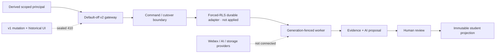

# 13 Maintainability and Architecture Review

RESULT: `MODULAR_KERNEL_WITH_EXPLICIT_OWNERSHIP_AND_DURABLE_ADAPTER_BOUNDARY`

## Architecture assessment

Trust, transport security, state contracts, commands, cutover, jobs, assets, identity, policy/evidence, publication, and Webex acquisition are separate MMC modules. Authority enters through small injected adapters instead of ambient globals. Exact schemas, frozen DTOs, canonical hashes, server clocks, typed enums, and shared UUID/timestamp parsers turn hidden assumptions into executable boundaries.

The central ownership decision is deliberate:

- the generic command kernel owns transaction, idempotency, versioning, result shape, audit, and outbox law;
- each domain kernel owns its canonical business transition;
- the job kernel owns leases/provider evidence/recovery, not the command kernel;
- publication owns immutable student bytes, not mentor canonical tables;
- SQL owns durable authorization/constraints, while memory repositories remain test references.

Reading order: authority enters from the derived principal at left; every operational step proceeds through the gated command/durable/worker path before reviewed student publication. Dashed edges are disabled boundaries, not active data flows.

Only `task.upsert` has a generic local command handler. Session, review, identity, publication, job, and student-response commands are contract-complete but behavior-disabled until an owning-kernel adapter is injected. This fail-closed boundary avoids duplicate ownership and should remain visible in composition code and health/status output.

## Long-term strengths

- Tenant/environment/subject/assignment lineage is repeated at each consequential boundary and validated rather than inferred.
- Job execution uses exact `jobKind`, a singular primary authority grant, typed input edges, stable provider-key digests, generation fencing, quarantined evidence, and explicit adjudication.
- Command and job audits are scoped hash chains; SQL audit rows are append-only.
- Publication carries exact predecessor/current-head/source attestations and cannot become a generic JSON leak channel.
- v1 writers and the historical UI are sealed instead of retained as an emergency dual-write path.
- Feature planes and single-writer state make incomplete rollout truth visible.
- Deterministic tests exercise contention, revocation, rollback, and clock attacks without external credentials.

## Costs and developer obligations

- The trust model is intentionally verbose; adapter builders must populate exact scope and cannot omit policy or source joins.
- A singular job grant requires an explicit orchestration job when work needs multiple authorities, rather than ambiguous grant arrays.
- Domain commands require adapters and cannot be “turned on” by flag alone.
- Student responses are local schema-version-1 objects only; durable version/supersession semantics remain future work.
- JavaScript/SQL vocabulary still requires a generated parity manifest and CI gate, even though the current static schema contract covers the settled migration.
- `server.mjs` remains a large shared owner, so its small MMC bridge must stay protected by shared regression gates.
- Publication attestations are verbose; future loaders should construct them from locked persisted joins, never from client DTOs.

## Alternatives considered

| Alternative | Rejection reason | Selected tradeoff |
| --- | --- | --- |
| Generic CRUD and arbitrary JSON | Client-authored shape/authority; weak lineage | Typed commands and discriminated resources |
| Default success handlers for all commands | Duplicates domain truth and hides missing adapters | Explicit `501` until owning adapter exists |
| Grant arrays on a job | “Any-of”/“all-of” ambiguity and lock complexity | One primary authority grant plus typed edges |
| Retry every expired lease | Can duplicate an in-flight provider effect | Dispatch intent, quarantine, adjudication |
| Direct student views of canonical tables | Private-context and mutation leakage | Separate immutable projection |
| v1 rollback writer | Forks truth after first v2 acknowledgement | Sealed rollback or forward repair |

## Ecosystem and future impact

MMC-specific modules keep Matrix, Scheduler, Calendar, Daily Drills, Webex mutation, R2, Stream, File Vault, WordPress/LearnDash, and payments outside the new write plane. The only shared-server changes derive least-privilege MMC roles and mount sealed/default-off boundaries. A future adapter must preserve middleware order, auth, CSRF, and existing exports.

MegaRun 007 should begin with a generated parity manifest, local mentor-domain adapter interfaces, and composition tests that prove each enabled command calls exactly one owning kernel. MegaRun 008 owns student-plane adapters; MegaRun 009 owns staging SQL/RPC composition. Every later RPC should ship with wrong-scope, revoked, stale-generation/version, exact replay, concurrent conflict, and rollback tests. Applied migrations become immutable; later corrections must be additive.

## Rollback and validation law

Before external v2 state exists, revert the applicable commit or disable its feature plane. After any acknowledged v2 write, preserve receipts/audit and use forward repair. Do not restore v1 writes, rewrite publication history, or retry ambiguous provider work.

Architecture claims are accepted only when backed by executable local tests, disposable PostgreSQL proof, or read-only browser/runtime inspection. No production/deployment claim follows from local memory success.
