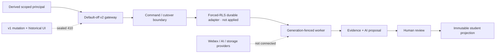

# 01 Bootstrap, Branch, and Authority

RESULT: `MEGARUN_006_AUTHORITY_RESOLVED`

## Pre-change state

- Recorded UTC: `2026-07-15T15:39:47Z`
- Worktree: `/Users/brianb/MissionMed_worktrees/A1-MacAirMMCMentorIntelligence-005`
- Git common directory: `/Users/brianb/MissionMed/.git`
- Branch: `a1-mmc-trust-data-worker-kernel-006`
- Starting HEAD: `a34905a8708d4e254b2e5847cfedd54ea6a68faa`
- Starting tree: clean; no staged, unstaged, or untracked files before this report.
- Starting upstream: none. The predecessor commit is already pushed as `origin/a1-macair-mmc-mentor-intelligence-004`.
- Production, staging, provider, configured-database, credential, and deployment mutations: none authorized and none performed. Later disposable local PostgreSQL validation is isolated proof, not a configured write plane.

## Dependency correction

The OS-routed worktree initially checked out the clean placeholder branch `a1-macair-mmc-mentor-intelligence-005` at `9c1fa72e6b056db8b6fe0e17031fcaa688f78569` (`origin/main`). Read-only ancestry and path comparison proved that this commit does not contain the reconciled MMC implementation or the Architecture 005 authority. Those assets exist on the pushed predecessor commit `a34905a8708d4e254b2e5847cfedd54ea6a68faa`.

The placeholder branch was left untouched. This worktree was switched to a fresh MegaRun branch created directly at the exact pushed Architecture 005 SHA:

`a1-mmc-trust-data-worker-kernel-006 @ a34905a8708d4e254b2e5847cfedd54ea6a68faa`

This satisfies the predecessor dependency without merging unrelated newer `main` work, rewriting history, or replacing newer MMC work.

## Authority hierarchy

1. The MegaRun 006 mission and the 2026-07-15 steering directive.
2. `_AI_HANDOFFS/from_codex/A1_MMC_CAM_V2_ARCHITECTURE_005/`, especially reports 01, 07, 11–13, 16, 20–22 and the Partner Demo rejection report.
3. MissionMed OS boot/current routing and the product registry evidence.
4. `_SYSTEM/CODEX_EXECUTION_GUARDRAILS.md`, `_SYSTEM/CRITICAL_SYSTEMS_CONTRACT.md`, `_SYSTEM/DATA_FLOW_CONTRACT.md`, `_SYSTEM/SUPABASE_MIGRATION_PROTOCOL.md`, `_SYSTEM/NAMING_CANON.md`, and the Matrix runtime lock protocol/manifest.
5. Current code, tests, migrations, and historical handoffs as implementation evidence.

The MissionMed OS product index does not provide a standalone MMC passport and classifies MMC authority as unknown. This is an authority degradation, not a conflict: the explicit mission plus the pushed Architecture 005 package supplies the scoped MMC authority, while all shared MissionMed HQ, data, migration, and Matrix protections remain controlling. No Matrix runtime file is in scope.

## Steering correction

The Partner Demo is classified exactly as:

`HISTORICAL · SYNTHETIC · FUNCTIONAL-CONCEPT REFERENCE ONLY · DESIGN REJECTED · NOT CAM V2.0 AUTHORITY`

It may be preserved and tested as historical evidence. Its visual language, interaction model, information architecture, responsive behavior, density, card patterns, and presentation choices have zero design authority. MegaRun 006 performs no CAM redesign; all API and state decisions must support the first-principles CAM v2 experience planned for MegaRun 007.

## Protected-path decision record

`missionmed-hq/server.mjs` is a protected shared runtime owner. It may be changed only if repository inspection proves an MMC-specific mount or boundary cannot be safely sealed within an isolated MMC module. Any permitted change must be minimal, preserve exports/middleware order/routes/auth/CSRF behavior, and pass the current MMC suite, shared runtime/deploy validators, route-collision checks, and the critical-systems gate. Broad parser, auth, session, CSRF, bootstrap, environment, or non-MMC route changes are rejected.

Historical migrations are immutable. MegaRun 006 may add correctly sequenced, unapplied migrations and validation snippets only. It may not run `db push`, `db reset`, migration repair, direct migration-history writes, live RLS mutation, or any staging/production command.

## Authorized implementation families

- `missionmed-hq/routes/mmc-coaching-pipeline.mjs` for compatibility sealing only.
- New isolated `missionmed-hq/routes/mmc/` versioned gateway modules.
- Existing MMC-only libraries and new `missionmed-hq/lib/mmc/` trust, contracts, command, query, job, asset, identity, evidence, policy, publication, cutover, and observability modules.
- Additive `supabase/migrations/*mmc_cam_v2*` and read-only validation snippets.
- `missionmed-hq/tests/mmc-*`, new `missionmed-hq/tests/mmc-cam/`, and MMC-specific local fixtures.
- This run's reports under `_AI_HANDOFFS/from_codex/A1_MMC_TRUST_DATA_WORKER_KERNEL_006/`.
- `missionmed-hq/server.mjs` only under the protected decision above.

Explicitly excluded are Matrix, Scheduler, Calendar, Daily Drills, `video_registry.json`, R2, Stream, File Vault, WordPress/LearnDash, payments, provider accounts, production/staging resources, credentials/env values, raw media, and the Partner Demo implementation.

## Rollback

Before any external state exists, rollback is commit-scoped: revert the applicable MegaRun checkpoint or disable the default-off MMC v2 feature gates. Historical v1 mutation routes are sealed; the runtime begins `SEALED_NO_WRITER` until a separately authorized, reconciled v2 cutover. No rollback may introduce dual-write or discard an acknowledged v2 write in a later authorized cutover.

## Pre-implementation gates

- Complete source/import/consumer mapping for every intended file.
- Run the applicable critical-system and Matrix freshness checks before a protected touch.
- Establish baseline validators before implementation.
- Confirm additive migration naming, ordering, headers, transactions, forced RLS, and no migration application.
- Red-team auth, CSRF, exact origin, payload bounds, identity evidence, worker fencing, idempotency, publication isolation, audit, and secret/path redaction.

# 02 Dependency and Ecosystem Map

RESULT: `MMC_006_BOUNDARIES_MAPPED`

## Runtime ownership

MMC remains an isolated subsystem inside `missionmed-hq`. The shared `server.mjs` owns session parsing, route order, redirects, and static/API dispatch. MMC-specific trust behavior lives under `missionmed-hq/lib/mmc/` and `missionmed-hq/routes/mmc/`. The shared server imports the coaching-pipeline compatibility module and passes it a minimal dependency set; that module's matcher owns both the historical coaching family and the exact `/api/mmc/v2/**` family, delegating v2 requests to the gated route module. The remaining shared-server changes seal v1 persistence mutations and the historical private HTML mount. WordPress `hq_operator`/`operator` identities remain CAM v2 operators and are never promoted to administrators by the bridge.

```mermaid
flowchart LR
  Client["Authenticated client"] --> Shared["MissionMed HQ session / route owner"]
  Shared --> Seal["v1 compatibility seals"]
  Shared --> Gateway["/api/mmc/v2 gateway · default off"]
  Gateway --> Principal["Derived scoped principal + role ceiling"]
  Principal --> Cutover["Tenant/environment single-writer authority"]
  Cutover --> Command["Transactional command kernel"]
  Command --> Data["Forced-RLS CAM v2 schema"]
  Data --> Jobs["Durable jobs + generation fencing"]
  Jobs --> Assets["Opaque asset broker"]
  Assets --> Evidence["Transcript → evidence → proposal → review"]
  Evidence --> Publication["Approved immutable student projection"]
  Publication --> Student["Exact student read/respond boundary"]
```

## Direct consumers and boundaries

| Boundary | Consumers | 006 disposition |
| --- | --- | --- |
| `missionmed-hq/server.mjs` | All MissionMed HQ routes | Protected; minimal MMC-only edits; shared route order preserved; operator→admin promotion denied |
| `/api/mmc/coaching-pipeline/*` | Historical private MMC client/tests | Authentication and CSRF retained; operational code removed; `410 SEALED` |
| `/api/mmc/persistence` | Historical private ownership adapter | GET remains a read adapter; POST is sealed after auth/CSRF |
| `/mmc-private/*` | Historical v1 UI | Auth boundary retained; authenticated runtime returns strict-CSP `410`; static files preserved only as archaeology |
| `/api/mmc/v2/*` | CAM v2 local-contract client/worker | Mounted in the shared dispatcher through the coaching-pipeline compatibility bridge but default off; exact origin/CSRF/bounded JSON; injected dependencies; no LIVE in-memory mode or durable runtime adapter |
| Webex pull helper | Historical MMC ingestion foundation | Dedicated MMC credential names, exact Webex origin, trigger allowlist, byte/record limits, no ambient token leakage |
| Supabase migration | Future authorized CAM v2 database apply | Additive and unapplied; no configured database touched |

## Protected ecosystem

Matrix runtime files and manifests, Scheduler, Calendar, Daily Drills, `video_registry.json`, R2, Stream, File Vault, WordPress/LearnDash, payments, deployment manifests, shared production Supabase, and provider accounts were not modified. No watcher was started. No cloud object, Webex recording, credential, migration history row, staging resource, or production resource was mutated.

The protected-system gate found the expected dirty `missionmed-hq/server.mjs` and passed its syntax/import checks. The decision record in report 01 authorizes this minimal touch. All other protected paths remained clean.

## Environment truth

- Runtime feature planes default false.
- Initial cutover state is `SEALED_NO_WRITER`.
- Historical v1 is not a fallback writer.
- Fixture, local, staging, and live identities are separate enum values.
- LIVE rejects in-memory command/cutover dependencies.
- The Partner Demo remains synthetic historical evidence and has no design or runtime authority.

## Operational dependency status

The trust kernel is implemented and locally validated. It is not deployed, no CAM v2 migration has been applied, no production credentials were read, and no live provider proof was attempted. Those are later authorized release activities, not hidden completion claims.

# Partner Demo Rejection and CAM v2 Replacement

RESULT: `PARTNER_DEMO_DESIGN_AUTHORITY_REJECTED`

## Status

The existing `/mmc-partner-demo/` is:

`HISTORICAL · SYNTHETIC · FUNCTIONAL-CONCEPT REFERENCE ONLY · DESIGN REJECTED · NOT CAM V2.0 AUTHORITY`.

The file remains preserved as historical evidence. Its navigation, visual language, hierarchy, density, typography, spacing, card patterns, colors, responsive behavior, and interactions have zero authority over the redesigned MMC.

## Local browser audit evidence

The preserved surface was inspected locally at `1280×720` and `390×844`. The browser console contained no warning or error entries. The only network failure was an expected local fixture/API fetch returning `404`; no production or provider request was made. At desktop size, important content was cropped. At 390px, the fixed-width/min-width layout produced an unusable mobile experience rather than a meaningful responsive transformation. This directly confirmed the static source review instead of relying on screenshots alone.

The temporary static audit server was stopped and browser tabs were finalized after inspection. MegaRun 006 made no redesign, visual refresh, or production UI change.

## Why it is rejected

- Eleven peer destinations expose a feature inventory instead of Dr Brian’s operating jobs (`missionmed-hq/public/mmc-partner-demo/index.html:274-288`).
- KPI tiles and a safety panel occupy the first visual tier before the mentor’s actual decision.
- Uniform navy rectangles, rainbow accents, small labels, and repeated card grids create a generic dark SaaS dashboard rather than a focused MissionMed command center.
- Global navigation, student chips, risk labels, open loops, a brief, and demo controls compete at once, weakening attention hierarchy.
- Profile, memory, goals, timeline, and preview are presented as separate destinations even when they are projections of the same canonical objects.
- Student Preview appears inside the mentor product and obscures the required authentication/publication boundary.
- Pipeline and mentoring concepts are not separated by role or consequence.
- The fixed 980px narrow-screen floor (`index.html:258-259`) directly contradicts the 320/390px and 200% zoom requirements.
- Synthetic scripted outcomes can look complete without proving identity, persistence, evidence, review, accessibility, or student safety.

The demo feels dated because it applies a dashboard template to a longitudinal human workflow. It is cluttered because every possible capability receives a peer card or navigation label. It lacks CAM v2 hierarchy because there is no dominant work vessel, one-next-action law, evidence inspector, focus mode, or meaningful responsive transformation.

## Functional concepts retained independently

Only concepts supported by current MMC functionality and user jobs survive:

- prepare → conduct → capture → review → follow through continuity;
- goals, milestones, tasks, promises, open loops, sessions, memory, and timeline as product objects;
- a privacy-safe student benefit projection;
- a clearly synthetic public narrative surface, if it remains useful;
- a selected-student briefing and next-action concept.

These concepts would be selected if the Partner Demo had never existed. No demo-specific layout or interaction survives with them.

## Patterns that must not survive

- Feature-count navigation and KPI-first home.
- Horizontal chips as global student selection.
- Separate screens that duplicate the same student state.
- Equal-weight rectangular card wallpaper.
- One unexplained risk/readiness score.
- Safety text used as decorative wallpaper.
- Synthetic “live” completeness or fixture ambiguity.
- Static Student View inside mentor navigation.
- Fixed-width desktop canvas and horizontal mobile overflow.
- Tiny uppercase body labels, color-only state, and decorative AI styling.
- Pipeline administration embedded in mentor session review.

## CAM v2 replacement

CAM v2 replaces the demo with a job-centered mentor command system: Today, Students, Work, Reviews, plus a role-gated Operations workspace. Each screen has one dominant vessel and action, a route-scoped student identity, progressive detail, and a provenance inspector. The deep-ink family shell, ember action budget, human-gold/machine-cyan semantics, crafted geometry, causal motion, Focus mode, and responsive navigation make the product recognizably MissionMed. A separate authenticated student projection provides only versioned approved content.

| Partner Demo pattern | Problem | CAM v2 replacement | User benefit |
| --- | --- | --- | --- |
| Eleven-item feature rail | Requires subsystem choice before the job is understood | Today / Students / Work / Reviews | Faster orientation and stable mental model |
| KPI wall | Counts do not explain why or what next | Ranked attention queue with source age and action | Decision in under one minute |
| Horizontal student chips | Scales poorly and creates mutable selection ambiguity | Search plus route-scoped `/students/:id` context | Deep links and consistent identity |
| Separate Profile and Memory | Duplicates student truth | Student Overview plus private inspector | One coherent brief with detail on demand |
| Goals and Timeline as peers | Fragments longitudinal state | Plan and History tabs | Predictable homes for canonical objects |
| Pipeline inside Meeting | Mixes mentoring with privileged administration | Role-gated Operations and Reviews | Calmer mentoring and safer permissions |
| One risk badge | Hides evidence and can stigmatize | Deadline/follow-through/readiness/data-support dimensions | Explainable, fairer action |
| Uniform card grid | Makes everything equally important | Dominant work vessel, support region, inspector | Lower cognitive load |
| Static Student Preview | Has no auth or publication proof | Separate versioned student projection | Real privacy and agency |
| Fixed desktop rail/min-width | Breaks phone, tablet, and zoom | Compact rail, drawer, mobile bottom navigation | Usable everywhere |
| Global safety banners | Become background noise | Persistent environment/save indicator plus object trust cues | Truth stays visible at the point of decision |
| Synthetic outcomes | Can simulate success without contracts | Deterministic empty/partial/error/adversarial fixtures | Honest validation |
| Rainbow status accents | Creates decorative competition | Ember action, gold human, cyan machine, semantic exceptions | Faster visual parsing |
| Generic dashboard cards | Feels like SaaS/CRM skin | CAM continuity thread and evidence studio | Distinctive mentor command identity |

## Revalidation statement

Every architecture recommendation was reviewed after the steering correction. Unsupported Partner Demo inheritance was removed. The proposed UI/UX scores use mentor task speed, student comprehension, trust, CAM family coherence, accessibility, responsiveness, and implementation safety—never fidelity to the Partner Demo. The selected architecture would be identical if the demo had never existed.

# 03 MegaRun 006-A Security Seal

RESULT: `LEGACY_OPERATIONAL_BOUNDARIES_SEALED`

## Sealed surfaces

- `missionmed-hq/routes/mmc-coaching-pipeline.mjs` is now a small compatibility module. It imports no filesystem, provider, Webex, worker, persistence, or analysis adapter. Auth is required; mutation requests cross CSRF first; historical paths return `410 mmc_legacy_pipeline_sealed`; exact `/api/mmc/v2` paths delegate to the gated gateway.
- `/api/mmc/persistence` preserves authenticated v1 read-adapter behavior only. Mutation methods pass auth/CSRF and return `410` rather than performing whole-state writes.
- The shared server's low-level legacy `insertMmcRow` and `updateMmcRow` helpers now unconditionally throw the sealed-writer error. Even an internal caller that bypassed the HTTP compatibility branch cannot reach a legacy Supabase mutation path.
- `/mmc-private/*` no longer serves the inline-handler v1 HTML at runtime. Before any private/API/static route decision, the shared server performs one strict pathname decode and rejects malformed escapes, NUL, backslash, and `.`/`..` segments with `400`; encoded separators or traversal cannot skip the private-route seal and fall through to public static serving. After route-specific authentication the private family returns `410 mmc_historical_surface_sealed` with `default-src 'none'`, no-store, frame denial, no-referrer, no-sniff, same-origin resource policy, restrictive permissions policy, and no-index headers.
- Historical static UI files remain unchanged as product archaeology except for truthful sealed/read-only labels and removal of v1 POST behavior.

## v2 gateway controls

- Default-off gateway flag is evaluated before tenant/environment request parsing.
- Exact approved HTTPS origin and fetch-metadata policy.
- Unconditional mutation CSRF.
- Strict UTF-8 decoding, `application/json`, byte limits, plain-object schemas, and unknown-field rejection.
- One shared strict RFC 3339 parser for state, command, asset-authority, and publication contracts; it rejects JavaScript `Date` rollover/impossible dates and offsets beyond `14:00`.
- One shared RFC 9562 UUID parser across route/command/job: v9 fails closed, while a valid uppercase v7 is accepted and normalized to canonical lowercase before semantic binding.
- Exact typed security/JSON values: principal IDs, worker queues, and CSRF session/header tokens must be strings; numeric IDs, string-encoded lease integers, and string-encoded AI confidence cannot cross validation by coercion.
- Route-specific private authorization and derived principal ceilings.
- Tenant/environment/subject/assignment scope cannot be rebound by request data.
- Strict response security headers and bounded/redacted public errors.
- No LIVE in-memory command or cutover authority.
- No service-role key in browser/runtime code.
- Only local `task.upsert` has a built-in command handler. Session, review, identity, publication, job, and student-response commands fail with `501` until an owning-kernel adapter is explicitly injected; feature flags alone cannot enable synthetic domain writes.

## Credential and path controls

Publication output rejects credential-shaped material, bearer/JWT/key patterns, HTML, URLs, and arbitrary path/pointer fields. The asset broker exposes opaque handles only. Webex errors are reduced to safe public codes and do not include tokens, response bodies, query secrets, local roots, or absolute paths. Secret/path-shaped object fields are redacted by the shared MMC error utility.

## Principal controls

`deriveMmcPrincipal` binds source and configured principal ID, tenant, environment, role, subject, assignment, workload, and signed queue. Conflicts fail closed. Unknown capabilities and above-role-ceiling grants fail closed. Worker analysis-result and asset-processing authorities are exact workload capabilities, distinct from mentor/admin job-enqueue authority. The shared WordPress bridge maps only genuine string administrator roles or `manage_options` to CAM v2 admin; non-string role values are ignored rather than coerced with `toString()`, operator roles remain operator, and arbitrary private-route allowlist roles default to mentor.

## Validation evidence

- Route security: default off, exact origin, CSRF, malformed UTF-8, bounded JSON, private auth, assignment fail-closed, LIVE in-memory denial.
- Legacy boundary seal: no operational legacy dependency calls.
- Persistence integration: authenticated read adapter preserved; HTTP and low-level insert/update mutation paths both sealed.
- Private mount: historical HTML not served; strict JSON CSP enforced; canonical-path unit cases plus an independent 12,288-case encoded-path fuzz found zero private-path bypasses.
- Webex policy/route seal: dedicated configuration and sealed compatibility route.
- Principal derivation: exact scope, role ceilings, queue binding, worker analysis/asset separation, and shared-server operator non-promotion.
- Critical-systems gate: exit 0; expected protected-file warning only.

Independent post-fix verification passed 19/19 scoped validators. No production mutation or deployment occurred.

# 04 CAM v2 Schema and RLS Kernel

RESULT: `ADDITIVE_DURABLE_KERNEL_IMPLEMENTED_UNAPPLIED`

## Migration boundary

MegaRun 006 adds one transaction-wrapped, uniquely sequenced migration:

`supabase/migrations/20260715155243_a1_mmc_006_trust_data_worker_kernel.sql`

It creates only additive `mmc.cam_v2_*` objects plus standard pgcrypto digest support. Its explicit schema-build-target guard is LOCAL/STAGING/CI-only; MegaRun 006 used only disposable local PostgreSQL targets and marked the final proof target `local`. The migration is unapplied to every configured MissionMed database (`schemaApplied: false` in the file-mode validator) and all planes remain sealed. It does not alter an existing MMC v1 table, shared MissionMed application table, auth table, migration-history row, bootstrap, or production resource. The companion `supabase/snippets/20260715_mmc_cam_v2_rls_validation.sql` is an owner-seeded synthetic isolation/recovery fixture for a disposable database; it is not a migration, live end-to-end proof, or production command.

## Durable object inventory

The schema separates 31 tables by ownership:

| Plane | Tables |
| --- | --- |
| Trust and control | `tenants`, `principals`, `subject_links`, `assignments`, `policy_versions`, `authority_grants`, `cutover_states` |
| Command and audit | `command_receipts`, `idempotency_records`, `audit_events` |
| Canonical mentor/student state | `sessions`, `tasks`, `commitments`, `goals`, `milestones`, `student_statements`, `student_responses` |
| Asset, evidence, and review | `source_assets`, `transcript_versions`, `evidence_spans`, `analysis_runs`, `ai_proposals`, `review_decisions`, `lineage_edges` |
| Publication | `publications`, `publication_items` |
| Worker and delivery | `jobs`, `job_inputs`, `outbox_events`, `consumer_effects`, `consumer_inbox` |

All durable IDs are UUIDs at the SQL boundary. Composite unique keys and foreign keys repeat tenant/environment and, where applicable, assignment/subject/mentor/job/grant. This prevents a valid ID from one scope being joined to another scope merely because its opaque value matches.

Persisted environments use the same canonical contract as JavaScript: `FIXTURE`, `LOCAL`, `STAGING`, and `LIVE`. That data vocabulary is distinct from the migration's schema-build-target guard (`local`/`staging`/`ci`), which prevents an unscoped apply and does not redefine runtime data. MegaRun 006 used only disposable local PostgreSQL 16 targets; the final clean proof used build target `local`. It did not apply to MissionMed staging or production.

## RLS and authority law

- Every CAM v2 table enables and forces RLS.
- Authenticated direct table access is SELECT-only and limited by exact principal, mentor assignment, student ownership/publication entitlement, worker workload/queue, or trust-operator policy.
- Authenticated execution is narrow: worker lease/result/recovery, outbox/inbox, and typed job-input/handoff RPCs only. There is no reviewed runtime RPC for enqueue, canonical artifact-output creation, domain commands, or publication approval/render mutation.
- Direct authenticated mutation policies are absent. The owner-seeded fixture can build synthetic rows to prove constraints, but that owner path is not a runtime adapter or application authorization model.
- RPC/helper `search_path` is pinned; public execution is revoked before narrow role grants.
- Claims derive tenant, environment, principal, workload, queue, lease generation, and outbox lease generation from signed application metadata. Request parameters cannot replace them.
- Authority checks lock tenant, principal, policy, grant, assignment, cutover, job, and handoff rows that could revoke or change eligibility during mutation.
- Feature planes and the single-writer state default off; a valid role alone cannot bypass cutover.

The inbox effect RPC is one reviewed exception to the usual RLS-on function posture: as a security-definer it uses `row_security = off` so an exact durable receipt can be checked before a now-expired delivery lease, which is necessary for lost-response idempotency. It still derives active actor/scope/capability/queue from signed claims, binds the exact event/effect/target, returns `false` only for exact replay, conflicts on mismatch, and requires a current generation-bound lease for any new effect.

The settled bounded static and dynamic red-team found no residual P0/P1 defect in the migration, companion validation snippet, and static contract validator. It additionally repaired owner-path terminal-transition coherence, exact expired-lease reclaim shape, active-lineage endpoint version protection, cutover cleanup, and student-scoped outbox revocation. The current source also seals every terminal job against later evidence/completion rewrites, binds successful jobs to exact provider receipt/idempotency event evidence, and applies an exact-version fence plus active-lineage guard to publication items. These last hardenings change existing function bodies and add nested rollback probes only: they add no table, function, trigger, or top-level validation block. The validator reports 31 tables and 31 forced-RLS tables. Independent catalog inventory found 74 `SECURITY DEFINER` functions, 74 exact-signature execute revokes, and zero missing revokes; authenticated retains execute on only 21 reviewed outer RPC/read helpers. It also found 51 durable digest columns, all 51 protected by lowercase SHA-256 checks. This is static/schema-contract closure, not evidence that a configured MissionMed database was applied.

## Worker/data integrity

Jobs use the same six exact `jobKind` values as the JavaScript boundary and one primary authority grant. The stable provider-idempotency-key digest is required and immutable in both proven and unproven modes; “proven” additionally requires a policy digest. Generation, attempt, lease owner/expiry, dispatch intent, result digest, result authority state, and recovery evidence are explicit columns rather than an arbitrary status blob. A row already in `SUCCEEDED`, `FAILED`, `DEAD_LETTER`, or `CANCELLED` rejects every later update, sealing both completion identity and provider evidence. Deferred success validation binds the job to one exact generation result event, including result digest/time, provider receipt digest, provider-idempotency truth, and provider-idempotency-key digest.

Typed `job_inputs` bind a producer generation and exact artifact digest to a consumer. Acquisition success requires a matching active source-asset handoff to transcript processing; transcript success requires a matching active transcript handoff to AI analysis. Completion and recovery share the same exact-success validator so reconciliation cannot manufacture success that normal completion would reject.

Provider-result recording preserves evidence but leaves its delivery event quarantined. Only a current-authority completion/reconciliation path can emit a deliverable operational transition. The outbox consumer effect and inbox receipt are separately durable and bind exact event/effect/aggregate identities.

## Evidence, publication, and audit integrity

Transcript/evidence/proposal/review rows preserve source and assignment lineage. AI proposal kinds exclude free-form `RISK_SIGNAL`; attention/risk remains a separately governed deterministic projection. Publication rows and items use exact state/source/version/predecessor/content bindings rather than a mentor-table view. Student publication policies require the exact student, readable state, enabled plane, and current durable record.

Publication item JSON is not an extension bag: a trigger enforces exact discriminator keys/types, per-field byte bounds, source version hash, item payload digest, correction-predecessor identity, and safe plain-text/date fields. Its RFC 3339 helper checks real calendar/offset syntax (including the `14:00` maximum) while the canonical JSON payload preserves 1–9 fractional digits for digest/readback parity. Every publication-item update preserves `created_at`, advances `object_version` by exactly one, and receives a server timestamp; an active exact-version lineage edge blocks that advance until the edge is governed to an invalidated state. JavaScript `projectionDigest` remains the wire-projection authority; SQL separately seals an `item_set_digest` over 1–100 exact child attestations. Parent/child locking prevents late inserts and cross-parent moves, and deferred constraints prevent incoherent corrections or two readable current heads for one subject. `CORRECTED` is deliberately terminal in this migration because the current JavaScript contract does not authorize a correction to become readable again; a later authority change requires a forward migration plus matching JavaScript contract change. Audit events are append-only and scoped hash chains. The trigger assigns the next scoped sequence and previous digest under lock, then seals the event digest; update/delete is rejected. This provides tamper evidence without copying sensitive payload bodies into the audit row.

## Why this design

The rejected alternatives were broad service-role table access, client-supplied scope claims, arbitrary JSON job/publication blobs, grant arrays with ambiguous semantics, and retry-based recovery that bypassed exact producer output. The selected design increases DDL/RPC size and requires explicit adapters, but makes revocation, lineage, idempotency, publication, and provider uncertainty enforceable at the last durable boundary. Its intentionally sealed mutation gaps are release gates, not implied functionality.

## Settled disposable PostgreSQL proof

The final artifacts were frozen and independently checksummed:

| Artifact | SHA-256 |
| --- | --- |
| `supabase/migrations/20260715155243_a1_mmc_006_trust_data_worker_kernel.sql` | `244739e1451ea3ac06c1693cf4c005b4678d2f1de4673b4d9fb9aa278186895f` |
| `supabase/snippets/20260715_mmc_cam_v2_rls_validation.sql` | `d3630a78be1ca6ae37debd0f0d3b8ea40915a0edf57df7bdd15c962bb70c8c0e` |
| `missionmed-hq/tests/mmc-cam/schema/mmc-v2-schema-contract-validation.mjs` | `3c27860ac4f1fa915e58f1c3aa2ae11b0aa0033b37d2364ad0f7199fef279df3` |

PostgreSQL 16.13 (Homebrew) cluster `/private/tmp/mmc006-final-proof4.fjnmwh` was disposable, local, and isolated from configured MissionMed projects. With schema build target `local`, the exact frozen migration applied cleanly, the 40-block owner/authenticated validation fixture passed, deferred constraints were explicitly forced, and the transaction ended with `ROLLBACK`. The post-rollback catalog check returned zero rows across all 31 CAM v2 tables. The migration then reapplied cleanly and the same fixture also passed through `COMMIT`. The disposable server was stopped; its data and logs were preserved as local evidence.

Catalog evidence after apply was exact: 31 CAM v2 tables, all 31 with RLS enabled and forced; authenticated had SELECT and no direct table mutation on all 31; `anon` had no table privilege on all 31; 65 authenticated policies were SELECT-only; 144 user triggers were enabled; and all 74 `SECURITY DEFINER` functions denied default `PUBLIC` and `anon` execution. Authenticated execute remained limited to 21 reviewed functions. The 23 invoker helpers retain PostgreSQL's default execute but are unreachable to `PUBLIC`/`anon` because those roles have no `mmc` schema usage. The 51/51 durable digest-check inventory matched the static proof. The static validator returned `MMC_V2_SCHEMA_CONTRACT_VALID` with `schemaApplied: false`; that value correctly describes its no-database file mode and does not contradict the separate disposable PostgreSQL proof.

Four current-byte two-session proofs passed. Readable-head and late-child contenders visibly waited on `Lock|transactionid`; exactly one readable head and one committed successor child remained, while the duplicate head and late child were rejected. Job-completion and outbox-terminal contenders visibly waited on scoped advisory locks and converged on one `FAILED` job transition and one `DEAD_LETTER` delivery transition without replay mutations. All 144 user triggers remained enabled. The final 64-event audit chain had unique contiguous sequences and digests with zero gaps or link breaks. Details are recorded in report 15.

## Rollback and production posture

The migration is unapplied to every configured MissionMed environment in this run. Before a first authorized apply, rollback is file/commit scoped. After any environment applies the immutable migration, corrections must use a new forward migration; never edit the applied file or repair history manually. Feature planes remain off until reconciliation and staged adapter proof.

No configured Supabase project or RLS policy, migration history, production/staging database, credential, or deployment was mutated. The disposable proof establishes DDL, fixture, catalog, cleanup, and lock behavior only; it does not supply the absent runtime enqueue, canonical artifact-output, domain-command, publication mutation, or LIVE identity-promotion adapters. No production readiness is inferred from DDL presence.

# 05 Command, Idempotency, Transaction, and Audit Kernel

RESULT: `COMMAND_TRANSACTION_KERNEL_LOCALLY_VERIFIED`

## Exact command contract

The wire contract defines seven typed commands: `task.upsert`, `session.close`, `review.decide`, `identity.decide`, `publication.approve`, `job.enqueue`, and `student.respond`. Every command carries an exact `schemaVersion: 1` envelope whose `commandId` uses the shared canonical RFC 9562 variant UUID parser (versions 1–8, including uppercase v7 normalized to lowercase; v9 rejected), plus a scoped idempotency key, expected aggregate version, target, purpose, and kind-specific bounded payload. Numeric/string coercion is prohibited: IDs must be strings and versions must be actual integers. Unknown fields, split target IDs, protected authority/lineage fields, and non-canonical values fail closed before mutation. Command timestamps use the shared strict RFC 3339 parser, so impossible calendar dates/rollover and offsets beyond `14:00` cannot enter the semantic hash.

The local command kernel owns the cross-domain transaction law, not every domain's business semantics. `task.upsert` has a canonical local handler. The other six command kinds deliberately return `501 COMMAND_HANDLER_NOT_ENABLED` until their owning evidence, identity, publication, job, session, or student-response adapter is injected. This prevents a generic command layer from synthesizing a second, weaker source of domain truth. Tests prove the failed commands leave no aggregate, audit, receipt, lineage, or outbox residue.

## Transaction and replay law

- Repository serialization spans multiple kernel instances that share a repository.
- `commandId` uniqueness is scoped by tenant and environment.
- The idempotency scope binds tenant, environment, principal, command kind, target, schema version, and key; the semantic hash additionally binds purpose, expected version, and canonical payload.
- An exact replay returns the original stored result only after current authorization is rechecked.
- Reusing a command or idempotency identity for different semantics returns deterministic `409`.
- Aggregate identity is `(tenant, environment, aggregate kind, target)` rather than command action, preventing two actions from creating parallel versions of one domain object.
- Expected version zero is valid for create; a stale version returns the canonical nested conflict envelope with `expectedVersion`, `currentVersion`, and `COMPARE_AND_REAPPLY`.
- The asynchronous domain handler runs before a second literal-true authorization check at the commit boundary. Revocation during handler execution therefore leaves no mutation.
- Aggregate, version, command receipt, object results, lineage, audit event, and outbox event commit atomically. Injected failures prove full rollback.

The success result is exact and frozen: `ok`, `status`, `commandId`, `aggregateVersion`, `objectResults`, `auditId`, `correlationId`, and `replayed`. `objectResults` is a bounded list of exact `{id, kind, version}` records so a future owning adapter can return every canonical object changed without leaking implementation data.

## Audit integrity

Each command commit appends a tenant/environment-scoped hash-chain event. The event binds sequence, previous digest, principal, effective role, subject, assignment, purpose, command identity and kind, target/version, semantic hash, before/after hashes, outcome, correlation ID, and server time. The next scoped command validates the entire prior chain before mutation; a rewritten digest stops execution with `COMMAND_AUDIT_CHAIN_INVALID`.

This is tamper-evident local evidence, not an assertion that process memory is durable. The additive SQL kernel supplies the durable append-only audit boundary; database proof is reported separately in reports 04 and 15.

## Concurrency evidence

The executable stress contract proves:

- 100 concurrent exact duplicates converge on one commit and one result identity;
- concurrent semantic mismatch, stale version, scoped command-ID reuse, split-target, and protected-lineage attacks fail deterministically;
- replay and commit-time authority are both rechecked;
- tampered audit history blocks the next mutation;
- an injected failure after any staged component leaves no partial state.

## Decision rationale and tradeoff

The rejected alternative was to install shallow default handlers for every declared command merely to make each route return success. That would duplicate the stronger domain kernels and allow syntactically valid but semantically unverified publication, identity, review, or provider work. The selected injected-owner boundary is more explicit for developers and safer for future adapters, at the cost of six deliberately unavailable command behaviors in this local foundation.

## Scope and rollback

This is a local reference/contract kernel. The HTTP gateway permits the memory kernel only in `FIXTURE` or `LOCAL`, requires an admin until persisted assignment authorization exists, and still requires single-writer cutover authority. `STAGING` and `LIVE` require a durable adapter. Rollback is commit-scoped or feature-plane disablement; no v1 writer is restored and no acknowledged v2 write may be discarded. No database, provider, staging, or production write plane was enabled.

# 06 Worker, Queue, Outbox, and Inbox Kernel

RESULT: `WORKER_FENCING_RECOVERY_AND_EFFECT_IDEMPOTENCY_LOCALLY_VERIFIED`

## Canonical job contract

The job vocabulary is exact: `SOURCE_DISCOVERY`, `ASSET_ACQUISITION`, `TRANSCRIPT_PROCESSING`, `AI_ANALYSIS`, `PUBLICATION_RENDER`, and `RECONCILIATION`. Enqueue binds a canonical UUID target, exact `jobKind`, signed queue, opaque asset handle, one active `authorityGrantId`, payload digest, stable provider-idempotency-key digest, principal scope, and idempotency identity. The singular grant is intentional: every executable job has one primary policy/assignment authority that can be locked and revalidated without ambiguous “any grant” semantics; typed handoff edges carry producer/consumer lineage separately.

Claims require a derived worker principal with exact workload and queue. Worker claim, completion, outbox dispatch, inbox consumption, analysis, and asset processing are distinct capabilities; mentor, operator, and admin roles do not inherit workload-only authority.

## Lease, provider, and recovery law

- One winner is elected across 1,000 concurrent claim attempts.
- Generation increments for every new lease and fences stale workers.
- Attempts are capped at five; lease duration is bounded to 15–300 seconds.
- Lease generation, lease seconds, retry delay, and other integer fields require actual safe integers; numeric strings are rejected rather than coerced.
- A generation-bound dispatch intent containing the immutable provider-key digest must commit before the provider result can be recorded.
- Provider results are append-once per generation. The provider key cannot be rebound between dispatch, result, retry, or history.
- A successful terminal job must match one exact generation-bound result event on result digest/time, provider receipt digest, provider-idempotency truth, and provider-idempotency-key digest.
- Once a job is `SUCCEEDED`, `FAILED`, `DEAD_LETTER`, or `CANCELLED`, every later row update is rejected; provider evidence and completion identity cannot be rewritten through an owner or future privileged adapter.
- Every recorded provider result is evidence first. Its transition/outbox event is `QUARANTINED`; only a separately authorized completion or reconciliation emits a deliverable operational event.
- A response arriving just after lease expiry may be preserved only for the exact unchanged generation and owner. It cannot complete directly or make a newer lease stale.
- Revocation stops new work and completion, while preserving the already-issued exact-generation provider outcome as quarantined evidence for operations adjudication.
- An expired dispatched job is never blindly reclaimed. `CONFIRMED_NOT_SENT` may schedule bounded retry; `OUTCOME_UNKNOWN` can only dead-letter unless server-proven provider idempotency makes retry safe.
- Recovery inputs—finding, disposition, evidence digest, and retry delay—are passed into the authorization decision, recorded in immutable history, and cannot be invented by a workload principal.

## Outbox/inbox effect boundary

Outbox events are authoritative, hash-bound records with tenant, environment, job/generation, aggregate, effect kind, one immutable bounded `delivery_queue_name` (default `mmc.outbox`, not a schema-wide fixed value), and independent delivery generation. Cursor progress is tenant/environment/queue scoped, so an idle tenant cannot be starved by another tenant's scan position.

The dispatcher lease exposes the server-bound effect and aggregate identity. A consumer must return the same effect kind, target kind, and target ID. The bounded repository projection, inbox receipt, and `DELIVERED` state commit atomically; no arbitrary callback or provider side effect is accepted inside this transaction. Exact replay returns `duplicate: true` even when the delivery lease has expired, while a different effect under the same event identity conflicts.

The terminal producer event is deliverable; provider-evidence events remain quarantined. Caller-selected consumer identity and cross-tenant cursor/effect rebinding are rejected.

## Audit and stress evidence

Every job transition appends a tenant/environment-scoped hash-chain audit event before its outbox event. Rewriting prior audit content stops the next transition atomically.

The local stress contract delivered 10,000 logical events ten times each: 100,000 delivery attempts produced exactly 10,000 effects and 90,000 duplicate receipts. It also covers 1,000-way claim contention, same-repository multi-kernel serialization, stale generations, late provider results, authority revocation, lost-response replay, result-less recovery, operator adjudication, effect-target mismatch, tenant-scoped cursors, injected rollback, and tampered audit history.

## Alternatives, ecosystem impact, and rollback

A simple “lease expired, retry” queue was rejected because it can duplicate an already-issued provider effect. A generic callback inbox was rejected because it cannot atomically prove an external effect. The selected model is more verbose and requires explicit operations reconciliation, but it makes ambiguity visible and preserves evidence for forward repair.

The kernel is isolated under MMC and does not start a worker daemon, connect to Webex, invoke AI, download media, or mutate R2/Stream/File Vault. The JavaScript repository is a deterministic local reference. SQL supplies the reviewed worker/outbox/input transition RPCs for owner-seeded fixture jobs, but no authenticated runtime enqueue or canonical artifact-output mutation RPC; its PostgreSQL proof is a foundation test, not live end-to-end execution. Rollback before release is commit-scoped or feature-plane disablement; after an acknowledged v2 write, only forward repair is allowed. No provider, configured database, staging, or production mutation occurred; disposable local PostgreSQL proof is documented in reports 04 and 15.

# 07 Asset Broker and Media Boundary

RESULT: `OPAQUE_MEDIA_BOUNDARY_LOCALLY_VERIFIED`

## Broker guarantees

- Public identity is an opaque asset handle; native paths are never returned.
- The default native-path adapter denies.
- Registration validates bounded stream size, declared byte length, MIME, magic bytes, and SHA-256.
- Metadata is immutable and bound to tenant, environment, subject, assignment, source object, fixture/live class, and authority grants.
- Grants are server-attested opaque objects; serialization/forgery loses authority.
- Register/open/read/revoke recheck current async authority and require literal `true`.
- Grant expiry and broker timestamps use an injected server clock plus the shared strict RFC 3339 contract; impossible calendar dates/JavaScript rollover and offsets beyond `14:00` fail closed. Caller context has no accepted `now` field and cannot revive a grant with a forged old time.
- Revoked reads are fenced and public errors disclose no path or provider detail.
- Revocation holds a per-handle lock, captures exact context/grant references, and revalidates after every asynchronous authority check. Context mutation during the wait cannot retarget the revocation; 100 concurrent revocations converge on one revoked state.

## Idempotency

The scoped registration identity is `(tenant, environment, subject, kind, requestId)`. Its semantic hash binds source object ID, expected content SHA-256, MIME, and byte length. Exact replay returns the original frozen handle after authority recheck. Any semantic rebinding returns `MMC_ASSET_IDEMPOTENCY_CONFLICT`.

One hundred concurrent identical registrations produced one handle. Handle and receipt commit together; injected error cannot leave one without the other. Tests advance the broker clock beyond grant expiry, prove that a forged old caller timestamp is rejected, and exercise concurrent revocation/TOCTOU behavior.

## Webex boundary

The historical Webex pull foundation now requires dedicated MMC configuration names, exact `https://webexapis.com`, explicit redirect handling, trigger allowlisting (including `[MM-ADV]`), record/byte bounds, fixture-only roots, and safe error translation. The fixture root and target are checked by `lstat`/`realpath` plus device/inode continuity; symlink roots and swap races fail closed before temp/link work. It does not read ambient browser credentials or expose tokens. Compatibility routes remain sealed; no recording was downloaded.

## Not claimed

No production object-store adapter, malware scanner, media retention job, live Webex OAuth proof, R2/Stream write, or raw-media transfer occurred. These are release/integration work after the trust kernel, not implicit capabilities.

# 08 Identity, Assignment, and Authority Kernel

RESULT: `IDENTITY_PROMOTION_FAILS_CLOSED`

## Identity states

The attested identity kernel uses explicit states: `UNVERIFIED`, `PROBABLE`, `MANUAL_REVIEW`, `CONFLICT`, `VERIFIED_LOCAL_LINK`, and `REVOKED`. Evidence is signed, time-bound, issuer/audience bound, replay protected, and key-rotation aware. Signed timestamps use the shared strict RFC 3339 calendar proof and retain the identity envelope's canonical millisecond encoding. Identifier/nonce fields require strings and bounded configuration values require their declared numeric type; numeric and numeric-string coercion fail closed. Verification and resolution are factory closures over server-owned clocks; caller requests cannot supply security time or revive expired evidence with a forged old timestamp.

## Promotion rule

Matching identifiers alone cannot choose an arbitrary subject. Server-owned `subjectAnchorBindings` must bind tenant/environment/subject to the exact anchor type and digest. Without that binding, even exact evidence remains manual review. Conflicting anchors become `CONFLICT`; revocation is durable.

Automatic promotion is permitted only in explicitly configured non-LIVE environments after two independent attested source families match the exact server-owned anchor. `LIVE` automatic promotion is unconditionally rejected with `IDENTITY_LIVE_SIGNED_EVALUATION_REQUIRED`; caller-supplied evaluation metadata cannot enable it. A future LIVE path requires a signed, durable, replay-verifiable evaluation authority and policy activation.

## Isolation

Fixture/live, tenant, environment, and subject are independent bindings. Cross-scope lookups fail as not found. Five thousand deterministic adversarial negative pairs produced zero false automatic promotions, including an arbitrary-subject attack.

## Principal and assignment authority

Derived principals bind source and configured identity, tenant, environment, role, subject, assignment, workload, and queue. Principal identifiers and worker queue names require actual strings; numeric coercion fails closed. Role ceilings separate mentor review/publication, operator trust operations, student publication/response, worker claim/complete/inbox/analysis, and admin queueing. Authority is rechecked at every sensitive operation; cached DTO fields never substitute for persisted assignment or grant state.

## Publication lifecycle nuance

An active mentor assignment is required for preview/new approval. If the assignment expires or is revoked after approval, the former mentor loses preview authority, but the exact student retains an already-published immutable projection and response agency. This follows student entitlement rather than silently punishing the student for a later mentor-assignment change.

## SQL structural binding

The migration uses composite tenant/environment/assignment/subject/mentor keys so canonical rows cannot mix assignment A with subject B or mentor C. Final database proof is recorded in report 04.

# 09 Policy, Evidence, AI, and Review Kernel

RESULT: `EVIDENCE_LINEAGE_AND_REVIEW_LOCALLY_VERIFIED`

## Policy registry

Policy IDs are tenant/environment scoped, immutable by version, separately activated, and strict typed strings; policy/principal identifiers are never accepted through numeric coercion. Register/activate actions append immutable audit records. The same opaque policy ID can exist in another tenant without collision.

## Evidence chain

Transcript registration validates exact UTF-8 content hash, bounded segments, active authority, tenant/environment/subject/assignment, and immutable ID. Transcript, span, proposal, canonical, and judgment maps are scope-keyed. Exact byte spans bind quote, speaker, and time range to the source segment.

AI proposals require worker analysis-result authority, active grants, one exact assignment, active spans, policy version, model/prompt/run provenance, and bounded numeric confidence; string confidence is rejected instead of coerced. The exact proposal kinds are `FACT`, `RECOMMENDATION`, `OPEN_LOOP`, and `TASK_CANDIDATE`. `RISK_SIGNAL` is rejected: risk/attention must be a separately governed deterministic product projection, not a free-form AI fact category. A factual proposal must exactly equal supporting evidence; it is never operational or publication eligible before human review.

## Concurrency and immutability

- One hundred conflicting same-ID transcript creates: one winner, 99 conflicts, no overwrite.
- One hundred conflicting same-ID proposal creates: one winner, 99 conflicts, one lineage edge.
- Concurrent ACCEPT/REJECT reviews: one terminal winner, one deterministic conflict, one review record, one canonical.
- Assignment authority is checked before waiting and again inside the proposal lock immediately before commit.
- A failed first review plus authority revocation while a second waits produces zero review/canonical commits.

## Human judgment and revocation

Human professional judgment remains explicitly human, records rationale/uncertainty, and cannot masquerade as evidence. Canonical inputs emit `CANONICAL_TO_JUDGMENT` lineage. Span revocation performs exact-scope, cycle-safe recursive traversal: proposals become revoked and every downstream AI canonical or human judgment becomes `REASSESSMENT_REQUIRED` and non-operational.

Lineage edges store tenant/environment plus exact typed endpoint IDs and versions; they do not duplicate subject or assignment columns. On insert, the resolver locks both exact endpoint versions, derives their subject/assignment scopes, requires one exact subject and compatible non-null assignments, and intentionally treats a student statement's assignment as null. While an edge remains active, either governed endpoint is forbidden from advancing beyond the recorded version until that edge is invalidated. An identical opaque transcript/span/proposal ID in a second tenant remains unchanged when the first tenant revokes evidence.

## Publication boundary

Reviewed canonical objects remain `publicationEligible: false`; publication requires a separate persisted approval and projection contract.

# 10 Publication and Student Agency Contracts

RESULT: `PUBLICATION_PROJECTION_LOCALLY_VERIFIED_RESPONSE_STREAM_NOT_YET_DURABLE`

## Separate publication plane

Student-visible data is an immutable, versioned projection, never a direct view of mentor-private evidence or canonical tables. The local contract has seven exact item kinds: `TASK`, `MILESTONE`, `PLAN_UPDATE`, `SESSION_SUMMARY`, `FEEDBACK`, `CORRECTION`, and `WITHDRAWAL_NOTICE`. Each discriminator has an exact field schema; unknown fields or a source kind that does not match the item kind fail closed.

Limits are contract data, not UI suggestions: at most 100 items, 160 UTF-8 bytes per title, 4,096 bytes for body/description/criteria/corrected text, 2,048 bytes for summaries/next steps/student messages, and 128 bytes for opaque identifiers. Canonical normalization uses NFC and normalized line endings before hashing and serialization. The shared RFC 3339 parser validates real calendar dates/leap days without JavaScript `Date` rollover and permits no offset greater than `14:00`; accepted 1–9 fractional digits remain byte-preserved rather than being silently truncated or normalized.

## Version and predecessor law

- Version 1 requires all predecessor fields to be null.
- Every later version binds a different predecessor publication ID, exactly `version - 1`, and the predecessor's projection digest.
- Persisted authority must confirm this publication is the current subject head.
- A corrected publication must have a predecessor and at least one `CORRECTION` item.
- Every correction names an item that the persisted predecessor attestation proves actually existed; self-predecessors and unrelated replacement IDs fail closed.
- Every durable publication-item update preserves its creation time and advances exactly one object version; an active exact-version lineage edge must be invalidated before that item can advance.

This explicit lineage prevents a caller from fabricating “version 999,” correcting an unrelated item, or reading a superseded projection as current student truth.

## Exact source authority

Every item embeds one bounded source attestation: source ID/kind/version/version digest plus tenant, environment, subject, assignment, review decision, reviewer, review time, origin, visibility, sensitivity, and publication eligibility. Sources are unique by `(sourceId, sourceVersion)` within a projection. The persisted verifier must return the exact same set and must prove the reviewer is the assignment mentor. Mentor-private, sensitive, unreviewed, direct AI-proposal, future-dated, cross-scope, duplicate, drifted, or caller-invented source attestations are rejected.

`createPublicationAuthorityVerifier` loads persisted publication, current-head, predecessor, identity, assignment, policy, approval, and source state. It issues an opaque, single-use, short-lived operation grant whose binding lives in module-private weak maps. Preview, readback, and response authorization recompute the projection digest and reject forged, replayed, expired, future, withdrawn, wrong-principal, wrong-operation, or drifted grants.

Mentor preview/new approval requires a current assignment. Student readback/respond requires proof that the assignment was active at approval, but a later assignment expiry or mentor revocation does not silently erase an already-published student projection. Identity revocation, approval revocation, withdrawal/expiry, wrong student, or digest drift still denies.

## Content and byte-equivalence safety

Preview and readback use one payload builder and are byte-equivalent for the same version. Internal source, assignment, policy, reviewer, and mentor-private fields are omitted. HTML, URLs/domains, credential/JWT/Bearer/key shapes, private paths, bidi overrides, control characters, unsafe normalization, and byte overflow are rejected. A `NOT_MET` milestone remains `NOT_MET`; publication cannot cosmetically rewrite reviewed truth.

## Student agency: exact current boundary

The shared vocabulary is `ACKNOWLEDGEMENT`, `AGREEMENT`, `CLARIFICATION_REQUEST`, `DISPUTE`, `SELF_REPORTED_COMPLETE`, and `BLOCKER_REPORT`. Acknowledgement/agreement prohibit a message; the other four require bounded student text. A response is separately authored by the exact student, binds the exact publication version and item, uses server-authorized time, and never mutates source truth, mentor verification, task status, or publication bytes.

The important scope limit is explicit: 006 validates only a local response contract at `schemaVersion: 1`, `version: 1`, with `supersedesResponseId: null`. Any response update/supersession fails with `MMC_STUDENT_RESPONSE_DURABLE_STREAM_REQUIRED`. Although `student.respond` is a typed command and the additive schema reserves response storage, no owning command handler, authenticated student route, durable append RPC, or student application is enabled. This is not a live response system.

## Alternatives, tradeoff, and future impact

Directly exposing canonical objects was rejected because private context and later edits could leak or silently alter student truth. Arbitrary JSON publication bodies were rejected because they weaken byte equivalence and make policy review non-deterministic. The exact discriminated projection is more verbose and requires explicit mapping adapters, but it makes privacy, provenance, versioning, accessibility copy limits, and correction behavior testable.

MegaRun 008 — Student Authentication, Publication, and Agency — owns durable source-to-item publication mapping, publication command ownership, append-only response streams with optimistic concurrency, exact student authentication/entitlement, and the separate accessible student application. MegaRun 007 — Mentor CAM v2 Experience and Operations — remains local mentor-plane only and must keep student publication/response disabled. Rollback before any published v2 write is feature-plane disablement; once published, correction/withdrawal and forward repair preserve history rather than rewriting it. No student data was published, no student portal was deployed, and no production state changed.

# 11 v1/v2 Cutover and Rollback

RESULT: `SINGLE_WRITER_PROTOCOL_LOCALLY_VERIFIED`

## State machine

The cutover authority is tenant/environment scoped and begins `SEALED_NO_WRITER`. The in-memory JavaScript reference and durable SQL use the same phases but intentionally give the active state different names:

- JavaScript: `SEALED_NO_WRITER` → `SHADOW_READS` → `V1_FROZEN` → `V2_WRITER` → `FORWARD_REPAIR`.
- Durable SQL: `SEALED_NO_WRITER` → `SHADOW_READS` → `V1_FROZEN` → `V2_ACTIVE` → `FORWARD_REPAIR` (with the reviewed direct sealed-to-frozen preparation edge also permitted).

A durable cutover row must be born sealed with every feature plane false and no preclaimed reconciliation or acknowledgement evidence. Its progression is forward-only. Once SQL reaches `V2_ACTIVE`, its feature planes and fixed reconciliation evidence cannot be edited in place; incident shutdown proceeds only to `FORWARD_REPAIR`, never back to `SEALED_NO_WRITER`.

Historical v1 mutations are already sealed; v1 is not an emergency writer. The HTTP mutation branch returns `410`, and the shared server's low-level `insertMmcRow`/`updateMmcRow` helpers unconditionally throw before any Supabase write. Shadow reads require an exact count/hash reconciliation record. Freezing increments generation and issues an opaque lock. Switching to v2 requires exact reconciliation and zero in-flight v1/v2 commands.

## Feature planes

All planes default false and enable only in order: reads → commands → ingest → AI proposal → operational promotion → student publication. Disabling an earlier plane cascades to later planes. The gateway status is truthful: current read API remains unavailable even if a cutover object reports another value, and the local JavaScript gateway requires both `V2_WRITER` and the command plane. Durable SQL authorizes active-plane RPCs only in its equivalent `V2_ACTIVE` state.

## Command serialization

`runV2Command` holds the cutover transition lock across command execution. The command principal, request, and cutover authority must share exact tenant/environment. Only a new `COMMITTED` result increments acknowledged v2 writes; replays do not.

## Rollback law

- Before any acknowledged v2 write, the JavaScript reference can return to `SEALED_NO_WRITER`, clear its lock, and disable every plane. Before any configured SQL apply/external state, rollback remains file/commit/feature-flag scoped; the durable row does not gain a reverse lifecycle edge.
- After any acknowledged v2 write: rollback to v1 is forbidden because it would fork truth. The only permitted path is `FORWARD_REPAIR` with mutation planes disabled.
- No transition admits dual-write.

## Validation

Tests cover reconciliation mismatch, in-flight drain, default-off planes, pre-write rollback, post-write forward repair, command execution under the cutover lock, replay accounting, and cross-tenant/cross-environment principal attacks.

No cutover was performed outside memory/disposable PostgreSQL tests. Production remains unchanged.

# 12 API, RPC, and Developer Ergonomics

RESULT: `BOUNDARIES_EXPLICIT_DEFAULT_OFF_AND_NOT_RELEASED`

## HTTP surface

The v2 route module defines `GET /api/mmc/v2/status` and is mounted in the shared HQ dispatcher indirectly: `missionmed-hq/server.mjs` imports `mmc-coaching-pipeline.mjs`, that compatibility module's predicate recognizes the exact `/api/mmc/v2/**` family, and its handler delegates those requests to the v2 gateway. Shared API authentication runs before dispatch, and route-specific private authorization plus the default-off gateway gate run inside the boundary. With the default configuration the mounted source path returns safe `503 MMC_V2_GATEWAY_DISABLED`; no v2 service was deployed. Contract tests prove that an explicitly enabled local status response reports API version, CAM v2 authority family, persistence truth, derived role, writer state, feature planes, section availability, freshness, environment, server time, and correlation ID without representing absent durable adapters/providers as available.

The same mounted-but-default-off module defines `POST /api/mmc/v2/commands` as a local contract harness, not an enabled, durable, deployed, or production command service. Its direct tests require private-session authorization, gateway and command feature flags, `FIXTURE`/`LOCAL` memory mode, the shared canonical RFC 9562 variant UUID parser (versions 1–8) for tenant/principal/command/target boundaries, admin role until persisted assignment authorization exists, string-typed CSRF session/header tokens, exact approved HTTPS origin, bounded strict UTF-8 JSON, and single-writer cutover authority. Valid uppercase UUID input is normalized before binding; v9 and type-coerced numeric IDs/versions fail closed. `STAGING` and `LIVE` reject the memory kernel. Of the seven typed command kinds, only local `task.upsert` has a built-in handler; every domain-owned command fails closed until its owning adapter is injected.

The route predicate recognizes only the exact `/api/mmc/v2` family; lookalikes such as `/api/mmc/v20` do not cross the boundary in direct or shared-dispatch tests. Historical pipeline and private UI routes on the shared server authenticate (and mutations cross CSRF) before returning a sealed `410` replacement pointer. MegaRun 007 should compose the local mentor UI, query contracts, and owning-domain adapters on the existing default-off bridge; it must not add a second mount or bypass the shared controls.

The shared dispatcher canonicalizes the URL pathname before any MMC, general API, or static-file branch. A malformed percent escape, decoded NUL/backslash, or decoded `.`/`..` segment receives a bounded `400` before routing; safely encoded ordinary separators and spaces are decoded once and routed by their canonical path. This prevents an encoded private path from bypassing the sealed mount through generic static serving.

## Response contracts

Query responses use exact `{data, meta}` envelopes and preserve `EMPTY`, `PARTIAL`, `UNAVAILABLE`, `REVOKED`, stale, and current truth rather than collapsing them to null. Public errors use one nested `{error: {code, message, retryable, correlationId, ...}}` envelope. Messages are bounded and redacted; diagnostics and retry delay are optional. Version conflicts may expose only the safe exact object `{expectedVersion, currentVersion, resolution: "COMPARE_AND_REAPPLY"}`.

Command success returns an aggregate version plus bounded object results, audit/correlation identities, status, and replay truth. Provider/native objects, paths, authority claims, SQL diagnostics, stack traces, and secrets never cross the public DTO.

## Durable SQL/RPC boundary

The additive migration defines claim-derived, bounded security-definer functions for worker claim/heartbeat/result/completion/recovery, typed producer→consumer input edges, and outbox claim/inbox effect receipt. Tenant, environment, principal, workload, queue, lease generation, and outbox lease generation come from signed application metadata and locked durable rows rather than request JSON. Authenticated direct table access is SELECT-only under forced RLS. Authenticated execution is limited to the reviewed worker/outbox/input RPC set; there is no runtime enqueue, canonical artifact-output, publication-approval/render, or general domain-command mutation RPC in 006.

The migration is LOCAL/STAGING/CI-build-target-only and unapplied to every configured MissionMed environment (`schemaApplied: false` in the file-mode validator). Its RPCs passed owner-seeded disposable PostgreSQL 16.13 fixture, rollback, catalog, and two-session lock proofs, but remain schema artifacts rather than an operational end-to-end service because no durable application adapter or configured database uses them. Exact database evidence belongs in reports 04 and 15.

## Developer ergonomics

- Shared frozen state, command, job, publication, and student-response vocabularies.
- Exact plain-object schemas with unknown-field rejection and byte limits.
- Exact JSON scalar types; no numeric/string coercion across command, job, or evidence contracts.
- One shared RFC 9562 UUID parser across route, command, and job boundaries; v7 accepted and v9 rejected.
- Deterministic clock, ID, authority, repository, and failure adapters for local tests.
- Opaque asset and authority handles instead of native paths or reflectable grants.
- Server-owned clocks for identity, assets, publication, and revocation checks.
- Machine-readable local test outputs suitable for a future CI evidence manifest.
- Deliberately unavailable domain handlers instead of misleading no-op success.

## Tradeoff and next boundary

One generic CRUD API would be shorter, but it would erase domain ownership and invite client-authored authority. The selected typed boundary creates more adapters, yet makes security review, error handling, idempotency, and backwards compatibility explicit. MegaRun 007 should generate the parity manifest, compose local owning-domain mentor adapters, and add query endpoints only for validated local CAM v2 mentor screens. Durable staging SQL/RPC composition belongs to MegaRun 009; student routes belong to MegaRun 008.

There is no general query API, mentor assignment adapter, production repository, worker daemon, provider adapter, authenticated student route, or operational CAM v2 UI in 006. No endpoint was deployed and no external state changed.

# 13 Maintainability and Architecture Review

RESULT: `MODULAR_KERNEL_WITH_EXPLICIT_OWNERSHIP_AND_DURABLE_ADAPTER_BOUNDARY`

## Architecture assessment

Trust, transport security, state contracts, commands, cutover, jobs, assets, identity, policy/evidence, publication, and Webex acquisition are separate MMC modules. Authority enters through small injected adapters instead of ambient globals. Exact schemas, frozen DTOs, canonical hashes, server clocks, typed enums, and shared UUID/timestamp parsers turn hidden assumptions into executable boundaries.

The central ownership decision is deliberate:

- the generic command kernel owns transaction, idempotency, versioning, result shape, audit, and outbox law;
- each domain kernel owns its canonical business transition;
- the job kernel owns leases/provider evidence/recovery, not the command kernel;
- publication owns immutable student bytes, not mentor canonical tables;
- SQL owns durable authorization/constraints, while memory repositories remain test references.

Reading order: authority enters from the derived principal at left; every operational step proceeds through the gated command/durable/worker path before reviewed student publication. Dashed edges are disabled boundaries, not active data flows.

Only `task.upsert` has a generic local command handler. Session, review, identity, publication, job, and student-response commands are contract-complete but behavior-disabled until an owning-kernel adapter is injected. This fail-closed boundary avoids duplicate ownership and should remain visible in composition code and health/status output.

## Long-term strengths

- Tenant/environment/subject/assignment lineage is repeated at each consequential boundary and validated rather than inferred.
- Job execution uses exact `jobKind`, a singular primary authority grant, typed input edges, stable provider-key digests, generation fencing, quarantined evidence, and explicit adjudication.
- Command and job audits are scoped hash chains; SQL audit rows are append-only.
- Publication carries exact predecessor/current-head/source attestations and cannot become a generic JSON leak channel.
- v1 writers and the historical UI are sealed instead of retained as an emergency dual-write path.
- Feature planes and single-writer state make incomplete rollout truth visible.
- Deterministic tests exercise contention, revocation, rollback, and clock attacks without external credentials.

## Costs and developer obligations

- The trust model is intentionally verbose; adapter builders must populate exact scope and cannot omit policy or source joins.
- A singular job grant requires an explicit orchestration job when work needs multiple authorities, rather than ambiguous grant arrays.
- Domain commands require adapters and cannot be “turned on” by flag alone.
- Student responses are local schema-version-1 objects only; durable version/supersession semantics remain future work.
- JavaScript/SQL vocabulary still requires a generated parity manifest and CI gate, even though the current static schema contract covers the settled migration.
- `server.mjs` remains a large shared owner, so its small MMC bridge must stay protected by shared regression gates.
- Publication attestations are verbose; future loaders should construct them from locked persisted joins, never from client DTOs.

## Alternatives considered

| Alternative | Rejection reason | Selected tradeoff |
| --- | --- | --- |
| Generic CRUD and arbitrary JSON | Client-authored shape/authority; weak lineage | Typed commands and discriminated resources |
| Default success handlers for all commands | Duplicates domain truth and hides missing adapters | Explicit `501` until owning adapter exists |
| Grant arrays on a job | “Any-of”/“all-of” ambiguity and lock complexity | One primary authority grant plus typed edges |
| Retry every expired lease | Can duplicate an in-flight provider effect | Dispatch intent, quarantine, adjudication |
| Direct student views of canonical tables | Private-context and mutation leakage | Separate immutable projection |
| v1 rollback writer | Forks truth after first v2 acknowledgement | Sealed rollback or forward repair |

## Ecosystem and future impact

MMC-specific modules keep Matrix, Scheduler, Calendar, Daily Drills, Webex mutation, R2, Stream, File Vault, WordPress/LearnDash, and payments outside the new write plane. The only shared-server changes derive least-privilege MMC roles and mount sealed/default-off boundaries. A future adapter must preserve middleware order, auth, CSRF, and existing exports.

MegaRun 007 should begin with a generated parity manifest, local mentor-domain adapter interfaces, and composition tests that prove each enabled command calls exactly one owning kernel. MegaRun 008 owns student-plane adapters; MegaRun 009 owns staging SQL/RPC composition. Every later RPC should ship with wrong-scope, revoked, stale-generation/version, exact replay, concurrent conflict, and rollback tests. Applied migrations become immutable; later corrections must be additive.

## Rollback and validation law

Before external v2 state exists, revert the applicable commit or disable its feature plane. After any acknowledged v2 write, preserve receipts/audit and use forward repair. Do not restore v1 writes, rewrite publication history, or retry ambiguous provider work.

Architecture claims are accepted only when backed by executable local tests, disposable PostgreSQL proof, or read-only browser/runtime inspection. No production/deployment claim follows from local memory success.

# 14 Security, Privacy, and Threat Review

RESULT: `LOCAL_TRUST_BOUNDARIES_RED_TEAMED_PRODUCTION_UNAUTHORIZED`

## Threats exercised and controls

| Threat | Settled control/proof |
| --- | --- |
| Cross-tenant/environment access | Derived scoped principals, composite durable keys/FKs, forced RLS design, and same-ID multi-tenant tests |
| Shared-auth role escalation | Genuine string administrator roles only become CAM v2 admin; non-string roles are ignored, `hq_operator`/`operator` remain operator, and worker capabilities are workload-only |
| Caller-authored/coerced authority | Exact payload schemas reject tenant, environment, role, assignment, workload, queue, and protected lineage fields; principal/queue/CSRF values require actual strings |
| Identifier/parser drift | Gateway/command/job share RFC 9562 parsing; identity/policy/evidence use strict typed fields; uppercase v7 canonicalizes, v9 fails, and numeric/string coercion is rejected |
| Authority revoked during async work | Command, evidence review, asset revoke, and job transitions recheck literal-true authority immediately before commit |
| Arbitrary subject promotion | Server-owned anchor binding; 5,000 adversarial negative pairs with zero false promotions |
| LIVE automatic identity promotion | Always fails closed until signed, durable, replay-verifiable evaluation authority exists |
| Stale worker overwrite | Immutable provider-key digest, dispatch intent, exact queue/workload, lease generation fencing |
| Ambiguous provider return | Result is append-once quarantined evidence; expired/revoked outcome requires authorized adjudication; blind retry denied |
| Provider double effect | Proven-idempotency retry rule and exact-generation reconciliation; stable key survives generation history |
| Duplicate command/effect | Semantic command receipt, scoped IDs, transactional outbox/inbox, exact-effect binding, atomic effect/receipt/delivery |
| Outbox cross-tenant starvation/rebinding | Tenant/environment/queue cursor; server-bound effect/aggregate; caller-selected consumer identity rejected |
| Audit rewriting | Tenant/environment-scoped hash-chain validation in local kernels; append-only chained durable audit design |
| Evidence laundering | Exact UTF-8 spans, factual equality, separate human judgment, recursive revocation/reassessment; AI proposals never auto-operational |
| Student privacy leak | Separate exact projection, persisted approval/source/predecessor/current-head proof, byte-equivalent preview/readback, DLP |
| Former mentor access | Current assignment required for preview/new approval; revocation denies mentor operation |
| Student loss after assignment end | Historical-at-approval entitlement preserves exact already-published student read/respond; identity/publication revocation still denies |
| Fixture/live confusion | Exact `FIXTURE`/`LOCAL`/`STAGING`/`LIVE` binding and LIVE memory denial |
| Caller-forged security time | Identity, asset, publication, and cutover checks use server-owned/injected clocks; caller time is rejected or ignored |
| Timestamp parser drift | Shared state/command/asset/publication/identity RFC 3339 validation rejects calendar rollover/impossible dates and offsets beyond `14:00`; publication preserves 1–9 fractional digits and identity preserves canonical milliseconds |
| Legacy route bypass | Operational dependencies removed; auth/CSRF then `410`; historical private mount sealed with strict CSP |
| Encoded-path/private-static bypass | One strict pathname decode occurs before every route/static decision; malformed escapes, NUL, backslash, and decoded `.`/`..` segments fail with `400`; a 12,288-case independent fuzz found zero private-path bypasses |
| Webex token/path/root escape | Dedicated config, exact origin, redirect denial, bounded streams, safe errors, fixture-root realpath/inode checks, symlink rejection |

## Privacy and student-safety law

Mentor-private evidence, uncertainty, operational notes, reviewer data, provider metadata, and paths do not enter student bytes merely because they are useful internally. Publication admits only exact reviewed, normal-sensitivity, publication-candidate sources. A student response is authored by the exact student and cannot assert mentor verification or silently complete a canonical task. A `NOT_MET` milestone cannot be cosmetically rewritten.

The student-response boundary remains intentionally narrow: local schema version 1, first-version records only, no supersession, no durable handler/RPC/route. It is not described as a released agency workflow.

## Secret and diagnostic boundary

No env value, token, key, cookie, provider body, credential file, native asset path, or raw media is copied into the implementation reports. Public HTTP errors use one bounded nested envelope; credential/path-shaped text is rejected or redacted. Disposable PostgreSQL tests use synthetic local claims and data only. A final diff secret/path scan remains a mandatory pre-commit gate.

The encoded-path finding is closed for the scoped shared-server implementation: canonical-path unit cases and the independent fuzz both passed, and the post-fix scoped validator run was 19/19 green. This is local source/runtime validation, not a deployment claim.

## Residual security gates

- LIVE identity automation requires an independently signed evaluation artifact, durable nonce/replay store, and approved policy activation.
- Durable adapters must derive every principal/assignment/source/grant join from the database rather than trusting DTO attestations.
- Student response append/supersession needs an exact optimistic-concurrency RPC before the student feature plane can enable.
- Worker supervision needs reconciliation alerts, dead-letter review, and provider/retention runbooks before any external call.
- The additive migration must be reviewed/applied to isolated staging under the migration protocol before release; local proof is not production evidence.

## Alternatives, rollback, and production statement

Weak alternatives—service-role browser access, direct table mutation, unrestricted provider retry, arbitrary publication JSON, v1 fallback writes, and operator/admin capability inheritance—were rejected. The cost is more explicit adapters, durable joins, and operational review; the benefit is inspectable authority and recoverable ambiguity.

Rollback before any acknowledged external v2 write is commit/feature-plane scoped. After a write, preserve audit/evidence and forward-repair. No production deployment, configured-environment migration apply/database mutation, provider activation, credential creation, auth weakening, or RLS bypass was authorized or performed. The disposable local PostgreSQL apply/reapply/rollback proof used synthetic data and is not an external write plane.

# 15 Concurrency, Stress, Idempotency, and Recovery

RESULT: `LOCAL_CONCURRENCY_AND_RECOVERY_KERNEL_VERIFIED`

## Tested contention matrix

| Boundary | Load/failure shape | Settled result |
| --- | --- | --- |
| Command idempotency | 100 concurrent exact duplicates | One canonical commit, one audit/outbox/receipt identity; all responses converge |
| Job leasing | 1,000 concurrent claims | One elected lease; generation fences every stale claimant |
| Outbox/inbox | 10,000 logical events delivered ten times | 100,000 attempts → 10,000 effects + 90,000 exact duplicates |
| Asset registration | 100 concurrent exact registrations | One opaque handle and atomic receipt |
| Asset revocation | 100 concurrent revocations plus context-mutation race | One converged revoked state; stale/rebound context cannot revoke another grant |
| Transcript/proposal create | 100 conflicting creates per identity | One winner; 99 deterministic conflicts; no overwrite |
| Evidence review | Concurrent ACCEPT/REJECT and queued revocation | One terminal decision or zero after revocation; no partial canonical |
| Identity corpus | 5,000 deterministic negative pairs | Zero false promotions; arbitrary-subject promotion denied |

## Command recovery properties

The repository serializes transactions across kernel instances. Semantic command hash, scoped command ID, idempotency identity, aggregate version, object results, audit, lineage, outbox, and receipt share one atomic commit. Failure injection after aggregate, audit, lineage, outbox, or receipt proves no partial state survives. Exact replay rechecks current authority; revocation during an asynchronous domain handler is caught by a second authorization check immediately before commit.

The audit chain is checked before mutation and extended in the same transaction. A rewritten prior event stops forward progress instead of allowing a false continuation.

## Provider uncertainty and worker recovery

The worker model treats provider dispatch and result persistence as separate crash windows:

1. A dispatch intent containing generation and stable provider-key digest commits before any result can be accepted.
2. A result is append-once evidence for the exact generation and is initially non-deliverable/quarantined.
3. Normal completion rechecks current authority and compatible outcome/disposition.
4. A late or revoked result is preserved but requires authorized reconciliation; it cannot be silently dropped or auto-promoted.
5. An expired dispatched generation with no result cannot be reclaimed. Operations must supply bounded immutable evidence: confirmed-not-sent may retry; unknown outcome dead-letters unless provider idempotency is proven.
6. Retry archives result/dispatch history before a new generation, preserving why a second provider attempt was safe.

Tests prove a success cannot be retried, unknown outcome cannot retry without proof, a late exact-generation response can be reconciled without the original workload, stale results lose after a newer generation, and recovery evidence/disposition is part of the authorization decision.

## Outbox/inbox recovery

Outbox dispatch has its own generation/lease and a tenant/environment/queue cursor. The consumer receives a server-bound aggregate/effect identity; target mismatch fails. Effect, inbox receipt, and `DELIVERED` state are one atomic transaction. A simulated failure before that commit leaves all three unchanged. An exact lost-response replay returns duplicate success even after lease expiry; a changed effect conflicts. Multi-kernel and cross-tenant regressions prove no snapshot/replace lost update and no global-cursor starvation.

Provider-evidence transition events remain `QUARANTINED`; an authorized terminal/reconciled transition emits the deliverable event. This prevents an outbox consumer from operationalizing evidence merely because it was recorded.

## Durable PostgreSQL lock proof

PostgreSQL 16.13 in disposable local cluster `/private/tmp/mmc006-final-proof4.fjnmwh` supplied the final exact-byte durable proof. It used the frozen migration, validation-snippet, static-validator, and JavaScript-validator hashes recorded in reports 04 and 19, not a configured MissionMed database.

- Readable publication head: session B waited on `Lock|transactionid`; after A committed, the duplicate head was rejected and exactly one readable head remained.
- Publication seal versus late child: session B waited on `Lock|transactionid`; after A committed the successor seal, the late item was rejected. The successor was `PUBLISHED`, its predecessor `SUPERSEDED`, one committed child remained, and the late-child count was zero.
- Concurrent job completion: session B waited on the scoped advisory lock. After A committed, both callers converged to the exact `FAILED` result. Exactly one `JOB_STATE_TRANSITION`, one completion event, and one provider-evidence resolution existed.
- Concurrent outbox terminal completion: session B waited on the scoped advisory lock. Both callers converged to `DEAD_LETTER`; exactly the claim and terminal delivery transitions existed, with no consumer effect/inbox row and no replay transition.

The clean migration/fixture/forced-constraint/rollback cycle passed and left all 31 tables empty; migration reapply and a fixture `COMMIT` proof also passed. Catalog inspection found 31/31 tables with RLS enabled and forced, 144/144 enabled user triggers, 65 authenticated SELECT policies, 74 security-definer and 23 invoker functions, and no public/anonymous access to the security-definer surface. The final audit chain contained 64 events with contiguous unique sequences, unique digests, zero gaps, and zero broken links. Raw server logs include three rolled-back verifier setup attempts while refining race fixtures plus the expected rejected contenders; none persisted and the final setups/outcomes were clean. These tests establish local PostgreSQL locking, idempotent convergence, and rollback behavior. They do not establish managed-Supabase latency, failover, multi-host worker throughput, provider behavior, or a runtime adapter that this run intentionally leaves sealed.

## Performance interpretation

The 100,000-delivery proof completes against deterministic process memory and validates algorithmic/idempotency behavior, not production throughput, database latency, or provider capacity. No service-level objective is inferred. Staging must repeat representative load with the durable adapter, database locks, network latency, supervisor restart, and multiple worker processes.

## Alternatives and tradeoffs

- Snapshot-and-replace repositories were rejected because concurrent kernels can lose updates.
- At-least-once provider retry without dispatch evidence was rejected because it can duplicate external effects.
- Arbitrary inbox callbacks were rejected because their side effects cannot share the receipt transaction.
- Discarding revoked/late results was rejected because it destroys the evidence needed for safe adjudication.

The selected design favors explicit quarantine and operations recovery over automatic progress. This can increase dead-letter/reconciliation workload, but makes every ambiguity visible and recoverable.

## Rollback and future proof

Local failure injection restores the exact pre-transaction state. Before external cutover, commit revert or feature-plane disablement is sufficient. After an acknowledged v2 write/provider effect, rollback cannot resurrect v1 or erase receipts; use append-only evidence and forward repair.

The exact durable PostgreSQL artifact hashes, catalog proof, and access matrix are recorded in report 04. No configured database, queue, provider, staging service, or production service was mutated by these local stress tests; only disposable local PostgreSQL databases were used.

# 16 Ecosystem Regression and Protected Systems

RESULT: `MMC_SCOPED_REGRESSIONS_GREEN_NO_EXTERNAL_MUTATION`

## Protected-system result

The fresh enforced critical-systems gate exited `0` with ten passes. It verified `.railwayignore`, the USCE intake route, Matrix protocol/manifest/guard references, the critical contract/manifest/gate, `node --check missionmed-hq/server.mjs`, and relative imports across the gate's 16 local files. Its three warnings were expected and non-blocking: the intentional dirty `server.mjs`, network checks skipped, and three browser journeys skipped.

The Matrix runtime preflight exited `42` because all ten protected Matrix source files are absent from this MMC-only worktree. No Matrix path is changed. This is an out-of-scope worktree skip, not a Matrix regression or a passed runtime proof.

Protected deployment/configuration owners remained unchanged: `.railwayignore`, `railway.json`, both package manifests, the critical-system contract/manifest/tool, and the Matrix protocol/manifest/tool. Railway's start owner remains `node missionmed-hq/server.mjs`; new MMC runtime imports are not ignored.

## Local runtime and route regressions

- Recursive import scan after the shared UUID/timestamp and canonical-path additions: 40 changed/new JavaScript files, 69 parsed relative imports, 0 missing.
- Syntax: `node --check` passed 40/40 changed/new JavaScript files.
- Safe historical MMC validators: 13/13 passed—v1 core; coaching worker core/route; coaching pipeline; Partner Demo; persistence integration; private mount; roster identity; roster verification; selection continuity; student resolution; Webex policy/route. Persistence integration additionally asserts the low-level legacy insert/update helpers throw without calling Supabase.
- Shared route/security validators: 4/4 passed—v2 gateway security, legacy boundary seal, principal derivation, and shared-server least-privilege role resolution.
- Custom/direct route matrix: 10/10 paths passed. `/api/mmc/persistence` remains a separate exact shared-server branch; v2/coaching near-prefix predicates are rejected in their route modules; shared server registrations remain unique; and the persistence branch precedes the coaching compatibility matcher. That matcher includes the exact `/api/mmc/v2/**` family and delegates it to the default-off v2 gateway, so the v2 source route is mounted indirectly rather than unmounted.
- Post-fix independent path verification passed 19/19 scoped validators. Its 12,288-case encoded-path fuzz produced zero private-surface bypasses: canonical decoding occurs before every private/API/static branch, while malformed escapes, NUL, backslash, and decoded dot segments fail closed with `400`.
- `git diff --check` passed at the audit checkpoint.

The shared `server.mjs` change is limited to canonical request-path enforcement, MMC role derivation, and the coaching compatibility bridge plus sealed historical boundaries, including unconditional low-level legacy insert/update denial. The v2 handler is already reached through that bridge but remains default-off and has no deployed/durable composition. Existing route order, startup owner, exports, auth/CSRF ownership, and non-MMC bootstraps were preserved.

## Repository scope and artifact hygiene

At the read-only audit checkpoint, every changed path belonged to the 006 handoff, MMC runtime/test surface, additive CAM v2 migration, or validation snippet. There were no out-of-scope changes, binary/media/cache/build artifacts, or files over 5 MiB. A secret scan found no real/high-confidence secret, env/credential file, service-role browser use, direct browser Supabase access, or deploy command. Credential-shaped values are deliberate synthetic DLP fixtures; `/Users/example` values are adversarial redaction fixtures. Existing Brian drop-zone constants were not changed.

The migration filename is a unique 14-digit latest sequence, wrapped in `BEGIN`/`COMMIT`, and additive under `mmc.cam_v2_*` (plus standard pgcrypto digest support). It does not modify an existing MMC v1 or shared-system object. Final schema behavior is covered separately by report 04.

## Explicit non-executed checks

Credential-dependent staging persistence, roster staging/browser, and provider/browser smokes were not run. The first exits at an explicit missing base URL/cookie precondition; the others require unavailable staging authorization, would start the prohibited full-server watchers, or would write a screenshot. Network, production, configured-database apply, provider, browser-service, deploy, and watcher activity is not represented as tested. Disposable local PostgreSQL validation is separately reported in 04 and 15.

## Local environmental incident

Browser tooling filled the local disk during the audit. Remediation deleted only two stale, unopened Chrome temporary/cache objects totaling approximately 13 GiB. No repository, project, migration archive, source, report, user document, or browser profile authority was deleted. The final `df -h /` checkpoint reported approximately 20 GiB available. The static audit server was stopped and browser tabs were finalized. This was the only local environmental issue and did not require external help.

## Ecosystem impact and rollback

Matrix, Arena, STAT, StoryForge, Scheduler, Calendar, Daily Drills, `video_registry.json`, R2, Stream, File Vault, WordPress/LearnDash, payments, production Supabase, Railway resources, Cloudflare resources, and provider accounts were not mutated. No watcher was started.

Before external v2 state exists, the MMC-scoped shared-server bridge can be reverted with the MegaRun commit or left inert by its default-off flags. Historical v1 mutations remain sealed; rollback must not reintroduce a writer. No P0/P1 ecosystem regression was found in the scoped local audit.

# 17 Remaining Risks and Opportunities

RESULT: `TRUST_FOUNDATION_COMPLETE_RELEASE_AND_PRODUCT_WORK_REMAINS`

## Remaining implementation and release risks

| Priority | Exact remaining risk | Required treatment |
| --- | --- | --- |
| Gate before any configured durable environment | Migration is additive and locally proven but unapplied outside disposable databases; no deployed schema hash exists | Independently review/freeze the recorded hash, perform the separately authorized isolated staging apply, then repeat RLS/two-session/recovery proof in staging |
| Gate before command enablement | Six domain commands have exact wire contracts but deliberately no generic handler | Inject one owning-kernel adapter per domain; prove atomic result mapping and no duplicate source of truth |
| Gate before durable traffic | HTTP composition has no durable command/query/job/asset/evidence/publication repository | Implement exact RPC adapters, safe failure mapping, health truth, and parity tests |
| Gate before durable mutation | SQL exposes reviewed worker/outbox/input RPCs but no runtime enqueue, artifact-output, domain-command, or publication-approval RPC | Design each owning mutation RPC, RLS/claim law, atomic receipt/audit/outbox, and adversarial tests in its authorized later run |
| Gate before student agency | Response contract permits only local schema-version-1 first records | Build append-only response RPC/route, optimistic versioning, supersession lineage, entitlement proof, and abuse/privacy controls |
| Gate before LIVE identity automation | LIVE automatic promotion is disabled | Signed immutable evaluation artifact, approved policy, durable replay/nonce store, reproducible corpus |
| Gate before provider calls | No supervised worker/provider runtime or live Webex proof | Queue supervisor, provider adapters, consent/retention approval, reconciliation/dead-letter tools, alerts, read-only canary |
| Gate before publication | No durable source→item mapper or student application | Exact persisted mapping, approval/current-head transaction, accessible authenticated student projection |
| Operational | No backup/restore or disaster-recovery rehearsal | PITR/replay/forward-repair drills with evidence and recovery objectives |
| Contract maintenance | JS/SQL vocabularies are checked by a local static contract, not a generated shared manifest in CI | Generate one parity artifact for enums, grants, states, RPCs, item kinds, errors, and feature planes |
| Product | Historical private UI and Partner Demo are sealed/rejected and mobile-unusable | Build CAM v2 from Architecture 005; do not renovate or inherit v1/demo design |

These are not hidden claims of 006 readiness for production. They define why the feature planes remain off and why no deployment or configured-environment migration apply occurred. The disposable PostgreSQL apply/reapply/rollback proof in reports 04 and 15 does not weaken those gates.

## Remaining product and workflow opportunities

- A ranked Today queue can explain source age, urgency, confidence, and next action instead of showing generic KPIs.
- Route-scoped student identity can unify briefing, plan, work, history, and evidence without mutable global selection.
- A provenance inspector can make AI proposals useful without presenting them as facts.
- Durable promises/open loops can measure mentor follow-through as well as student progress.
- Separate publication plus typed student responses can create an accountable acknowledgment/dispute/blocker loop after the durable stream exists.
- Typed job lineage can support transcript reprocessing, prompt/model comparisons, retention work, and accountable forward repair.
- A role-gated Operations workspace can keep pipeline health, dead letters, identity review, and reconciliation out of the mentoring flow.
- Hash-chain audit views can explain “who changed what and why” without exposing protected payloads.

## High-value improvements deliberately deferred to 007+

The remaining high-value work requires an authorized durable environment, owning-domain adapters, worker/provider operations, or product implementation. Adding shallow local handlers or a cosmetic UI in 006 would create architectural debt rather than close those gates.

Roadmap ownership is fixed by Architecture 005: MegaRun 007 owns Mentor CAM v2 Experience and Operations locally; 008 owns Student Authentication, Publication, and Agency locally; 009 owns Authorized Staging and Release Candidate work; 010 owns Production Preflight, Controlled Release, and Certification. No earlier run may borrow a later run's environment or deployment authority.

## Full-live production completion estimate

The engineering trust/data/worker foundation is materially stronger, but the end-to-end live product is approximately **25–35% complete**. The remaining 65–75% includes durable adapters and staging apply, supervised worker/provider operations, CAM v2 mentor UI, authenticated student experience, accessibility, observability, backup/restore, controlled canary, deployment authorization, and production rollout. No local test result should be converted into a higher deployment percentage.

# 18 MegaRuns 007–010 Starting Point and Updated Roadmap

RESULT: `MEGARUN_007_MENTOR_CAM_EXPERIENCE_AND_OPERATIONS_STARTING_POINT`

## Starting point

After the final MegaRun 006 publication step has pushed the branch and verified local/remote SHA equality, use that verified commit as the sole continuation. Do not reopen the MacBook Air, v1 writer, historical private UI, or Partner Demo as authority. The migration remains unapplied to every configured MissionMed environment, all v2 feature planes default off, and the writer begins `SEALED_NO_WRITER`. Disposable PostgreSQL proof is validation evidence, not a deployed environment.

006 supplies exact local command/state/publication contracts, fail-closed domain ownership, identity/evidence/asset kernels, a generation-fenced job reference, an additive forced-RLS schema/RPC design with disposable PostgreSQL proof, an in-repository shared-server bridge to the default-off v2 gateway, and regression evidence. It does **not** supply an enabled operational v2 service, configured/applied database, durable deployed composition, worker daemon, provider connection, student response stream, or CAM v2 product.

| Run | Controlling prompt | Environment authority | Stop condition |
| --- | --- | --- | --- |
| 007 | `(A1)-MMC-CAM-v2-Codex-MegaRun-007-Mentor-Experience` | Local/fixture only | `MMC_CAM_MENTOR_READY` |
| 008 | `(A1)-MMC-CAM-v2-Codex-MegaRun-008-Student-Publication-Agency` | Local/test identities only | `MMC_STUDENT_PROJECTION_READY_FOR_STAGING` |
| 009 | `(A1)-MMC-CAM-v2-Codex-MegaRun-009-Staging-Release-Candidate` | Exact separately authorized staging target only | `MMC_CAM_V2_RELEASE_CANDIDATE_READY` |
| 010 | `(A1)-MMC-CAM-v2-Codex-MegaRun-010-Production-Release` | Exact separately authorized production release only | `MMC_CAM_V2_PRODUCTION_CERTIFIED` or immediate rollback |

## MegaRun 007 — Mentor CAM v2 Experience and Operations

007 owns the semantic responsive CAM shell, canonical mentor operating loop, evidence/review experience, and Operations UI against deterministic v2 contracts in local/fixture mode only. It must not apply a staging or production migration, connect a live provider, enable a student route, build the student application, or deploy.

Recommended sequence:

1. Freeze the 006 contract inventory and generate a machine-readable JS/SQL parity manifest for environment, capabilities, command/job/item/response kinds, states, grants, RPCs, errors, and feature planes.
2. Define owning-domain adapter interfaces for task/session, review/evidence, identity, publication preparation, and jobs. Compose them locally so every enabled command invokes exactly one owner; keep student publication/response disabled.
3. Add local query/view-model contracts for the mentor plane with explicit available/partial/empty/unavailable/revoked/stale/error states.
4. Implement CAM v2 mentor UI from Architecture 005: Today, Students, Work, Reviews, role-gated Operations, evidence inspector, Focus mode, route-scoped student context, and responsive navigation.
5. Add a local deterministic worker simulator only where required to exercise mentor review and evidence workflows. Do not call Webex, AI, storage, or any provider.
6. Validate keyboard, screen reader, focus, 200% zoom, 320/390px, tablet/laptop, reduced motion, RTL, long transcripts/action lists, and every honest state.
7. Run local contention, replay, revocation, cutover, audit, and rollback regressions after composition. Keep all external feature planes off.

007 exit gates:

- Mentor-plane product works end to end with deterministic local/fixture data.
- Today / Students / Work / Reviews / Operations use one coherent object model and route-scoped identity.
- Every enabled local command has exactly one owning adapter; all others remain visibly disabled.
- No Partner Demo/v1 visual or interaction inheritance.
- No open P0/P1 local security, privacy, data-integrity, concurrency, or accessibility defect.
- Migration remains unapplied to configured environments; no staging, production, provider, student-app, or deployment activity.

## MegaRun 008 — Student Authentication, Publication, and Agency

008 owns exact student-principal authority and the separate mobile-first student product: authentication, subject/entitlement derivation, versioned publication approval/readback, authorship, durable response/supersession, recourse, correction/withdrawal, isolation, and the accessible student application. It must preserve mentor-private separation and preview/readback byte equivalence. Staging and production remain prohibited.

## MegaRun 009 — Authorized Staging and Release Candidate

009 owns the first explicitly authorized isolated staging migration apply, immutable schema-hash record, durable SQL/RPC adapters, supervised workers, dedicated test providers, Webex read-only canary, observability, dead-letter/reconciliation tools, v1→v2 shadow/cutover proof, and the full synthetic mentor/student release candidate. It must run RLS, multi-session lease/revocation, exact handoff, provider quarantine, outbox replay, load/chaos, backup/restore, accessibility, and rollback/forward-repair proofs. Production remains prohibited.

## MegaRun 010 — Production Preflight, Controlled Release, and Certification

010 owns production readiness review, explicit production authority, migration/change window, smallest safe synthetic production canaries, plane-by-plane enablement, monitoring, rollback/forward-repair decision points, controlled expansion, and certification. It must not infer authorization from 006–009 completion; new feature work must return through staging as a new release candidate.

## Cross-run invariants

- v1 and the historical private UI remain sealed.
- Partner Demo remains historical, synthetic, and design-rejected.
- LIVE automatic identity promotion remains off until independently signed durable evaluation authority exists.
- Provider evidence remains generation-bound and quarantined until current-authority disposition.
- Student responses never mutate mentor truth.
- No applied migration is edited; corrections are forward-only.
- Feature planes enable only after exact reconciliation and only in the run authorized to do so.

## Recommended next prompt

`(A1)-MMC-CAM-v2-Codex-MegaRun-007-Mentor-Experience`

Authorize local/fixture mentor-plane composition, product implementation, and accessibility validation only. Explicitly prohibit staging/production apply, provider access, student-plane implementation, deployment, and production mutation.

# 19 Final Trust-Kernel Readiness

RESULT: `TRUST_KERNEL_IMPLEMENTATION_COMPLETE_RELEASE_PLANES_DISABLED`

## Certification scope

This report evaluates MegaRun 006 as a foundational local/durable-contract kernel. It does not certify a live product, deployment, applied database, provider connection, worker service, or student portal. “Ready” means the branch contains a fail-closed, testable foundation from which MegaRun 007 can build the local mentor plane without returning to v1 or the MacBook Air.

## Exit-condition matrix

| Required kernel | 006 evidence | Truthful disposition |
| --- | --- | --- |
| Trust/security | Derived principals, non-coercive role resolution, role ceilings, string-typed principal/queue/CSRF, exact origin/JSON types, shared UUID/timestamp laws, canonical pre-routing path decode, nested safe errors, sealed v1, default-off v2 | Locally verified; independent 12,288-case path fuzz found zero private-path bypasses |
| Command model | Seven exact command contracts; shared RFC 9562 UUID v1–v8 boundary; serialized transaction/idempotency/version/result/audit/outbox law | Complete foundation; six owning-domain adapters intentionally fail closed |
| Worker | Exact job kinds/grant/queue, generation fencing, dispatch intent, result quarantine, adjudication, outbox/inbox | Local reference verified; no worker daemon/provider |
| Data/RLS | Additive 31-table composite-key schema; static plus disposable PostgreSQL proof establishes 31/31 forced RLS, 74/74 `SECURITY DEFINER` default-deny, 51/51 lowercase SHA-256 digest checks, 144 enabled user triggers, 65 authenticated SELECT policies, and authenticated SELECT-only table access; reviewed worker/outbox/input RPCs | Unapplied to configured environments/planes sealed; owner-seeded disposable proof only; runtime enqueue/artifact/publication/domain mutations absent |
| Evidence/review | Exact UTF-8 spans, AI provenance, proposal non-operation, human review/judgment, recursive revocation | Locally verified |
| Identity | Signed attestations, anchor binding, replay/key rotation, 5,000-pair corpus | Locally verified; LIVE auto-promotion disabled |
| Publication | Exact item/source/predecessor/current-head/digest/byte/DLP contract plus strict calendar/offset/fractional timestamp law | Locally verified; no durable mapper or portal |
| Student agency | Six-value contract and exact entitlement/authorship checks | Local schema-version-1 first-response only; durable stream disabled |
| Concurrency/idempotency | 100 command, 1,000 claim, 100,000 delivery, asset/evidence/review races plus lock-observed PostgreSQL publication/job/outbox races | Locally verified |
| Audit | Scoped command/job hash chains and append-only durable audit design | Local tamper and disposable PostgreSQL chain proofs verified; unapplied to configured environments |
| Rollback/recovery | Single writer, pre-write sealed rollback, post-write forward repair, provider adjudication | Locally verified |
| Ecosystem safety | Critical gate, syntax/import, 13 legacy, 4 shared security, route matrix, scope/secret audits, post-fix 19/19 scoped validators | Green within local/no-network scope |

## Architectural conclusions

1. No dual-write or fallback v1 writer remains: both the HTTP mutation path and low-level legacy Supabase insert/update helpers fail closed.
2. Generic command infrastructure cannot impersonate domain ownership; unavailable adapters return `501` without residue.
3. Provider return is evidence, not completion. Quarantine and explicit adjudication preserve ambiguity safely.
4. Student bytes are a separate versioned projection with exact predecessor/source authority.
5. LIVE automatic identity promotion cannot be enabled by local evaluation metadata.
6. Shared MissionMed systems are outside the MMC write plane and remained unchanged.
7. Feature planes, configured-environment migration apply, provider connections, and deployment remain off.

The shared-server encoded-path finding is closed in local scope. One canonical decode now precedes every private/API/static route decision; malformed or traversal-shaped decoded paths fail with `400`. Independent verification passed 19/19 scoped validators and a 12,288-case fuzz with zero private-surface bypasses. This does not represent a deployed runtime test.

The bounded three-file SQL static red-team found no residual P0/P1 defect. Dynamic proof then used PostgreSQL 16.13 in clean disposable cluster `/private/tmp/mmc006-final-proof4.fjnmwh`: migration apply and all 40 transactional validation blocks passed, deferred constraints were explicitly forced, rollback left all 31 tables empty, migration reapply passed, and a fixture `COMMIT` proof passed. Catalog inventory established 31/31 forced-RLS tables, 65 authenticated SELECT policies, 74 security-definer plus 23 invoker functions, and 144/144 enabled user triggers. Readable-head, late-child, job-completion, and outbox-terminal two-session races visibly waited on the intended transaction/advisory locks and converged without duplicate transitions. The final 64-event audit chain had zero gaps or broken links. The 13/13 CAM and 13/13 preserved MMC JavaScript validators also passed. These conclusions do not convert file-mode `schemaApplied: false` into a configured-database apply, fill the intentionally absent runtime mutation adapters, or authorize staging/production apply.

Frozen SQL proof hashes are: migration `244739e1451ea3ac06c1693cf4c005b4678d2f1de4673b4d9fb9aa278186895f`; validation snippet `d3630a78be1ca6ae37debd0f0d3b8ea40915a0edf57df7bdd15c962bb70c8c0e`; static schema validator `3c27860ac4f1fa915e58f1c3aa2ae11b0aa0033b37d2364ad0f7199fef279df3`; JavaScript fencing validator `ae3074089682ce308ce918995e588253c27b896ac6f557c2d95f07c8b70fcb04`. Syntax, import, whitespace, and secret-pattern scans passed. No configured or production database was touched.

## Remaining work versus blockers

There is no irreducible external blocker to the 006 implementation package. Remaining work follows the Architecture 005 authority exactly: 007 — Mentor CAM v2 Experience and Operations; 008 — Student Authentication, Publication, and Agency; 009 — Authorized Staging and Release Candidate; 010 — Production Preflight, Controlled Release, and Certification. Completion of one run never authorizes the next run's external actions.

Full live production completion remains approximately **25–35%**. The kernel's local completeness is not a proxy for end-to-end deployment completeness.

The `/api/mmc/v2/**` route module is mounted indirectly by `missionmed-hq/server.mjs` through the coaching-pipeline compatibility bridge, but the gateway and every feature plane remain default-off; there is no enabled durable service or deployment. Authenticated `/mmc-private/**` remains sealed with `410`. Composing and enabling only the authorized local/fixture mentor experience is 007 work, not an implied 006 release claim.

## Ecosystem and incident truth

No production, staging, Supabase, provider, auth/RLS, Railway, Cloudflare, R2, Stream, Webex, Scheduler, Calendar, Matrix, Daily Drills, WordPress/LearnDash, or deployment mutation occurred. A local disk-full event caused by browser tooling was resolved by deleting only two stale unopened Chrome temp/cache objects (approximately 13 GiB); no project/archive/user data was removed. The final disk checkpoint reported approximately 20 GiB available, and the browser/static server was stopped.

## Git and authority handoff

Canonical worktree: `/Users/brianb/MissionMed_worktrees/A1-MacAirMMCMentorIntelligence-005`

Canonical branch: `a1-mmc-trust-data-worker-kernel-006`

Starting authority SHA: `a34905a8708d4e254b2e5847cfedd54ea6a68faa`

The enclosing final commit cannot truthfully embed its own immutable SHA without changing that SHA. Final commit, push, and local-vs-remote equality are therefore verified as the publication step after this report/combined handoff is finalized and are stated in the run's final response. No PR, merge, force push, or deployment is authorized.

## Recommended continuation

After the final publication step confirms the pushed 006 SHA equals the local commit, start MegaRun 007 — Mentor CAM v2 Experience and Operations — from that SHA and report 18. Keep the historical Partner Demo classified as rejected/synthetic, keep v1 sealed, and do not apply a staging/production migration, access providers, enable a student route, build the student plane, or deploy during 007.

# 20 Final Restart Verification

RESULT: `MEGARUN_006_CHECKPOINT_READY_FOR_COMMIT_AND_PUSH`

## Scope verdict

MegaRun 006 is complete as the local trust, data, worker, evidence, identity, publication-contract, and single-writer foundation required by Architecture 005. It is a checkpoint inside the Universal Application Restart run, not the requested production-connected release candidate and not a production-complete product. The same autonomous run must continue through the local mentor experience (007), local student publication/agency product (008), and then attempt only the explicitly authorized portions of staging RC work (009).

## Exact source identity

- Worktree: `/Users/brianb/MissionMed_worktrees/A1-MacAirMMCMentorIntelligence-005`
- Branch: `a1-mmc-trust-data-worker-kernel-006`
- Starting authority: `a34905a8708d4e254b2e5847cfedd54ea6a68faa`
- Migration SHA-256: `244739e1451ea3ac06c1693cf4c005b4678d2f1de4673b4d9fb9aa278186895f`
- Validation SQL SHA-256: `d3630a78be1ca6ae37debd0f0d3b8ea40915a0edf57df7bdd15c962bb70c8c0e`
- Static schema validator SHA-256: `3c27860ac4f1fa915e58f1c3aa2ae11b0aa0033b37d2364ad0f7199fef279df3`
- JavaScript fencing validator SHA-256: `ae3074089682ce308ce918995e588253c27b896ac6f557c2d95f07c8b70fcb04`

The enclosing commit cannot embed its own SHA. Commit, push, and local/remote equality are publication checks performed after this immutable report source and its combined handoff are assembled.

## Final verification

- JavaScript: 13/13 CAM v2 and 13/13 preserved MMC validators passed.
- Syntax/imports: 40/40 changed or new JavaScript files passed `node --check`; 69/69 relative imports resolved.
- Protected-system gate: 10 passes; expected warnings only for the intentional `server.mjs` diff, network checks intentionally skipped, and browser journeys outside the report-only gate.
- PostgreSQL 16.13: fresh exact-byte migration apply, 40-block validation, forced deferred constraints, rollback to zero rows in all 31 tables, migration reapply, and fixture commit all passed.
- Catalog: 31/31 tables use enabled and forced RLS; 65 authenticated SELECT policies; no authenticated direct table mutation; 74 security-definer and 23 invoker functions; no public/anonymous security-definer execution; 144/144 user triggers enabled.
- Concurrency: readable-head, late-child, job-completion, and outbox-terminal two-session races all visibly waited on their intended transaction/advisory locks and converged without duplicate effects.
- Audit: 64 events with contiguous unique sequences, unique digests, zero gaps, and zero broken links.
- Hygiene: `git diff --check`, scoped path review, large/binary scan, and high-confidence secret scan passed. Credential-shaped strings are intentional synthetic DLP fixtures only.

## Independent security closure

Fresh review found one encoded-path static bypass capable of reaching the sealed historical private assets before authorization. The request path now undergoes one canonical decode before private/API/static routing and rejects traversal segments, duplicate slashes, backslashes, NUL, and malformed escapes with a safe `400`. Independent validation fuzzed 12,288 URL/decode/path-normalization cases and found zero remaining private-surface bypasses. No other current-byte P0/P1 was found.

## Runtime truth

The `/api/mmc/v2/**` gateway is mounted in source through the coaching-pipeline compatibility bridge, but it remains default-off and unconfigured. Historical `/mmc-private/**` remains authenticated and sealed with `410`. No configured database uses the additive migration; no durable product repository, worker daemon, provider connection, CAM mentor UI, student application, or deployment exists in 006.

## External-state truth

No production, staging, configured Supabase, migration-history, Railway, Cloudflare, R2, Stream, Webex, Scheduler, Calendar, Matrix, Daily Drills, WordPress/LearnDash, provider, credential, or deployment mutation occurred. The PostgreSQL evidence root `/private/tmp/mmc006-final-proof4.fjnmwh` is disposable local proof; its server was stopped and its data/logs were preserved.

## Continuation gate

After intentional commit, push to `origin/a1-mmc-trust-data-worker-kernel-006`, and exact local/remote SHA equality, branch from that pushed SHA into `a1-mmc-cam-mentor-experience-007`. Preserve the historical Partner Demo only as design-rejected feature archaeology. Do not reuse the sealed historical UI or its local-save semantics as the CAM v2 runtime.
