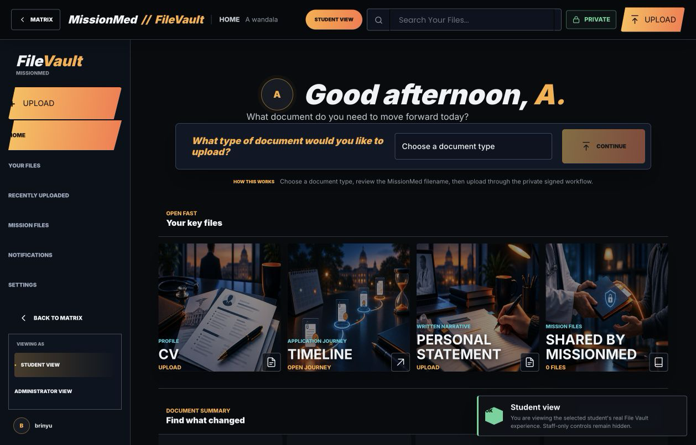
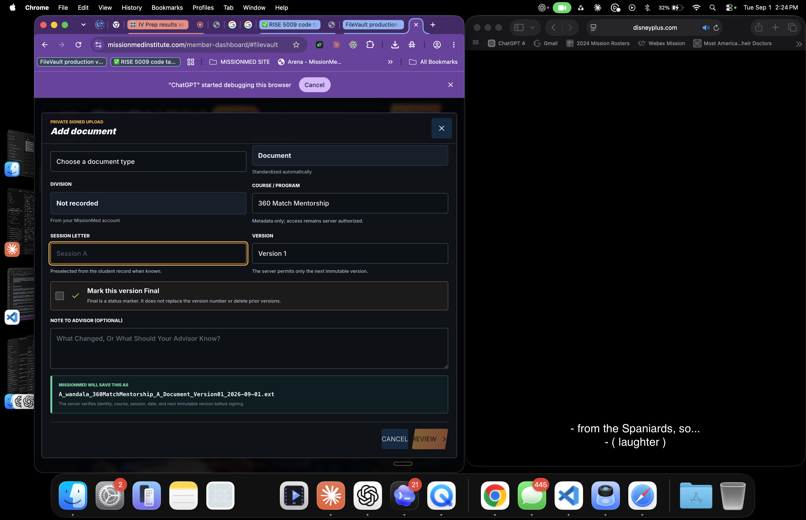
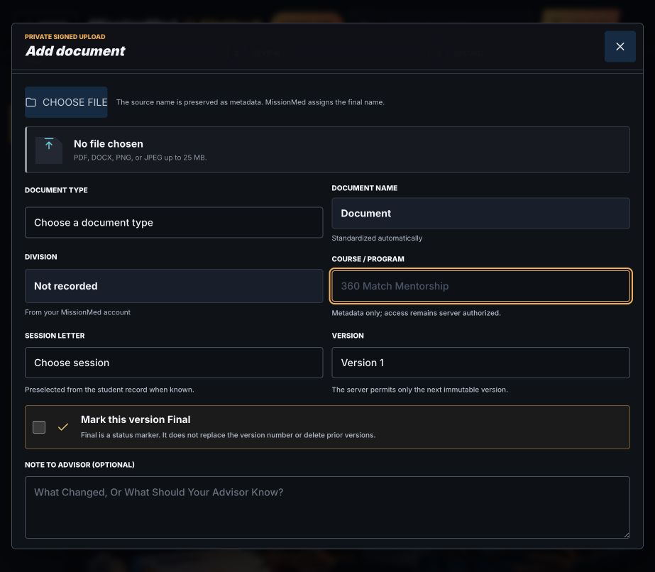
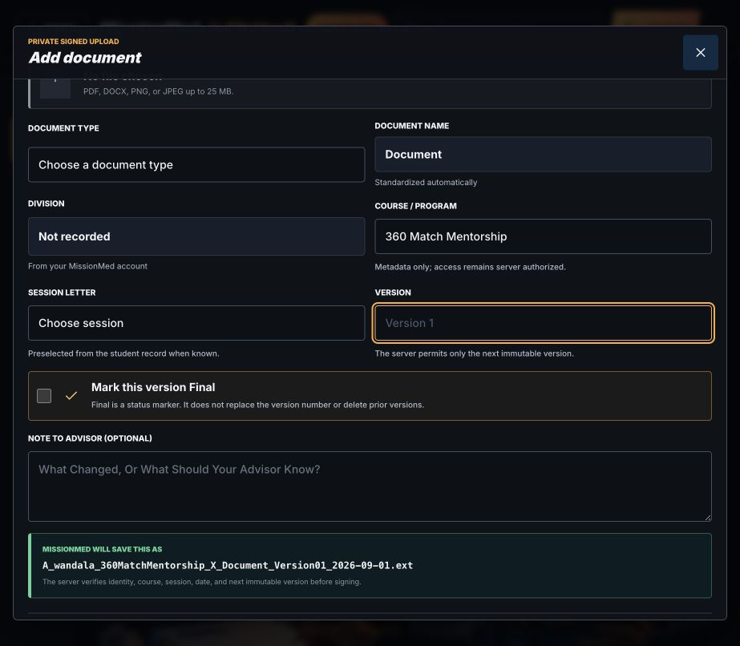
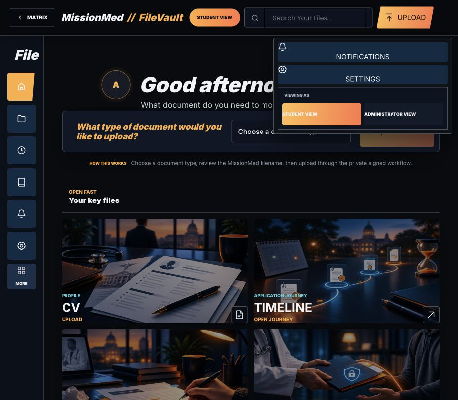
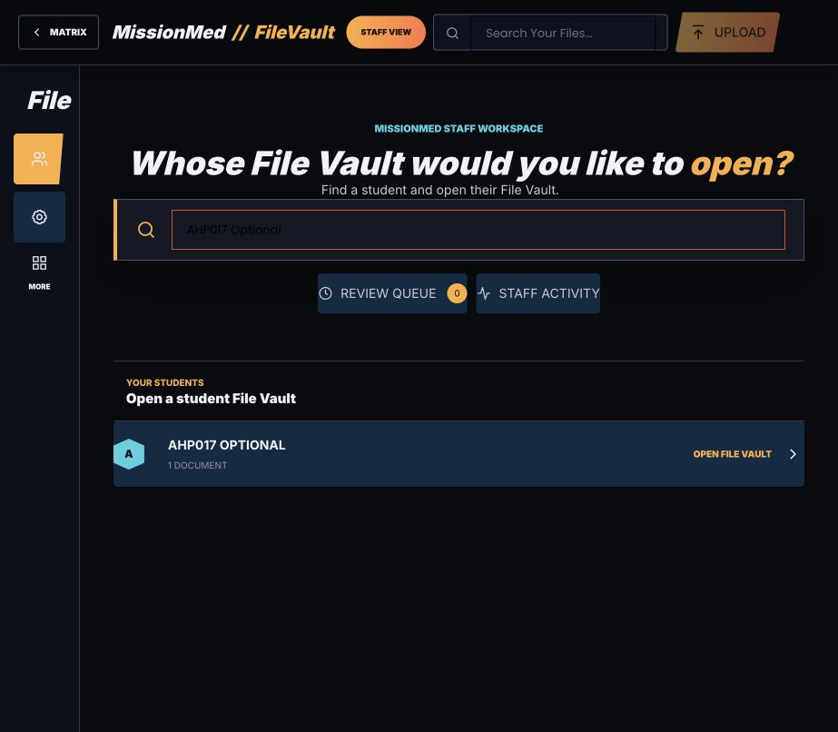
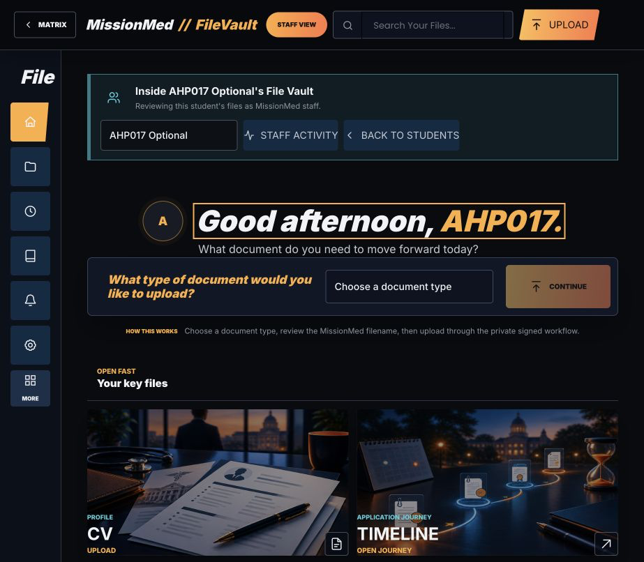
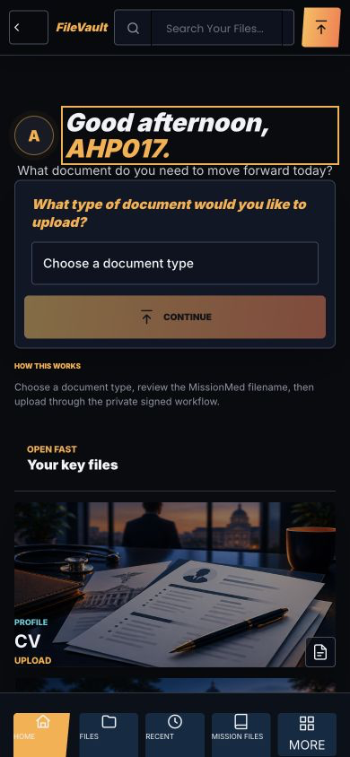
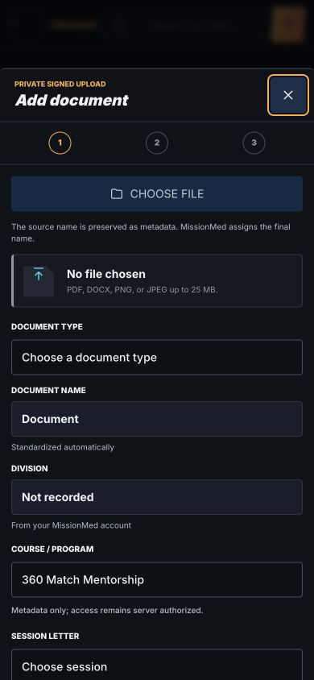

# J1-FILEVAULT-1017 Complete Combined Handoff

Date: 2026-09-01
Mission: J1-FILEVAULT-1017
Production URL: https://missionmedinstitute.com/member-dashboard/#filevault
Product branch: `codex/j1-filevault-1014-production`
Authoritative product source head: `45f38fe69ccb9274c5db0125c5603b3f5e5a7cae`

## Required Completion Record

RESULT: PRODUCTION FUNCTIONAL; FOUNDER STUDENT-LENS ACCEPTED; CURRENT ORDINARY-STUDENT LIVE SESSION RECONNECT REQUIRED FOR FINAL 1017 ACCEPTANCE.

LIVE PRODUCTION: YES. The corrected immutable asset is publicly served, byte-verified, Cloudflare-cached, and exercised against the production WordPress, REST, Supabase metadata, private R2, and Matrix surfaces.

STORYFORGE STUDENT/ADMIN SWITCH: PASS. Founder/admin accounts receive the StoryForge lower-left `Viewing as` control in the full rail and the equivalent `More` menu at compact breakpoints. Student View renders the selected student's real File Vault and removes staff-only controls. Administrator View renders the staff directory, roster search, Review Queue, Staff Activity, and per-student `Open File Vault` actions.

SESSION A-G DROPDOWN: PASS. Production UI exposes Session A through Session G. The current student record preselects Session A when available.

COURSE DROPDOWN: PASS. Production UI exposes exactly `360 Match Mentorship`, `IV Prep Complete`, `IV Prep Essentials`, and `PS-Only`. Course metadata does not grant access; server authorization remains authoritative.

VERSION LINEAGE: PASS. The server permits only the next immutable version. Matching a custom document name now defaults to the prior lineage and next version, while preserving an explicit separate-document choice.

FINAL STATUS HANDLING: PASS. `Final` is a separate status checkbox and does not replace the version number or remove history.

PRIOR-VERSION WORKFLOW: PASS. A live synthetic upload created `canary-test` Version 2 and preserved Version 1 in Doc Docs > Versions. The explicit `No - create separate document` path remains available and tested.

CANONICAL FILE NAMING: PASS. Live signed download returned `ahp017_optional_360matchmentorship_a_canarytest_version02_2026-09-01.pdf` for the safe canary upload.

UPLOAD: PASS. Production signed upload completed to 100%, server verification completed, metadata recorded Version 2, scanner state returned `ready_clean`, and download was enabled.

ADMIN STUDENT VAULT ACCESS: PASS FOR FOUNDER/ADMIN. Administrator View provides searchable roster access and opens an individual student vault with a selected-student banner, selector, Staff Activity, and Back to Students. Repository authorization separately proves an assigned mentor may view the assigned student and an unassigned mentor is denied. No current real mentor browser session was available for a fresh 1017 live login proof.

STUDENT PRIVACY: PASS FOR SERVER LAW, AUTOMATED ROLE TESTS, AND FOUNDER STUDENT VIEW. In Student View, the selected-student selector, Staff Activity, Back to Students, and staff-note surfaces are absent. Anonymous File Vault routes return 401 and the public R2/CDN prefix returns 403. A current ordinary 360-student browser profile was not connected during final 1017 closure; this remains the only live acceptance gate.

MOBILE: PASS AT 390x844. Student Home and the upload modal have `scrollWidth === innerWidth === 390`; the modal close button receives focus on open and focus returns to the upload trigger on close.

ACCESSIBILITY: PASS IN AUTOMATED CONTRACTS AND LIVE FOCUS CHECKS. Semantic role controls, accessible names, dialog focus, keyboard role switching, focus restoration, and zero horizontal mobile overflow were verified. The native select menu itself is OS-rendered and is not included in browser viewport PNGs; DOM and accessibility evidence prove the complete option sets.

R2 / SCANNER: PASS. Original synthetic PDF and signed-download R2 object both measured 15,352 bytes and had SHA-256 `0f98928932c1379ffebae8ef01267393eefc38eb2f550f923d03bc269781496f`. Metadata reported `verification_state=ready_clean` and `download_available=true`. Public `/student-files/v1/...` remained 403.

MATRIX REGRESSION: PASS. Matrix, StoryForge, and Arena returned 200 in production checks. File Vault remains inside the MissionMed Matrix route at `/member-dashboard/#filevault`.

TESTS: 780/780 PASS: 548 browser/responsive/accessibility; 109 repository; 82 PHP; 41 V1 fallback-lock. Mutable and immutable JS syntax, PHP lint, `git diff --check`, mutable/immutable byte identity, public immutable hash, and 17-asset guard all passed.

P0: 0 known.

P1: 0 known in the deployed implementation. The missing current ordinary-student browser profile is an external acceptance gate, not an identified code defect.

P2: 0 known in the verified scope.

DEPLOYED: YES. Apply, rollback, reapply, and post-reapply verification passed for the exact three-path production write set.

PUSHED: YES. `origin/codex/j1-filevault-1014-production` is exact at the authoritative product source head before this report-only handoff commit.

ROLLBACK: READY. Production backup: `/www/theresidencyacademy_209/private/matrix-runtime-guard-backups/J1-FILEVAULT-1017/20260901T174854Z-lineage-45f38fe`. Staging path: `/www/theresidencyacademy_209/private/j1-filevault-1017-lineage-45f38fe-stage`.

AUTHORITATIVE HEAD: `45f38fe69ccb9274c5db0125c5603b3f5e5a7cae` for product source and deployment. The commit containing this handoff and evidence is the authoritative report-only successor.

AUTHORITATIVE HANDOFF: `_AI_HANDOFFS/from_codex/J1_FILEVAULT_1017_PRODUCTION_COMPLETION/J1_FILEVAULT_1017_COMPLETE_COMBINED_HANDOFF.md`

GOOGLE DRIVE MIRROR: NOT PART OF 1017 — SEPARATE FOLLOW-UP

## Executive State

File Vault is live and functionally integrated with the StoryForge interaction model. This is not limited to color, typography, or card styling. The shared model now includes:

- StoryForge-style top shell, brand treatment, navigation rail, compact `More` behavior, Home hierarchy, premium image cards, and guided primary action.
- Founder/admin dual access through Student View and Administrator View.
- Searchable staff roster with per-student `Open File Vault` actions.
- Selected-student context with a staff-only selector and activity controls.
- A privacy-preserving student lens that removes every observed staff-only control.
- Guided upload with course, Session A-G, immutable version lineage, separate Final status, note to advisor, canonical name preview, private signed upload, scanner verification, and signed download.

The implementation, deployment, rollback, automated regression, Founder/admin workflows, selected-student access, mobile behavior, and synthetic upload/download round trip are complete. A fresh ordinary-student login was not available in the connected browser set during final closure. Therefore the correct release statement is production functional and Founder-ready, with current ordinary-student browser acceptance still required before labeling 1017 fully closed.

## Source and Deployment Custody

### Commits

- `18a7ddd47a256aa16b58b7bc46bb74546c51763c` - prior-version matching repair plus regression contract.
- `45f38fe69ccb9274c5db0125c5603b3f5e5a7cae` - immutable JS asset, controller pin, and fallback-lock update; current deployed product source head.

### Deployed exact paths

- `wp-content/plugins/missionmed-hub/assets/student-os-file-vault-v2.js`
- `wp-content/plugins/missionmed-hub/assets/student-os-file-vault-v2.f14fc23c226e9fa6.js`
- `wp-content/plugins/missionmed-hub/includes/class-mmed-file-vault-v2.php`

### Asset and package evidence

- Immutable JS SHA-256: `f14fc23c226e9fa690d5b7b160efc4466385e2c1941098193280ec5956c6a3e7`
- Controller SHA-256: `02f244a4be7fb086f70613a9e5ad89a8c945ab80304204d66b91b508eb62b52b`
- Deployment package: `/private/tmp/J1_FILEVAULT_1017_LINEAGE_45F38FE.tar.gz`
- Package SHA-256: `4e2e9ee3b790d8e5666d49d4e4f434b33c86fbae2762cd49e85006a55b7d7d91`
- Public immutable asset: HTTP 200, Cloudflare HIT, byte hash exact.

### Lease custody

- Source PATH epoch 678, lease `07669f84-8a29-4a76-9f3a-0f5346d01af6`, released normally after 64 heartbeats.
- Immutable PATH epoch 686, lease `f0be4f9f-072b-4634-b915db0a95bc`, released normally after 48 heartbeats.
- Deploy PATH epoch 690, lease `aa697459-674e-4a14-9ad2-56e59e12ac1d`, released normally after 30 heartbeats.
- All three keepers exited 0. File Vault was lease-idle before the final report-only handoff transaction.

## Live Production Proof

### StoryForge student/admin model

Founder/admin can switch between Student View and Administrator View. At wide breakpoints the control is in the lower-left rail; at compact breakpoints it appears under `More`. Administrator View includes roster search, Review Queue, Staff Activity, and each student's `Open File Vault` action. Opening the safe canary student presents:

- `Inside AHP017 Optional's File Vault`
- selected-student combobox
- Staff Activity
- Back to Students
- the same premium StoryForge-derived student Home and upload workflow, with staff context clearly identified

Switching to Student View removes all four staff-only surfaces while preserving the student's real File Vault experience.

### Mentor access law

The server remains authoritative. `mentor_can_view` reads the assigned `_mmed_file_vault_mentor_id`. Automated tests prove assigned mentor access is allowed and unassigned mentor access is denied; mentor browser contracts also limit permitted actions. This prevents the StoryForge-style dual-view UI from becoming a client-side permission grant.

### Synthetic end-to-end round trip

- Safe vault: `AHP017 Optional`
- Source file: `/private/tmp/J1_FILEVAULT_1017_SYNTHETIC_CANARY.pdf`
- Source SHA-256: `0f98928932c1379ffebae8ef01267393eefc38eb2f550f923d03bc269781496f`
- Uploaded document name: `canary-test`
- Recorded version: Version 2
- Prior version preserved: Version 1
- Scanner state: `ready_clean`
- Signed download endpoint: `/wp-json/mmed/v2/file-vault/files/20/download` -> 200
- Signed R2 object fetch: 200, `application/pdf`, 15,352 bytes
- Downloaded object SHA-256: exact source match
- Canonical filename: `ahp017_optional_360matchmentorship_a_canarytest_version02_2026-09-01.pdf`

## Authorization and Route Evidence

- Anonymous bootstrap: 401
- Anonymous students endpoint: 401
- Public CDN `/student-files/v1/...`: 403
- Matrix: 200 after expected redirects
- StoryForge: 200
- Arena: 200
- Admin selected-student endpoint `/wp-json/mmed/v2/file-vault/students/100`: 200 in the authorized Founder session
- Admin capability response allowed upload, download, comment, review, score, finalize, audit, student list, internal notes, and Mission File sharing; student submission remained false for admin as expected.

## Test Ledger

- Browser, responsive, and accessibility: 548 PASS
- Repository: 109 PASS
- PHP: 82 PASS
- V1 fallback lock: 41 PASS
- Total: 780 PASS, 0 FAIL
- JS syntax: PASS for mutable and immutable assets
- PHP lint: PASS
- Mutable/immutable JS byte identity: PASS
- Public asset hash: PASS
- `git diff --check`: PASS
- 17-asset guard: PASS

One browser focus test encountered a transient timeout and passed immediately on an identical rerun. No product assertion failed.

## Evidence Gallery

### 1. StoryForge-derived student Home

### 2. Session A-G control

### 3. Course/program control

### 4. Immutable version and separate Final status

### 5. StoryForge role switch

### 6. Founder/admin searchable student directory

### 7. Founder/admin inside a selected student's vault

### 8. Mobile student Home at 390x844

### 9. Mobile guided upload at 390x844

## Screenshot Integrity

- `01-student-home.png`: `314dc8e3cd0a8eacabd5ee23eabd868659b90e02fb89a73d866e38af16f0472c`
- `02-session-dropdown-open.png`: `75fbd1bde0d6a4e784e3c14e99f4ca9ffd6067422a59e2052cc48284c6573035`
- `03-course-dropdown-open.png`: `1d7320f6522a4897db9ed7e9ada2b5ba90c42bcf3616ad385e21d0398fe74562`
- `04-version-dropdown-open.png`: `a884784464bcce90324e31260759cb278a4447f71b3e38f63b0f6c2a493bc844`
- `05-storyforge-role-switch.png`: `bcb3195ecb220af8f8e1da350089ec57dd767ffbe60a8af07ed8964c53be347a`
- `06-admin-student-directory-and-switch.png`: `1071472f781d226c4e3534cd744e8fa3bc5e31a524eeb8247e3f7a8c2deda441`
- `07-admin-inside-student-vault.png`: `581ec416e3020c7eb358966d23cb37d771bc099b430922b8deb216672926fb7c`
- `08-mobile-student-home.png`: `a7edfa32cee16bd74c20ccb76c1bdf0a06844f21e1dc081cc2526a433297fbcd`
- `09-mobile-upload-modal.png`: `26960abb3c7271406ddd2108d731a13692ff19a1a5a08555501daea206b92720`

## Remaining Gate

Connect a real enrolled ordinary 360-student Chrome profile and run one current production acceptance pass:

1. Open `/member-dashboard/#filevault` as the ordinary student.
2. Confirm there is no Student/Administrator switch and no staff-only surface.
3. Upload a fresh non-PII synthetic PDF through the guided workflow.
4. Confirm the next immutable version, scanner-clean state, Your Files visibility, signed download byte match, and mobile behavior.
5. In a separate authorized Founder/admin session, confirm the same upload appears in that student's vault and that an unrelated student cannot access it.

Earlier releases proved a true non-admin upload/download path. This report intentionally does not substitute that older evidence or the Founder Student View for a current 1017 ordinary-student browser acceptance.

## Worktree Preservation

The pre-existing unrelated modified file below was never staged, reset, reverted, cleaned, or included in any 1017 commit:

`_AI_HANDOFFS/from_codex/J1_FILEVAULT_1014_PRODUCTION_COMPLETION/J1_FILEVAULT_1014_COMPLETE_COMBINED_HANDOFF.md`

No production database, Supabase schema, R2 policy, Cloudflare rule, course, product, order, subscription, enrollment, progress, or unrelated worktree state was mutated during final evidence closure.
