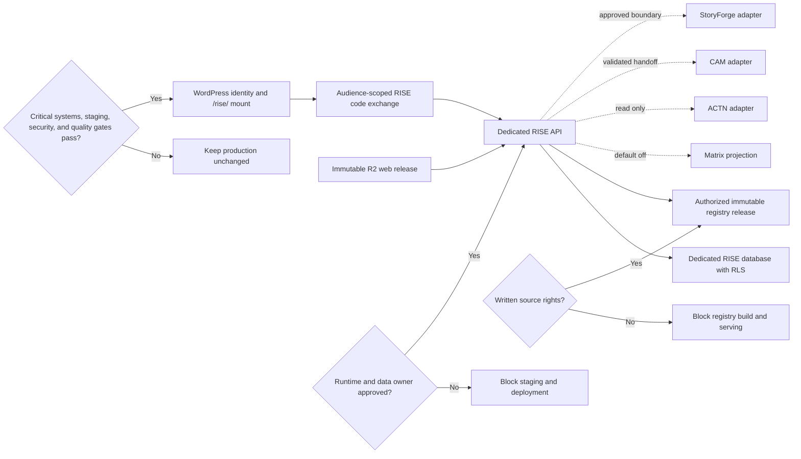

# P1 RISE 4006 Production Architecture

## Verdict

The production-safe architecture is a standalone, member-gated RISE product plane:

```text
WordPress /rise/ shell -> immutable Cloudflare/R2 web release
WordPress identity -> narrow HQ authorization-code broker
Browser -> dedicated Railway RISE API -> dedicated RISE Supabase projects
                                      -> optional, default-off product adapters
```

RISE must not launch as a Matrix App Mode edit, a route added directly to the drifted HQ monolith, a browser-to-Supabase application, or the monolithic 4004 HTML with its embedded demo dataset.

The review branch now contains an isolated `rise/` package, lockfile, multi-stage non-root container recipe, `railway.json`, and `deployment-contract.v1.json`. Railway must be configured with service root `/rise` and config path `/rise/railway.json`; the container entrypoint is only `node server.mjs`. The registry index, auth adapter, durable abuse adapter, and production pins remain external runtime inputs and are not embedded in the image. This is a deployable blueprint, not a provisioned service.

## Change-Impact And Activation Graph



Solid lines are required core dependencies. Dashed lines are separately owned integrations that remain disabled until their contracts and privacy controls are approved. The three decision nodes are independent release vetoes.

## Ownership Boundaries

| Layer | Owner | Allowed responsibility | Prohibited responsibility |
|---|---|---|---|
| WordPress | MissionMed website | Identity, membership, RISE capability, `/rise/` mount | Registry storage, matching, applicant copies |
| HQ | Existing HQ runtime | One-time, audience-scoped RISE authorization code | RISE business logic, RankListIQ bootstrap reuse |
| R2 | Static delivery | Versioned HTML, CSS, JS, fonts, release manifest | Registry export, secrets, sessions, applicant data |
| RISE API | New Railway service | Authorization, registry reads, matching, audit, adapters | Shared HQ deployment or direct WordPress writes |
| RISE Supabase | New staging/prod projects | Registry, app state, evidence, audit | Browser service-role access or shared RankListIQ tables |
| Matrix | Matrix owner | Canonical applicant profile and later consented projection | RISE writes or unreviewed runtime changes |
| ACTN | ACTN owner | Aggregate, role-filtered connection summary | RISE name matching or private person export |
| CAM | CAM owner | Interview execution and results | Registry truth mutation |
| StoryForge | StoryForge owner | Narrative assets and permissions | Full-story replication into RISE |

## Frontend

- Intended public route: `https://missionmedinstitute.com/rise/`.
- WordPress renders only an application mount and pinned asset references.
- Proposed R2 namespace: `html-system/RISE/releases/<release-sha>/`.
- Desktop visual language remains aligned with the 4004 candidate.
- The 4005 mobile, focus, nested-interaction, and truth-language blockers are mandatory corrections before certification.
- Static assets contain no registry payload. All national data is paged from the API.

## Authentication And Authorization

1. WordPress confirms membership and `missionmed_access_rise` capability.
2. HQ issues a single-use code with `sub`, `aud=rise`, role/capability, `jti`, issue time, and expiry only.
3. Code lifetime is at most 60 seconds.
4. RISE exchanges the code for its own `HttpOnly`, `Secure`, `SameSite=Lax` session cookie.
5. The RISE API never calls the RankListIQ-specific `/api/auth/bootstrap` path.
6. All applicant reads and writes are user-scoped; admin/operator routes require a separate capability.

The current HQ learner audience list does not include RISE. No relay change is authorized until the HQ source lineage, manifest entry, protected-file gate, and deployable rollback are reconciled.

## Registry And Matching

- Registry releases are immutable.
- Activation changes one release pointer atomically.
- Program identity is external-ID-bound and opaque; ordinal spreadsheet IDs remain aliases.
- Exact specialty designations and derived browse memberships are separate.
- Combined programs are one program-specialty designation with multiple components.
- Missing evidence is unknown, never false.
- Hard matching accepts only current, explicit, source-located claims.
- Contextual signals cannot override a hard contradiction.
- Current imported claims are browse/profile evidence only; `matchableClaims=0` is intentional.

## Caching And Refresh

- Browser responses use bounded pagination and ETags tied to registry release ID.
- Static assets are immutable and long-cached.
- Registry list/profile responses may be cached by release ID; applicant-specific results are private/no-store.
- Import is offline, deterministic, idempotent, count-reconciled, and activated only after review.
- No refresh silently deletes prior releases or source observations.

## Observability

Required structured events: auth exchange, authorization denial, registry release read, search latency, profile read, matching ruleset/release pair, adapter handoff, source-refresh result, operator action, and rollback. Logs contain opaque subject IDs only. Metrics must expose API latency/error rate, active release, stale-source count, evidence coverage, quarantine count, match unknown rate, adapter failures, and auth failures.

## Error Model

| Condition | API behavior | User behavior |
|---|---|---|
| No session | `401` | Return to member login |
| Wrong role | `403` | Permission state, no dead control |
| Adapter disabled | `409 integration_disabled` | Labeled unavailable state |
| Missing evidence | Successful response with `unknown` | Explain what is not published |
| Stale release | Successful response plus stale metadata | Visible source date |
| Source conflict | `needs_verification` | Never show qualified/meets |
| Registry unavailable | `503` with request ID | Retry state, no cached applicant result |

## Deployment Sequence

1. Offline shadow release and validation.
2. Dedicated staging database and API, all adapters disabled.
3. Versioned staging assets and authenticated admin canary.
4. Dark production API/health deployment.
5. Read-only allowlisted pilot.
6. Matrix projection after owner/security approval.
7. ACTN, CAM, and StoryForge adapters as independent releases.
8. Broad release only after independent quality certification.

The proposed database plane is split into immutable `rise`, private `rise_app`, and append-only `rise_audit` schemas. All ten app tables are forced-RLS with no policies or runtime grants, so the blueprint remains inaccessible until the identity and database owners approve and install narrow policies.

## Rollback

Rollback is layer-specific: disable the WordPress capability/route, point the asset manifest to the prior immutable build, redeploy only the prior RISE service image, reactivate the prior registry release, or disable one adapter. No Matrix rollback and no broad HQ deployment should be required for a core RISE rollback.

## Authority Gap

Engineering can complete contracts, ETL, UI remediation, tests, schemas, and staging artifacts. External authority is required to approve the accountable RISE owner, dedicated Railway service, staging/prod Supabase projects, R2 namespace, WordPress route/capability, HQ relay, source-data rights, and launch audience. This gap currently blocks staging provisioning and production deployment.
