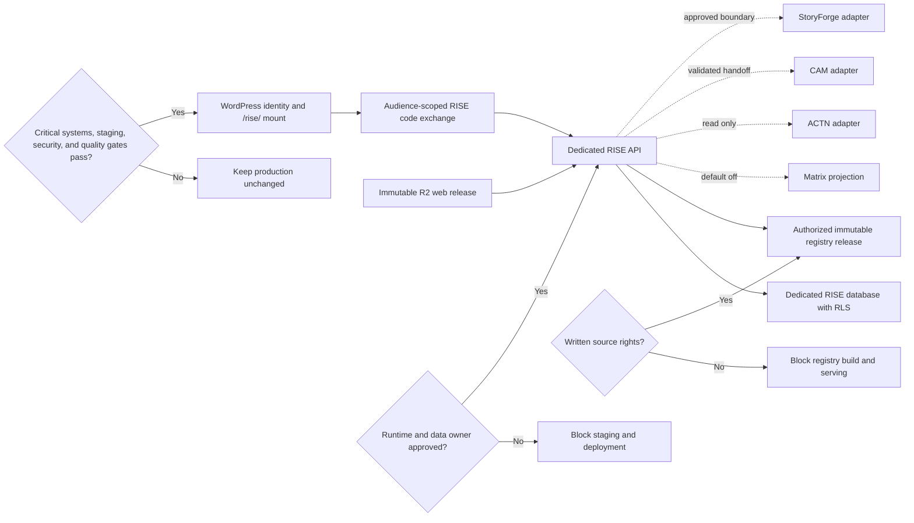

# P1 RISE 4006 Production Completion Combined Handoff

This file contains the complete text of reports 01 through 22 in canonical order.

<!-- BEGIN 01_BOOTSTRAP_AND_PRECHANGE_STATE.md -->

# P1 RISE 4006 - Bootstrap and Pre-Change State

**Ticket:** P1-RISE-4006

**Captured:** 2026-07-15 07:47 EDT / 2026-07-15T11:47:27Z

**Risk:** High

**State:** Baseline preserved; protected production paths remain untouched.

## Executive Finding

RISE has a complete national staging registry and a strong 4004 UX prototype, but it has no registered production system. There is no live RISE route, production API, durable RISE schema, approved database project, authenticated RISE audience, ACTN production adapter, or CAM production contract. Existing shared production infrastructure also has unresolved source and deployment drift. Production deployment is therefore not authorized at this phase.

The safe implementation branch is isolated from both the old RISE data worktree and the dirty canonical checkout:

| Item | Value |
|---|---|
| Repository | `https://github.com/brinyu13/missionmed-hq.git` |
| Isolated implementation worktree | `/tmp/P1-RISE-4006-production` |
| Branch | `codex/p1-rise-4006-production` |
| Review implementation commit | `78732eb492c0e8d8cfd2a768593b1a10f506ee17` |
| Base upstream | `origin/main` |
| Base commit | `9c1fa72e6b056db8b6fe0e17031fcaa688f78569` |
| Base subject | `Merge MM-SPINE-006A product boot stop rule` |
| Worktree status at creation | Clean |

The prior `/Users/brianb/MissionMed_worktrees/P1-RISE-4000` worktree is preserved as data lineage only. It remains on `p1-rise-4000` at `e8503866bce9cb941dd8f2dc38f39e62bd21e316`, has no upstream, and contains the national registry build under untracked `outputs/`.

## Authority and Repository State

The canonical checkout `/Users/brianb/MissionMed` is not a safe build or deployment source. It is on `hotfix/Y1-ARENA-3026-branded-login` at `4d1a8f5950668eed35a619f9a17aca7553c8308c`, diverges from `origin/main`, and contains extensive concurrent changes. Two protected files are currently dirty there:

- `missionmed-hq/server.mjs`
- `_SYSTEM/KNOWN_GOOD/MATRIX_RUNTIME_LOCK_MANIFEST.json`

Repository history is bifurcated after commit `5cc9144`: remote `main` contains later product-passport and boot-rule work, while the local hotfix lineage contains the critical-system guard, known-good lock, USCE runtime repair, and Arena login repair. A three-way merge preview shows extensive conflicts in shared runtime files. This is an unresolved authority conflict for any shared Railway or WordPress deployment.

No tracked RISE source, RISE branch, RISE commit, or RISE pull request existed before this run. The 4004 artifact and national registry output are also untracked in their source locations.

## MissionMed OS State

`/Users/brianb/MissionMed_OS` exists, but its local `main` is dirty and behind remote. Read-only inspection used `origin/main` at `714443573...` instead of pulling into the dirty checkout.

No RISE mission, RISE product passport, or `P1-RISE-4006` decision record exists in the current MissionMed OS mission or product indexes. MissionMed boot rules require a registered decision before protected runtime changes. The user's production charter provides task authority, but it does not resolve the missing runtime owner, database owner, or protected-path registration.

## Artifact Lineage

The application lineage is nonchronological but explicitly documented:

`4001 -> 4003 -> 4002 Product Evolution -> 4004 Final UX Freeze Candidate`

| Artifact | Location | SHA-256 / status |
|---|---|---|
| 4001 functional shell | `/Users/brianb/MissionMed_AI_Sandbox/CLAUDE_FILES/P1_RISE_4001_Functional_App_Shell_CAM_THEME.html` | `a854d6068c18...` |
| 4003 live registry | `/Users/brianb/MissionMed_AI_Sandbox/CLAUDE_FILES/P1_RISE_4003_LIVE_REGISTRY_EXPERIENCE.html` | `f2b4e679bb67...` |
| 4002 product evolution | `/Users/brianb/MissionMed_AI_Sandbox/CLAUDE_FILES/P1_RISE_4002_PRODUCT_EVOLUTION.html` | `37dacd75129c...` |
| 4004 freeze candidate | `/Users/brianb/MissionMed/_AI_HANDOFFS/from_cowork/P1_RISE_4004_FINAL_UX_FREEZE/P1_RISE_4004_FINAL_UX_FREEZE_CANDIDATE.html` | `6348f34b138f251d523d81d8772d090433c3f8ad825ac186778b843f4a13d185` |

The 4004 candidate is a 1.05 MB, 3,222-line standalone HTML prototype. It embeds registry rows and synthetic/demo Matrix, ACTN, fellowship, LCS, queue, and CAM behavior. It has no persistence or production network contract.

## Recovered 4005 Independent Audit

The 4005 package was not present in Git, MissionMed folders, or Google Drive. It was recovered from the prior signed-in ChatGPT RISE task through Computer Use and saved locally under `/Users/brianb/Downloads/`.

Recovered evidence:

- `P1_RISE_4005_SOL_ULTRA_COMBINED_AUDIT.md`
- `P1_RISE_4005_SOL_ULTRA_EXECUTIVE_SUMMARY.md`
- `P1_RISE_4005_SOL_ULTRA_INDEPENDENT_PRODUCT_AUDIT.md`
- `P1_RISE_4005_SOL_ULTRA_SCORECARD.md`
- `P1_RISE_4005_SOL_ULTRA_RECOMMENDED_FIXES.md`
- `rise_audit_results.json`
- `P1_RISE_4005_AUDIT_ARTIFACTS.zip`

The ZIP is valid and contains 26 responsive screenshots plus all reports and machine-readable results. The audit ran in GPT-5.6 Pro with Chromium, not an Ultra-labelled runtime.

4005 verdict: `UX_FREEZE_BLOCKED`.

Primary 4005 blockers:

1. Mobile shell and Explorer materially fail at 390 px.
2. CAM modal and command palette do not fully contain focus.
3. Program cards and queue rows contain invalid nested interactive controls.
4. The UI calls 6,346 specialty rows "programs," says "52 states," and overstates source verification and IMG reporting semantics.

Recorded scores include desktop UI 9.1, desktop UX 9.0, mobile UI 5.8, mobile UX 5.9, accessibility 6.8, evidence integrity 7.9, overall UI 8.1, and overall UX 8.0.

## Canonical Registry Baseline

The canonical staging source is the Google Sheet:

`https://docs.google.com/spreadsheets/d/1sHpiFtlQgCZMN9eIR5ZtudyErPP9OkFAeCiXPmQ8uVA`

Google account verification was completed under `info@missionmedinstitute.com`.

Verified staging facts:

| Metric | Value |
|---|---:|
| Tabs | 34 |
| Populated specialty tabs | 31 |
| Columns per specialty tab | 196 |
| Specialty-tab rows | 6,346 |
| Raw distinct ACGME/FREIDA ID strings | 6,140 |
| Raw exact Internal Medicine rows | 696 |
| Raw Internal Medicine tab rows including combined programs | 829 |
| Populated cells | 814,820 |

Combined programs are intentionally repeated in parent specialty tabs. These counts are distinct contracts and must never be conflated.

FREIDA public structured data is the primary populated source. Residency Explorer was unavailable during the national build, and official-site enrichment is materially limited to Brookdale. Unknown fields were left blank as intended.

### Post-baseline identity correction

Identifier inspection exposed one stale duplicate that the raw-string count concealed. `1401900001 ` and `1401900001` are two observations of the same University of Kansas School of Medicine (Olathe) program. The trailing-space row has a malformed URL, no survey date, sparse/zero values, and a 2024 source update; the normalized row has a valid URL, a 2025 survey date, and a 2026 source update. The reviewed resolution preserves the stale row in quarantine and activates the current row. Reconciled structural counts are 6,139 unique programs, 6,345 active specialty memberships, 206 additional combined memberships, 828 Internal Medicine browse memberships, and 695 exact Internal Medicine programs. The raw workbook remains 6,346 rows.

**Post-baseline correction:** the preliminary unsuffixed workbook used during early offline analysis was later proven to shift sparse cells. Its generated release receipt is superseded. The corrected `_GSHEETS.xlsx` artifact is pinned by hash, but no real-data release was generated from it after current AMA/AAMC source-use terms were verified and the importer was changed to fail before source reading without written authorization.

## Data Integrity Risks Preserved for Remediation

Read-only analysis identified the following release blockers in the staging/prototype lineage:

- Current ordinal `RISE_ID` values can change when rows are re-sorted or rebuilt.
- ACGME/FREIDA identity is not carried into the 4004 browser payload.
- Several named ACTN/alumni records are synthetic but are rendered with verified-looking language.
- Provenance is row-level rather than field-level.
- `Hybrid` and `Program Status` staging columns contain semantically mismatched source fields in the national builder.
- "Meets Published Requirements" permits unknown hard criteria; 328 of 543 programs in that category had one or two unknown hard criteria in the audited prototype.
- Demo and MissionMed interpretation fields lack author/model/version lineage.

No production migration or import is authorized until stable identifiers, typed semantics, field evidence, and demo quarantine are defined.

## Live Route Baseline

Public probes were performed without cookies or credentials:

| Route | Status | Finding |
|---|---:|---|
| `https://missionmedinstitute.com/rise` | 404 | No WordPress route |
| `https://missionmedinstitute.com/rise/` | 404 | No WordPress route |
| `https://missionmedinstitute.com/member-dashboard/` | 302 | Redirects logged-out users to WordPress login |
| `https://missionmed-hq-production.up.railway.app/rise` | 404 | No HQ static route |
| `https://missionmed-hq-production.up.railway.app/api/rise/health` | 401 | Global HQ auth executes before unmatched API routing; no RISE API exists |
| `https://cdn.missionmedinstitute.com/html-system/LIVE/rise.html` | 404 | No registered CDN asset |

There is no production RISE screenshot because no live RISE surface exists. The 404 and auth behavior above are the production baseline.

## Railway Baseline

Railway project: `missionmed-hq-fix005` (`29afe885-b9b1-425d-8fd8-8611cd275409`).

MissionMed HQ production:

| Field | Value |
|---|---|
| Environment | `production` (`ed3353f7-bcc7-4e25-a000-3c9fc628a9a7`) |
| Service | `missionmed-hq` (`3d18b017-4fc9-4b22-b097-ba879816d374`) |
| Deployment | `adbc174c-c55d-43b4-863b-ce3e806943d7` |
| Created | `2026-07-14T16:34:48.404Z` |
| Status | `SUCCESS` / running |
| Image digest | `sha256:837435930417ee6918bc779b0c470543d044822299075067003ee65830fec4d7` |
| Deploy message | `D9-MATRIX-PLAN-415S-IR3 credential containment` |
| Builder | Dockerfile |
| Start command | `node missionmed-hq/server.mjs` |

The deployed Dockerfile is absent from both the isolated `origin/main` worktree and the canonical tracked checkout. The current live deployment therefore cannot be reproduced from the selected branch.

The critical-system manifest's prior Railway rollback deployment `27280193-c85b-49de-8b03-58e28ba0c9f3` is removed and cannot serve as a directly redeployable rollback point.

## Critical-System Gate Baseline

The report-only critical gate was executed from `/Users/brianb/MissionMed`.

Results:

- Route checks: 7 passed.
- Syntax/import checks: passed.
- Protected worktree checks: 2 warnings for dirty protected files.
- CDN asset checks: 2 failed because Arena and USCE Admin live hashes differ from manifest pins.
- Authenticated browser journeys: 3 outstanding.

The broad `_SYSTEM/deploy.sh` must not be used. Local `LIVE` assets differ from production and a broad deploy could overwrite newer live systems.

## Matrix Lock Baseline

The current Matrix lock is active and was updated `2026-07-15T11:43:51.670Z`. A read-only preflight was run for `student_os_js` and `class_mmed_student_os_php`.

Origin and public hashes match the approved lock, but the selected canonical source worktree hashes differ. The guard returned:

`WARNING: You are about to work from an old Matrix runtime version. Do not edit or deploy without Brian approval.`

No Matrix runtime files will be modified. RISE must consume a least-privilege Matrix profile projection through an approved external contract.

## Supabase Baseline

Accessible projects:

| Project | Ref | Status | Current authority |
|---|---|---|---|
| `missionmed-ranklistiq` | `fglyvdykwgbuivikqoah` | Active healthy; CLI linked | Arena, STAT, USCE tables |
| MissionMed Growth Engine | `plgndqcplokwiuimwhzh` | Active healthy | HQ CRM domains |
| MissionMed Scheduler Staging | `avpdetdkpwmqqxtvomix` | Active healthy | Scheduler staging |
| `missionmed-cam-dev` | `tufzqxeucfugdovtjyqk` | Active healthy | CAM development |

No project is registered as RISE owner. The checked-in migration directory and linked remote migration history diverge: multiple remote migrations are absent locally, and one local migration is absent remotely. The migration protocol prohibits push, repair, reset, or history manipulation under this state.

No RISE tables, views, RPCs, policies, migrations, or storage buckets were found.

## Cross-Product Contract Baseline

- **Matrix:** real profile fields exist behind `mmed/v1/profile/me`; RISE has no least-privilege projection or approved audience.
- **ACTN:** latest foundation is local pre-production only and has no durable RISE program mapping. ACTN must remain canonical and read-only.
- **CAM:** production explicitly reports RISE sync as outside production scope. Re-entry requires a separately reviewed durable contract, retry behavior, security tests, and truthful health reporting.
- **StoryForge:** Matrix-owned runtime is locked; no RISE production adapter exists.
- **WordPress:** no `/rise/` page or registered handoff audience exists.
- **Cloudflare/R2:** no RISE CDN key, hash pin, cache contract, or rollback artifact exists.

## Baseline Tests

| Check | Result |
|---|---|
| `npm ci` | 70 packages installed |
| Root `npm test` | 0 tests discovered; command exits 0 |
| Root `npm run typecheck` | No `tsconfig.json`; compiler prints help and exits 0 |
| `node --check missionmed-hq/server.mjs` | Pass |
| `node --test missionmed-hq/tests/mmc-private-mount-validation.mjs` | 1 pass |
| `npm audit --json` | 3 findings: 2 high, 1 low |

High dependency findings exist in direct `form-data` and `ws` dependencies. They are pre-existing and must be resolved or proven unreachable before a shared production release.

The repository has no CI workflow and no reproducible RISE test harness. The 4004 `85/85` claim is documentary only. The recovered 4005 JSON records 48 successful checks but is not a reusable test source.

## Rollback Baseline

The only immutable RISE rollback input at this phase is the absence of a deployed RISE system:

- WordPress `/rise/`: 404
- HQ `/rise`: 404
- CDN `rise.html`: 404
- RISE schema: absent

The 4004 source SHA-256 is preserved above. Existing MissionMed production must remain unchanged. Any future RISE release requires its own scoped asset backup, database backup, deployment ID, approved hashes, and tested removal path.

## Secret Hygiene

No secret values were read, copied, logged, or written to this report. Existing secret-bearing files remain untouched. Four known environment files have overly broad mode `0644`; paths are documented in the security phase without exposing values.

## Bootstrap Verdict

`PHASE_0_COMPLETE_WITH_RELEASE_BLOCKERS`

Safe next work is limited to requirements reconciliation, architecture and contract definition, field-evidence design, stable-ID remediation, UX correction, isolated implementation, and reproducible tests. Shared Railway, WordPress, Matrix, Supabase, CAM, ACTN, or CDN production changes remain blocked until ownership and gate conflicts are resolved.

<!-- END 01_BOOTSTRAP_AND_PRECHANGE_STATE.md -->
<!-- BEGIN 02_REQUIREMENTS_TRACEABILITY.md -->

# P1 RISE 4006 - Requirements Traceability

**Status:** Reconciled against 4004, recovered 4005, canonical registry, repository reality, and live infrastructure.

**Legend:** `REQUIRED` = production requirement; `GATED` = blocked by an external owner/contract; `IMPLEMENTED OFFLINE` = implemented and tested only in the isolated candidate; `PARTIAL OFFLINE` = some acceptance behavior is implemented but the production contract is incomplete; `DEMO-ONLY` = allowed only in test/demo; `PROHIBITED` = must not ship; `ABSENT` = no implementation exists.

## Source Authority

| Code | Source |
|---|---|
| `P4004` | `P1_RISE_4004_FINAL_UX_FREEZE_CANDIDATE.html`, SHA-256 `6348f34b...13d185` |
| `A4005` | Recovered 4005 independent audit, scorecard, fixes, JSON, and 26 screenshots |
| `REG` | Canonical MissionMed RISE Google Sheet, 6,346 raw specialty rows; reconciled inspection has 6,345 active memberships / 6,139 unique programs / 1 quarantined duplicate; no authorized production release |
| `MATRIX` | WordPress `mmed/v1/profile/me` ownership and locked Matrix runtime |
| `ACTN` | ACTN local foundation and read-model contracts; not production live |
| `CAM` | CAM 4004 scope closure and current CAM production contracts |
| `AUTH` | WordPress-to-Railway signed handoff and HQ session contract |
| `CRIT` | Critical Systems Contract and Manifest |
| `CHARTER` | P1-RISE-4006 production completion charter |

## Capability Matrix

States distinguish local candidate behavior from production availability. No `IMPLEMENTED OFFLINE` or `PARTIAL OFFLINE` row is a live-production claim.

| ID | User capability | Source | Production component | Data authority | Required endpoint or boundary | Required test evidence | Evidence class | State |
|---|---|---|---|---|---|---|---|---|
| RQ-001 | Logged-out users receive a truthful access state | `CHARTER`, `AUTH` | WordPress `/rise/` wrapper and RISE access screen | WordPress identity | Signed `aud=rise` handoff or approved equivalent | Logged-out redirect, invalid/expired token, open-redirect tests | System fact | GATED / PARTIAL OFFLINE |
| RQ-002 | Authorized student opens RISE | `CHARTER`, `AUTH` | RISE shell | WordPress entitlement and HQ session | `GET /api/rise/v1/session` | Student sign-in/sign-out and unauthorized 401/403 journeys | User-provided/system fact | GATED / PARTIAL OFFLINE |
| RQ-003 | Mentor/admin receives role-appropriate controls | `CHARTER` | Role-aware navigation and queue | WordPress roles plus explicit RISE policy | Session projection with explicit capabilities | Role matrix and IDOR tests | System fact | GATED / PARTIAL OFFLINE |
| RQ-004 | Command Home shows trustworthy registry status | `P4004`, `A4005` | Command Home | Registry release manifest | `GET /api/rise/v1/status` | Count denominators, freshness, stale/error tests | Derived from release manifest | REQUIRED / IMPLEMENTED OFFLINE |
| RQ-005 | Counts distinguish raw observations, active memberships, and unique programs | `REG`, `A4005` | Registry summary | Program and program-specialty tables | Status response includes raw, active, quarantined, combined, and unique counts | Assert 6,346 / 6,345 / 1 / 206 / 6,139 plus specialty denominators | Source-reported plus derived | REQUIRED / IMPLEMENTED OFFLINE |
| RQ-006 | Explorer searches program name, institution, city, state, specialty, and IDs | `P4004`, `CHARTER` | Explorer/search service | Canonical registry release | `GET /api/rise/v1/programs?q=` | Unicode, punctuation, duplicate name, empty, and large-result tests | Source-reported | REQUIRED / IMPLEMENTED OFFLINE |
| RQ-007 | Filters cover specialty, state, region, type, visa, evidence, and status | `CHARTER` | Explorer filters | Typed registry fields | Query parameters with allowlisted enums | Combination, malformed, unknown, and URL manipulation tests | Source-reported/derived | REQUIRED / PARTIAL OFFLINE: status filter absent |
| RQ-008 | Results paginate or virtualize at national scale | `CHARTER` | Result list | Registry read model | Bounded page contract | 6,500-record synthetic concurrency, boundary, and stable-order tests | System behavior | REQUIRED / IMPLEMENTED OFFLINE |
| RQ-009 | Program profile preserves program-specialty identity | `P4004`, `REG` | Program Profile | Immutable program and program-specialty IDs | `GET /api/rise/v1/program-specialties/{id}` | Deep link, combined specialty, duplicate-name, missing-record tests | Source-reported | REQUIRED / IMPLEMENTED OFFLINE |
| RQ-010 | Every displayed field has source, reporting period, and retrieval context | `A4005`, `REG` | Evidence drawer and field labels | Field-evidence store | Program-specialty response carries field evidence | Field provenance, stale, conflict, and missing-period tests | Source-reported/derived/verified | REQUIRED / IMPLEMENTED OFFLINE |
| RQ-011 | Missing data is visibly unknown, never negative proof | `A4005`, `CHARTER` | Shared evidence renderer | Field evidence status | Typed `unknown_reason` contract | Missing field, parser gap, source unavailable, and not-applicable tests | Unknown | REQUIRED / IMPLEMENTED OFFLINE |
| RQ-012 | Student consents before applying Matrix profile | `CHARTER`, `MATRIX` | Matrix criteria panel | Matrix-owned profile projection | `POST /api/rise/v1/matrix-profile:apply` or equivalent consent receipt | Consent, revoke, incomplete profile, and unauthorized tests | User-provided | GATED |
| RQ-013 | RISE consumes only a least-privilege Matrix projection | `MATRIX`, `CRIT` | Matrix adapter | `mmed/v1/profile/me` owner | Approved server-side projection; no browser token leakage | Field allowlist and cross-student leakage tests | User-provided | GATED |
| RQ-014 | Each criterion can be disabled and restored | `P4004`, `CHARTER` | Criteria chips | Evaluation policy version | Client state plus reproducible evaluation request | Toggle each criterion, toggle all, reload/share privacy tests | Evaluation state | REQUIRED / ABSENT |
| RQ-015 | Matching distinguishes hard criteria, context, preference, and non-evaluable | `CHARTER`, `A4005` | Matching engine | Profile projection, program evidence, policy version | `POST /api/rise/v1/matches:evaluate` | Truth table per operator and evidence status | Derived interpretation | REQUIRED / PARTIAL OFFLINE: fail-closed engine contract only; no current claims/UI |
| RQ-016 | "Meets" requires zero unknown hard criteria | `A4005` | Matching categorizer | Typed requirement evidence | Evaluation result includes met/conflict/unknown counts | Regression for the 328 formerly misclassified rows | Derived interpretation | REQUIRED / ABSENT |
| RQ-017 | Why This Matches explains every result without eligibility claims | `P4004`, `CHARTER` | Match explanation panel | Evaluation trace | Evaluation response carries criterion-level reasons | Snapshot and adversarial wording tests | Derived interpretation | REQUIRED / ABSENT |
| RQ-018 | Approximate distance is sortable and honestly labeled | `P4004`, `A4005` | Explorer sort and profile geography | Versioned geographic dataset | Distance response includes method, dataset, and precision | Monotonic sort, missing ZIP, territory, and accuracy tests | Derived | REQUIRED / PARTIAL OFFLINE: calculation contract only; no approved geography/UI |
| RQ-019 | Compare supports two to four program-specialty records | `P4004`, `CHARTER` | Compare | Registry read model and match results | Batched read/evaluation contract | 2-4 cap, duplicate, removed item, unknown-field tests | Mixed, per-field | REQUIRED / IMPLEMENTED OFFLINE |
| RQ-020 | Fellowship pathway appears only with sourced program data | `P4004`, `CHARTER` | Fellowship tab/state | Approved fellowship source pipeline | Program fellowship read model | No-data, stale, source conflict, and non-pilot tests | Source-reported/unknown | GATED |
| RQ-021 | Prototype fellowship rankings remain quarantined | `P4004`, `A4005` | Demo fixture only | Synthetic fixture | No production endpoint | Build assertion that demo fixture is absent from production bundle | Demo | PROHIBITED |
| RQ-022 | ACTN relationships are read-only and role-safe | `CHARTER`, `ACTN` | ACTN adapter | ACTN canonical owner | Versioned read API keyed by immutable program ID | Unauthorized, student privacy, zero-write, and stale mapping tests | ACTN-reported | GATED |
| RQ-023 | Synthetic named alumni never enter production | `P4004`, `A4005` | Build quarantine | Synthetic fixture | No production endpoint | Production bundle/data scan for names and fixture IDs | Demo | PROHIBITED |
| RQ-024 | Local Community Signals render only from a legitimate source pipeline | `P4004`, `A4005`, `CHARTER` | Community tab/state | Versioned ACS or other approved dataset | Geography, vintage, denominator, and margin-of-error contract | Source vintage, geography, MOE, missing-data tests | Source-reported/derived | GATED |
| RQ-025 | Interview pack state is truthful | `P4004`, `CHARTER` | Interview Pack | RISE-curated, versioned pack store | Pack read endpoint with author, review, status, and evidence links | Draft/published/stale/permission/error tests | MissionMed interpretation | GATED |
| RQ-026 | CAM handoff contains only supported, authorized facts | `CHARTER`, `CAM` | CAM adapter | Published pack and approved applicant projection | Versioned handoff with `program_id`, `pack_id`, `question_ids`, `interviewer_id`, evidence metadata | Schema, auth, unavailable, retry, idempotency, deletion-linkage tests | Mixed, explicitly typed | GATED |
| RQ-027 | CAM cannot flatten inference into fact | `A4005`, `CAM` | CAM payload validator | Evidence store | Every value carries evidence class/confidence/source | Reject untyped/demo/stale payloads | Validation behavior | GATED |
| RQ-028 | Operator queue actions are real or disabled | `P4004`, `CHARTER` | Operator Queue | Durable task/audit store | Queue read/write endpoints with role and audit receipt | Persistence, retry, concurrency, role, and disabled-action tests | System fact | GATED / TRUTHFULLY DISABLED OFFLINE |
| RQ-029 | Browser history and deep links work | `P4004`, `A4005` | Router | Route contract | WordPress/HQ rewrite plus client router | Direct load, back/forward, reload, invalid ID tests | System behavior | REQUIRED / IMPLEMENTED OFFLINE |
| RQ-030 | Loading, empty, stale, permission, and error states are complete | `CHARTER` | Shared state components | API status contract | Typed problem responses and retry hints | Slow, timeout, 401, 403, 404, 409, 429, 500 tests | System behavior | REQUIRED / PARTIAL OFFLINE |
| RQ-031 | Mobile widths 390 and 430 are fully usable | `A4005` | Responsive shell/cards | N/A | N/A | Pixel/overflow/touch journeys at 390 and 430 | UI behavior | REQUIRED / IMPLEMENTED OFFLINE |
| RQ-032 | Keyboard and modal semantics pass | `A4005` | Focus manager, dialogs, semantic controls | N/A | N/A | Focus trap, inert, restoration, Space/Enter, skip link, tablist tests | Accessibility behavior | REQUIRED / IMPLEMENTED OFFLINE |
| RQ-033 | Zoom, reduced motion, and readable microcopy pass | `CHARTER`, `A4005` | Design system | N/A | N/A | 125/150/200% zoom, reduced-motion, contrast, text reflow tests | Accessibility behavior | REQUIRED / PARTIAL OFFLINE |
| RQ-034 | No applicant data reaches URLs, logs, or unauthorized analytics | `CHARTER`, `CRIT` | Privacy filter and telemetry | Profile projection | Structured log allowlist | Log, URL, referrer, analytics, cache, and error leakage tests | Privacy control | GATED / PARTIAL OFFLINE |
| RQ-035 | Registry refresh is versioned, idempotent, and rollback-safe | `REG`, `CHARTER` | ETL and release manifest | Google Sheet export plus approved sources | Import job, validation report, atomic release activation | Re-run, partial failure, duplicate, delete quarantine, rollback tests | System behavior | GATED / PARTIAL OFFLINE |
| RQ-036 | Program identity is immutable across refreshes | `A4005`, `REG` | Identity resolver | ACGME/FREIDA identifiers | Program and program-specialty key contract | Reorder/rebuild/combined-specialty stability tests | Derived identity | REQUIRED / IMPLEMENTED OFFLINE |
| RQ-037 | Production exposes health, build, sync, and freshness without PII | `CHARTER`, `CRIT` | Health/observability | Release and deployment manifests | `GET /api/rise/v1/health` | Degraded dependency, stale sync, build ID, no-secret tests | System fact | REQUIRED / IMPLEMENTED OFFLINE |
| RQ-038 | RISE has a scoped deployment and rollback path | `CRIT`, `CHARTER` | Release tooling | Git, CDN, Railway, DB backups | Registered manifest entries and scoped deploy command | Hash, smoke, restore, migration rollback tests | System fact | GATED |
| RQ-039 | Existing MissionMed products remain unchanged | `CRIT`, `CHARTER` | Ecosystem gates | Existing production | Critical gate plus authenticated journeys | Arena, USCE, Matrix, CAM, WordPress, cookie, and route regression | System fact | GATED |
| RQ-040 | Production contains no demo data or dead controls | `CHARTER`, `A4005` | Build validation | Production artifact and APIs | Release scan and capability manifest | Fixture/name scan, disabled-control audit, endpoint/action parity | System fact | REQUIRED / PARTIAL OFFLINE |

## Prototype Classification

| Prototype behavior | Classification | Production disposition |
|---|---|---|
| CAM-derived visual language | REQUIRED | Preserve design tokens and hierarchy without copying synthetic data behavior |
| National registry browsing | REQUIRED | Rebuild on stable IDs and typed provenance |
| Synthetic Matrix profile | DEMO-ONLY | Explicit test fixture only; excluded from production builds |
| Match scores/readiness rings | UNSUPPORTED AS-IS | Replace with versioned, explainable evaluations or omit |
| "Meets Published Requirements" current logic | PROHIBITED | Replace; unknown hard criteria cannot pass |
| Approximate ZIP-centroid distance | REQUIRED WITH CORRECTION | Add dataset/version/method/precision |
| Named representative alumni | PROHIBITED | Quarantine completely |
| ACTN cards and "Ask Brian" state | GATED | Disabled until canonical ACTN contract exists |
| Fellowship pilot rankings | DEMO-ONLY | Excluded from production |
| Local Community Signal demos | DEMO-ONLY | Excluded until sourced pipeline exists |
| Queue simulation | DEMO-ONLY | Replace with durable audited actions or disabled state |
| Interview pack simulation | GATED | Requires authored/versioned pack ownership |
| In-memory CAM payload | PROHIBITED | Must match the reviewed CAM production contract |
| 4004 hash router | UNSUPPORTED AS-IS | Replace with route-aware production mounting and deep-link tests |
| Inline event handlers and broad `innerHTML` | PROHIBITED | Replace with CSP-compatible rendering and escaped content |

## Acceptance Coverage Gap

The isolated candidate now implements and tests the read-only status, search, filtering, bounded pagination, program profile, field evidence, missing-data semantics, comparison, browser-history, responsive, keyboard, health, and stable-identity foundations. It also fails closed for unapproved source data and truthfully disables unimplemented integrations. It does **not** complete the product contract: Matrix consent/profile projection, criterion toggling, explainable matching, distance, fellowship, ACTN, CAM, interview packs, durable operator actions, production identity, database/RLS, staging, and deployment remain absent or gated.

## Traceability Verdict

`REQUIREMENTS_RECONCILED_ISOLATED_FOUNDATION_VERIFIED_PRODUCTION_BLOCKED`

<!-- END 02_REQUIREMENTS_TRACEABILITY.md -->
<!-- BEGIN 03_PROTOTYPE_TO_PRODUCTION_DECISIONS.md -->

# P1 RISE 4006 - Prototype-to-Production Decisions

**Decision scope:** Convert the 4004 product concept into a truthful, maintainable production system without altering protected MissionMed products prematurely.

## Decision Summary

| ID | Decision | Status | Rationale |
|---|---|---|---|
| D-001 | Preserve 4004 as an immutable provenance input | Final | It is the latest implementation artifact and has a known SHA-256. It must not be edited in place. |
| D-002 | Do not deploy the 4004 single-file monolith | Final | Inline handlers, broad `innerHTML`, global state, embedded data, and demo overlays fail maintainability, CSP, provenance, auth, and persistence requirements. |
| D-003 | Preserve the CAM-derived visual language and desktop information architecture | Final | 4005 scored desktop UI 9.1 and desktop UX 9.0. Product structure is not the release problem. |
| D-004 | Rebuild production as a modular shell, typed API, versioned registry release, and durable evidence model | Final | Separates presentation, data, policy, integrations, and auditability. |
| D-005 | Target the human-facing route `https://missionmedinstitute.com/rise/` | Proposed pending registration | This is the natural MissionMed member route. It does not currently exist and cannot be created until runtime ownership and rollback are registered. |
| D-006 | Prefer a scoped RISE deployment unit over adding more behavior directly to the drifted shared HQ runtime | Proposed pending authority | A separate Railway service within the existing Railway project gives independent health, staging, deploy, and rollback while preserving established infrastructure. |
| D-007 | Serve only a versioned static frontend shell from Cloudflare/R2 | Proposed pending authority | Matches existing MissionMed static-product delivery while keeping data, auth, and private integrations server-side. |
| D-008 | Use a dedicated RISE Supabase project or explicitly approved isolated RISE database owner | External decision required | No current project owns RISE. Reusing RankListIQ or Growth Engine without authority would expand blast radius and violate migration governance. |
| D-009 | Use immutable ACGME/FREIDA-derived program and program-specialty keys | Final | Ordinal `RISE_ID` values are not stable across refreshes. |
| D-010 | Treat 6,346 as raw source observations; after authorization, validate 6,345 active memberships, 6,139 normalized unique programs, 206 combined memberships, and 1 quarantined duplicate before activation | Final, reconciled by structural inspection and synthetic importer contracts | Combined programs are intentionally repeated; one whitespace-corrupted stale observation is not a separate program. Denominators must be explicit everywhere. |
| D-011 | Add field-level evidence and release manifests | Final | Row-level blanket verification cannot support production trust claims. |
| D-012 | Quarantine all synthetic named people and demo intelligence at build time | Final | Named representative alumni and unversioned MissionMed claims cannot appear production-real. |
| D-013 | Reserve a positive hard-requirements category for zero conflicts and zero unknown hard criteria | Final | The prototype currently misclassifies 328 programs with unknown hard criteria as meeting requirements. |
| D-014 | Keep preferences and historical composition out of eligibility logic | Final | Geography, fellowship interest, ACTN relationship, and IMG composition are contextual signals, not proof of eligibility. |
| D-015 | Consume Matrix through a least-privilege projection; do not edit the Matrix runtime | Final boundary / external contract required | Matrix is the canonical profile owner and is under an active runtime lock. |
| D-016 | Consume ACTN read-only; never copy relationship records into RISE | Final boundary / external contract required | ACTN remains canonical and is not production live. |
| D-017 | Re-enter CAM only through a separately reviewed versioned handoff | Final boundary / external contract required | CAM deliberately removed synthetic RISE sync from production scope. |
| D-018 | Exclude Local Community Signals until a versioned public-data pipeline exists | Final | The prototype has no ACS table, vintage, geography, denominator, or true margin-of-error lineage. |
| D-019 | Exclude fellowship ranks and pilot claims until sourced | Final | Prototype fellowship content is demo-only. |
| D-020 | Replace simulated queue actions with durable audited actions or visibly disabled controls | Final | A production control must be real, permissioned, persistent, and retry-safe. |
| D-021 | Apply all 4005 mobile and accessibility corrections before feature expansion | Final | Mobile UI/UX and accessibility independently block freeze. |
| D-022 | Do not deploy while the critical gate, source lineage, migration history, or rollback gates fail | Final | The production charter and Critical Systems Contract prohibit force-deploying through failed gates. |

## Production Experience to Preserve

The following concepts survive into production, subject to real data and contracts:

- Command Home with registry health and work priorities.
- Explorer with national-scale search, typed filters, stable sorting, and pagination/virtualization.
- Program Profile with identity, requirements, source evidence, and missing-data states.
- Matrix criteria panel with explicit consent and removable criteria.
- Explainable match categories and criterion-level reasons.
- Approximate distance sorting with source/method disclosure.
- Compare for two to four program-specialty records.
- Fellowship, ACTN, community, Interview Pack, CAM, and operator surfaces only when their canonical owners provide approved contracts.
- CAM visual language: restrained dark operations UI, cyan system signals, gold action/intelligence accents, dense evidence-aware information hierarchy.

## Prototype Behavior Removed from Production

| Prototype behavior | Decision |
|---|---|
| Ten named representative alumni | Remove from production builds and test fixture scans |
| Synthetic A. Adeyemi Matrix profile | Test/demo fixture only, never production default |
| MissionMed fit scores and readiness rings | Remove until a versioned scoring policy, author, inputs, explanation, and validation exist |
| "Pilot verified" labels | Remove unless backed by a real verification workflow and evidence receipt |
| Fellowship ranks and "pathway" demos | Remove from production |
| Local Community Signal demos | Remove from production |
| Queue simulation and transient "Ask Brian" state | Replace with disabled state until durable APIs exist |
| In-memory CAM launch | Remove; no handoff until CAM contract passes |
| "6,346 programs" | Replace with `6,346 raw observations`, `6,345 active specialty memberships`, and `6,139 unique programs`; expose the 1 quarantined duplicate in operator status |
| "52 states" | Replace with `52 jurisdictions` or explicitly list included territories |
| "verified 2026-07-09" | Replace with snapshot retrieval language unless field verification exists |
| "96% of current residents are IMGs" | Replace with the exact source field, reporting period, denominator, and retrieval date; otherwise mark reporting period unavailable |
| "Meets Published Requirements" with unknown hard criteria | Prohibited |
| Unescaped dynamic `innerHTML` and inline event handlers | Replace with escaped rendering and CSP-compatible event binding |

## Matching Language Decision

Production categories must avoid eligibility guarantees.

| Category | Definition | Allowed wording |
|---|---|---|
| `PUBLISHED_CRITERIA_ALIGNED` | All evaluated hard criteria are met; none conflict; none are unknown | "Aligned with all evaluated published criteria" |
| `PUBLISHED_CRITERIA_INCOMPLETE` | At least one required hard criterion cannot be evaluated | "Published criteria incomplete" |
| `PUBLISHED_CONFLICT` | At least one sourced hard criterion conflicts | "Published conflict found" |
| `CONTEXTUAL_MATCH` | Context/preferences align but hard criteria are incomplete | "Contextual match; eligibility not established" |
| `INSUFFICIENT_EVIDENCE` | Too little current evidence to classify | "Insufficient published evidence" |

The word `eligible` is not produced by the matching engine. RISE presents evidence and interpretation, not application guarantees.

## Proposed Production Lane

The safest topology, subject to explicit registration, is:

```text
missionmedinstitute.com/rise/
  -> WordPress member wrapper and signed audience=rise handoff
  -> versioned Cloudflare/R2 shell
  -> scoped RISE API service in the existing Railway project
  -> isolated RISE Postgres/Supabase owner

RISE API
  -> immutable registry release and field evidence
  -> server-side Matrix profile projection
  -> versioned matching policy
  -> ACTN read adapter when ACTN is production ready
  -> CAM handoff adapter when CAM re-entry contract is approved
```

This lane uses established MissionMed infrastructure while avoiding direct feature growth inside the already drifted `missionmed-hq` process. It still requires protected WordPress/auth registration, a database owner, and production service approval.

## Why Other Lanes Were Rejected

| Lane | Decision | Reason |
|---|---|---|
| Ship the 4004 HTML directly to CDN | Rejected | Public demo data, no auth, no API, no durable state, no CSP safety, no rollback contract |
| Add RISE directly to Matrix App Mode | Rejected | Matrix runtime is locked and RISE ownership is separate; would increase blast radius |
| Add all RISE APIs into the current shared HQ server immediately | Rejected for this release phase | Source lineage is divergent, the live Dockerfile is absent, protected files are dirty, and rollback is not reproducible |
| Store production data only in Google Sheets | Rejected | No RLS, typed joins, transactionality, durable evidence model, versioned policy, or production API semantics |
| Reuse CAM's synthetic RISE adapter | Rejected | CAM production explicitly removed it and marks sync false |
| Duplicate ACTN relationships into RISE | Rejected | Violates ACTN canonical ownership and privacy boundaries |

## External Decisions Required Before Protected Implementation

1. Approve the scoped production lane: WordPress wrapper + CDN shell + dedicated Railway RISE service.
2. Approve and provision the exact RISE database owner, preferably an isolated Supabase project.
3. Register RISE in MissionMed OS and the Critical Systems Manifest with runtime owner, source of truth, routes/assets, dependencies, browser journey, and rollback.
4. Approve a least-privilege Matrix profile projection without modifying locked Matrix browser assets.
5. Approve CAM's versioned RISE re-entry contract after CAM ownership review.
6. Confirm whether ACTN production readiness is a release dependency or whether the entire RISE release must wait for ACTN.
7. Reconcile the Git/runtime lineage that produced the current Railway Docker deployment and establish a redeployable rollback artifact.

These are architecture, privacy, and production-ownership decisions. They cannot be silently selected by modifying protected systems.

## Decision Verdict

`CORE_PRODUCT_DIRECTION_FROZEN_PRODUCTION_LANE_PENDING_AUTHORITY`

<!-- END 03_PROTOTYPE_TO_PRODUCTION_DECISIONS.md -->
<!-- BEGIN 04_PRODUCTION_ARCHITECTURE.md -->

# P1 RISE 4006 Production Architecture

## Verdict

The production-safe architecture is a standalone, member-gated RISE product plane:

```text
WordPress /rise/ shell -> immutable Cloudflare/R2 web release
WordPress identity -> narrow HQ authorization-code broker
Browser -> dedicated Railway RISE API -> dedicated RISE Supabase projects
                                      -> optional, default-off product adapters
```

RISE must not launch as a Matrix App Mode edit, a route added directly to the drifted HQ monolith, a browser-to-Supabase application, or the monolithic 4004 HTML with its embedded demo dataset.

## Change-Impact And Activation Graph



Solid lines are required core dependencies. Dashed lines are separately owned integrations that remain disabled until their contracts and privacy controls are approved. The three decision nodes are independent release vetoes.

## Ownership Boundaries

| Layer | Owner | Allowed responsibility | Prohibited responsibility |
|---|---|---|---|
| WordPress | MissionMed website | Identity, membership, RISE capability, `/rise/` mount | Registry storage, matching, applicant copies |
| HQ | Existing HQ runtime | One-time, audience-scoped RISE authorization code | RISE business logic, RankListIQ bootstrap reuse |
| R2 | Static delivery | Versioned HTML, CSS, JS, fonts, release manifest | Registry export, secrets, sessions, applicant data |
| RISE API | New Railway service | Authorization, registry reads, matching, audit, adapters | Shared HQ deployment or direct WordPress writes |
| RISE Supabase | New staging/prod projects | Registry, app state, evidence, audit | Browser service-role access or shared RankListIQ tables |
| Matrix | Matrix owner | Canonical applicant profile and later consented projection | RISE writes or unreviewed runtime changes |
| ACTN | ACTN owner | Aggregate, role-filtered connection summary | RISE name matching or private person export |
| CAM | CAM owner | Interview execution and results | Registry truth mutation |
| StoryForge | StoryForge owner | Narrative assets and permissions | Full-story replication into RISE |

## Frontend

- Intended public route: `https://missionmedinstitute.com/rise/`.
- WordPress renders only an application mount and pinned asset references.
- Proposed R2 namespace: `html-system/RISE/releases/<release-sha>/`.
- Desktop visual language remains aligned with the 4004 candidate.
- The 4005 mobile, focus, nested-interaction, and truth-language blockers are mandatory corrections before certification.
- Static assets contain no registry payload. All national data is paged from the API.

## Authentication And Authorization

1. WordPress confirms membership and `missionmed_access_rise` capability.
2. HQ issues a single-use code with `sub`, `aud=rise`, role/capability, `jti`, issue time, and expiry only.
3. Code lifetime is at most 60 seconds.
4. RISE exchanges the code for its own `HttpOnly`, `Secure`, `SameSite=Lax` session cookie.
5. The RISE API never calls the RankListIQ-specific `/api/auth/bootstrap` path.
6. All applicant reads and writes are user-scoped; admin/operator routes require a separate capability.

The current HQ learner audience list does not include RISE. No relay change is authorized until the HQ source lineage, manifest entry, protected-file gate, and deployable rollback are reconciled.

## Registry And Matching

- Registry releases are immutable.
- Activation changes one release pointer atomically.
- Program identity is external-ID-bound and opaque; ordinal spreadsheet IDs remain aliases.
- Exact specialty designations and derived browse memberships are separate.
- Combined programs are one program-specialty designation with multiple components.
- Missing evidence is unknown, never false.
- Hard matching accepts only current, explicit, source-located claims.
- Contextual signals cannot override a hard contradiction.
- Current imported claims are browse/profile evidence only; `matchableClaims=0` is intentional.

## Caching And Refresh

- Browser responses use bounded pagination and ETags tied to registry release ID.
- Static assets are immutable and long-cached.
- Registry list/profile responses may be cached by release ID; applicant-specific results are private/no-store.
- Import is offline, deterministic, idempotent, count-reconciled, and activated only after review.
- No refresh silently deletes prior releases or source observations.

## Observability

Required structured events: auth exchange, authorization denial, registry release read, search latency, profile read, matching ruleset/release pair, adapter handoff, source-refresh result, operator action, and rollback. Logs contain opaque subject IDs only. Metrics must expose API latency/error rate, active release, stale-source count, evidence coverage, quarantine count, match unknown rate, adapter failures, and auth failures.

## Error Model

| Condition | API behavior | User behavior |
|---|---|---|
| No session | `401` | Return to member login |
| Wrong role | `403` | Permission state, no dead control |
| Adapter disabled | `409 integration_disabled` | Labeled unavailable state |
| Missing evidence | Successful response with `unknown` | Explain what is not published |
| Stale release | Successful response plus stale metadata | Visible source date |
| Source conflict | `needs_verification` | Never show qualified/meets |
| Registry unavailable | `503` with request ID | Retry state, no cached applicant result |

## Deployment Sequence

1. Offline shadow release and validation.
2. Dedicated staging database and API, all adapters disabled.
3. Versioned staging assets and authenticated admin canary.
4. Dark production API/health deployment.
5. Read-only allowlisted pilot.
6. Matrix projection after owner/security approval.
7. ACTN, CAM, and StoryForge adapters as independent releases.
8. Broad release only after independent quality certification.

## Rollback

Rollback is layer-specific: disable the WordPress capability/route, point the asset manifest to the prior immutable build, redeploy only the prior RISE service image, reactivate the prior registry release, or disable one adapter. No Matrix rollback and no broad HQ deployment should be required for a core RISE rollback.

## Authority Gap

Engineering can complete contracts, ETL, UI remediation, tests, schemas, and staging artifacts. External authority is required to approve the accountable RISE owner, dedicated Railway service, staging/prod Supabase projects, R2 namespace, WordPress route/capability, HQ relay, source-data rights, and launch audience. This gap currently blocks staging provisioning and production deployment.

<!-- END 04_PRODUCTION_ARCHITECTURE.md -->
<!-- BEGIN 05_DATA_AND_INTERFACE_CONTRACTS.md -->

# P1 RISE 4006 Data And Interface Contracts

## Contract Status

The following contracts are implemented in the isolated `rise/` foundation or frozen as proposed production boundaries. They do not yet exist as live MissionMed routes.

## Canonical Identity

| Entity | Identity | Notes |
|---|---|---|
| Program | `rise_prg_<opaque uuid>` | Bootstrapped from normalized FREIDA/ACGME ID; persisted mapping owns future continuity |
| Program specialty | `rise_ps_<opaque uuid>` | Program plus exact designation; combined pathways remain exact designations |
| Specialty | `rise_sp_<opaque uuid>` | Stable label identity |
| Browse membership | `rise_bm_<opaque uuid>` | Program-specialty projection into a browse tab |
| Evidence claim | `rise_claim_<opaque uuid>` | Subject, field, value state, source, locator, period, and parser version |
| Source document | `rise_src_<opaque uuid>` | Immutable source snapshot per program |
| Registry snapshot | `rise_snapshot_<opaque uuid>` | Source artifact content hash |

`RISE-IM-0001`-style ordinal values are retained only in the legacy alias file. NRMP codes belong to cycle-specific match tracks, not program identity.

## Corrected Count Semantics

| Metric | Value | Meaning |
|---|---:|---|
| Raw source observations | 6,346 | All specialty-tab rows in the July 9 workbook |
| Active browse memberships | 6,345 | Raw rows minus one reviewed stale malformed duplicate |
| Unique programs | 6,139 | Normalized program identities |
| Program-specialty designations | 6,139 | One exact designation per current source program ID |
| Additional combined memberships | 206 | Active memberships beyond unique programs |
| Exact specialty designations | 57 | Distinct exact source labels |
| Internal Medicine browse memberships | 828 | Exact plus related combined pathways |
| Exact Internal Medicine programs | 695 | Categorical IM designations only |

## Evidence Claim

Every populated imported value is represented with:

- subject ID
- exact field name
- `known` or `unknown` knowledge state; conflicts and quarantine are separate publication/evidence states
- raw source value
- authority and assertion class
- source document ID and source URL
- stable staging locator
- reporting period, artifact retrieval date, source-update date, survey-received date, and MissionMed verification metadata as separate concepts
- parser version and content SHA-256
- publication and matchability policy

A missing claim means `unknown/not_collected`. An absent visa token does not become `false`. `IMG Friendly Indicators`, `Program Status`, inferred type flags, and MissionMed intelligence fields are quarantined from production truth semantics.

## Source Rights

- FREIDA claims are labeled `program_reported` and date-scoped.
- Residency Explorer is not a required source in the pinned dataset configuration, and no real registry release was generated.
- Current AAMC terms prohibit using Residency Explorer material to create or supplement a database/product absent written authorization.
- The importer fails closed if Residency Explorer material appears without a current reviewed authorization record.

## Proposed API

| Method and route | Purpose |
|---|---|
| `POST /api/rise/v1/session/exchange` | Redeem one-time HQ code |
| `GET /api/rise/v1/session` | Current RISE role/capability |
| `GET /api/rise/v1/health` | Service liveness, no sensitive data |
| `GET /api/rise/v1/status` | Active release, source dates, coverage, quarantine |
| `GET /api/rise/v1/programs` | Bounded search/filter/sort pagination |
| `GET /api/rise/v1/program-specialties/{id}` | Evidence-labeled profile |
| `GET /api/rise/v1/program-specialties/{id}/evidence` | Claim/source detail |
| `POST /api/rise/v1/matches:evaluate` | Explainable rule evaluation |
| `POST /api/rise/v1/handoffs/{target}` | One-time ACTN/CAM/StoryForge handoff |

List requests require a bounded page size and stable sort. Responses include `registryReleaseId`, query normalization, total memberships, unique-program denominator, and next cursor. Combined pathways appear for a component specialty only when `includeCombined=true` and are labeled `RELATED_COMBINED`.

## Matching Contract

Criterion outcomes: `SATISFIED`, `CONTRADICTED`, `UNKNOWN`, `SOURCE_CONFLICT`, `CONDITIONAL`, `NOT_APPLICABLE`.

Aggregate outcomes: `NO_PUBLISHED_CONFLICT_OR_UNKNOWN_FOUND`, `PUBLISHED_REQUIREMENT_CONFLICT`, `CONDITIONAL_REVIEW`, `REQUIREMENTS_INCOMPLETE`, `NOT_EVALUATED`.

Any hard unknown or source conflict prevents the no-conflict/no-unknown result. That result is deliberately not named “meets,” “qualifies,” or “eligible.” Preferences, IMG composition, location, research, fellowship evidence, and ACTN presence are contextual only. Disabled criteria are auditable and immediately recalculated.

## Distance Contract

Distance carries origin basis, destination basis, method, coordinate dataset/version, and precision. ZIP-centroid Haversine output is labeled `Approximately N straight-line miles`; it is never described as drive distance or commute. Missing coordinates return unknown.

## Matrix Contract

Matrix remains applicant-profile authority. A later Matrix-owned server endpoint returns only an explicit, consented `candidate_profile.v1` field projection. RISE stores projection version/digest and consent receipt, not a hidden full-profile copy. No query-string or localStorage transport is permitted.

## ACTN Contract

RISE consumes a role-filtered aggregate keyed by immutable program ID: counts, eligibility state, freshness, and an ACTN deep link. Named alumni/contact data remains in ACTN. RISE never name-matches spreadsheet text to people.

## CAM Contract

CAM redemption uses a one-time, subject-bound context with at most five minutes TTL, atomic consume-once replay storage, and the current immutable registry release. The allowlist includes immutable program/program-specialty IDs, claim IDs, bounded criterion outcomes, question IDs, assessment ID, and consented StoryForge reference IDs. Injected resolvers must validate the program/program-specialty pair and every reference before replay consumption. HTML, demo/synthetic content, all geography/address/coordinate fields, immigration documents, exam identifiers, named alumni, arbitrary nested fields, and full story text are rejected.

## Fellowship Contract

Relationships distinguish same sponsor, same institution, same health system, affiliated site, and external placement. Rates require a complete named cohort, denominator, years, and identity-resolution method. Otherwise RISE may report only the number of observed placements in reviewed public sources.

<!-- END 05_DATA_AND_INTERFACE_CONTRACTS.md -->
<!-- BEGIN 06_SECURITY_PRIVACY_AND_ROLE_MODEL.md -->

# P1 RISE 4006 Security, Privacy, And Role Model

## Current Verdict

The isolated foundation passes its local source-policy and payload-safety contracts. Production security is not certifiable because no RISE runtime, identity relay, database, route, RLS policy, staging environment, or deployable rollback exists. No production secrets or applicant data were created or logged.

## Roles

| Role | Registry | Applicant profile | Match | Operator | Integrations |
|---|---|---|---|---|---|
| Public | None | None | None | None | None |
| Authenticated member without capability | None | Own session metadata only | None | None | None |
| RISE student | Read evidence-labeled registry | Own consented projection | Own assessments/saves | None | Own CAM handoff |
| Mentor | Read registry | Only explicitly shared student context | Shared review only | None | No implicit ACTN people access |
| RISE operator | Read registry and source status | No applicant profile by default | Aggregate diagnostics | Refresh/quarantine workflow | Adapter status only |
| RISE admin | Scoped configuration/audit | Exceptional audited support access | Ruleset/release administration | Release/rollback | Feature-flag control |
| Service importer | Registry write to inactive release | None | None | Import audit only | None |

WordPress capability, RISE session role, API authorization, and database policy must all agree. UI visibility is not authorization.

## Authentication

- Identity remains in WordPress/HQ.
- HQ code is single-use, `aud=rise`, at most 60 seconds, and contains no profile fields.
- RISE session uses a distinct secret and secure HttpOnly cookie.
- CSRF protection is required for state-changing routes.
- Session fixation, replay, wrong-audience, wrong-role, expiry, logout, and concurrent-session tests are release gates.
- Browser-to-Supabase access is prohibited for production RISE.

### Candidate Enforcement

- `local-preview` is rejected in production and may bind only to a loopback address.
- Hosted execution requires `RISE_AUTH_MODE=injected` and an approved host adapter module.
- Browser-supplied `Authorization: Bearer` credentials are rejected; identity must come from the trusted host boundary.
- The injected session must carry `aud=rise`, a subject, and explicit capabilities.
- Every non-health request requires `rise:read` or `rise:admin`; operator routes additionally require `rise:operator` or `rise:admin`.
- Production index loading requires a separately pinned pre-read manifest plus `RISE_INDEX_SHA256`; source-controlled bytes are not read until the manifest's release and current authorization set pass expiry, revocation, and exact-set checks.
- Production web loading requires `RISE_ASSET_MANIFEST_SHA256`, verifies the build ID and every asset hash, and serves authenticated assets with revalidation rather than a mutable long-lived cache.
- Production requires an injected shared durable abuse controller that runs before authentication and again against the opaque authenticated subject. The bounded process-local implementation is test/preview only; audit identity is a short SHA-256 digest.
- Profile and evidence responses use `Cache-Control: no-store`.

These controls are unit/contract tested. They are not a substitute for the missing WordPress/HQ code exchange, production cookie session, CSRF implementation, database RLS, production telemetry, or authenticated staging tests.

## Data Classification

| Class | Examples | Handling |
|---|---|---|
| Public sourced | Program names, locations, published descriptions | Evidence/source/date labels; cache by release |
| Derived non-sensitive | Stable IDs, browse memberships, coverage metrics | Versioned and auditable |
| Applicant private | Matrix projection, criteria, saves, notes | User-scoped, minimized, encrypted, private/no-store |
| ACTN restricted | Person identity, contact, relationship | Remains in ACTN; aggregate adapter only |
| StoryForge restricted | Story text/audio/transcript | Remains in StoryForge; reference/grant only |
| Administrative | Import logs, quarantine, release actions | Operator/admin scoped and audited |
| Secrets | Service keys, session secrets, adapter credentials | Environment/secret store only; never R2, Git, reports, or browser |

## Privacy Rules

1. Matrix projection is opt-in, field-allowlisted, purpose-limited, and revocable.
2. Raw applicant ZIP, visa history, exam identifiers, and immigration documents do not enter CAM by default.
3. ACTN named-person data is not copied into RISE.
4. Applicant-specific logs use opaque subject and request IDs.
5. Profile retention and deletion periods require explicit owner approval before launch.
6. No demo applicant, alumni, fellowship, queue, CAM, or community data may appear as production truth.

## Source And Evidence Safety

- Residency Explorer import is denied without written AAMC authorization.
- FREIDA import is denied without written AMA authorization that covers database/product use.
- Each authorization record must hash the source-owner grant and itself match the exact governance pin; the actual grant bytes must match that embedded hash. The record carries effective/expiry dates, a MissionMed review decision, and supports runtime revocation.
- Workbook export is blocked before source bytes are read; inspection metadata is bound to the authorization hashes and deterministic table-content hash.
- Retrieval, source update, survey receipt, reporting period, and human review are separate fields.
- Missing values remain unknown.
- Staging-derived `No` for absent J-1/H-1B tokens is not treated as an explicit negative.
- Real source-controlled data cannot be imported, indexed, or served while `sourceRightsApproved` is false.
- Synthetic fixtures are environment-labeled and are the only records used in browser and stress tests.
- Matching and integration endpoints fail closed; unsupported eligibility conclusions cannot be generated by the candidate.
- CAM payloads require subject/release/program/program-specialty binding, injected resolvers, strict bounded fields, and atomic single-use replay consumption; geography/address and arbitrary nested applicant data are rejected.

## Threat Controls

| Threat | Required control |
|---|---|
| Auth code replay | Single-use `jti`, atomic redemption, 60-second expiry |
| Cross-product token reuse | Strict audience and issuer validation |
| IDOR | User/role authorization on every profile, save, assessment, and handoff |
| CSV/formula/HTML injection | Structured parsers, output encoding, CAM HTML rejection |
| Source poisoning | Content hashes, immutable snapshots, count/invariant gates, quarantine |
| Silent source drift | Release comparison, collision fail-closed, explicit resolution records |
| Prompt/demo leakage | Synthetic assertion rejection and environment labeling |
| SSRF through URLs | No server fetch from untrusted client URLs; source allowlist |
| Secret exposure | Secret store, redaction scans, no client service key |
| Excessive data export | Bounded pagination, rate limits, audit, no raw registry dump route |

## Database Policy Requirements

The proposed dedicated `rise` schema uses separate NOLOGIN reader, importer, and release-manager roles. The browser receives no service key. Registry writes are importer-only while a release is offline or staging; row locks serialize inserts against activation, and activation/history use a narrowly granted security-definer function. Future applicant state must be isolated by canonical subject ID and reviewed RLS or an equivalent server policy. Production schema changes require a clean project-specific migration history, backup, staging test, and forward-safe rollback plan.

## Security Gates Still Required

- accountable owner and data controller
- source-use approval
- threat model review
- session/CSRF/authorization tests
- RLS or equivalent policy tests
- production rate-limit/bulk-export policy and telemetry review
- secret scan and deployment configuration review
- staging penetration pass
- authenticated live-browser journeys

Current release decision: `NO-GO` for staging or production provisioning until authority and runtime prerequisites exist.

<!-- END 06_SECURITY_PRIVACY_AND_ROLE_MODEL.md -->
<!-- BEGIN 07_DATA_MIGRATION_AND_VALIDATION.md -->

# P1 RISE 4006 Data Migration And Validation

## Verdict

No staging or production database migration was executed. No production registry release was activated. The candidate implements a fail-closed import, evidence, identity, and proposed-schema foundation, but source authorization and platform ownership are prerequisites to using the real registry.

## Implemented Foundation

| Component | Path | State |
|---|---|---|
| Import CLI | `rise/tools/import-registry.mjs` | Tested; real source blocked without authorization |
| Import engine | `rise/src/importer.mjs` | Tested with synthetic fixtures |
| Identity | `rise/src/identity.mjs` | Stable opaque program and program-specialty IDs tested |
| Evidence | `rise/src/evidence.mjs` | Unknown and quarantined states preserved |
| Specialty semantics | `rise/src/specialties.mjs` | Exact and combined browse membership tested |
| Combined map | `rise/config/combined-specialties.v1.json` | Versioned local contract |
| Source policy | `rise/config/source-policy.v1.json` | FREIDA and Residency Explorer each require written authorization |
| Proposed migration | `rise/sql/001_rise_registry.proposed.sql` | Contract-tested only; never applied |
| Proposed down migration | `rise/sql/001_rise_registry.down.proposed.sql` | Intentionally raises an exception instead of destructive `CASCADE` |

The exporter validates the governance-pinned authorization record and the exact source-owner grant bytes before reading workbook bytes, then emits a schema-v2 inspection whose metadata contains the exact authorization-record hashes and a deterministic hash of every table. The importer revalidates those current pins and grant bytes, rehashes the inspection tables, requires exact authorization-lineage equality, validates a 196-column contract across 31 specialty tabs, normalizes identifiers, resolves only explicitly reviewed collisions, derives stable IDs, and preserves blank values as unknown. Runtime CLI overrides of dataset, collision-resolution, or combined-specialty governance are prohibited. The API-index builder independently verifies the release-manifest pin and every release-file hash. Before reading a source-controlled index, the runtime verifies a separately pinned index manifest and current source-authorization set; it also authenticates the web build and every asset.

## Corrected Source Artifact

- File: `MissionMed_RISE_Residency_Database_EVERY_SPECIALTY_GSHEETS.xlsx`
- File SHA-256: `c627397c69d2fad42c07a0b66951f3f3a4957a86c231d93a5bd925cdb2d87b9e`
- Deterministic content SHA-256: `40d86561cf08ff56ede703d999849740bad36ac536518da23495cbada1262494`
- Dataset configuration: `rise/config/dataset.v1.json`
- Classification: `source_controlled_registry`
- Release gate: `sourceRightsApproved = false`

The earlier unsuffixed workbook, SHA-256 beginning `1fd54a`, has a sparse-cell alignment defect and is not import-safe. An earlier offline-shadow receipt derived from the preliminary export, including release ID `rise_registry_2026-07-09_2f33a6616015`, is superseded and must not be promoted, published, or treated as a production migration receipt.

## Reconciled Structural Counts

These are structural source-inspection counts, not a production activation receipt.

| Record | Count |
|---|---:|
| Raw specialty-tab rows | 6,346 |
| Active specialty memberships after reviewed duplicate quarantine | 6,345 |
| Quarantined stale duplicate observation | 1 |
| Normalized unique programs | 6,139 |
| Additional combined browse memberships | 206 |
| Internal Medicine browse memberships | 828 |
| Exact Internal Medicine designations | 695 |
| Specialty tabs | 31 |

The reviewed collision is `1401900001 ` versus `1401900001` for the University of Kansas School of Medicine (Olathe). The rule is exact and does not permit generic name-based merging.

## Validation Evidence

- Importer policy tests prove source denial occurs before source reading.
- Exporter and importer tests prove the exact authorization lineage is bound to the inspection artifact and its table content is independently rehashed.
- Synthetic import tests cover identity stability, collision rejection, combined memberships, missing values, visa semantics, and editorial quarantine.
- API-index tests prove quarantined known claims do not inflate evidence coverage and release-file tampering fails closed.
- Nine SQL contract tests verify release-scoped composite keys and foreign keys, no cross-release provenance, `RELATED_SPECIALTY`, atomic active-release activation/history, lifecycle-locked snapshot inserts, least-privilege roles, prior-release rollback, and a fail-closed destructive down migration.
- Full local core suite: 66 passed, 0 failed.

## Proposed Production Model

The proposed design creates a dedicated `rise` schema with separate NOLOGIN reader, importer, and release-manager group roles. It stores release-scoped programs, specialties, browse memberships, source documents, claims, quarantine records, import runs, and append-only activation history. Snapshot inserts lock the parent release and are accepted only while it is offline or staging; activation is serialized through a security-definer function and immutable pointer. Browser-direct database access is not granted. Applicant-owned state, consent, integrations, and production RLS remain intentionally absent until their owners and privacy contracts exist. The proposal does not alter an existing MissionMed schema and was not applied to any database.

## Migration Gate

Migration requires all of the following: written AMA authorization for FREIDA use; separate AAMC authorization for any Residency Explorer content; an accountable RISE data owner; isolated staging and production database projects; reviewed RLS; approved secrets; rehearsed migration and backup; immutable release storage; and a tested activation rollback. None is currently available. The unrelated RankListIQ Supabase history must not be reused or repaired for RISE.

**Migration verdict:** `NOT_EXECUTED_EXTERNAL_AUTHORITY_AND_PLATFORM_BLOCKERS`

<!-- END 07_DATA_MIGRATION_AND_VALIDATION.md -->
<!-- BEGIN 08_REGISTRY_SYNC_REPORT.md -->

# P1 RISE 4006 Registry Sync Report

## Canonical Source

- Google Sheet ID: `1sHpiFtlQgCZMN9eIR5ZtudyErPP9OkFAeCiXPmQ8uVA`
- Sheet: `MissionMed RISE Residency Database`
- Active connected account verified: `info@missionmedinstitute.com`
- Locale/timezone: `en_US` / `America/New_York`
- Tabs: 31 specialty tabs plus `Reference Lists`, `Data Dictionary`, and `Change Log`
- Specialty width: 196 columns
- Corrected local export: `MissionMed_RISE_Residency_Database_EVERY_SPECIALTY_GSHEETS.xlsx`
- Corrected file SHA-256: `c627397c69d2fad42c07a0b66951f3f3a4957a86c231d93a5bd925cdb2d87b9e`

Drive metadata and local workbook inspection agree on the canonical sheet identity and tab structure. Grid row capacity is not treated as populated-row count.

## Source-Rights Finding

The workbook contains source-controlled FREIDA material. The current AMA Terms of Use restrict use to personal, noncommercial purposes and prohibit incorporation into an information-retrieval system or reproduction without written consent. The AAMC Residency Explorer Terms, updated April 8, 2026, separately prohibit copying or exporting material to create or supplement a database, product, service, or AI system without written authorization.

- AMA terms: `https://www.ama-assn.org/about/terms-use`
- AAMC terms: `https://students-residents.aamc.org/applying-residency/residency-explorer-terms-and-conditions`
- FREIDA FAQ: `https://freida.ama-assn.org/faq`

An authenticated browser session or public page does not override those terms. MissionMed has not supplied either required written authorization record.

## Enforced Sync Contract

The import command requires reviewed authorization documents:

```bash
node rise/tools/import-registry.mjs \
  --inspect /absolute/path/to/workbook.inspect.ndjson \
  --freida-authorization /absolute/path/to/reviewed-ama-authorization.json \
  --freida-grant /absolute/path/to/ama-source-owner-grant \
  --residency-explorer-authorization /absolute/path/to/reviewed-aamc-authorization.json \
  --residency-explorer-grant /absolute/path/to/aamc-source-owner-grant \
  --out rise/data/releases
```

Only authorization declared by repository governance for the intended material is accepted, and FREIDA authorization is required for this workbook. The record must identify the provider/product, authorization ID and reference, SHA-256 of the source-owner grant, allowed use, effective and expiry dates, and a separate MissionMed decision record/reviewer/date. Its complete bytes must match the exact SHA-256 pinned in `dataset.v1.json`, and the supplied grant bytes must match the hash inside that record; the current governance pin is intentionally `null`. Dataset, collision-resolution, and combined-specialty config cannot be overridden at runtime. Missing, expired, revoked, scope-mismatched, unreviewed, caller-authored-only, or hash-mismatched authorization fails before workbook bytes are read.

## Corrected Artifact Finding

The preliminary unsuffixed workbook is not import-safe because sparse cells were shifted during export. The corrected `_GSHEETS.xlsx` export is now pinned in `rise/config/dataset.v1.json`. The replacement exporter uses declared `exceljs` parsing, preserves all 196 sparse column positions, and writes a schema-v2 inspection with deterministic content and authorization hashes. The candidate intentionally did **not** generate a real-data release from the workbook because source rights are not approved. Synthetic fixtures are the only data exercised by importer, browser, and stress tests.

## Refresh Invariants

Every future authorized refresh must preserve the prior immutable snapshot; record source and content hashes; normalize identifiers before counting; preserve exact and combined specialty identity; quarantine unresolved collisions; retain unknowns; keep retrieval, survey, update, and review dates distinct; emit evidence-coverage changes; prohibit silent deletion; and validate an inactive release before atomic activation.

## Result

- Structural source inspection: `COMPLETE`
- Corrected artifact pinning: `COMPLETE`
- Pre-read, hash-pinned, expiring/revocable source gate: `PASS`
- Real-data import: `BLOCKED_BEFORE_READ`
- Production sync: `NOT_EXECUTED`
- Production activation: `NOT_EXECUTED`

**Registry sync verdict:** `EXTERNAL_SOURCE_AUTHORIZATION_REQUIRED`

<!-- END 08_REGISTRY_SYNC_REPORT.md -->
<!-- BEGIN 09_INDEPENDENT_RELEASE_BOARD.md -->

# P1 RISE 4006 Independent Release Board

## Review Boundary

An independent review agent assessed the rendered candidate and the full 4006 charter from applicant, mentor, program, research, product, accessibility, engineering, security, commercial, and provenance perspectives. Separate independent UI/accessibility, security, and residency-domain/provenance audits challenged the implementation. Scores below are intentionally frozen at the board's evidence-based values; later repairs clear identified implementation defects but do not manufacture missing production scope.

## Board Scores

| Dimension | Isolated candidate | Complete charter |
|---|---:|---:|
| Overall UI | 7.8/10 | 3.0/10 |
| Overall UX | 7.3/10 | 2.2/10 |
| Trust | 6.8/10 | 1.3/10 |
| Information Architecture | 7.1/10 | 2.6/10 |
| Interaction Design | 7.5/10 | 2.3/10 |
| Evidence Integrity | 6.3/10 | 1.2/10 |
| Accessibility | 7.2/10 | 2.0/10 |
| Performance | 7.4/10 | 1.6/10 |
| Commercial Readiness | 1.5/10 | 0.3/10 |
| Student Value | 5.8/10 | 1.8/10 |
| Mentor Value | 3.5/10 | 1.0/10 |
| Innovation | 6.4/10 | 2.5/10 |
| Differentiation | 5.8/10 | 2.2/10 |
| Perceived Intelligence | 3.8/10 | 0.8/10 |
| Overall Product | 5.8/10 | 1.7/10 |

## Board Findings

- The Explorer foundation is coherent and unusually explicit about fixture state, unknowns, source attribution, and current program availability.
- The candidate is still a narrow read-only subset. Matrix criteria, explainable matching, fellowship, ACTN detail, interview intelligence, CAM handoff, durable operator actions, real identity, and error/session states are absent.
- No authorized production registry, staging lane, production runtime, registered route, owner set, or live deployment exists.
- The board initially identified governance override, runtime source-rights timing, stale generated evidence, uncommitted delivery state, and missing report packaging as release concerns. Governance is now repository-pinned, source-controlled indexes are denied before read without a current manifest/pin set, generated assets were rebuilt and reverified, and this report plus the complete handoff were prepared. The exact implementation commit and review branch are recorded in reports 01, 18, and 21.
- Scores remain below 9 because the required product is not present. A polished subset cannot be averaged into a complete-product pass.

## Independent Defect Re-Audits

| Audit | Initial Critical/High findings | Repair outcome | Final implemented-scope verdict |
|---|---|---|---|
| Residency domain and provenance | Mixed selected-field denominators; retrieval date conflated with MissionMed verification; stale matching contract; stale build bytes | One denominator now drives known/unknown/absent; metadata is separated; contract wording corrected; source/dist hashes match | No internal Critical/High findings remain |
| Security | Workbook lineage did not bind grant bytes; production limiter was process-local; SQL roles/immutability were bypassable | Exact grant bytes required before read; production requires injected shared durable abuse control; least-privilege SQL plus lifecycle-locked inserts and atomic activation | No internal Critical/High findings remain |
| UI and accessibility | No Critical/High findings after the final interaction repair loop | 26 browser tests pass; remaining findings are Medium/Low or missing charter scope | No internal Critical/High findings remain |

## Decision

`NO_GO_EXTERNAL_BLOCKERS_AND_INCOMPLETE_CHARTER`

The independently reviewed code foundation may proceed to scoped review. It is not certified for staging activation or production deployment. Source rights, product/runtime authority, staging, identity, cross-product contracts, complete workflows, ecosystem gates, and live acceptance remain release blockers.

<!-- END 09_INDEPENDENT_RELEASE_BOARD.md -->
<!-- BEGIN 10_RELEASE_SCORECARD.md -->

# P1 RISE 4006 Release Scorecard

## Scoring Boundary

These are the independent board's scores. The first column scores only the implemented read-only candidate; the second scores the complete product required by the 4006 charter. Missing screens and integrations remain missing and are not averaged away.

| Dimension | Isolated candidate | Complete charter | Gate |
|---|---:|---:|---|
| Overall UI | 7.8/10 | 3.0/10 | FAIL: below 9; required surfaces absent |
| Overall UX | 7.3/10 | 2.2/10 | FAIL: below 9; core applicant journey absent |
| Trust | 6.8/10 | 1.3/10 | FAIL: source rights and live ownership unresolved |
| Information Architecture | 7.1/10 | 2.6/10 | FAIL: Matrix/match/interview workflows absent |
| Interaction Design | 7.5/10 | 2.3/10 | FAIL: required interactions absent |
| Evidence Integrity | 6.3/10 | 1.2/10 | FAIL production: real source cannot be authorized or exercised |
| Accessibility | 7.2/10 | 2.0/10 | Candidate automation passes; full product/live audit unavailable |
| Performance | 7.4/10 | 1.6/10 | Synthetic only; no production data plane |
| Commercial Readiness | 1.5/10 | 0.3/10 | FAIL |
| Student Value | 5.8/10 | 1.8/10 | Applicant personalization absent |
| Mentor Value | 3.5/10 | 1.0/10 | Durable mentor/operator workflows absent |
| Innovation | 6.4/10 | 2.5/10 | Product thesis remains largely unimplemented |
| Differentiation | 5.8/10 | 2.2/10 | Evidence model is promising; ecosystem wiring absent |
| Perceived Intelligence | 3.8/10 | 0.8/10 | No live explainable matching workflow |
| Overall Product | 5.8/10 | 1.7/10 | FAIL |

## Release Gates

| Gate | Verdict | Evidence |
|---|---|---|
| Internal Critical/High defects in implemented scope | PASS AFTER REPAIR | Independent security and domain re-audits found none remaining |
| Complete-product Critical/High gates | FAIL | Source authorization, owners, runtime, identity, staging, and required workflows absent |
| UI >= 9 | FAIL | 7.8 candidate / 3.0 complete charter |
| UX >= 9 | FAIL | 7.3 candidate / 2.2 complete charter |
| Evidence integrity | FAIL production | Code fails closed; legal source gate unresolved |
| Security/privacy | FAIL production | Local foundation hardened; production identity, private-data policy, RLS, and staging attack surface absent |
| Accessibility | FAIL production | 26-test browser/core pass; complete product and live states absent |
| Performance | PROVISIONAL ONLY | 6,500-record synthetic run; no production DB/API/multi-instance evidence |
| Ecosystem regression | FAIL release gate | Shared gate has two CDN hash mismatches and protected-state warnings |
| Staging acceptance | NOT RUN | No authorized RISE staging environment |
| Production acceptance | NOT RUN | Live route remains 404 |

## Release Decision

`NO_GO_EXTERNAL_BLOCKERS`

The candidate is suitable for review and continued isolated engineering. It is not suitable for source-data activation, staging certification, or production deployment.

<!-- END 10_RELEASE_SCORECARD.md -->
<!-- BEGIN 11_DEFECT_AND_REPAIR_LEDGER.md -->

# P1 RISE 4006 Defect And Repair Ledger

## Open Production Blockers

| ID | Severity | Finding | Evidence | Disposition |
|---|---|---|---|---|
| B-001 | Critical | No written AMA authorization permits FREIDA material to operate as the RISE database; AAMC authorization is separately required before Residency Explorer material is included | Official terms and no reviewed source-owner grant in connected systems | External blocker; all real-source reads fail closed |
| B-002 | High | RISE has no registered product owner, data controller, runtime owner, critical-systems entry, deploy manifest, or protected route authority | MissionMed OS and repository mapping | Founder/governance decision required |
| B-003 | High | No isolated staging/production API, database/RLS, asset namespace, WordPress route/capability, secrets, observability, or deployment rollback target exists | Platform inventory and live route | Provision only after authority approval |
| B-004 | High | No production WordPress/HQ `aud=rise` identity exchange or cookie session exists | Auth inventory; `/rise/` absent | HQ/WordPress owner contract required |
| B-005 | High | Matrix profile, criteria toggling, full explainable matching, fellowship, ACTN, interview pack, functional CAM handoff, and durable operator workflows are absent | Requirement matrix and rendered candidate | Product/integration work requires owners and real contracts |
| B-006 | High | Shared critical-systems gate fails two CDN hash checks and reports protected concurrent changes plus three outstanding cross-product browser journeys | Enforced gate result, 2026-07-15 | Reconcile in the owning mission; do not overwrite concurrent work |
| B-007 | High | No staging acceptance, migration rehearsal, production deployment, or authorized live journey can run | Environment inventory and live 404 | Consequence of B-001 through B-006 |

## Repaired Implementation Defects

| ID | Prior severity | Repair | Regression/re-audit evidence |
|---|---|---|---|
| R-001 | Critical | Added exporter, importer, index-build, and runtime source-rights gates | Unauthorized real source is denied before read; independent domain audit cleared |
| R-002 | High | Bound governance to exact authorization-record and source-owner grant bytes; prohibited runtime dataset/collision/combined-taxonomy overrides | Export/import pre-read tests |
| R-003 | High | Required a pre-read, separately pinned source-controlled index manifest and exact current authorization set | Server source-rights tests |
| R-004 | High | Rejected production preview auth, non-loopback preview, and browser bearer replay; required trusted `aud=rise` capabilities | Server auth tests |
| R-005 | High | Required an injected shared durable pre/post-auth abuse controller in production; retained process-local buckets for local fixture only | Abuse-controller and subject-scope tests; independent security re-audit cleared |
| R-006 | High | Authenticated the release manifest, every release file, API index, web manifest, build ID, and every asset | Tamper regression tests |
| R-007 | High | Corrected evidence coverage so quarantined claims cannot inflate it; selected known/unknown/absent counts now share one denominator | API-index and browser regressions; independent provenance re-audit cleared |
| R-008 | High | Separated artifact retrieval date from MissionMed verification metadata | Importer contract and independent provenance re-audit |
| R-009 | High | Replaced eligibility-like matching wording with `NO_PUBLISHED_CONFLICT_OR_UNKNOWN_FOUND`; synchronized docs and generated bytes | Matching tests and source/dist hash equality |
| R-010 | High | Added strict CAM subject/release/program/specialty bindings, resolvers, atomic replay, bounded fields, and privacy exclusions | CAM contract/concurrency tests |
| R-011 | High | Added release-scoped SQL keys/FKs, NOLOGIN roles, atomic activation, append-only mutation guards, and non-destructive rollback | Nine SQL contract tests |
| R-012 | High | Closed direct and racing inserts into active/retired releases with initial-state and parent-lock lifecycle triggers | SQL contract plus final independent security re-audit |
| R-013 | High | Pinned the corrected `_GSHEETS.xlsx` artifact and superseded the sparse-cell-shifted preliminary export | Dataset/hash evidence |
| R-014 | Medium | Fixed skip-link routing, route focus, scroll reset, history, stale async writes, and mutation focus restoration | Browser keyboard/race/history tests |
| R-015 | Medium | Added globally unique program actions, keyboard tabs, robust dialogs, 44px controls, and mobile filter disclosure | Browser/a11y regressions |
| R-016 | Medium | Reworded completeness and visa claims; added persistent fixture, availability, and eligibility boundaries plus claim-level provenance | Browser text and visual review |
| R-017 | Medium | Isolated synthetic browser/stress fixtures from deployable registry data | Fixture classification and source gates |
| R-018 | Medium | Updated direct dependencies and retained a reproducible asset build | `npm audit`: zero vulnerabilities; exact build hashes |

## Final Independent Implemented-Scope Audit

- Security: no internal Critical or High finding remains after lifecycle-locked SQL insert repair.
- Residency domain/provenance: no internal Critical or High finding remains after denominator, timestamp, matching-contract, and build synchronization repairs.
- UI/accessibility: no Critical or High finding remains in the implemented surfaces; residual findings are Medium/Low or absent charter scope.

## Residual Test Limitations

- Browser automation uses installed Chrome/Chromium only.
- Complete screen-reader and 125/150/200 percent zoom certification was not possible across absent product surfaces.
- Stress evidence is local, single-process, and synthetic; it is not a production database or multi-instance load result.
- Root `npm test` exits 0 but discovers zero tests; RISE uses explicit scripts.

These limitations and the open production blockers are reported separately; none is represented as a production pass.

<!-- END 11_DEFECT_AND_REPAIR_LEDGER.md -->
<!-- BEGIN 12_TEST_AND_STRESS_EVIDENCE.md -->

# P1 RISE 4006 Test And Stress Evidence

## Automated Results

| Command | Result | Scope |
|---|---|---|
| `npm run test:rise` | 66 passed, 0 failed | Identity, specialty, evidence, pre-read source/grant authorization, exporter/importer lineage, pre-read index integrity, durable abuse adapter, runtime/auth, matching, distance, CAM, SQL lifecycle contracts |
| `npm run test:rise:browser` | 26 passed, 0 failed | Chrome real-browser functional, accessibility, focus, race, provenance, history, responsive, slow-response, dialog, and adversarial checks |
| `npm run test:rise:stress -- --out .../synthetic-stress-report.json` | Pass | 6,500 synthetic programs; 100 concurrent injected-session subjects/searches |
| `node --test missionmed-hq/tests/mmc-private-mount-validation.mjs` | 1 passed, 0 failed | Existing HQ private-mount validation |
| `npm test` | Exit 0; **0 tests discovered** | Not counted as meaningful coverage |
| `npm audit --audit-level=high` | 0 vulnerabilities | Clean install audited 171 packages |
| `git diff --check` | Pass | Whitespace integrity |
| `node --check` over tracked RISE JS/MJS source | Pass | Syntax integrity |
| credential-pattern scan | No matches | RISE source, handoff, package metadata |

## Browser Coverage

Playwright used installed Chrome with reduced-motion preference and dark color scheme. Automated viewport checks covered 390x844, 430x932, 768x1024, 1024x768, and 1440x900. The in-app Browser independently exercised the repaired Explorer, Profile, Evidence, and Compare views and verified persistent fixture/current-availability warnings, per-field provenance, absent/unknown accounting, unique action identities, and no stale cached candidate after moving to a fresh test origin.

Covered journeys include Command Home, Explorer, combined-specialty membership, search, filters, bounded pagination, program profile tabs, field provenance, authoritative absent/unknown counts, comparison, compare/profile focus restoration, disabled ACTN/CAM controls, operator-disabled state, browser back/forward, deep links, skip link, route focus/scroll, dialogs and 20 repeated modal cycles, stale Explorer/Profile/Compare/Queue response suppression, slow response recovery, empty results, Unicode/XSS-shaped input, duplicate-name action labels, mobile filter disclosure, axe scans, 44px compare removal targets, and responsive layout.

## Stress Result

| Metric | Result |
|---|---:|
| Synthetic programs | 6,500 |
| Concurrent HTTP searches | 100 |
| Successful responses | 100/100 |
| Wall time | 492.2 ms |
| Median request | 295.7 ms |
| p95 request | 462.3 ms |
| Maximum request | 480.2 ms |
| RSS after run | 166.3 MB |
| Heap used after run | 27.8 MB |

This is a local, single-process synthetic stress result. The harness uses the injected host-session boundary with a unique opaque subject per concurrent request. A separate core regression proves that weighted bulk requests from one subject receive `429`, a second subject has an independent bucket, the bucket map is bounded, and logs contain only a short subject digest. The stress result does not establish production database, network, cache, multi-instance, or real-identity performance.

## Build Evidence

`npm run build:rise` passed with build ID `rise_web_cc8f346c0ac1`. Source and generated web assets are byte-identical. Manifest hashes:

| Asset | SHA-256 prefix |
|---|---|
| `index.html` | `d1adca99` |
| `styles.css` | `25159271` |
| `app.js` | `9029582c` |
| `vendor/lucide.js` | `40bee90e` |

Generated `rise/dist` and registry data are ignored and were not committed as production artifacts.

## Evidence Files

- `artifacts/playwright-report.json`
- `artifacts/synthetic-stress-report.json`
- `artifacts/screenshots/rise-explorer-1440x900.png`
- `artifacts/screenshots/rise-explorer-390x844.png`
- `artifacts/screenshots/rise-explorer-430x932.png`
- `artifacts/screenshots/rise-explorer-768x1024.png`
- `artifacts/screenshots/rise-explorer-1024x768.png`

**Test verdict:** `ISOLATED_CANDIDATE_PASS_PRODUCTION_TEST_MATRIX_INCOMPLETE`

<!-- END 12_TEST_AND_STRESS_EVIDENCE.md -->
<!-- BEGIN 13_UI_UX_VISUAL_QA.md -->

# P1 RISE 4006 UI, UX, And Visual QA

## Rendered Review Scope

The isolated candidate was rendered and interacted with in installed Chrome through Playwright and independently in the in-app Browser. Review covered 1440x900 desktop and 390x844 mobile screenshots plus automated layouts at 430x932, 768x1024, and 1024x768. The candidate used an explicitly labeled synthetic fixture; no source-controlled program data was served.

## Implemented Surface Scores

| Surface | UI | UX | Findings |
|---|---:|---:|---|
| Command Home | 8.4 | 8.1 | Clear release/evidence posture; restrained CAM-aligned hierarchy |
| Explorer | 8.5 | 8.2 | Dense but scannable; filter hierarchy and pagination are stable |
| Program Profile | 7.8 | 7.0 | Claim-level provenance, explicit unknowns, and keyboard tabs |
| Compare | 7.4 | 6.2 | Native table semantics, claim provenance, honest unknowns, and stable focus |
| Ecosystem Handoffs | 7.6 | 7.0 | Truthful disabled states, but no functional journey exists |
| Operator Queue | 7.3 | 6.6 | Honest quarantine/status surface, but no durable actions exist |
| Implemented-subset aggregate | 7.8 | 7.2 | Independent UI/accessibility review; no Critical/High finding remained |

The implemented subset does not reach the required 9/10 threshold. The same independent reviewer scored the complete charter at 3.6 UI and 2.7 UX because Matrix criteria, Why This Matches, distance, fellowship, ACTN detail, interview pack, CAM handoff, operator actions, and real authentication states are absent. The broader release board applied an even stricter aggregate score in reports 09 and 10.

## Material Repair Loop

| Prior finding | Repair | Verification |
|---|---|---|
| Skip link became an SPA route | Dedicated skip-link behavior focuses main content | Playwright keyboard test |
| Route changes left focus/scroll behind | Route render resets scroll, focuses main, and announces view | Playwright history/focus test |
| Repeated actions had ambiguous names | Program-specific profile/compare/remove labels | Accessibility-name test |
| Duplicate program names still collided | Labels now include designation, location, and immutable program-specialty ID | Duplicate-name regression |
| Whole main region announced excessively | Dedicated atomic route announcer | DOM and browser test |
| Mobile filters crowded first results | Accessible More/Hide filters disclosure | 390px test and screenshot |
| Completeness bands sounded like quality/confidence | Renamed to source-attributed field completeness with numeric ranges | Browser text assertions |
| Visa filter wording could imply current sponsorship | Labels now say source-listed and explicitly disclaim current or conditional sponsorship; F-1 OPT is employment authorization | Browser text assertions |
| Comparison lacked a decision boundary | Added persistent eligibility/Match disclaimer | Browser visual inspection |
| Synthetic labels disappeared after navigation | Persistent synthetic-fixture and current-availability notices on every view | Six-route browser regression |
| Late API responses could overwrite a newer route | Per-route abort controller, generation, and hash guard | Four-route stale-response regression |
| Profile/compare mutations discarded focus | Logical replacement controls receive focus after rerender | Profile, remove, and clear regressions |
| Profile/compare flattened provenance | Every selected field exposes assertion class, source authority, dates/period, locator, snapshot, parser, and claim hash | Profile and compare regressions/in-app browser |
| Blank selected fields were undercounted | API reports absent and total unknown selected fields; UI identifies absent as an unknown subset | Evidence-panel regression/in-app browser |

The completed repair suite contains 26 browser tests and was rerun green after the final UI changes.

## Responsive And Visual Findings

- Desktop shell, sidebar, toolbar, filter band, result list, and cards fit without overlap or clipping.
- At 390px, `scrollWidth` equals viewport width; bottom navigation, filter disclosure, and first result card remain visible.
- Secondary filters are hidden by default on mobile and expand without relabeling ambiguity.
- Fixed controls do not resize when counts or labels change in the tested fixture.
- Long controls and program-specific labels wrap or remain accessible without changing card geometry.
- No console errors or page exceptions were observed in the tested browser journeys.

## Evidence

- `artifacts/screenshots/rise-explorer-1440x900.png`
- `artifacts/screenshots/rise-explorer-390x844.png`
- `artifacts/screenshots/rise-explorer-430x932.png`
- `artifacts/screenshots/rise-explorer-768x1024.png`
- `artifacts/screenshots/rise-explorer-1024x768.png`

## Gaps

No real-data density, authenticated identity state, Matrix criteria panel, match explanation, fellowship, interview pack, CAM dialog, functional operator queue, loading failure from a real network, Safari/Firefox, or 200% zoom complete-product screen could be reviewed. Those are release blockers, not visual limitations to defer.

**Visual QA verdict:** `IMPLEMENTED_SUBSET_POLISHED_BUT_BELOW_9_COMPLETE_PRODUCT_FAIL`

<!-- END 13_UI_UX_VISUAL_QA.md -->
<!-- BEGIN 14_ACCESSIBILITY_REPORT.md -->

# P1 RISE 4006 Accessibility Report

## Automated Evidence

The 26-test Chrome suite includes axe scans on Home, Profile, Compare, and mobile Explorer and completed with 0 failures. It also asserts landmarks, skip-link behavior, route focus, route announcement, native comparison semantics, globally unique accessible action names even when display names collide, tab keyboard behavior, modal focus trap/inert/restoration/Escape, stale-route cancellation, mutation focus restoration, mobile filter disclosure, 44px compare controls, responsive widths, and no nested interactive controls.

## Implemented Controls

- Visible-on-focus skip link targets the main viewport without changing the SPA route.
- Route changes reset scroll, focus the main viewport, and update a dedicated polite live region.
- Program action labels include the program name, exact designation, location, and immutable program-specialty ID.
- Program profile tabs implement `tablist`, `tab`, `tabpanel`, selected state, roving tabindex, Arrow keys, Home, and End.
- Dialogs use labeled semantics, initial focus, focus trapping, inert background, Escape close, and trigger restoration.
- Comparison uses a native table with row/column headers, separate buttons, claim-level provenance, and logical focus restoration after remove/clear.
- Loading and command-search status use scoped live regions.
- Mobile secondary filters use a button with `aria-expanded` and an associated region.
- Reduced-motion preference is honored in the automated browser configuration.
- Unknown, blocked, and evidence states are communicated with text, not color alone.

## Manual Browser Findings

Desktop and 390px mobile renders showed no horizontal overflow, clipping, incoherent overlap, or unreachable first-result content. Keyboard-driven modal, tabs, skip-link, and back/forward journeys were exercised in the real browser automation. The in-app Browser independently verified the rendered layout and console state.

## Remaining Audit Gaps

- No complete manual screen-reader pass was run with VoiceOver/NVDA.
- Browser zoom at 125%, 150%, and 200% was not completed across all required product surfaces.
- Safari and Firefox were not automated.
- Real authentication, validation errors, Matrix controls, matching explanations, fellowship, CAM, ACTN, and operator actions do not exist to audit.
- Production route and session-expiry accessibility cannot be tested while the route is absent.

## Verdict

The implemented read-only surfaces pass their automated axe and core keyboard regression suite and are materially improved. Accessibility for the complete required product and live production environment cannot pass because most required surfaces and states do not exist.

`CANDIDATE_CORE_PASS_PRODUCTION_ACCESSIBILITY_NOT_CERTIFIABLE`

<!-- END 14_ACCESSIBILITY_REPORT.md -->
<!-- BEGIN 15_SECURITY_AND_PRIVACY_AUDIT.md -->

# P1 RISE 4006 Security And Privacy Audit

## Verdict

The isolated candidate has a strong fail-closed posture for the functionality it implements. Production security and privacy **fail certification** because the production identity relay, secure cookie session, CSRF protection, database/RLS, staging environment, applicant consent/projection, ACTN privacy boundary, secret/telemetry configuration, and live attack surface do not exist.

## Candidate Controls Verified

| Control | Evidence |
|---|---|
| Real-data source denial | Exporter verifies governance-pinned authorization and exact source-owner grant bytes before workbook read; importer revalidates both; runtime governance overrides are prohibited |
| Preview containment | `local-preview` prohibited in production and restricted to loopback |
| Trusted identity boundary | Browser bearer tokens rejected; injected adapter requires `aud=rise`, subject, and capabilities |
| Route authorization | `rise:read`/admin required for all non-health requests; operator route requires operator/admin |
| Artifact integrity | Export inspection, release manifest/files, API index plus pre-read manifest, source-authorization set, web manifest/build ID, and every web asset are hash-authenticated at their boundaries |
| Cache privacy | Profile/evidence responses use `no-store` |
| Static hardening | Restrictive CSP/security headers, GET/HEAD-only static serving, traversal and malformed-path rejection |
| Input/abuse bounds | Page size bounded; malformed filters harmless; evaluation body limits enforced; production requires an injected shared durable pre-auth and subject-scoped abuse controller with opaque audit IDs |
| Output safety | Structured JSON and escaped DOM rendering; safe URL allowlist; Unicode/XSS-shaped search test |
| Integration truth | Match, ACTN, CAM, and operator writes fail closed or report disabled; no simulated write succeeds |
| CAM payload safety | Strict subject/release/reference binding, resolver checks, atomic consume-once replay, bounded arrays/outcomes, TTL/future issue, HTML/demo/geography rejection |
| Release/rollback SQL | Release-scoped keys/FKs, NOLOGIN roles, append-only rows, lifecycle-locked inserts, no cross-release provenance, atomic activation/history, prior-release rollback, destructive schema rollback blocked |
| Dependency posture | Clean-install `npm audit --audit-level=high` reports 0 vulnerabilities across 171 audited packages |
| Secret posture | No credential, token, key, private registry export, or applicant record added to the branch |

## Adversarial Coverage

Tests cover unauthenticated and insufficient-capability access, browser bearer rejection, independent `RISE_ENVIRONMENT` production guarding, non-loopback preview configuration, mandatory shared durable abuse control, pre-auth denial, path traversal, wrong methods, malformed filters, oversized evaluation requests, unknown profile IDs, subject-scoped bulk throttling, disabled integrations, pre-read source/grant-policy bypass attempts, prohibited governance overrides, expiry/revocation and exact runtime authorization pins, pre-read index-manifest denial, inspection/release/index/asset tampering, CAM reference binding/concurrent replay/TTL/privacy rejection, SQL lifecycle insert guards, XSS-shaped Unicode input, repeated dialogs, stale-route races, slow requests, and no-store response behavior.

## Production-Blocking Absent Controls

| Finding | Why it blocks production |
|---|---|
| No real host authentication adapter or secure cookie session | Identity/role guarantees cannot be exercised |
| No CSRF, session expiry/logout, fixation, or one-time code redemption implementation | State-changing production boundary is absent |
| No dedicated database or RLS test environment | Applicant isolation and operator access are unproven |
| No production telemetry/alerting or approved bulk-export policy | A durable adapter contract cannot establish operational detection or commercial policy without its host implementation |
| No Matrix consent/data-minimization implementation | Sensitive applicant fields have no production privacy contract |
| No ACTN/CAM/StoryForge production adapters | Cross-product privacy and authorization cannot be tested |
| No staging penetration or authenticated live journey | Candidate tests cannot certify the intended deployment |

## Privacy Finding

No applicant or private relationship data is present in the candidate, which minimizes current exposure. That absence is not proof that future integrations are safe. Before activation, MissionMed must approve purpose limitation, field allowlists, consent/revocation, retention/deletion, support-access audit, analytics redaction, incident ownership, and ACTN person-level disclosure rules.

**Security verdict:** `LOCAL_FOUNDATION_PASS_PRODUCTION_FAIL`

**Privacy verdict:** `NO_PRIVATE_DATA_EXPOSED_PRODUCTION_POLICY_AND_CONTROLS_ABSENT`

The independent security re-audit found no remaining internal Critical or High issue in the implemented source, runtime, CAM, or proposed SQL foundation. That narrow pass does not clear the absent production controls above.

<!-- END 15_SECURITY_AND_PRIVACY_AUDIT.md -->
<!-- BEGIN 16_ECOSYSTEM_REGRESSION_REPORT.md -->

# P1 RISE 4006 Ecosystem Regression Report

## Change Isolation

The candidate changes are confined to `rise/`, root package scripts/dependency lock, the RISE handoff directory, and one append-only activity-log entry. No Matrix, CAM, ACTN, StoryForge, Arena, WordPress, Cloudflare, Supabase, Railway, HQ server, or protected runtime source was modified or deployed.

## Enforced Critical Gate

Command: `python3 _SYSTEM/tools/critical_systems_gate.py --json --enforce`

| Check | Result |
|---|---|
| HQ health | Pass |
| HQ auth CORS | Pass |
| USCE admin relay | Pass |
| USCE public intake auth | Pass |
| WordPress Arena wrapper | Pass |
| WordPress USCE admin wrapper | Pass |
| WordPress home | Pass |
| USCE admin CDN hash | Fail: actual `9b6eade1...c29c`; manifest `115aa040...ddd4` |
| Arena CDN hash | Fail: actual `7bb0ad1c...7705`; manifest `19a519f5...b12a` |
| Protected working-tree state | Warning: concurrent dirty `missionmed-hq/server.mjs` and `_SYSTEM/KNOWN_GOOD/MATRIX_RUNTIME_LOCK_MANIFEST.json` |
| Required browser journeys | 3 outstanding |

The two hash failures and dirty protected paths predate and are outside this isolated RISE branch. They were not “repaired” by overwriting concurrent work. The gate exits 1 and is a release veto regardless of causation.

## Existing Product Smoke Result

The final enforced gate was rerun on `2026-07-15` and exited `1`. Its seven available route/API checks passed. Existing HQ test `MMC private mount validation` passed 1/1. This establishes that the isolated branch did not alter those checked products, but it is not a complete authenticated Matrix/CAM/ACTN/StoryForge user-journey pass.

## RISE Registration Finding

RISE has no entry in the Critical Systems Manifest, deploy manifest, HQ route table, protected authority records, or rollback registry. The intended live route remains absent. Modifying shared infrastructure before those records and owners exist would violate the MissionMed control plane.

**Ecosystem verdict:** `FAIL_RELEASE_GATE_CURRENT_PRODUCTS_UNCHANGED_BY_CANDIDATE`

<!-- END 16_ECOSYSTEM_REGRESSION_REPORT.md -->
<!-- BEGIN 17_STAGING_ACCEPTANCE.md -->

# P1 RISE 4006 Staging Acceptance

## Verdict

`NOT_EXECUTED_NO_AUTHORIZED_STAGING_ENVIRONMENT`

No RISE staging service, database, R2 namespace, WordPress staging route, identity audience, test-user capability, secrets, or integration endpoints exist. Source-controlled registry data also cannot be loaded without written authorization. Creating an improvised preview and calling it staging would not satisfy the charter.

## Work Completed Before The Boundary

- Built and tested the isolated candidate with synthetic fixtures.
- Implemented injected-host authentication and capability contracts.
- Implemented source-rights, artifact-hash, and loopback-preview gates.
- Produced proposed database schemas and fail-closed rollback behavior.
- Exercised read-only UI, accessibility, responsive, adversarial, and stress behavior locally.

## Required Staging Acceptance Still Outstanding

Student and mentor/admin journeys are all unexecuted against real identity and data: sign-in, Matrix projection/consent, criteria toggling, matching, distance, program evidence, compare, fellowship, ACTN, interview pack, CAM handoff, operator audit, sign-out, session expiry, and unauthorized access. Database rehearsal, backup/restore, cache, observability, role boundaries, and integration failure behavior are also untested in staging.

## Activation Preconditions

1. Source owners grant written database/product authorization.
2. MissionMed registers accountable product, runtime, data, security, and deployment owners.
3. Isolated staging API/database/R2/WordPress resources are provisioned.
4. HQ/WordPress issues an approved `aud=rise` code exchange with explicit capabilities.
5. Matrix, ACTN, CAM, and StoryForge contracts and test identities are approved.
6. The shared critical-systems gate is clean.

Production deployment was correctly blocked because staging acceptance did not run.

<!-- END 17_STAGING_ACCEPTANCE.md -->
<!-- BEGIN 18_PRODUCTION_DEPLOYMENT_RECEIPT.md -->

# P1 RISE 4006 Production Deployment Receipt

## Deployment Decision

`NOT_DEPLOYED_RELEASE_GATES_FAILED`

| Receipt field | Value |
|---|---|
| Deployment ID | None |
| Production commit | None |
| Production branch | None |
| Review branch | `codex/p1-rise-4006-production` |
| Review implementation commit | `78732eb492c0e8d8cfd2a768593b1a10f506ee17` |
| Environment | Production unchanged |
| Migration IDs | None executed |
| Production timestamp | None |
| Live route | `https://missionmedinstitute.com/rise/` returns 404 |
| Asset activation | None |
| Database activation | None |
| Rollback target | Existing absence of RISE |

The production authorization gate failed on source rights, product/runtime authority, security, complete-product quality, ecosystem gate, staging acceptance, migration rehearsal, and rollback provisioning. No Railway, WordPress, R2/Cloudflare, Supabase, Matrix, CAM, ACTN, StoryForge, or HQ production mutation was attempted.

The final local build ID `rise_web_cc8f346c0ac1` is reproducible test evidence only and is not a deployment ID.

<!-- END 18_PRODUCTION_DEPLOYMENT_RECEIPT.md -->
<!-- BEGIN 19_LIVE_USER_ACCEPTANCE.md -->

# P1 RISE 4006 Live User Acceptance

## Live Route Probe

- Route: `https://missionmedinstitute.com/rise/`
- Date: 2026-07-15 America/New_York
- Observed title: `Page not found - MissionMed Institute`
- HTTP/user state: WordPress 404 page
- Browser console: no page error observed
- Evidence: `artifacts/live-rise-route-404-2026-07-15.png`

The route was rechecked in the in-app Browser after the final local repair loop and still rendered the same WordPress 404 content.

Earlier direct probes on the same mission also found `/rise` and `/rise/` absent, the HQ `/rise` path returning 404, the unmatched HQ API path guarded by global auth, and no RISE CDN asset.

## Journey Result

No live RISE application exists, so zero production student and zero production mentor/admin RISE journeys were completed. The logged-out behavior is an unregistered 404, not the intended member access state. Registry search, Matrix profile, matching, compare, fellowship, ACTN, interview pack, CAM handoff, operator queue, session expiry, mobile RISE, keyboard RISE, and production telemetry could not be exercised.

The local synthetic candidate was exercised independently, but it is not represented as live acceptance.

**Live acceptance verdict:** `FAIL_ROUTE_ABSENT_NO_PRODUCTION_DEPLOYMENT`

<!-- END 19_LIVE_USER_ACCEPTANCE.md -->
<!-- BEGIN 20_POST_DEPLOY_OBSERVATION.md -->

# P1 RISE 4006 Post-Deploy Observation

## Verdict

`NOT_APPLICABLE_NO_DEPLOYMENT`

No RISE production release was made, so there was no RISE post-deploy observation window, traffic, error rate, authentication metric, sync activity, cache behavior, database behavior, or rollback trigger to monitor.

The existing MissionMed production state was left unchanged. The intended RISE route remained a 404 before and after the candidate work. Available non-RISE critical route checks were rerun and are recorded in `16_ECOSYSTEM_REGRESSION_REPORT.md`; their existing CDN-hash gate failures remain unresolved and were not caused or concealed by this branch.

<!-- END 20_POST_DEPLOY_OBSERVATION.md -->
<!-- BEGIN 21_ROLLBACK_AND_RECOVERY.md -->

# P1 RISE 4006 Rollback And Recovery

## Current Rollback Point

No production change occurred. The exact rollback point is the existing state at base commit `9c1fa72e6b056db8b6fe0e17031fcaa688f78569`, with no RISE route, service, schema, asset, or release activation. Recovery requires no production action.

## Candidate Rollback

The candidate implementation is commit `78732eb492c0e8d8cfd2a768593b1a10f506ee17` on isolated review branch `codex/p1-rise-4006-production`. Removing or closing that branch has no production effect. Generated `rise/dist` and registry outputs are ignored and are not deployment state.

## Proposed Future Layered Rollback

1. Disable the WordPress RISE capability/route while preserving audit evidence.
2. Pin the prior immutable R2 web manifest.
3. Redeploy the prior RISE service image only.
4. Atomically reactivate the prior immutable registry release.
5. Disable Matrix, ACTN, CAM, or StoryForge adapters independently.
6. Restore the dedicated RISE database from its pre-migration backup only if forward recovery is unsafe.
7. Re-run RISE and ecosystem gates before re-opening access.

The proposed schema down migration intentionally raises an exception instead of using `DROP SCHEMA ... CASCADE`; destructive rollback must be an explicit, separately reviewed operation with retained source, audit, and backup records.

## Recovery Evidence Required Before A Future Release

- immutable prior asset and service identifiers
- pre-migration database backup and restore rehearsal
- prior registry activation pointer
- scoped WordPress capability rollback
- adapter feature flags
- deploy and rollback command receipts
- post-rollback live and ecosystem smoke results

**Rollback verdict:** `NO_OP_VERIFIED_FOR_THIS_RUN_FUTURE_PLAN_NOT_YET_REHEARSED`

<!-- END 21_ROLLBACK_AND_RECOVERY.md -->
<!-- BEGIN 22_FINAL_PRODUCTION_CERTIFICATION.md -->

# P1 RISE 4006 Final Production Certification

## Final Result

`EXTERNAL_BLOCKER`

## Certification Checklist

| Requirement | Result |
|---|---|
| Live intended route | FAIL: `https://missionmedinstitute.com/rise/` returns WordPress 404 |
| Production authentication/authorization | NOT IMPLEMENTED |
| Authorized real registry | BLOCKED BEFORE READ BY SOURCE RIGHTS |
| Matrix profile and criteria controls | NOT IMPLEMENTED |
| Explainable matching and distance | CONTRACT FOUNDATION ONLY; USER WORKFLOW ABSENT |
| Profiles and compare | PASS OFFLINE SYNTHETIC ONLY |
| Fellowship/ACTN/interview/CAM/operator | NOT IMPLEMENTED OR TRUTHFULLY DISABLED |
| No demo data presented as real | PASS FOR CANDIDATE; NO PRODUCTION RELEASE |
| Internal Critical/High findings in implemented scope | PASS AFTER INDEPENDENT RE-AUDIT |
| Complete-product Critical/High release gates | FAIL / EXTERNAL AND ABSENT SCOPE |
| UI and UX each >= 9 | FAIL: board 7.8/7.3 candidate, 3.0/2.2 complete charter |
| Accessibility | CANDIDATE CORE PASS; PRODUCTION NOT CERTIFIABLE |
| Security/privacy | LOCAL FOUNDATION PASS; PRODUCTION FAIL |
| Evidence integrity | FAIL-CLOSED FOUNDATION; REAL SOURCE BLOCKED |
| Performance | PROVISIONAL SYNTHETIC PASS |
| Ecosystem regression | RELEASE GATE FAIL |
| Staging acceptance | NOT RUN: NO AUTHORIZED ENVIRONMENT |
| Production/live acceptance | NOT RUN / ROUTE ABSENT |
| Deployment receipt | NO-DEPLOY RECEIPT RECORDED |
| Rollback | CURRENT NO-OP VERIFIED; FUTURE PLAN NOT REHEARSED |
| Combined handoff | COMPLETE AT HANDOFF ASSEMBLY |

## Genuine External Blockers

1. Written AMA authorization is required before FREIDA material may operate as the RISE database; separate AAMC authorization is required before Residency Explorer content is included. The implemented gate requires governance-pinned authorization-record bytes plus the exact source-owner grant bytes.
2. Founder/governance authority must register RISE's product owner, data controller, runtime owner, pilot audience, route, privacy/evidence policy, critical-system status, deployment target, and rollback owner.
3. MissionMed must provision an isolated RISE staging lane: API service, database/RLS, immutable asset namespace, WordPress capability/route, secret storage, monitoring, durable abuse-control backend, and test identities.
4. The HQ/WordPress owner must approve and implement the `aud=rise` code-exchange/session boundary with explicit `rise:read` and `rise:operator` capabilities.
5. Matrix, ACTN, CAM, and StoryForge owners must approve versioned least-privilege contracts before their required workflows can be built and accepted.
6. The current shared critical gate's two CDN hash mismatches, protected concurrent changes, and three outstanding cross-product browser journeys must be reconciled by their owning missions.

## Smallest Brian Actions

- Obtain the source-owner grants and MissionMed approval records, beginning with AMA/FREIDA because FREIDA is the required source in the canonical workbook.
- Record the founder-level ownership, pilot audience, deployment, privacy, and rollback decisions in MissionMed OS.
- Assign the platform and HQ/WordPress owners to provision isolated staging, the identity boundary, durable abuse backend, and observability.
- Assign cross-product owners for Matrix, ACTN, CAM, and StoryForge contracts and reconcile the existing critical-system gate.

## Completed Independent Work

All work independent of those boundaries was completed: lineage and live discovery; canonical 31-specialty artifact pinning; source/legal verification; source-owner-grant, release, index, asset, runtime, CAM, and SQL hardening; 66 core tests; 26 browser tests; five responsive viewports; axe/keyboard/adversarial coverage; a 6,500-program synthetic stress run; real-browser visual review; independent UI, domain/provenance, security, and release-board audits; repair/re-audit loops; ecosystem gate rerun; no-deploy receipt; rollback plan; and complete evidence packaging.

## Certification

RISE is **not** certified for staging activation or production. Production was correctly left unchanged.

`RISE_BLOCKED_BY_EXTERNAL_DEPENDENCY`

<!-- END 22_FINAL_PRODUCTION_CERTIFICATION.md -->
