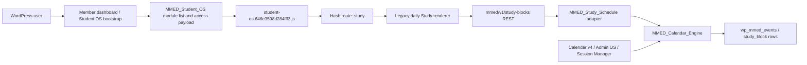
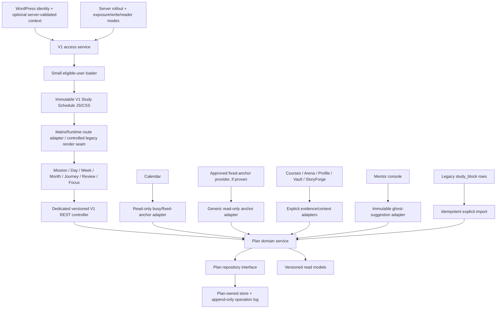

# V1 Study Schedule - Complete Combined Handoff

Mission: `V1-STUDY-SCHEDULE-8000`
Generation: deterministic from the individual Markdown deliverables listed below

## Embedded-file manifest

| File | Bytes | SHA-256 |
|---|---:|---|
| `V1_8000_EXECUTIVE_VERDICT.md` | 4559 | `76e0e0e6ec48ad795bdbfdbab14e57beb33be21d9a77bef5a273df5a08f04b63` |
| `V1_8000_CURRENT_STATE_REPORT.md` | 7798 | `d058ba16c8ce1419fd8b73f17a3a1061baaf3444029a4db848662c42017cdc23` |
| `V1_8000_AUTHORITY_HIERARCHY.md` | 4541 | `59fe7fd3e35fac666f2a8638c2fc507abaeb8e9fb8555eac1d94969277838cd8` |
| `V1_8000_CANONICAL_SOURCE_DECISION.md` | 4358 | `b49f0bdf08d43a958d2153827a0a459e79ab9b218606f6c502e88cfa64c1148c` |
| `V1_8000_REPOSITORY_BRANCH_WORKTREE_MAP.md` | 3104 | `6382131f7d73f3751820f048bc27cb576aa2a2cf208d3d42402f599c0f497a05` |
| `V1_8000_ARTIFACT_AND_PROTOTYPE_CENSUS.md` | 6029 | `93113fe628829741da1341653d01a78434cee5a5f2b990ac455bab5d8c632615` |
| `V1_8000_PRODUCT_REQUIREMENTS_RECONSTRUCTION.md` | 8023 | `370f41afb589520bfc82653a123aa47471dc22be59b21331dec50947c28c43a7` |
| `V1_8000_FEATURE_IMPLEMENTATION_MATRIX.md` | 9959 | `c138be667f60c408b27df967d0fe60a902cd574ce3d5ff31f4a3a02ceae80688` |
| `V1_8000_CURRENT_ARCHITECTURE.md` | 4325 | `14b881cae6b2d7a9716e473b932b75f1c734bf2c4ec3b6dfdbef521c218d246a` |
| `V1_8000_TARGET_ARCHITECTURE.md` | 9937 | `a6bfec3d8f56d38e08cd7f338fada022d21522318d7b593ed70196f284da0d89` |
| `V1_8000_ECOSYSTEM_DEPENDENCY_MAP.md` | 5031 | `810945db24a1c81dbc53ef4fe53502e4d3d52f3b34f194167ce382ebb3fa39a6` |
| `V1_8000_PROTECTED_CONTRACT_AND_INVARIANT_REGISTER.md` | 7475 | `7815c46a72090b123cd06f8b9f3a6016a9461fdbe8388e27c55b73861710d1a4` |
| `V1_8000_DATA_API_AND_IDENTITY_MAP.md` | 6872 | `dc8d3364230f5e00931f9df59ce08d08e29bd21d0bf49c36eb9e7df8195d1a47` |
| `V1_8000_RUNTIME_AND_PRODUCTION_READINESS.md` | 5496 | `50b428cd205249e714aa1510833ba91c4b9a537c4819bdd4b0e0ec536e96b9d7` |
| `V1_8000_TEST_QA_AND_OBSERVABILITY_BASELINE.md` | 4826 | `4037e01e7b5854c5433af21f4162fab0dafc76ca4b8d4e37556b757dbb6897e3` |
| `V1_8000_UI_UX_EXPERT_BOARD_RUBRIC.md` | 5430 | `70f40fda81a76731345065443757663085402f3455313267892edcd413ad23db` |
| `V1_8000_COMPLETION_SCORECARD.md` | 6610 | `eb6779fb2446f3b76f511b6fcfff7aa9580fa5cc4b4b3c1f06cbc7fdddbb1789` |
| `V1_8000_BLOCKER_REGISTER.md` | 6277 | `aeb9d93f99f70298d7f0b9a8fdce234175d7a3a9b533eb4533d9549d87c2d54d` |
| `V1_8000_RISK_AND_CONFLICT_REGISTER.md` | 6032 | `47949121c0ab000261095ea3963509c5080235c1b0b462cd564f454a2f59f604` |
| `V1_8000_SHORTEST_SAFE_PRODUCTION_PATH.md` | 5419 | `1dff7d94c7c0386e56a81c54923d9eaf50579ba702d3226638331c3238ea6e74` |
| `V1_8000_RECOMMENDED_TICKET_SEQUENCE.md` | 3460 | `080fe61219dae0a20dfddce4ba48e229f771acd43619ad1754bcc4dc50af6c5f` |
| `V1_8000_V1_8010_NEXT_RUN_INPUTS.md` | 5510 | `c19b004e9caff5318e3d55ff6e2de2dcfff6b79a6d82943233891c7856f26550` |
| `V1_8000_AGENT_ORCHESTRATION_REPORT.md` | 3641 | `f2371b0d4b072836b970b1f5f1d0a8ebe3479f78937778ed89eea021000084e5` |
| `V1_8000_INDEPENDENT_REVIEW.md` | 6750 | `f1e9b061e634d02aeba70934deece20da34d077cffaedbb37ee338c252950449` |
| `V1_8000_COMMAND_LOG.md` | 6601 | `5f7cba48df67a7b9266387d02374742827af8d34a63e334590f70b18a652833a` |
| `V1_8000_DECISION_LEDGER.md` | 14099 | `e63c46da6ec2ddd59d6ae132c8e07806792c5d36a0c2870bead28abb8336bdf1` |
| `V1_8000_EVIDENCE_INDEX.md` | 6922 | `233e834df742ab57baafece60fde472b7f8d975695e7e6b8440861d31262c63c` |
| `V1_8000_FILE_MANIFEST.md` | 4359 | `9b7cb12193aa8f7052ae2d0685887274a3a2cefa7c74de2364bcfce919d77a6e` |

<!-- BEGIN EMBEDDED FILE: V1_8000_EXECUTIVE_VERDICT.md -->
# V1 Study Schedule — Executive Verdict

Date: 2026-07-14
Mission: `V1-STUDY-SCHEDULE-8000`
Run type: reconciliation and program lock; zero application implementation

## Verdict

V1 Study Schedule is a well-developed product concept and prototype family, but
it is **not a production product today**. Recovered source contains only a thin,
Calendar-backed legacy Study panel and source paths for creating, moving,
resizing, listing, and completing daily `study_block` events. Present public
runtime observation proves only hashed-bundle byte parity, a different
unversioned bundle, an anonymous dashboard redirect, and anonymous REST denial;
current PHP/backend, authenticated rendering, and CRUD remain unverified. The
source-level panel does not
implement the intended Mission/Week/Focus/Reserve/Recovery/Journey product and
must not be relabeled as if it did.

The production implementation foundation is the recovered source at
`d4455bf4ee401eaa8b074603497eb9fcd6eb04a0`. The future V1 implementation must
preserve the D9-300 visual and interaction foundation and apply D9-350 behavioral
law where consistent. D9-360 is valuable refinement and test evidence, not
production acceptance or a replacement for D9-300.

## Program lock

| Authority or boundary | Locked conclusion |
|---|---|
| Product | **V1 Study Schedule** — learner academic study planning and execution |
| Not this product | MissionMed Scheduler, Appointment Scheduler, Calendar, Webex Scheduler |
| Canonical visual/interaction foundation | `D9_300_MATRIX_PLAN_EXECUTION_CANVAS.html`, SHA-256 `cd7737649afeb581fa3a18abb774cfa8ade1860372e0215cc8bd3fa375d0dc67` |
| Behavioral authority | D9-350 behavioral constitution and decision tables, where consistent with the founder correction and D9-300 foundation |
| Later refinement evidence | D9-360; revalidate each adopted refinement; G-D9-4 remains open |
| Source base | `origin/d9-matrix-plan-415-source-recovery` / `d4455bf4ee40` |
| Current runtime | Public hashed shell asset matches source but is absent from lock/passport inventory; current live PHP/controller/backend and authenticated Study route are unverified; D9-415 is a point-in-time source snapshot |
| Production route | **None authenticated and verified**; source infers legacy `/member-dashboard/#study` |
| Canonical data store | Not yet constitutionally selected |
| Identity | WordPress user identity is authoritative; V1 program/course context still requires a server contract |
| Entitlement | Missing for V1; generic login is insufficient and a client flag is not authorization |
| Write owner | Future V1 repository must be the sole canonical Plan writer |

## What is real

- A source-recovered WordPress plugin, Student OS route registration, legacy
  Study renderer, REST endpoints, and Calendar-backed `study_block` CRUD.
- Exact recovered-source hashes for load-bearing PHP files and present public/
  source byte parity for the active shell; current live PHP remains unverified.
- A rich five-generation historical prototype and specification corpus.
- Reproducible D9-350 and D9-360 prototype suites: 188/188 and 209/209.

## What is not real yet

- A Plan-owned persistence model, operation log, revisions, idempotency, or
  migration.
- A server-enforced V1 entitlement.
- The intended Mission, Focus, Reserve, Recovery, Review, Journey, mentor ghost,
  closeout, humane streak, settings, and companion flows in production source.
- Production-level accessibility, responsive, integration, security, browser,
  performance, observability, staging, deployment, or rollback proof.

## Immediate program decision

V1-8010 may begin **only with its authority-and-characterization phase**. It is
not ready to begin schema or learner-visible implementation until the exact
14-item V1-8010A authority checklist is complete. Production observation remains
read-only; mutation characterization is local or isolated-staging only.

The shortest safe route is an initially default-off strangler module with
phase-aware exposure/write/reader modes: contain the legacy REST hazards,
introduce a Plan-owned repository and immutable loader seam, port the D9-300
language into the first vertical slice, then add D9-350 execution and recovery
behavior before gated quality, exact-digest release-candidate, deployment, and
post-launch runs.

Overall production readiness is **2 of 30 evidence gates**, shown compactly as
**7%**. Confidence is high in the evidence classification and count, not in 7%
as a calibrated launch probability. Prototype maturity is separate.
<!-- END EMBEDDED FILE: V1_8000_EXECUTIVE_VERDICT.md -->

<!-- BEGIN EMBEDDED FILE: V1_8000_CURRENT_STATE_REPORT.md -->
# V1 Study Schedule — Current State Report

## Product identity ledger

| Field | Value |
|---|---|
| Product | **V1 Study Schedule** |
| Purpose | Learner academic study planning and execution |
| Historical aliases | Matrix Plan; Study Schedule; Study Scheduler; D9 Matrix Plan |
| Not this product | MissionMed Scheduler; Appointment Scheduler; Calendar; Webex Scheduler |

Every file containing “scheduler” was classified by content. Appointment,
Calendar, Webex, and session-booking assets were excluded except where their
shared runtime or data behavior directly touches `study_block`.

## Repository state

- Repository: `https://github.com/brinyu13/missionmed-hq.git`
- Worktree: `/Users/brianb/MissionMed_worktrees/V1-StudyScheduler-8000`
- Branch: `codex/v1-study-schedule-8000`
- Starting/source-base HEAD: `d4455bf4ee401eaa8b074603497eb9fcd6eb04a0`
- `origin/d9-matrix-plan-415-source-recovery`: exact same commit
- `origin/main`: `9c1fa72e6b056db8b6fe0e17031fcaa688f78569`
- Recovered source-base relationship: `origin/main...d4455bf` is zero commits
  left and six right; its merge base is `origin/main`. The later handoff-only
  publication commit is deliberately excluded from this source metric.
- Tracked files modified before reporting: zero.
- Staged files: zero.
- Permitted untracked state: this reconciliation handoff only.

## Authority-state separation

| Layer | Exact state | Use |
|---|---|---|
| MissionMed_OS working tree | Local `main` dirty with 19 status entries; preserved untouched | Not current run authority |
| MissionMed_OS local HEAD | `72b48e54f5b009ca17cb37c143e7d3c8afb1ef02`; zero ahead, 11 behind fetched remote | Local historical state |
| MissionMed_OS fetched authority | `origin/main` `714443573c41e7a04e4241e67244c334787e1bed` read directly | OS routing/registry authority for this run |
| V1 application-source base | `d4455bf4ee401eaa8b074603497eb9fcd6eb04a0` | Recovered implementation foundation |
| D9-415 production snapshot | Identical T0/T1 at `2026-07-14T00:31:00.453619187Z` / `2026-07-14T00:31:03.315562100Z` | Point-in-time provenance only |
| Present public observation | `2026-07-15T00:23:41Z`–`00:23:42Z` | Two asset hashes, dashboard 302, REST 401 only |

## Current implementation

The current repository contains a **legacy Study panel**, not V1 Study Schedule:

1. `missionmed-hub.php` loads `class-mmed-study-schedule.php`.
2. `MMED_Student_OS` registers route key `study` with the label “Study Schedule.”
3. The active hashed Student OS bundle renders a daily timeline and seven-day
   chooser.
4. The client calls `/wp-json/mmed/v1/study-blocks`.
5. `MMED_Study_Schedule` translates those payloads into Calendar engine events
   with `event_type=study_block`.
6. Source defines the Calendar engine's shared event table as the persistence
   layer; D9-410 and this run did not verify that the live table or Study rows
   exist.

Observed capabilities in source are list, create, drag/move, resize, and
completion toggle. The UI has no complete edit/delete flow and no V1 domain.

## Access and route state

- The Study module is absent from the Student OS temporary-open route list.
  Recovered source populates explicit permissions only for StoryForge and CAM,
  so **every non-admin is source-proven locked** before enrollment/free-module
  checks. Authenticated live behavior remains unverified.
- The REST routes use the shared `can_access` callback, which is only
  `is_user_logged_in()`. Client lock and server authorization therefore do not
  describe the same population.
- Anonymous production GET to the REST route returned 401, as expected.
- Anonymous navigation to `/member-dashboard/` returned 302 to WordPress login.
- A browser check of `/member-dashboard/#study` also reached login. No credential
  was submitted and no authenticated Study route was verified.

**Current production route: NONE VERIFIED.** The only route candidate is the
source-inferred legacy `/member-dashboard/#study`.

## Current defects with production consequence

- Update and delete delegate a numeric ID to generic Calendar mutation without
  first proving `event_type=study_block`.
- The shared soft-delete path returns `deleted=true` without checking whether the
  database update succeeded.
- Completion-only update replaces the event metadata object rather than merging
  it, which can erase subject or future fields.
- No revision, transaction, idempotency, version, tombstone, series, overlap, or
  fixed-anchor enforcement exists.
- Naive datetime conversion creates timezone and DST ambiguity.
- Timeline coverage is 07:00–23:00 rather than the intended 06:00–24:00.
- Range fetching and display boundaries are inconsistent.
- Multiple blocks are stacked within coarse hour rows; cross-midnight layout is
  not faithful.
- Clickable article blocks do not supply full keyboard semantics; the resize
  affordance is smaller than a robust touch target.
- Calendar v4, Admin OS, and Session Manager also recognize or write
  `study_block`, creating a future dual-writer hazard.

## Prototype state

The D9-100 through D9-360 corpus is substantial: 75 files and 2,006,500 bytes.
D9-300 was rendered and confirmed to express the canonical CAM/Timeline language.
D9-350 and D9-360 suites pass in their prototype environment. None of these
self-contained HTML/local-state prototypes is production implementation.

D9-360 rendered at desktop, tablet, and mobile without horizontal document
overflow, but manual checks found a clipped/overlapping focus-within popover and
a fixed bottom navigation that overlays content and clips visible destinations
at smaller widths. Its self-authored 9+ scores are therefore not accepted as an
independent quality gate.

## Runtime and authority drift

- Active served hashed Student OS asset SHA-256:
  `646e3598d284fff31d22dec98c70c1800e74743276872bb65f1afeeda1c17e5a`,
  exact match to source.
- The public unversioned `student-os.js` is a different stale object:
  `6b3ad4ea933f61c28da266a7260851b3c0af69b8e09a7df08ff5485718f9948c`.
  The recovered controller source references the hashed asset, so this is cache
  hygiene evidence and a source-inferred delivery path, not current proof that
  the stale file does or does not execute.
- The local Matrix runtime guard matched its protected source inputs except the
  recovered Student OS controller, whose source hash is `23da5c...` while the
  manifest names an older approved hash. This does not verify current live PHP.
  Brian explicitly approved the read-only lock override for this mission and
  `class_mmed_student_os_php`.
- That guard result covers only declared inputs. The global lock inventories
  unversioned `assets/student-os.js`, not the active
  `assets/student-os.646e3598d284fff3.js`; the product-repository Matrix passport
  is stale and omits the active hashed path too. The override does not close
  this coverage gap. V1-8010A must pin controller, hashed bundle, unversioned
  source twin, and cache-delivery behavior as one governed descriptor.
- An earlier startup preflight proved a zero-byte MissionMed_OS Git index lock
  stale and removed only that lock; the resumed run observed it absent.
  MissionMed_OS local file changes were preserved untouched. Its local `CURRENT.md`
  and registry are not V1 authority; fetched `origin/main` was read directly and
  contains no registered V1 mission.

## Readiness conclusion

Product and prototype authority are recoverable. Source authority is recovered.
Data, entitlement, integration ownership, staging, deployment, and production
acceptance are not. V1-8010 must begin with authority locks and safety
characterization. Initial rollout is default-off, but post-cutover rollback
requires distinct exposure/write/reader modes rather than one boolean flag.
<!-- END EMBEDDED FILE: V1_8000_CURRENT_STATE_REPORT.md -->

<!-- BEGIN EMBEDDED FILE: V1_8000_AUTHORITY_HIERARCHY.md -->
# V1 Study Schedule — Authority Hierarchy

Authority is selected by scope and evidence, not filename date or self-declared
completeness.

| Rank | Scope | Authority | Binding decision |
|---:|---|---|---|
| 1 | Active identity and run scope | Brian's explicit V1 Study Schedule correction and resume directives | New work uses V1 Study Schedule; D9 names are historical; appointment/Calendar/Webex products are excluded |
| 2 | Visual and interaction foundation | D9-300 HTML plus design and interaction reports | Preserve CAM Timeline language, information hierarchy, canvas behavior, hard geometry, ink/ember palette, and low-cognitive-load interaction model |
| 3 | Behavioral law | D9-350 behavioral constitution, decision tables, streak and temporal specifications | Preserve Mission-first execution, learner control, reserve provenance, recovery conservation, mentor ghosts, closeout, humane streak behavior, and silence rules where consistent |
| 4 | Later refinement evidence | D9-360 artifact, specifications, screenshots, and 209-test prototype suite | Use as requirements/refinement evidence only after revalidation; it does not supersede D9-300 and does not close G-D9-4 |
| 5 | Domain and ecosystem intent | D9-100 and D9-200 definitions, integration maps, Mission/Focus/recovery specifications | Supplies approved breadth and historical intent where later authority does not conflict |
| 6 | Source implementation | `d4455bf4ee401eaa8b074603497eb9fcd6eb04a0`, based on the D9-415 observed-production recovery | Canonical source foundation and base for V1 implementation |
| 7 | Runtime fact | Live HTTP responses, served asset hashes, D9-415 production map, runtime lock evidence | Establishes what is served, accessible anonymously, and hash-identical; cannot decide product or data ownership |
| 8 | Data/deployment decision | No complete authority exists | Must be established by V1 decision records before schema or rollout |

## Conflict resolutions

### D9-300 versus D9-360

The founder explicitly identified D9-300 as the canonical visual and interaction
foundation. Any earlier report calling D9-360 the final product authority is
superseded for this run. D9-360 remains useful later evidence, subject to
rendered, accessibility, responsive, and behavioral revalidation.

### Student completion ownership

D9-100 allows an interpretation in which external systems can complete work.
D9-350's later behavioral constitution makes completion a learner action. The
later specific law controls: Arena/course outcomes may attach evidence or propose
completion, but must not silently set a learner block to done.

### Physical data store

No source, MissionMed_OS document, Supabase project map, or applied schema
establishes a canonical V1 Plan store. Existing Calendar events and unrelated
`study_plans`/`tasks` candidates do not acquire authority by resemblance. A
Plan-owned WordPress repository is the lowest-risk recommendation because
WordPress identity is established, but it remains a decision gate until recorded.

### Product passport and mission registry

Two repositories must not be conflated:

- The active V1 product worktree and product repository `origin/main` both track
  `PRODUCT_PASSPORTS/matrix.md`, blob
  `85c4b293896a0554c9fa4122329d106bb9cefe0b`, introduced by
  `7ce4aeec74a82fe540e7f1f4af1cca75edd9c2b9`. It is current recovered-source
  governance evidence but stale/incomplete: it points to older worktrees, omits
  `#study` and its API/storage owner, and still protects shared Matrix app-mode
  paths.
- Fetched MissionMed_OS `origin/main` has `products_index.json` pointing to
  `PRODUCT_PASSPORTS/matrix.md` but does not contain that file.

Fetched MissionMed_OS `CURRENT.md` contains a different active mission and
`missions.json` contains no V1 mission. These are authority/path drift findings,
not authorization to modify either passport or MissionMed_OS in V1-8000.

## Evidence rules for V1-8010

- A prototype proves intended behavior only, never production persistence.
- A passing jsdom suite proves prototype logic only, never authenticated browser
  integration.
- Exact source/runtime bytes prove provenance, never entitlement or data
  correctness.
- A route label or client lock is not server authorization.
- A flag is rollout control, not entitlement.
- A shared table name is not write ownership.
- Every protected-source change requires the runtime-lock protocol, Brian's
  recorded override where applicable, compatibility tests, immutable assets, and
  rollback hashes.
<!-- END EMBEDDED FILE: V1_8000_AUTHORITY_HIERARCHY.md -->

<!-- BEGIN EMBEDDED FILE: V1_8000_CANONICAL_SOURCE_DECISION.md -->
# V1 Study Schedule — Canonical Source Decision

## Decision

Use the repository state at
`d4455bf4ee401eaa8b074603497eb9fcd6eb04a0` as the canonical implementation
foundation for V1-8010.

At run start, the V1 reconciliation branch exactly equaled
`origin/d9-matrix-plan-415-source-recovery`. Its application-source base remains
that ref after the handoff-only publication commit. A future implementation
branch should start from `d4455bf` plus the accepted V1-8000 handoff, not from
`origin/main` and not from a prototype directory.

## Why this source

- D9-415 mapped 135/135 production package files to recovered Git source.
- The recovered branch includes the observed production plugin, MU-plugin
  closure, provenance, test, rollback, and reconciliation reports.
- The active served hashed Student OS asset matches the recovered source byte for
  byte.
- The worktree's Study class, REST controller, Student OS controller, Calendar
  engine, plugin bootstrap, and active Student OS asset have stable recorded
  hashes.
- No competing implementation has stronger source/runtime provenance. Multiple
  references containing the same Study blob are duplicates, not separate
  products.

All-ref verification found 32 refs resolving
`wp-content/plugins/missionmed-hub/includes/class-mmed-study-schedule.php` and
every one resolved blob `84fa3f4d89c1e7c1a0f733a41679cb4e329d7833`.
`git log --all -S` searches for `renderJourney`, `GhostSuggestion`,
`ReserveItem`, honest closeout, and Quick Build found no plugin implementation
commit. No D9-416 or D9-420 implementation ref was found.

## Load-bearing source inventory

| File | SHA-256 | Role |
|---|---|---|
| `wp-content/plugins/missionmed-hub/missionmed-hub.php` | `ed02cd301205557b656cb4758e9ba2848d3938a2429647825606da6230c96cad` | Plugin bootstrap |
| `includes/class-mmed-student-os.php` | `23da5c033e8d9ffcf3e9512fb385a8a0a0e88b592cae5e375941d43372cefe29` | Shell/controller/module payload |
| `includes/class-mmed-study-schedule.php` | `2356d2369007db715849a3e2ba5959ac0e4323a04a8c4206b9f8b50bd97c3234` | Legacy Study-to-Calendar adapter |
| `includes/class-mmed-calendar-engine.php` | `b97bef169a25ca77bba93a8e27bbb40f3055bcc63ab85d1d864512353cdc56cb` | Shared Calendar event store and mutations |
| `includes/class-mmed-rest-api.php` | `2e2a282d05ac876c658b0c5717e4412989b362ce63cc0731f7f97f8187126b16` | Shared REST namespace/routes |
| `assets/student-os.646e3598d284fff3.js` | `646e3598d284fff31d22dec98c70c1800e74743276872bb65f1afeeda1c17e5a` | Active Student OS client bundle |

Paths after the first row are relative to
`wp-content/plugins/missionmed-hub/`.

## What this decision does not mean

- The legacy Calendar-backed Study panel is not the intended V1 product.
- `mmed_events` is not selected as the V1 Plan store.
- Existing REST permission behavior is not accepted.
- The current client lock is not accepted as entitlement.
- The active hashed shell must not be edited in place.
- D9-415's source recovery does not close D9-416, data, auth, feature-flag,
  staging, deployment, or production gates.

## Implementation home

V1-8010 should use a new `codex/` branch based on `d4455bf` in a dedicated V1
worktree. The D9 recovery branch and its reports remain immutable evidence.

The safe seam is a dedicated V1 module with:

- a small eligible-user loader;
- immutable lazy-loaded JS/CSS;
- route registration through `window.MatrixRuntime` when active and a controlled
  `MMED_OS.render.study` replacement otherwise;
- a dedicated V1 repository and REST controller;
- a default-off `v1_study_schedule` rollout switch;
- server-derived entitlement shared by nav, loading, and REST.

## Runtime-lock disposition

Among declared guard inputs, the Matrix guard differs only for
`class_mmed_student_os_php`. Brian explicitly approved that override for this
mission. V1-8000 used it solely to read and reconcile evidence. The global lock
does not inventory the active hashed bundle path; it inventories unversioned
`assets/student-os.js`, whose public object differs from the recovered source
twin. The stale Matrix passport also omits the active hashed bundle. V1-8010A
must record the override and pin the controller, active hashed bundle,
unversioned source twin, and cache behavior together before any protected edit;
lock updates then use only the governed release process.
<!-- END EMBEDDED FILE: V1_8000_CANONICAL_SOURCE_DECISION.md -->

<!-- BEGIN EMBEDDED FILE: V1_8000_REPOSITORY_BRANCH_WORKTREE_MAP.md -->
# V1 Study Schedule — Repository, Branch, and Worktree Map

## Canonical topology

| Item | Value | Interpretation |
|---|---|---|
| Origin | `https://github.com/brinyu13/missionmed-hq.git` | Canonical repository |
| Default branch | `main` | Hosted default; not the recovered implementation base |
| `origin/main` | `9c1fa72e6b056db8b6fe0e17031fcaa688f78569` | Merge base |
| Recovered-source ref | `origin/d9-matrix-plan-415-source-recovery` | Canonical recovered source |
| Recovered-source commit | `d4455bf4ee401eaa8b074603497eb9fcd6eb04a0` | V1 implementation foundation |
| Current branch | `codex/v1-study-schedule-8000` | Began at recovered source; receives one handoff-only publication commit |
| Current worktree | `/Users/brianb/MissionMed_worktrees/V1-StudyScheduler-8000` | Reconciliation home |
| Upstream at run start | none | Publication must explicitly set branch/upstream |

For the recovered application source, `origin/main...d4455bf` is `0 6` by
left/right count and 220 paths differ from main. Those metrics intentionally bind
to `d4455bf`, not to the later documentation commit. Therefore a V1-8000 draft
PR must target `d9-matrix-plan-415-source-recovery`; targeting `main` would
misrepresent the handoff as a large application recovery change.

## Recovery lineage

| Commit | Recovery role |
|---|---|
| `c340a3a` | Observed production import |
| `9469437` | Backup quarantine |
| `e12cd99` | Provenance reconciliation |
| `a81a3af` | Validation evidence |
| `030fe10` | Review corrections |
| `d4455bf` | Final D9-415 reports and source foundation |

## Worktree census

- Registered worktrees: 142.
- Source base (`d4455bf`) tracked files: 510.
- Source-base `missionmed-hub` tracked files: 125.
- Source-base top-level MU-plugin files: 21.
- Only the D9-415 recovery worktree is a byte-current implementation twin for the
  Study source; other worktrees are historical, unrelated, or duplicate refs.

The large worktree count is evidence-search scope, not authority. No unrelated
worktree was modified.

## Existing hosted review state

An earlier draft PR exists for D9 recovery and is explicitly marked “DO NOT
MERGE.” It is evidence of the source-recovery lineage, not the V1-8000 review.
The canonical repository was verified as public, with `main` as the hosted
default and sufficient connected-app permission for the later handoff-only
publication.

## Branch policy for subsequent runs

- V1-8000: commit only the corrected reconciliation directory.
- V1-8010: new branch/worktree at `d4455bf` plus the accepted V1-8000 handoff.
- V1-8010A must choose a durable long-term source/release destination: a
  long-lived V1 branch, separately reviewed recovered-baseline promotion, or an
  exact package-based release. Production must not depend on an orphaned
  historical D9 branch.
- Never modify the D9-415 evidence branch in place.
- Do not rebase the recovery lineage onto main during the product implementation.
- Use content-hashed release assets and a package manifest.
- Keep schema, entitlement, UI, and rollout changes in separately revertible
  commits.
<!-- END EMBEDDED FILE: V1_8000_REPOSITORY_BRANCH_WORKTREE_MAP.md -->

<!-- BEGIN EMBEDDED FILE: V1_8000_ARTIFACT_AND_PROTOTYPE_CENSUS.md -->
# V1 Study Schedule — Artifact and Prototype Census

## Historical product corpus

| Package | Files | Bytes | Primary classification |
|---|---:|---:|---|
| D9-100 | 9 | 316,245 | Product/domain definition and functional prototype |
| D9-200 | 15 | 384,100 | Experience architecture, Mission/Focus/recovery/mentor specifications |
| D9-300 | 7 | 330,195 | **Canonical visual and interaction foundation** |
| D9-350 | 22 | 504,445 | **Behavioral constitution and temporal law** |
| D9-360 | 22 | 471,515 | Later refinement, screenshots, prototype tests, and quality claims |
| **Total** | **75** | **2,006,500** | Historical authority/evidence, not production source |

Operational evidence packages are under
`/Users/brianb/MissionMed/_AI_HANDOFFS/from_cowork/`. This run found
byte-identical paired copies under
`/Users/brianb/MissionMed_AI_Sandbox/CLAUDE_FILES/` for all five generations.
Only D9-360 has an official D9-410 package seal: that seal selects the operational
handoff as preferred artifact-level canonical and the corrected sandbox copy as
its byte-identical mirror. This run does not invent aggregate package seals for
D9-100 through D9-350. Historical filenames remain unchanged.

## Prototype identity

| Generation | Prototype HTML and SHA-256 | Authority classification |
|---|---|---|
| D9-100 | `D9_100_MATRIX_PLAN_FUNCTIONAL_PROTOTYPE.html` — `b7998ccec1062ce434bc7c2f1167f84de0910fa758a0bee7ac147e32bd58743f` | Domain/interaction evidence |
| D9-200 | `D9_200_MATRIX_PLAN_NEXT_LEVEL_FUNCTIONAL_APP.html` — `f48baab157eca07527fb50b77c8c389b9eeb0f9abf90da911cd045b345938e7d` | Product-elevation evidence |
| D9-300 | `D9_300_MATRIX_PLAN_EXECUTION_CANVAS.html` — `cd7737649afeb581fa3a18abb774cfa8ade1860372e0215cc8bd3fa375d0dc67` | Canonical visual/interaction foundation |
| D9-350 | `D9_350_MATRIX_PLAN_BEHAVIORAL_AND_JOURNEY_PROTOTYPE.html` — `e7f0f5cbedf12edf4c88cbd42d2f466681860e456f12bcbbfa320406d701553c` | Behavioral-law reference implementation |
| D9-360 | `D9_360_MATRIX_PLAN_FINAL_PERFECTION_PROTOTYPE.html` — `3932492723fb031942603724cda1d1d80418d1e0f230f6916824e2257fbe8dd5` | Refinement candidate and QA evidence |

The official D9-360 seal records aggregate package SHA-256
`f56ccabe32e8bef2f504def9c118c9bc0aa8e2a8a4bf76fa76c7a09be29c3e00`
and implementation-authority document SHA-256
`3e399ecf22ae6bb73dcd187f91390bdb1aabdcbf4ae19f455e46ebd0054f2286`.
Its own precedence claim is evidence, but Brian's later D9-300 correction
controls this run.

## Filing caveat

D9-410 proves the preferred D9-360 handoff was not durably committed/pushed and
its sandbox mirror is outside a detected Git worktree. The same V1-8000 census
does not establish durable Git provenance for the D9-100–350 package corpus.
Hashes prove the observed bytes, not recoverability or repository authority.
V1-8010A must verify and, through an authorized non-destructive filing decision,
pin the accepted product inputs before implementation relies on them.

## Classification by authority

| Authority type | Selected evidence | Exclusions |
|---|---|---|
| Product | Founder correction plus D9-100/200/350 requirements | Appointment/Webex/Calendar product artifacts |
| Visual | D9-300 HTML, design system, interaction system | D9-360 self-score as a substitute |
| Behavioral | D9-350 constitution and decision tables | Prototype localStorage as persistence |
| Implementation | D9-415 recovered source at `d4455bf` | Standalone HTML and unintegrated drafts |
| Runtime | D9-415 production map plus current served hash/HTTP checks | Filename recency |
| Data | None selected | Calendar events, diagnostic tables, unknown Supabase projects |
| Deployment | D9-415 source package/rollback evidence only | No V1 deployment authority |

## Recovered-source and runtime evidence

The D9-410 source-authority package contains 60 files: 28 top-level reports, 23
rendered PNG evidence files, and nine extensionless `evidence/live_assets/`
runtime snapshots for Student OS, Calendar, Scheduler, File Vault, and StoryForge
assets. Those nine are historical point-in-time bytes and are superseded where
D9-415 or the dated current HTTP evidence differs. The D9-415 recovery package
contains 74 tracked artifacts. D9-415's 135/135 point-in-time
production-source map is the basis for the source decision.

The active hashed Student OS asset is exact across source and public runtime.
The legacy Study implementation consists principally of the Study class, shared
REST controller, Student OS controller, active shell JS/CSS, Calendar engine,
and shared writers in Calendar/Admin/Session assets.

## Test and rendering evidence

- D9-350 test suite SHA-256:
  `f95307de45962d4badef06276b4bbbf246b52ef2436bc6834d904277fc16ccb9`;
  reproduced 188 passed, 0 failed.
- D9-360 test suite SHA-256:
  `e2c3eaaf482edf541b80b34b0b6584871bab5abc456a19d64c032fbfece85cdc`;
  reproduced 209 passed, 0 failed.
- Both suites hard-code their expected HTML filename, so validation used temporary
  copies named `app350.html`/`app360.html`. Original artifacts were untouched.
- D9-100/200/300 reports refer to tests, but corresponding executable suites were
  not present in their recovered package and could not be reproduced.
- D9-300 and D9-360 were rendered locally. D9-360 exposed visible desktop and
  narrow-width defects, so its self-authored quality score is not accepted.

## Google Drive census

Connected Drive searches used historical aliases and distinctive product terms.
They found no direct D9/V1 Study Schedule authority. Results were unrelated false
positives and were not opened further. No Drive file was modified or used as
authority.

## Excluded drift

`scheduler_v1.html`, appointment booking, Webex broker, office hours, interview
booking, Daily Rounds scheduling, and unrelated Matrix Calendar work are not
product artifacts. `scheduler-mount.js` is excluded because no evidence shows it
mounts V1 Study Schedule. Shared Calendar/Student OS assets are retained only as
dependency and collision evidence.
<!-- END EMBEDDED FILE: V1_8000_ARTIFACT_AND_PROTOTYPE_CENSUS.md -->

<!-- BEGIN EMBEDDED FILE: V1_8000_PRODUCT_REQUIREMENTS_RECONSTRUCTION.md -->
# V1 Study Schedule — Product Requirements Reconstruction

Legend: **V** = directly verified in founder or historical authority; **I** =
inferred implementation requirement needed to make an approved behavior safe in
production. Production owner names are target boundaries, not proof of current
implementation.

| Requirement | Source / basis | V/I | Production acceptance criterion | Owner |
|---|---|:---:|---|---|
| Mission | D9-200, D9-350 | V | Select one humane primary mission; show why it matters and now/next/later without hiding the plan | V1 domain/UI |
| Day | D9-350 temporal architecture | V | Accurate day window, actuals, partial/missed states, anchors, reserve, closeout | V1 domain/UI |
| Week | D9-300 canvas, D9-350 | V | Seven-day 06:00–24:00, 15-minute operations, no overlap, capacity honesty, keyboard/touch parity | V1 domain/UI |
| Month | D9-350/360 | V | Summarize load, goals, recovery, milestones; avoid editing ambiguity | V1 read model/UI |
| Journey | D9-350/360 | V | Runway/phases/exams/goals with accessible drill-down and stable temporal navigation | V1 read model/UI |
| Review | D9-200/350 | V | Closeout and periodic review show planned vs actual, recovery, learning, and next adjustments | V1 domain/UI |
| Focus Mode | D9-200/300 | V | One current block, timer/session state, pause/partial/complete/skip, next action, minimal cognitive load | V1 session service/UI |
| Quick Build | D9-100/200 | V | Create a valid initial week from goals, anchors, capacity, and preferences; preview before commit | V1 planner |
| Manual blocks | D9-100/300 | V | Create/edit/delete/reload with stable IDs, ownership, validation, and audit history | V1 repository/API |
| Drag/drop/resize/nudge | D9-300 | V | 15-minute keyboard/touch/pointer changes; reject collisions; preserve duration and timezone | V1 UI/domain |
| Recurrence | D9-100 | V | Create series, edit one/future/all, detach exceptions, idempotent retries | V1 series service |
| Reserve | D9-200/350 | V | Visible provenance; never auto-consume; learner confirms conversion | V1 domain |
| Recovery | D9-200/350 | V | Missed work produces conservation-preserving choices; no silent reflow or rest theft | V1 recovery service |
| Partial/remainder | D9-350 | V | Record actual time, retain remainder with provenance, offer but do not force reschedule | V1 execution domain |
| Skip/reschedule | D9-200/350 | V | Record reason/state, conserve work, reject conflicts, maintain history | V1 execution/recovery |
| Runway/exam facts | D9-100/350 + IC-14 | V | Profile-owned versioned dates drive planning/Journey through effective V1 snapshots without transferring source ownership | Profile source + V1 snapshot |
| Capacity/confidence | D9-100/200 | V | Planned load reflects anchors, recovery, user confidence, and over-capacity warnings | V1 planner |
| Task families/activity types | Founder definition + D9 domain model | V | Blocks use governed study activity families with stable IDs, labels, defaults, analytics-safe categories, and extensible course context | V1 domain + Courses adapter |
| Medical unit targets | D9-100 | V | Units attach to task family/course context and roll up without hard-coded assumptions | V1 domain + Courses adapter |
| Mentor ghosts | D9-200/350 | V | Mentor creates immutable suggestion with reason; learner accepts/rejects/negotiates; no direct edit | Mentor adapter + V1 domain |
| Mentor privacy/withdrawal | D9-100/200/350 | V | Server filters assigned learners and `mentorVis=true` fields; minute actuals require learner opt-in; every ghost has reason, author/assignment provenance, created/withdrawn versions, CAS resolution, and audited withdrawal/accept conflict behavior | Entitlement/privacy + mentor adapter |
| Calendar boundary | D9 ecosystem specs + current source | V | Calendar is busy/fixed-anchor input or marked projection; it never owns canonical Plan state | Calendar adapter |
| Goal fields | D9-100/350 | V | Versioned goals drive planning without erasing history; field-level semantic/physical ownership is decided in V1-8010A | Owner TBD; V1 snapshot allowed |
| Courses | D9-100 integration map | V | Server-validated context and due/target evidence; no silent completion | Courses adapter |
| Arena | D9-100/350 conflict resolution | V | Outcomes attach evidence/propose completion; learner remains completion authority | Arena adapter |
| StoryForge/Vault/Profile | D9-100/200 | V | Explicit read-only context links; no hidden Plan writes; absence degrades safely | Dedicated adapters |
| Messages/notifications | D9-100 | V | Opt-in actionable reminders/mentor notices with privacy, dedupe, timezone, and quiet hours | Notification adapter |
| Timer/floating pill | D9-200/360 | V | One durable session, cross-route state, safe recovery after refresh, no duplicate timers | Session service + shell adapter |
| Phone companion | D9-360 | V | Responsive execution companion with same authoritative session; no separate local truth | V1 responsive UI |
| Settings | D9-350/360 | V | Server round-trip, versioned defaults, scoped sound/motion/quotes/privacy controls after canonical owner is decided | Ownership TBD in V1-8010A |
| Sound/motion/quotes | D9-350/360 | V | Optional, reduced-motion aware, silent by default where required, governed quote source | V1 settings/UI |
| Streaks/motivation | D9-350 | V | Closeout-derived, deterministic, humane, timezone-safe; rest/recovery do not punish | V1 motivation service |
| Onboarding | D9-100/360 | V | Explain ownership, anchors, capacity, reserve, recovery, and first safe plan; resumable | V1 UI |
| Responsive/mobile | D9-300/360 | V | 320px+ without obstruction; all six views and primary actions reachable; touch targets >=44px | V1 UI |
| Keyboard/accessibility | D9-300/350 | V | WCAG 2.2 AA, semantic controls, focus order, SR announcements, drag alternatives, contrast | V1 UI |
| Timezones | Temporal behavior + production necessity | I | Store instants plus IANA zone and local intent; DST tests for gaps/folds and week boundaries | V1 domain/repository |
| Persistence/sync | Approved durable product intent | I | Atomic versioned writes, revisions, idempotency, two-tab conflict handling, offline failure clarity | V1 repository |
| Access/authorization | Founder boundary + current source defect | I | Authenticate+nonce, entitlement/rollout/action decision, learner-scoped lookup, resource/field authorization, and non-enumerating errors | V1 access service + repository |
| Offline/failure | Cognitive-load intent | I | No false success; retry safely; preserve draft/operation IDs; explain stale/conflict state | V1 client/repository |
| Analytics/observability | Production gate | I | Privacy-safe events for route, load, mutation, conflict, recovery, errors, performance; no student content | V1 telemetry |
| Retention/history | D9-100 inherited rule + privacy gate | V | Revalidate 90-day operation-log and permanent ReviewRecord/weekly-aggregate language; define archive, tombstone/audit, deletion/anonymization, backup expiry, restore/export | Data/privacy owners |
| Deployment/rollback | Runtime governance | I | Immutable assets, additive schema, separate exposure/write/reader modes, atomic cutover watermark, current/N-1 fallback reader, canary, and truthful pre/post-cutover continuity | Release owner |

## Behavioral invariants

1. The learner owns completion and accepts every mentor ghost.
2. Reserve is explicit capacity, never an invisible overflow bucket.
3. Recovery conserves work and rest; it does not silently rewrite the plan.
4. Calendar and any later explicitly approved fixed-anchor provider may inform V1
   but do not own Plan state; appointment systems are not an assumed dependency.
5. Fixed external anchors are immutable in V1.
6. No overlap, no silent work loss, no metadata replacement, and no
   last-write-wins across tabs.
7. Focus/closeout actuals are distinct from planned blocks.
8. Product silence and reduced cognitive load are functional requirements.
<!-- END EMBEDDED FILE: V1_8000_PRODUCT_REQUIREMENTS_RECONSTRUCTION.md -->

<!-- BEGIN EMBEDDED FILE: V1_8000_FEATURE_IMPLEMENTATION_MATRIX.md -->
# V1 Study Schedule — Feature Implementation Matrix

Status vocabulary follows the canonical prompt. Every production-source row is
at `d4455bf4ee401eaa8b074603497eb9fcd6eb04a0`.

## Evidence key

| Key | Exact evidence |
|---|---|
| S-SHELL | `wp-content/plugins/missionmed-hub/assets/student-os.646e3598d284fff3.js`, especially lines 77–124, 1001–1003, 3982–4049, 4591–4779 |
| S-CTRL | `wp-content/plugins/missionmed-hub/includes/class-mmed-student-os.php`, especially 434–442, 601, 661 |
| S-ACCESS | `wp-content/plugins/missionmed-hub/includes/class-mmed-access-gate.php`, especially 291–299 |
| S-STUDY | `wp-content/plugins/missionmed-hub/includes/class-mmed-study-schedule.php` |
| S-REST | `wp-content/plugins/missionmed-hub/includes/class-mmed-rest-api.php`, 591–624, 694–695, 1860–1900 |
| S-CAL | `wp-content/plugins/missionmed-hub/includes/class-mmed-calendar-engine.php` |
| S-WRITERS | Calendar v4/Admin assets plus Session Manager/Calendar Enrollment PHP chain listed in E-010 |
| P-100/200/300/350/360 | Operational historical packages under `/Users/brianb/MissionMed/_AI_HANDOFFS/from_cowork/`, with byte-identical sandbox copies observed; only D9-360 has the official D9-410 package seal |
| R-PUBLIC | Current anonymous public evidence: hashed JS exact, dashboard 302, REST 401; no authenticated route/backend proof |
| R-NONE | No authenticated production runtime evidence |
| D-CAL-SOURCE | Source defines `$wpdb->prefix . mmed_events` wiring; live table and rows are unverified |
| D-NONE | No applied/verified persistence |
| I-CAL-SOURCE | Source-level shared Calendar coupling only; runtime behavior unverified |
| I-NONE | No production integration implementation found |
| T-350 / T-360 | Prototype-only suites, 188/188 and 209/209 |
| T-NONE | No production feature test |

## Matrix

| Feature | Status | Source / branch | Runtime · persistence · integration · tests | Confidence | Exact gap | V1-8010 action |
|---|---|---|---|---|---|---|
| Learner route/access | PRESENT BUT BROKEN | S-SHELL, S-CTRL, S-ACCESS | R-NONE · D-NONE · I-NONE · T-NONE | High source / low runtime | Every non-admin is locked in recovered source; authenticated runtime unverified | Separate entitlement/rollout/action authorization and test principals |
| Admin legacy route | IMPLEMENTED BUT UNVERIFIED | S-SHELL, S-CTRL | R-NONE · D-CAL-SOURCE · I-CAL-SOURCE · T-NONE | High source / low runtime | Source bypasses lock for admin; no authenticated render | Characterize audit-only admin and deny learner-data mutation |
| Daily block list | IMPLEMENTED BUT UNVERIFIED | S-SHELL, S-STUDY, S-REST | R-NONE · D-CAL-SOURCE · I-CAL-SOURCE · T-NONE | High source | Live table/rows and authenticated response unknown | Freeze behavior, then replace with V1 read model |
| Create block | IMPLEMENTED BUT UNVERIFIED | S-SHELL, S-STUDY, S-REST, S-CAL | R-NONE · D-CAL-SOURCE · I-CAL-SOURCE · T-NONE | High source | No Plan model, overlap, idempotency, revision, runtime proof | Add safety tests; implement Plan repository |
| Drag/move | IMPLEMENTED BUT UNVERIFIED | S-SHELL | R-NONE · D-CAL-SOURCE · I-CAL-SOURCE · T-NONE | High source | Coarse layout; no collision/concurrency law | Transactional 15-minute learner operation |
| Resize | IMPLEMENTED BUT UNVERIFIED | S-SHELL | R-NONE · D-CAL-SOURCE · I-CAL-SOURCE · T-NONE | High source | Small handle; no keyboard parity or revision | Accessible alternatives and revision checks |
| Completion | PRESENT BUT BROKEN | S-SHELL, S-STUDY, S-CAL | R-NONE · D-CAL-SOURCE · I-CAL-SOURCE · T-NONE | High source | Partial update replaces metadata; wrong domain ownership | Preserve metadata; learner-only Plan operation |
| Edit/delete learner UI | NOT STARTED | S-SHELL; backend S-REST/S-CAL only | R-NONE · D-CAL-SOURCE · I-CAL-SOURCE · T-NONE | High | No edit/delete UI; backend numeric mutation is unsafe | Owner/type containment, then complete Plan UI |
| Mission | PROTOTYPE ONLY | P-200/300/350/360 | R-NONE · D-NONE · I-NONE · T-350/T-360 | High | No production domain/UI | Implement after first vertical slice |
| Day | PARTIAL | Legacy S-SHELL; target P-350 | R-NONE · D-CAL-SOURCE · I-CAL-SOURCE · T-350 | High | No actuals, anchors, reserve, closeout | Build V1 Day read model |
| Week canvas | PROTOTYPE ONLY | P-300/350/360 | R-NONE · D-NONE · I-NONE · T-350/T-360 | High | Legacy coarse day/hour view only | Port D9-300 language onto Plan data |
| Month | PROTOTYPE ONLY | P-350/360 | R-NONE · D-NONE · I-NONE · T-350/T-360 | High | No production source | Add after execution core |
| Journey | PROTOTYPE ONLY | P-350/360 | R-NONE · D-NONE · I-NONE · T-350/T-360 | High | No production source; prototype popover defects | Revalidate and implement read model |
| Review/closeout | PROTOTYPE ONLY | P-200/350/360 | R-NONE · D-NONE · I-NONE · T-350/T-360 | High | No durable closeout/streak | Operation-derived implementation |
| Focus Mode | PROTOTYPE ONLY | P-200/300/350/360 | R-NONE · D-NONE · I-NONE · T-350/T-360 | High | No production session persistence | Durable session service and UI |
| Quick Build | PROTOTYPE ONLY | P-100/200 | R-NONE · D-NONE · I-NONE · T-NONE | Medium-high | No planner/API/preview | Add after core repository |
| Recurrence | NOT STARTED | Requirement P-100/350 | R-NONE · D-NONE · I-NONE · T-NONE | High | No Plan series/exception model | Stable series and detach semantics |
| Reserve | PROTOTYPE ONLY | P-200/350 | R-NONE · D-NONE · I-NONE · T-350 | High | No durable provenance | First-class reserve object |
| Recovery/reflow | PROTOTYPE ONLY | P-200/350 | R-NONE · D-NONE · I-NONE · T-350 | High | No conservation engine | Learner-confirmed deterministic recovery |
| Partial/remainder | PROTOTYPE ONLY | P-350 | R-NONE · D-NONE · I-NONE · T-350 | High | No actual/remainder model | Session actual plus derived remainder |
| Mentor ghosts/privacy | PROTOTYPE ONLY | P-100/200/350 | R-NONE · D-NONE · I-NONE · T-350 | High | No assignment/privacy/withdrawal/API | Versioned suggestion and learner response |
| Goals/runways | PROTOTYPE ONLY | P-100/350/360 | R-NONE · D-NONE · I-NONE · T-350/T-360 | Medium | Profile/source field ownership open | Decide fields; snapshot source facts |
| Capacity/confidence | PROTOTYPE ONLY | P-100/200/350 | R-NONE · D-NONE · I-NONE · T-350 | High | No fixed anchors/capacity engine | Computed capacity snapshot |
| Task families/activity types | PROTOTYPE ONLY | P-100/200/350 | R-NONE · D-NONE · I-NONE · T-350 | High | Legacy strings are not governed taxonomy | Stable IDs and server validation |
| Calendar boundary | PRESENT BUT BROKEN | S-STUDY, S-CAL, S-WRITERS | R-NONE · D-CAL-SOURCE · I-CAL-SOURCE · T-NONE | High source | Wrong owner; source-capable multiple writers/recognizers; runtime concurrency unverified | Read-only adapter, echo-safe export, explicit import |
| Approved fixed-anchor provider | NOT STARTED | Generic boundary only | R-NONE · D-NONE · I-NONE · T-NONE | High | No provider beyond Calendar is approved or proven necessary | Keep generic seam; no appointment-system work in V1-8010 |
| Course/Arena adapters | NOT STARTED | Requirement P-100/350 | R-NONE · D-NONE · I-NONE · T-NONE | High | No transforms/contracts | Versioned evidence/proposal adapters |
| StoryForge/Vault/Profile | NOT STARTED | Requirement P-100/200 | R-NONE · D-NONE · I-NONE · T-NONE | High | No V1 context links/failure policy | Isolated optional adapters |
| Timer/pill/companion | PROTOTYPE ONLY | P-200/360 | R-NONE · D-NONE · I-NONE · T-360 | High | No durable cross-route session | Shell adapter after Focus core |
| Settings | PROTOTYPE ONLY | P-350/360 | R-NONE · D-NONE · I-NONE · T-350/T-360 | High | Canonical owner/round-trip open | Decide owner; versioned settings |
| Quotes/sound/motion | PROTOTYPE ONLY | P-350/360 | R-NONE · D-NONE · I-NONE · T-350/T-360 | High | Prototype-local only | Govern, opt-in, reduced motion |
| Streaks | PROTOTYPE ONLY | P-350 | R-NONE · D-NONE · I-NONE · T-350 | High | No durable closeout basis | Derive from closeout operations |
| Entitlement/authorization | PRESENT BUT BROKEN | S-SHELL, S-ACCESS, S-REST | R-PUBLIC · D-NONE · I-NONE · T-NONE | High source | Non-admin UI locked; any logged-in caller passes generic REST permission for own resources | Structured fail-closed access context |
| Rollout/runtime modes | NOT STARTED | Registry search at d445 | R-NONE · D-NONE · I-NONE · T-NONE | High | No registered V1 key or separate exposure/write/reader state | Server default-off rollout plus post-cutover degraded-reader mode |
| Plan persistence | NOT STARTED | Source/data census | R-NONE · D-NONE · I-NONE · T-NONE | High | No store selected/applied | Decision, schema, repository, migration |
| Observability | NOT STARTED | Source search at d445 | R-NONE · D-NONE · I-NONE · T-NONE | High | No V1 events/SLO/dashboard | Privacy-safe telemetry |
| Production QA/release | NOT STARTED | Repository and runtime census | R-PUBLIC · D-NONE · I-NONE · T-NONE | High | No production suite, staging, package, or rollback rehearsal | Layered CI → staging → 8020/8030 gates |

## Current usable scope

No ordinary learner-visible Study scope is verified. Recovered source makes the
legacy route source-capable for administrators to list, create, move, resize, and
complete blocks, but the authenticated route and live Calendar table/rows were
not verified. The backend separately exposes source-level list/create/update/
delete routes to logged-in callers for owned records, with the defects recorded
above. That is not a usable V1 product.

## Unknowns eliminated

There is no hidden production Mission/Focus/Reserve/Recovery/Journey
implementation in the recovered source. No Plan feature flag, runtime-lock asset,
dedicated route bundle, production event vocabulary, applied Plan schema, or
verified production Study route was found.
<!-- END EMBEDDED FILE: V1_8000_FEATURE_IMPLEMENTATION_MATRIX.md -->

<!-- BEGIN EMBEDDED FILE: V1_8000_CURRENT_ARCHITECTURE.md -->
# V1 Study Schedule — Current Architecture

## Observed source flow

`missionmed-hub.php` loads the shared engines and controllers. Student OS emits
module and access configuration, enqueues a monolithic hashed shell, and uses
hash routing. The legacy Study renderer calls shared REST routes that translate
Study payloads into Calendar events.



The actual WordPress table prefix is environment-specific; `wp_mmed_events` is
the conventional expansion of `$wpdb->prefix . 'mmed_events'`.

## Current components

| Layer | Current state | Ownership problem |
|---|---|---|
| Bootstrap | Shared `missionmed-hub` plugin and MU-plugin load order | High blast radius; no dedicated V1 package |
| Route | Student OS module key/hash `study` | Client-side temporary lock, no V1-specific permission contract |
| Client state | Date, day blocks, week blocks, loading | No mission, week aggregate, revisions, sessions, reserve, recovery, or settings |
| UI | Daily hour rows plus seven-day buttons and create panel | Does not implement D9-300 canvas or complete V1 surfaces |
| REST | Shared `mmed/v1` routes for list/create/update/delete | Permission is generic login; mutations lack Study type proof |
| Adapter | `MMED_Study_Schedule` | Converts partial payloads to shared Calendar events and can replace metadata |
| Persistence | Calendar-owned `mmed_events` | Wrong canonical owner for V1; multiple writers |
| Identity | WordPress current user ID | Program/course/mentor context not defined for V1 |
| Entitlement | Client temporary-open list and generic server login | Populations disagree; no fail-closed Study predicate |
| Assets | Active content-hashed monolithic Student OS JS plus shared CSS; active hashed path is not inventoried by the global lock/passport | V1 changes would otherwise touch a large protected surface with an existing governance gap |
| Tests | No production Study suite | Only syntax and prototype behavior evidence |
| Telemetry | No V1 event vocabulary found | No route/mutation/conflict/performance visibility |

## Current data shape

A Study block is merely a projection of a Calendar event. Its REST response
contains numeric `id`, title, subject, notes, start/end, derived duration, status,
completed, category, and the nested original Calendar event. The backing row
contains shared Calendar fields such as recurrence, meeting data, source,
category, status, and one JSON metadata object.

This model cannot safely express V1's versioned Week, operations, session
actuals, reserve provenance, recovery lineage, mentor suggestions, immutable
anchors, or deterministic closeout.

## Current mutation hazards

1. Update/delete accept an ID and delegate to generic Calendar mutation without a
   local `event_type=study_block` assertion.
2. A completion-only payload creates a new small metadata object, risking loss of
   existing metadata.
3. Shared Calendar writers can create or transform `study_block` independently.
4. No optimistic revision or idempotency key prevents lost or duplicated work.
5. Datetimes are naive and processed through mixed PHP date functions.
6. The database installer runs from shared engine initialization rather than a
   V1 migration boundary.

## Runtime state

The current public hashed client asset is source-identical. The public
unversioned asset differs. Recovered controller source references the hashed
asset, but current live PHP/controller behavior was not read, so the executing
descriptor is source-inferred rather than verified. The global lock inventories
only the unversioned source twin and the stale Matrix passport omits the active
hashed path. The runtime manifest also does not define a V1 Study asset, app
mode, route, or rollback unit. Therefore source provenance is strong while
runtime governance and product readiness are weak.
<!-- END EMBEDDED FILE: V1_8000_CURRENT_ARCHITECTURE.md -->

<!-- BEGIN EMBEDDED FILE: V1_8000_TARGET_ARCHITECTURE.md -->
# V1 Study Schedule — Target Architecture

## Architectural decision

Evolve through a **strangler module**, not a rewrite of Student OS and not an
expansion of legacy `study_block` CRUD. Before any V1 write, the old panel can
remain a rollback surface and explicit import source. After a learner's first V1
write or import, it may remain only as noncanonical read-only history; it cannot
become that learner's mutable fallback.



## Target domain

The minimum V1-owned canonical domain is:

- Week and Block
- Series and detached exception
- Reserve item
- Recovery decision
- Focus session and actual
- Review/closeout record
- Mentor ghost suggestion and learner response
- Append-only operation with actor, provenance, idempotency key, and revision

Stable UUIDs identify V1 objects. Planned time, actual time, and external evidence
remain distinct. Tombstones preserve delete history. Every write is atomic and
revision-checked.

WordPress owns actor identity. Profile owns runway/exam dates, chronotype,
program targets, cohort, and mentor assignment. V1 may store versioned effective
snapshots and explicit replan decisions without taking ownership of those source
facts. Goal field ownership, Plan-context partitioning, and Plan-settings
physical/semantic ownership remain V1-8010A decisions; a V1 settings service is
only a recommendation.

## Physical persistence gate

A Plan-owned WordPress store behind a repository interface is the recommended
default because WordPress user identity is already authoritative and no
Supabase project is approved. This is **not yet a constitutional selection**.
V1-8010A must record the physical data-plane decision before a migration is
authored.

Regardless of the physical store:

- Calendar rows are not canonical Plan rows.
- Existing diagnostic `study_plans`/`tasks` tables are not reused.
- One repository is the only Plan writer.
- Schema is additive and versioned.
- Data remains in place during code rollback.
- The selected engine and deployment path must prove transactional capability,
  isolation behavior, and recoverable failure semantics before the first schema
  migration.
- Idempotency keys and revision transitions use database uniqueness constraints,
  not application checks alone.
- A concurrent installer/migration lock, failure-injection tests, forward-
  compatible schema/version contract, and snapshot/compaction rules are required.
- The first Plan operation/import and the learner cutover watermark commit in the
  same transaction.

## Route and asset seam

Do not edit `student-os.646e3598d284fff3.js` in place.

1. The protected Student OS controller emits permission, immutable asset
   descriptors, route configuration, and a small compatible reader/loader for
   entitled users according to a server-derived exposure mode.
2. The loader registers with `window.MatrixRuntime` when Runtime-v2 is present,
   otherwise safely replaces `MMED_OS.render.study`.
3. The loader handles the race in which the shell initializes before route
   registration.
4. V1 assets use content hashes and a dedicated app-mode body class.
5. Exposure, write permission, and reader compatibility are separate controls;
   one boolean flag cannot implement rollback.
6. Before cutover, `LEGACY_PRECUTOVER` leaves the existing shell and legacy route
   unchanged. Normal V1 operation uses `V1_ACTIVE_READ_WRITE`. A kill switch or
   rollback after a write/import watermark selects `V1_DEGRADED_READ_ONLY`,
   retaining a minimal compatible reader while denying both V1 and legacy
   mutations. `V1_HIDDEN` is valid only for users with no V1 truth.
7. The reader supports current and N-1 additive schema versions. A post-cutover
   rollback cannot restore `d4455bf` alone because that package cannot read V1
   Plan data.

## Access model

One server access service returns a structured, fail-closed context, but four
decisions remain distinct:

1. authenticated actor identity;
2. product entitlement;
3. rollout exposure;
4. action, resource, ownership, and field authorization.

Navigation and asset loading consume entitlement plus rollout exposure. Every
REST operation authenticates the actor and validates its nonce, enforces
entitlement/rollout/action permission, queries only through a learner-scoped
repository, and then enforces resource/field authorization on the scoped result.
Unknown or unauthorized IDs follow one non-enumerating response policy.
Administrators are audit-only for learner Plan data; they cannot mutate a
learner's blocks, accept an import, or impersonate a learner. All mutation pilots
run under explicit learner principals. V1-8010 uses only staging test identities.
Production learner cohorts belong exclusively to V1-8040 after V1-8020/8030.
A rollout flag never substitutes for entitlement or action authorization.

## Adapter boundaries

| Adapter | Direction | Allowed effect |
|---|---|---|
| Calendar | Inbound busy/fixed anchors; optional marked export | Never writes canonical Plan state |
| Approved fixed-anchor provider | Inbound immutable anchor only after direct dependency approval | Generic seam; appointment systems remain outside V1-8010 unless necessity is proven |
| Legacy Study | Explicit idempotent import | No automatic dual-write |
| Courses/Arena | Inbound context/outcome evidence | May propose, never silently complete |
| Mentor | Inbound ghost suggestion | Learner accept/reject/negotiation operation required |
| Profile | Read Profile-owned context/preferences through a contract | Plan-settings ownership remains undecided; no hidden writes |
| Vault/StoryForge | Optional links/evidence | Failure degrades locally |
| Shell/pill | Route and current-session projection | Session source remains V1 service |

Every inbound adapter uses an equivalent of
`{sourceSystem, sourceObjectId, sourceVersion, eventId, occurredAt, kind}`.
Consumers deduplicate replay, reject stale/out-of-order versions, and reconcile
move, cancellation, deletion, and tombstone events. A Calendar export carries an
immutable V1 projection marker and is excluded from inbound busy/import
processing so V1 cannot re-import its own projection.

Mentor payloads are server-filtered to assigned learners and `mentorVis=true`
fields. Minute-level actuals require learner opt-in. Suggestions carry mandatory
reason, author/assignment provenance, created/withdrawn versions, compare-and-
swap resolution, and a defined withdrawal-versus-accept conflict rule.

## Performance budgets

- Loader: <=5 KB gzip.
- Initial route JS: <=150 KB gzip, target <=100 KB.
- Study CSS: <=60 KB gzip, target <=40 KB.
- Incremental V1 JS+CSS+loader: <=215 KB gzip; measure complete-page totals too.
- Cold direct `#study`: <=1.5 MB total transferred and <=1.0 MB parsed JS;
  warm in-shell navigation is measured separately.
- Bootstrap response: <=250 KB compressed; initial usable Week <=20 database
  queries and a mutation <=8, with query budgets enforced in CI.
- No more than three requests to first usable Week; prefer one bootstrap response.
- Cached route usable <=1.5 seconds after shell navigation.
- Cold direct-navigation p75 LCP <=2.5 s; warm SPA route-ready <=1.5 s;
  p75 INP <=200 ms and CLS <=0.1.
- Staging read p95 <=500 ms; mutation p95 <=750 ms.
- The large-data fixture includes at least 104 weeks, 5,000 blocks, 20,000
  operations, and 500 Journey items. The usable view stays <=2,500 DOM nodes,
  produces no task >200 ms and at most two initialization tasks >50 ms, shows
  <5% retained-heap growth across 20 mount/unmount cycles, and performs no
  background polling.
- Incremental and total transferred/parsed bytes, query count, long tasks,
  memory, DOM nodes, unmount/leak behavior, and performance budgets are enforced
  in CI and staging.

## Phase-aware rollback model

- **Before any V1 write/import:** disable the flag and restore the prior
  controller/plugin package; the legacy route may resume because no Plan truth
  exists.
- **After a V1 write/import:** the watermark is created atomically with the first
  Plan operation. Select `V1_DEGRADED_READ_ONLY`, stop all V1 and legacy
  mutations, and serve a truthful compatible V1 view/export. Do not expose
  mutable legacy planning to migrated learners unless a separately approved and
  tested reverse-conversion contract exists.
- Keep the minimal current/N-1 reader deployable independently of the full V1
  application. Rehearse reader/package/schema compatibility before any staging
  pilot write and again on the exact V1-8030 release-candidate digest.
- Preserve Plan tables, operations, snapshots, and audit evidence. Dropping
  tables is not rollback.
- Verify user-visible continuity, the hashed shell, authentication, navigation,
  unrelated Matrix modules, and absence of a second writable truth.
<!-- END EMBEDDED FILE: V1_8000_TARGET_ARCHITECTURE.md -->

<!-- BEGIN EMBEDDED FILE: V1_8000_ECOSYSTEM_DEPENDENCY_MAP.md -->
# V1 Study Schedule — Ecosystem Dependency Map

## Direct dependency graph

| System | Current relationship | Target relationship | Failure if mishandled |
|---|---|---|---|
| WordPress plugin bootstrap | Loads Study, REST, Calendar, Student OS | Load dedicated V1 services additively | Global plugin fatal or missing route |
| MU-plugin bootstrap | Shared load order and runtime shims | Preserve exact alphabetical/runtime closure | Broad Matrix outage |
| Student OS controller | Emits module list/assets/access | Emit V1 permission/config/immutable descriptors | Every learner shell affected |
| Student OS client | Contains legacy renderer and router | Loader-only seam; do not edit hash in place | Route race, cache/source drift |
| Matrix Runtime | Optional route/app-mode owner | Register V1 route when present | Duplicate renderers or blank route |
| Shared REST namespace | Hosts current endpoints | Dedicated versioned controller, compatible namespace policy | Route collision or overbroad auth |
| WordPress identity | Current user ID drives rows | Canonical actor; validate program/course context server-side | Cross-user or wrong-program data |
| Access/entitlement | Client temp lock + login-only REST | Structured actor identity, entitlement, rollout exposure, then scoped action/resource/field authorization | Hidden UI with callable API or leakage |
| Calendar engine | Current Study persistence and mutation owner | Busy/fixed input; optional marked projection | Dual-write and record contamination |
| MissionMed Scheduler | Unrelated product; shared shell only | No product coupling | Scope drift and booking regressions |
| Appointment systems | Unrelated booking product; no direct V1 dependency proven | No V1-8010 work; use only a generic anchor seam if a later decision proves necessity | Scope drift or booking mutation |
| Courses | No V1 adapter | Context/targets/evidence | Wrong study context |
| Arena | No V1 adapter | Outcome evidence/proposal only | Silent learner completion |
| StoryForge/Vault/Profile | No V1 contract | Optional explicit context adapters | Hidden coupling or privacy leakage |
| Messages/notifications | No V1 event contract | Dedupe, timezone, consent, quiet-hours adapter | Spam or sensitive disclosure |
| Mentor Console | No V1 boundary | Assigned-scope ghost suggestions only | Direct edits or privacy breach |
| Dashboard | Static locked Study card | Accurate entitlement/status projection | Misleading availability |
| Cache/CDN | Hashed active asset; stale unversioned object | Immutable V1 assets and manifest | Mixed code versions |
| Runtime lock | No V1 asset/app entry | Govern controller/loader/bundle/rollback hashes | Guard failure or unreviewed blast radius |
| Deployment package | D9-415 source package only | Additive V1 package, migration preview, canary | Non-reproducible release |

## Shared writers requiring containment

- `MMED_Study_Schedule` writes Calendar `study_block`.
- Calendar v4 maps categories to and from `study_block`.
- Admin OS recognizes `study_block`.
- Session Manager recognizes `study_block`.
- Calendar's scheduler-feed upsert may create shared events.

These are source-capable writers or recognizers; concurrent live execution was
not observed. They are not permission to write V1 Plan state. V1-owned
UUIDs/tables and provenance markers prevent collision. Legacy import is explicit,
one-way, idempotent, and auditable.

## Load-order contract

The future loader must tolerate both shell-first and loader-first initialization.
It must register once, unmount cleanly, avoid redefining unrelated globals, and
leave all non-Study routes unchanged. Compatibility tests cover Runtime-v2
present/absent, flag on/off, entitled/unentitled, audit-only admin, explicit
learner principal, warm/cold cache, and direct hash navigation.

## Shared-system exclusions

No V1 ticket may absorb:

- Scheduler/Webex broker work;
- appointment booking or office-hours flows;
- Calendar v4 redesign;
- broad authentication or Access Gate replacement;
- general Student OS decomposition;
- Supabase adoption;
- unrelated Arena, CAM, StoryForge, Vault, RankListIQ, or security remediation.

A shared system enters scope only through a named adapter or regression contract.

## Required cross-app regression set

Before staging and at every canary:

1. WordPress login/logout and member-dashboard redirect.
2. Student OS shell boot with protected hashed asset.
3. Dashboard and profile.
4. Unrelated Matrix routes and booking systems remain byte/behavior compatible;
   this is regression coverage, not appointment-product implementation.
5. CAM entitlement/launch behavior.
6. Arena, Courses, StoryForge, Vault, Messages, and Mentor navigation.
7. REST authorization isolation for a non-entitled user.
8. Flag-off byte/runtime behavior.
9. Cache-warm and cache-cold direct `#study` navigation.
10. Pre/post-cutover rollback modes: atomic watermark honored, truthful V1
    read-only continuity, legacy writes denied, and no second writable truth.
<!-- END EMBEDDED FILE: V1_8000_ECOSYSTEM_DEPENDENCY_MAP.md -->

<!-- BEGIN EMBEDDED FILE: V1_8000_PROTECTED_CONTRACT_AND_INVARIANT_REGISTER.md -->
# V1 Study Schedule — Protected Contract and Invariant Register

| Contract | Owner / producer | Consumers | Current source/runtime | Allowed future change | Forbidden change | Required compatibility tests | Rollback consequence |
|---|---|---|---|---|---|---|---|
| Plugin bootstrap | MissionMed Hub / WordPress | All plugin modules | `missionmed-hub.php` / recovered runtime | Add guarded V1 includes | Reorder/remove shared initialization | PHP load, activation, all routes flag-off | Restore prior plugin package |
| MU-plugin load order | WordPress MU layer | Matrix shell and shims | D9-415 9-file safe closure | Add only with explicit dependency proof | Alphabetic rename or broad cleanup | Closure hashes, boot smoke | Restore MU package before app |
| Student OS controller | `MMED_Student_OS` | Shell and every module | SHA `23da5c...` | Emit V1 config/loader for eligible users | Client-only auth; broad payload rewrite | All module payloads, auth cohorts, guard | Restore prior controller |
| Hashed shell asset | Student OS | Every Matrix route | Public and recovered `student-os.646e...js` bytes match, but this hashed path is absent from the global lock and stale Matrix passport inventory | Treat as protected by blast radius; pin controller + hashed bundle + source twin + cache behavior before adding a loader beside it | Edit in place, enqueue an unhashed replacement, or assume the existing lock covers it | Byte/hash map for controller, hashed path, unversioned twin, warm/cold cache, and route matrix | Re-enqueue a newly pinned known-good descriptor/package |
| Hash routing | Student OS/Matrix Runtime | Dashboard modules | `study` source route | Register a single V1 owner | Two active renderers or Scheduler alias | direct/back/forward/race/unmount | Disable V1 loader |
| WordPress identity | WordPress | REST, repository, audit | `get_current_user_id()` | Add validated context claims | Infer identity from client or unknown Supabase UUID | two-user isolation, admin impersonation denial | Disable writes |
| V1 access context | Future V1 access service + scoped repository | Nav, assets, REST, rollout | Missing | Auth+nonce; entitlement/rollout/action; learner-scoped lookup; resource/field checks; non-enumerating errors | `is_user_logged_in()` alone; pre-lookup ownership guesses; flag as auth; admin learner mutation | cohort matrix, CSRF/XSS/mass-assignment/enumeration/rate, forged client, admin-write/import/impersonation denial | Disable writes; retain authorized reader |
| REST namespace | MissionMed REST + V1 controller | Client/adapters | `mmed/v1/study-blocks` | Add versioned V1 routes with schemas | Change unrelated endpoints | route collision, schema, auth regression | Disable V1 routes |
| Legacy Study IDs | Calendar engine | Legacy client | Numeric Calendar IDs | Guard owner+type; read/import only | Mutate foreign event by ID | foreign-owner/type negative tests | Restore guarded legacy adapter |
| Plan IDs/revisions | V1 repository | UI/adapters/audit | Missing | Stable UUID + monotonic revision | Numeric Calendar ID as canonical key | retry/stale/two-tab/concurrency | Disable writes, preserve data |
| Plan write authority | V1 repository | All V1 features | Missing | One operation path | Calendar/Admin/mentor direct writes | writer inventory and DB audit | Flag off and stop writer |
| Adapter event envelope | Source systems | V1 adapters/domain | Missing | Source system/object/version, event ID, occurred time, kind, tombstone; stale/replay rules | Unversioned last-arrival-wins transforms | replay/reorder/move/cancel/delete/tombstone tests | Stop adapter |
| Calendar boundary | Calendar | V1 anchor/import adapter | Current owner of Study rows | Read busy/fixed; marked export excluded from inbound processing | Dual-write canonical Plan or export echo | import idempotency, echo suppression, foreign event integrity | Stop adapter/export |
| Mentor ghosts/privacy | Mentor service | Learner V1 domain | Prototype only | Assigned scope, `mentorVis` server filtering, actuals opt-in, reason/provenance, withdrawal version, CAS learner decision | Direct mentor edits or serialization of hidden/unconsented fields | hidden-field, minute-actual, assignment, withdrawal/accept race, audit | Disable mentor adapter |
| Completion | Learner V1 operation | Review/streak/adapters | Legacy status toggle | Learner operation; external evidence only | Silent external “done” | Arena/course proposal and learner action tests | Rebuild read model from ops |
| Reserve/recovery | V1 domain | Planner, UI, review | Prototype only | Preserve provenance and conservation | Silent reserve consumption/reflow | property tests and edge catalog | Rebuild from operation log |
| Timezone/week | V1 temporal service | Every surface/streak/notifications | Naive legacy timestamps | IANA zone + local intent + instant | Browser locale as sole truth | DST gap/fold/travel/week-boundary tests | Stop writes if interpretation differs |
| Settings | Owner TBD in V1-8010A | UI, sound, motion, quotes | Prototype local state | Select one owner, then versioned server round-trip | Multiple implicit owners or schema before decision | ownership/default/migration/privacy/reduced-motion tests | Fall back to safe defaults |
| Retention/history | Owner TBD: V1 data + privacy/legal | Ops, Review, audit, backup | D9-100 inherited 90-day/permanent language | Revalidate and record hot/archive/tombstone/audit/deletion/backup rules | Blind permanent retention or unrebuildable expiry | expiry/archive/rebuild/delete/anonymize/restore/export | Stop deletion/expiry jobs |
| Runtime modes | Server registry/access/release | Loader/API/reader/rollback | Missing | Separate legacy-precutover, V1 active read/write, V1 degraded read-only, and hidden-without-truth modes; atomic watermark | One boolean for exposure+writes+reader or flag as entitlement | pre/post-cutover, atomic watermark, current/N-1 reader, legacy-write denial, cohort/cache tests | Enter degraded read-only after cutover; legacy only before cutover |
| Runtime manifest | Matrix runtime governance | Deploy/rollback/guard | No V1 entries; global lock inventories unversioned `assets/student-os.js`, not the active hashed bundle | Add immutable loader/bundle/controller hashes and close the active-shell coverage gap | Unlocked/mutable release assets or partial descriptor coverage | guard preflight, public/source/cache hash map, path-coverage assertion | Restore prior manifest/package |
| Telemetry | V1 release owner | Operators | Missing | Privacy-safe structural events | Student content, tokens, PII | payload allowlist/redaction tests | Disable telemetry |

## Non-negotiable product invariants

1. V1 Study Schedule is never conflated with booking or Calendar products.
2. D9-300's validated visual/interaction foundation is visible in the first
   learner slice.
3. The learner remains completion and mentor-ghost acceptance authority.
4. Plan, actual, external evidence, and Calendar projection are separate facts.
5. One repository writes canonical Plan state.
6. Operations are atomic, versioned, idempotent, auditable, and timezone-safe.
7. Recovery and reserve preserve provenance and learner control.
8. Flag-off leaves current shared behavior intact.
9. Rollback preserves learner data.
10. Post-cutover rollback never exposes a second mutable legacy truth.
11. No protected contract changes without tests, hashes, manifest, and a
    rollback checkpoint.
<!-- END EMBEDDED FILE: V1_8000_PROTECTED_CONTRACT_AND_INVARIANT_REGISTER.md -->

<!-- BEGIN EMBEDDED FILE: V1_8000_DATA_API_AND_IDENTITY_MAP.md -->
# V1 Study Schedule — Data, API, and Identity Map

## Current data flow

| Boundary | Input | Transform | Output / owner |
|---|---|---|---|
| Client → REST | title, subject, notes, start/end or duration, completed | Client builds local ISO-like strings | Shared `mmed/v1/study-blocks` |
| REST → Study adapter | JSON + numeric route ID | Sanitize and create partial Calendar payload | `MMED_Study_Schedule` |
| Study → Calendar | `event_type=study_block` plus Calendar fields | Create/update/delete generic event | `MMED_Calendar_Engine` |
| Calendar → database | Event associative array | Shared sanitize/JSON encode | `$wpdb->prefix . mmed_events` |
| Database → client | Calendar row | Nested Calendar event plus Study projection | Legacy daily UI |

Current list reads are caller-scoped. Current update/delete safety depends on the
generic Calendar engine and does not prove Study type before delegation. The
metadata transform is lossy for partial completion updates.

## Target ownership matrix

| Object | Canonical owner | Primary key | Writers | External projection |
|---|---|---|---|---|
| Actor identity | WordPress | WordPress user ID | WordPress | Read-only V1 identity reference |
| Runway/exam/profile facts | Profile | Profile source ID/version | Profile | Versioned effective snapshot in V1 |
| Goal fields | **Open field-ownership decision** | TBD | TBD in V1-8010A | V1 may retain planning snapshot |
| Week/Block/Series | V1 repository | UUID + revision | V1 operation service only | Optional marked Calendar export |
| Reserve/Recovery | V1 repository | UUID + provenance | Learner/V1 domain | Read models |
| Focus session/actual | V1 repository | UUID | Learner session service | Shell pill/read models |
| Review/closeout | V1 repository | UUID | Learner closeout service | Streak/read models |
| Mentor ghost | V1 repository | UUID | Mentor adapter creates suggestion; learner responds | Mentor status projection |
| Plan settings | **Open ownership decision** | TBD | TBD in V1-8010A | V1 settings service is recommended, not selected |
| Calendar event | Calendar | Calendar event ID | Calendar systems | Read-only V1 anchor/import candidate |
| Course/Arena outcome | Originating system | Origin ID | Originating system | Evidence attached to V1 object |

## Target API rules

- Versioned resource schemas; reject unknown or invalid mutation fields.
- Authenticate the actor and validate the REST nonce first; then enforce
  entitlement, rollout exposure, and action permission. Query only through a
  learner-scoped repository, then enforce resource/field authorization on the
  scoped result under a non-enumerating not-found/forbidden policy.
- Never accept an arbitrary user ID or context partition from the client.
- Reject mass-assignment/unknown fields; encode stored learner/mentor content at
  its output context; rate-limit mutations and security-significant denials.
- UUID resource IDs, `If-Match`/revision preconditions, and idempotency keys.
- Atomic operation endpoint for move/resize/complete/recover/accept-ghost rather
  than generic partial row patching.
- Consistent error vocabulary for forbidden, not found, conflict, collision,
  stale revision, invalid local time, and retryable failure.
- Pagination/cursors for Journey and operation history.
- Bootstrap read model for Week/permissions/settings/anchors within the
  three-request first-use budget.
- Tombstones and audit history; delete is not silent erasure.
- Structural telemetry only; no notes/content in logs.

## Identity and entitlement boundary

WordPress authentication is the only verified canonical actor identity. V1 must
bind every Plan object to its WordPress learner owner. Whether data is also
partitioned by program/course context is an open V1-8010A decision; do not force
an undefined context key onto every row. A Supabase UUID, browser-supplied course,
HMAC handoff, or LearnDash enrollment may be an adapter input only after its
mapping contract is documented and tested.

The access service separates actor, product entitlement, rollout exposure, and
action/resource/field authorization. Administrators may inspect audit/deployment
evidence but cannot mutate learner Plan objects or confirm learner imports.
Mutation tests and pilots use learner principals. Production cohorts—explicit
learner pilot, 25%, then all eligible—are V1-8040 work only.

## Time and serialization law

Persist:

- UTC instant for actual occurrence;
- IANA timezone;
- intended local date/time for planned work;
- duration;
- week/calendar convention;
- revision and provenance.

Never infer a durable Plan timestamp solely from browser locale or a naive MySQL
datetime. Contract tests cover DST gaps/folds, timezone change, travel, Sunday/
Monday boundaries, cross-midnight blocks, and recurring-series intent.

## Legacy migration

Legacy `study_block` is an import candidate, not canonical data:

- preview and explicit learner confirmation; administrators are audit-only;
- preview token bound to source-row version/hash, owner, event type, and expiry;
- commit uses compare-and-swap and rejects source drift since preview;
- provenance key such as `legacy_calendar_event:{id}`;
- idempotent import;
- owner and type verification;
- no automatic dual-write;
- imported V1 UUID independent from Calendar ID;
- source row retained;
- reconciliation report for skipped/conflicting rows.

Every adapter event carries source identity, object identity, monotonic version,
event identity, occurrence time, and kind. Replays are idempotent; stale or
out-of-order messages cannot overwrite newer state; source moves, cancellations,
deletions, and tombstones reconcile explicitly. V1-marked Calendar exports are
excluded from inbound import/busy adapters to prevent echo.

## Retention and history gate

D9-100 carries forward a 90-day rolling operation-log rule and permanent
ReviewRecords/weekly aggregates. V1-8010A must revalidate that inherited rule
against privacy/legal requirements rather than implement “permanent” blindly.
The decision defines hot-log expiry/archive, tombstone/audit retention, read-model
rebuild limits, account deletion/anonymization, backup expiry, and tested
restore/export behavior.

## Open data-plane decision

A Plan-owned WordPress data plane is recommended but not authorized yet. V1-8010
must inspect real row volume, database capabilities, backups, migration tooling,
and data ownership, then record the physical repository choice before schema
work. For a WordPress/MySQL choice, this includes InnoDB/transaction and
isolation verification, unique idempotency/revision constraints, concurrent
migration locking, failure recovery, atomic cutover-watermark creation, and
forward-compatible schema/snapshot/compaction rules. No unknown Supabase project
and no existing diagnostic table may be chosen by convenience.
<!-- END EMBEDDED FILE: V1_8000_DATA_API_AND_IDENTITY_MAP.md -->

<!-- BEGIN EMBEDDED FILE: V1_8000_RUNTIME_AND_PRODUCTION_READINESS.md -->
# V1 Study Schedule — Runtime and Production Readiness

## Verified runtime facts

Present public observations below were captured
`2026-07-15T00:23:41Z`–`2026-07-15T00:23:42Z`. D9-415 is a separate
point-in-time quiescent production snapshot at T0
`2026-07-14T00:31:00.453619187Z` and T1
`2026-07-14T00:31:03.315562100Z`.

| Check | Result |
|---|---|
| Public hashed Student OS asset | HTTP-readable; SHA-256 `646e3598d284fff31d22dec98c70c1800e74743276872bb65f1afeeda1c17e5a` |
| Recovered hashed source | Exact same SHA-256 |
| Public unversioned Student OS asset | Different stale SHA-256 `6b3ad4ea933f61c28da266a7260851b3c0af69b8e09a7df08ff5485718f9948c` |
| Active hashed bundle lock/passport coverage | Missing; the global lock inventories unversioned `assets/student-os.js`, not `assets/student-os.646e3598d284fff3.js`, and the stale Matrix passport omits the active hashed path |
| Controller behavior | Recovered D9-415 source references the hashed asset; current live PHP/controller was not read |
| Anonymous member dashboard | HTTP 302 to WordPress login |
| Anonymous Study REST GET | HTTP 401 |
| Authenticated `#study` | Not verified |
| V1 route bundle/app mode | Not present |
| V1 runtime-lock entries | Not present |
| V1 feature flag | Not present |
| V1 telemetry | Not present |

## Runtime-lock state

The read-only local Matrix guard matched the inputs that its manifest actually
declares except the recovered Student OS controller. Its recovered-source hash is
`23da5c033e8d9ffcf3e9512fb385a8a0a0e88b592cae5e375941d43372cefe29`;
the manifest retains an older approved hash. This local result is not a
present-time read of live PHP. It also does not cover the active hashed bundle:
the global lock protects the repository's unversioned `assets/student-os.js`
twin, while the public unversioned object has drifted to SHA `6b3ad4ea...` and
the public hashed object is SHA `646e3598...`. Brian explicitly approved the
Matrix runtime lock override for `V1-STUDY-SCHEDULE-8000` and
`class_mmed_student_os_php`. That override does not cure the descriptor-coverage
gap. No protected file was edited.

## Readiness gates

| Gate | State | Required proof |
|---|---|---|
| Product identity | PASS | Corrected V1 ledger |
| Source provenance | PASS | D9-415 135/135 snapshot plus present public/source hashed-byte parity; current PHP still unverified |
| Visual foundation | PASS as authority | D9-300 hash/render; production port still pending |
| Behavioral authority | PASS as authority | D9-350 constitution/suite; production port pending |
| Authenticated current route | FAIL | Controlled admin and learner route evidence |
| Legacy mutation safety | FAIL | Owner/type/metadata/auth negative tests |
| Physical V1 store | FAIL | Decision record, migration, repository tests |
| Entitlement/authorization | FAIL | Structured actor, entitlement, rollout, scoped action/resource/field policy and forged-client tests |
| Feature flag | FAIL | Registered default-off server switch |
| Dedicated V1 assets | FAIL | Immutable loader/bundle/CSS and manifest |
| Complete product | FAIL | All intended temporal/execution/mentor surfaces |
| Accessibility/mobile | FAIL | WCAG 2.2 AA and device evidence |
| Performance | FAIL | Budgeted staging measurements |
| Observability | FAIL | Events, dashboards, alerts, privacy review |
| Staging | FAIL | Representative environment, data/migration rehearsal |
| Release/rollback | FAIL | Reproducible exact digest, separate exposure/write/reader modes, atomic cutover watermark, current/N-1 fallback reader, pre/post-cutover rehearsal |
| Production verification | FAIL | Authenticated E2E after gated rollout |

## Current route conclusion

**CURRENT PRODUCTION ROUTE: NONE VERIFIED.**

Source and anonymous redirect behavior make
`https://missionmedinstitute.com/member-dashboard/#study` the legacy candidate,
not an authenticated runtime fact. V1's future route may retain `#study` for
backward navigation compatibility, but it must have one clear renderer and
server-derived access.

## Production mutation attestation

Final and external state:

- net/final application-source diff: 0;
- persisted, staged, committed, pushed, or deployed application-source files: 0;
- production mutations: 0;
- database mutations: 0;
- cache/CDN mutations: 0;
- feature-flag mutations: 0;
- authentication/entitlement mutations: 0;
- deployments: 0.

During the earlier activation-only overrun, the main supervisor created two
untracked provisional PHP drafts and later removed exactly those two files during
resume disposition. That is four disclosed local create/delete filesystem
operations, not zero historical operations. Neither draft entered tracked state,
Git history, runtime, a database, or production. Public checks were anonymous
GET/HEAD-style observations. Prototype rendering was local. MissionMed_OS local
file changes were not modified.

## Release sequence gate

V1-8010 may install additive code and schema only in staging with the flag off
after its authority gates pass. V1-8020 and V1-8030 remain staging quality and
release-candidate work. No learner-visible production V1 behavior, package
deployment, or production cohort is authorized before V1-8040. Administrators
remain audit-only for learner data; mutation tests and pilots use explicit
learner principals. V1-8040 rollout stops immediately on authorization leakage,
foreign-record mutation, persistence divergence, route regression, or a
performance-budget breach.
<!-- END EMBEDDED FILE: V1_8000_RUNTIME_AND_PRODUCTION_READINESS.md -->

<!-- BEGIN EMBEDDED FILE: V1_8000_TEST_QA_AND_OBSERVABILITY_BASELINE.md -->
# V1 Study Schedule — Test, QA, and Observability Baseline

## Evidence reproduced in V1-8000

| Check | Result | Credit |
|---|---|---|
| PHP syntax on relevant plugin classes/bootstrap | Pass | Source syntax only |
| Active Student OS JavaScript syntax | Pass | Source syntax only |
| D9-350 suite | 188 passed, 0 failed | Prototype behavioral credit |
| D9-360 suite | 209 passed, 0 failed | Prototype behavioral/refinement credit |
| D9-300 local render | Rendered canonical Mission/Week/Focus/Reserve language | Visual-authority confirmation |
| D9-360 desktop/tablet/mobile render | Rendered; visible popover and bottom-nav defects found | Manual prototype QA |
| Public hashed asset | Exact public/source SHA; current live PHP and lock coverage unverified/missing | Provenance credit only |
| Anonymous REST | 401 | Anonymous denial only |
| Anonymous dashboard | 302 login redirect | Auth boundary observation only |

D9-350/360 suites required temporary filename normalization because they
hard-code `app350.html`/`app360.html`. Originals were not modified. No executable
D9-100/200/300 suite was recovered.

## Current production test census

The repository has three unrelated test files and no production Study-specific
suite. There is no verified:

- Study domain unit suite;
- repository/migration suite;
- REST schema/authorization/security suite;
- metadata preservation or foreign-event test;
- timezone/DST/property test;
- adapter contract test;
- authenticated end-to-end suite;
- two-tab/concurrency/idempotency test;
- accessibility automation plus assistive-technology pass;
- responsive device/visual regression suite;
- performance/load/query budget;
- rollback rehearsal;
- production synthetic or telemetry dashboard.

## V1-8010 minimum test pyramid

| Layer | Required coverage |
|---|---|
| Characterization | Current legacy route, owner/type mutation, metadata, access cohorts, shell route race |
| Domain unit/property | Collision, capacity, reserve/recovery conservation, partial/remainder, streak, series, timezone |
| Repository | Engine/isolation capability, unique revision/idempotency constraints, atomic operations and first-op/cutover watermark, concurrent migration lock, failure injection, snapshots/compaction, tombstones, rollback, two-user isolation |
| API contract | Auth+REST nonce, entitlement/rollout/action ordering, learner-scoped lookup, resource/field checks, non-enumeration, schemas, stored-content encoding, mass-assignment, rate limits, conflicts, retry, pagination, no PII logs |
| Adapter contract | Calendar and any explicitly approved generic fixed-anchor provider, preview-CAS/import idempotency, replay/reorder/tombstone/echo, Courses/Arena evidence, mentor privacy |
| Client integration | D9-300 interactions, state recovery, offline/failure, keyboard equivalents |
| Browser E2E | Audit-only admin, explicit learner principal, non-entitled, refresh/two-tab, all six views, Focus, closeout, direct route |
| Accessibility | axe plus keyboard, screen reader, zoom, contrast, reduced motion, touch targets |
| Visual/responsive | 320/390/768/1024/desktop, all views/states, empty/error/loading/overflow |
| Performance | cold total plus incremental bytes, bootstrap/query limits, direct LCP versus warm route-ready, p95 API, large cardinalities, long tasks, memory/DOM, unmount leaks, no polling |
| Security/privacy | forged IDs/context, CSRF/nonce, enumeration, mentor scope, telemetry allowlist |
| Release/rollback | exposure/write/reader modes, atomic cutover watermark, current/N-1 reader, pre/post-cutover continuity and legacy-write denial, exact RC/package hashes, migration rehearsal, cross-app smoke |

## Observability contract

Create privacy-safe structural events for:

- route requested/ready/error;
- bootstrap duration and payload version;
- mutation attempted/succeeded/conflicted/failed;
- idempotent replay and stale revision;
- import preview/result;
- recovery/ghost/closeout operation type without learner content;
- API latency/status and query count;
- JS error boundary and loader race;
- flag/cohort decision reason code;
- rollback/kill-switch activation.

Never emit notes, task titles, student names, tokens, cookies, URLs containing
credentials, or raw request bodies. Define SLOs and alerts before pilot:

- authorization denials and foreign-record attempts;
- mutation failure/conflict rate;
- client error rate;
- p95 API and p75 Core Web Vitals;
- write/read divergence;
- route regression outside Study.

## Quality gate

Prototype suites must be ported or replaced against the real domain and browser.
V1-8010 cannot claim implementation complete until the full intended product has
real persistence and integration tests. V1-8020 cannot claim 9+/10 until an
independent board evaluates rendered and interactive evidence.
<!-- END EMBEDDED FILE: V1_8000_TEST_QA_AND_OBSERVABILITY_BASELINE.md -->

<!-- BEGIN EMBEDDED FILE: V1_8000_UI_UX_EXPERT_BOARD_RUBRIC.md -->
# V1 Study Schedule — UI/UX Expert Board Rubric

## Scoring law

Ten independent reviewer seats score 0–10. “Independent” means the evaluator did
not author the implementation, this reconciliation, or the evidence package,
and discloses conflicts before assignment. At least one seat is a real intended
learner and one is an assistive-technology specialist. A dimension passes only
at >=9.0 with
rendered evidence and representative real interactions. The product gate passes
only when:

- every dimension is >=9.0;
- median overall score is >=9.0;
- no unresolved P0/P1 and no accessibility blocker remains;
- production implementation, not a standalone prototype, is evaluated;
- scores include desktop, tablet, mobile, keyboard, reduced-motion, loading,
  empty, error, offline/retry, dense, and long-horizon states.

DOM structure and self-authored assertions are insufficient.

Each seat follows a frozen task script and retains its raw score, observations,
recording, and conflict disclosure. A score disagreement >=1.5 points receives
an additional independent adjudicator. Implementation authors may answer factual
questions but cannot score or close the gate. Reviewers receive no V1-8000
prototype baseline scores before submitting their first score, preventing
anchoring.

## Board and criteria

| Reviewer lens | 9/10 acceptance criterion | Prototype baseline | Legacy implementation |
|---|---|---:|---:|
| Medical student workflow/study science | Mission-to-execution loop, realistic fixed load, partials, review, spaced work, no magical replanning | 8.2 | Not scoreable |
| Exhausted/overloaded learner | Now/next/later clarity, safe defaults, reserve/recovery, no shame, low decision burden | 8.0 | Not scoreable |
| High-performing power user | Fast keyboard/pointer operation, recurrence, precision, dense views, predictable shortcuts | 8.1 | Not scoreable |
| Mentor operations/privacy | Reasons, assignment scope, ghosts, accept/reject/negotiation, audit, no direct edits | 7.5 | Not scoreable |
| Cognitive load/HCI | Stable hierarchy, progressive disclosure, reversibility, feedback, silence rules | 8.2 | Not scoreable |
| Visual design/CAM fidelity | D9-300 CAM Timeline language, hierarchy, craft, state clarity across all views | 8.4 | Not scoreable |
| Accessibility/assistive tech | WCAG 2.2 AA, SR model, focus, drag alternatives, zoom, contrast, reduced motion | 6.8 | Not scoreable |
| Mobile/touch | No obstruction, all six destinations/actions, >=44px targets, one-hand execution | 6.5 | Not scoreable |
| Frontend performance/motion | Budgets met on realistic devices/data; motion purposeful and optional | 7.5 | Not scoreable |
| Trust/motivation/durability | Learner control, honest capacity, humane streaks, no hidden writes or manipulative pressure | 8.3 | Not scoreable |
| **Unweighted diagnostic mean** | Not a release gate by itself | **7.75** | **Not scored** |

The prototype values are V1-8000 supervisor baselines, not signed expert-board
results. The legacy implementation receives no interaction score because an
authenticated production route was not available; static source inspection only
sets a below-4/10 ceiling and gives no release credit.

## Rendered findings behind the baseline

D9-300 strongly establishes the desired Mission/Week canvas, Today Mission,
Focus, Reserve, mentor, closeout, 15-minute timeline, and CAM-family identity.
D9-360 demonstrates six views and richer settings/refinement behavior.

Manual D9-360 checks found:

- a focus-within streak popover clipped/overlapping the header and content;
- fixed bottom navigation overlaying content at narrow widths;
- only a subset of destinations visibly reachable in the mobile capture;
- prototype-local state and simulated adapters rather than trustworthy
  production behavior.

The legacy source exposes a coarse daily interface, limited semantics, a small
resize affordance, no complete edit/delete flow, no intended execution model, and
no mentor/recovery product.

## Mandatory sub-9 acceptance criteria for V1-8020

1. Validate the complete learner workflow with at least overloaded, first-time,
   and power-user scenarios.
2. Demonstrate learner-controlled recovery after a missed and partial block.
3. Demonstrate mentor ghost privacy, reason, negotiation, and audit.
4. Render every view with D9-300 hierarchy across target widths and dense states.
5. Eliminate clipping, overlay, focus, and destination-reachability defects.
6. Complete keyboard-only and screen-reader task flows, including drag
   alternatives and Focus/closeout announcements.
7. Meet touch-target, zoom, contrast, reduced-motion, and orientation criteria.
8. Meet bundle, interaction, layout-shift, API, and large-data budgets.
9. Prove streaks, reserve, and capacity are honest, deterministic, and humane.
10. Repeat independent review after fixes; self-scoring cannot close the gate.

## Evidence package each reviewer receives

- production/staging URL and cohort;
- source/version/runtime hashes;
- task scripts and seeded representative data;
- desktop/tablet/mobile captures;
- screen-reader and keyboard recordings;
- performance traces;
- accessibility report;
- known-issue register;
- before/after decisions tied to D9-300 and D9-350;
- anonymized telemetry and failure-state evidence.

The evidence package excludes the self-authored 7.75 diagnostic baseline until
all first-pass reviewer scores are locked.
<!-- END EMBEDDED FILE: V1_8000_UI_UX_EXPERT_BOARD_RUBRIC.md -->

<!-- BEGIN EMBEDDED FILE: V1_8000_COMPLETION_SCORECARD.md -->
# V1 Study Schedule — Completion Scorecard

Scores measure evidence available at the recovered source base plus the dated
read-only public observations. Prototype/design maturity is separated from
production implementation; prototype tests/renders receive zero production
testing, QA, mobile, accessibility, or performance credit.

## Dimension scores

| Dimension | Score | Reproducible denominator | Excluded unknowns | Confidence |
|---|---:|---|---|---|
| Product definition | 86% | 36 of 42 requirement rows are explicitly marked `V` in the requirements reconstruction; six are production-safety inferences marked `I` | Six inferred production requirements | High |
| UX specification | 88% | 37 of 42 rows have detailed interaction/decision behavior; the five excluded rows are listed below | Real failure/sync/mentor-operations validation | High |
| Visual design | 82% | 41 of 50 mapped prototype guidance cells (10 expert lenses × five viewport/state classes), listed below | Independent production board and remaining narrow/error/dense states | Medium |
| Frontend production implementation | 5% | 1 of 20 core capability groups has partial source implementation: legacy daily block manipulation | No authenticated runtime credit | High |
| Backend production implementation | 5% | 1 of 20 service groups has source implementation: unsafe legacy Calendar adapter/REST | No live table/backend or safety credit | High |
| Persistence/data | 0% | 0 of 10 gates: selected store, applied schema, live rows, atomicity, revision, idempotency, migration, backup, restore, ownership | Source schema definition | High |
| Integrations | 0% | 0 of 10 intended adapters has a production contract test | Source Calendar coupling | High |
| Mentor/admin capability | 0% | 0 of 10 privacy/ghost/audit flows production-verified | Prototype behavior | High |
| Mobile/responsive behavior | 0% | 0 of 10 production device/view gates exercised | Prototype rendering | High |
| Accessibility | 0% | 0 of 10 production WCAG/assistive-task gates exercised | Prototype claims/static markup | High |
| Automated testing | 0% | 0 of 10 production Study layers present | Syntax checks, unrelated tests, prototype suites | High |
| Manual visual QA | 0% | 0 of 10 authenticated production state/device groups reviewed | Local prototype render | High |
| Performance | 0% | 0 of 10 production/staging bundle/API/interaction/data-size budgets measured | Prototype reports | High |
| Observability | 0% | 0 of 8 V1 event/SLO/dashboard/alert/privacy gates present | Generic logs | High |
| Security boundary readiness | 0% | 0 of 10 V1 entitlement/ownership/role/privacy/threat gates complete | Anonymous 401 and defects discovered | High |
| Staging readiness | 0% | 0 of 10 environment/data/migration/E2E gates evidenced | No assumed environment | High |
| Deployment readiness | 0% | 0 of 10 package/manifest/canary/production gates evidenced | D9 source recovery | High |
| Rollback readiness | 0% | 0 of 10 V1 code/data/continuity rollback gates rehearsed | D9 source-only rollback package | High |

## Reproducible prototype-score mappings

Product-definition coverage is the literal count of the requirements ledger:
36 rows marked `V` and six rows marked `I`. UX specification excludes exactly
five outcome/release-only rows from detailed interaction credit: Medical unit
targets, Access/authorization, Analytics/observability, Retention/history, and
Deployment/rollback. The other 37 rows contain interaction or decision behavior.

Visual guidance uses `1` only when the D9-300/350/360 corpus supplies usable
rendered or specification guidance for that lens/class; `0` marks a material
gap found by this review.

| Lens | Desktop | Tablet | Mobile | Empty/error/loading states | Dense/long horizon | Row total |
|---|---:|---:|---:|---:|---:|---:|
| Medical-student workflow | 1 | 1 | 1 | 0 | 1 | 4 |
| Overloaded learner | 1 | 1 | 1 | 1 | 1 | 5 |
| Power user | 1 | 1 | 0 | 1 | 1 | 4 |
| Mentor/privacy | 1 | 1 | 0 | 1 | 0 | 3 |
| Cognitive load/HCI | 1 | 1 | 1 | 1 | 1 | 5 |
| CAM visual fidelity | 1 | 1 | 1 | 1 | 1 | 5 |
| Accessibility guidance | 1 | 1 | 0 | 1 | 0 | 3 |
| Mobile/touch guidance | 1 | 1 | 0 | 1 | 0 | 3 |
| Performance/motion guidance | 1 | 1 | 1 | 1 | 0 | 4 |
| Trust/motivation | 1 | 1 | 1 | 1 | 1 | 5 |
| **Column/overall total** | **10** | **10** | **6** | **9** | **6** | **41 / 50** |

## Overall production readiness: 7%

Overall readiness is reported primarily as **2 of 30 evidence gates passed**.
The 7% figure is a compact equal-weight indicator, not a calibrated launch
probability and not an assertion that the gates have equal operational impact.

| Gate | State | Gate | State |
|---|---|---|---|
| 1 Product identity/authority | PASS | 16 Mobile production evidence | FAIL |
| 2 Canonical source provenance | PASS | 17 Accessibility production evidence | FAIL |
| 3 Complete Mission execution | FAIL | 18 Production automated tests | FAIL |
| 4 Complete Day/Week execution | FAIL | 19 Authenticated manual QA | FAIL |
| 5 Month/Journey/Review | FAIL | 20 Performance budgets | FAIL |
| 6 Focus/closeout/streak | FAIL | 21 Observability/SLOs | FAIL |
| 7 Reserve/recovery | FAIL | 22 Representative staging | FAIL |
| 8 Mentor/privacy | FAIL | 23 Migration rehearsal | FAIL |
| 9 Authoritative Plan store | FAIL | 24 Backup/restore proof | FAIL |
| 10 Applied schema/live data | FAIL | 25 Phase-aware rollback proof | FAIL |
| 11 Safe versioned API | FAIL | 26 Immutable release package | FAIL |
| 12 Identity/context decision | FAIL | 27 Runtime manifest/guard | FAIL |
| 13 Entitlement/action auth | FAIL | 28 RC stress/security | FAIL |
| 14 One-writer containment | FAIL | 29 Controlled production deploy | FAIL |
| 15 Tested integrations | FAIL | 30 Authenticated production E2E | FAIL |

Calculation: `2 / 30 × 100 = 6.67%`, rounded to **7%**. High confidence applies
to the pass/fail evidence classification and count, not to equal weighting as a
meaningful production forecast.

## Prototype and legacy UI/UX treatment

The rendered prototype baseline remains a supervisor diagnostic mean of
7.75/10, not an independent board result. The legacy production implementation
is **not scoreable as interaction UX** because no authenticated route was
exercised. Static source inspection places a ceiling below 4/10 but awards no
release credit.

## Interpretation

V1 is close to an implementation-ready definition, not close to production.
Recovered source and product authority eliminate guessing; nearly every
production, data, access, quality, and release gate remains open.
<!-- END EMBEDDED FILE: V1_8000_COMPLETION_SCORECARD.md -->

<!-- BEGIN EMBEDDED FILE: V1_8000_BLOCKER_REGISTER.md -->
# V1 Study Schedule — Blocker Register

Only V1-specific verified blockers are listed.

Severity law: **P0** means an unconditional release gate whose unresolved state
can corrupt/misauthorize data or makes safe launch impossible. It does not imply
that a cross-user production exploit was observed. **P1** blocks the applicable
implementation/quality/release phase but is not by itself evidence of current
cross-user impact. P2/P3 are nonblocking improvement/record issues.

| ID | Class / severity | Evidence and affected requirement | Direct dependency | Autonomous resolution path | Acceptance test | Ticket |
|---|---|---|---|---|---|---|
| B-01 | SECURITY P0 | Ordinary caller can pass an owned non-Study Calendar ID; admin fallback can reach any admin-editable event. No ordinary cross-user mutation was shown | Shared Calendar engine | Require owner, `event_type=study_block`, role/action checks; preserve metadata | Own foreign-type, foreign-user, and admin cross-user negatives pass; metadata retained | V1-8010B |
| B-02 | ENTITLEMENT P0 | Recovered client locks every non-admin while REST accepts any logged-in caller for owned-resource operations; no ordinary cross-user leak shown | Student OS + REST | Ordered server checks: auth+nonce, entitlement/rollout/action, learner-scoped lookup, resource/field authorization, non-enumerating response | UI/API role-action matrix, CSRF, XSS, mass-assignment, enumeration, rate, and forged-client tests agree; admin learner writes denied | V1-8010A/B/C |
| B-03 | DATA P0 | No authoritative Plan store or proven transactional capability; Calendar is wrong owner | Data-plane decision | Record store and prove transaction/isolation/locking/failure behavior before additive repository/op log | Engine/isolation, unique constraints, concurrent migration, injected failure, atomic first-op/watermark, revision/idempotency/two-user suite | V1-8010A/D |
| B-04 | INTEGRATION P0 | Source-capable Calendar/legacy/Session paths can write and Admin UI recognizes `study_block`; concurrent live execution is unverified | Shared writer inventory | V1 distinct UUID/store; read-only adapters; explicit import; no dual-write | Source/runtime write audit proves only repository writes Plan state | V1-8010A/D/E |
| B-05 | DEPLOYMENT P0 | No registered V1 rollout/mode controls, immutable assets, manifest, or canary | Runtime/release governance | Modes, loader, content hashes, package/rollback manifest | 8010 staging package only; 8020 fixes rerun gates; 8030 freezes/rehearses exact RC digest; 8040 deploys only that digest with canary/kill switch | V1-8010C/I/J, V1-8020/8030/8040 |
| B-06 | CODE P1 | Intended Mission/Week/Focus/Reserve/Recovery/Review/Journey product absent | V1 domain/UI | Incremental vertical slices preserving D9-300/350 | Full feature acceptance and durable reload | V1-8010E–H |
| B-07 | AUTHENTICATION P1 | Actor is WordPress, but optional Plan context-partition policy/mapping is undefined | WordPress/Profile/context sources | Decide whether/how partitioning applies; never trust client context | Two users isolated; selected partition policy and invalid-context cases pass | V1-8010A/D |
| B-08 | PRODUCT DECISION P1 | Physical store, entitlement population, timezone, settings owner not yet recorded | Authority documents | Evidence-backed V1 decision records before dependent code | Records accepted and tests derived | V1-8010A |
| B-09 | TESTING P1 | No production Study suite or authenticated E2E | CI/staging | Build characterization through release pyramid | All focused and cross-app suites green | V1-8010B–J |
| B-10 | ACCESSIBILITY P1 | Prototype and legacy defects; no WCAG production evidence | V1 UI | Semantic/keyboard/touch/SR/reduced-motion implementation and audit | WCAG 2.2 AA + expert task completion | V1-8010E–I, V1-8020 |
| B-11 | MOBILE P1 | D9-360 bottom nav overlays/clips content; production V1 absent | V1 UI | Responsive architecture and real-device matrix | All views/actions reachable 320px+ without obstruction | V1-8010E–I, V1-8020 |
| B-12 | OBSERVABILITY P1 | No V1 event contract, SLO, dashboard, or alert | Telemetry/release | Privacy-safe events and rollout monitors | Synthetic and alert rehearsal; no content/PII | V1-8010I |
| B-13 | PERFORMANCE P1 | No V1 bundle/API/data-size measurements | Build/API/staging | Enforce Darwin budgets and large-data tests | CI/staging budgets pass | V1-8010I, V1-8020/8030 |
| B-14 | ROLLBACK P0 BEFORE FIRST WRITE/IMPORT | One boolean cannot both hide V1 pre-cutover and preserve a truthful V1 reader post-cutover; `d4455bf` cannot read V1 data | Release/data | Separate exposure/write/reader modes, atomic cutover watermark, current/N-1 fallback reader, deny legacy writes | Pre/post-cutover rehearsals preserve truthful V1 read-only continuity, deny both mutation paths, and prove no second writable truth | V1-8010A/D/I/J, V1-8030 |
| B-15 | UX P1 | Independent 9+/10 board not run on production implementation | Complete V1 staging build | Ten-lens evidence-driven iteration | Every lens >=9, median >=9, no P0/P1 | V1-8020 |
| B-16 | STAGING P1 | Representative V1 environment/data migration not evidenced | Release infrastructure | Stage flag-off, seed representative anonymized data, rehearse migration | Staging E2E/security/perf/rollback green | V1-8010I/J, V1-8030 |
| B-17 | SOURCE GOVERNANCE P1 | Recovered base lives on a historical D9 branch; long-term canonical integration/release destination is undecided | Repository authority | 8010A selects long-lived V1 branch, reviewed baseline promotion, or exact package-based release | Future source/release remains reproducible without an orphaned branch | V1-8010A |

## Not blockers

- MissionMed Scheduler or Webex work.
- D9-415 credential incident continuation.
- General auth redesign.
- Broad Student OS, Calendar, or Matrix modernization.
- Missing named-agent Settings toggles.

These are excluded unless a direct V1 contract test proves dependency.

## Founder decisions

No irreconcilable founder decision blocks V1-8000. The remaining product/data
choices can be resolved by evidence and explicit V1 records. Founder approval is
needed only if those records expose mutually exclusive valid founder authority or
an irreversible external action.
<!-- END EMBEDDED FILE: V1_8000_BLOCKER_REGISTER.md -->

<!-- BEGIN EMBEDDED FILE: V1_8000_RISK_AND_CONFLICT_REGISTER.md -->
# V1 Study Schedule — Risk and Conflict Register

P0/P1 use the release-gate severity law defined in the Blocker Register; they do
not claim a cross-user live exploit unless the row says so.

| ID | Risk/conflict | State | Severity | Resolution/control |
|---|---|---|---|---|
| R-01 | Active product confused with booking “Scheduler” | Resolved | P0 | Founder identity ledger; content-based file classification |
| R-02 | D9-360 declared final authority versus founder's D9-300 foundation | Resolved | P0 | D9-300 controls visual/interaction; D9-360 is revalidated refinement evidence |
| R-03 | D9-100 external auto-completion versus D9-350 learner action | Resolved | P1 | Later specific behavioral law controls; external outcomes are evidence/proposals |
| R-04 | Physical V1 store unknown | Open gate | P0 | V1-8010A decision; WordPress Plan-owned repository recommended |
| R-05 | Entitlement, rollout, and action-authorization decisions unknown | Open gate | P0 | Structured fail-closed access context before V1 REST/assets |
| R-06 | Client locks all non-admins while REST allows logged-in owned-resource calls | Verified source defect; live auth route unverified | P0 | Legacy containment and role/action tests; no cross-user leak claimed |
| R-07 | Numeric ID can reach caller-owned foreign-type event; admin fallback is broader | Verified source defect | P0 | Owner/type/role check and ordinary/admin negative tests |
| R-08 | Completion partial update erases metadata | Verified defect | P0 | Read/merge/sanitize or isolated Plan operations |
| R-09 | Multiple source-capable `study_block` writers/recognizers can contaminate future Plan | Verified in source; concurrent live execution unverified | P0 | Distinct store/UUID; writer containment; explicit import only |
| R-10 | Recovered controller source differs from old lock manifest; live PHP unverified | Accepted read-only override | P1 | Record Brian's override/source hash; governed V1 manifest update later |
| R-11 | Stale public unversioned shell creates debugging ambiguity | Verified | P2 | Immutable descriptors, active-hash checks; no assumption it executes |
| R-12 | Loader registers after shell boot | Future risk | P1 | Idempotent two-order route registration tests |
| R-13 | Naive timestamps corrupt DST/week/streak | Verified design gap | P1 | IANA/local-intent temporal model and property tests |
| R-14 | Legacy data silently becomes canonical | Future risk | P0 | Previewed idempotent import with provenance; no automatic migration |
| R-15 | Prototype localStorage/simulated adapters mistaken for production | Verified history risk | P1 | Separate scorecards and real repository/browser tests |
| R-16 | D9-360 mobile nav and popover defects survive port | Rendered | P1 | D9-300 foundation plus V1-8020 device/board gate |
| R-17 | Month/Journey large DOM breaks performance | Future risk | P1 | Windowing/read models, dataset tests, bundle/query budgets |
| R-18 | Mentor assignment leaks plan content | Future risk | P0 | Least privilege, assignment scope, immutable ghost, audit |
| R-19 | Settings acquire multiple owners | Open gate | P1 | Decide one canonical owner in V1-8010A, then versioned adapter |
| R-20 | Unknown Supabase or diagnostic tables chosen by convenience | Prohibited | P0 | Data-flow decision record; WordPress identity remains authority |
| R-21 | PR targets main and includes 220 recovery files | Prevented | P1 | Target recovered-source branch only |
| R-22 | MissionMed_OS dirty local state overwritten | Prevented | P0 | Read remote authority directly; no OS writes/pull/stash/reset |
| R-23 | Preflight script fails on empty tracked-dirty array | Tooling drift | P3 | Record failure; manual validation; do not modify script in V1 |
| R-24 | Unrelated Scheduler/CAM/security work takes over mission | Controlled | P1 | Hard exclusions and adapter-only inspection |
| R-25 | D9-100–360 product corpus lacks proven durable Git filing | Verified provenance caveat | P1 | Pin accepted hashes and authorized durable filing decision in V1-8010A |
| R-26 | Active public hashed Student OS bundle is absent from global lock and stale passport inventory | Verified governance gap | P1 | Pin controller + hashed path + unversioned source twin + cache behavior together before any protected V1 seam change |
| R-27 | A boolean flag cannot both hide V1 pre-cutover and retain a post-cutover reader | Open release gate | P0 before first write/import | Separate exposure/write/reader modes, atomic watermark, current/N-1 fallback reader |
| R-28 | Selected Plan store may not satisfy atomicity/migration failure requirements | Open data gate | P0 | Prove engine/isolation, uniqueness, migration lock, injected rollback, first-op/watermark transaction |
| R-29 | Recovered baseline remains on a historical D9 branch without long-term canonical destination | Open source-governance gate | P1 | Decide long-lived V1 branch, reviewed baseline promotion, or exact package release in 8010A |
| R-30 | Appointment product work re-enters through an assumed anchor adapter | Prevented | P1 | Generic seam only; no appointment-system work without a direct approved dependency |

## Highest blast-radius areas

The protected Student OS controller, shared REST controller, plugin bootstrap,
Calendar engine, MU-plugin load order, identity/access payload, and runtime
manifest affect multiple Matrix applications. V1-8010 must minimize changes to
those surfaces, test flag-off behavior first, and use immutable additive assets.

## Stop conditions

Stop implementation or rollout if:

- recovered hashes/worktree authority differ;
- required decision/override records are absent;
- schema work begins before the physical-store decision;
- any writer outside the V1 repository can mutate Plan state;
- learner access begins without a validated entitlement population;
- tests/rollback/manifest are missing;
- authorization leakage, foreign-record mutation, persistence divergence,
  route regression, or a performance breach appears.
<!-- END EMBEDDED FILE: V1_8000_RISK_AND_CONFLICT_REGISTER.md -->

<!-- BEGIN EMBEDDED FILE: V1_8000_SHORTEST_SAFE_PRODUCTION_PATH.md -->
# V1 Study Schedule — Shortest Safe Production Path

## Strategy

Use an additive, default-off strangler module on the recovered D9-415 source.
Keep legacy Study available before cutover and as an explicit import/read-only
history source, but never expand it into the intended product or use
`mmed_events` as canonical Plan storage. After a learner's first V1 write/import,
rollback must preserve a truthful V1 read-only view rather than reactivate the
mutable legacy planner.

## V1-8010 implementation sequence

### A — Authority and baseline freeze

- Accept the V1-8000 handoff.
- Branch/worktree at `d4455bf`.
- Record identity, authority hierarchy, recovered/live hashes, Brian's controller
  override, and the one-writer boundary.
- Complete the exact 14-item authority checklist in the V1-8010 inputs,
  including physical store/transactions, access, temporal law, product-input
  durability, long-term source destination, and phase-aware rollback.
- Production characterization remains read-only. Any mutation characterization
  uses local fixtures or isolated staging only.

**Stop before schema or learner-visible code until these records pass review.**

### B — Legacy safety containment

- Tests first for owner/type and metadata preservation.
- Require Study-specific server access.
- Make update/delete reject non-Study and foreign events.
- Preserve metadata on partial update.
- No visual change.
- Mutation characterization and fixes are validated only against local fixtures
  or isolated staging; V1-8010 does not write production.

### C — Disabled seams

- Register default-off `v1_study_schedule`.
- Add access service, repository interfaces, versioned REST skeleton, tiny loader,
  route seam, and telemetry schema.
- No physical schema and no learner-visible behavior.

### D — Plan persistence

- Additive Plan-owned schema only after decision.
- Operation log, revisions, database-enforced idempotency, verified transaction
  engine/isolation, migration lock, tombstones, backups, snapshots/compaction,
  failure injection, atomic first-write/cutover watermark, preview-CAS, and
  dry-run evidence.
- Flag remains off.

### E — First vertical slice

- Explicit learner-principal staging Week canvas with D9-300 visual/interaction
  language; administrators remain audit-only.
- Create, move, resize, complete, delete, and reload one Plan-owned block.
- Prove refresh, duplicate retry, stale revision, two-tab, two-user, collision,
  timezone, keyboard, and touch behavior.

### F — Execution engine

- Mission, Day, Focus, now/next/later.
- Planned versus actual, partial/missed/completed/skip.
- Closeout and deterministic humane streak.

### G — Recovery and reserve

- Conservation rules, learner-confirmed reflow, explicit reserve, missed-work and
  rest-day edge cases.

### H — Complete temporal product

- Month, Journey, Review, Quick Build, recurrence, goals/runways, capacity,
  settings, mentor ghosts, fixed-anchor and context adapters, timer/pill/phone
  companion.

### I — Staging release package

- Immutable content-hashed assets.
- Runtime manifest and guard.
- Full CI/security/a11y/responsive/performance evidence.
- Migration preview, backup, mode state machine, current/N-1 fallback reader,
  atomic-watermark and pre/post-cutover continuity rehearsal.
- Exercise this staging-development package in staging only. No production
  deploy; it is not yet the release-candidate digest.

### J — Implementation closeout and staging handoff

- Run audit-only admin review and explicit learner-principal flows in staging.
- Close the implementation acceptance matrix and produce the V1-8020 input
  package.
- No production cohort, production E2E, or production mutation.

## Subsequent MegaRuns

- **V1-8020:** independent 9+/10 UI/UX/accessibility/mobile/performance loop in
  staging; every change reruns affected V1-8010 gates and produces a new staging
  package.
- **V1-8030:** integrated stress, migration, concurrency, security, and release
  candidate; freeze the immutable digest and rehearse its exact rollback package.
- **V1-8040:** only after V1-8020 and V1-8030 pass, controlled production
  deployment of that exact frozen digest, explicit learner pilot, 25% eligible,
  all eligible, and authenticated production end-to-end verification. Any
  post-freeze code/package change returns to V1-8030.
- **V1-8050:** post-launch monitoring, defect closure, rollback retention, and
  final closeout.

## Prohibited shortcuts

- Rename legacy Study and call it V1.
- Use Calendar `study_block`, unknown Supabase, or diagnostic tables as Plan
  storage.
- Add `study` to a client allowlist and call entitlement solved.
- Use generic `is_user_logged_in()` for V1 REST.
- Dual-write Calendar and Plan.
- Allow mentor direct edits or external silent completion.
- Deploy prototype HTML/localStorage.
- Edit the current hashed shell in place.
- Combine schema, UI, entitlement, and rollout in one commit.
- Refactor unrelated Student OS, Calendar, Scheduler, Webex, auth, or framework
  systems.
- Deploy or ramp production during V1-8010, V1-8020, or V1-8030.
- Drop Plan tables as rollback.

## Exact next action

Open V1-8010A on a new branch at `d4455bf` and complete the exact 14-item
authority checklist plus non-mutating production observation and local/isolated-
staging legacy characterization before any schema or visible V1 implementation.
<!-- END EMBEDDED FILE: V1_8000_SHORTEST_SAFE_PRODUCTION_PATH.md -->

<!-- BEGIN EMBEDDED FILE: V1_8000_RECOMMENDED_TICKET_SEQUENCE.md -->
# V1 Study Schedule — Recommended Ticket Sequence

## Program sequence

| Ticket | Objective | Exit gate |
|---|---|---|
| `V1-STUDY-SCHEDULE-8010` | Implement and wire the complete product with default-off rollout and phase-aware runtime modes using phases A–J | All intended features on Plan-owned data; contracts, CI, staging-development package, fallback reader/rollback, and explicit learner-principal test proof; no production deploy |
| `V1-STUDY-SCHEDULE-8020` | Iterative independent UI/UX, accessibility, responsive, and performance quality loop | Every board lens >=9/10, median >=9, no P0/P1; every fix reruns affected 8010 gates |
| `V1-STUDY-SCHEDULE-8030` | Integrated stress and release-candidate validation | Freeze one immutable RC digest; concurrency, migration, load, security, cross-app, and its exact rollback package green |
| `V1-STUDY-SCHEDULE-8040` | Controlled production deployment | Deploy the exact frozen 8030 digest; gated cohorts complete; authenticated production E2E and rollback evidence |
| `V1-STUDY-SCHEDULE-8050` | Post-launch validation and closeout | SLO window healthy; defects closed/owned; final combined handoff |

No `V1-8001` reconciliation amendment is needed. No new D9 tickets are permitted.

## Internal V1-8010 commit/run boundaries

| Boundary | Scope | Must remain true |
|---|---|---|
| 8010A | Authority/baseline freeze | Exact 14 decisions, source freeze, and non-mutating production observation; mutation characterization only with local fixtures/isolated staging |
| 8010B | Legacy safety containment | Tests first; no visual change |
| 8010C | Disabled seams | Flag off; no schema/learner behavior |
| 8010D | Plan persistence | Transaction/isolation proof, unique constraints, migration lock, failure injection, atomic cutover watermark; additive and staging-only |
| 8010E | First Week vertical slice | Explicit test learner in staging; administrators remain audit-only; D9-300 visible |
| 8010F | Mission/Day/Focus/closeout | Planned and actual separated |
| 8010G | Recovery/reserve | Conservation and learner control |
| 8010H | Complete temporal/mentor product | All approved requirements implemented |
| 8010I | Staging-development package | Immutable, tested, staged, rollback-reader capable; not the RC and no production deploy |
| 8010J | Implementation closeout | Audit review plus explicit learner-principal staging evidence; V1-8020 handoff |

## Why this is the shortest safe chain

Splitting every feature into micro-tickets would create authority and integration
drift. Combining implementation, quality, stress, deploy, and post-launch into
one run would erase independent gates. Five substantial MegaRuns preserve the
founder's requested program shape while the 8010 boundaries keep high-risk
schema, access, UI, and rollout work independently revertible.

Production deployment and cohort ramp are exclusively
`V1-STUDY-SCHEDULE-8040` work after V1-8020 quality and V1-8030
release-candidate gates pass.

## Readiness wording

`V1-8010 READY: NO` for schema or application implementation.

`V1-8010A READY: YES` for authority lock and characterization immediately after
this handoff is accepted, limited to decisions, source freeze, non-mutating
production observation, and local/isolated-staging characterization. The ticket
must stop at its decision gates rather than guess.

`V1-8020 READY: NO`; `V1-8030 READY: NO`; `V1-8040 READY: NO` until their
predecessor gates pass.
<!-- END EMBEDDED FILE: V1_8000_RECOMMENDED_TICKET_SEQUENCE.md -->

<!-- BEGIN EMBEDDED FILE: V1_8000_V1_8010_NEXT_RUN_INPUTS.md -->
# V1 Study Schedule — V1-8010 Next-Run Inputs

## Required immutable inputs

1. This complete V1-8000 handoff and file manifest.
2. Repository `https://github.com/brinyu13/missionmed-hq.git`.
3. Base `d4455bf4ee401eaa8b074603497eb9fcd6eb04a0`.
4. D9-300 canonical HTML SHA
   `cd7737649afeb581fa3a18abb774cfa8ade1860372e0215cc8bd3fa375d0dc67`
   plus its design/interaction reports.
5. D9-350 behavioral constitution, decision tables, temporal, streak, closeout,
   recovery, and edge-case reports.
6. D9-360 prototype/suite/screenshots as refinement evidence only.
7. D9-415 source/runtime/provenance/package/rollback reports.
8. Brian's exact approval: Matrix runtime lock override for
   `V1-STUDY-SCHEDULE-8000` and `class_mmed_student_os_php`.
9. Load-bearing hashes in the canonical source decision.

## Mandatory 8010A decision records

| Decision | Required content | Default recommendation |
|---|---|---|
| Product/authority | Identity, D9-300 foundation, D9-350 law, D9-360 evidence status | Accept V1-8000 hierarchy |
| Product-input durability | Verify accepted D9 hashes and authorize non-destructive durable filing | Do not rely on local-only paths without a pinned integrity record |
| Implementation home | Repo/base/worktree/branch/rollback source plus durable long-term source/release destination | New `codex/` branch at `d4455bf`; choose long-lived V1 branch, reviewed baseline promotion, or exact package release |
| One-writer boundary | Objects and prohibited writers | V1 repository only |
| Physical store | Ownership, engine/isolation transactions, uniqueness, migration lock/failure, backups, snapshots/compaction, repository interface | Additive Plan-owned WordPress tables only after capability proof |
| Identity/context | Actor key, Profile-owned facts, and whether/how Plan is partitioned | WordPress learner owner; context partition remains an explicit decision |
| Access | Authentication, entitlement, rollout exposure, and action/resource/field authorization | Fail closed; administrators audit-only; mutation pilots use learner principals |
| Temporal law | IANA zone, local intent, week/streak boundary | Persist instant + zone + local intent |
| Legacy/import | Read/preview/import/export/provenance/rollback; preview bound to source version/hash/owner/type/expiry and CAS commit | Explicit idempotent one-way import; reject preview drift |
| Completion/adapters | External outcomes and mentor writes | Evidence/proposal only; learner decides |
| Settings | Canonical semantic/physical owner, version/default/migration | Ownership TBD; V1 settings service is a recommendation |
| Retention/history | 90-day inherited op-log rule, ReviewRecord/aggregate retention, privacy/legal, deletion, backup | Revalidate before implementation |
| Flag/release | Separate exposure/write/reader modes, atomic cutover watermark, current/N-1 reader, assets, RC digest, canary, kill switch | Legacy precutover, V1 active read/write, V1 degraded read-only, hidden-only-without-V1-truth |
| Runtime lock | Protected files, current hashes, update process | Record override; immutable descriptors |

## Characterization tests before product code

Current production observation is read-only. Every list/create/update/delete
mutation characterization below runs only against local fixtures or an isolated
staging environment; no V1-8010 phase may write production.

- current module and access payload for admin/enrolled/non-entitled users;
- direct `#study` routing and shell/loader race;
- REST list/create/update/delete permission matrix;
- negative administrator mutation/import, impersonation, mentor-field, and
  ownership tests;
- foreign-user and foreign-event-type mutation denial;
- metadata preservation on completion;
- current timezone/range/cross-midnight behavior;
- Calendar/Admin/Session writer inventory;
- flag-off snapshot of every shared Matrix route;
- public/source hashed asset parity.
- transactional engine/isolation and concurrent migration capability;
- CSRF/REST nonce, stored-content encoding, mass-assignment, enumeration, and
  mutation-rate limits;
- pre/post-cutover reader-mode continuity and legacy-write denial.

## First-slice acceptance

The first visible slice is a staging Week canvas used through an explicit learner
test principal; administrators remain audit-only. It:

- visibly preserves D9-300 language;
- creates, moves, resizes, completes, deletes, and reloads one V1 block;
- uses a Plan-owned UUID/revision/operation;
- rejects collision and stale revision;
- survives refresh, retry, duplicate request, two tabs, two users, and DST cases;
- has keyboard and touch alternatives;
- leaves Calendar, MissionMed Scheduler, CAM, and all unrelated Matrix routes
  unchanged in precutover/off mode without implementing booking behavior.

## Inputs that are not authority

- the legacy panel as a product specification;
- `mmed_events` as Plan storage;
- any unknown Supabase project;
- unrelated `study_plans`/`tasks` diagnostic tables;
- D9-360 self-scores;
- client temporary-open routes;
- a flag as entitlement;
- a static prototype or localStorage adapter;
- appointment/Webex Scheduler source.

## Stop conditions

Do not continue past authority into schema if any of the exact 14 decisions is
missing. Production observation remains read-only through V1-8030.
Stop rollout on any auth leakage, foreign mutation, dual writer, persistence
divergence, protected-hash mismatch, P0/P1 quality defect, absent rollback, or
cross-app regression.
<!-- END EMBEDDED FILE: V1_8000_V1_8010_NEXT_RUN_INPUTS.md -->

<!-- BEGIN EMBEDDED FILE: V1_8000_AGENT_ORCHESTRATION_REPORT.md -->
# V1 Study Schedule — Agent Orchestration Report

## Required order

| Wave | Agent | Role | State |
|---|---|---|---|
| 1 | Herschel | Discovery, repository mapping, artifact census, dependency tracing | Completed read-only |
| 1 | Avicenna | Diagnostics, root cause, broken-flow and test-gap analysis | Completed read-only |
| 1 | Lorentz | Data ownership, contracts, identity, entitlement, integration boundaries | Completed read-only |
| 2 | Darwin | Minimal evolution, refactor triage, performance, rollback sequencing | Completed read-only after all Wave 1 findings |

The supervisor was the sole writer. No subagent edited, staged, committed, pushed,
deployed, mutated a database, changed a flag, or changed production.

## Herschel findings accepted

- Five-generation 75-file prototype/spec corpus and its hashes/counts.
- Recovered D9-415 source is the only byte-current source authority.
- No hidden production Mission/Focus/Reserve/Recovery/Journey implementation.
- Legacy `#study` route is source-inferred but not authenticated runtime proof.
- Multiple shared `study_block` writers; no V1 flag/runtime asset entry; and an
  active hashed shell path omitted by the global lock and stale Matrix passport.

## Avicenna findings accepted

- Legacy REST owner/type mutation risk and lossy metadata partial update.
- Temporal/layout/accessibility gaps in the legacy panel.
- No production Study test suite.
- Reproduced D9-350 188/188 and D9-360 209/209 are prototype-only credit.
- D9-360 9+ claims do not prove production readiness.

## Lorentz findings accepted

- One Plan-owned versioned operation model is required.
- WordPress identity is authoritative; physical storage/context/entitlement are
  open gates.
- Calendar becomes a read-only anchor/projection adapter, not Plan owner.
- Existing diagnostic tables and Scheduler staging are not V1 storage.
- Explicit adapters are needed for Calendar, Courses, Arena, Profile, mentor,
  shell, settings, and optional context systems. Fixed anchors use a generic seam
  only if an approved direct dependency is later proven; no appointment work is
  part of V1-8010.

## Darwin findings accepted

- Default-off strangler module and immutable lazy-loaded route seam.
- Legacy safety containment may precede physical store selection; schema may not.
- Ten rollback-friendly 8010 boundaries, with the supervisor correcting Darwin's
  production language so 8010 ends at staging and production remains V1-8040.
- Loader/bundle/API performance budgets.
- No broad Student OS, Calendar, Scheduler, Webex, auth, framework, or Supabase
  rewrite.
- Separate exposure/write/reader modes, atomic cutover watermark, current/N-1
  fallback reader, and exact rollback stop conditions.

## Supervisor adjudications

- Overruled any inherited claim that D9-360 supersedes D9-300, based on Brian's
  later explicit correction.
- Resolved external completion in favor of D9-350 learner action; adapters provide
  evidence/proposals.
- Kept Plan-owned WordPress storage as a recommendation, not established
  constitutional authority.
- Classified current route as “none verified,” not production-ready.
- Classified V1-8010 as ready only for Phase A authority/characterization.

## Final challenge

The final four-agent attack on the supervisor draft is recorded in
`V1_8000_INDEPENDENT_REVIEW.md`. Every valid P0/P1 report defect was accepted or
evidence-backed rejected, corrected, and subjected to focused read-only recheck.
Herschel's remaining publication-index action is completed during exact final
staging; Avicenna, Lorentz, and Darwin confirmed no unresolved P0/P1 report
defect.
<!-- END EMBEDDED FILE: V1_8000_AGENT_ORCHESTRATION_REPORT.md -->

<!-- BEGIN EMBEDDED FILE: V1_8000_INDEPENDENT_REVIEW.md -->
# V1 Study Schedule — Independent Review

Status: **final four-agent read-only challenge complete; all valid P0/P1 report
defects resolved**

## Method and write boundary

Herschel, Avicenna, and Lorentz independently attacked the supervisor draft from
source/provenance, diagnostic/quality, and boundary/contract perspectives.
Darwin then received the verified Wave 1 conclusions and challenged the minimum
evolution and release path. The supervisor adjudicated every finding against
direct evidence, corrected the reports, and sent focused read-only rechecks.
Consensus was not assumed.

All four subagents remained read-only. The supervisor remained the sole writer.
No challenge implemented application code, touched runtime state, or broadened
V1 Study Schedule into an appointment or booking product.

## Herschel — provenance and publication challenge

| Finding group | Disposition |
|---|---|
| Required JSON and deterministic builder are ignored by the repository's Markdown-only `_AI_HANDOFFS` exception | Accepted; final staging force-adds exactly those two files and verifies them in the index |
| Operational/sandbox artifact roots, D9-410 60-file census, prototype-vs-package hashes, and durable-Git caveat | Accepted and corrected |
| Product-repository passport versus missing MissionMed_OS-routed passport | Accepted and separated |
| D9-415 snapshot versus present public runtime observations | Accepted; reports now carry exact time boundaries and no current-PHP claim |
| Active hashed shell absent lock/passport inventory | Accepted as a P1 governance gap; controller, hashed bundle, source twin, and cache behavior must be pinned together |
| All-ref source exclusivity, run-start/source-base metadata, MissionMed_OS state separation, and corrected output directory | Accepted and evidence-indexed |

Herschel's focused recheck found only the publication-index action, which is a
closeout step rather than an unresolved report claim. No application file change
was requested.

## Avicenna — diagnostic and scoring challenge

| Finding group | Disposition |
|---|---|
| Legacy owner/type mutation scope and metadata replacement needed narrower wording | Accepted; no ordinary cross-user exploit is claimed, while admin fallback and owned foreign-type risk remain explicit |
| Source wiring was being given live persistence/integration credit | Accepted; live Calendar table/rows and authenticated backend remain unverified |
| Prototype tests and self-scores were being treated too generously | Accepted; 188/188 and 209/209 receive prototype-only credit and no production test/UI gate credit |
| Product/UX/visual score numerators were not reproducible | Accepted; product is literal `36 V / 42 = 86%`, UX names five excluded rows for `37 / 42 = 88%`, and visual supplies a 10×5 map totaling `41 / 50 = 82%` |
| Headline mixed recovered-source CRUD with current runtime | Accepted; runtime is limited to dated public hashes, 302, and 401, while PHP/backend/authenticated CRUD remain unverified |

Avicenna's final recheck confirmed the arithmetic, mappings, RUN_STATE mirrors,
and source/runtime wording are consistent with no unresolved P0/P1 report defect.

## Lorentz — ownership and contract challenge

| Finding group | Disposition |
|---|---|
| Rollback could return a cut-over learner to stale mutable legacy truth | Accepted; phase-aware modes, atomic watermark, truthful degraded reader, and legacy-write denial are mandatory |
| Actor, entitlement, rollout, and action/resource/field authorization were conflated | Accepted; one structured fail-closed service preserves the four distinct decisions and ordered scoped lookup |
| Profile-owned facts, goal fields, context partition, and settings ownership were over-selected | Accepted; Profile ownership and all open decisions are now explicit |
| Adapters lacked version envelope, replay/reorder/tombstone, and Calendar echo law | Accepted and made contractual |
| Mentor privacy/withdrawal and inherited retention/history rules were incomplete | Accepted with server filtering, opt-in actuals, versioned withdrawal/CAS, and privacy/legal revalidation |

Lorentz's closure recheck confirmed rollback criteria, structured access, and
runway/goal/settings ownership are resolved. No single-predicate wording remains.

## Darwin — evolution and release challenge

| Finding group | Disposition |
|---|---|
| Boolean flag could not implement post-cutover rollback | Accepted as P0 before first write/import; four runtime modes, atomic cutover watermark, and current/N-1 fallback reader specified |
| Recommended store lacked transaction-capability proof | Accepted as P0; engine/isolation, uniqueness, migration lock, failure injection, and schema/snapshot compatibility now gate schema |
| Authorization execution order and security test surface were incomplete | Accepted; auth+nonce, entitlement/rollout/action, scoped lookup, resource/field checks, non-enumeration, XSS/mass-assignment/rate tests specified |
| Mutation characterization could be read as production-write authority | Accepted; production remains read-only through V1-8030; mutations use local fixtures or isolated staging |
| Package sequence could deploy a stale quality-loop build | Accepted; 8010 staging package, 8020 gate reruns, 8030 exact immutable RC digest, and exact-digest 8040 deployment specified |
| Appointment integration re-entered without proof | Accepted; appointment systems remain excluded and V1-8010 contains only an unimplemented generic approved-anchor seam |
| Long-term source destination, full-route performance, board independence, import preview CAS, and checklist count were incomplete | Accepted; durable-source decision, numeric full-route budgets, independent/anti-anchored review, version-bound preview, and exact 14-item 8010A checklist added |

Darwin's focused recheck confirmed every challenged P0/P1 report defect is
resolved. These are specification corrections only; their implementation gates
remain open.

## Final independent disposition

- V1 Study Schedule is not production-ready.
- `V1-8010 READY: NO` for schema or application implementation.
- `V1-8010A READY: YES` only for the exact decisions, source freeze,
  non-mutating production observation, and local/isolated-staging
  characterization.
- `V1-8020 READY: NO`; `V1-8030 READY: NO`; `V1-8040 READY: NO`.
- No appointment Scheduler work is required.
- Product readiness remains 2 of 30 evidence gates, compactly 7%; confidence
  applies to the classification/count, not to a launch-probability forecast.
- Net/final application-source diff is zero. The two provisional create/delete
  pairs remain disclosed; no source persisted, staged, committed, pushed,
  executed, or deployed.
<!-- END EMBEDDED FILE: V1_8000_INDEPENDENT_REVIEW.md -->

<!-- BEGIN EMBEDDED FILE: V1_8000_COMMAND_LOG.md -->
# V1 Study Schedule — Command Log

This is a curated reproducibility log. Commands were read-only except for four
explicitly disclosed categories: removal of the proven-stale MissionMed_OS index
lock authorized by the startup directive; deletion by `apply_patch` of the two
provisional untracked PHP drafts created during the earlier overrun; report and
deterministic-helper writes inside this V1 handoff directory; and the authorized
handoff-only Git publication. No application-source change survives.

## Startup and authority

```text
pwd
git rev-parse --show-toplevel
git status --porcelain=v2 --branch
git remote -v
git rev-parse HEAD origin/main origin/d9-matrix-plan-415-source-recovery
git merge-base HEAD origin/main
git rev-list --left-right --count origin/main...HEAD
git worktree list --porcelain
git -C /Users/brianb/MissionMed_OS fetch origin --prune
git -C /Users/brianb/MissionMed_OS show origin/main:BOOT.md
git -C /Users/brianb/MissionMed_OS show origin/main:CURRENT.md
git -C /Users/brianb/MissionMed_OS show origin/main:missions.json
bash _SYSTEM/scripts/mm-preflight.sh --edit-scope '_AI_HANDOFFS/from_codex/V1_STUDY_SCHEDULE_8000_RECON/'
```

At the earlier startup preflight, MissionMed_OS `.git/index.lock` was a zero-byte
stale file owned by `brianb:staff`, born/modified
`2026-07-13T06:42:35-0400`, mode `-rw-r--r--`, inode `216471973`.
`lsof` reported no Git owner; the only reader was a non-Git macOS virtualization
process whose cwd was `/`. Git-process inspection also found no live owner. The
supervisor removed only that stale lock at `2026-07-14T22:15:47Z` and then
fetched successfully. On this resume it was not present. All dirty
MissionMed_OS files were preserved untouched.

The repository preflight confirmed the non-main branch and zero tracked dirty
files, then exited because its empty array path uses an unbound variable; the
script was not modified.

## Census and source

```text
git ls-files
git diff --name-only origin/main...HEAD
rg --files
rg -n 'study|study_block|render\.study|study-blocks'
find /Users/brianb/MissionMed/_AI_HANDOFFS/from_cowork -type f
shasum -a 256 <prototype, suite, plugin, controller, engine, REST, and asset paths>
git log --oneline origin/main..HEAD
git branch -a --contains d4455bf
git for-each-ref --format='%(refname)' <all refs; resolve Study path blob per ref>
git log --all -S'renderJourney' -- wp-content/plugins/missionmed-hub
git log --all -S'GhostSuggestion' -- wp-content/plugins/missionmed-hub
git log --all -S'ReserveItem' -- wp-content/plugins/missionmed-hub
git log --all -S'Quick Build' -- wp-content/plugins/missionmed-hub
git branch -a | rg 'D9[-_]?4(16|20)'
```

Source-base census at `d4455bf`: 510 tracked files, 125 plugin files, 21
top-level MU files, 142 registered worktrees, 220 changed paths from main, and 75
historical D9 package files. Thirty-two refs resolved the Study file and all used
blob `84fa3f4d...`; the target-symbol history searches and D9-416/420 ref search
found no implementation candidate.

The earlier activation-only overrun created two provisional untracked PHP drafts.
Resume disposition recorded their hashes and line counts, then used
`apply_patch` to remove exactly those drafts. No application source remains
modified, tracked, staged, committed, pushed, executed, or deployed.

## Runtime and guard

```text
python3 /Users/brianb/MissionMed/_SYSTEM/tools/matrix_runtime_guard.py list-assets
python3 /Users/brianb/MissionMed/_SYSTEM/tools/matrix_runtime_guard.py preflight --worktree /Users/brianb/MissionMed_worktrees/V1-StudyScheduler-8000 --assets all
curl -fsSL https://missionmedinstitute.com/wp-content/plugins/missionmed-hub/assets/student-os.646e3598d284fff3.js
curl -fsSL https://missionmedinstitute.com/wp-content/plugins/missionmed-hub/assets/student-os.js
curl -sS https://missionmedinstitute.com/member-dashboard/
curl -sS https://missionmedinstitute.com/wp-json/mmed/v1/study-blocks
```

Downloads were held in temporary files only for hashing and deleted. Browser and
Computer Use inspections were read-only; no credential was submitted.

The present public observations in the final reports were captured from
`2026-07-15T00:23:41Z` through `2026-07-15T00:23:42Z`. The lock manifest was also
inspected path-by-path: it inventories unversioned `assets/student-os.js`, not
the active public/recovered `assets/student-os.646e3598d284fff3.js`.

## Syntax, prototype, and rendered QA

```text
php -l <relevant PHP files>
node --check wp-content/plugins/missionmed-hub/assets/student-os.646e3598d284fff3.js
python3 -m http.server 8765 --bind 127.0.0.1
cp <D9-350 prototype> <temporary>/app350.html
cp <D9-360 prototype> <temporary>/app360.html
node <temporary D9-350 suite>
node <temporary D9-360 suite>
```

The suites returned 188/0 and 209/0. Local browser views covered desktop, 768x1024,
and 390x844. Temporary test/render files did not alter historical artifacts.

## Connector evidence

- GitHub connected-app reads confirmed repository/default branch/branch
  availability and existing D9 draft PR context.
- Google Drive searches used historical aliases; no direct product authority was
  found or modified.
- In-app Browser inspected local prototypes and anonymous public routes.
- Computer Use inspected the local prototype UI/accessibility state without
  input or mutation.

## Closeout commands

The deterministic closeout sequence is:

```text
python3 -m json.tool V1_8000_RUN_STATE.json
python3 -B V1_8000_BUILD_COMBINED.py
shasum -a 256 <all handoff files>
git diff --check
git status --short
git diff --name-only <base>...HEAD
<secret/private-data scans>
<clean-checkout deterministic regeneration and byte comparison>
git add <exact Markdown deliverables>
git add -f V1_8000_RUN_STATE.json V1_8000_BUILD_COMBINED.py
git commit -m 'V1-8000: reconcile V1 Study Schedule current state'
git push -u origin codex/v1-study-schedule-8000
gh pr create --draft --base d9-matrix-plan-415-source-recovery
```

A final `git fetch origin --prune` reconfirmed
`origin/d9-matrix-plan-415-source-recovery` at `d4455bf4ee40` and `origin/main`
at `9c1fa72e6b05`; the working branch was still exactly `0 0` from its source base
before the handoff commit, and the remote handoff branch was absent. The local
prototype HTTP server was terminated before closeout.

The commit hash, remote-branch result, draft-PR URL, and combined-handoff hash
are reported externally because a commit cannot embed its own identity and the
combined file cannot recursively embed its own hash. Exact index contents and
clean-checkout byte reproduction are final publication gates.
<!-- END EMBEDDED FILE: V1_8000_COMMAND_LOG.md -->

<!-- BEGIN EMBEDDED FILE: V1_8000_DECISION_LEDGER.md -->
# V1 Study Schedule — V1-8000 Decision Ledger

Date opened: 2026-07-14
Mission: `V1-STUDY-SCHEDULE-8000`
Scope: reconciliation and program lock only; no application implementation or deployment

## D-001 — Active product identity

**Decision:** All new work uses **V1 Study Schedule** and the ticket range
`V1-STUDY-SCHEDULE-8000` through `V1-STUDY-SCHEDULE-8099`.

**Reason:** The founder's explicit scope correction supersedes the older nomenclature
inside the attached historical mega-run prompt. `Matrix Plan`, `Study Schedule`,
`Study Scheduler`, and `D9 Matrix Plan` remain searchable historical aliases, but
new outputs do not use those aliases as the active product name.

**Not this product:** MissionMed Scheduler, Appointment Scheduler, Calendar, or
Webex Scheduler. Those systems may be inspected only when direct shared-contract
evidence requires it.

## D-002 — Controlling run boundary

**Decision:** V1-8000 is a read-only engineering reconciliation run except for
handoff reports, evidence inventories, deterministic build helpers inside this
handoff directory, and the final handoff-only Git publication permitted by the
canonical prompt.

**Reason:** The attached prompt explicitly states that V1-8000 must not implement
application code, mutate runtime/data/auth/flags/caches, or deploy. Implementation
belongs to V1-8010.

## D-003 — Resume branch and starting point

**Decision:** Reconcile from the founder-specified resume state without rewriting
history:

- Worktree: `/Users/brianb/MissionMed_worktrees/V1-StudyScheduler-8000`
- Branch: `codex/v1-study-schedule-8000`
- Starting HEAD: `d4455bf4ee40`

The older prompt's expected branch and recovered-source-base statements are
evidence to verify, not instructions to replace the explicit resume state.

## D-004 — Disposition of provisional files from the activation-only overrun

The supervisor reinspected all four provisional file groups before continuing.

| Provisional file | SHA-256 | Lines | Disposition | Reason |
|---|---:|---:|---|---|
| `_AI_HANDOFFS/from_codex/V1_STUDY_SCHEDULE_8000/V1_8000_PRODUCT_IDENTITY_LEDGER.md` | `0be3b7f5871fdff407f6836fd497754e212146ce49d368a5ad4a4822b0e1e6fc` | 35 | **Replace** | Its product boundary is useful, but it is incomplete and outside the canonical recon deliverable set. Verified identity content is restated in D-001; the provisional file is removed. |
| `_AI_HANDOFFS/from_codex/V1_STUDY_SCHEDULE_8000/V1_8000_PROTECTED_SOURCE_DECISION.md` | `0b222e957c92633ef45353c5465e2fdaa29a276d7ce10735c07181bb48da873e` | 60 | **Replace and reverify** | It incorrectly declares source implementation active and prematurely chooses persistence and implementation details. Its hashes, branch claims, and founder override remain hypotheses until independently verified in the final authority reports. The provisional file is removed. |
| `wp-content/plugins/missionmed-hub/includes/class-mmed-study-plan-access.php` | `2864bbdb59eb3999f7ba59eb82be57eb893bdaf3c24b3b1f2691664fecb084f6` | 140 | **Delete** | This is unintegrated application source created outside V1-8000's write authority. Keeping it would violate the zero-application-source-diff closeout gate. |
| `wp-content/plugins/missionmed-hub/includes/class-mmed-study-plan-installer.php` | `25aea4db112356915b538f2a5fcf9c3505f3c8da649dbf333cd6d31356b258de` | 113 | **Delete** | This is unintegrated application/database schema source and embodies an unverified data-authority choice. V1-8000 may recommend, but may not implement, such a choice. |

No content from the two PHP drafts is treated as canonical evidence. Removal only
restores the pre-overrun application-source state; no tracked file is changed.

## D-005 — Named-agent order and write authority

**Decision:** Herschel, Avicenna, and Lorentz run concurrently as the first wave,
followed by Darwin as soon as a slot opens. All four remain read-only. The main
supervisor alone writes reconciliation artifacts and independently verifies every
load-bearing conclusion.

**Reason:** This follows the founder's explicit resume order while retaining the
canonical prompt's requirement that Darwin receive the verified first-wave maps
before finalizing recommendations.

## D-006 — Product, visual, behavioral, and refinement authority

**Decision:** Brian's corrected V1 identity controls the run. D9-300 is the
canonical visual and interaction foundation. D9-350 is behavioral authority
where consistent. D9-360 is later refinement and quality evidence that must be
revalidated and does not close G-D9-4.

**Reason:** This resolves inherited documents that called D9-360 final authority
without discarding its useful six-view, settings, Journey, test, and screenshot
evidence.

## D-007 — Canonical source and route

**Decision:** Source implementation authority is
`d4455bf4ee401eaa8b074603497eb9fcd6eb04a0` on
`origin/d9-matrix-plan-415-source-recovery`. The current production route is
recorded as **NONE VERIFIED**; `/member-dashboard/#study` is only a
source-inferred legacy candidate.

**Reason:** D9-415 provides a point-in-time 135/135 source-to-production map and
the currently public hashed asset matches. Anonymous and browser checks reached
WordPress login, not an authenticated Study UI; current live PHP was not read.

## D-008 — Physical persistence

**Decision:** V1-8000 does not select an existing Calendar, Supabase, or
diagnostic table as the V1 Plan store. A Plan-owned WordPress repository is the
lowest-risk recommendation, but V1-8010A must record the data-plane decision
before schema work.

**Reason:** WordPress identity is established, while no Supabase target or
existing Plan table has authoritative ownership. A recommendation is not
constitutional authority.

## D-009 — Identity, entitlement, and rollout

**Decision:** WordPress user identity is authoritative. Whether/how Plan data is
partitioned by program/course context remains open. A structured fail-closed
access service separates actor identity, entitlement, rollout exposure, and
action/resource/field authorization. Administrators are audit-only for learner
Plan data. The default-off feature flag is rollout control, not authorization.

**Reason:** The legacy client locks Study for ordinary users while REST grants
all logged-in callers, proving the current boundaries disagree.

## D-010 — One-writer and legacy boundary

**Decision:** V1 owns canonical plans, blocks, series, sessions, actuals,
reserve, recovery, reviews, and learner responses through one repository and
operation log. Profile remains owner of runway/exam/profile facts; goal-field,
context-partition, and settings ownership remain 8010A decisions. Calendar,
Admin OS, Session Manager, and mentor tools cannot write canonical Plan state;
excluded appointment systems are not an assumed V1 dependency. Legacy
`study_block` is an explicit import candidate only.

**Reason:** Current shared writers create a verified dual-writer risk.

## D-011 — Completion authority

**Decision:** Completion is a learner operation. Course/Arena outcomes attach
evidence or propose completion but do not silently set a block to done. Mentor
input is an immutable ghost suggestion requiring a learner response.

**Reason:** D9-350's later, specific behavioral constitution resolves broader
D9-100 language that could be read to permit external auto-completion.

## D-012 — Evolution path

**Decision:** Use an initially default-off strangler module with immutable lazy-
loaded assets and the phase-aware modes in D-020. Do not edit the active hashed
Student OS shell in place and do not grow legacy Calendar CRUD into V1.

**Reason:** This creates the smallest protected change surface, separates Plan
ownership, and preserves a rollback path.

## D-013 — Next-ticket readiness

**Decision:** `V1-STUDY-SCHEDULE-8010` is **not ready for schema or
learner-visible implementation**. Its A-phase authority and characterization
work may begin immediately after this handoff is accepted, limited to decisions,
source freeze, non-mutating production observation, and local/isolated-staging
characterization.

**Reason:** Physical store, context, entitlement, timezone, settings, legacy
handling, flag, and rollback boundaries remain mandatory gates that can be
resolved autonomously inside 8010A.

## D-014 — Publication base

**Decision:** Any V1-8000 draft PR targets
`d9-matrix-plan-415-source-recovery`, not `main`.

**Reason:** The V1 branch is six recovery commits and 220 paths ahead of main but
exactly equal to the recovered-source base before the handoff. A main-targeted PR
would misstate the change.

## D-015 — Runtime-lock override

**Decision:** Record Brian's exact approval of the Matrix runtime lock override
for `V1-STUDY-SCHEDULE-8000` and `class_mmed_student_os_php`. Apply it only to
this read-only reconciliation.

**Reason:** The local guard differs only for the recovered Student OS controller
source. The current live PHP controller was not read. The
override resolves investigation startup but is not permission to modify the
protected controller in V1-8000.

## D-016 — MissionMed_OS stale Git lock

**Decision:** The earlier startup removed only
`/Users/brianb/MissionMed_OS/.git/index.lock` after recording its zero-byte
metadata and proving no live Git process owned or required it. The resumed run
observed the lock absent. MissionMed_OS dirty files remained untouched.

**Reason:** This follows the founder's explicit stale-lock resolution directive
and distinguishes the initial safe removal from the later “not present”
observation.

## D-017 — Application-source mutation accounting

**Decision:** Report zero **net/final application-source diff** and zero persisted,
tracked, staged, committed, pushed, runtime, or deployed source. Also disclose
that the activation-only overrun created two provisional untracked PHP drafts and
resume disposition deleted those two files.

**Reason:** “Zero historical filesystem operations” would contradict D-004.
Truthful closeout distinguishes four provisional create/delete operations from
the verified zero final source change.

## D-018 — Corrected output-directory authority

**Decision:** The canonical output directory is
`_AI_HANDOFFS/from_codex/V1_STUDY_SCHEDULE_8000_RECON/`. The superseded attached
prompt's `_AI_HANDOFFS/from_codex/V1_STUDY_SCHEDULER_8000_RECON/` path is not a
missing deliverable and must not be created.

**Reason:** Brian's later product-identity correction controls all new names and
explicitly forbids using “Study Scheduler” as the active product name. Historical
artifact names remain unchanged only where they identify evidence.

## D-019 — Active-shell runtime-governance gap

**Decision:** Treat the active hashed Student OS bundle as protected by blast
radius even though the global lock and stale Matrix passport do not inventory
that hashed path. V1-8010A must pin the controller, active hashed bundle,
unversioned source twin, and cache-delivery behavior as one governed descriptor
before any protected seam change.

**Reason:** A passing guard over declared inputs is not proof that every active
runtime input is declared. The public hashed bundle matches recovered source,
while the lock covers only unversioned `assets/student-os.js` and the public
unversioned object has a different hash.

## D-020 — Executable phase-aware rollback

**Decision:** One feature flag is insufficient. V1 uses distinct
`LEGACY_PRECUTOVER`, `V1_ACTIVE_READ_WRITE`, `V1_DEGRADED_READ_ONLY`, and
`V1_HIDDEN`-only-without-V1-truth modes. The first Plan operation/import and
cutover watermark commit atomically. A current/N-1 minimal reader remains
deployable after cutover; mutable legacy cannot return for a migrated learner.

**Reason:** The recovered `d4455bf` package cannot read future V1 Plan data.
Restoring it after the first V1 write would preserve bytes while presenting a
stale second planning truth.

## D-021 — Transaction capability before schema

**Decision:** A Plan-owned WordPress repository remains the recommendation, but
V1-8010A/D must prove the selected engine's transaction/isolation behavior,
database uniqueness for revision/idempotency, concurrent migration locking,
failure recovery, atomic first-operation/watermark creation, and forward schema/
snapshot/compaction compatibility before a first write.

**Reason:** “Atomic” is not an application-layer assertion; it depends on real
storage and migration capabilities.

## D-022 — Authorization execution order

**Decision:** V1 authenticates and validates the REST nonce, checks entitlement/
rollout/action permission, queries through a learner-scoped repository, then
checks resource/field authorization on that scoped result using a
non-enumerating response policy.

**Reason:** Ownership cannot be safely decided before loading a scoped resource.
This order also gives CSRF, stored-content encoding, mass-assignment,
enumeration, and rate tests an executable boundary.

## D-023 — Mutation characterization boundary

**Decision:** V1-8010 production observation remains read-only. Any legacy
list/create/update/delete mutation characterization uses local fixtures or an
isolated staging environment only. V1-8040 remains the first production mutation
or deployment ticket.

**Reason:** Current live PHP/backend and the authenticated Study route are not
verified, so characterization language must not be construed as production-write
authority.

## D-024 — Release-candidate and excluded-integration boundaries

**Decision:** V1-8010I produces a staging-development package. V1-8020 fixes
rerun affected 8010 gates. V1-8030 freezes and rehearses one immutable RC digest;
V1-8040 may deploy only that exact digest, and any change returns to 8030. No
appointment-system implementation is part of V1-8010; only a generic fixed-
anchor seam may exist unless direct necessity is later proven.

**Reason:** This prevents a quality-loop package from silently becoming a stale
release candidate and prevents excluded booking work from re-entering through an
unproven adapter assumption.
<!-- END EMBEDDED FILE: V1_8000_DECISION_LEDGER.md -->

<!-- BEGIN EMBEDDED FILE: V1_8000_EVIDENCE_INDEX.md -->
# V1 Study Schedule — Evidence Index

## Direct authority and source evidence

| ID | Evidence | Location / identity | Supports | Caveat |
|---|---|---|---|---|
| E-001 | Founder correction/resume | Current task conversation | Active product, D9-300 foundation, agent order, override | Highest run authority; not a repository artifact |
| E-002 | Canonical run prompt | `/Users/brianb/.codex/attachments/a927bf70-ec32-45a3-a0b4-29c4f3f2a9ee/pasted-text.txt` | Reconciliation phases/deliverables/write law | Historical active name is superseded |
| E-003 | Recovered source commit | `d4455bf4ee401eaa8b074603497eb9fcd6eb04a0` | Implementation foundation | Does not decide data/auth/deploy |
| E-004 | D9-415 recovery handoff | `_AI_HANDOFFS/from_codex/D9_MATRIX_PLAN_415_SOURCE_RECOVERY/` | 135/135 production mapping, hashes, rollback, provenance | Historical name retained |
| E-005 | Legacy Study adapter | `wp-content/plugins/missionmed-hub/includes/class-mmed-study-schedule.php`, SHA `2356d236...` | Current CRUD/data transform/defects | Not V1 domain |
| E-006 | REST controller | `wp-content/plugins/missionmed-hub/includes/class-mmed-rest-api.php`, SHA `2e2a282d...` | Routes and generic login permission | Shared blast radius |
| E-007 | Student OS controller | `wp-content/plugins/missionmed-hub/includes/class-mmed-student-os.php`, SHA `23da5c...` | Route/module/bootstrap | Runtime-lock override recorded |
| E-008 | Active shell source | `wp-content/plugins/missionmed-hub/assets/student-os.646e3598d284fff3.js`, SHA `646e3598...` | Client route/state/CRUD/access lock | Monolithic shared asset; active hashed path absent global lock/passport inventory |
| E-009 | Calendar engine | `wp-content/plugins/missionmed-hub/includes/class-mmed-calendar-engine.php`, SHA `b97bef16...` | Shared table/schema/writer | Not Plan ownership |
| E-010 | Source-capable shared writers/recognizers | `assets/student-os-calendar-v4.js`; `assets/admin-os.js`; `includes/class-mmed-session-manager.php` 367–401, 618–658; `includes/class-mmed-calendar-enrollment.php` 64–82, 341–353; `assets/admin-session-manager.js` recognition | Dual-writer collision risk | Source capability only; concurrent live execution unverified |
| E-010A | All-ref/history exclusivity | 32 Study refs, one blob `84fa3f4d89c1e7c1a0f733a41679cb4e329d7833`; target-symbol `git log --all -S` searches empty; no D9-416/420 ref | No competing production target implementation | Proves Git refs/history, not inaccessible external source |

## Product and prototype evidence

Operational packages are under
`/Users/brianb/MissionMed/_AI_HANDOFFS/from_cowork/`, with byte-identical paired
copies observed under `/Users/brianb/MissionMed_AI_Sandbox/CLAUDE_FILES/`.
D9-410 formally selects only the D9-360 operational handoff as the preferred
artifact-level package and the sandbox copy as its mirror. Durable Git filing is
not proven.

| ID | Package / key artifact | SHA / count | Supports |
|---|---|---|---|
| E-011 | `D9_MATRIX_STUDY_SCHEDULER_100` | 9 files; HTML `b7998cce...` | Domain, integrations, first product model |
| E-012 | `D9_MATRIX_STUDY_SCHEDULER_200` | 15 files; HTML `f48baab1...` | Mission, Focus, recovery, mentor, experience |
| E-013 | `D9_MATRIX_STUDY_SCHEDULER_300` | 7 files; HTML `cd773764...` | Canonical visual/interaction foundation |
| E-014 | `D9_MATRIX_STUDY_SCHEDULER_350` | 22 files; HTML `e7f0f5cb...` | Behavioral constitution, decision tables, temporal law |
| E-015 | D9-350 suite | `f95307de...`; 188 passed | Reproducible prototype behavior |
| E-016 | `D9_MATRIX_STUDY_SCHEDULER_360` | 22 files; HTML `39324927...` | Later refinement and rendered states |
| E-017 | D9-360 suite | `e2c3eaaf...`; 209 passed | Reproducible prototype refinement behavior |
| E-018 | D9-410 artifact seal/screenshots | `/Users/brianb/MissionMed/_AI_HANDOFFS/from_codex/D9_MATRIX_PLAN_410_SOURCE_AUTHORITY_BASELINE_SEAL/` | Prior prototype seal and rendering evidence |

Historical package names are immutable evidence; they are not active product
labels.

## Runtime and governance evidence

| ID | Evidence | Result / location |
|---|---|---|
| E-019 | Public hashed asset, `2026-07-15T00:23:41Z–00:23:42Z` | SHA `646e3598d284fff31d22dec98c70c1800e74743276872bb65f1afeeda1c17e5a` |
| E-020 | Public unversioned asset, same window | SHA `6b3ad4ea933f61c28da266a7260851b3c0af69b8e09a7df08ff5485718f9948c` |
| E-021 | Anonymous member dashboard, same window | HTTP 302 to WordPress login |
| E-022 | Anonymous Study REST GET, same window | HTTP 401 |
| E-023 | Browser `#study` check | Login reached; authenticated route not verified |
| E-024 | Runtime lock protocol/manifest | `/Users/brianb/MissionMed/_SYSTEM/KNOWN_GOOD/`; declared input is unversioned `assets/student-os.js`, not active hashed bundle |
| E-025 | Critical/data/execution governance | `/Users/brianb/MissionMed/_SYSTEM/CRITICAL_SYSTEMS_CONTRACT.md`, `DATA_FLOW_CONTRACT.md`, `CODEX_EXECUTION_GUARDRAILS.md` |
| E-026 | Repository hygiene/primer | `_SYSTEM/GIT_WORKSPACE_HYGIENE_PROTOCOL.md`, `PRIMER_CORE.md`, `RULES_ENGINE.md`, `NAMING_CANON.md` |
| E-027 | MissionMed_OS remote authority | `/Users/brianb/MissionMed_OS` fetched `origin/main` `714443573c41e7a04e4241e67244c334787e1bed` | No V1 mission; missing routed Matrix passport |
| E-028 | Earlier MissionMed_OS index-lock evidence | Zero bytes; `brianb:staff`; modified `2026-07-13T06:42:35-0400`; inode `216471973`; no live Git owner; removed `2026-07-14T22:15:47Z` | Safe startup resolution; resume observed absent |
| E-029 | Product-repository Matrix passport | `PRODUCT_PASSPORTS/matrix.md`, blob `85c4b293896a0554c9fa4122329d106bb9cefe0b` | Shared protected paths and runtime governance | Present in product repo but stale: old worktrees, no `#study`/API/storage |
| E-030 | D9-415 snapshot time boundary | T0 `2026-07-14T00:31:00.453619187Z`; T1 `2026-07-14T00:31:03.315562100Z`; identical normalized manifest `88c8be90...` | Point-in-time source/runtime provenance | Not present-time live PHP proof |

## Negative evidence

| ID | Search | Conclusion |
|---|---|---|
| N-001 | Current source for Mission/Focus/Reserve/Recovery/Journey target symbols | No complete production implementation |
| N-002 | Flag registry for Plan/V1 key | No registered V1 feature flag |
| N-003 | Runtime manifest for V1 Study route/assets/app mode | No V1 entries |
| N-004 | Applied Plan schema/data ownership authority | None established |
| N-005 | Production Study tests/telemetry | None found |
| N-006 | Connected Google Drive historical-alias search | No direct product authority; unrelated results excluded |
| N-007 | Authenticated public route | Not available without prohibited credential action |

## Evidence handling

No student file, message content, secret, token, password, cookie, environment
value, or authenticated payload is included. Public and repository hashes are
safe provenance data.
<!-- END EMBEDDED FILE: V1_8000_EVIDENCE_INDEX.md -->

<!-- BEGIN EMBEDDED FILE: V1_8000_FILE_MANIFEST.md -->
# V1 Study Schedule — File Manifest

Status: **complete**

## Manifest law

- All final files live in this directory.
- The canonical directory name is `V1_STUDY_SCHEDULE_8000_RECON`; the superseded
  `V1_STUDY_SCHEDULER_8000_RECON` name is intentionally not created.
- The combined handoff embeds all 28 final Markdown deliverables except itself,
  including this manifest, with BEGIN/END markers.
- `V1_8000_RUN_STATE.json` and `V1_8000_BUILD_COMBINED.py` are preserved beside
  the Markdown set but are not Markdown embeddings.
- This manifest lists the 29 nonrecursive source inputs. It cannot include its
  own hash without recursion, and the combined file cannot list itself as an
  input. Their final hashes are reported by closeout validation and the final
  response.
- Every listed value is SHA-256 over the exact final bytes used to build the
  combined handoff.

## Nonrecursive source-input manifest

| File | Bytes | SHA-256 |
|---|---:|---|
| `V1_8000_AGENT_ORCHESTRATION_REPORT.md` | 3641 | `f2371b0d4b072836b970b1f5f1d0a8ebe3479f78937778ed89eea021000084e5` |
| `V1_8000_ARTIFACT_AND_PROTOTYPE_CENSUS.md` | 6029 | `93113fe628829741da1341653d01a78434cee5a5f2b990ac455bab5d8c632615` |
| `V1_8000_AUTHORITY_HIERARCHY.md` | 4541 | `59fe7fd3e35fac666f2a8638c2fc507abaeb8e9fb8555eac1d94969277838cd8` |
| `V1_8000_BLOCKER_REGISTER.md` | 6277 | `aeb9d93f99f70298d7f0b9a8fdce234175d7a3a9b533eb4533d9549d87c2d54d` |
| `V1_8000_BUILD_COMBINED.py` | 2822 | `3bf4a20f8fb3783e6b00a3b1203788a94177adac32ff0e5df0b897b6a648f742` |
| `V1_8000_CANONICAL_SOURCE_DECISION.md` | 4358 | `b49f0bdf08d43a958d2153827a0a459e79ab9b218606f6c502e88cfa64c1148c` |
| `V1_8000_COMMAND_LOG.md` | 6601 | `5f7cba48df67a7b9266387d02374742827af8d34a63e334590f70b18a652833a` |
| `V1_8000_COMPLETION_SCORECARD.md` | 6610 | `eb6779fb2446f3b76f511b6fcfff7aa9580fa5cc4b4b3c1f06cbc7fdddbb1789` |
| `V1_8000_CURRENT_ARCHITECTURE.md` | 4325 | `14b881cae6b2d7a9716e473b932b75f1c734bf2c4ec3b6dfdbef521c218d246a` |
| `V1_8000_CURRENT_STATE_REPORT.md` | 7798 | `d058ba16c8ce1419fd8b73f17a3a1061baaf3444029a4db848662c42017cdc23` |
| `V1_8000_DATA_API_AND_IDENTITY_MAP.md` | 6872 | `dc8d3364230f5e00931f9df59ce08d08e29bd21d0bf49c36eb9e7df8195d1a47` |
| `V1_8000_DECISION_LEDGER.md` | 14099 | `e63c46da6ec2ddd59d6ae132c8e07806792c5d36a0c2870bead28abb8336bdf1` |
| `V1_8000_ECOSYSTEM_DEPENDENCY_MAP.md` | 5031 | `810945db24a1c81dbc53ef4fe53502e4d3d52f3b34f194167ce382ebb3fa39a6` |
| `V1_8000_EVIDENCE_INDEX.md` | 6922 | `233e834df742ab57baafece60fde472b7f8d975695e7e6b8440861d31262c63c` |
| `V1_8000_EXECUTIVE_VERDICT.md` | 4559 | `76e0e0e6ec48ad795bdbfdbab14e57beb33be21d9a77bef5a273df5a08f04b63` |
| `V1_8000_FEATURE_IMPLEMENTATION_MATRIX.md` | 9959 | `c138be667f60c408b27df967d0fe60a902cd574ce3d5ff31f4a3a02ceae80688` |
| `V1_8000_INDEPENDENT_REVIEW.md` | 6750 | `f1e9b061e634d02aeba70934deece20da34d077cffaedbb37ee338c252950449` |
| `V1_8000_PRODUCT_REQUIREMENTS_RECONSTRUCTION.md` | 8023 | `370f41afb589520bfc82653a123aa47471dc22be59b21331dec50947c28c43a7` |
| `V1_8000_PROTECTED_CONTRACT_AND_INVARIANT_REGISTER.md` | 7475 | `7815c46a72090b123cd06f8b9f3a6016a9461fdbe8388e27c55b73861710d1a4` |
| `V1_8000_RECOMMENDED_TICKET_SEQUENCE.md` | 3460 | `080fe61219dae0a20dfddce4ba48e229f771acd43619ad1754bcc4dc50af6c5f` |
| `V1_8000_REPOSITORY_BRANCH_WORKTREE_MAP.md` | 3104 | `6382131f7d73f3751820f048bc27cb576aa2a2cf208d3d42402f599c0f497a05` |
| `V1_8000_RISK_AND_CONFLICT_REGISTER.md` | 6032 | `47949121c0ab000261095ea3963509c5080235c1b0b462cd564f454a2f59f604` |
| `V1_8000_RUNTIME_AND_PRODUCTION_READINESS.md` | 5496 | `50b428cd205249e714aa1510833ba91c4b9a537c4819bdd4b0e0ec536e96b9d7` |
| `V1_8000_RUN_STATE.json` | 5701 | `63db466a7ad2a2d349bc23e381cb50a905e1c54e419b0ed316a6ab257e1ecb27` |
| `V1_8000_SHORTEST_SAFE_PRODUCTION_PATH.md` | 5419 | `1dff7d94c7c0386e56a81c54923d9eaf50579ba702d3226638331c3238ea6e74` |
| `V1_8000_TARGET_ARCHITECTURE.md` | 9937 | `a6bfec3d8f56d38e08cd7f338fada022d21522318d7b593ed70196f284da0d89` |
| `V1_8000_TEST_QA_AND_OBSERVABILITY_BASELINE.md` | 4826 | `4037e01e7b5854c5433af21f4162fab0dafc76ca4b8d4e37556b757dbb6897e3` |
| `V1_8000_UI_UX_EXPERT_BOARD_RUBRIC.md` | 5430 | `70f40fda81a76731345065443757663085402f3455313267892edcd413ad23db` |
| `V1_8000_V1_8010_NEXT_RUN_INPUTS.md` | 5510 | `c19b004e9caff5318e3d55ff6e2de2dcfff6b79a6d82943233891c7856f26550` |
<!-- END EMBEDDED FILE: V1_8000_FILE_MANIFEST.md -->
