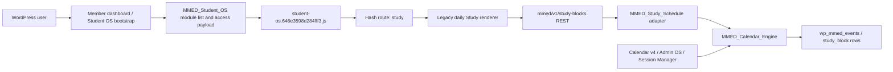

# V1 Study Schedule — Current Architecture

## Observed source flow

`missionmed-hub.php` loads the shared engines and controllers. Student OS emits
module and access configuration, enqueues a monolithic hashed shell, and uses
hash routing. The legacy Study renderer calls shared REST routes that translate
Study payloads into Calendar events.

The actual WordPress table prefix is environment-specific; `wp_mmed_events` is
the conventional expansion of `$wpdb->prefix . 'mmed_events'`.

## Current components

| Layer | Current state | Ownership problem |
|---|---|---|
| Bootstrap | Shared `missionmed-hub` plugin and MU-plugin load order | High blast radius; no dedicated V1 package |
| Route | Student OS module key/hash `study` | Client-side temporary lock, no V1-specific permission contract |
| Client state | Date, day blocks, week blocks, loading | No mission, week aggregate, revisions, sessions, reserve, recovery, or settings |
| UI | Daily hour rows plus seven-day buttons and create panel | Does not implement D9-300 canvas or complete V1 surfaces |
| REST | Shared `mmed/v1` routes for list/create/update/delete | Permission is generic login; mutations lack Study type proof |
| Adapter | `MMED_Study_Schedule` | Converts partial payloads to shared Calendar events and can replace metadata |
| Persistence | Calendar-owned `mmed_events` | Wrong canonical owner for V1; multiple writers |
| Identity | WordPress current user ID | Program/course/mentor context not defined for V1 |
| Entitlement | Client temporary-open list and generic server login | Populations disagree; no fail-closed Study predicate |
| Assets | Active content-hashed monolithic Student OS JS plus shared CSS; active hashed path is not inventoried by the global lock/passport | V1 changes would otherwise touch a large protected surface with an existing governance gap |
| Tests | No production Study suite | Only syntax and prototype behavior evidence |
| Telemetry | No V1 event vocabulary found | No route/mutation/conflict/performance visibility |

## Current data shape

A Study block is merely a projection of a Calendar event. Its REST response
contains numeric `id`, title, subject, notes, start/end, derived duration, status,
completed, category, and the nested original Calendar event. The backing row
contains shared Calendar fields such as recurrence, meeting data, source,
category, status, and one JSON metadata object.

This model cannot safely express V1's versioned Week, operations, session
actuals, reserve provenance, recovery lineage, mentor suggestions, immutable
anchors, or deterministic closeout.

## Current mutation hazards

1. Update/delete accept an ID and delegate to generic Calendar mutation without a
   local `event_type=study_block` assertion.
2. A completion-only payload creates a new small metadata object, risking loss of
   existing metadata.
3. Shared Calendar writers can create or transform `study_block` independently.
4. No optimistic revision or idempotency key prevents lost or duplicated work.
5. Datetimes are naive and processed through mixed PHP date functions.
6. The database installer runs from shared engine initialization rather than a
   V1 migration boundary.

## Runtime state

The current public hashed client asset is source-identical. The public
unversioned asset differs. Recovered controller source references the hashed
asset, but current live PHP/controller behavior was not read, so the executing
descriptor is source-inferred rather than verified. The global lock inventories
only the unversioned source twin and the stale Matrix passport omits the active
hashed path. The runtime manifest also does not define a V1 Study asset, app
mode, route, or rollback unit. Therefore source provenance is strong while
runtime governance and product readiness are weak.
