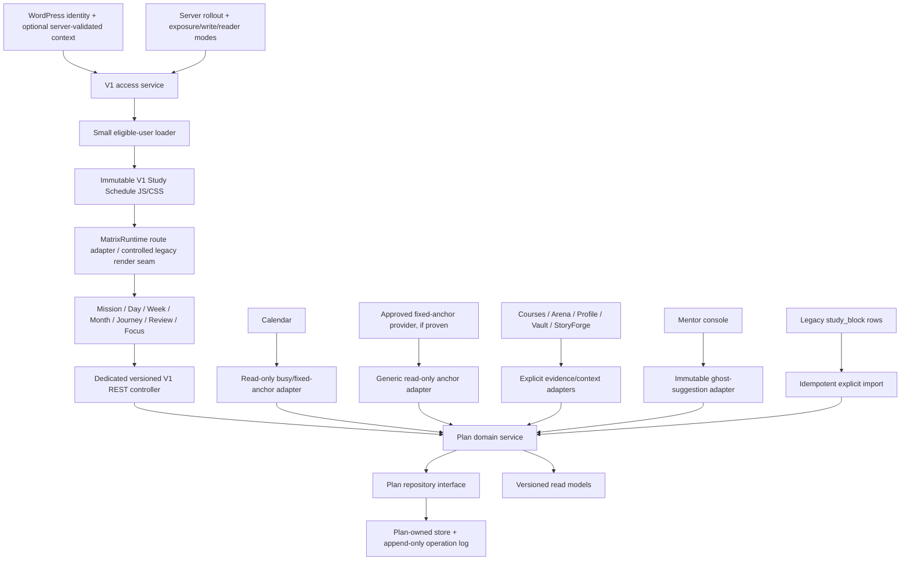

# V1 Study Schedule — Target Architecture

## Architectural decision

Evolve through a **strangler module**, not a rewrite of Student OS and not an
expansion of legacy `study_block` CRUD. Before any V1 write, the old panel can
remain a rollback surface and explicit import source. After a learner's first V1
write or import, it may remain only as noncanonical read-only history; it cannot
become that learner's mutable fallback.

## Target domain

The minimum V1-owned canonical domain is:

- Week and Block
- Series and detached exception
- Reserve item
- Recovery decision
- Focus session and actual
- Review/closeout record
- Mentor ghost suggestion and learner response
- Append-only operation with actor, provenance, idempotency key, and revision

Stable UUIDs identify V1 objects. Planned time, actual time, and external evidence
remain distinct. Tombstones preserve delete history. Every write is atomic and
revision-checked.

WordPress owns actor identity. Profile owns runway/exam dates, chronotype,
program targets, cohort, and mentor assignment. V1 may store versioned effective
snapshots and explicit replan decisions without taking ownership of those source
facts. Goal field ownership, Plan-context partitioning, and Plan-settings
physical/semantic ownership remain V1-8010A decisions; a V1 settings service is
only a recommendation.

## Physical persistence gate

A Plan-owned WordPress store behind a repository interface is the recommended
default because WordPress user identity is already authoritative and no
Supabase project is approved. This is **not yet a constitutional selection**.
V1-8010A must record the physical data-plane decision before a migration is
authored.

Regardless of the physical store:

- Calendar rows are not canonical Plan rows.
- Existing diagnostic `study_plans`/`tasks` tables are not reused.
- One repository is the only Plan writer.
- Schema is additive and versioned.
- Data remains in place during code rollback.
- The selected engine and deployment path must prove transactional capability,
  isolation behavior, and recoverable failure semantics before the first schema
  migration.
- Idempotency keys and revision transitions use database uniqueness constraints,
  not application checks alone.
- A concurrent installer/migration lock, failure-injection tests, forward-
  compatible schema/version contract, and snapshot/compaction rules are required.
- The first Plan operation/import and the learner cutover watermark commit in the
  same transaction.

## Route and asset seam

Do not edit `student-os.646e3598d284fff3.js` in place.

1. The protected Student OS controller emits permission, immutable asset
   descriptors, route configuration, and a small compatible reader/loader for
   entitled users according to a server-derived exposure mode.
2. The loader registers with `window.MatrixRuntime` when Runtime-v2 is present,
   otherwise safely replaces `MMED_OS.render.study`.
3. The loader handles the race in which the shell initializes before route
   registration.
4. V1 assets use content hashes and a dedicated app-mode body class.
5. Exposure, write permission, and reader compatibility are separate controls;
   one boolean flag cannot implement rollback.
6. Before cutover, `LEGACY_PRECUTOVER` leaves the existing shell and legacy route
   unchanged. Normal V1 operation uses `V1_ACTIVE_READ_WRITE`. A kill switch or
   rollback after a write/import watermark selects `V1_DEGRADED_READ_ONLY`,
   retaining a minimal compatible reader while denying both V1 and legacy
   mutations. `V1_HIDDEN` is valid only for users with no V1 truth.
7. The reader supports current and N-1 additive schema versions. A post-cutover
   rollback cannot restore `d4455bf` alone because that package cannot read V1
   Plan data.

## Access model

One server access service returns a structured, fail-closed context, but four
decisions remain distinct:

1. authenticated actor identity;
2. product entitlement;
3. rollout exposure;
4. action, resource, ownership, and field authorization.

Navigation and asset loading consume entitlement plus rollout exposure. Every
REST operation authenticates the actor and validates its nonce, enforces
entitlement/rollout/action permission, queries only through a learner-scoped
repository, and then enforces resource/field authorization on the scoped result.
Unknown or unauthorized IDs follow one non-enumerating response policy.
Administrators are audit-only for learner Plan data; they cannot mutate a
learner's blocks, accept an import, or impersonate a learner. All mutation pilots
run under explicit learner principals. V1-8010 uses only staging test identities.
Production learner cohorts belong exclusively to V1-8040 after V1-8020/8030.
A rollout flag never substitutes for entitlement or action authorization.

## Adapter boundaries

| Adapter | Direction | Allowed effect |
|---|---|---|
| Calendar | Inbound busy/fixed anchors; optional marked export | Never writes canonical Plan state |
| Approved fixed-anchor provider | Inbound immutable anchor only after direct dependency approval | Generic seam; appointment systems remain outside V1-8010 unless necessity is proven |
| Legacy Study | Explicit idempotent import | No automatic dual-write |
| Courses/Arena | Inbound context/outcome evidence | May propose, never silently complete |
| Mentor | Inbound ghost suggestion | Learner accept/reject/negotiation operation required |
| Profile | Read Profile-owned context/preferences through a contract | Plan-settings ownership remains undecided; no hidden writes |
| Vault/StoryForge | Optional links/evidence | Failure degrades locally |
| Shell/pill | Route and current-session projection | Session source remains V1 service |

Every inbound adapter uses an equivalent of
`{sourceSystem, sourceObjectId, sourceVersion, eventId, occurredAt, kind}`.
Consumers deduplicate replay, reject stale/out-of-order versions, and reconcile
move, cancellation, deletion, and tombstone events. A Calendar export carries an
immutable V1 projection marker and is excluded from inbound busy/import
processing so V1 cannot re-import its own projection.

Mentor payloads are server-filtered to assigned learners and `mentorVis=true`
fields. Minute-level actuals require learner opt-in. Suggestions carry mandatory
reason, author/assignment provenance, created/withdrawn versions, compare-and-
swap resolution, and a defined withdrawal-versus-accept conflict rule.

## Performance budgets

- Loader: <=5 KB gzip.
- Initial route JS: <=150 KB gzip, target <=100 KB.
- Study CSS: <=60 KB gzip, target <=40 KB.
- Incremental V1 JS+CSS+loader: <=215 KB gzip; measure complete-page totals too.
- Cold direct `#study`: <=1.5 MB total transferred and <=1.0 MB parsed JS;
  warm in-shell navigation is measured separately.
- Bootstrap response: <=250 KB compressed; initial usable Week <=20 database
  queries and a mutation <=8, with query budgets enforced in CI.
- No more than three requests to first usable Week; prefer one bootstrap response.
- Cached route usable <=1.5 seconds after shell navigation.
- Cold direct-navigation p75 LCP <=2.5 s; warm SPA route-ready <=1.5 s;
  p75 INP <=200 ms and CLS <=0.1.
- Staging read p95 <=500 ms; mutation p95 <=750 ms.
- The large-data fixture includes at least 104 weeks, 5,000 blocks, 20,000
  operations, and 500 Journey items. The usable view stays <=2,500 DOM nodes,
  produces no task >200 ms and at most two initialization tasks >50 ms, shows
  <5% retained-heap growth across 20 mount/unmount cycles, and performs no
  background polling.
- Incremental and total transferred/parsed bytes, query count, long tasks,
  memory, DOM nodes, unmount/leak behavior, and performance budgets are enforced
  in CI and staging.

## Phase-aware rollback model

- **Before any V1 write/import:** disable the flag and restore the prior
  controller/plugin package; the legacy route may resume because no Plan truth
  exists.
- **After a V1 write/import:** the watermark is created atomically with the first
  Plan operation. Select `V1_DEGRADED_READ_ONLY`, stop all V1 and legacy
  mutations, and serve a truthful compatible V1 view/export. Do not expose
  mutable legacy planning to migrated learners unless a separately approved and
  tested reverse-conversion contract exists.
- Keep the minimal current/N-1 reader deployable independently of the full V1
  application. Rehearse reader/package/schema compatibility before any staging
  pilot write and again on the exact V1-8030 release-candidate digest.
- Preserve Plan tables, operations, snapshots, and audit evidence. Dropping
  tables is not rollback.
- Verify user-visible continuity, the hashed shell, authentication, navigation,
  unrelated Matrix modules, and absence of a second writable truth.
