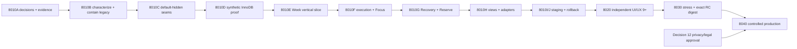

# V1 Study Schedule 8010A — Full Complete Combined Handoff

Generated deterministically by `V1_8010A_BUILD.py`. Every final Markdown deliverable is embedded verbatim; this file excludes itself.

<!-- BEGIN EMBEDDED FILE: V1_8010A_AUTHORIZATION_RECORD.md -->

# V1-8010A Authorization Record

## Governing authority

Brian authorizes `V1-STUDY-SCHEDULE-8010A` as the governing mission for this
worktree despite the absent MissionMed_OS mission and unrelated `CURRENT.md`.
MissionMed_OS remains read-only. Its stale or incomplete registry is recorded
drift, not a stop condition.

Routine reversible source, protected-file, schema, branch, commit, push, PR,
staging, flag, cache, deployment, and controlled-rollout work is authorized when
required by the staged execution loop and protected by verified rollback.

## Conditions on that authority

- Work must be strictly necessary for V1 Study Schedule inside Matrix.
- Existing bootstraps, authentication, entitlement, routes, and unrelated apps
  must be preserved and regression-tested.
- Student-data changes must be additive, backed up, tested, observable, and
  rollback-capable.
- Rollout must be fail-closed, cohort-controlled, observable, and reversible.
- No secret, student content, password, token, or private data may enter Git,
  reports, screenshots, commands, or task output.
- MissionMed_OS may not be rewritten, stashed, reset, merged, or otherwise
  altered.
- Unrelated appointment, Webex, Calendar-product, CAM-product, RankListIQ,
  credential, and MissionMed_OS work remains excluded unless a direct V1
  dependency is proved.

## Remaining valid stops

The authorization does not decide money, legal/privacy policy, destructive
deletion, unrecoverable loss, irreversible third-party confirmations, or
mutually exclusive founder product decisions. Those remain genuine stops at
the affected gate. Routine engineering uncertainty is not a stop.

## Applied scope

This record authorizes the V1-8010A decision and evidence set and the later
reversible implementation pipeline. It does not itself assert that any release
gate has passed.

<!-- END EMBEDDED FILE: V1_8010A_AUTHORIZATION_RECORD.md -->

<!-- BEGIN EMBEDDED FILE: V1_8010A_PRODUCT_IDENTITY_LEDGER.md -->

# V1-8010A Product Identity Ledger

| Field | Governing value |
|---|---|
| Product | **V1 Study Schedule** |
| Purpose | Learner academic study planning and execution |
| Historical aliases | Matrix Plan; Study Schedule; Study Scheduler; D9 Matrix Plan |
| Historical visual foundation | D9-300 Matrix Plan execution canvas |
| Not this product | MissionMed Scheduler; Appointment Scheduler; Calendar; Webex Scheduler |

Every file containing “scheduler” must be classified by content and ownership.
A filename alone is never product evidence. New records, code identifiers,
routes, and user-facing copy use **V1 Study Schedule**; historical evidence
retains its immutable original names.

<!-- END EMBEDDED FILE: V1_8010A_PRODUCT_IDENTITY_LEDGER.md -->

<!-- BEGIN EMBEDDED FILE: V1_8010A_DECISION_LEDGER.md -->

# V1-8010A Decision Ledger

Filing a decision closes ambiguity; it does not waive the acceptance conditions
inside that decision.

| # | Decision | Filed status | Release effect |
|---:|---|---|---|
| 01 | Product and authority | Accepted | D9-300 foundation; explicit V1 rulings govern contradictions |
| 02 | Product-input durability and rights | Engineering accepted | Raw corpus/quotes remain out of public release |
| 03 | Implementation home | Accepted | Isolated V1 branch and revertible stacked slices |
| 04 | One canonical writer | Accepted | V1 command repository only |
| 05 | Physical store/data plane | Conditional selection | InnoDB capability, migration, backup/restore proof required |
| 06 | Identity/context | Accepted | WordPress owner; context descriptive and versioned |
| 07 | Authentication/360 entitlement | Accepted | Fail closed; administrators audit-only |
| 08 | Temporal law | Accepted | Instant + IANA zone + local intent + fold/policy |
| 09 | Legacy/import | Accepted | Explicit one-way CAS import; atomic cutover watermark |
| 10 | Completion/adapters | Accepted | Learner command owns verdict; adapters evidence/proposals only |
| 11 | Settings/content | Accepted | Server canonical; sound off; reduced motion; quotes disabled |
| 12 | Retention/history/privacy | Implementation boundary accepted | Real-learner and production legal/privacy hold |
| 13 | Flag/release/cutover | Accepted | Four explicit modes; exact-digest staged release |
| 14 | Runtime lock | Accepted with pre-edit correction | Normalize controller drift and register protected assets |

## Independent-verification result

Herschel verified corpus integrity and the physical-store boundary. Avicenna
corrected temporal, import, adapter, and behavioral ambiguities. Lorentz
verified authority, identity, entitlement, release-mode, privacy, and runtime
boundaries. Darwin then produced the incremental sequence and rollback model.
The supervisor independently checked load-bearing repository, manifest, corpus,
archive, and runtime evidence before accepting these records.

## Go state after filing

Pure domain/UI code, default-hidden seams, and synthetic-data test work may
begin. Protected controller work waits for Decision 14 normalization. Physical
schema application waits for Decision 05 capability proof. Real learner data,
cohort exposure, and production wait for Decision 12 approval plus all quality
and release gates.

<!-- END EMBEDDED FILE: V1_8010A_DECISION_LEDGER.md -->

<!-- BEGIN EMBEDDED FILE: V1_8010A_DECISION_01.md -->

# V1-8010A Decision 01 — Product and Authority

**Status:** ACCEPTED

## Decision

The product is V1 Study Schedule. D9-300 is the visual and interaction
foundation. D9-350 is the behavioral authority where internally consistent;
the explicit V1-8010A rulings in Decisions 08–13 supersede its contradictions.
D9-360 is refinement and test evidence, not self-ratifying production authority.

The implementation foundation is repository commit
`d4455bf4ee401eaa8b074603497eb9fcd6eb04a0`; V1-8000 reconciliation commit
`c988666eb35a108674508830e5555f09c28607b3` is evidence layered on that base.
Observed production is runtime evidence only and cannot silently override the
product law.

## Rejected authorities

- the current legacy Calendar-backed `#study` panel as product specification;
- `mmed_events` as Plan ownership;
- a prototype’s localStorage or mock write-back;
- D9-360 self-scores;
- appointment/Webex Scheduler source;
- MissionMed_OS `CURRENT.md` for this founder-authorized mission.

## Verification

Independent source, behavior, and boundary reviewers agreed on this hierarchy.
The product identity ledger is mandatory in every later handoff.

## Rollback consequence

Any slice that diverges from D9-300 language or an explicit V1 behavior ruling
must be reverted or re-adjudicated before it can become a release candidate.

<!-- END EMBEDDED FILE: V1_8010A_DECISION_01.md -->

<!-- BEGIN EMBEDDED FILE: V1_8010A_DECISION_02.md -->

# V1-8010A Decision 02 — Product-Input Durability and Rights

**Status:** ACCEPTED FOR ENGINEERING; CONTENT-RIGHTS RELEASE HOLD

## Decision

The accepted historical corpus comprises 75 files and 2,006,500 bytes across
D9-100, D9-200, D9-300, D9-350, and D9-360. Its exact relative paths, sizes, and
SHA-256 digests are tracked in the accepted-input manifest. The two historical
source trees are byte-identical.

A sealed archive exists outside the public repository at
`/Users/brianb/MissionMed_Backups/V1_STUDY_SCHEDULE_8010A/` with mode `0600`,
SHA-256 `c2584123205b47e4566d51b3a0f88cf850df509bfd2c0bdb9b8915b683f22c01`,
and a successful extract-and-`diff -qr` restore test. It is a local restoration
copy; an approved off-device private custody copy remains required before the
original local evidence may be retired.

Raw historical bytes are not copied into the public Git repository. Integrity,
attribution, and a status label do not establish publication rights. Quote
reuse and external-font dependencies remain disabled until authoritative source,
attribution, license/content rights, and distribution approval are recorded.

## Verification

The read-only scan found no high-confidence secrets, credential literals,
private keys, JWTs, emails, phone numbers, or assigned student records. The
quote seed contains 24 entries but no general license grant; only a subset has
public-domain markings. No raw quote text is present in this record.

## Release condition

The core planner may proceed without quotes. Public distribution of historical
content cannot proceed from this decision alone.

<!-- END EMBEDDED FILE: V1_8010A_DECISION_02.md -->

<!-- BEGIN EMBEDDED FILE: V1_8010A_DECISION_03.md -->

# V1-8010A Decision 03 — Implementation Home

**Status:** ACCEPTED

## Decision

The canonical repository is `brinyu13/missionmed-hq`. V1-8010A work occurs in:

- worktree: `/Users/brianb/MissionMed_worktrees/V1-StudySchedule-8010A`;
- branch: `codex/v1-study-schedule-8010a`;
- evidence parent: `c988666eb35a108674508830e5555f09c28607b3`;
- immutable application foundation: `d4455bf4ee401eaa8b074603497eb9fcd6eb04a0`.

Draft V1-8000 PR #10 remains reconnaissance-only. V1-8010A decision records and
each implementation slice use separately revertible commits/stacked branches.
No recovered D9 branch is edited, rebased, or rewritten.

## Long-lived destination

Until the V1-8000 evidence PR is accepted, V1-8010A is stacked on the
`codex/v1-study-schedule-8000` evidence tip. Each later PR targets the previously
accepted V1 integration tip. Promotion to the release branch occurs only through
reviewed, exact-digest commits.

## Verification and rollback

`git status` was clean when the branch/worktree was created. A slice may be
reverted independently; history rewriting and cross-worktree cleanup are
forbidden.

<!-- END EMBEDDED FILE: V1_8010A_DECISION_03.md -->

<!-- BEGIN EMBEDDED FILE: V1_8010A_DECISION_04.md -->

# V1-8010A Decision 04 — One Canonical Writer

**Status:** ACCEPTED

## Decision

The V1 command service and its repository are the only writers of canonical
Plan state. Calendar, legacy Study rows, Admin OS, Session Manager, Courses,
Arena, StoryForge, Vault, Profile, mentors, appointment systems, adapters, and
browser storage cannot write Plan tables directly.

Imports, evidence, mentor proposals, focus sessions, UI actions, and external
outcomes enter through versioned V1 commands with actor, learner owner,
idempotency key, expected revision, provenance, and an atomic operation record.
Read models are rebuildable projections, never a second truth.

## Forbidden shortcuts

- dual-write to Calendar and Plan;
- silent completion from an external outcome;
- mutable localStorage authority;
- admin impersonation;
- restoring mutable legacy behavior after a learner’s V1 cutover watermark.

## Verification

Architecture tests must prove that no adapter has table-write credentials or a
repository bypass. Rollback preserves Plan data and disables both writers after
cutover.

<!-- END EMBEDDED FILE: V1_8010A_DECISION_04.md -->

<!-- BEGIN EMBEDDED FILE: V1_8010A_DECISION_05.md -->

# V1-8010A Decision 05 — Physical Store and Data Plane

**Status:** ACCEPTED CONDITIONALLY; MIGRATION REQUIRES CAPABILITY PROOF

## Decision

V1 selects additive, Plan-owned WordPress/InnoDB tables behind one repository
interface. It will not reuse Calendar-owned `wp_mmed_events`, diagnostic
`study_plans`/`tasks`, or an unapproved Supabase project.

The schema separates learner Plan identity/cutover, scheduled obligations,
append-only operations, focus/actual facts, external evidence, mentor proposals,
settings, and review records. Stable UUIDs identify domain objects. Database
constraints—not application prechecks alone—enforce owner-scoped uniqueness,
idempotency, lineage, and revision transitions.

## Required migration protocol

- explicit `ENGINE=InnoDB` and supported isolation characterization;
- a dedicated versioned migration runner, never `dbDelta`;
- database migration lock and concurrent-installer rejection;
- additive, restartable steps with recorded checksums;
- injected failure recovery without assuming transactional DDL;
- backup/export/restore proof before each protected application;
- current/N-1 reader compatibility;
- synthetic two-user isolation, uniqueness, retry, and atomic-watermark tests;
- no table drop as rollback.

The first V1 operation/import and learner cutover watermark commit atomically in
one DML transaction. Until the capability test passes, repository and domain
code use synthetic fixtures only and no production schema is applied.

## Authority boundary

The founder’s V1-8010A authorization covers additive, backed-up, tested,
rollback-capable schema work. Gate 12 independently blocks real learner data
until privacy/retention policy is approved.

<!-- END EMBEDDED FILE: V1_8010A_DECISION_05.md -->

<!-- BEGIN EMBEDDED FILE: V1_8010A_DECISION_06.md -->

# V1-8010A Decision 06 — Identity and Context

**Status:** ACCEPTED

## Decision

WordPress user ID is the authenticated actor key and learner-owner key. V1 Plan
UUID is the stable product aggregate identifier. Program, course, cohort,
runway/exam, chronotype, targets, and mentor assignment remain facts owned by
their existing systems.

V1 may store a versioned, server-derived context snapshot plus provenance for
replanning and historical explanation. Context is descriptive; it is never a
client-selected ownership partition or an authorization grant. Unknown context
must degrade safely without changing the learner owner.

Mentor and administrator actors remain distinct principals and cannot
impersonate learners. Every command records actor and learner owner separately.

## Verification

Required tests cover two learners, one mentor with and without assignment, an
administrator, stale context, changed course membership, and non-enumerating
foreign-object denial.

<!-- END EMBEDDED FILE: V1_8010A_DECISION_06.md -->

<!-- BEGIN EMBEDDED FILE: V1_8010A_DECISION_07.md -->

# V1-8010A Decision 07 — Authentication, 360 Entitlement, and Authorization

**Status:** ACCEPTED

## Decision

V1 access is fail-closed and keeps four independent decisions:

1. authenticated WordPress actor;
2. verified 360 product entitlement;
3. rollout exposure/mode;
4. action, resource-owner, assignment, and field authorization.

The existing `mmhq_cam_build_entitlement()` behavior may be characterized and
normalized as evidence for a V1-specific 360 claim. V1 does not inherit CAM
product semantics or CAM’s administrator override. Access requires active,
trusted, current-access-verified, revocation-checked, unexpired, unrestricted
evidence under the already accepted purchase/current-legacy authority mode.

Administrators receive an explicit audit-only V1 surface and cannot create,
edit, import, complete, or impersonate a learner. Eligible 360 learners mutate
only their own resources. Mentors receive only assignment-scoped,
server-filtered proposal access.

## Non-authorities

Generic Matrix access, program tier alone, any-course enrollment, client flags,
administrator status, and rollout exposure do not grant learner V1 access.
Changing qualifying products/courses or legacy-without-purchase treatment is a
money/entitlement decision outside this record.

## Verification

Every REST action requires nonce/CSRF validation, entitlement, rollout, action,
owner/assignment, and field checks. Denials are non-enumerating. Required tests
cover admin-negative mutation, forged IDs, foreign ownership/type, revoked and
expired claims, stale claims, and direct endpoint access with navigation hidden.

<!-- END EMBEDDED FILE: V1_8010A_DECISION_07.md -->

<!-- BEGIN EMBEDDED FILE: V1_8010A_DECISION_08.md -->

# V1-8010A Decision 08 — Temporal Law

**Status:** ACCEPTED

## Canonical temporal representation

Every scheduled occurrence stores:

- a UTC instant;
- IANA timezone;
- learner-local date/time intent;
- temporal-policy version;
- explicit fold choice for ambiguous local time;
- source/provenance and fixed-versus-flexible classification.

The learner Week begins Monday 00:00 in the learner-profile zone. The
06:00–24:00 canvas is a display window, not the civil-day boundary. A
cross-midnight Focus session belongs to the block’s start-day ledger while its
persisted segments retain exact instants.

## Zone changes and recurrence

Historical actuals, closeouts, Review records, and streak day keys never change
when a profile zone changes. Future flexible learner blocks preserve their local
wall-time intent in the new profile zone and rederive the instant. Future fixed
or external anchors preserve the versioned source instant and source zone.
Recurrence expands from local intent and policy, never by adding 24 hours in
UTC.

A nonexistent DST-gap input is rejected with a valid-slot suggestion. An
ambiguous fold requires an explicit earlier/later choice and is never guessed.

## Required proof

Property and integration tests cover spring gap, fall fold/both choices,
Monday/week boundaries in multiple zones, cross-midnight Focus and closeout,
zone change before/after closeout, recurrence across DST, fixed-anchor reimport,
and invariant historical streak keys. Naïve Calendar datetime values receive no
V1 temporal credit.

<!-- END EMBEDDED FILE: V1_8010A_DECISION_08.md -->

<!-- BEGIN EMBEDDED FILE: V1_8010A_DECISION_09.md -->

# V1-8010A Decision 09 — Legacy Study Import and Cutover

**Status:** ACCEPTED

## Decision

Legacy Calendar Study rows are source evidence only. They are never V1 Plan
storage and are never automatically dual-written. Import is explicit,
learner-authorized, one-way, idempotent, and previewed before commit.

Eligibility requires exact learner owner, governed Study event type, source
namespace, source object ID/version, and approved metadata. A preview token
binds learner, event type, source version/hash, selected rows, expiry, and the
current Plan revision. Commit revalidates all predicates atomically, then creates
V1 UUID/revision/lineage facts without mutating legacy rows.

Database uniqueness on
`(source_system, source_object_id, source_version, learner_id)` prevents
duplicates. Missing, moved, changed, deleted, reordered, foreign-owner, and
foreign-type rows invalidate the preview. V1 projections carry an immutable
origin marker and are excluded from inbound import/busy processing.

## Cutover and rollback

Before the watermark, legacy may remain separately active. The first V1
operation/import and learner cutover watermark commit atomically; afterward V1
is the only writer. Rollback enters V1 degraded read-only and never restores a
second mutable legacy truth. Source deletion yields a versioned tombstone/evidence
event and does not erase imported history.

Only the learner principal with full V1 access may commit import. Administrators
are audit-only.

## Required proof

Tests cover duplicate/retry/concurrency, preview drift/expiry/forgery, owner/type
substitution, source move/update/delete, foreign-event integrity, export echo
suppression, every failure boundary, pre/post-watermark writer denial,
current/N-1 reading, and data-preserving rollback.

<!-- END EMBEDDED FILE: V1_8010A_DECISION_09.md -->

<!-- BEGIN EMBEDDED FILE: V1_8010A_DECISION_10.md -->

# V1-8010A Decision 10 — Completion, Execution, and Adapters

**Status:** ACCEPTED

## Canonical command boundary

Only a learner-authorized V1 command may complete, partially resolve, move,
reserve, release, or recover Plan work. Courses, Arena, StoryForge, Vault,
Calendar, mentor systems, and other adapters contribute evidence or proposals
only.

Inbound evidence carries source system/object/version, event ID,
occurred/received timestamps, kind, tombstone/retraction state, and payload
schema version. Replay, stale, reordered, conflicting, or retracted evidence
cannot mutate canonical completion. External evidence, learner verdict,
actual-time fact, and adapter-delivery state remain separate. Outbound delivery
is idempotent and its failure never rolls back a valid local learner operation.

Mentor suggestions are immutable proposals with reason, author, assignment
scope, privacy filtering, withdrawal revision, and compare-and-swap learner
resolution. Adapter absence degrades locally.

## Behavioral rulings

### Partial and release

- Governed work quantity is conserved; rounded planned minutes are not proof.
- A partial source becomes a terminal historical parent and its remainder is a
  distinct lineage child.
- An accepted remainder disposition removes the parent from closeout triage;
  an active same-day child gates closeout independently.
- Undo is a lineage-aware compensating operation and conflicts after
  incompatible child changes.
- `skipped` is nonterminal. Every release requires a governed reason.
- A learner-authored 0% attempt may derive `attempted_no_progress`; captured
  attempt time survives and the released object cannot be silently resurrected.

### Ghosts and group acceptance

- Add: use a valid gap, otherwise Reserve with provenance.
- Move: move the existing obligation to a valid gap or atomically to Reserve.
- Resize: use a valid same/fallback slot; otherwise remain pending
  `needs_placement` with no Plan mutation.
- Defer: atomically move the existing obligation to Reserve.
- Missing target: withdraw/conflict; never accept.
- Modify: create an isolated learner draft; a separate save changes Plan.
- A group uses one tentative final Plan, one transaction, one operation, and one
  compensating undo. Any nonrecoverable member failure aborts all members.

### Recovery, Reserve, streaks, and actuals

- Recovery conserves exact work quantity; minute compression is a separate
  estimate change; true scope reduction is an explicit release.
- Reserve uses stored learner-visible order. It chooses the first item fitting
  both displayed flexible-capacity budget and a collision-free future slot
  after now, respecting fixed anchors, protected rest, and horizon. No hidden
  historical multiplier applies. No fit recommends closeout; placement
  revalidates revision/capacity/slot.
- Rest, quiet, and pause preserve continuity but do not increment
  `resolved_work_days_current`; unresolved closeout resets it. Milestones derive
  only from resolved work days and are delivered once per run.
- Actual duration provenance is `timer`, `learner_entered`, or
  `assumed_planned`. Zero is valid. Timer segments persist even if no outcome is
  chosen, sum once by unique IDs, and only timer-derived minutes may be labeled
  focused work.

## Required proof

Contract/property suites cover replay/reorder/tombstone, conservation and
lineage, two-tab races, mentor accept/withdraw, group failure, adapter outage,
Reserve capacity, streak sequences, actual provenance, crash recovery, and
read-model rebuild. No adapter may write Plan tables directly.

<!-- END EMBEDDED FILE: V1_8010A_DECISION_10.md -->

<!-- BEGIN EMBEDDED FILE: V1_8010A_DECISION_11.md -->

# V1-8010A Decision 11 — Settings and Governed Content

**Status:** ACCEPTED

## Decision

V1 owns versioned Study-specific settings through its repository. Server state
is canonical; browser storage is a recoverable cache only. Defaults and every
migration are versioned.

- Sound defaults off.
- Motion obeys operating-system reduced-motion and cannot override it.
- Settings failure falls back to safe defaults without enabling sound, motion,
  sharing, or writes.
- Privacy consent, mentor visibility, notifications, and retention are separate
  versioned policy/consent records, not generic preferences.
- Quotes remain disabled until governed content rights and attribution pass
  Decision 02.

If quotes are later enabled, one learner-local daily assignment is reused across
surfaces. No quote repeats before a 45-day local-date difference; day 44 is
ineligible and day 45 eligible. Exhaustion omits the module with
`cooldown_exhausted`; the cooldown is never relaxed and favorites do not bypass
it. This ruling supersedes conflicting D9-350 reset/oldest-first behavior.

## Verification

Tests cover default migration, corrupt cache, concurrent tabs, reduced-motion,
sound consent, day 44/45, exhaustion, context suppression, and single daily
assignment. No raw quote content is required for the core release.

<!-- END EMBEDDED FILE: V1_8010A_DECISION_11.md -->

<!-- BEGIN EMBEDDED FILE: V1_8010A_DECISION_12.md -->

# V1-8010A Decision 12 — Retention, History, Privacy, and Deletion

**Status:** IMPLEMENTATION BOUNDARY ACCEPTED; REAL-LEARNER RELEASE HOLD

## Decision

No retention value is invented in engineering. “Permanent” retention is
prohibited. The implementation may create explicit data classifications,
policy-version fields, export/delete/anonymize interfaces, consent boundaries,
and synthetic-fixture tests, but it may not activate destructive expiry jobs or
collect real learner Plan/behavior data until an approved policy defines:

- purposes and explicit windows for operations, current Plan, Review records,
  aggregates, evidence, mentor suggestions/responses, and telemetry;
- mentor-visible fields and whether minute-level actuals require opt-in;
- account deletion versus audit/tombstone preservation;
- export scope and identity verification;
- backup retention and deletion propagation;
- notice/consent requirements for study-behavior analytics.

## Safe defaults before policy approval

- synthetic identities/data only outside production;
- mentor private notes and minute-level actual sharing disabled;
- no learner-content telemetry or logs;
- no automated destructive deletion/anonymization;
- no unmanaged production copies;
- staging cleanup uses synthetic-fixture teardown and recorded verification;
- quotes remain separately gated by Decision 02.

## Effect on the execution loop

This hold does not block pure domain code, fixture UI, default-hidden access and
repository seams, local/synthetic migration proofs, accessibility, responsive,
performance, security, rollback, or package work. It blocks real-student import,
real-learner staging/production collection, production telemetry, destructive
retention jobs, cohort exposure, and production deployment until privacy/legal
approval is attached to this record.

This is the mission’s current genuine legal/privacy stop; routine engineering
must continue independently.

<!-- END EMBEDDED FILE: V1_8010A_DECISION_12.md -->

<!-- BEGIN EMBEDDED FILE: V1_8010A_DECISION_13.md -->

# V1-8010A Decision 13 — Release Modes, Flags, and Cutover

**Status:** ACCEPTED

## Canonical modes

| Mode | V1 exposure/read | V1 writer | Legacy writer |
|---|---|---|---|
| `LEGACY_PRECUTOVER` | Off | Denied | Existing behavior allowed; no V1 watermark |
| `V1_ACTIVE_READ_WRITE` | Current V1 reader | V1 only | Denied |
| `V1_DEGRADED_READ_ONLY` | Current/N-1 reader | Denied | Denied |
| `V1_HIDDEN_NO_TRUTH` | Hidden | Denied | Existing behavior may remain only if no V1 watermark exists |

Entitlement, exposure, write mode, and reader compatibility are separate
server decisions. A boolean feature flag cannot represent this state machine.
The first V1 operation/import and cutover watermark commit atomically.

## Progression

All source ships default-off. Visible staging requires fail-closed entitlement,
learner-principal proof, synthetic data, and rollback readiness. V1-8020 must
independently achieve UI and UX scores of at least 9.0/10. V1-8030 freezes the
exact tested release-candidate digest; any byte change invalidates it. V1-8040
performs controlled cohort rollout only after every release gate, including
Decision 12, passes.

The governing authorization already covers ordinary reversible flag, cohort,
cache, deploy, and rollback actions; no redundant founder prompt is required.
It does not authorize skipping quality, privacy, exact-digest, or rollback gates.

## Stop/rollback

On authorization leakage, foreign mutation, dual writers, persistence drift,
runtime-hash mismatch, restore failure, P0/P1 defect, or cross-app regression,
deny both writers and enter `V1_DEGRADED_READ_ONLY` for any learner with V1
truth. Pre-watermark users may return to legacy.

<!-- END EMBEDDED FILE: V1_8010A_DECISION_13.md -->

<!-- BEGIN EMBEDDED FILE: V1_8010A_DECISION_14.md -->

# V1-8010A Decision 14 — Matrix Runtime Lock and Protected Delivery

**Status:** ACCEPTED; CONTROLLER DRIFT MUST BE NORMALIZED BEFORE PROTECTED EDIT

## Corrected runtime evidence

The global Matrix runtime lock **does** govern the active fingerprinted Student
OS bundle through asset key `student_os_js`:

| Field | Value |
|---|---|
| Source path | `assets/student-os.js` |
| Production/runtime path | `assets/student-os.646e3598d284fff3.js` |
| Approved SHA-256 | `646e3598d284fff31d22dec98c70c1800e74743276872bb65f1afeeda1c17e5a` |

Contrary V1-8000 statements are superseded by this decision. The authenticated
administrator route `/member-dashboard/#study` is verified as the legacy
Calendar-backed view, not V1. Eligible-learner behavior remains unverified.

The guard is green for every declared public JS/CSS asset and exits `42` only
because `class_mmed_student_os_php` is approved at `c0a538…` while recovered,
origin, and observed runtime bytes are `23da5c…`. This provenance drift must be
normalized with a fresh backup and descriptor update before any protected V1
controller edit.

## Protected protocol

Before a protected implementation or deployment:

1. enumerate exact controller, loader, JS, CSS, REST/bootstrap, and entitlement
   asset keys under the current founder authorization;
2. verify source/origin/public hashes and archive current bytes;
3. register V1 route/assets and rollback-reader descriptors;
4. make source changes only in the canonical branch;
5. build immutable content-hashed artifacts;
6. run the guard and protected compatibility suite before and after staging;
7. deploy the exact manifest digest; verify public hashes and rollback package.

Protected surfaces include runtime manifests, Student OS controller/bundle,
plugin bootstrap/shared REST or MU entitlement code if touched, and every new V1
loader/controller/asset once registered. Direct unguarded deployment is
forbidden. MissionMed_OS remains read-only.

<!-- END EMBEDDED FILE: V1_8010A_DECISION_14.md -->

<!-- BEGIN EMBEDDED FILE: V1_8010A_ACCEPTED_INPUT_MANIFEST.md -->

# V1-8010A Accepted Product-Input Manifest

This is a hash-only provenance record for the historical V1 Study Schedule corpus. No raw prototype or quote content is reproduced here.

- Files: **75**
- Bytes: **2006500**
- Private archive SHA-256: `c2584123205b47e4566d51b3a0f88cf850df509bfd2c0bdb9b8915b683f22c01`
- Archive permissions: `0600`
- Restore test: all five extracted package trees passed `diff -qr` against their accepted sources.
- Public distribution: **not authorized by this record**.
- Quote reuse: **disabled pending verified source, attribution, and content-rights approval**.

## Package manifests

| Historical package | Files | Bytes | Normalized manifest SHA-256 |
|---|---:|---:|---|
| `D9_MATRIX_STUDY_SCHEDULER_100` | 9 | 316245 | `7bb15e1f4e2129209fde759740c06511b6ce4dd593ea44c4fd0749fd6e3d4da5` |
| `D9_MATRIX_STUDY_SCHEDULER_200` | 15 | 384100 | `1b43b6ad111cd5bbafb0487f6a1ced58c13572bde940d449f05280eaf3cac353` |
| `D9_MATRIX_STUDY_SCHEDULER_300` | 7 | 330195 | `fa270726b2ae55dacf859794d00f126202ab03e57953c06a16079cfbe01016f9` |
| `D9_MATRIX_STUDY_SCHEDULER_350` | 22 | 504445 | `a1ef43b2d48964bd33aaa9560fe4618a6ae8ee7f2cd2fa6688c18a6495c72b50` |
| `D9_MATRIX_STUDY_SCHEDULER_360` | 22 | 471515 | `2796cf4b44b952bbe69e9496050c0cd5fa38ba84aeffdfd3a1ff6665827ac448` |

## File integrity inventory

| Package | Relative path | Bytes | SHA-256 |
|---|---|---:|---|
| `D9_MATRIX_STUDY_SCHEDULER_100` | `D9_100_COMPLETE_COMBINED_HANDOFF.md` | 69342 | `9847d84d5bd3c1bb9108c17e5bf334d3dfeb6ea6cfbe15c76926d166414bde0d` |
| `D9_MATRIX_STUDY_SCHEDULER_100` | `D9_100_EXECUTION_ROADMAP.md` | 3874 | `c0221c58e57578789699c39296af858c30b866ed1d526c7620bc988328ed2d7b` |
| `D9_MATRIX_STUDY_SCHEDULER_100` | `D9_100_INTERACTION_MODEL.md` | 12255 | `6f1dd4b79006fd814054d49e852c04c4d37103ce3eb627ee46b3b00fda4a856f` |
| `D9_MATRIX_STUDY_SCHEDULER_100` | `D9_100_MATRIX_ARENA_INTEGRATION_MAP.md` | 7019 | `37f71d01595b29ec21060f82bde5fad645198d4df385c9c6eb783339ce9481a1` |
| `D9_MATRIX_STUDY_SCHEDULER_100` | `D9_100_MATRIX_PLAN_FUNCTIONAL_PROTOTYPE.html` | 179168 | `b7998ccec1062ce434bc7c2f1167f84de0910fa758a0bee7ac147e32bd58743f` |
| `D9_MATRIX_STUDY_SCHEDULER_100` | `D9_100_POST_PROTOTYPE_SYSTEM_SPEC.md` | 11423 | `45550e53a17be3b7385f0d5f8f19d01ee6f3472f88b7d1a0a03e0f57a98f0156` |
| `D9_MATRIX_STUDY_SCHEDULER_100` | `D9_100_PRODUCT_CHALLENGE.md` | 15644 | `7af0cb1f0fa4fdc21ca77ede7cd4d1c89b408df4a8a3535254917cf46da32942` |
| `D9_MATRIX_STUDY_SCHEDULER_100` | `D9_100_PRODUCT_DEFINITION.md` | 11112 | `810d99b3b0bcaa9722cfd19beddb36deea66fdf2ef0fe45d46aad1ba5312ba2d` |
| `D9_MATRIX_STUDY_SCHEDULER_100` | `D9_100_PROTOTYPE_REVIEW_GUIDE.md` | 6408 | `e7ae7a40fe00e7a34f0962c16912cd3c58e471c978f00fbfdf2e5ce01d23fd87` |
| `D9_MATRIX_STUDY_SCHEDULER_200` | `D9_200_COMPLETE_COMBINED_HANDOFF.md` | 61235 | `aa905e151536d94bf3a3717d6902e47da72de1aaa374e67fdf3bf749c5ff3c03` |
| `D9_MATRIX_STUDY_SCHEDULER_200` | `D9_200_DECISION_SHEET.md` | 1453 | `3efcb89ee078d68c8551249e2bfea2feb017c9308b13cbc01e893ea0c12c2a46` |
| `D9_MATRIX_STUDY_SCHEDULER_200` | `D9_200_ECOSYSTEM_BEHAVIOR_MAP.md` | 3900 | `696319b3f23670d86b2f550d5aa7aadd37003d7b6f552b78dd559e1e5acade59` |
| `D9_MATRIX_STUDY_SCHEDULER_200` | `D9_200_EXECUTION_REPORT.md` | 5322 | `6f0f1c44d4a319d9420c00d4b3e9a187bdd474e1f6ac951e19ace5acef769b61` |
| `D9_MATRIX_STUDY_SCHEDULER_200` | `D9_200_EXPERIENCE_ARCHITECTURE.md` | 4462 | `c54b8aded70bdc33c4e751e2968fe1a8231052e4cd4dad36438ed907850631f4` |
| `D9_MATRIX_STUDY_SCHEDULER_200` | `D9_200_FOCUS_MODE_SPEC.md` | 3962 | `ba79b1819bfad3da00cef7898be16000c65d669741af547e1e425e73315369aa` |
| `D9_MATRIX_STUDY_SCHEDULER_200` | `D9_200_FUNCTIONAL_ACCEPTANCE_MATRIX.md` | 3967 | `a3d0eb05e8f3f8075818deee0910cb5e4bfb3429aa7775c812b7f97ddbb50674` |
| `D9_MATRIX_STUDY_SCHEDULER_200` | `D9_200_MATRIX_PLAN_NEXT_LEVEL_FUNCTIONAL_APP.html` | 264313 | `f48baab157eca07527fb50b77c8c389b9eeb0f9abf90da911cd045b345938e7d` |
| `D9_MATRIX_STUDY_SCHEDULER_200` | `D9_200_MENTOR_GHOST_INTELLIGENCE_SPEC.md` | 4062 | `429430cd1d46a314c8a7189eba81eebf9fdaa6b43b3e0ed020de9a8ff6985121` |
| `D9_MATRIX_STUDY_SCHEDULER_200` | `D9_200_PRODUCT_ELEVATION_DECISIONS.md` | 6672 | `fe4152305215292ba86acf4cb0c5f3d0c5715b6dd140509e6e9be8126858a915` |
| `D9_MATRIX_STUDY_SCHEDULER_200` | `D9_200_PROTOTYPE_REVIEW_GUIDE.md` | 7709 | `9b253d4f5e2ac833a5338081e23ca5b46c94f2cde182a447780407e673020529` |
| `D9_MATRIX_STUDY_SCHEDULER_200` | `D9_200_RECOVERY_AND_REVIEW_SPEC.md` | 4037 | `fd31de5f4542ce0d02af8d7309d56e2733b2a6557e8a16fb59546067cb3a577b` |
| `D9_MATRIX_STUDY_SCHEDULER_200` | `D9_200_TEST_AND_VERIFICATION_REPORT.md` | 4644 | `e1c4c2ca8c0cd2db70586148a30adcf389f0c2458e065dc6e9819df47cf07bbb` |
| `D9_MATRIX_STUDY_SCHEDULER_200` | `D9_200_TODAYS_MISSION_SPEC.md` | 3881 | `297887975fd79c8f9078dc949ef9548a0b79373cef2cef979e6e9959ca04e42b` |
| `D9_MATRIX_STUDY_SCHEDULER_200` | `D9_200_VISUAL_AND_INTERACTION_SYSTEM.md` | 4481 | `640e300c9eecd7855d74f36ef80c90e666d33987417576a9f237d45b92f12256` |
| `D9_MATRIX_STUDY_SCHEDULER_300` | `D9_300_BEFORE_AFTER_RATIONALE.md` | 5795 | `6ad15590af265c4ee2e78476d6f137e694fdeee6d60eb37751a187c38083091f` |
| `D9_MATRIX_STUDY_SCHEDULER_300` | `D9_300_COMPLETE_COMBINED_HANDOFF.md` | 28721 | `202d949a674cb956962d4232c9682db924b200aef2990bf636c1abacc015cc8d` |
| `D9_MATRIX_STUDY_SCHEDULER_300` | `D9_300_DESIGN_LANGUAGE_FINDINGS.md` | 6055 | `c655887b5c1057514d69da2bb123a26ea6b302ad7202257c0733901344400d57` |
| `D9_MATRIX_STUDY_SCHEDULER_300` | `D9_300_DESIGN_SYSTEM.md` | 5201 | `4bfccfdc9d86ad2dd91c31b9d88c035bc06dd2faaaf1ee53cde0da56f590f48f` |
| `D9_MATRIX_STUDY_SCHEDULER_300` | `D9_300_INTERACTION_SYSTEM.md` | 4653 | `56338140bf60e108f403cc6295244a0a8abeb9548038fc8f5e6c16bf552fd1af` |
| `D9_MATRIX_STUDY_SCHEDULER_300` | `D9_300_MATRIX_PLAN_EXECUTION_CANVAS.html` | 274215 | `cd7737649afeb581fa3a18abb774cfa8ade1860372e0215cc8bd3fa375d0dc67` |
| `D9_MATRIX_STUDY_SCHEDULER_300` | `D9_300_REVIEW_GUIDE.md` | 5555 | `9b50f4561816e4dfa50155d2b319e1ebc228e705e53a87fa43c8f0ed52f87127` |
| `D9_MATRIX_STUDY_SCHEDULER_350` | `D9_350_BEHAVIORAL_CONSTITUTION.md` | 8913 | `2aff474a31392c607f3a4beb63b7b11a0fee440f7a358e5202442415f4aed5d2` |
| `D9_MATRIX_STUDY_SCHEDULER_350` | `D9_350_BEHAVIOR_DECISION_TABLES.md` | 5324 | `73d9e5970878108c10020ddedbfcc88784f84dd7657d4e52e018525991bffcd7` |
| `D9_MATRIX_STUDY_SCHEDULER_350` | `D9_350_CODEX_IMPLEMENTATION_AUTHORITY.md` | 4269 | `b5614444b1b11678744443bd3163ca787ba2b78b1002c86dac4418652eb27897` |
| `D9_MATRIX_STUDY_SCHEDULER_350` | `D9_350_COMPLETE_COMBINED_HANDOFF.md` | 67192 | `6c5d02669fd80abed89943fec495065e6db3f5f5cfbcb895624371b2adacc5c9` |
| `D9_MATRIX_STUDY_SCHEDULER_350` | `D9_350_COMPLETION_REWARD_SYSTEM.md` | 3030 | `b9de3465ef2530c09f95a605c463488852dedbcacfd8c4b687e95a19c5c3be56` |
| `D9_MATRIX_STUDY_SCHEDULER_350` | `D9_350_D9_300_RED_TEAM_AUDIT.md` | 5929 | `3346cc8cd9246e7f3a48591086832d2d356271c96a86093a1111ddde7c95fe0f` |
| `D9_MATRIX_STUDY_SCHEDULER_350` | `D9_350_DAILY_PROGRESS_AND_CLOSEOUT_SPEC.md` | 2031 | `a31496cf7c71468fbb69c8f9bd07531121739f88392eaacce1bb203a1abcaf2b` |
| `D9_MATRIX_STUDY_SCHEDULER_350` | `D9_350_EDGE_CASE_CATALOG.md` | 4021 | `1f71db663a7db98b2d8def45e2f5d07111a7e71d4bbaa3516a23be346edb38a0` |
| `D9_MATRIX_STUDY_SCHEDULER_350` | `D9_350_EXECUTION_REPORT.md` | 2678 | `fe40830f72a2e44df1204b2c197242e61ec16847948ab2aea331ac4c03541693` |
| `D9_MATRIX_STUDY_SCHEDULER_350` | `D9_350_FUNCTIONAL_ACCEPTANCE_MATRIX.md` | 2914 | `926ac0a602cf9488a261a46ec000f750719ac937817c330ec77cb6f880817ef7` |
| `D9_MATRIX_STUDY_SCHEDULER_350` | `D9_350_INTRO_EXPERIENCE_SPEC.md` | 1913 | `5698afc14c50eadf643746296eccf759b546637e5f9295078475579adb8f3ca9` |
| `D9_MATRIX_STUDY_SCHEDULER_350` | `D9_350_LONG_TERM_JOURNEY_SPEC.md` | 2639 | `132a2cad9837d3c627737a82cd2efe674cce47fd24075b43c1d9b3a953ab2a60` |
| `D9_MATRIX_STUDY_SCHEDULER_350` | `D9_350_MATRIX_PLAN_BEHAVIORAL_AND_JOURNEY_PROTOTYPE.html` | 333987 | `e7f0f5cbedf12edf4c88cbd42d2f466681860e456f12bcbbfa320406d701553c` |
| `D9_MATRIX_STUDY_SCHEDULER_350` | `D9_350_MOTIVATIONAL_SYSTEM.md` | 2276 | `86696c27c09f8903907d2eb805d9fc61bb805652f5d55eea12906a2b544693a8` |
| `D9_MATRIX_STUDY_SCHEDULER_350` | `D9_350_QUOTE_DATA_SCHEMA.json` | 2552 | `1cfa165bfd8f590c1fbf58755221bfaceb8befd0517f9bf37409ecd74f6cb7cf` |
| `D9_MATRIX_STUDY_SCHEDULER_350` | `D9_350_QUOTE_LIBRARY_GOVERNANCE.md` | 3014 | `46633c7920c76c20a6310a9c5a7cce3d147015952d66068f004a956f0775e00c` |
| `D9_MATRIX_STUDY_SCHEDULER_350` | `D9_350_REVIEW_GUIDE.md` | 5305 | `dd4c1c43825c7e7e536d092a610fc0dede285180f63f321eff8a884be4e1ab16` |
| `D9_MATRIX_STUDY_SCHEDULER_350` | `D9_350_STREAK_CONSTITUTION.md` | 3811 | `41481a6ee73a6facf58d4c8d4bf30a4e3d317f3fd6fce869540896d28abc87c0` |
| `D9_MATRIX_STUDY_SCHEDULER_350` | `D9_350_TEMPORAL_VIEW_ARCHITECTURE.md` | 2959 | `bfb59b401ec4b0e3e7ae56c53f8b13a161d2586ccba5745c5909886f4cb84c0a` |
| `D9_MATRIX_STUDY_SCHEDULER_350` | `D9_350_TEST_AND_VERIFICATION_REPORT.md` | 2714 | `d37fec7efdb6dd1268082ae37af810b060fa3006efe4bb8d66d0322ecd5f8635` |
| `D9_MATRIX_STUDY_SCHEDULER_350` | `D9_350_TEST_SUITE.js` | 28401 | `f95307de45962d4badef06276b4bbbf246b52ef2436bc6834d904277fc16ccb9` |
| `D9_MATRIX_STUDY_SCHEDULER_350` | `D9_350_VERIFIED_QUOTE_SEED.json` | 8573 | `ffec72434e96f987591df26323c5997e51f8ada142ae4356c60db715563a5b90` |
| `D9_MATRIX_STUDY_SCHEDULER_360` | `D9_360_ACCESSIBILITY_REPORT.md` | 1178 | `4318790cab549b71277bd9083aad626651cc909c7bc923362bacb7bcb0b0a2d7` |
| `D9_MATRIX_STUDY_SCHEDULER_360` | `D9_360_BASELINE_SCORECARD.md` | 2940 | `24dde146da011a357ecbf7effcb85b6a4cfafc40d98d203666523582dc5e17de` |
| `D9_MATRIX_STUDY_SCHEDULER_360` | `D9_360_CODEX_IMPLEMENTATION_AUTHORITY.md` | 3447 | `3e399ecf22ae6bb73dcd187f91390bdb1aabdcbf4ae19f455e46ebd0054f2286` |
| `D9_MATRIX_STUDY_SCHEDULER_360` | `D9_360_COMPLETE_COMBINED_HANDOFF.md` | 46341 | `014ab4765433fe8d07889a683d81849204a5700a237345835ab3fe9416a08727` |
| `D9_MATRIX_STUDY_SCHEDULER_360` | `D9_360_EXECUTION_REPORT.md` | 2083 | `b0d362d496590c0384c871c35248ef08dcd044171cd245264a6e7bb7ec121a2c` |
| `D9_MATRIX_STUDY_SCHEDULER_360` | `D9_360_FINAL_SCORECARD.md` | 3985 | `8a58b46cedd2942f53cbb7de9e558ae21f3cb9566f184be8681339fb1f3466ae` |
| `D9_MATRIX_STUDY_SCHEDULER_360` | `D9_360_FUNCTIONAL_QA_REPORT.md` | 1428 | `8f6409c9abd3a12492304e1baa333c396cf16f517bd1a82f540d0927bafb4662` |
| `D9_MATRIX_STUDY_SCHEDULER_360` | `D9_360_JOURNEY_CONCEPT_COMPARISON.md` | 3946 | `0e199844d5cfe265574e1368276f3ea70180d7b759f0cb0d0ac95ae0dfc00b4a` |
| `D9_MATRIX_STUDY_SCHEDULER_360` | `D9_360_JOURNEY_FINAL_SPEC.md` | 3349 | `157bc726b12e642866ba0b0c81e1dd1b9154dcac7297f90a50e3ca6157af490b` |
| `D9_MATRIX_STUDY_SCHEDULER_360` | `D9_360_MATRIX_PLAN_FINAL_PERFECTION_PROTOTYPE.html` | 349670 | `3932492723fb031942603724cda1d1d80418d1e0f230f6916824e2257fbe8dd5` |
| `D9_MATRIX_STUDY_SCHEDULER_360` | `D9_360_MOBILE_REPORT.md` | 822 | `922d5f91e447907136ca328d4e4b030bc138d0266dc1fa8772b6b59c8a242a23` |
| `D9_MATRIX_STUDY_SCHEDULER_360` | `D9_360_PASS_1_FIX_REPORT.md` | 2355 | `1cf8dd2644822be64d72db67455e6baafa68f8ba569d461f22c0924c09b4fa56` |
| `D9_MATRIX_STUDY_SCHEDULER_360` | `D9_360_PASS_1_FORENSIC_AUDIT.md` | 4087 | `8d757b71abee474a26331ac5e3b2d33d996e6aea945c3d660674ff5aca1005a9` |
| `D9_MATRIX_STUDY_SCHEDULER_360` | `D9_360_PASS_2_FIX_REPORT.md` | 782 | `54b7f309cbaeed75de6edad2a13ebe0ee37b2e69fefa668c4b2e245d659bfd91` |
| `D9_MATRIX_STUDY_SCHEDULER_360` | `D9_360_PASS_2_USER_REVIEW.md` | 1884 | `b8db4b87eea80ec219023f219ef93de3d6e9b8f58f117c3f357145a4f1d5c929` |
| `D9_MATRIX_STUDY_SCHEDULER_360` | `D9_360_PASS_3_FLAGSHIP_REVIEW.md` | 2060 | `c6d309f74cddada8cd6e0d92c03a8da8d9f0abcb0bc1da9d80b46ced51306498` |
| `D9_MATRIX_STUDY_SCHEDULER_360` | `D9_360_PERFORMANCE_REPORT.md` | 911 | `fa853fcbc17605f12fa1a64ba1e083955f3c93c48d274a1915437adb49be0fa2` |
| `D9_MATRIX_STUDY_SCHEDULER_360` | `D9_360_REVIEW_GUIDE.md` | 2475 | `6387d6a0731ee194ca01c32e5964d95dc6232275e4386cb40fd5f0985cedb0f9` |
| `D9_MATRIX_STUDY_SCHEDULER_360` | `D9_360_TEMPORAL_NAVIGATION_FINAL_SPEC.md` | 1603 | `151bae4a08980d0ecd5a4ebc7158a897b6fa40e85d77c46ddf6752b4c2f48e3f` |
| `D9_MATRIX_STUDY_SCHEDULER_360` | `D9_360_TEST_REPORT.md` | 1404 | `1357a3d494418f8eb3c52f9378ef30f298920d4358509b623310729712f0ce06` |
| `D9_MATRIX_STUDY_SCHEDULER_360` | `D9_360_TEST_SUITE.js` | 32814 | `e2c3eaaf482edf541b80b34b0b6584871bab5abc456a19d64c032fbfece85cdc` |
| `D9_MATRIX_STUDY_SCHEDULER_360` | `D9_360_VISUAL_QA_REPORT.md` | 1951 | `b1083337fde1e099c5a83bb36ec970fa5b2e1067699caa144b16f7ac8890e577` |

The machine-readable equivalent is `V1_8010A_ACCEPTED_INPUT_MANIFEST.json`.

<!-- END EMBEDDED FILE: V1_8010A_ACCEPTED_INPUT_MANIFEST.md -->

<!-- BEGIN EMBEDDED FILE: V1_8010A_CHARACTERIZATION_BASELINE.md -->

# V1-8010A Characterization Baseline

## Current truth

- The authenticated administrator route `/member-dashboard/#study` renders the
  legacy Calendar-backed Study Schedule week grid, not V1 Study Schedule.
- The active Student OS asset is the governed fingerprinted bundle recorded in
  Decision 14.
- The legacy REST boundary `/mmed/v1/study-blocks` authenticates only at a broad
  logged-in level and delegates update/delete by numeric event ID without V1
  learner entitlement, owner, or governed event-type proof.
- Legacy rows are Calendar-owned `wp_mmed_events` records with numeric IDs,
  naïve datetime fields, and JSON metadata. They are not V1 Plan truth.
- No V1 route mode, V1 data store, V1 REST command boundary, or production V1
  feature flag exists at the accepted implementation base.
- Current administrator rendering showed no console errors, but the timeline
  exposed no focusable controls; previous/next and date controls lacked adequate
  accessible labels.
- At a 390×844 viewport, the Study content begins far below the first screen,
  making the current experience operationally poor on mobile.
- Eligible 360 learner route and mutation behavior remains unverified.

## Characterization suite required before modifying a shared seam

1. admin, eligible learner, and non-entitled bootstrap/access payloads;
2. direct `#study` navigation and shell/loader race;
3. legacy REST list/create/update/delete permission matrix;
4. administrator, impersonation, mentor-field, foreign-owner, and foreign-type
   negative mutation tests;
5. metadata preservation and Calendar/Admin/Session writer inventory;
6. timezone, range, DST, and cross-midnight behavior;
7. every shared Matrix route with V1 off;
8. public/source asset hashes and runtime guard;
9. CSRF/nonce, encoding, mass-assignment, enumeration, and mutation-rate tests;
10. pre/post-watermark readers and legacy-writer denial.

All mutation characterization uses local fixtures or isolated synthetic staging.
Production observation remains read-only until the release phase.

## Product-behavior baseline

The accepted product includes Mission, Day, Week, Month, Journey, Review, Focus,
Quick Build/manual creation, drag/move/resize/nudge, recurrence, Reserve,
Recovery, partial/release/remainder, goals/runways/capacity, mentor proposals,
timer/session state, settings, humane motivation, onboarding, responsive and
keyboard operation, persistence, offline/failure behavior, observability, and
rollback. Prototype behavior receives no production credit until exercised
through the governed command/data/access boundaries.

<!-- END EMBEDDED FILE: V1_8010A_CHARACTERIZATION_BASELINE.md -->

<!-- BEGIN EMBEDDED FILE: V1_8010A_INDEPENDENT_VERIFICATION.md -->

# V1-8010A Independent Verification

## Wave order

Herschel, Avicenna, and Lorentz roles ran in the first wave as read-only
reviewers. Darwin ran after their findings were available. The available thread
tree exposed three reusable child slots, so the Herschel role used the third
slot first and that same slot then ran Darwin. The supervisor remained the only
writer.

## Reviewer findings accepted

- **Herschel:** 75 files/2,006,500 bytes; paired trees byte-identical; no
  high-confidence secret/private-record signals; public-repository content
  rights not proved; `mmed_events` rejected; Plan-owned WordPress/InnoDB is the
  conditional physical-store preference.
- **Avicenna:** temporal law required explicit fold/local-intent semantics;
  import required preview CAS and cutover law; adapters must separate evidence
  from learner verdict; partial, release, ghost, Reserve, actual, streak, and
  quote conflicts were adjudicated in Decisions 08–11.
- **Lorentz:** founder override resolves stale MissionMed_OS administration but
  not legal/privacy; CAM admin override is prohibited; exact four-mode semantics
  are required; active Student OS is governed and only controller provenance is
  currently mismatched.
- **Darwin:** a strangler sequence with default-hidden seams, synthetic
  persistence proof, a Week vertical slice, execution/recovery/adapters, then
  quality/RC/release is the smallest safe evolution; post-watermark rollback
  must preserve a current/N-1 V1 reader and deny both writers.

## Supervisor checks

- branch/worktree state was clean at `c988666…` before this record set;
- immutable application foundation `d4455bf…` exists in Git;
- accepted corpus counts and every file digest were recomputed locally;
- a private `0600` archive was extracted and all five trees passed `diff -qr`;
- the accepted-input JSON parses;
- no MissionMed_OS file was changed;
- runtime-lock evidence and the controller-only mismatch were independently
  reproduced in the current mission context;
- all 14 decisions state their proof, forbidden shortcut, or release condition.

## Supervisor adjudications

Darwin’s statement that only evidence files were currently authorized is
superseded by Brian’s latest explicit authorization for reversible application,
schema, staging, and rollout work. Technical gates still sequence those actions.
Decision 12 blocks real learner data and production, not synthetic implementation.

The sealed archive closes immediate local recovery risk but not approved
off-device private custody. That residual is tracked and does not justify
placing the raw corpus in a public repository.

## Verdict

**All 14 decisions are filed and independently verified as decision records.**
Decisions 02, 05, 12, and 14 deliberately retain downstream acceptance gates;
their filing must not be misreported as a production go decision.

<!-- END EMBEDDED FILE: V1_8010A_INDEPENDENT_VERIFICATION.md -->

<!-- BEGIN EMBEDDED FILE: V1_8010A_IMPLEMENTATION_SEQUENCE.md -->

# V1-8010A Reversible Implementation Sequence

## Slices

1. **8010A — evidence/authority.** Preserve the corpus manifest, decisions,
   characterization, protected-path record, and rollback law.
2. **8010B — legacy containment.** Write characterization tests first; narrow
   only owner/type authorization defects required for the direct V1 dependency.
3. **8010C — disabled seams.** Add the fail-closed access/mode resolver,
   versioned REST namespace, pure domain/repository interfaces, privacy-safe
   observability schema, and tiny content-hashed route loader. Exposure stays
   off; no learner truth exists.
4. **8010D — persistence proof.** On isolated synthetic WordPress/InnoDB, prove
   isolation, constraints, migration lock/restart, injected failure,
   backup/restore, first-operation watermark, and current/N-1 reader before
   applying additive Plan tables.
5. **8010E — Week vertical slice.** Create, move, resize, complete, delete, and
   reload with Plan UUID/revision/operation; reject collision/stale revision;
   prove retry, two tabs, two users, DST, keyboard, and touch.
6. **8010F — execution.** Mission, Day, Focus, closeout, partial/remainder,
   reason-bearing release, 0% attempt, actual provenance, timer crash recovery.
7. **8010G — Recovery and Reserve.** Quantity conservation, lineage,
   learner-visible capacity order, valid placement, confirmation, and
   compensating undo.
8. **8010H — breadth/adapters.** Month, Journey, Review, recurrence, settings,
   one-way import preview/CAS, mentor ghosts, and safe evidence adapters. Quotes
   remain off.
9. **8010I/J — staging/package.** Immutable assets, guard manifest, security,
   accessibility, responsive, performance, cross-app regression, current/N-1
   reader, and both rollback rehearsals using synthetic or policy-approved data.
10. **8020–8040.** Independent 9+/10 quality loop, adversarial/stress RC freeze,
    then exact-digest cohort rollout only after Decision 12 is approved.

## Commit/rollback boundaries

Each slice is its own tested commit/stacked PR and leaves exposure off until its
explicit gate. Any release byte change after V1-8030 invalidates the candidate.
Before a watermark, disabling V1 can restore legacy. After a watermark, disable
both writers, serve the independent current/N-1 V1 reader, snapshot Plan data,
disable adapters, and roll back only compatible application/controller assets.
Tables and operations are preserved; dropping data is not rollback.

## Performance constraints

Week loads first; secondary views lazy-load. The loader targets ≤5 KB gzip,
initial route JS ≤150 KB gzip, Study CSS ≤60 KB gzip, ≤3 requests to usable
Week, ≤20 initial queries and ≤8 mutation queries. Cold p75 LCP targets ≤2.5 s,
warm route-ready ≤1.5 s, INP ≤200 ms, CLS ≤0.1. Large fixtures cover 104 weeks,
5,000 blocks, 20,000 operations, and 500 Journey items with ≤2,500 DOM nodes,
no polling, bounded long tasks, and <5% retained-heap growth over 20 mounts.

<!-- END EMBEDDED FILE: V1_8010A_IMPLEMENTATION_SEQUENCE.md -->

<!-- BEGIN EMBEDDED FILE: V1_8010A_BLOCKER_REGISTER.md -->

# V1-8010A Live Blocker Register

| ID | Severity | State | Boundary | Resolution and acceptance evidence |
|---|---|---|---|---|
| B-01 | P0 release | OPEN | Exact privacy/retention/mentor visibility/backup policy | Privacy/legal-approved version attached to Decision 12; export/delete/backup tests pass before real learner data or production |
| B-02 | P0 protected edit | OPEN | Student OS controller approved-hash drift | Archive live/controller bytes, reconcile descriptor to proven `23da5c…`, rerun guard green, register exact V1 protected keys |
| B-03 | P1 data | OPEN | No proven Plan-owned physical store | Synthetic InnoDB migration/transaction/uniqueness/failure/backup/restore/current-N-1 suite passes |
| B-04 | P1 access | OPEN | Eligible 360 learner runtime path unverified | Explicit eligible and ineligible test principals prove fail-closed claim and owner isolation; admin mutation remains denied |
| B-05 | P1 implementation | OPEN | V1 application and six governed views absent | Reversible slices E–H pass domain, browser, accessibility, responsive, and adapter suites |
| B-06 | P1 release | OPEN | No independently scored 9+/10 UI/UX | Relevant expert board produces rendered/interactive evidence and each dimension ≥9.0 |
| B-07 | P1 release | OPEN | No isolated staging/RC/rollback evidence | Synthetic staging, security/stress, rollback rehearsals, exact digest, and protected manifest all pass |
| B-08 | P1 content | OPEN, non-core | Quote/content publication rights absent; off-device private corpus custody not pinned | Keep quotes off; record rights and approved private custody before any content use or local-source retirement |
| B-09 | P1 production | OPEN | Decision 12 and 8020/8030 gates not passed | Do not expose cohorts or deploy; continue every independent implementation/test slice |

No appointment Scheduler, Webex, unrelated CAM UI, RankListIQ, credential, or
MissionMed_OS issue is a V1 blocker unless direct dependency evidence is added.

<!-- END EMBEDDED FILE: V1_8010A_BLOCKER_REGISTER.md -->

<!-- BEGIN EMBEDDED FILE: V1_8010A_EVIDENCE_INDEX.md -->

# V1-8010A Evidence Index

## Repository authority

| Evidence | Value |
|---|---|
| Repository | `https://github.com/brinyu13/missionmed-hq.git` |
| Application foundation | `d4455bf4ee401eaa8b074603497eb9fcd6eb04a0` |
| V1-8000 evidence tip | `c988666eb35a108674508830e5555f09c28607b3` |
| V1-8010A branch | `codex/v1-study-schedule-8010a` |
| V1-8010A worktree | `/Users/brianb/MissionMed_worktrees/V1-StudySchedule-8010A` |

## Historical product inputs

- Machine-readable hashes: `V1_8010A_ACCEPTED_INPUT_MANIFEST.json`.
- Human-readable hashes: `V1_8010A_ACCEPTED_INPUT_MANIFEST.md`.
- Private archive SHA-256:
  `c2584123205b47e4566d51b3a0f88cf850df509bfd2c0bdb9b8915b683f22c01`.
- D9-300 canonical HTML SHA-256:
  `cd7737649afeb581fa3a18abb774cfa8ade1860372e0215cc8bd3fa375d0dc67`.
- Raw content is intentionally absent from the public repository.

## Prior reconciliation

The complete V1-8000 evidence set is under
`_AI_HANDOFFS/from_codex/V1_STUDY_SCHEDULE_8000_RECON/`. Decision 14 explicitly
supersedes its incorrect claims about active Student OS lock coverage and
unverified administrator routing; published historical files are not rewritten.

## Runtime and data evidence

- governed `student_os_js` approved SHA-256:
  `646e3598d284fff31d22dec98c70c1800e74743276872bb65f1afeeda1c17e5a`;
- controller lock: `c0a538…`; recovered/origin/observed controller: `23da5c…`;
- current `#study`: legacy Calendar-backed administrator view;
- current legacy storage: Calendar-owned `wp_mmed_events`;
- current legacy REST: `/mmed/v1/study-blocks` broad logged-in boundary;
- no accepted V1 store/route/commands/modes at the implementation foundation.

## Independent reviewers

- Herschel role: corpus/source and data-plane verification;
- Avicenna role: temporal/import/adapter/behavior verification;
- Lorentz role: authority/identity/access/privacy/release/runtime verification;
- Darwin role: minimum evolution, performance, commit, and rollback synthesis.

Subagents were read-only. MissionMed_OS remained read-only. The supervisor
independently reproduced every load-bearing claim used by the 14 decisions.

<!-- END EMBEDDED FILE: V1_8010A_EVIDENCE_INDEX.md -->

<!-- BEGIN EMBEDDED FILE: V1_8010A_COMMAND_LOG.md -->

# V1-8010A Command Log

This is a privacy-safe summary, not a transcript. No secret values, student
content, credentials, environment values, or private data are recorded.

| Phase | Read/write class | Result |
|---|---|---|
| Worktree preflight | Read-only Git | Clean V1-8010A branch created from V1-8000 evidence tip |
| MissionMed_OS authority | Read-only | Founder override recorded; local OS state preserved untouched |
| Historical corpus scan | Read-only | 75 files, 2,006,500 bytes; no high-confidence secret/private-record signal |
| Private evidence archive | Local evidence write outside public repo | Mode `0600`; archive hash recorded; extract and five-tree byte diff passed |
| Accepted-input manifest | Handoff write | 75 relative paths/sizes/SHA-256 values generated; JSON parsed |
| Independent agent wave | Read-only | Herschel/Avicenna/Lorentz findings reconciled; Darwin followed |
| Decision filing | Handoff write | Decisions 01–14, authority, characterization, evidence, blockers, sequence filed |
| Validation | Read-only | JSON parse, Markdown/build checks, Git whitespace/status checks |

No application source, database, feature flag, cache/CDN, authentication,
entitlement, staging, or production state was changed during this decision phase.

<!-- END EMBEDDED FILE: V1_8010A_COMMAND_LOG.md -->

<!-- BEGIN EMBEDDED FILE: V1_8010A_FILE_MANIFEST.md -->

# V1-8010A File Manifest

The manifest excludes itself and the generated combined handoff to avoid digest cycles.

| File | Bytes | SHA-256 |
|---|---:|---|
| `V1_8010A_ACCEPTED_INPUT_MANIFEST.json` | 19351 | `1bbfce9b723e4b4338278793bbc0e3a821ae58947ece11d43b43440da0bd6e4a` |
| `V1_8010A_ACCEPTED_INPUT_MANIFEST.md` | 12664 | `7c747e43c6cddcc0e11cb9d4ab41f6fd767251e1f972b34886308ec8732859f0` |
| `V1_8010A_AUTHORIZATION_RECORD.md` | 1847 | `a9d92a2f37ce250e7cdf3740b3fad36cd0479c2546470205698d69b9760a130c` |
| `V1_8010A_BLOCKER_REGISTER.md` | 1993 | `3cc989c965e83799d804afe174ef6386f42543438cddd479d25241540492bed0` |
| `V1_8010A_BUILD.py` | 8782 | `277a17639ae688c1dce830660f4c84d9db992da983b4ca7713883d24d8ea5d0d` |
| `V1_8010A_CHARACTERIZATION_BASELINE.md` | 2606 | `85e53b350585bd768ac83ab0299e073cc31fbba18e8ad7d9647c923c12572391` |
| `V1_8010A_COMMAND_LOG.md` | 1274 | `6dd99a73deaabb5b59f4a22ec729482150d434f51e9fea162991775763b357ae` |
| `V1_8010A_DECISION_01.md` | 1348 | `99c020c97b6242756b4b59b56fede5cf8b211db00b84057e1bfc8e4cdda91bf2` |
| `V1_8010A_DECISION_02.md` | 1604 | `4f3ca7536b1f405132a870321cf7f8242fd24fb70df6192071e045c811655df7` |
| `V1_8010A_DECISION_03.md` | 1122 | `39b59173e11cf0c0ef3a678be5ac56fec5a9efb48aaa5c865c9b51badb44567b` |
| `V1_8010A_DECISION_04.md` | 1088 | `2ef14b82c89bdf7f48414c40b84d63fff309c7ef9d79cce033152e8f9230d4d0` |
| `V1_8010A_DECISION_05.md` | 1716 | `b4150657df67a669b6bd79ce329b705be9da7c3c1840245acfda90d59b1d0e9d` |
| `V1_8010A_DECISION_06.md` | 978 | `b5e8dbe57659540b00ae6c18ee0d1f15cfb0d6396ada74022b02b380a820389d` |
| `V1_8010A_DECISION_07.md` | 1621 | `3b452687d3760f8f5401b42f77ca9eb268780c8b4ae4a14fc8a663efda46a839` |
| `V1_8010A_DECISION_08.md` | 1545 | `d364d7139bf4c88db3f6c01e8debbf02c9b08d0730c17d52138aafe625bbdf24` |
| `V1_8010A_DECISION_09.md` | 1785 | `95642f57461d53288c1f9e4fd31f6fd2787127b51d734ab5c8f2434ae49f7330` |
| `V1_8010A_DECISION_10.md` | 3603 | `d0882250d71b58ba316c32f1a48d2d861c2a31cc1f395e222f8adf140b5180f2` |
| `V1_8010A_DECISION_11.md` | 1320 | `a4b869afc979be68fed2d57bf417adb7a76fad39216831dcafcd33121a8cff8b` |
| `V1_8010A_DECISION_12.md` | 1952 | `1222e4316b8b64e1458644aabfa45a5c3191126682432f2bde9379cf9fa57b0e` |
| `V1_8010A_DECISION_13.md` | 1691 | `97772edab6aab8e0dbbc184210073ab33447ff43666af7c9e7d75ddacc50c484` |
| `V1_8010A_DECISION_14.md` | 1966 | `dde3a58bf3aaf187b213c69d21dd811f2fb3847ef6f9dafeeed18a91b5cd691f` |
| `V1_8010A_DECISION_LEDGER.md` | 2435 | `558b563fcd10515849467b4fc2422e2c6c64067ed7e7c2afb80362b27e0d38ed` |
| `V1_8010A_EVIDENCE_INDEX.md` | 2124 | `a8f674866b046a546eb5182923ae0c351619743d5c9d9ffd25fc91c69b9c8782` |
| `V1_8010A_IMPLEMENTATION_SEQUENCE.md` | 3588 | `cf771cc7519ab6e5c188ed377d22cd783c0e05fd241d7a86a09eafa9c8b1dffa` |
| `V1_8010A_INDEPENDENT_VERIFICATION.md` | 2882 | `c8b7ab516fe63832d4027d24cc6078133cfdc14512ec553cb9cae9d55a9a8c53` |
| `V1_8010A_PRODUCT_IDENTITY_LEDGER.md` | 694 | `48fcaefb90277c79f7a4e423bb5f54c6399ec56316ee6b397898e5bf5f8d974b` |

<!-- END EMBEDDED FILE: V1_8010A_FILE_MANIFEST.md -->
