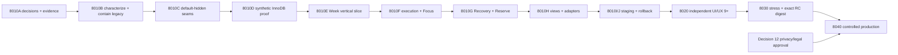

# V1-8010A Reversible Implementation Sequence

## Slices

1. **8010A — evidence/authority.** Preserve the corpus manifest, decisions,
   characterization, protected-path record, and rollback law.
2. **8010B — legacy containment.** Write characterization tests first; narrow
   only owner/type authorization defects required for the direct V1 dependency.
3. **8010C — disabled seams.** Add the fail-closed access/mode resolver,
   versioned REST namespace, pure domain/repository interfaces, privacy-safe
   observability schema, and tiny content-hashed route loader. Exposure stays
   off; no learner truth exists.
4. **8010D — persistence proof.** On isolated synthetic WordPress/InnoDB, prove
   isolation, constraints, migration lock/restart, injected failure,
   backup/restore, first-operation watermark, and current/N-1 reader before
   applying additive Plan tables.
5. **8010E — Week vertical slice.** Create, move, resize, complete, delete, and
   reload with Plan UUID/revision/operation; reject collision/stale revision;
   prove retry, two tabs, two users, DST, keyboard, and touch.
6. **8010F — execution.** Mission, Day, Focus, closeout, partial/remainder,
   reason-bearing release, 0% attempt, actual provenance, timer crash recovery.
7. **8010G — Recovery and Reserve.** Quantity conservation, lineage,
   learner-visible capacity order, valid placement, confirmation, and
   compensating undo.
8. **8010H — breadth/adapters.** Month, Journey, Review, recurrence, settings,
   one-way import preview/CAS, mentor ghosts, and safe evidence adapters. Quotes
   remain off.
9. **8010I/J — staging/package.** Immutable assets, guard manifest, security,
   accessibility, responsive, performance, cross-app regression, current/N-1
   reader, and both rollback rehearsals using synthetic or policy-approved data.
10. **8020–8040.** Independent 9+/10 quality loop, adversarial/stress RC freeze,
    then exact-digest cohort rollout only after Decision 12 is approved.

## Commit/rollback boundaries

Each slice is its own tested commit/stacked PR and leaves exposure off until its
explicit gate. Any release byte change after V1-8030 invalidates the candidate.
Before a watermark, disabling V1 can restore legacy. After a watermark, disable
both writers, serve the independent current/N-1 V1 reader, snapshot Plan data,
disable adapters, and roll back only compatible application/controller assets.
Tables and operations are preserved; dropping data is not rollback.

## Performance constraints

Week loads first; secondary views lazy-load. The loader targets ≤5 KB gzip,
initial route JS ≤150 KB gzip, Study CSS ≤60 KB gzip, ≤3 requests to usable
Week, ≤20 initial queries and ≤8 mutation queries. Cold p75 LCP targets ≤2.5 s,
warm route-ready ≤1.5 s, INP ≤200 ms, CLS ≤0.1. Large fixtures cover 104 weeks,
5,000 blocks, 20,000 operations, and 500 Journey items with ≤2,500 DOM nodes,
no polling, bounded long tasks, and <5% retained-heap growth over 20 mounts.
