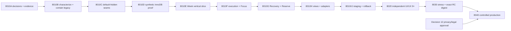

# V1 Study Schedule 8010R — Full Complete Combined Handoff

Generated deterministically: 2026-07-15 UTC  
Scope: V1-8010A baseline plus governed V1-8010R reports  
Source count: 19

## Inventory

| # | Source | SHA-256 |
|---:|---|---|
| 1 | `_AI_HANDOFFS/from_codex/V1_STUDY_SCHEDULE_8010R/V1_8010R_FOUNDER_AUTHORIZATION.md` | `40a8bf8787b12c31804ccf920778cc1d4c39eedc5899bf767119996e588e0a7b` |
| 2 | `_AI_HANDOFFS/from_codex/V1_STUDY_SCHEDULE_8010R/V1_8010R_COORDINATION_RESUME_RECEIPT.md` | `14377572ad05d32425f6ad0d5f13ea122f069ff8e08e98e1a2eba107bef906ab` |
| 3 | `_AI_HANDOFFS/from_codex/V1_STUDY_SCHEDULE_8010A/V1_8010A_COMPLETE_COMBINED_HANDOFF.md` | `cb12042ca56845c536415532e641b5f0e64d0903e2e577867ec8178daeb50d4d` |
| 4 | `_AI_HANDOFFS/from_codex/V1_STUDY_SCHEDULE_8010R/V1_8010R_HERSCHEL_WAVE1.md` | `aa64b2494a8116c8c6389bf708c53b2a277e909cbf8cfbd5012fe33c5886008b` |
| 5 | `_AI_HANDOFFS/from_codex/V1_STUDY_SCHEDULE_8010R/V1_8010R_MIYAMOTO_WAVE1.md` | `a7526f33006776d3c9a574b19c604695c9fe5d1779eee4952f7b1c3e9ca072c2` |
| 6 | `_AI_HANDOFFS/from_codex/V1_STUDY_SCHEDULE_8010R/V1_8010R_AVICENNA_WAVE2.md` | `5c99adff5114e570ae0fd3c057b9587f6e5ab495cce1198713073a3af394fd2f` |
| 7 | `_AI_HANDOFFS/from_codex/V1_STUDY_SCHEDULE_8010R/V1_8010R_DARWIN_WAVE2.md` | `915e1199a47ae03dd4fcad21908927dcf574a8efbc139228596c05b20850ec46` |
| 8 | `_AI_HANDOFFS/from_codex/V1_STUDY_SCHEDULE_8010R/V1_8010R_8010B_CONTAINMENT_REPORT.md` | `86a16f1e0e2112311c4d8a3452100a8e1e6e04724965afaed51b8781f7f4a2d6` |
| 9 | `_AI_HANDOFFS/from_codex/V1_STUDY_SCHEDULE_8010R/V1_8010R_8010C_IMPLEMENTATION_REPORT.md` | `d603e15c1f1d507b16ba9a512a0dcf01cdba425df0be3c54fb984ac3a582fbcf` |
| 10 | `_AI_HANDOFFS/from_codex/V1_STUDY_SCHEDULE_8010R/V1_8010R_8010C_TEST_EVIDENCE.md` | `81dc3a332ffd8aa8505060cab525a573383efd5a62edf7ec2434d6f5bfbb2776` |
| 11 | `_AI_HANDOFFS/from_codex/V1_STUDY_SCHEDULE_8010R/V1_8010R_8010C_INDEPENDENT_REVIEW.md` | `eccadf48c319e499483e0f4881e5223dd9c3eb0e1bf7a98ade8d645fbdfa40f2` |
| 12 | `_AI_HANDOFFS/from_codex/V1_STUDY_SCHEDULE_8010R/V1_8010R_8010D_DESIGN_DECISION.md` | `b2d8fe6d3bb197bdab7f6423f181f6b8f607933b2295407d14e2fd7f6579fecb` |
| 13 | `_AI_HANDOFFS/from_codex/V1_STUDY_SCHEDULE_8010R/V1_8010R_8010D_KERNEL_EVIDENCE.md` | `562947126838036a3b66d0baecb99b4693cf4f6f090658a35707b8428e70d923` |
| 14 | `_AI_HANDOFFS/from_codex/V1_STUDY_SCHEDULE_8010R/V1_8010R_8010E_REQUIREMENTS_LEDGER.md` | `853ed592fb7eb943cce3016d0a729c136c0ab99f65174b6cf4db5d97942a5c2e` |
| 15 | `_AI_HANDOFFS/from_codex/V1_STUDY_SCHEDULE_8010R/V1_8010R_8010E_E0_DESIGN_DECISION.md` | `95e71c4ecea46c44bace7544e0dfd117b7e70798649d3940454487aa7aa2b747` |
| 16 | `_AI_HANDOFFS/from_codex/V1_STUDY_SCHEDULE_8010R/V1_8010R_8010E_E0_EVIDENCE.md` | `835480a9d42df16368955ed56416b2eebd8a948c969be602a004e05ac1d4ea36` |
| 17 | `_AI_HANDOFFS/from_codex/V1_STUDY_SCHEDULE_8010R/V1_8010R_8010E_E1_DESIGN_DECISION.md` | `da97d148bb5e083ff16ccf890797f893a5a2c4837b48d66b024720e00934a480` |
| 18 | `_AI_HANDOFFS/from_codex/V1_STUDY_SCHEDULE_8010R/V1_8010R_8010E_E1_EVIDENCE.md` | `a115b026dbb22a7ab19cdbfbab7cd77d951de2c2780ee71b75e3e0159b74a7f7` |
| 19 | `_AI_HANDOFFS/from_codex/V1_STUDY_SCHEDULE_8010R/V1_8010R_BLOCKER_REGISTER.md` | `0f4604c15a719f42b2972fb580a34d2014c3932c8f077fd829107a250cac4178` |

<!-- BEGIN SOURCE: _AI_HANDOFFS/from_codex/V1_STUDY_SCHEDULE_8010R/V1_8010R_FOUNDER_AUTHORIZATION.md -->

# V1-8010R Founder Authorization Record

## Status

Accepted as the governing authority for the current V1 Study Schedule execution
run. This record supplements the committed V1-8000 and V1-8010A evidence; it
does not rewrite those historical records and does not assert that any product,
data, staging, or production gate has passed.

## Source

Founder authorization ticket `V1-STUDY-SCHEDULE-8010R`, supplied by Brian in:

`/Users/brianb/.codex/attachments/b69ab5c5-ab91-4b26-b5eb-3de3ca3f4d86/pasted-text.txt`

The source ticket remains the controlling text if this summary omits detail.

## Control-plane decision

Brian explicitly authorizes V1-8010R to proceed despite the stale
MissionMed_OS product registry, stale `CURRENT.md` warning, absent V1 mission,
and unresolved MM-SPINE-005 census dependency. Those conditions are recorded
technical debt, not V1 authority.

MissionMed_OS is read-only for this run. This mission may not edit or regenerate
`CURRENT.md`, `missions.json`, or `products_index.json`; may not execute
MM-SPINE-005 or create a replacement control-plane mission; and may not divert
into CAM, Grand Rounds, Scheduler, credentials, or unrelated governance work.

## Authorized V1 execution

The ticket authorizes the complete evidence-led V1 loop, including:

- filing the V1-8010A package and correcting provisional V1 work;
- V1 source, additive versioned Plan persistence, APIs, repository, operations,
  revisions, idempotency, timezone, provenance, and rollback-compatible reader;
- server-enforced learner, administrator, and authorized mentor boundaries;
- minimum protected Matrix mounting changes, immutable assets, lock records,
  rollback packages, staging, controlled rollout, and production verification;
- synthetic fixtures, security, accessibility, responsive, performance,
  concurrency, migration, rollback, and cross-application tests;
- governed commits, branch publication, pull request, merge, exact-digest
  deployment, production enablement, and defect correction.

These actions remain conditional on their stated technical and safety proofs.
The authorization is not evidence that those proofs already exist.

## Protected Matrix decision

Brian explicitly authorizes the V1-specific override for
`class_mmed_student_os_php` and the minimum required changes to the MissionMed
Hub bootstrap, Student OS controller, V1 route loader, dedicated content-hashed
V1 JavaScript/CSS, route registration, app-mode configuration, runtime
manifest, lock descriptors, and cache-safe immutable delivery.

The active hashed Student OS bundle must not be edited in place. Before every
protected deployment the run must capture before hashes, create a rollback
package, verify origin bytes and the Matrix guard, verify unrelated routes,
deploy immutable assets, verify public hashes and authenticated behavior, and
retain the evidence.

## Data decision

Plan truth must live in a dedicated Plan-owned WordPress repository. The legacy
Calendar `mmed_events` table, unknown Supabase projects, unrelated study/task
tables, and dual-write designs are forbidden as canonical V1 storage.

Additive persistence work may begin only after independent proof of the exact
active database, InnoDB-equivalent transactional and isolation behavior,
backup/restore, migration locking and recovery, unique revision/idempotency,
and atomic first operation plus learner cutover watermark. Production migration
additionally requires staging rehearsal, dry run, rollback-reader, security,
and ownership evidence. Schema work must be additive and preserve data in place.

## Product authority

The controlling product order is:

1. Brian's current V1 directives;
2. D9-360 complete experience and specifications;
3. D9-350 behavioral constitution and edge-case laws where not superseded;
4. D9-300 visual ancestry;
5. D9-200 and D9-100 product/integration specifications;
6. V1-8000 architecture, source, safety, and production evidence;
7. current production source conventions;
8. explicitly logged engineering judgment.

D9-360 is the intended complete reference, subject to production adaptation and
genuine accessibility, responsiveness, performance, usability, and workflow
improvements. Approved function may not be silently removed or weakened.

## Execution and completion law

The run resumes from the exact accepted state and proceeds through containment,
disabled seams, Plan persistence proof, complete temporal product slices,
staging, independent quality loops, security/privacy, stress, migration and
rollback rehearsal, immutable release, production rollout, authenticated
verification, repair, and final review.

Only a true external blocker defined by the founder ticket may halt the loop.
Routine failures, disproven assumptions, source drift, or refinement needs are
to be resolved in-loop. Final status may be `COMPLETE` only after every
production acceptance criterion in the source ticket is verified, including
durable six-view product behavior, fail-closed entitlement, learner authority,
safe concurrency and timezone behavior, rehearsed migration/rollback,
cross-application regressions, WCAG 2.2 AA, responsive/performance budgets,
independent UI/UX score of at least 9.0, and authenticated production E2E.

## Handoff law

All individual Markdown reports must be preserved. The final deliverable is
`V1_8010R_COMPLETE_COMBINED_HANDOFF.md`, embedding every final Markdown
deliverable verbatim with BEGIN/END markers and containing the full evidence,
hash, Git/PR, deployment, URL, unresolved-issue, command, file, and final-status
record without secrets, credentials, cookies, keys, tokens, or student data.

<!-- END SOURCE: _AI_HANDOFFS/from_codex/V1_STUDY_SCHEDULE_8010R/V1_8010R_FOUNDER_AUTHORIZATION.md -->

<!-- BEGIN SOURCE: _AI_HANDOFFS/from_codex/V1_STUDY_SCHEDULE_8010R/V1_8010R_COORDINATION_RESUME_RECEIPT.md -->

# V1-8010R Coordination Resume Receipt

## Capture

- Captured: 2026-07-15T03:45:00Z
- Worktree: `/Users/brianb/MissionMed_worktrees/V1-StudySchedule-8010A`
- Branch: `codex/v1-study-schedule-8010a`
- Local HEAD: `bafd2f16a031163f4a1fce9bcae8ac8cc5a706a6`
- Index: nothing staged
- Tracked changes: exactly two files
- Untracked groups: one workflow, five PHP fixtures plus their runner, and the V1-8010R evidence directory

The resumed state contained more untracked evidence than the earlier coordination-stop summary named. Work stopped for classification before any of those bytes were overwritten or adopted.

## Preserved receipt

The exact pre-adoption state is preserved outside the repository at:

`/Users/brianb/MissionMed_Backups/V1_STUDY_SCHEDULE_8010R/20260715T034500Z`

| Receipt artifact | SHA-256 |
|---|---|
| `tracked.patch` | `6f9e6aee68927d0c781782793b969c71fbec08b1b667f7257137a753e5bda6e4` |
| `untracked.tar.gz` | `3c0e84bf6d8b51fcf15e3a87b5258124ca13e251fe7b2ffe9b3aece70b356e16` |
| `status.txt` | `7c27fa40ffe878612089472ba0eece7668bde6cf835d1aa61bb59db5d29642c3` |
| `metadata.txt` | `9a83a7dceed91f8f7c6393cfe5117f35ba01c06cff950d02e9a4fca2e25a86fb` |
| `file-sha256.txt` | `5f5b27574a6ba60950d31dba8202786f64dad6dbfb0648d3e939da70d93e3729` |

Receipt files are mode `0600`. No MissionMed_OS file was changed.

## Byte reconciliation

The two modified source files and all six workflow/test files are byte-identical to remote validation head `34395ab7466d5a2e4496fe2db6d602f3a12a7f9e` on `codex/v1-study-schedule-8010b-ci` and draft PR #11.

| Path | SHA-256 |
|---|---|
| `.github/workflows/v1-study-schedule-containment.yml` | `e9318b4f12f3a9052ecfd5c702adbf10a44563955e5c8000993346947fad2043` |
| `tests/php/run-v1-study-schedule-containment.sh` | `7536364a111b86f04da3f296d6e71d9424e5399c259586360abc16222be947da` |
| `tests/php/v1-study-schedule-calendar-private-audience.php` | `be8c2a43cd9d5772cc51ba3553b44f73fbdf7b0486fd55fadc2ef1681253ffcb` |
| `tests/php/v1-study-schedule-calendar-strict-mutation.php` | `cd7ba1e7b57bdf6b6c52c8d45ff4d13a565a5adf368679c60bde98a2639026cf` |
| `tests/php/v1-study-schedule-legacy-containment.php` | `d989ebd2d6fb9df00b139f515ac0495fbb9093453a562ca131dde5f171e246d9` |
| `tests/php/v1-study-schedule-route-baseline.php` | `0a88682661748ee1fe9ba57f4cb327cc3f194fa50317db24adb1526e91d9b322` |
| `wp-content/plugins/missionmed-hub/includes/class-mmed-calendar-engine.php` | `5f2a183a443fbc2ed3fe0735f6af2483cde27e943fcebd40c50f0f54fdb525d4` |
| `wp-content/plugins/missionmed-hub/includes/class-mmed-study-schedule.php` | `83bed69a97fa2227b3635460afb5ab113ec4530ba30eb0684ea775eea9cb5841` |

GitHub Actions run `29386935391` completed successfully for that exact validation head. Its two jobs used PHP 7.4.33 and PHP 8.3.32; both linted the two source files and four fixtures and passed every fixture.

## Disposition

| Group | Disposition | Reason |
|---|---|---|
| Two modified legacy source files | Preserve and provisionally adopt | Exact remote byte match and green dual-version CI; final adoption waits for current independent Wave 1 and Darwin review. |
| Workflow and PHP tests | Preserve and provisionally adopt | Exact remote byte match; PHP 7.4/8.3 evidence is independently recoverable from GitHub. |
| Existing V1-8010R Markdown reports | Preserve as provisional evidence | They document the parallel attempt but do not replace supervisor verification or the required re-engaged agent wave. |
| External snapshot | Retain | It is the rollback/evidence boundary for the resumed dirty state. |

No file was deleted, reset, stashed, cleaned, or blindly rewritten during reconciliation.

<!-- END SOURCE: _AI_HANDOFFS/from_codex/V1_STUDY_SCHEDULE_8010R/V1_8010R_COORDINATION_RESUME_RECEIPT.md -->

<!-- BEGIN SOURCE: _AI_HANDOFFS/from_codex/V1_STUDY_SCHEDULE_8010A/V1_8010A_COMPLETE_COMBINED_HANDOFF.md -->

# V1 Study Schedule 8010A — Full Complete Combined Handoff

Generated deterministically by `V1_8010A_BUILD.py`. Every final Markdown deliverable is embedded verbatim; this file excludes itself.

<!-- BEGIN EMBEDDED FILE: V1_8010A_AUTHORIZATION_RECORD.md -->

# V1-8010A Authorization Record

## Governing authority

Brian authorizes `V1-STUDY-SCHEDULE-8010A` as the governing mission for this
worktree despite the absent MissionMed_OS mission and unrelated `CURRENT.md`.
MissionMed_OS remains read-only. Its stale or incomplete registry is recorded
drift, not a stop condition.

Routine reversible source, protected-file, schema, branch, commit, push, PR,
staging, flag, cache, deployment, and controlled-rollout work is authorized when
required by the staged execution loop and protected by verified rollback.

## Conditions on that authority

- Work must be strictly necessary for V1 Study Schedule inside Matrix.
- Existing bootstraps, authentication, entitlement, routes, and unrelated apps
  must be preserved and regression-tested.
- Student-data changes must be additive, backed up, tested, observable, and
  rollback-capable.
- Rollout must be fail-closed, cohort-controlled, observable, and reversible.
- No secret, student content, password, token, or private data may enter Git,
  reports, screenshots, commands, or task output.
- MissionMed_OS may not be rewritten, stashed, reset, merged, or otherwise
  altered.
- Unrelated appointment, Webex, Calendar-product, CAM-product, RankListIQ,
  credential, and MissionMed_OS work remains excluded unless a direct V1
  dependency is proved.

## Remaining valid stops

The authorization does not decide money, legal/privacy policy, destructive
deletion, unrecoverable loss, irreversible third-party confirmations, or
mutually exclusive founder product decisions. Those remain genuine stops at
the affected gate. Routine engineering uncertainty is not a stop.

## Applied scope

This record authorizes the V1-8010A decision and evidence set and the later
reversible implementation pipeline. It does not itself assert that any release
gate has passed.

<!-- END EMBEDDED FILE: V1_8010A_AUTHORIZATION_RECORD.md -->

<!-- BEGIN EMBEDDED FILE: V1_8010A_PRODUCT_IDENTITY_LEDGER.md -->

# V1-8010A Product Identity Ledger

| Field | Governing value |
|---|---|
| Product | **V1 Study Schedule** |
| Purpose | Learner academic study planning and execution |
| Historical aliases | Matrix Plan; Study Schedule; Study Scheduler; D9 Matrix Plan |
| Historical visual foundation | D9-300 Matrix Plan execution canvas |
| Not this product | MissionMed Scheduler; Appointment Scheduler; Calendar; Webex Scheduler |

Every file containing “scheduler” must be classified by content and ownership.
A filename alone is never product evidence. New records, code identifiers,
routes, and user-facing copy use **V1 Study Schedule**; historical evidence
retains its immutable original names.

<!-- END EMBEDDED FILE: V1_8010A_PRODUCT_IDENTITY_LEDGER.md -->

<!-- BEGIN EMBEDDED FILE: V1_8010A_DECISION_LEDGER.md -->

# V1-8010A Decision Ledger

Filing a decision closes ambiguity; it does not waive the acceptance conditions
inside that decision.

| # | Decision | Filed status | Release effect |
|---:|---|---|---|
| 01 | Product and authority | Accepted | D9-300 foundation; explicit V1 rulings govern contradictions |
| 02 | Product-input durability and rights | Engineering accepted | Raw corpus/quotes remain out of public release |
| 03 | Implementation home | Accepted | Isolated V1 branch and revertible stacked slices |
| 04 | One canonical writer | Accepted | V1 command repository only |
| 05 | Physical store/data plane | Conditional selection | InnoDB capability, migration, backup/restore proof required |
| 06 | Identity/context | Accepted | WordPress owner; context descriptive and versioned |
| 07 | Authentication/360 entitlement | Accepted | Fail closed; administrators audit-only |
| 08 | Temporal law | Accepted | Instant + IANA zone + local intent + fold/policy |
| 09 | Legacy/import | Accepted | Explicit one-way CAS import; atomic cutover watermark |
| 10 | Completion/adapters | Accepted | Learner command owns verdict; adapters evidence/proposals only |
| 11 | Settings/content | Accepted | Server canonical; sound off; reduced motion; quotes disabled |
| 12 | Retention/history/privacy | Implementation boundary accepted | Real-learner and production legal/privacy hold |
| 13 | Flag/release/cutover | Accepted | Four explicit modes; exact-digest staged release |
| 14 | Runtime lock | Accepted with pre-edit correction | Normalize controller drift and register protected assets |

## Independent-verification result

Herschel verified corpus integrity and the physical-store boundary. Avicenna
corrected temporal, import, adapter, and behavioral ambiguities. Lorentz
verified authority, identity, entitlement, release-mode, privacy, and runtime
boundaries. Darwin then produced the incremental sequence and rollback model.
The supervisor independently checked load-bearing repository, manifest, corpus,
archive, and runtime evidence before accepting these records.

## Go state after filing

Pure domain/UI code, default-hidden seams, and synthetic-data test work may
begin. Protected controller work waits for Decision 14 normalization. Physical
schema application waits for Decision 05 capability proof. Real learner data,
cohort exposure, and production wait for Decision 12 approval plus all quality
and release gates.

<!-- END EMBEDDED FILE: V1_8010A_DECISION_LEDGER.md -->

<!-- BEGIN EMBEDDED FILE: V1_8010A_DECISION_01.md -->

# V1-8010A Decision 01 — Product and Authority

**Status:** ACCEPTED

## Decision

The product is V1 Study Schedule. D9-300 is the visual and interaction
foundation. D9-350 is the behavioral authority where internally consistent;
the explicit V1-8010A rulings in Decisions 08–13 supersede its contradictions.
D9-360 is refinement and test evidence, not self-ratifying production authority.

The implementation foundation is repository commit
`d4455bf4ee401eaa8b074603497eb9fcd6eb04a0`; V1-8000 reconciliation commit
`c988666eb35a108674508830e5555f09c28607b3` is evidence layered on that base.
Observed production is runtime evidence only and cannot silently override the
product law.

## Rejected authorities

- the current legacy Calendar-backed `#study` panel as product specification;
- `mmed_events` as Plan ownership;
- a prototype’s localStorage or mock write-back;
- D9-360 self-scores;
- appointment/Webex Scheduler source;
- MissionMed_OS `CURRENT.md` for this founder-authorized mission.

## Verification

Independent source, behavior, and boundary reviewers agreed on this hierarchy.
The product identity ledger is mandatory in every later handoff.

## Rollback consequence

Any slice that diverges from D9-300 language or an explicit V1 behavior ruling
must be reverted or re-adjudicated before it can become a release candidate.

<!-- END EMBEDDED FILE: V1_8010A_DECISION_01.md -->

<!-- BEGIN EMBEDDED FILE: V1_8010A_DECISION_02.md -->

# V1-8010A Decision 02 — Product-Input Durability and Rights

**Status:** ACCEPTED FOR ENGINEERING; CONTENT-RIGHTS RELEASE HOLD

## Decision

The accepted historical corpus comprises 75 files and 2,006,500 bytes across
D9-100, D9-200, D9-300, D9-350, and D9-360. Its exact relative paths, sizes, and
SHA-256 digests are tracked in the accepted-input manifest. The two historical
source trees are byte-identical.

A sealed archive exists outside the public repository at
`/Users/brianb/MissionMed_Backups/V1_STUDY_SCHEDULE_8010A/` with mode `0600`,
SHA-256 `c2584123205b47e4566d51b3a0f88cf850df509bfd2c0bdb9b8915b683f22c01`,
and a successful extract-and-`diff -qr` restore test. It is a local restoration
copy; an approved off-device private custody copy remains required before the
original local evidence may be retired.

Raw historical bytes are not copied into the public Git repository. Integrity,
attribution, and a status label do not establish publication rights. Quote
reuse and external-font dependencies remain disabled until authoritative source,
attribution, license/content rights, and distribution approval are recorded.

## Verification

The read-only scan found no high-confidence secrets, credential literals,
private keys, JWTs, emails, phone numbers, or assigned student records. The
quote seed contains 24 entries but no general license grant; only a subset has
public-domain markings. No raw quote text is present in this record.

## Release condition

The core planner may proceed without quotes. Public distribution of historical
content cannot proceed from this decision alone.

<!-- END EMBEDDED FILE: V1_8010A_DECISION_02.md -->

<!-- BEGIN EMBEDDED FILE: V1_8010A_DECISION_03.md -->

# V1-8010A Decision 03 — Implementation Home

**Status:** ACCEPTED

## Decision

The canonical repository is `brinyu13/missionmed-hq`. V1-8010A work occurs in:

- worktree: `/Users/brianb/MissionMed_worktrees/V1-StudySchedule-8010A`;
- branch: `codex/v1-study-schedule-8010a`;
- evidence parent: `c988666eb35a108674508830e5555f09c28607b3`;
- immutable application foundation: `d4455bf4ee401eaa8b074603497eb9fcd6eb04a0`.

Draft V1-8000 PR #10 remains reconnaissance-only. V1-8010A decision records and
each implementation slice use separately revertible commits/stacked branches.
No recovered D9 branch is edited, rebased, or rewritten.

## Long-lived destination

Until the V1-8000 evidence PR is accepted, V1-8010A is stacked on the
`codex/v1-study-schedule-8000` evidence tip. Each later PR targets the previously
accepted V1 integration tip. Promotion to the release branch occurs only through
reviewed, exact-digest commits.

## Verification and rollback

`git status` was clean when the branch/worktree was created. A slice may be
reverted independently; history rewriting and cross-worktree cleanup are
forbidden.

<!-- END EMBEDDED FILE: V1_8010A_DECISION_03.md -->

<!-- BEGIN EMBEDDED FILE: V1_8010A_DECISION_04.md -->

# V1-8010A Decision 04 — One Canonical Writer

**Status:** ACCEPTED

## Decision

The V1 command service and its repository are the only writers of canonical
Plan state. Calendar, legacy Study rows, Admin OS, Session Manager, Courses,
Arena, StoryForge, Vault, Profile, mentors, appointment systems, adapters, and
browser storage cannot write Plan tables directly.

Imports, evidence, mentor proposals, focus sessions, UI actions, and external
outcomes enter through versioned V1 commands with actor, learner owner,
idempotency key, expected revision, provenance, and an atomic operation record.
Read models are rebuildable projections, never a second truth.

## Forbidden shortcuts

- dual-write to Calendar and Plan;
- silent completion from an external outcome;
- mutable localStorage authority;
- admin impersonation;
- restoring mutable legacy behavior after a learner’s V1 cutover watermark.

## Verification

Architecture tests must prove that no adapter has table-write credentials or a
repository bypass. Rollback preserves Plan data and disables both writers after
cutover.

<!-- END EMBEDDED FILE: V1_8010A_DECISION_04.md -->

<!-- BEGIN EMBEDDED FILE: V1_8010A_DECISION_05.md -->

# V1-8010A Decision 05 — Physical Store and Data Plane

**Status:** ACCEPTED CONDITIONALLY; MIGRATION REQUIRES CAPABILITY PROOF

## Decision

V1 selects additive, Plan-owned WordPress/InnoDB tables behind one repository
interface. It will not reuse Calendar-owned `wp_mmed_events`, diagnostic
`study_plans`/`tasks`, or an unapproved Supabase project.

The schema separates learner Plan identity/cutover, scheduled obligations,
append-only operations, focus/actual facts, external evidence, mentor proposals,
settings, and review records. Stable UUIDs identify domain objects. Database
constraints—not application prechecks alone—enforce owner-scoped uniqueness,
idempotency, lineage, and revision transitions.

## Required migration protocol

- explicit `ENGINE=InnoDB` and supported isolation characterization;
- a dedicated versioned migration runner, never `dbDelta`;
- database migration lock and concurrent-installer rejection;
- additive, restartable steps with recorded checksums;
- injected failure recovery without assuming transactional DDL;
- backup/export/restore proof before each protected application;
- current/N-1 reader compatibility;
- synthetic two-user isolation, uniqueness, retry, and atomic-watermark tests;
- no table drop as rollback.

The first V1 operation/import and learner cutover watermark commit atomically in
one DML transaction. Until the capability test passes, repository and domain
code use synthetic fixtures only and no production schema is applied.

## Authority boundary

The founder’s V1-8010A authorization covers additive, backed-up, tested,
rollback-capable schema work. Gate 12 independently blocks real learner data
until privacy/retention policy is approved.

<!-- END EMBEDDED FILE: V1_8010A_DECISION_05.md -->

<!-- BEGIN EMBEDDED FILE: V1_8010A_DECISION_06.md -->

# V1-8010A Decision 06 — Identity and Context

**Status:** ACCEPTED

## Decision

WordPress user ID is the authenticated actor key and learner-owner key. V1 Plan
UUID is the stable product aggregate identifier. Program, course, cohort,
runway/exam, chronotype, targets, and mentor assignment remain facts owned by
their existing systems.

V1 may store a versioned, server-derived context snapshot plus provenance for
replanning and historical explanation. Context is descriptive; it is never a
client-selected ownership partition or an authorization grant. Unknown context
must degrade safely without changing the learner owner.

Mentor and administrator actors remain distinct principals and cannot
impersonate learners. Every command records actor and learner owner separately.

## Verification

Required tests cover two learners, one mentor with and without assignment, an
administrator, stale context, changed course membership, and non-enumerating
foreign-object denial.

<!-- END EMBEDDED FILE: V1_8010A_DECISION_06.md -->

<!-- BEGIN EMBEDDED FILE: V1_8010A_DECISION_07.md -->

# V1-8010A Decision 07 — Authentication, 360 Entitlement, and Authorization

**Status:** ACCEPTED

## Decision

V1 access is fail-closed and keeps four independent decisions:

1. authenticated WordPress actor;
2. verified 360 product entitlement;
3. rollout exposure/mode;
4. action, resource-owner, assignment, and field authorization.

The existing `mmhq_cam_build_entitlement()` behavior may be characterized and
normalized as evidence for a V1-specific 360 claim. V1 does not inherit CAM
product semantics or CAM’s administrator override. Access requires active,
trusted, current-access-verified, revocation-checked, unexpired, unrestricted
evidence under the already accepted purchase/current-legacy authority mode.

Administrators receive an explicit audit-only V1 surface and cannot create,
edit, import, complete, or impersonate a learner. Eligible 360 learners mutate
only their own resources. Mentors receive only assignment-scoped,
server-filtered proposal access.

## Non-authorities

Generic Matrix access, program tier alone, any-course enrollment, client flags,
administrator status, and rollout exposure do not grant learner V1 access.
Changing qualifying products/courses or legacy-without-purchase treatment is a
money/entitlement decision outside this record.

## Verification

Every REST action requires nonce/CSRF validation, entitlement, rollout, action,
owner/assignment, and field checks. Denials are non-enumerating. Required tests
cover admin-negative mutation, forged IDs, foreign ownership/type, revoked and
expired claims, stale claims, and direct endpoint access with navigation hidden.

<!-- END EMBEDDED FILE: V1_8010A_DECISION_07.md -->

<!-- BEGIN EMBEDDED FILE: V1_8010A_DECISION_08.md -->

# V1-8010A Decision 08 — Temporal Law

**Status:** ACCEPTED

## Canonical temporal representation

Every scheduled occurrence stores:

- a UTC instant;
- IANA timezone;
- learner-local date/time intent;
- temporal-policy version;
- explicit fold choice for ambiguous local time;
- source/provenance and fixed-versus-flexible classification.

The learner Week begins Monday 00:00 in the learner-profile zone. The
06:00–24:00 canvas is a display window, not the civil-day boundary. A
cross-midnight Focus session belongs to the block’s start-day ledger while its
persisted segments retain exact instants.

## Zone changes and recurrence

Historical actuals, closeouts, Review records, and streak day keys never change
when a profile zone changes. Future flexible learner blocks preserve their local
wall-time intent in the new profile zone and rederive the instant. Future fixed
or external anchors preserve the versioned source instant and source zone.
Recurrence expands from local intent and policy, never by adding 24 hours in
UTC.

A nonexistent DST-gap input is rejected with a valid-slot suggestion. An
ambiguous fold requires an explicit earlier/later choice and is never guessed.

## Required proof

Property and integration tests cover spring gap, fall fold/both choices,
Monday/week boundaries in multiple zones, cross-midnight Focus and closeout,
zone change before/after closeout, recurrence across DST, fixed-anchor reimport,
and invariant historical streak keys. Naïve Calendar datetime values receive no
V1 temporal credit.

<!-- END EMBEDDED FILE: V1_8010A_DECISION_08.md -->

<!-- BEGIN EMBEDDED FILE: V1_8010A_DECISION_09.md -->

# V1-8010A Decision 09 — Legacy Study Import and Cutover

**Status:** ACCEPTED

## Decision

Legacy Calendar Study rows are source evidence only. They are never V1 Plan
storage and are never automatically dual-written. Import is explicit,
learner-authorized, one-way, idempotent, and previewed before commit.

Eligibility requires exact learner owner, governed Study event type, source
namespace, source object ID/version, and approved metadata. A preview token
binds learner, event type, source version/hash, selected rows, expiry, and the
current Plan revision. Commit revalidates all predicates atomically, then creates
V1 UUID/revision/lineage facts without mutating legacy rows.

Database uniqueness on
`(source_system, source_object_id, source_version, learner_id)` prevents
duplicates. Missing, moved, changed, deleted, reordered, foreign-owner, and
foreign-type rows invalidate the preview. V1 projections carry an immutable
origin marker and are excluded from inbound import/busy processing.

## Cutover and rollback

Before the watermark, legacy may remain separately active. The first V1
operation/import and learner cutover watermark commit atomically; afterward V1
is the only writer. Rollback enters V1 degraded read-only and never restores a
second mutable legacy truth. Source deletion yields a versioned tombstone/evidence
event and does not erase imported history.

Only the learner principal with full V1 access may commit import. Administrators
are audit-only.

## Required proof

Tests cover duplicate/retry/concurrency, preview drift/expiry/forgery, owner/type
substitution, source move/update/delete, foreign-event integrity, export echo
suppression, every failure boundary, pre/post-watermark writer denial,
current/N-1 reading, and data-preserving rollback.

<!-- END EMBEDDED FILE: V1_8010A_DECISION_09.md -->

<!-- BEGIN EMBEDDED FILE: V1_8010A_DECISION_10.md -->

# V1-8010A Decision 10 — Completion, Execution, and Adapters

**Status:** ACCEPTED

## Canonical command boundary

Only a learner-authorized V1 command may complete, partially resolve, move,
reserve, release, or recover Plan work. Courses, Arena, StoryForge, Vault,
Calendar, mentor systems, and other adapters contribute evidence or proposals
only.

Inbound evidence carries source system/object/version, event ID,
occurred/received timestamps, kind, tombstone/retraction state, and payload
schema version. Replay, stale, reordered, conflicting, or retracted evidence
cannot mutate canonical completion. External evidence, learner verdict,
actual-time fact, and adapter-delivery state remain separate. Outbound delivery
is idempotent and its failure never rolls back a valid local learner operation.

Mentor suggestions are immutable proposals with reason, author, assignment
scope, privacy filtering, withdrawal revision, and compare-and-swap learner
resolution. Adapter absence degrades locally.

## Behavioral rulings

### Partial and release

- Governed work quantity is conserved; rounded planned minutes are not proof.
- A partial source becomes a terminal historical parent and its remainder is a
  distinct lineage child.
- An accepted remainder disposition removes the parent from closeout triage;
  an active same-day child gates closeout independently.
- Undo is a lineage-aware compensating operation and conflicts after
  incompatible child changes.
- `skipped` is nonterminal. Every release requires a governed reason.
- A learner-authored 0% attempt may derive `attempted_no_progress`; captured
  attempt time survives and the released object cannot be silently resurrected.

### Ghosts and group acceptance

- Add: use a valid gap, otherwise Reserve with provenance.
- Move: move the existing obligation to a valid gap or atomically to Reserve.
- Resize: use a valid same/fallback slot; otherwise remain pending
  `needs_placement` with no Plan mutation.
- Defer: atomically move the existing obligation to Reserve.
- Missing target: withdraw/conflict; never accept.
- Modify: create an isolated learner draft; a separate save changes Plan.
- A group uses one tentative final Plan, one transaction, one operation, and one
  compensating undo. Any nonrecoverable member failure aborts all members.

### Recovery, Reserve, streaks, and actuals

- Recovery conserves exact work quantity; minute compression is a separate
  estimate change; true scope reduction is an explicit release.
- Reserve uses stored learner-visible order. It chooses the first item fitting
  both displayed flexible-capacity budget and a collision-free future slot
  after now, respecting fixed anchors, protected rest, and horizon. No hidden
  historical multiplier applies. No fit recommends closeout; placement
  revalidates revision/capacity/slot.
- Rest, quiet, and pause preserve continuity but do not increment
  `resolved_work_days_current`; unresolved closeout resets it. Milestones derive
  only from resolved work days and are delivered once per run.
- Actual duration provenance is `timer`, `learner_entered`, or
  `assumed_planned`. Zero is valid. Timer segments persist even if no outcome is
  chosen, sum once by unique IDs, and only timer-derived minutes may be labeled
  focused work.

## Required proof

Contract/property suites cover replay/reorder/tombstone, conservation and
lineage, two-tab races, mentor accept/withdraw, group failure, adapter outage,
Reserve capacity, streak sequences, actual provenance, crash recovery, and
read-model rebuild. No adapter may write Plan tables directly.

<!-- END EMBEDDED FILE: V1_8010A_DECISION_10.md -->

<!-- BEGIN EMBEDDED FILE: V1_8010A_DECISION_11.md -->

# V1-8010A Decision 11 — Settings and Governed Content

**Status:** ACCEPTED

## Decision

V1 owns versioned Study-specific settings through its repository. Server state
is canonical; browser storage is a recoverable cache only. Defaults and every
migration are versioned.

- Sound defaults off.
- Motion obeys operating-system reduced-motion and cannot override it.
- Settings failure falls back to safe defaults without enabling sound, motion,
  sharing, or writes.
- Privacy consent, mentor visibility, notifications, and retention are separate
  versioned policy/consent records, not generic preferences.
- Quotes remain disabled until governed content rights and attribution pass
  Decision 02.

If quotes are later enabled, one learner-local daily assignment is reused across
surfaces. No quote repeats before a 45-day local-date difference; day 44 is
ineligible and day 45 eligible. Exhaustion omits the module with
`cooldown_exhausted`; the cooldown is never relaxed and favorites do not bypass
it. This ruling supersedes conflicting D9-350 reset/oldest-first behavior.

## Verification

Tests cover default migration, corrupt cache, concurrent tabs, reduced-motion,
sound consent, day 44/45, exhaustion, context suppression, and single daily
assignment. No raw quote content is required for the core release.

<!-- END EMBEDDED FILE: V1_8010A_DECISION_11.md -->

<!-- BEGIN EMBEDDED FILE: V1_8010A_DECISION_12.md -->

# V1-8010A Decision 12 — Retention, History, Privacy, and Deletion

**Status:** IMPLEMENTATION BOUNDARY ACCEPTED; REAL-LEARNER RELEASE HOLD

## Decision

No retention value is invented in engineering. “Permanent” retention is
prohibited. The implementation may create explicit data classifications,
policy-version fields, export/delete/anonymize interfaces, consent boundaries,
and synthetic-fixture tests, but it may not activate destructive expiry jobs or
collect real learner Plan/behavior data until an approved policy defines:

- purposes and explicit windows for operations, current Plan, Review records,
  aggregates, evidence, mentor suggestions/responses, and telemetry;
- mentor-visible fields and whether minute-level actuals require opt-in;
- account deletion versus audit/tombstone preservation;
- export scope and identity verification;
- backup retention and deletion propagation;
- notice/consent requirements for study-behavior analytics.

## Safe defaults before policy approval

- synthetic identities/data only outside production;
- mentor private notes and minute-level actual sharing disabled;
- no learner-content telemetry or logs;
- no automated destructive deletion/anonymization;
- no unmanaged production copies;
- staging cleanup uses synthetic-fixture teardown and recorded verification;
- quotes remain separately gated by Decision 02.

## Effect on the execution loop

This hold does not block pure domain code, fixture UI, default-hidden access and
repository seams, local/synthetic migration proofs, accessibility, responsive,
performance, security, rollback, or package work. It blocks real-student import,
real-learner staging/production collection, production telemetry, destructive
retention jobs, cohort exposure, and production deployment until privacy/legal
approval is attached to this record.

This is the mission’s current genuine legal/privacy stop; routine engineering
must continue independently.

<!-- END EMBEDDED FILE: V1_8010A_DECISION_12.md -->

<!-- BEGIN EMBEDDED FILE: V1_8010A_DECISION_13.md -->

# V1-8010A Decision 13 — Release Modes, Flags, and Cutover

**Status:** ACCEPTED

## Canonical modes

| Mode | V1 exposure/read | V1 writer | Legacy writer |
|---|---|---|---|
| `LEGACY_PRECUTOVER` | Off | Denied | Existing behavior allowed; no V1 watermark |
| `V1_ACTIVE_READ_WRITE` | Current V1 reader | V1 only | Denied |
| `V1_DEGRADED_READ_ONLY` | Current/N-1 reader | Denied | Denied |
| `V1_HIDDEN_NO_TRUTH` | Hidden | Denied | Existing behavior may remain only if no V1 watermark exists |

Entitlement, exposure, write mode, and reader compatibility are separate
server decisions. A boolean feature flag cannot represent this state machine.
The first V1 operation/import and cutover watermark commit atomically.

## Progression

All source ships default-off. Visible staging requires fail-closed entitlement,
learner-principal proof, synthetic data, and rollback readiness. V1-8020 must
independently achieve UI and UX scores of at least 9.0/10. V1-8030 freezes the
exact tested release-candidate digest; any byte change invalidates it. V1-8040
performs controlled cohort rollout only after every release gate, including
Decision 12, passes.

The governing authorization already covers ordinary reversible flag, cohort,
cache, deploy, and rollback actions; no redundant founder prompt is required.
It does not authorize skipping quality, privacy, exact-digest, or rollback gates.

## Stop/rollback

On authorization leakage, foreign mutation, dual writers, persistence drift,
runtime-hash mismatch, restore failure, P0/P1 defect, or cross-app regression,
deny both writers and enter `V1_DEGRADED_READ_ONLY` for any learner with V1
truth. Pre-watermark users may return to legacy.

<!-- END EMBEDDED FILE: V1_8010A_DECISION_13.md -->

<!-- BEGIN EMBEDDED FILE: V1_8010A_DECISION_14.md -->

# V1-8010A Decision 14 — Matrix Runtime Lock and Protected Delivery

**Status:** ACCEPTED; CONTROLLER DRIFT NORMALIZED 2026-07-15

## Corrected runtime evidence

The global Matrix runtime lock **does** govern the active fingerprinted Student
OS bundle through asset key `student_os_js`:

| Field | Value |
|---|---|
| Source path | `assets/student-os.js` |
| Production/runtime path | `assets/student-os.646e3598d284fff3.js` |
| Approved SHA-256 | `646e3598d284fff31d22dec98c70c1800e74743276872bb65f1afeeda1c17e5a` |

Contrary V1-8000 statements are superseded by this decision. The authenticated
administrator route `/member-dashboard/#study` is verified as the legacy
Calendar-backed view, not V1. Eligible-learner behavior remains unverified.

The initial guard was green for every declared public JS/CSS asset and identified
only `class_mmed_student_os_php`: the former descriptor was `c0a538…` while
recovered, origin, and observed runtime bytes were `23da5c…`.

That drift is now normalized. A fresh Kinsta rollback copy and a private local
evidence bundle were created, the global descriptor was updated to the proven
`23da5c…` baseline under Brian's explicit authority, and a full source/origin/
public preflight passes without an override. See
`V1_8010A_RUNTIME_LOCK_NORMALIZATION.md`.

## Protected protocol

Before a protected implementation or deployment:

1. enumerate exact controller, loader, JS, CSS, REST/bootstrap, and entitlement
   asset keys under the current founder authorization;
2. verify source/origin/public hashes and archive current bytes;
3. register V1 route/assets and rollback-reader descriptors;
4. make source changes only in the canonical branch;
5. build immutable content-hashed artifacts;
6. run the guard and protected compatibility suite before and after staging;
7. deploy the exact manifest digest; verify public hashes and rollback package.

Protected surfaces include runtime manifests, Student OS controller/bundle,
plugin bootstrap/shared REST or MU entitlement code if touched, and every new V1
loader/controller/asset once registered. Direct unguarded deployment is
forbidden. MissionMed_OS remains read-only.

<!-- END EMBEDDED FILE: V1_8010A_DECISION_14.md -->

<!-- BEGIN EMBEDDED FILE: V1_8010A_ACCEPTED_INPUT_MANIFEST.md -->

# V1-8010A Accepted Product-Input Manifest

This is a hash-only provenance record for the historical V1 Study Schedule corpus. No raw prototype or quote content is reproduced here.

- Files: **75**
- Bytes: **2006500**
- Private archive SHA-256: `c2584123205b47e4566d51b3a0f88cf850df509bfd2c0bdb9b8915b683f22c01`
- Archive permissions: `0600`
- Restore test: all five extracted package trees passed `diff -qr` against their accepted sources.
- Public distribution: **not authorized by this record**.
- Quote reuse: **disabled pending verified source, attribution, and content-rights approval**.

## Package manifests

| Historical package | Files | Bytes | Normalized manifest SHA-256 |
|---|---:|---:|---|
| `D9_MATRIX_STUDY_SCHEDULER_100` | 9 | 316245 | `7bb15e1f4e2129209fde759740c06511b6ce4dd593ea44c4fd0749fd6e3d4da5` |
| `D9_MATRIX_STUDY_SCHEDULER_200` | 15 | 384100 | `1b43b6ad111cd5bbafb0487f6a1ced58c13572bde940d449f05280eaf3cac353` |
| `D9_MATRIX_STUDY_SCHEDULER_300` | 7 | 330195 | `fa270726b2ae55dacf859794d00f126202ab03e57953c06a16079cfbe01016f9` |
| `D9_MATRIX_STUDY_SCHEDULER_350` | 22 | 504445 | `a1ef43b2d48964bd33aaa9560fe4618a6ae8ee7f2cd2fa6688c18a6495c72b50` |
| `D9_MATRIX_STUDY_SCHEDULER_360` | 22 | 471515 | `2796cf4b44b952bbe69e9496050c0cd5fa38ba84aeffdfd3a1ff6665827ac448` |

## File integrity inventory

| Package | Relative path | Bytes | SHA-256 |
|---|---|---:|---|
| `D9_MATRIX_STUDY_SCHEDULER_100` | `D9_100_COMPLETE_COMBINED_HANDOFF.md` | 69342 | `9847d84d5bd3c1bb9108c17e5bf334d3dfeb6ea6cfbe15c76926d166414bde0d` |
| `D9_MATRIX_STUDY_SCHEDULER_100` | `D9_100_EXECUTION_ROADMAP.md` | 3874 | `c0221c58e57578789699c39296af858c30b866ed1d526c7620bc988328ed2d7b` |
| `D9_MATRIX_STUDY_SCHEDULER_100` | `D9_100_INTERACTION_MODEL.md` | 12255 | `6f1dd4b79006fd814054d49e852c04c4d37103ce3eb627ee46b3b00fda4a856f` |
| `D9_MATRIX_STUDY_SCHEDULER_100` | `D9_100_MATRIX_ARENA_INTEGRATION_MAP.md` | 7019 | `37f71d01595b29ec21060f82bde5fad645198d4df385c9c6eb783339ce9481a1` |
| `D9_MATRIX_STUDY_SCHEDULER_100` | `D9_100_MATRIX_PLAN_FUNCTIONAL_PROTOTYPE.html` | 179168 | `b7998ccec1062ce434bc7c2f1167f84de0910fa758a0bee7ac147e32bd58743f` |
| `D9_MATRIX_STUDY_SCHEDULER_100` | `D9_100_POST_PROTOTYPE_SYSTEM_SPEC.md` | 11423 | `45550e53a17be3b7385f0d5f8f19d01ee6f3472f88b7d1a0a03e0f57a98f0156` |
| `D9_MATRIX_STUDY_SCHEDULER_100` | `D9_100_PRODUCT_CHALLENGE.md` | 15644 | `7af0cb1f0fa4fdc21ca77ede7cd4d1c89b408df4a8a3535254917cf46da32942` |
| `D9_MATRIX_STUDY_SCHEDULER_100` | `D9_100_PRODUCT_DEFINITION.md` | 11112 | `810d99b3b0bcaa9722cfd19beddb36deea66fdf2ef0fe45d46aad1ba5312ba2d` |
| `D9_MATRIX_STUDY_SCHEDULER_100` | `D9_100_PROTOTYPE_REVIEW_GUIDE.md` | 6408 | `e7ae7a40fe00e7a34f0962c16912cd3c58e471c978f00fbfdf2e5ce01d23fd87` |
| `D9_MATRIX_STUDY_SCHEDULER_200` | `D9_200_COMPLETE_COMBINED_HANDOFF.md` | 61235 | `aa905e151536d94bf3a3717d6902e47da72de1aaa374e67fdf3bf749c5ff3c03` |
| `D9_MATRIX_STUDY_SCHEDULER_200` | `D9_200_DECISION_SHEET.md` | 1453 | `3efcb89ee078d68c8551249e2bfea2feb017c9308b13cbc01e893ea0c12c2a46` |
| `D9_MATRIX_STUDY_SCHEDULER_200` | `D9_200_ECOSYSTEM_BEHAVIOR_MAP.md` | 3900 | `696319b3f23670d86b2f550d5aa7aadd37003d7b6f552b78dd559e1e5acade59` |
| `D9_MATRIX_STUDY_SCHEDULER_200` | `D9_200_EXECUTION_REPORT.md` | 5322 | `6f0f1c44d4a319d9420c00d4b3e9a187bdd474e1f6ac951e19ace5acef769b61` |
| `D9_MATRIX_STUDY_SCHEDULER_200` | `D9_200_EXPERIENCE_ARCHITECTURE.md` | 4462 | `c54b8aded70bdc33c4e751e2968fe1a8231052e4cd4dad36438ed907850631f4` |
| `D9_MATRIX_STUDY_SCHEDULER_200` | `D9_200_FOCUS_MODE_SPEC.md` | 3962 | `ba79b1819bfad3da00cef7898be16000c65d669741af547e1e425e73315369aa` |
| `D9_MATRIX_STUDY_SCHEDULER_200` | `D9_200_FUNCTIONAL_ACCEPTANCE_MATRIX.md` | 3967 | `a3d0eb05e8f3f8075818deee0910cb5e4bfb3429aa7775c812b7f97ddbb50674` |
| `D9_MATRIX_STUDY_SCHEDULER_200` | `D9_200_MATRIX_PLAN_NEXT_LEVEL_FUNCTIONAL_APP.html` | 264313 | `f48baab157eca07527fb50b77c8c389b9eeb0f9abf90da911cd045b345938e7d` |
| `D9_MATRIX_STUDY_SCHEDULER_200` | `D9_200_MENTOR_GHOST_INTELLIGENCE_SPEC.md` | 4062 | `429430cd1d46a314c8a7189eba81eebf9fdaa6b43b3e0ed020de9a8ff6985121` |
| `D9_MATRIX_STUDY_SCHEDULER_200` | `D9_200_PRODUCT_ELEVATION_DECISIONS.md` | 6672 | `fe4152305215292ba86acf4cb0c5f3d0c5715b6dd140509e6e9be8126858a915` |
| `D9_MATRIX_STUDY_SCHEDULER_200` | `D9_200_PROTOTYPE_REVIEW_GUIDE.md` | 7709 | `9b253d4f5e2ac833a5338081e23ca5b46c94f2cde182a447780407e673020529` |
| `D9_MATRIX_STUDY_SCHEDULER_200` | `D9_200_RECOVERY_AND_REVIEW_SPEC.md` | 4037 | `fd31de5f4542ce0d02af8d7309d56e2733b2a6557e8a16fb59546067cb3a577b` |
| `D9_MATRIX_STUDY_SCHEDULER_200` | `D9_200_TEST_AND_VERIFICATION_REPORT.md` | 4644 | `e1c4c2ca8c0cd2db70586148a30adcf389f0c2458e065dc6e9819df47cf07bbb` |
| `D9_MATRIX_STUDY_SCHEDULER_200` | `D9_200_TODAYS_MISSION_SPEC.md` | 3881 | `297887975fd79c8f9078dc949ef9548a0b79373cef2cef979e6e9959ca04e42b` |
| `D9_MATRIX_STUDY_SCHEDULER_200` | `D9_200_VISUAL_AND_INTERACTION_SYSTEM.md` | 4481 | `640e300c9eecd7855d74f36ef80c90e666d33987417576a9f237d45b92f12256` |
| `D9_MATRIX_STUDY_SCHEDULER_300` | `D9_300_BEFORE_AFTER_RATIONALE.md` | 5795 | `6ad15590af265c4ee2e78476d6f137e694fdeee6d60eb37751a187c38083091f` |
| `D9_MATRIX_STUDY_SCHEDULER_300` | `D9_300_COMPLETE_COMBINED_HANDOFF.md` | 28721 | `202d949a674cb956962d4232c9682db924b200aef2990bf636c1abacc015cc8d` |
| `D9_MATRIX_STUDY_SCHEDULER_300` | `D9_300_DESIGN_LANGUAGE_FINDINGS.md` | 6055 | `c655887b5c1057514d69da2bb123a26ea6b302ad7202257c0733901344400d57` |
| `D9_MATRIX_STUDY_SCHEDULER_300` | `D9_300_DESIGN_SYSTEM.md` | 5201 | `4bfccfdc9d86ad2dd91c31b9d88c035bc06dd2faaaf1ee53cde0da56f590f48f` |
| `D9_MATRIX_STUDY_SCHEDULER_300` | `D9_300_INTERACTION_SYSTEM.md` | 4653 | `56338140bf60e108f403cc6295244a0a8abeb9548038fc8f5e6c16bf552fd1af` |
| `D9_MATRIX_STUDY_SCHEDULER_300` | `D9_300_MATRIX_PLAN_EXECUTION_CANVAS.html` | 274215 | `cd7737649afeb581fa3a18abb774cfa8ade1860372e0215cc8bd3fa375d0dc67` |
| `D9_MATRIX_STUDY_SCHEDULER_300` | `D9_300_REVIEW_GUIDE.md` | 5555 | `9b50f4561816e4dfa50155d2b319e1ebc228e705e53a87fa43c8f0ed52f87127` |
| `D9_MATRIX_STUDY_SCHEDULER_350` | `D9_350_BEHAVIORAL_CONSTITUTION.md` | 8913 | `2aff474a31392c607f3a4beb63b7b11a0fee440f7a358e5202442415f4aed5d2` |
| `D9_MATRIX_STUDY_SCHEDULER_350` | `D9_350_BEHAVIOR_DECISION_TABLES.md` | 5324 | `73d9e5970878108c10020ddedbfcc88784f84dd7657d4e52e018525991bffcd7` |
| `D9_MATRIX_STUDY_SCHEDULER_350` | `D9_350_CODEX_IMPLEMENTATION_AUTHORITY.md` | 4269 | `b5614444b1b11678744443bd3163ca787ba2b78b1002c86dac4418652eb27897` |
| `D9_MATRIX_STUDY_SCHEDULER_350` | `D9_350_COMPLETE_COMBINED_HANDOFF.md` | 67192 | `6c5d02669fd80abed89943fec495065e6db3f5f5cfbcb895624371b2adacc5c9` |
| `D9_MATRIX_STUDY_SCHEDULER_350` | `D9_350_COMPLETION_REWARD_SYSTEM.md` | 3030 | `b9de3465ef2530c09f95a605c463488852dedbcacfd8c4b687e95a19c5c3be56` |
| `D9_MATRIX_STUDY_SCHEDULER_350` | `D9_350_D9_300_RED_TEAM_AUDIT.md` | 5929 | `3346cc8cd9246e7f3a48591086832d2d356271c96a86093a1111ddde7c95fe0f` |
| `D9_MATRIX_STUDY_SCHEDULER_350` | `D9_350_DAILY_PROGRESS_AND_CLOSEOUT_SPEC.md` | 2031 | `a31496cf7c71468fbb69c8f9bd07531121739f88392eaacce1bb203a1abcaf2b` |
| `D9_MATRIX_STUDY_SCHEDULER_350` | `D9_350_EDGE_CASE_CATALOG.md` | 4021 | `1f71db663a7db98b2d8def45e2f5d07111a7e71d4bbaa3516a23be346edb38a0` |
| `D9_MATRIX_STUDY_SCHEDULER_350` | `D9_350_EXECUTION_REPORT.md` | 2678 | `fe40830f72a2e44df1204b2c197242e61ec16847948ab2aea331ac4c03541693` |
| `D9_MATRIX_STUDY_SCHEDULER_350` | `D9_350_FUNCTIONAL_ACCEPTANCE_MATRIX.md` | 2914 | `926ac0a602cf9488a261a46ec000f750719ac937817c330ec77cb6f880817ef7` |
| `D9_MATRIX_STUDY_SCHEDULER_350` | `D9_350_INTRO_EXPERIENCE_SPEC.md` | 1913 | `5698afc14c50eadf643746296eccf759b546637e5f9295078475579adb8f3ca9` |
| `D9_MATRIX_STUDY_SCHEDULER_350` | `D9_350_LONG_TERM_JOURNEY_SPEC.md` | 2639 | `132a2cad9837d3c627737a82cd2efe674cce47fd24075b43c1d9b3a953ab2a60` |
| `D9_MATRIX_STUDY_SCHEDULER_350` | `D9_350_MATRIX_PLAN_BEHAVIORAL_AND_JOURNEY_PROTOTYPE.html` | 333987 | `e7f0f5cbedf12edf4c88cbd42d2f466681860e456f12bcbbfa320406d701553c` |
| `D9_MATRIX_STUDY_SCHEDULER_350` | `D9_350_MOTIVATIONAL_SYSTEM.md` | 2276 | `86696c27c09f8903907d2eb805d9fc61bb805652f5d55eea12906a2b544693a8` |
| `D9_MATRIX_STUDY_SCHEDULER_350` | `D9_350_QUOTE_DATA_SCHEMA.json` | 2552 | `1cfa165bfd8f590c1fbf58755221bfaceb8befd0517f9bf37409ecd74f6cb7cf` |
| `D9_MATRIX_STUDY_SCHEDULER_350` | `D9_350_QUOTE_LIBRARY_GOVERNANCE.md` | 3014 | `46633c7920c76c20a6310a9c5a7cce3d147015952d66068f004a956f0775e00c` |
| `D9_MATRIX_STUDY_SCHEDULER_350` | `D9_350_REVIEW_GUIDE.md` | 5305 | `dd4c1c43825c7e7e536d092a610fc0dede285180f63f321eff8a884be4e1ab16` |
| `D9_MATRIX_STUDY_SCHEDULER_350` | `D9_350_STREAK_CONSTITUTION.md` | 3811 | `41481a6ee73a6facf58d4c8d4bf30a4e3d317f3fd6fce869540896d28abc87c0` |
| `D9_MATRIX_STUDY_SCHEDULER_350` | `D9_350_TEMPORAL_VIEW_ARCHITECTURE.md` | 2959 | `bfb59b401ec4b0e3e7ae56c53f8b13a161d2586ccba5745c5909886f4cb84c0a` |
| `D9_MATRIX_STUDY_SCHEDULER_350` | `D9_350_TEST_AND_VERIFICATION_REPORT.md` | 2714 | `d37fec7efdb6dd1268082ae37af810b060fa3006efe4bb8d66d0322ecd5f8635` |
| `D9_MATRIX_STUDY_SCHEDULER_350` | `D9_350_TEST_SUITE.js` | 28401 | `f95307de45962d4badef06276b4bbbf246b52ef2436bc6834d904277fc16ccb9` |
| `D9_MATRIX_STUDY_SCHEDULER_350` | `D9_350_VERIFIED_QUOTE_SEED.json` | 8573 | `ffec72434e96f987591df26323c5997e51f8ada142ae4356c60db715563a5b90` |
| `D9_MATRIX_STUDY_SCHEDULER_360` | `D9_360_ACCESSIBILITY_REPORT.md` | 1178 | `4318790cab549b71277bd9083aad626651cc909c7bc923362bacb7bcb0b0a2d7` |
| `D9_MATRIX_STUDY_SCHEDULER_360` | `D9_360_BASELINE_SCORECARD.md` | 2940 | `24dde146da011a357ecbf7effcb85b6a4cfafc40d98d203666523582dc5e17de` |
| `D9_MATRIX_STUDY_SCHEDULER_360` | `D9_360_CODEX_IMPLEMENTATION_AUTHORITY.md` | 3447 | `3e399ecf22ae6bb73dcd187f91390bdb1aabdcbf4ae19f455e46ebd0054f2286` |
| `D9_MATRIX_STUDY_SCHEDULER_360` | `D9_360_COMPLETE_COMBINED_HANDOFF.md` | 46341 | `014ab4765433fe8d07889a683d81849204a5700a237345835ab3fe9416a08727` |
| `D9_MATRIX_STUDY_SCHEDULER_360` | `D9_360_EXECUTION_REPORT.md` | 2083 | `b0d362d496590c0384c871c35248ef08dcd044171cd245264a6e7bb7ec121a2c` |
| `D9_MATRIX_STUDY_SCHEDULER_360` | `D9_360_FINAL_SCORECARD.md` | 3985 | `8a58b46cedd2942f53cbb7de9e558ae21f3cb9566f184be8681339fb1f3466ae` |
| `D9_MATRIX_STUDY_SCHEDULER_360` | `D9_360_FUNCTIONAL_QA_REPORT.md` | 1428 | `8f6409c9abd3a12492304e1baa333c396cf16f517bd1a82f540d0927bafb4662` |
| `D9_MATRIX_STUDY_SCHEDULER_360` | `D9_360_JOURNEY_CONCEPT_COMPARISON.md` | 3946 | `0e199844d5cfe265574e1368276f3ea70180d7b759f0cb0d0ac95ae0dfc00b4a` |
| `D9_MATRIX_STUDY_SCHEDULER_360` | `D9_360_JOURNEY_FINAL_SPEC.md` | 3349 | `157bc726b12e642866ba0b0c81e1dd1b9154dcac7297f90a50e3ca6157af490b` |
| `D9_MATRIX_STUDY_SCHEDULER_360` | `D9_360_MATRIX_PLAN_FINAL_PERFECTION_PROTOTYPE.html` | 349670 | `3932492723fb031942603724cda1d1d80418d1e0f230f6916824e2257fbe8dd5` |
| `D9_MATRIX_STUDY_SCHEDULER_360` | `D9_360_MOBILE_REPORT.md` | 822 | `922d5f91e447907136ca328d4e4b030bc138d0266dc1fa8772b6b59c8a242a23` |
| `D9_MATRIX_STUDY_SCHEDULER_360` | `D9_360_PASS_1_FIX_REPORT.md` | 2355 | `1cf8dd2644822be64d72db67455e6baafa68f8ba569d461f22c0924c09b4fa56` |
| `D9_MATRIX_STUDY_SCHEDULER_360` | `D9_360_PASS_1_FORENSIC_AUDIT.md` | 4087 | `8d757b71abee474a26331ac5e3b2d33d996e6aea945c3d660674ff5aca1005a9` |
| `D9_MATRIX_STUDY_SCHEDULER_360` | `D9_360_PASS_2_FIX_REPORT.md` | 782 | `54b7f309cbaeed75de6edad2a13ebe0ee37b2e69fefa668c4b2e245d659bfd91` |
| `D9_MATRIX_STUDY_SCHEDULER_360` | `D9_360_PASS_2_USER_REVIEW.md` | 1884 | `b8db4b87eea80ec219023f219ef93de3d6e9b8f58f117c3f357145a4f1d5c929` |
| `D9_MATRIX_STUDY_SCHEDULER_360` | `D9_360_PASS_3_FLAGSHIP_REVIEW.md` | 2060 | `c6d309f74cddada8cd6e0d92c03a8da8d9f0abcb0bc1da9d80b46ced51306498` |
| `D9_MATRIX_STUDY_SCHEDULER_360` | `D9_360_PERFORMANCE_REPORT.md` | 911 | `fa853fcbc17605f12fa1a64ba1e083955f3c93c48d274a1915437adb49be0fa2` |
| `D9_MATRIX_STUDY_SCHEDULER_360` | `D9_360_REVIEW_GUIDE.md` | 2475 | `6387d6a0731ee194ca01c32e5964d95dc6232275e4386cb40fd5f0985cedb0f9` |
| `D9_MATRIX_STUDY_SCHEDULER_360` | `D9_360_TEMPORAL_NAVIGATION_FINAL_SPEC.md` | 1603 | `151bae4a08980d0ecd5a4ebc7158a897b6fa40e85d77c46ddf6752b4c2f48e3f` |
| `D9_MATRIX_STUDY_SCHEDULER_360` | `D9_360_TEST_REPORT.md` | 1404 | `1357a3d494418f8eb3c52f9378ef30f298920d4358509b623310729712f0ce06` |
| `D9_MATRIX_STUDY_SCHEDULER_360` | `D9_360_TEST_SUITE.js` | 32814 | `e2c3eaaf482edf541b80b34b0b6584871bab5abc456a19d64c032fbfece85cdc` |
| `D9_MATRIX_STUDY_SCHEDULER_360` | `D9_360_VISUAL_QA_REPORT.md` | 1951 | `b1083337fde1e099c5a83bb36ec970fa5b2e1067699caa144b16f7ac8890e577` |

The machine-readable equivalent is `V1_8010A_ACCEPTED_INPUT_MANIFEST.json`.

<!-- END EMBEDDED FILE: V1_8010A_ACCEPTED_INPUT_MANIFEST.md -->

<!-- BEGIN EMBEDDED FILE: V1_8010A_RUNTIME_LOCK_NORMALIZATION.md -->

# V1-8010A Matrix Runtime Lock Normalization

## Result

**PASS.** The only historical Matrix guard drift was normalized before editing
the protected Student OS controller. Production application bytes were not
changed.

## Evidence

| Item | Evidence |
|---|---|
| Timestamp | `2026-07-15T03:07:27Z` |
| Controller local SHA-256 | `23da5c033e8d9ffcf3e9512fb385a8a0a0e88b592cae5e375941d43372cefe29` |
| Controller Kinsta SHA-256 | `23da5c033e8d9ffcf3e9512fb385a8a0a0e88b592cae5e375941d43372cefe29` |
| Manifest-before SHA-256 | `efb1d51b916ccc32fa0bf56fa3bd77b828f5cfa63ca04fb8b29c914654c9952d` |
| Former approved controller SHA-256 | `c0a538d3454ff4a05822e00ace01ebf933a8bbfcf1722fc2be382527743d78cb` |
| Current approved controller SHA-256 | `23da5c033e8d9ffcf3e9512fb385a8a0a0e88b592cae5e375941d43372cefe29` |
| Kinsta rollback copy | `/www/theresidencyacademy_209/private/matrix-runtime-guard-backups/V1-STUDY-SCHEDULE-8010A/20260715T030727Z/class-mmed-student-os.php` |
| Private local evidence bundle | `/Users/brianb/MissionMed_Backups/V1_STUDY_SCHEDULE_8010A/runtime-lock-normalization/20260715T030727Z/` |

The local evidence bundle is mode `0600` and contains the pre-change global
manifest, current local controller, and independently copied Kinsta controller.
The Kinsta rollback copy is also mode `0600`.

## Authorized descriptor change

Only the existing `class_mmed_student_os_php` descriptor and manifest update
timestamp were normalized. Source owner, provenance, backup, validation ticket,
and validation time now point to V1-8010A. No other protected asset hash, route
lock, invariant, or allowed change was altered.

## Verification

After normalization:

- the manifest parsed as JSON;
- all ten declared local/source and production-origin assets matched;
- every public JS/CSS hash matched;
- `matrix_runtime_guard.py preflight --assets all --verify-public` exited `0`
  without `--brian-approved`;
- MissionMed_OS remained untouched;
- no production plugin, database, cache/CDN, flag, authentication, entitlement,
  or learner-data state changed.

Future V1 loader/controller/JS/CSS assets must be registered under their exact
content hashes before a protected deployment.

<!-- END EMBEDDED FILE: V1_8010A_RUNTIME_LOCK_NORMALIZATION.md -->

<!-- BEGIN EMBEDDED FILE: V1_8010A_CHARACTERIZATION_BASELINE.md -->

# V1-8010A Characterization Baseline

## Current truth

- The authenticated administrator route `/member-dashboard/#study` renders the
  legacy Calendar-backed Study Schedule week grid, not V1 Study Schedule.
- The active Student OS asset is the governed fingerprinted bundle recorded in
  Decision 14.
- The legacy REST boundary `/mmed/v1/study-blocks` authenticates only at a broad
  logged-in level and delegates update/delete by numeric event ID without V1
  learner entitlement, owner, or governed event-type proof.
- Legacy rows are Calendar-owned `wp_mmed_events` records with numeric IDs,
  naïve datetime fields, and JSON metadata. They are not V1 Plan truth.
- No V1 route mode, V1 data store, V1 REST command boundary, or production V1
  feature flag exists at the accepted implementation base.
- Current administrator rendering showed no console errors, but the timeline
  exposed no focusable controls; previous/next and date controls lacked adequate
  accessible labels.
- At a 390×844 viewport, the Study content begins far below the first screen,
  making the current experience operationally poor on mobile.
- Eligible 360 learner route and mutation behavior remains unverified.

## Characterization suite required before modifying a shared seam

1. admin, eligible learner, and non-entitled bootstrap/access payloads;
2. direct `#study` navigation and shell/loader race;
3. legacy REST list/create/update/delete permission matrix;
4. administrator, impersonation, mentor-field, foreign-owner, and foreign-type
   negative mutation tests;
5. metadata preservation and Calendar/Admin/Session writer inventory;
6. timezone, range, DST, and cross-midnight behavior;
7. every shared Matrix route with V1 off;
8. public/source asset hashes and runtime guard;
9. CSRF/nonce, encoding, mass-assignment, enumeration, and mutation-rate tests;
10. pre/post-watermark readers and legacy-writer denial.

All mutation characterization uses local fixtures or isolated synthetic staging.
Production observation remains read-only until the release phase.

## Product-behavior baseline

The accepted product includes Mission, Day, Week, Month, Journey, Review, Focus,
Quick Build/manual creation, drag/move/resize/nudge, recurrence, Reserve,
Recovery, partial/release/remainder, goals/runways/capacity, mentor proposals,
timer/session state, settings, humane motivation, onboarding, responsive and
keyboard operation, persistence, offline/failure behavior, observability, and
rollback. Prototype behavior receives no production credit until exercised
through the governed command/data/access boundaries.

<!-- END EMBEDDED FILE: V1_8010A_CHARACTERIZATION_BASELINE.md -->

<!-- BEGIN EMBEDDED FILE: V1_8010A_INDEPENDENT_VERIFICATION.md -->

# V1-8010A Independent Verification

## Wave order

Herschel, Avicenna, and Lorentz roles ran in the first wave as read-only
reviewers. Darwin ran after their findings were available. The available thread
tree exposed three reusable child slots, so the Herschel role used the third
slot first and that same slot then ran Darwin. The supervisor remained the only
writer.

## Reviewer findings accepted

- **Herschel:** 75 files/2,006,500 bytes; paired trees byte-identical; no
  high-confidence secret/private-record signals; public-repository content
  rights not proved; `mmed_events` rejected; Plan-owned WordPress/InnoDB is the
  conditional physical-store preference.
- **Avicenna:** temporal law required explicit fold/local-intent semantics;
  import required preview CAS and cutover law; adapters must separate evidence
  from learner verdict; partial, release, ghost, Reserve, actual, streak, and
  quote conflicts were adjudicated in Decisions 08–11.
- **Lorentz:** founder override resolves stale MissionMed_OS administration but
  not legal/privacy; CAM admin override is prohibited; exact four-mode semantics
  are required; active Student OS is governed and only controller provenance is
  currently mismatched.
- **Darwin:** a strangler sequence with default-hidden seams, synthetic
  persistence proof, a Week vertical slice, execution/recovery/adapters, then
  quality/RC/release is the smallest safe evolution; post-watermark rollback
  must preserve a current/N-1 V1 reader and deny both writers.

## Supervisor checks

- branch/worktree state was clean at `c988666…` before this record set;
- immutable application foundation `d4455bf…` exists in Git;
- accepted corpus counts and every file digest were recomputed locally;
- a private `0600` archive was extracted and all five trees passed `diff -qr`;
- the accepted-input JSON parses;
- no MissionMed_OS file was changed;
- runtime-lock evidence and the controller-only mismatch were independently
  reproduced in the current mission context;
- all 14 decisions state their proof, forbidden shortcut, or release condition.

## Supervisor adjudications

Darwin’s statement that only evidence files were currently authorized is
superseded by Brian’s latest explicit authorization for reversible application,
schema, staging, and rollout work. Technical gates still sequence those actions.
Decision 12 blocks real learner data and production, not synthetic implementation.

The sealed archive closes immediate local recovery risk but not approved
off-device private custody. That residual is tracked and does not justify
placing the raw corpus in a public repository.

## Verdict

**All 14 decisions are filed and independently verified as decision records.**
Decisions 02, 05, 12, and 14 deliberately retain downstream acceptance gates;
their filing must not be misreported as a production go decision.

<!-- END EMBEDDED FILE: V1_8010A_INDEPENDENT_VERIFICATION.md -->

<!-- BEGIN EMBEDDED FILE: V1_8010A_IMPLEMENTATION_SEQUENCE.md -->

# V1-8010A Reversible Implementation Sequence



## Slices

1. **8010A — evidence/authority.** Preserve the corpus manifest, decisions,
   characterization, protected-path record, and rollback law.
2. **8010B — legacy containment.** Write characterization tests first; narrow
   only owner/type authorization defects required for the direct V1 dependency.
3. **8010C — disabled seams.** Add the fail-closed access/mode resolver,
   versioned REST namespace, pure domain/repository interfaces, privacy-safe
   observability schema, and tiny content-hashed route loader. Exposure stays
   off; no learner truth exists.
4. **8010D — persistence proof.** On isolated synthetic WordPress/InnoDB, prove
   isolation, constraints, migration lock/restart, injected failure,
   backup/restore, first-operation watermark, and current/N-1 reader before
   applying additive Plan tables.
5. **8010E — Week vertical slice.** Create, move, resize, complete, delete, and
   reload with Plan UUID/revision/operation; reject collision/stale revision;
   prove retry, two tabs, two users, DST, keyboard, and touch.
6. **8010F — execution.** Mission, Day, Focus, closeout, partial/remainder,
   reason-bearing release, 0% attempt, actual provenance, timer crash recovery.
7. **8010G — Recovery and Reserve.** Quantity conservation, lineage,
   learner-visible capacity order, valid placement, confirmation, and
   compensating undo.
8. **8010H — breadth/adapters.** Month, Journey, Review, recurrence, settings,
   one-way import preview/CAS, mentor ghosts, and safe evidence adapters. Quotes
   remain off.
9. **8010I/J — staging/package.** Immutable assets, guard manifest, security,
   accessibility, responsive, performance, cross-app regression, current/N-1
   reader, and both rollback rehearsals using synthetic or policy-approved data.
10. **8020–8040.** Independent 9+/10 quality loop, adversarial/stress RC freeze,
    then exact-digest cohort rollout only after Decision 12 is approved.

## Commit/rollback boundaries

Each slice is its own tested commit/stacked PR and leaves exposure off until its
explicit gate. Any release byte change after V1-8030 invalidates the candidate.
Before a watermark, disabling V1 can restore legacy. After a watermark, disable
both writers, serve the independent current/N-1 V1 reader, snapshot Plan data,
disable adapters, and roll back only compatible application/controller assets.
Tables and operations are preserved; dropping data is not rollback.

## Performance constraints

Week loads first; secondary views lazy-load. The loader targets ≤5 KB gzip,
initial route JS ≤150 KB gzip, Study CSS ≤60 KB gzip, ≤3 requests to usable
Week, ≤20 initial queries and ≤8 mutation queries. Cold p75 LCP targets ≤2.5 s,
warm route-ready ≤1.5 s, INP ≤200 ms, CLS ≤0.1. Large fixtures cover 104 weeks,
5,000 blocks, 20,000 operations, and 500 Journey items with ≤2,500 DOM nodes,
no polling, bounded long tasks, and <5% retained-heap growth over 20 mounts.

<!-- END EMBEDDED FILE: V1_8010A_IMPLEMENTATION_SEQUENCE.md -->

<!-- BEGIN EMBEDDED FILE: V1_8010A_BLOCKER_REGISTER.md -->

# V1-8010A Live Blocker Register

| ID | Severity | State | Boundary | Resolution and acceptance evidence |
|---|---|---|---|---|
| B-01 | P0 release | OPEN | Exact privacy/retention/mentor visibility/backup policy | Privacy/legal-approved version attached to Decision 12; export/delete/backup tests pass before real learner data or production |
| B-02 | P0 protected edit | RESOLVED 2026-07-15 | Student OS controller approved-hash drift | Live/local `23da5c…` bytes archived; descriptor normalized; full guard passes without override. New V1 assets still require registration before deploy. |
| B-03 | P1 data | OPEN | No proven Plan-owned physical store | Synthetic InnoDB migration/transaction/uniqueness/failure/backup/restore/current-N-1 suite passes |
| B-04 | P1 access | OPEN | Eligible 360 learner runtime path unverified | Explicit eligible and ineligible test principals prove fail-closed claim and owner isolation; admin mutation remains denied |
| B-05 | P1 implementation | OPEN | V1 application and six governed views absent | Reversible slices E–H pass domain, browser, accessibility, responsive, and adapter suites |
| B-06 | P1 release | OPEN | No independently scored 9+/10 UI/UX | Relevant expert board produces rendered/interactive evidence and each dimension ≥9.0 |
| B-07 | P1 release | OPEN | No isolated staging/RC/rollback evidence | Synthetic staging, security/stress, rollback rehearsals, exact digest, and protected manifest all pass |
| B-08 | P1 content | OPEN, non-core | Quote/content publication rights absent; off-device private corpus custody not pinned | Keep quotes off; record rights and approved private custody before any content use or local-source retirement |
| B-09 | P1 production | OPEN | Decision 12 and 8020/8030 gates not passed | Do not expose cohorts or deploy; continue every independent implementation/test slice |

No appointment Scheduler, Webex, unrelated CAM UI, RankListIQ, credential, or
MissionMed_OS issue is a V1 blocker unless direct dependency evidence is added.

<!-- END EMBEDDED FILE: V1_8010A_BLOCKER_REGISTER.md -->

<!-- BEGIN EMBEDDED FILE: V1_8010A_EVIDENCE_INDEX.md -->

# V1-8010A Evidence Index

## Repository authority

| Evidence | Value |
|---|---|
| Repository | `https://github.com/brinyu13/missionmed-hq.git` |
| Application foundation | `d4455bf4ee401eaa8b074603497eb9fcd6eb04a0` |
| V1-8000 evidence tip | `c988666eb35a108674508830e5555f09c28607b3` |
| V1-8010A branch | `codex/v1-study-schedule-8010a` |
| V1-8010A worktree | `/Users/brianb/MissionMed_worktrees/V1-StudySchedule-8010A` |

## Historical product inputs

- Machine-readable hashes: `V1_8010A_ACCEPTED_INPUT_MANIFEST.json`.
- Human-readable hashes: `V1_8010A_ACCEPTED_INPUT_MANIFEST.md`.
- Private archive SHA-256:
  `c2584123205b47e4566d51b3a0f88cf850df509bfd2c0bdb9b8915b683f22c01`.
- D9-300 canonical HTML SHA-256:
  `cd7737649afeb581fa3a18abb774cfa8ade1860372e0215cc8bd3fa375d0dc67`.
- Raw content is intentionally absent from the public repository.

## Prior reconciliation

The complete V1-8000 evidence set is under
`_AI_HANDOFFS/from_codex/V1_STUDY_SCHEDULE_8000_RECON/`. Decision 14 explicitly
supersedes its incorrect claims about active Student OS lock coverage and
unverified administrator routing; published historical files are not rewritten.

## Runtime and data evidence

- governed `student_os_js` approved SHA-256:
  `646e3598d284fff31d22dec98c70c1800e74743276872bb65f1afeeda1c17e5a`;
- former controller lock: `c0a538…`; normalized recovered/origin/observed and
  current approved controller: `23da5c…`;
- current `#study`: legacy Calendar-backed administrator view;
- current legacy storage: Calendar-owned `wp_mmed_events`;
- current legacy REST: `/mmed/v1/study-blocks` broad logged-in boundary;
- no accepted V1 store/route/commands/modes at the implementation foundation.

## Independent reviewers

- Herschel role: corpus/source and data-plane verification;
- Avicenna role: temporal/import/adapter/behavior verification;
- Lorentz role: authority/identity/access/privacy/release/runtime verification;
- Darwin role: minimum evolution, performance, commit, and rollback synthesis.

Subagents were read-only. MissionMed_OS remained read-only. The supervisor
independently reproduced every load-bearing claim used by the 14 decisions.

Runtime normalization evidence is in `V1_8010A_RUNTIME_LOCK_NORMALIZATION.md`.

<!-- END EMBEDDED FILE: V1_8010A_EVIDENCE_INDEX.md -->

<!-- BEGIN EMBEDDED FILE: V1_8010A_COMMAND_LOG.md -->

# V1-8010A Command Log

This is a privacy-safe summary, not a transcript. No secret values, student
content, credentials, environment values, or private data are recorded.

| Phase | Read/write class | Result |
|---|---|---|
| Worktree preflight | Read-only Git | Clean V1-8010A branch created from V1-8000 evidence tip |
| MissionMed_OS authority | Read-only | Founder override recorded; local OS state preserved untouched |
| Historical corpus scan | Read-only | 75 files, 2,006,500 bytes; no high-confidence secret/private-record signal |
| Private evidence archive | Local evidence write outside public repo | Mode `0600`; archive hash recorded; extract and five-tree byte diff passed |
| Accepted-input manifest | Handoff write | 75 relative paths/sizes/SHA-256 values generated; JSON parsed |
| Independent agent wave | Read-only | Herschel/Avicenna/Lorentz findings reconciled; Darwin followed |
| Decision filing | Handoff write | Decisions 01–14, authority, characterization, evidence, blockers, sequence filed |
| Runtime normalization | Protected manifest + backup | Live/local controller hash equality proved; fresh private Kinsta/local backups created; descriptor normalized; full guard passed without override; no production application byte changed |
| Legacy containment | Application source + fixture tests | Owner/type/state-constrained atomic mutations, metadata preservation, and explicit private creation implemented locally |
| Validation | Read-only | JSON parse, Markdown/build checks, Git whitespace/status checks |

No application source, database, feature flag, cache/CDN, authentication,
entitlement, staging, or production state was changed during this decision phase.

<!-- END EMBEDDED FILE: V1_8010A_COMMAND_LOG.md -->

<!-- BEGIN EMBEDDED FILE: V1_8010A_FILE_MANIFEST.md -->

# V1-8010A File Manifest

The manifest excludes itself and the generated combined handoff to avoid digest cycles.

| File | Bytes | SHA-256 |
|---|---:|---|
| `V1_8010A_ACCEPTED_INPUT_MANIFEST.json` | 19351 | `1bbfce9b723e4b4338278793bbc0e3a821ae58947ece11d43b43440da0bd6e4a` |
| `V1_8010A_ACCEPTED_INPUT_MANIFEST.md` | 12664 | `7c747e43c6cddcc0e11cb9d4ab41f6fd767251e1f972b34886308ec8732859f0` |
| `V1_8010A_AUTHORIZATION_RECORD.md` | 1847 | `a9d92a2f37ce250e7cdf3740b3fad36cd0479c2546470205698d69b9760a130c` |
| `V1_8010A_BLOCKER_REGISTER.md` | 2035 | `1196cc7b785536900d16b781c2a0ce1129cd0e9e5b35fd9a0105f0a366f5f81a` |
| `V1_8010A_BUILD.py` | 8828 | `16be4830a36aec319d8365808f586264ad6896261e895904852ad6e86b3a11d8` |
| `V1_8010A_CHARACTERIZATION_BASELINE.md` | 2606 | `85e53b350585bd768ac83ab0299e073cc31fbba18e8ad7d9647c923c12572391` |
| `V1_8010A_COMMAND_LOG.md` | 1700 | `b8559947a081b252cd84dc7fc4bf39d168e70606f78bcd39c21fcf9551df7122` |
| `V1_8010A_DECISION_01.md` | 1348 | `99c020c97b6242756b4b59b56fede5cf8b211db00b84057e1bfc8e4cdda91bf2` |
| `V1_8010A_DECISION_02.md` | 1604 | `4f3ca7536b1f405132a870321cf7f8242fd24fb70df6192071e045c811655df7` |
| `V1_8010A_DECISION_03.md` | 1122 | `39b59173e11cf0c0ef3a678be5ac56fec5a9efb48aaa5c865c9b51badb44567b` |
| `V1_8010A_DECISION_04.md` | 1088 | `2ef14b82c89bdf7f48414c40b84d63fff309c7ef9d79cce033152e8f9230d4d0` |
| `V1_8010A_DECISION_05.md` | 1716 | `b4150657df67a669b6bd79ce329b705be9da7c3c1840245acfda90d59b1d0e9d` |
| `V1_8010A_DECISION_06.md` | 978 | `b5e8dbe57659540b00ae6c18ee0d1f15cfb0d6396ada74022b02b380a820389d` |
| `V1_8010A_DECISION_07.md` | 1621 | `3b452687d3760f8f5401b42f77ca9eb268780c8b4ae4a14fc8a663efda46a839` |
| `V1_8010A_DECISION_08.md` | 1545 | `d364d7139bf4c88db3f6c01e8debbf02c9b08d0730c17d52138aafe625bbdf24` |
| `V1_8010A_DECISION_09.md` | 1785 | `95642f57461d53288c1f9e4fd31f6fd2787127b51d734ab5c8f2434ae49f7330` |
| `V1_8010A_DECISION_10.md` | 3603 | `d0882250d71b58ba316c32f1a48d2d861c2a31cc1f395e222f8adf140b5180f2` |
| `V1_8010A_DECISION_11.md` | 1320 | `a4b869afc979be68fed2d57bf417adb7a76fad39216831dcafcd33121a8cff8b` |
| `V1_8010A_DECISION_12.md` | 1952 | `1222e4316b8b64e1458644aabfa45a5c3191126682432f2bde9379cf9fa57b0e` |
| `V1_8010A_DECISION_13.md` | 1691 | `97772edab6aab8e0dbbc184210073ab33447ff43666af7c9e7d75ddacc50c484` |
| `V1_8010A_DECISION_14.md` | 2167 | `cf2729815bba27e07e29d926adbccd17d76a9df8fc61815d849ac9d32d2dd181` |
| `V1_8010A_DECISION_LEDGER.md` | 2435 | `558b563fcd10515849467b4fc2422e2c6c64067ed7e7c2afb80362b27e0d38ed` |
| `V1_8010A_EVIDENCE_INDEX.md` | 2245 | `75d4ee8c0d1126a1501e81ae955867b5c7dcf3ab2d7e7279bad8585ef506991c` |
| `V1_8010A_IMPLEMENTATION_SEQUENCE.md` | 3588 | `cf771cc7519ab6e5c188ed377d22cd783c0e05fd241d7a86a09eafa9c8b1dffa` |
| `V1_8010A_INDEPENDENT_VERIFICATION.md` | 2882 | `c8b7ab516fe63832d4027d24cc6078133cfdc14512ec553cb9cae9d55a9a8c53` |
| `V1_8010A_PRODUCT_IDENTITY_LEDGER.md` | 694 | `48fcaefb90277c79f7a4e423bb5f54c6399ec56316ee6b397898e5bf5f8d974b` |
| `V1_8010A_RUNTIME_LOCK_NORMALIZATION.md` | 2198 | `d92ac1a40619f28e25708fe2b310a8329f855b43933874d97c936d5406ec3a86` |

<!-- END EMBEDDED FILE: V1_8010A_FILE_MANIFEST.md -->

<!-- END SOURCE: _AI_HANDOFFS/from_codex/V1_STUDY_SCHEDULE_8010A/V1_8010A_COMPLETE_COMBINED_HANDOFF.md -->

<!-- BEGIN SOURCE: _AI_HANDOFFS/from_codex/V1_STUDY_SCHEDULE_8010R/V1_8010R_HERSCHEL_WAVE1.md -->

# V1-STUDY-SCHEDULE-8010R Implementation Map

Read-only discovery completed. No files were edited and no tests or generators
were run by Herschel.

## Baseline and concurrent work

- Worktree: `/Users/brianb/MissionMed_worktrees/V1-StudySchedule-8010A`
- Branch: `codex/v1-study-schedule-8010a`
- Accepted foundation begins at the V1-8010A commits on the D9 source-recovery
  base.
- The current dirty 8010B work modifies Calendar and Study and adds three PHP
  fixtures. It is provisional until supervisor verification.

Treat committed `HEAD` as the ownership baseline and preserve the dirty diff.

## Bootstrap, routing, and assets

- `wp-content/plugins/missionmed-hub/missionmed-hub.php` is the plugin
  bootstrap. Matrix runtime is gated by `mmed_student_os_enabled`, default
  false. Student OS, REST, Calendar, and Study classes are conditionally loaded.
- `includes/class-mmed-hub-page.php` recognizes the shell and renders
  `MMED_Student_OS::render_shell()`.
- `templates/student-os-shell.php` emits `window.MMED_OS`, REST base `mmed/v1`,
  and the WordPress REST nonce.
- `includes/class-mmed-student-os.php` enqueues the immutable
  `assets/student-os.646e3598d284fff3.js`, builds module/access bootstrap, and
  currently exposes `study` merely because the legacy Study class exists.
- `assets/student-os.js` is source and
  `assets/student-os.646e3598d284fff3.js` is the protected artifact; current
  bytes are identical. `#study` remains a generic legacy route using
  `/study-blocks`. Non-admin access comes from `module_permissions.study`, with
  a client-side admin bypass.

The clean 8010C seam is a dedicated Study bootstrap/controller that registers
from the plugin bootstrap, resolves fail-closed entitlement and mode on the
server, augments the Student OS bootstrap with safe V1 state, and enqueues a tiny
content-hashed loader after the Student OS runtime. The loader must register V1
before `DOMContentLoaded` and no-op while hidden.

There is no current filter for permission/bootstrap augmentation. A narrow
protected touch to `class-mmed-student-os.php` is therefore unavoidable. Do not
emulate entitlement with user meta or casually edit the large runtime bundle.

## REST ownership

`includes/class-mmed-rest-api.php` owns namespace `mmed/v1`.
`/study-blocks` delegates to legacy `MMED_Study_Schedule` and its permission
callback is only `is_user_logged_in()`. Generic `/events` Calendar CRUD is also
broadly available to logged-in users.

V1 needs a separate Study-owned REST controller and versioned namespace backed
only by V1 command/query services. The accepted evidence does not yet fix the
physical namespace string.

## 8010B containment boundary

Legacy ownership is limited to:

- `includes/class-mmed-study-schedule.php`
- narrow internal enforcement in `includes/class-mmed-calendar-engine.php`

The provisional work adds forced private audience, owner and `study_block` type
enforcement, metadata preservation, optimistic state checks, disabled admin
fallback for strict operations, 404/409 outcomes, and fixture coverage.
Calendar is heavily shared, so containment must remain opt-in/internal and may
not alter generic event semantics.

## Shared Calendar writers and consumers

Direct or indirect writers include Calendar, Study Schedule, REST API, Calendar
Enrollment, SSA Adapter, Interview Prep, and Session Manager. Readers also
include attendance, session chat/reminders, Arena Live, enrollment, Session
Manager, and Study.

The Calendar schema does not declare `source_group_id`, although other classes
read and write it. This reinforces that Calendar cannot become the V1 Plan
store.

## Persistence boundary for 8010C/8010D

The current store is `$wpdb->prefix . 'mmed_events'`, installed with `dbDelta`.
No V1 Plan store, repository, migration runner, or WordPress/InnoDB integration
harness exists. Diagnostic `study_plans/tasks`, Calendar events, and unapproved
Supabase surfaces are forbidden as Plan truth.

V1 requires additive Plan-owned InnoDB tables behind one repository; only its
command service/repository may write. Calendar, Admin, Session, Courses, Arena,
and legacy Study must have no V1 write path.

8010D must prove isolated synthetic transactionality for first operation/import
plus watermark, migration locking/restart, injected-failure recovery,
backup/restore, constraints, ownership isolation, current/N-1 reader, and
non-destructive rollback.

## Entitlement

`class-mmed-access-gate.php` is too broad: any configured LearnDash enrollment
qualifies, administrators receive full access, and user meta can override
modules.

The strongest existing evidence provider is
`wp-content/mu-plugins/missionmed-hq-auth-handoff.php`, especially
`mmhq_cam_build_entitlement()`, which evaluates LearnDash/Woo state,
currentness, revocation, and trust. V1 can consume it through a dedicated
fail-closed adapter but must not inherit an administrator mutation bypass.

## Deployment and protected runtime

The worktree's `_SYSTEM/deploy.sh` is an old R2 HTML path and is invalid for this
plugin. Canonical controls are:

- guard: `/Users/brianb/MissionMed/_SYSTEM/tools/matrix_runtime_guard.py`
- manifest: `/Users/brianb/MissionMed/_SYSTEM/KNOWN_GOOD/MATRIX_RUNTIME_LOCK_MANIFEST.json`
- production alias: `missionmed-kinsta`
- plugin root: `/www/theresidencyacademy_209/public/wp-content/plugins/missionmed-hub`
- backups: `/www/theresidencyacademy_209/private/matrix-runtime-guard-backups/<ticket>/<stamp>`

New V1 controller, REST/bootstrap classes, entitlement adapter, loader, assets,
CSS, and rollback-reader descriptors are absent from the guard manifest and
must be registered with immutable hashes and route-regression evidence before
deployment. A content-hashed loader without a query version avoids the global
version-stripping behavior in `missionmed-performance-boost.php`.

## Rollback boundaries

- 8010B, 8010C, and 8010D remain separate tested commits or stacked PRs.
- Source rollback reverts only the relevant accepted slice.
- Before a V1 watermark, V1 may be disabled and legacy mutation can resume.
- After a watermark, legacy mutation must never resume: deny both writers, keep
  the V1 current/N-1 read path, snapshot Plan data, and disable adapters.
- Persistence rollback is additive and restartable; never drop Plan tables or
  data.
- Protected runtime rollback restores only guard-captured files.

## Direct blockers

1. The provisional 8010B work requires independent integration verification.
2. No isolated WordPress/InnoDB harness or migration runner exists for 8010D.
3. The V1 REST namespace and physical Plan table names remain undecided.
4. Eligible and ineligible 360 entitlement behavior is unverified.
5. New V1 files are absent from the runtime guard, blocking deployment but not
   synthetic source work.
6. Privacy/legal approval blocks real learner and production use, not synthetic
   8010B-8010D work.
7. This worktree lacks current Matrix lock contracts; canonical contracts and
   tools must be read from `/Users/brianb/MissionMed`.

<!-- END SOURCE: _AI_HANDOFFS/from_codex/V1_STUDY_SCHEDULE_8010R/V1_8010R_HERSCHEL_WAVE1.md -->

<!-- BEGIN SOURCE: _AI_HANDOFFS/from_codex/V1_STUDY_SCHEDULE_8010R/V1_8010R_MIYAMOTO_WAVE1.md -->

# V1-8010R Miyamoto Wave 1 UI/UX Baseline

## Verdict

D9-360 is a strong product target, but its self-score is not V1 acceptance
evidence. Production must preserve its direction while correcting source-level
mobile and accessibility defects and obeying V1-8010A identity, privacy,
persistence, and role boundaries.

## Authority reconciliation

- D9-360 is the intended complete experience.
- V1-8010A governs production safety, access, data, and behavior.
- The user-facing name is **V1 Study Schedule**, not Matrix Plan.
- D9-360 Journey geometry and the six-view model are design authority.
- Quotes remain absent until rights approval; sound defaults off; Settings are
  server-canonical.
- Learners alone mutate Plan truth; mentors propose; administrators audit only.

## Experience architecture

The temporal rail remains Mission, Day, Week, Month, Journey, and Review.
Mission is the configurable default. Arrangement belongs in Week; resolution
belongs in Mission, Day, Focus, closeout, and recovery. Month and Journey remain
read-and-navigate surfaces.

The visual direction is the CAM-family ink shell with one ember interaction
accent, Archivo/Rajdhani hierarchy, hard shoulders, sparse large modules, fixed
desktop chrome, and a distinct canvas vessel. Family colors belong to Plan data,
not navigation chrome. Generic SaaS/LMS residue, pill soup, equal-weight card
grids, decorative analytics, embedded dashboard widgets, AI-magic claims, and
competing CTAs are excluded. Preserve the Cinematic Station Path, time-honest
winding path, station hierarchy, today beam, and distance ledger.

## Persona acceptance

| Persona | Required successful experience |
|---|---|
| First-time IMG | Threshold orientation, then Quick Build from known profile facts; useful editable week in five minutes or less; preview before commit; blank-board escape; no unverified AI or surveillance claims. |
| Exhausted learner | Mission or Day exposes one next action and two humane exits; rebuild today in 30 seconds or less and recover week in 60 seconds or less; no shame; every completion offers a stopping point. |
| Power user | Density, 1-6 navigation, full keyboard board operations, recurrence, direct manipulation, fast inspector, undo, and no needless confirmation modals. |
| Mobile user | Mission, Day verdicts, Focus, recovery, and proposal response first; Week is a day pager, never a crushed seven-column board. |
| Keyboard/AT user | Real tab/tabpanel semantics, roving focus, complete drag alternatives, labeled controls, focus-managed dialogs/popovers, announcements, 200% zoom, and reduced-motion parity. |
| Mentor | Separate assignment-scoped proposals with reason, evidence, impact, withdrawal, and status; no direct Plan mutation or private/minute visibility without policy and consent. |
| Administrator | Separate audit-only entitlement, mode, revision, operation, and adapter-health surface; no impersonation or fake learner canvas. |
| Skeptical paying customer | Explainable capacity and recommendations, visible persistence/retry, honest degraded read-only mode, clear ownership/privacy, no fabricated evidence, and no silent data loss. |

## Mandatory prototype corrections

- Replace the clipped prototype mobile rail with a six-item, safe-area-aware
  bottom tablist with at least 44px targets and verified 320px fit.
- Implement `aria-selected`, roving `tabindex`, `aria-controls`, and tabpanel
  state whenever views change.
- Complete focus trap/restore and modal semantics for dialogs, celebration,
  Journey popovers, and Focus.
- Make intro focus and Escape behavior match the promise.
- Programmatically label switches, segmented controls, and volume; operating
  system reduced motion must dominate app preference.
- Suspend global shortcuts while dialogs, drawers, popovers, or editable controls
  are active.
- Resolve entitlement, mode, and landing before first product paint so the
  static Mission/Week mismatch cannot flash.
- Use progressive disclosure in Review.
- Replace 8-9.5px labels and Journey metadata with readable production type.
- Remove quote modules without visual holes and replace external Google Fonts
  with an approved delivery path.
- Replace unsupported “MissionMed has watched hundreds” copy with the truthful
  derivation from profile, anchors, capacity, and learner choices.

## Motion, sound, and game feel

Motion communicates state only: drag lift/snap/reject, view change, Focus entry,
completion, Journey next-station glow, and today beam. Reduced motion provides
immediate static equivalents through media query and runtime logic. Completion
audio is opt-in with restrained tiers and quiet hours; Focus ambience is a
separate silent-by-default session choice. Game feel comes from responsive
manipulation, immediate consequence, truthful progress, and undo—not confetti,
loot, leaderboards, flames, or streak pressure.

## 9/10 release gate

Acceptance requires no P0/P1 defects; full loading, empty, failure,
stale-revision, retry, degraded-read-only, and success states; WCAG 2.2 AA under
keyboard, screen-reader-class narration, 200% zoom, reduced motion, and
non-color testing; verified 320px through 1440+ layouts; three-second Mission
next-action recognition; promised Quick Build/rebuild/recovery task times;
authenticated production screenshots for the D9-360 protocol plus empty,
error, conflict, mentor, and administrator states; V1 performance budgets; and
independent scores of at least 9.0 for every required UI/UX category.

Browser rendering was attempted through the required browser workflow, but no
browser backend was available. This is a source/spec baseline; pixel,
screen-reader, and production-browser gates remain open.

## Evidence

- Founder ticket: `/Users/brianb/.codex/attachments/b69ab5c5-ab91-4b26-b5eb-3de3ca3f4d86/pasted-text.txt`
- V1 sequence: `_AI_HANDOFFS/from_codex/V1_STUDY_SCHEDULE_8010A/V1_8010A_IMPLEMENTATION_SEQUENCE.md`
- D9-360 prototype: `/Users/brianb/MissionMed/_AI_HANDOFFS/from_cowork/D9_MATRIX_STUDY_SCHEDULER_360/D9_360_MATRIX_PLAN_FINAL_PERFECTION_PROTOTYPE.html`
- Journey specification: `/Users/brianb/MissionMed/_AI_HANDOFFS/from_cowork/D9_MATRIX_STUDY_SCHEDULER_360/D9_360_JOURNEY_FINAL_SPEC.md`

No files were modified by Miyamoto.

<!-- END SOURCE: _AI_HANDOFFS/from_codex/V1_STUDY_SCHEDULE_8010R/V1_8010R_MIYAMOTO_WAVE1.md -->

<!-- BEGIN SOURCE: _AI_HANDOFFS/from_codex/V1_STUDY_SCHEDULE_8010R/V1_8010R_AVICENNA_WAVE2.md -->

# V1-8010R Avicenna Wave 2 Architecture Review

## Verdict

8010C can proceed as a default-hidden, fixture-only seam after 8010B is sealed.
A genuine 8010D InnoDB proof cannot yet be claimed. No files were modified by
Avicenna.

## Smallest 8010C sequence

- Add a fail-closed V1 access/mode resolver for authenticated actor, verified
  360 entitlement, canonical release mode, and action/owner authorization.
- Add pure domain and repository interfaces with a null/fixture repository that
  cannot create learner truth.
- Add a separate Study-owned REST controller and namespace; do not reuse
  `MMED_REST_API::can_access()`, which checks only login.
- Add privacy-safe allowlisted observability with no learner identifier, Plan
  payload, or durable sink before privacy approval.
- Add a separately hooked, content-hashed loader that enqueues only after
  server-side access/exposure approval and no-ops while hidden.
- Bootstrap the classes without invoking migration.
- Cover every mode, missing/malformed entitlement, administrator-negative
  mutation, owner substitution, nonce failure, hidden loader, and safe
  observability with synthetic fixtures.

The namespace is not fixed by current authority and must be explicitly recorded.
The four canonical modes from Decision 13 must not be reduced to a boolean flag.
Default is `V1_HIDDEN_NO_TRUTH`.

## Entitlement boundary

The existing CAM handoff claim is evidence, not V1 authority code. A dedicated
adapter may validate its trust, currentness, revocation, expiry, and purchase or
current-legacy fields, but must fail closed and exclude the CAM administrator
override. Administrators are audit-only.

## 8010D candidate

Add a checksummed, restartable migration runner with advisory lock, a sole
transactional `$wpdb` writer, explicit `ENGINE=InnoDB` migrations, and a
disposable WordPress/MySQL integration harness. Candidate relations minimally
cover migration ledger, Plan identity/cutover, append-only operations, and
scheduled obligations. Final table names remain undecided.

Proof requires engine/isolation, two independent sessions, ownership and
idempotency constraints, concurrent-installer denial, restart after injected DDL
failure, atomic first operation/import plus watermark, current/N-1 reader,
export/destructive synthetic change/restore, and non-drop rollback.

## Hard blockers

- No disposable WordPress/MySQL/MariaDB environment, Composer/PHPUnit harness,
  backup/restore runner, or migration runner exists in the repository.
- Stub `$wpdb` fixtures cannot prove engine, isolation, locks, constraints,
  sessions, transactions, or restore.
- MR-079 does not permit local PHP, Docker, WP-CLI, MySQL, or backup commands in
  this run. Safe remote/isolated execution is required.
- Staging/production persistence later needs exact active database evidence and
  an out-of-band credential path; no secret may enter files.
- Decision 12 privacy, principal entitlement proof, and quality/RC gates block
  real learner exposure, not default-hidden 8010C source work.

<!-- END SOURCE: _AI_HANDOFFS/from_codex/V1_STUDY_SCHEDULE_8010R/V1_8010R_AVICENNA_WAVE2.md -->

<!-- BEGIN SOURCE: _AI_HANDOFFS/from_codex/V1_STUDY_SCHEDULE_8010R/V1_8010R_DARWIN_WAVE2.md -->

# V1-8010R Darwin Wave 2 Containment Review

## Initial verdict

`NO-GO` for completing the initially reviewed 8010B draft; `GO` for local
refinement. No files were modified by Darwin.

## Findings

1. **P1 — Calendar response overexposure.** Legacy GET embedded a complete
   Calendar event, while POST/PUT returned the complete Calendar response.
   Owner, meeting, recurrence, source identity, timestamps, priority, and the
   unrestricted metadata bag were exposed although the active Study UI used
   only ten explicit block fields.
2. **P1 — False revision claim.** The attempted compare-and-swap used
   second-resolution `updated_at` plus `meta_json`. Same-second non-metadata
   writes and stale resurrection after soft delete could pass. A PHP string-map
   fixture could not prove MySQL JSON or concurrency behavior. Monotonic V1
   revision belongs in 8010D.
3. **P1 — Incomplete characterization.** The initial fixtures did not cover the
   route permission baseline, CSRF/nonce integration, entitlement,
   administrator-negative behavior, mass assignment, rate behavior, or generic
   Calendar controls. Login-only legacy access may remain documented for 8010B,
   but cannot be reported as resolved.
4. **P1 — Preserve generic Calendar behavior.** The private-audience seam was
   necessary and narrow. The newly introduced delete-on-database-failure error
   needed to be strict-Study-only or separately justified. Unscoped
   administrator and learner update/delete controls were required.
5. **P2 — Test durability.** Tests needed PHP 7.4-compatible syntax, a repeatable
   runner, tracking, and executable evidence.

## Supervisor resolution

- Removed the timestamp/metadata CAS and all 409/revision claims.
- Reduced GET/POST/PUT to the exact Study allowlist: `id`, `title`, `subject`,
  `notes`, `start_at`, `end_at`, `duration`, `status`, `completed`, `category`.
- Preserved internal metadata during partial updates without returning it.
- Added mass-assignment, foreign-owner, foreign-type, administrator-negative,
  explicit-private, unscoped Calendar, and route-baseline fixtures.
- Conditionalized delete database-failure reporting to strict Study calls so
  historical unscoped Calendar behavior is unchanged.
- Added a PHP 7.4/8.3 runner and remote validation workflow.

Entitlement, nonce integration, real WordPress/MySQL behavior, rate controls,
monotonic revision, and cutover-writer denial remain explicit later gates; this
slice does not claim them.

## Manifest review

The existing V1 controller descriptor is consistent with committed 8010A
normalization evidence. Keeping `source_owner` and `validation_ticket` at
V1-8010A preserves historical provenance; 8010R governs subsequent work. The
dirty global manifest must be reconciled before any protected deployment, and
all future V1 loader/assets require registered exact hashes.

## Final re-review

**GO for local 8010B containment.** Darwin found no remaining P0/P1 issue in
the corrected source/tests and confirmed `git diff --check` was clean. This is
not production or deployment approval.

After that review, GitHub Actions run `29386935391` passed the corrected head
under PHP 7.4.33 and PHP 8.3.32 with clean lint and all four fixtures passing.

<!-- END SOURCE: _AI_HANDOFFS/from_codex/V1_STUDY_SCHEDULE_8010R/V1_8010R_DARWIN_WAVE2.md -->

<!-- BEGIN SOURCE: _AI_HANDOFFS/from_codex/V1_STUDY_SCHEDULE_8010R/V1_8010R_8010B_CONTAINMENT_REPORT.md -->

# V1-8010R / 8010B Legacy Containment Report

## Status

**PASS for local 8010B containment.**

Darwin's final re-review found no remaining P0/P1 defect, and the corrected
remote validation passed cleanly on PHP 7.4.33 and PHP 8.3.32. This status is
not entitlement, persistence, staging, protected-runtime, deployment, or
production approval.

This is local, default-existing legacy containment only. It is not V1 Plan
persistence, entitlement, staging, release, or production evidence. No
production, database, cache, feature flag, authentication, or learner-data state
was changed.

## Root defects contained

- An administrator using legacy Study create could inherit Calendar's historical
  global-event default.
- Legacy update/delete preflighted no event type and could use Calendar's
  administrator fallback against a numeric ID.
- Partial metadata updates discarded unrelated existing metadata.
- Study responses returned Calendar ownership, meeting, recurrence, source,
  timestamp, priority, and unrestricted metadata fields that the Study UI did
  not consume.
- Client-supplied Calendar fields could not be accepted as Study authority.

## Correction

- Every Study create explicitly sets `audience=private` and
  `event_type=study_block`.
- Study update/delete first fetch an event owned by the current user and require
  `study_block`; foreign owner and foreign type share a non-enumerating 404.
- The shared Calendar mutation receives opt-in internal strict-owner and
  required-type constraints. Administrator fallback is disabled only under that
  scope, and owner plus type remain in the atomic SQL predicate.
- The strict path cannot reassign ownership. Unscoped Calendar behavior remains
  unchanged.
- Partial Study metadata merges into the existing bag, while responses expose
  only `id`, `title`, `subject`, `notes`, `start_at`, `end_at`, `duration`,
  `status`, `completed`, and `category`.
- The rejected timestamp/metadata CAS was removed. No legacy revision or
  concurrency guarantee is claimed; a monotonic Plan revision belongs in 8010D.

## Characterization coverage

- explicit private, historical empty admin default, explicit global, and learner
  audience behavior;
- owned Study mutation, foreign type, foreign owner, and administrator fallback
  denial under strict scope;
- generic administrator and learner Calendar update/delete controls without
  scope flags;
- metadata preservation and response allowlist/privacy;
- owner/Calendar-field/audience mass assignment;
- route registration and its current anonymous-denied/logged-in-allowed
  permission baseline;
- PHP syntax and fixture execution under PHP 7.4 and PHP 8.3.

## Validation evidence

- Temporary do-not-merge draft PR: `https://github.com/brinyu13/missionmed-hq/pull/11`
- Validation branch: `codex/v1-study-schedule-8010b-ci`
- Initial head: `c9b2c900df7da48525f61d98ec129d2298439ea3`
- GitHub Actions run: `29386864474`
- PHP 7.4.33 job `87261852935`: syntax and four fixtures passed.
- PHP 8.3.32 job `87261852960`: syntax and four fixtures passed, with
  ArrayAccess deprecation notices subsequently corrected.
- Final corrected head: `34395ab7466d5a2e4496fe2db6d602f3a12a7f9e`.
- Final GitHub Actions run `29386935391`: success.
- PHP 7.4.33 job `87262054237`: both source files linted and all four
  fixtures passed without PHP warnings.
- PHP 8.3.32 job `87262054251`: both source files linted and all four
  fixtures passed without PHP warnings.
- Local `git diff --check`: pass.

The temporary PR intentionally excludes local 8010A evidence history and must
not be merged. It exists only because MR-079 disallows the equivalent local PHP,
stage, commit, and push commands while the founder ticket requires a safer
validation path.

## Explicitly unresolved

- Legacy `/mmed/v1/study-blocks` remains login-only, not V1-entitled.
- Cookie-authenticated REST nonce behavior is supplied by WordPress core but has
  not been exercised in a real authenticated WordPress harness here.
- No rate control, real database concurrency, timezone/DST browser flow,
  impersonation framework, or pre/post-watermark cutover exists in 8010B.
- Calendar remains legacy storage only and is forbidden as V1 Plan truth.
- 8010C must add fail-closed entitlement/mode/namespace/loader seams while
  hidden; 8010D must prove monotonic revisions and InnoDB persistence.

<!-- END SOURCE: _AI_HANDOFFS/from_codex/V1_STUDY_SCHEDULE_8010R/V1_8010R_8010B_CONTAINMENT_REPORT.md -->

<!-- BEGIN SOURCE: _AI_HANDOFFS/from_codex/V1_STUDY_SCHEDULE_8010R/V1_8010R_8010C_IMPLEMENTATION_REPORT.md -->

# V1 Study Schedule 8010C — Inert Integration Seam Implementation Report

Date: 2026-07-15 UTC  
Mission: V1-STUDY-SCHEDULE-8010R  
Boundary: V1-8010C  
Status: COMPLETE FOR INERT SOURCE GOVERNANCE; NOT AUTHORIZED FOR ACTIVATION OR DEPLOYMENT

## Product identity ledger

| Field | Authority |
|---|---|
| Product | V1 Study Schedule |
| Purpose | Learner academic study planning and execution |
| Historical aliases | Matrix Plan; Study Schedule; Study Scheduler; D9 Matrix Plan |
| Not this product | MissionMed Scheduler; Appointment Scheduler; Calendar; Webex Scheduler |

## Exact Git authority

| Item | SHA |
|---|---|
| 8010C parent, including validated 8010B and Y1 Matrix sync | `defb74c52d37a4390f226fbfbeb18ed3e804ae07` |
| 8010C governed commit | `08e3681b6ea21f1ad65bc87db4ffae0597adc951` |
| Governed tree | `bee2f4aa66d647cc7536081fd1c0bb32725d5684` |
| Draft governed PR | `https://github.com/brinyu13/missionmed-hq/pull/12` |
| Final validation commit with identical tree | `22cc8bb464fe0523bf157daeebddc7c48ed94d3e` |

The governed tree exactly matched the final green validation tree before the branch advanced. The commit was created through remote Git objects because MR-079 prohibited local Git writes. No local file was staged or committed.

## Frozen path set

8010C changes exactly these 19 paths:

1. `.github/workflows/v1-study-schedule-8010c.yml`
2. `tests/js/v1-study-schedule-8010c-loader.test.js`
3. `tests/php/run-v1-study-schedule-8010c.sh`
4. `tests/php/v1-study-schedule-8010c-contract.php`
5. `tests/php/v1-study-schedule-8010c-rest-loader.php`
6. `tests/php/v1-study-schedule-8010c-wordpress.php`
7. `wp-content/plugins/missionmed-hub/assets/v1-study-loader.3306a14e53f00510.js`
8. `wp-content/plugins/missionmed-hub/assets/v1-study-loader.8f5fec1fc495e441.css`
9. `wp-content/plugins/missionmed-hub/assets/v1-study-release.c711b79e783160d9.json`
10. `wp-content/plugins/missionmed-hub/includes/class-mmed-calendar-engine.php`
11. `wp-content/plugins/missionmed-hub/includes/class-mmed-study-schedule.php`
12. `wp-content/plugins/missionmed-hub/includes/class-mmed-v1-study-access.php`
13. `wp-content/plugins/missionmed-hub/includes/class-mmed-v1-study-domain.php`
14. `wp-content/plugins/missionmed-hub/includes/class-mmed-v1-study-loader.php`
15. `wp-content/plugins/missionmed-hub/includes/class-mmed-v1-study-observability.php`
16. `wp-content/plugins/missionmed-hub/includes/class-mmed-v1-study-release.php`
17. `wp-content/plugins/missionmed-hub/includes/class-mmed-v1-study-repository.php`
18. `wp-content/plugins/missionmed-hub/includes/class-mmed-v1-study-rest-api.php`
19. `wp-content/plugins/missionmed-hub/missionmed-hub.php`

## Implemented contracts

- Dedicated REST namespace: `missionmed-study-schedule/v1`.
- Read-only bootstrap route: `/bootstrap`.
- Authenticated WordPress actor with nonce verification.
- Explicit server-owned learner or mentor role evidence; entitlement alone never promotes an unknown actor.
- Exact 360 entitlement normalization with freshness, revocation, enrollment, purchase/current-access, and restriction checks.
- Administrators are audit-only; mentors are assignment-scoped; learner ownership is server-derived.
- Exact action/resource/field allowlists and recursive rejection of client-supplied authority fields.
- Non-enumerating denial behavior.
- Four release modes with matching-generation store/release control records.
- Missing, malformed, torn, or stale control evidence fails closed.
- Separate canonical release digest and executable loader digest.
- Read-only repository interface with physical store provenance reconciliation and no commit method.
- Current/N-1 reader vocabulary without a production repository or schema.
- Generic, type-transition, delete, and bulk Calendar Study mutations pass through the compatibility fence.
- REST success and denial responses are private/no-store and vary on cookie and nonce.
- Permission and callback phases reuse one exact-request authorization decision.
- Request-local structural observability is allowlisted, bounded, and has no durable sink.
- The browser loader is inert: no fetch, mount, navigation, storage write, DOM mutation, or Calendar write.
- Any prior script or style registration under the owned handles causes fail-closed suppression.

## Immutable release anchors

| Artifact | SHA-256 |
|---|---|
| Loader JavaScript | `3306a14e53f0051051511ccf31e638e5411f43dd7574fcdccb007a76c163aa37` |
| Loader stylesheet | `8f5fec1fc495e441bdd29b0a3cee675b7396e83463acd0c67f0c8970e92f266b` |
| Canonical release manifest | `c711b79e783160d9f2cbbbcc4682c289958b1f5a80df1b5a881e2d8e882511bc` |

The manifest filename prefix, full manifest hash, exact JS/CSS names, and full JS/CSS hashes are cross-checked by PHP and Node tests. The client binds `release.asset_digest` to `document.currentScript`; release idempotency uses the canonical `release.digest`.

## Deliberate non-effects

8010C did not create a production table, migration, writer route, production actor adapter, control option, cohort, flag, entitlement record, learner record, telemetry sink, or deployment. It did not modify MissionMed_OS. It did not merge PR #12. Decision 12 remains HOLD.

## Rollback boundary

The 8010C source commit is separately revertible before any owner watermark exists. After a future watermark, rollback must never re-enable the legacy writer or remove the commissioned repository/current-N-1 readers; it must degrade to read-only while retaining the C guard floor.

<!-- END SOURCE: _AI_HANDOFFS/from_codex/V1_STUDY_SCHEDULE_8010R/V1_8010R_8010C_IMPLEMENTATION_REPORT.md -->

<!-- BEGIN SOURCE: _AI_HANDOFFS/from_codex/V1_STUDY_SCHEDULE_8010R/V1_8010R_8010C_TEST_EVIDENCE.md -->

# V1 Study Schedule 8010C — Test and Runtime Evidence

Date: 2026-07-15 UTC  
Governed commit: `08e3681b6ea21f1ad65bc87db4ffae0597adc951`  
Governed tree: `bee2f4aa66d647cc7536081fd1c0bb32725d5684`

## Local read-only verification

| Check | Result |
|---|---|
| `git diff --check` | PASS |
| Node syntax check for loader test | PASS |
| Node immutable loader isolation test | PASS |
| Canonical manifest JSON parse and exact descriptor check | PASS |
| Full loader JS hash and filename prefix | PASS |
| Full loader CSS hash and filename prefix | PASS |
| Full canonical manifest hash and filename prefix | PASS |
| Unique JS/CSS/manifest artifact census | PASS; exactly one of each |
| Stale prior digest/name scan | PASS; no stale references |

Local PHP was not executed because MR-079 forbids local PHP/Docker/WP-CLI execution. PHP and WordPress evidence came from disposable GitHub Actions environments.

## Validation history

The first C validation run, `29391956173`, failed only in the WordPress fixture because `rest_do_request()` does not execute the final REST serving filter. Deterministic PHP and loader lanes passed. The fixture was corrected to apply `rest_post_dispatch` explicitly; production code was unchanged by that correction.

Validation commit `83025747fbb2aee4e9aa9aecbf5ea1a691268861` then passed all nine C plus containment lanes. Independent review subsequently identified handle-ownership and release-manifest gaps; they were fixed. Darwin then caught a release-digest/loader-digest cross-layer mismatch before governance. The loader, manifest, PHP descriptor, and tests were regenerated atomically.

Final validation commit `22cc8bb464fe0523bf157daeebddc7c48ed94d3e` used tree `bee2f4aa66d647cc7536081fd1c0bb32725d5684` and passed:

- 8010C integration run `29392666907`: five of five jobs passed.
- Existing containment run `29392666988`: four of four jobs passed.

## Exact governed-commit CI

The governed commit was tested again after branch promotion:

| Workflow | Run | Jobs | Result |
|---|---:|---:|---|
| V1 Study Schedule 8010C integration seam | `29392781535` | 5 | PASS |
| V1 Study Schedule containment | `29392781548` | 4 | PASS |

The nine passing lanes were:

1. PHP 7.4 deterministic 8010C contract.
2. PHP 8.3 deterministic 8010C contract.
3. WordPress 6.6.2 + MariaDB integration on PHP 7.4.
4. WordPress 6.6.2 + MariaDB integration on PHP 8.3.
5. Immutable inert loader isolation.
6. PHP 7.4 legacy containment.
7. PHP 8.3 legacy containment.
8. WordPress + MariaDB legacy containment on PHP 7.4.
9. WordPress + MariaDB legacy containment on PHP 8.3.

The only annotations were the upstream `actions/checkout` Node 20 deprecation notices while GitHub forced Node 24. No test or product failure resulted.

## Coverage summary

Tests cover:

- exact control record keys, types, versions, timestamps, generations, policy coupling, and release digest;
- missing/torn/malformed controls and default hold;
- all four release modes, current/N-1 readers, missing readers, and physical store mismatch;
- unknown actor, learner, mentor, administrator, assignment, entitlement, nonce, ownership, action, and nested-authority matrices;
- request-object authorization caching and private/no-store response headers;
- exact content-addressed loader/manifest/CSS hashes and foreign handle collisions, including exact-source collisions;
- canonical release digest versus executable asset digest across PHP, manifest, and JavaScript;
- no loader fetch, mount, route, storage, DOM, or navigation effects;
- real WordPress route coexistence and zero Calendar DML for V1 bootstrap;
- generic create/update/delete/type-transition and bulk Calendar Study fences;
- non-Study Calendar compatibility;
- missing-control fail-closed behavior before DML;
- repository source has no Calendar dependency and no commit method.

## Matrix runtime guard

Fresh full preflight after final C bytes:

`matrix_runtime_guard.py preflight --assets all --verify-public` — exit `0`.

| Protected authority | Approved/local/origin/public result |
|---|---|
| Matrix controller | `b514638b6089b12057ab53e715bc18c13b0dc21cba64e63d04be0a14cc0739d2` — MATCH |
| Matrix browser JS | `c1d97237eab4936d014ec00549deb2358a056d5b8f430fe7713f5dd2ac39e76a` — MATCH |
| All other protected Matrix assets | MATCH |

No production bytes were changed by this verification.

<!-- END SOURCE: _AI_HANDOFFS/from_codex/V1_STUDY_SCHEDULE_8010R/V1_8010R_8010C_TEST_EVIDENCE.md -->

<!-- BEGIN SOURCE: _AI_HANDOFFS/from_codex/V1_STUDY_SCHEDULE_8010R/V1_8010R_8010C_INDEPENDENT_REVIEW.md -->

# V1 Study Schedule 8010C — Independent Review Closure

Date: 2026-07-15 UTC  
Final verdict: GO FOR SEPARATE INERT SOURCE GOVERNANCE; NO-GO FOR ACTIVATION OR DEPLOYMENT

## Review wave

- Herschel mapped the V1 Study Schedule authority, dependencies, mounts, repository evidence, and protected Matrix runtime boundary.
- Avicenna diagnosed access, rollout, actor, REST, test, and deployment risks.
- Lorentz reviewed release/store identity, physical provenance, Calendar/V1 writer boundaries, reader floors, and rollback semantics.
- Darwin received the verified findings after the first wave and reviewed the minimum safe evolution sequence.
- The supervisor independently checked every accepted finding against current bytes and exact remote test evidence.

All subagents remained read-only. The supervisor was the sole writer.

## Findings closed before governance

1. Entitlement no longer promotes an unknown actor; learner status requires explicit server role evidence.
2. Generic Calendar create/update/delete/type-transition and bulk Study paths no longer bypass the compatibility fence.
3. Store/release generations and exact release fingerprints are matched.
4. Injected physical repository provenance must match state, store ID, and generation; reversible controls cannot hide a commissioned store.
5. REST success and denial responses receive private/no-store/must-revalidate headers and vary on cookie and nonce.
6. Route registration honors the Matrix enable boundary.
7. Authorization is cached only for the exact request object.
8. Foreign script/style registrations fail closed, even when the URL exactly matches the expected asset.
9. The release fingerprint is reproducible from a checked-in content-addressed canonical manifest.
10. Canonical release identity and executable loader identity are separate.
11. JavaScript binds the current script filename to `release.asset_digest` while idempotency remains bound to canonical `release.digest`.
12. Cross-layer tests independently recompute both hashes, parse the PHP constants, and exercise mismatch behavior.

## Final severity assessment

| Severity | Unresolved inert-8010C defects |
|---|---:|
| P0 | 0 |
| P1 | 0 |

The review does not approve activation. It approves only the inert source boundary represented by commit `08e3681b6ea21f1ad65bc87db4ffae0597adc951`.

## Mandatory later gates

- Pre-provision and verify matched `never_commissioned + LEGACY_PRECUTOVER + hold + exposure=false + stop=false` controls before live C source activation. Missing controls intentionally block legacy Study writes.
- Build one database-transactional, per-owner writer arbiter shared by Calendar legacy Study and V1 Plan writers.
- Atomically couple the first V1 operation with the owner watermark.
- Prove legacy-vs-V1, V1-vs-V1, retry, crash, stale generation, owner isolation, generic bypass, and database-failure races with two sessions.
- Make commissioning monotonic and repository detection independent of reversible release configuration.
- Preserve the commissioned repository and current/N-1 reader floor after the first watermark.
- Add a server-owned production learner/mentor actor provider before exposure.
- Build a full release-candidate package manifest before RC/deployment claims.
- Keep Decision 12 HOLD until founder decisions cover cohorts, real learner data, telemetry, retention, and production launch.

## Darwin sequencing verdict

1. Freeze and remotely validate C.
2. Define the explicit production actor adapter.
3. Establish monotonic store commissioning, generation, and current/N-1 readers.
4. Implement the shared transactional per-owner writer arbiter.
5. Run the complete two-session race oracle and failure-injection matrix.
6. Prepare idempotent default-hold pre-provisioning and readback evidence without deployment.
7. Only with later deployment authority, provision controls before source activation.
8. Activate hidden/read-only first, then cut over per owner through the arbiter.
9. After any watermark, rollback only to compatible read-only; never restore the legacy writer.

<!-- END SOURCE: _AI_HANDOFFS/from_codex/V1_STUDY_SCHEDULE_8010R/V1_8010R_8010C_INDEPENDENT_REVIEW.md -->

<!-- BEGIN SOURCE: _AI_HANDOFFS/from_codex/V1_STUDY_SCHEDULE_8010R/V1_8010R_8010D_DESIGN_DECISION.md -->

# V1 Study Schedule 8010D — Protected Design Decision

Filed: 2026-07-15 UTC
Status: ACCEPTED FOR ISOLATED SYNTHETIC IMPLEMENTATION ONLY

## Authority

This decision implements founder authorization and accepted V1-8010A Decisions 04, 05, 06, 08, 09, 10, 12, and 13. It does not authorize production schema, options, learner data, activation, or deployment. Decision 12 remains HOLD.

The governed remote parent for 8010D is the 8010C application commit `08e3681b6ea21f1ad65bc87db4ffae0597adc951`; local HEAD is stale and must not be used as Git authority. Local bytes remain the shared implementation workspace. MR-079 continues to prohibit local Git writes and local PHP/Docker/WP-CLI.

## Additive capability-kernel schema

8010D will prove five Plan-owned capability-kernel tables, all explicitly
`ENGINE=InnoDB`, `ROW_FORMAT=DYNAMIC`, and `utf8mb4_bin`:

1. `mmed_v1_study_store_gate` — singleton physical store/generation and writer/migration gate.
2. `mmed_v1_study_store_generations` — append-only content-addressed generation and current/N-1 reader manifest.
3. `mmed_v1_study_migrations` — checksummed restartable migration ledger.
4. `mmed_v1_study_plans` — one owner-scoped synthetic Plan snapshot and durable arbitration/watermark row.
5. `mmed_v1_study_operations` — append-only revision, idempotency, request, result, and replay receipts.

This is the isolated persistence proof authorized for 8010D, not the final domain
schema promised by Decision 05. It proves migration, locking, revision,
idempotency, watermark, snapshot, reader, and recovery mechanics with synthetic
Plan bytes only. The governed Week, obligation, lineage, temporal, Focus/actual,
evidence, proposal, settings, Review, and import-provenance relations remain
mandatory additive work in 8010E through 8010H. In particular, 8010D exposes no
legacy import commit and does not claim Decision 09's source-provenance unique
constraint. No production application may be commissioned against only this
kernel. Calendar tables are never Plan storage.

Generation 1 declares one current reader and no previous reader. An N-1 reader
may be named only after an actual prior schema reader exists and passes the
compatibility suite; the string `0` is not a placeholder reader.

## Migration law

- No `dbDelta`.
- No automatic install on plugin load, activation, or request.
- Explicit connection-scoped advisory installer lock with zero-wait concurrent rejection.
- Exact immutable DDL descriptors and SHA-256 checksums.
- Exact `information_schema` postconditions for tables, engines, columns,
  indexes, foreign keys, enforced CHECK semantics, collation, and the absence of
  triggers. MySQL zero-trigger evidence requires a proven direct effective
  `TRIGGER` metadata grant for every owned table; invisible metadata is not
  absence.
- Restart after injected failure at every DDL/checkpoint boundary without assuming transactional DDL.
- Immutable checksum mismatch, partial incompatible schema, version gap, or unsupported future migration fails closed.
- No persistent `DROP`, `TRUNCATE`, destructive `ALTER`, table replacement, or
  option-only ledger. The sole `DROP TEMPORARY TABLE` is an immediately paired,
  same-connection cleanup of an internal collision probe that never drops a
  caller table.
- Initial commissioning appends generation 1 and marks the physical gate ready only after every postcondition passes.
- The manifest describes every engine, row format, table collation, column type,
  null/default/extra property, index, foreign key, and absence of extra schema.
- Migration checksums derive from immutable placeholder templates, not global
  replacement of a live WordPress prefix or collation string.
- Every mutable statement uses one cached native database handle/thread with no
  WordPress reconnect or query-replay path. Before persistent DDL, the runner
  proves all five owned names are free of same-session TEMPORARY shadows by
  creating and immediately removing its own temporary probe; exact error 1050
  preserves and rejects a caller shadow.
- The session must have autocommit enabled, no active local/XA transaction,
  and active FOREIGN KEY, UNIQUE, and (on MariaDB) CHECK enforcement. The
  runner pins `STRICT_TRANS_TABLES`, `NO_ZERO_IN_DATE`, and `NO_ZERO_DATE` for
  all protected work, verifies them before mutation, and restores the caller's
  exact SQL mode on every exit. Because `SET SESSION timestamp` can spoof
  `UTC_TIMESTAMP()`, the runner bounds that session value against both the PHP
  process clock and `SYSDATE(6)` before mutable work and before every ledger
  timestamp; a fixed replay/future clock fails closed. A cryptographically unique native SAVEPOINT /
  ROLLBACK TO / RELEASE round trip is the transaction-state authority; optional
  Performance Schema instrumentation is not authority.
- Commissioning uses `READ COMMITTED`, verifies the transaction after each
  write, and ends with explicit `COMMIT AND NO CHAIN NO RELEASE` or `ROLLBACK
  AND NO CHAIN NO RELEASE`, followed by an inactive-state and connection check.

## Writer law

The C read-only repository interface remains read-only. D adds a separately typed command repository/service. No REST writer route is added in 8010D.

Every legacy Calendar Study DML and every V1 command uses the same database connection and transaction service. Universal lock order:

`store gate shared → authoritative control rows shared → owner Plan row FOR UPDATE → Calendar Study rows ascending → operation receipt`

Before either writer can lock a first-touch owner, it performs an
exact-error-checked insert-or-existing of a permanent revision-0 arbitration
row under the owner primary key, then locks and revalidates that row. A missing
row is never treated as a gap-lock mutex, and `INSERT IGNORE` is forbidden.

Commit authority comes from one same-connection transaction. After the gate
shared lock, the service directly selects the two exact, pre-provisioned C
option rows in deterministic option-name order and holds shared row locks
through commit. It requires exactly two rows, parses their database bytes
without `get_option()`, verifies the options table is InnoDB, and rejects a
connection switch or nested transaction. This closes the stop/generation
time-of-check/time-of-use window.

Non-Study Calendar operations remain outside V1 arbitration.

Legacy may commit only before the permanent owner watermark. The first V1 operation writes revision 1, canonical Plan bytes/hash, immutable operation/idempotency receipt, and watermark in one transaction. If V1 wins the owner lock, a waiting legacy writer revalidates, returns conflict, and performs zero Calendar DML. If legacy wins, it may commit first; V1 then reads the latest eligible legacy state and cuts over atomically. After watermark, legacy never resumes.

Calendar create knows its target type before transaction. Update and delete use
any pre-read only to choose a candidate fence, then lock and revalidate the
Calendar row before classification or DML. Every ownership transfer involving a
current or target Study row is rejected in 8010D. A path provisionally
classified non-Study includes the observed owner and type in its SQL predicate;
a zero-row race returns conflict and never mutates a row that became Study.
Bulk responses contain an explicit per-item success or error and never silently
omit a rejected Study item.

## Revision, identity, and idempotency

- Owner and actor are server-derived WordPress IDs and recorded separately.
- Plan and operation identifiers are canonical lowercase UUIDs.
- Every V1 command requires expected revision and a 16–64 byte case-sensitive idempotency key.
- Canonical request hash binds contract, owner, actor, action, expected revision, and canonical payload.
- `(owner_id, revision)` and `(owner_id, idempotency_key)` are database-unique.
- Exact same key/hash replays the stored result without another revision.
- Same key with changed request returns conflict.
- Under the locked owner fence, receipt replay lookup precedes stale-revision rejection.
- New writes advance the locked revision exactly once.
- Revisions cross external APIs as decimal strings.

## Physical/control reconciliation

D performs no `update_option`, `add_option`, or `delete_option`. C controls remain desired-state inputs. Commit-time arbitration locks and reads authoritative database records without relying on the WordPress object cache and matches release generation, physical store ID/generation, mode, stop, reader, and release digest.

No tables means never commissioned only when the C record also says never commissioned. A partial schema, migration failure, physical/control mismatch, unsupported reader, or corrupted Plan is unavailable and denies both writers. A reversible control can never hide a commissioned physical store.

## Current/N-1 and rollback

Every generation declares a current reader and, only when one actually exists,
an actual N-1 reader identifier. Writers emit only current schema. Unsupported
versions fail closed and never fall back to Calendar.

After any watermark, the permanent rollback floor includes the C access/domain and Calendar guards, physical probe, watermark row, current/N-1 readers, shared legacy denial, all additive Plan tables, and migration ledger. Rollback is a mode change to truthful degraded read-only; it never drops data or restores the legacy writer.

## Required proof before 8010D governance

- Real disposable WordPress/InnoDB, not `$wpdb` stubs.
- Independent database processes/connections and deterministic barriers.
- `READ COMMITTED` is set and verified before each transaction; shared-lock SQL
  is proven on MariaDB 10.11 and MySQL 8.0.16 or newer; nested transactions and connection
  switching fail closed.
- Exact engine, server, isolation, SQL mode, charset/collation, and connection evidence.
- Disabled FK/UNIQUE/MariaDB-CHECK enforcement, non-strict mode, autocommit off,
  read-only/local/XA outer transactions, PFS-disabled outer transactions,
  completion-type CHAIN/RELEASE, replay-spoofed session time, and preserved
  caller savepoint/sentinel cases.
- Same-named TEMPORARY tables both before initial DDL and as an exact-shape
  shadow beside a durable ledger; caller temporary bytes and durable authority
  must both remain untouched after rejection.
- Same-named no-op CHECK and live-trigger drift rejection, followed by exact
  compatibility only after the disposable drift is removed.
- Concurrent installer exclusion and restart after every injected DDL boundary.
- V1-first and legacy-first races for create/update/delete/type-transition/bulk paths.
- V1-vs-V1 stale revision, same/different idempotency, and owner-isolation races.
- Failure before/after each first-operation write boundary.
- Current/N-1, corrupt, missing-reader, and post-watermark rollback tests.
- Synthetic consistent backup/export, destructive alteration, fresh-database restore, and exact state/hash verification.
- One consistent backup contains all five kernel tables, both locked C control
  rows, and schema/migration/generation descriptors; restored request traffic
  remains disabled until every invariant verifies.
- Static proof of no Plan-table bypass, no Calendar truth reuse, no option writes, and no production/network dependency.

Any P0/P1 failure blocks 8010D promotion. All subagents are read-only; the supervisor remains the sole writer.

<!-- END SOURCE: _AI_HANDOFFS/from_codex/V1_STUDY_SCHEDULE_8010R/V1_8010R_8010D_DESIGN_DECISION.md -->

<!-- BEGIN SOURCE: _AI_HANDOFFS/from_codex/V1_STUDY_SCHEDULE_8010R/V1_8010R_8010D_KERNEL_EVIDENCE.md -->

# V1 Study Schedule 8010R — 8010D Persistence-Kernel Evidence

Captured: 2026-07-15 UTC  
Validation commit: `3d392dbd3ad87a33006de298e3aaa542252ca971`  
Validation tree: `f495707d7cd77f6d7b145ac112b210054769497e`  
Validation branch: `codex/v1-study-schedule-8010d-validation`  
Draft validation PR: [#14](https://github.com/brinyu13/missionmed-hq/pull/14)  
Exact CI run: [29401427811](https://github.com/brinyu13/missionmed-hq/actions/runs/29401427811)

## Result

The isolated, synthetic 8010D persistence-kernel capability proof is verified.
The exact validation commit passed all six digest-pinned PHP, WordPress, MariaDB,
and MySQL lanes. Three independent read-only audits report no remaining P0/P1
finding in the final bytes.

This result is deliberately narrower than 8010D completion and is not production
readiness. It proves the five-table additive kernel, exact inspector, restartable
migrator, and adversarial capability harness only. Decision 12 remains HOLD.
No application activation, production database, option, learner data, cohort,
feature flag, cache, authentication, entitlement, Matrix runtime, deployment, or
MissionMed_OS state was changed.

## Exact CI result

| Lane | Job ID | Result | Direct terminal evidence |
|---|---:|---|---|
| PHP 7.4-cli inert schema contract | `87306631490` | PASS | `V1 Study Schedule 8010D pure contract: ok` |
| PHP 8.3-cli inert schema contract | `87306631509` | PASS | `V1 Study Schedule 8010D pure contract: ok` |
| MariaDB 10.11 / PHP 7.4 | `87306631567` | PASS | Disposable WordPress/InnoDB proof: `ok` |
| MariaDB 10.11 / PHP 8.3 extended | `87306631463` | PASS | WordPress/InnoDB and deterministic concurrency/crash: `ok` |
| MySQL 8 / PHP 7.4 | `87306631468` | PASS | Disposable WordPress/InnoDB proof: `ok` |
| MySQL 8 / PHP 8.3 extended | `87306631495` | PASS | WordPress/InnoDB and deterministic concurrency/crash: `ok` |

The real-engine fixtures reported MariaDB `10.11.18` and MySQL `8.0.46`.
All four ended with autocommit, foreign-key enforcement, and unique enforcement
enabled; MariaDB also ended with CHECK enforcement enabled. The caller isolation
and SQL mode were restored. Session and independent server timestamps differed by
less than `0.0001` seconds in each captured lane.

## Reproducibility pins

| Dependency | Exact pin |
|---|---|
| Checkout action | `actions/checkout@34e114876b0b11c390a56381ad16ebd13914f8d5` |
| PHP 7.4 CLI | `sha256:620a6b9f4d4feef2210026172570465e9d0c1de79766418d3affd09190a7fda5` |
| PHP 8.3 CLI | `sha256:2a3f699b6cb31e5638c5432e4d37d4047853ba6351a692c91e0a073af00a55cc` |
| WordPress/PHP 7.4 container | `sha256:7e46cf3373751b6d62b7a0fc3a7d6686f641a34a2a0eb18947da5375c55fd009` |
| WordPress/PHP 8.3 container | `sha256:04be81de853887fca707742785b32bf93fb4a692246dd1bc90b3790105071a9a` |
| MariaDB 10.11 | `sha256:be981e4113326ada8d6004174dd09eeaefc03094037f811182a52d4f2e737350` |
| MySQL 8.0 | `sha256:7dcddc01f13bab2f15cde676d44d01f61fc9f99fe7785e86196dfc07d358ae2b` |
| WordPress 6.6.2 archive | `sha256:2697a68cb3dcf483f4fce8804925698c7466401b369fc32de2707a59c4c207d6` |

## Verified capability boundary

- Exactly five prefix-scoped, additive InnoDB tables with immutable logical
  migrations and prefix-independent checksums.
- Exact engine, row format, charset, collation, column, index, foreign-key,
  CHECK, trigger-absence, and owned-namespace inspection.
- Semantic CHECK comparison across MariaDB and MySQL rendering differences;
  same-named no-op constraints fail closed.
- Trigger visibility fails closed under MySQL partial-revoke semantics and live
  same-table trigger drift.
- One pinned native database thread for DDL and ledger mutation, with no
  reconnect/replay path.
- Advisory-lock ownership, reentrancy, exclusion, release, and restart behavior.
- Direct transaction-state detection for local, read-only, and XA transactions,
  including disabled Performance Schema transaction instrumentation.
- Caller savepoint/sentinel preservation, completion-type CHAIN/RELEASE
  containment, and explicit `NO CHAIN NO RELEASE` transaction endings.
- Foreign-key, unique, and MariaDB CHECK enforcement gates.
- Strict/no-zero SQL-mode pinning before mutation and exact caller restoration.
- Temporary-table shadow detection for every owned name without dropping caller
  temporary state.
- Database-authored UTC ledger time, calendar/range validation, monotonic
  recovery clamps, and future/replay session-clock spoof rejection before DDL
  and before every ledger timestamp read.
- Terminal failed-ledger semantics, postcondition authority, and recovery from
  every injected DDL/ledger boundary.
- Deterministic independent-session install exclusion and crash recovery on both
  governed database families.

## Final source digests

| File | SHA-256 |
|---|---|
| `class-mmed-v1-study-schema.php` | `03494d47df5d4a6b81d3293718e2f65c4286070ecbe8bc477dfe5853192cba08` |
| `class-mmed-v1-study-schema-inspector.php` | `a0f433750957f663ba6ea999b373bbd22994fe8b92c90a19283eb3cd6347bc49` |
| `class-mmed-v1-study-migrator.php` | `3c26154c86c0e2d91ee9478f22d385a0d9e50e1798e5a3470d24d62d732fd136` |
| `v1-study-schedule-8010d-contract.php` | `4aba63ddbe563e4cd362d3a22b8e626b2788ebb951281bdaa53b48a3e3892cfc` |
| `run-v1-study-schedule-8010d.sh` | `b6e2dc136eb5c31a16b007f10e7e462df447cabca7f7114ef54c4b323325fcd1` |
| `v1-study-schedule-8010d-wordpress.php` | `e36dac9c5cb2a108337b5d5c6aa4425610c6654edc299792e0bb21637c7cdad5` |
| `v1-study-schedule-8010d-worker.php` | `d9135ec135c78ee1804a0795eec7c768645b319249ee3c8f594a6fd9d141b8a0` |
| `v1-study-schedule-8010d-concurrency.php` | `063982c561793f3befa8fbcf83854ee1e11e1429d42a295cd7cb4199f82c79dc` |
| `v1-study-schedule-8010d.yml` | `393568159d70328d332eea031d08984fc661d49fef9bf2343e7208c1c6da93f3` |
| `V1_8010R_8010D_DESIGN_DECISION.md` | `b2d8fe6d3bb197bdab7f6423f181f6b8f607933b2295407d14e2fd7f6579fecb` |

The local Git-blob identities for all ten files matched the exact remote tree.
The draft PR remained open, draft, and do-not-merge at the captured head.

## Independent review closure

- Lorentz boundary audit: no P0/P1 across transaction probing, temporary
  shadows, completion semantics, engine differences, and pinned CI.
- Migrator audit: no P0/P1 across partial-revoke trigger visibility, SQL-mode
  hardening, ledger time, transaction/XA paths, constraints, and workflow pins.
- Adversarial hardening audit first identified the session `timestamp` replay
  vector. The supervisor added independent process/server bounds and a 2037
  spoof fixture. Both hardening and migrator reviewers then re-audited the exact
  final digests and reported no remaining P0/P1.

All reviewers were read-only. The supervisor independently verified the remote
commit/tree, local-to-remote blob identities, six job conclusions, and terminal
evidence lines.

## What this does not prove

8010D remains incomplete beyond the kernel. Required next evidence includes:

- authoritative active-database physical probe and locked 8010C control snapshot;
- read-only InnoDB repository/current-reader integration;
- transactional per-owner V1/legacy writer arbiter and command service;
- Calendar race and ownership-transition proof;
- domain-complete Plan persistence rather than this capability kernel;
- backup/restore and degraded rollback-reader rehearsal;
- staging, learner/mentor identity, entitlement, visible product, accessibility,
  responsive, performance, security, UI/UX, production rollout, and monitoring.

Decision 12 continues to block all real schema creation, option provisioning,
learner data, cohort exposure, activation, telemetry, and production deployment.

## Verification commands

Read-only verification used GitHub run/job inspection, remote Git tree/ref/commit
inspection, SHA-256 and Git-blob hashing, whitespace checks, and draft-PR state
inspection. The exact CI workflow executed the checked-in pure, WordPress/InnoDB,
worker, and concurrency fixtures. No local Git write, local PHP execution,
container mutation, production command, or credential-bearing command was used by
the supervisor for this closure.

<!-- END SOURCE: _AI_HANDOFFS/from_codex/V1_STUDY_SCHEDULE_8010R/V1_8010R_8010D_KERNEL_EVIDENCE.md -->

<!-- BEGIN SOURCE: _AI_HANDOFFS/from_codex/V1_STUDY_SCHEDULE_8010R/V1_8010R_8010E_REQUIREMENTS_LEDGER.md -->

# V1 Study Schedule 8010R - 8010E Requirements Ledger

Updated: 2026-07-15 UTC  
Milestone: 8010E Week vertical slice  
Status: E0 + E1 VERIFIED; E2 COMMAND WORK NEXT; DEFAULT HIDDEN; SYNTHETIC ONLY

## Product identity

| Field | Governing value |
|---|---|
| Product | V1 Study Schedule |
| Purpose | Learner academic study planning and execution |
| Historical aliases | Matrix Plan; Study Schedule; Study Scheduler; D9 Matrix Plan |
| Not this product | MissionMed Scheduler; appointment booking; Calendar; Webex Scheduler |
| Matrix route | `#study` |

Files or systems containing `scheduler` are not treated as V1 evidence unless
their content proves a direct dependency. Appointment and Webex flows are
regression surfaces only.

## Authority and accepted starting state

1. Brian's current `V1-STUDY-SCHEDULE-8010E_THROUGH_8040` directive.
2. Accepted V1-8010A Decisions 02 through 14 and the 8010R founder authority.
3. D9-360 product experience and prototype.
4. D9-350 behavioral constitution where D9-360 does not supersede it.
5. D9-300 visual and interaction foundation.
6. The accepted 8010C source and verified 8010D five-table capability kernel.
7. Current Matrix runtime truth and lock.

The isolated 8010D kernel is accepted and is not being repeated. Its closure
explicitly left the physical reader, command writer, shared Calendar/V1 owner
arbiter, normalized Week persistence, rollback reader, and visible product for
later work. Those missing seams are 8010E entry gates, not evidence that the
kernel failed.

## Current control and runtime evidence

- MissionMed_OS is read-only, locally dirty, and its `CURRENT.md` is stale and
  unrelated. Brian's recorded 8010R override governs this worktree.
- Decision 12 remains HOLD. It blocks real learner data, real exposure,
  production options/schema, telemetry, cohort activation, and deployment. It
  does not block isolated synthetic engineering or fixture UI.
- The mandatory Matrix all-assets preflight passed on 2026-07-15. Local source,
  production origin, and declared public assets matched the current lock.
- Approved Matrix controller SHA-256:
  `b514638b6089b12057ab53e715bc18c13b0dc21cba64e63d04be0a14cc0739d2`.
- Approved immutable Student OS SHA-256:
  `c1d97237eab4936d014ec00549deb2358a056d5b8f430fe7713f5dd2ac39e76a`.
- No production, option, schema, learner, cache, flag, Git, PR, or deployment
  mutation occurred during this reconciliation.
- E0 exact validation commit `9e8e2f247c3b1fb74872eefc0e97017c5faa3a5d`
  passed the 8010E MySQL 8/MariaDB 10.11 and PHP 7.4/8.3 matrix plus every
  8010C, containment, and 8010D regression job. E0 closes the normalized Week/
  Block domain and exact physical-schema contract only.
- E1 exact validation commit `e9c537abbe465289b3b6cd1037565d8cec08acf4`
  and tree `95ae6a8542dafa72e630acfef64fd523241fe20c` passed all 21
  jobs in the 8010E, 8010C, containment, and 8010D workflows. E1 closes the
  restart-safe generation-2 migrator and isolated bounded current reader only.

## Accepted E1 closure

E1 now provides the shared-lock, ledger-owned, restart-safe migration from an
empty generation-1 store to exact generation 2. It validates the immutable
parent ledger, rejects initialized generation-1 truth without a proved
transformer, commissions migrations 6–7 and the generation/gate atomically,
and reconciles every distinct durable SIGKILL state.

The isolated current reader re-proves physical provenance on each positive
call, rejects same-session temporary shadows for all seven owned tables, pins a
clean native connection, preserves caller transactions/savepoints/XA and
isolation, and rebuilds the canonical Plan from normalized Week/Block rows in
one read-only consistent snapshot. Plan/receipt/row/census inputs are bounded
before or at maximum-plus-one materialization. A two-connection revision tear
and two positive owners passed on both supported database families. No E1 P0 or
P1 remains after two independent final read-only reviews.

E1 remains isolated and inert. It does not bind the repository into plugin
runtime or provide the Plan command writer, shared Calendar/V1 owner arbiter,
REST routes, actor adapter, rollback reader, feature control, or visible UI.

## Governing 8010E scope

8010E owns Week arrangement and its read-only Mission projection:

- create a learner-owned flexible block;
- move by drag, touch, or keyboard through one command contract;
- resize through pointer, touch, or accessible keyboard controls;
- tombstone/delete a learner-owned flexible block;
- reload canonical server state;
- stable server-issued UUIDs;
- monotonic decimal-string Plan revisions;
- exact idempotent replay and stale-revision/conflict handling;
- Monday civil-week semantics in the server-owned learner IANA timezone;
- explicit DST gap/fold behavior;
- collision and fixed-anchor protection;
- deterministic Mission derivation from the same revision;
- D9-360 behavior and D9-300 visual language;
- Matrix App Mode mount/unmount without unrelated-route hydration.

Completion, actuals, partials, Focus, closeout, streak mutation, Reserve,
recovery, undo, recurrence, Month, Journey, Review, mentor proposals, adapters,
settings, and governed quotes remain later milestones unless a narrow
prerequisite is required. In particular, 8010E must not invent 8010F execution
facts.

## Canonical state and command law

The Plan command service and its Plan-owned repository are the only writers.
Browser storage, Calendar, adapters, administrators, and mentors cannot mutate
Plan truth.

Each mutation requires an exact body containing only:

```json
{
  "idempotency_key": "case-sensitive-16-to-64-bytes",
  "expected_revision": "0",
  "command": "create_block",
  "payload": {}
}
```

Actor and learner owner are always server-derived. Request hashing binds the
contract, actor, owner, semantic command, expected revision, and normalized
payload. Receipt replay is checked before stale revision. The same key and same
request replays the stored result; the same key with changed bytes conflicts;
two new keys at one expected revision produce exactly one commit.

The transaction lock order is:

`store gate shared -> exact control rows shared -> owner Plan row FOR UPDATE -> relevant Calendar Study rows ascending -> Week/domain rows -> operation receipt`

The first accepted V1 command atomically creates Plan and Block UUIDs, advances
revision 0 to 1, stores the operation, rebuilds the verified reader snapshot,
and writes the permanent learner cutover watermark. Legacy Study and V1 must
use the same owner fence before activation.

## Week data law

- Week membership is Monday 00:00 through the next Monday 00:00 in the
  server-derived learner profile timezone.
- The 06:00 through 24:00 canvas is a display/edit window, not the civil-day
  boundary.
- Occupancy uses half-open UTC intervals. Adjacent blocks are valid.
- Manual blocks are `planned_flexible`. Server-owned anchors are
  `planned_fixed`. Delete creates a durable `tombstoned` state.
- A tombstone does not occupy capacity and cannot silently resurrect.
- Every scheduled occurrence records UTC instant, IANA zone, local date/time
  intent, temporal policy version, fold choice, provenance, classification,
  and created/updated/tombstone revisions.
- A DST gap rejects with a safe suggestion. A DST fold requires explicit
  `earlier` or `later`; it is never guessed.
- Collision is rechecked inside the owner transaction.

Normalized Week and obligation rows plus append-only operations are canonical.
`plans.plan_json` is an atomically rebuilt, hash-verified current-reader
snapshot. It is not a second independently writable truth.

## Mission integration law

The 8010E Mission surface is a read-only projection from the same authorized
Plan and exact Week revision. It is never stored separately and never receives
its own mutation route.

Selection order:

1. critical block today;
2. assessment-class block today;
3. largest goal-linked block;
4. largest movable block;
5. `Protect the day` empty state.

Ties resolve by earliest local start and then UUID. Every accepted Week command
returns Week and Mission together so stale Mission state cannot drive a command.

## Security and privacy response law

- `GET /missionmed-study-schedule/v1/week` and
  `POST /missionmed-study-schedule/v1/commands` are learner-only.
- Authentication, nonce, current entitlement, explicit actor role, rollout,
  repository mode, owner, and exact field authorization are recomputed server
  side.
- Administrators remain audit-only and mentors remain proposal-only in later
  endpoints; neither may use Week learner routes.
- Foreign or missing objects are non-enumerating.
- All namespace responses, including errors, are private and no-store.
- No Plan content, UUIDs, schedule times, request bodies, entitlement details,
  or learner identifiers enter observability events.
- No Plan truth is written to localStorage, Cache API, service workers, or
  durable browser storage.
- Student text renders with DOM text APIs, never raw HTML interpolation.

## Verification gates

Before 8010E can close, evidence must cover:

- pure command/state, canonical serialization, UUID, tombstone, collision, and
  Mission property tests;
- DST gap, both fold choices, Monday boundaries, multiple zones, and display
  boundary tests;
- exact additive schema/migration/inspection on MariaDB 10.11 and MySQL 8;
- physical current-reader and hash-corruption failures;
- first-operation atomicity and failpoints;
- same-key replay, changed-key conflict, stale revisions, two owners, and
  multi-process races;
- legacy-first and V1-first Calendar cutover races;
- REST nonce/auth/entitlement/role/field/body/non-enumeration/privacy tests;
- create, move, resize, delete, reload, pointer, touch, keyboard, conflict,
  network, route-race, and repeated mount/unmount browser tests;
- reduced motion, WCAG 2.2 AA, desktop/tablet/mobile, performance budgets, and
  Matrix cross-app regression;
- independent Herschel, Avicenna, Lorentz, Darwin, and Miyamoto closure.

## Active blockers

| ID | Gate | Current effect |
|---|---|---|
| BLK-12 | Retention/privacy policy HOLD | Blocks real data, exposure, and deployment only |
| BLK-E-COMMAND | Canonical Plan command writer and first-operation transaction absent | Blocks persistent Week mutation claim |
| BLK-E-ARBITER | Shared Calendar/V1 owner transaction absent | Blocks any writer activation |
| BLK-E-ACTOR | Production explicit learner actor adapter absent | Blocks learner exposure |
| BLK-E-ROLLBACK | Current/N-1 and backup/restore proof absent | Blocks promotion/deployment |
| BLK-E-UI | Week client/App Mode and browser evidence absent | Blocks milestone/UI/UX closure |

These are implementation work items. Only BLK-12 is currently an external
legal/privacy stop, and only at the real-data or production-exposure boundary.

<!-- END SOURCE: _AI_HANDOFFS/from_codex/V1_STUDY_SCHEDULE_8010R/V1_8010R_8010E_REQUIREMENTS_LEDGER.md -->

<!-- BEGIN SOURCE: _AI_HANDOFFS/from_codex/V1_STUDY_SCHEDULE_8010R/V1_8010R_8010E_E0_DESIGN_DECISION.md -->

# V1 Study Schedule 8010R — 8010E E0 Design Decision

Updated: 2026-07-15 UTC  
Scope: normalized Week/Block domain and exact additive schema contract  
Decision: ACCEPTED FOR E0; SYNTHETIC AND DEFAULT HIDDEN

## Decision

E0 establishes the immutable generation-2 Week persistence contract without
activating a repository, writer, route, option, learner data path, or automatic
migration. The accepted 8010D five-table capability kernel remains unchanged.
8010E adds only migration descriptors 6 and 7 and the pure domain/inspection
logic needed to prove their exact physical meaning.

## Canonical ownership

- `plans`, `operations`, the migration ledger, generation registry, and store
  gate remain owned by the accepted 8010D kernel.
- `weeks` and `blocks` are Plan-owned normalized truth for 8010E.
- `plans.plan_json` remains a derived, atomically rebuilt, hash-verified reader
  snapshot. E0 does not make it an independently writable truth.
- Calendar, browser storage, mentors, administrators, and adapters are not
  writers.

## Physical model

### Week

One learner-owned Plan may have one Week for each Monday civil date. A Week
records its stable UUID, learner/Plan ownership, IANA timezone and profile/tzdb/
temporal-policy provenance, temporal-context hash, revision interval, and
database-authored timestamps.

### Block

A Block records stable learner/Plan/Week identity; title and activity family;
manual or external source provenance; optional goal provenance; UTC interval;
local date/minute/fold intent; timezone/profile/tzdb/temporal context; duration;
revision interval; and durable tombstone state.

The Block-to-Week foreign key is `(owner_id, plan_id, week_id)`. An explicit
matching child index prevents engine-created metadata. Week-date membership,
IANA timezone validity, DST gap/fold resolution, activity/family coupling,
collision exclusion, and cross-row revision chains remain domain/reader/writer
responsibilities because they cannot be represented safely by these row-local
constraints.

## Invariants frozen by E0

- Monday Week start and monotonic positive revisions.
- Nonempty bounded Week and Block provenance.
- 06:00–24:00 local display/edit window, 15-minute grid, 15–720-minute duration,
  no local-midnight crossing, and exact UTC duration.
- Manual blocks are flexible or tombstoned and contain no external source tuple.
- External blocks are fixed or tombstoned and contain the complete three-hash
  source tuple, unique per learner and source version.
- Goal reference/version is all-null or fully populated.
- Tombstones require both tombstone revision and timestamp, and the tombstone
  revision equals the updated revision. SQL `UNKNOWN` cannot bypass this rule.
- UTF-8 titles contain 1–120 Unicode code points under strict SQL mode.
- Plan and Week parent deletion is restricted.

## Portability decision

The exact schema inspector uses a full-consumption, narrowly normalized CHECK
expression comparator. It accepts only documented equivalent metadata forms
observed across MySQL 8 and MariaDB 10.11, including `MOD`, `%`, MariaDB infix
`MOD`, arithmetic parentheses, `TIMESTAMPADD`, MariaDB `+ INTERVAL ... MINUTE`,
and MySQL `LENGTH`/`OCTET_LENGTH` aliasing. Unknown or partially parsed metadata
fails closed.

## Migration boundary

E0 deliberately applies raw descriptors only in disposable CI databases to
prove DDL and enforcement. It does not claim a restart-safe production
migration. E1 must reuse the 8010D advisory-lock namespace, validate immutable
migrations 1–5, append ledger-owned migrations 6–7, reject unowned pre-existing
tables, commission generation 2 atomically, and prove crash recovery.

## Authorization boundary

Decision 12 remains HOLD. This decision authorizes no real schema, options,
feature flag, telemetry, learner data, exposure, staging promotion, or
production deployment.

<!-- END SOURCE: _AI_HANDOFFS/from_codex/V1_STUDY_SCHEDULE_8010R/V1_8010R_8010E_E0_DESIGN_DECISION.md -->

<!-- BEGIN SOURCE: _AI_HANDOFFS/from_codex/V1_STUDY_SCHEDULE_8010R/V1_8010R_8010E_E0_EVIDENCE.md -->

# V1 Study Schedule 8010R — 8010E E0 Evidence

Updated: 2026-07-15 UTC  
Accepted validation commit: `9e8e2f247c3b1fb74872eefc0e97017c5faa3a5d`  
Accepted tree: `85044a4b52195d2cf481d257edab4f8d597b76ea`  
Result: E0 VERIFIED

## Exact CI evidence

All jobs executed from the accepted exact tree and passed:

| Workflow | Run | Jobs | Result |
|---|---:|---|---|
| 8010E Week contract | `29410080140` | MySQL 8/PHP 8.3 `87334816469`; PHP 8.3 `87334816472`; MariaDB 10.11/PHP 7.4 `87334816523`; PHP 7.4 `87334816553` | PASS |
| 8010C regression | `29410080116` | five WordPress/PHP/inert-loader jobs | PASS |
| Containment | `29410080098` | four WordPress/PHP jobs | PASS |
| 8010D kernel | `29410080096` | six PHP/MySQL/MariaDB jobs | PASS |

The E0 physical fixture created the exact seven-table state in disposable
MySQL 8 and MariaDB 10.11 services, verified strict session enforcement and
exact information-schema shapes, inserted valid Week/Block cases, and proved
the database rejects invalid ownership, Monday, revision, grid, duration,
midnight, interval, tombstone, source, goal, provenance, title-length, unique,
foreign-key, and parent-delete cases with the expected engine error classes.

## Accepted source identities

| Source | SHA-256 | Git blob |
|---|---|---|
| Week domain | `34fdfce5b352e749e0ecd47b57252d5c1ade88928f9edf2234d742ff0fa812ef` | `1f55559bb7cedd525090545901cab811278be644` |
| Week schema | `699b1c52ebe566dd98e75372316b8f817c90ac2da7d9d1f58ed9aab53002f194` | `c01387b17fe58180d226e1604abb589eff381bb6` |
| Week inspector | `207d48638b815ea954f25e7c046443b94b1441594e767399ed09c2e5b7652fb1` | `cae595c198905ca0ced40c886dd60367a7cf1a1f` |
| Parent inspector | `1f48a43fe03a66c7845ca4fbb7b702563cee6e153ab428a6d6f02005e341e4aa` | `3326a91f2aea2fa6604fa1e03c92f7391c7afa20` |
| Domain test | `0195ff7535ba77f7e78878d1a48848c31132b0eed828651fa6367876d1680b93` | `98a3f7878d2fc4ca6f41a0b0886a05c42cb9bb32` |
| Schema test | `e3b3a1f3538f6bc12b9eb44632856b9ff6d281bcf6f36159bfb940be267252f8` | `4d196f8136f617ce5ab758fda61722919206debd` |
| Physical fixture | `f4827a15b2c4f778f4d2cd3523da27370c7381e4b81e15af23eefe3a58360b14` | `cd80787b2ead46234d707891f262a6a64ad83bf7` |
| Combined runner | `327a20a16fa844af809f79a06231bc38a44bb80fb69df9cba9fd834a973aa166` | `8a02117ff61d597055fac6e7a0e638fbc42403ad` |
| Domain runner | `37e6b4e6362b96223e647fd4f1ddd2a728c1fa4e9d21608400e00d2789af224a` | `f7e41eec6d5dcefd4bb5e285fe5114357f3e8f18` |
| Workflow | `49aeed2fa8484e97eda040bb4507a761b329c5cbb0227d314d7ae8bc4322e314` | `8cfcd2efbb05e754bb7406b0b32f5eea23cdedb9` |

## Adversarial closure

Three independent read-only audits identified and closed the following before
acceptance: missing explicit child FK index; tombstone SQL-UNKNOWN loophole;
empty provenance asymmetry; MySQL arithmetic-parenthesis metadata; and MariaDB
interval metadata. The final exact dual-engine run and the complete 8010C,
containment, and 8010D regression suites were green. No P0/P1 E0 finding
remained at the accepted digest.

## Runtime and mutation boundary

The full Matrix runtime guard passed with controller
`b514638b6089b12057ab53e715bc18c13b0dc21cba64e63d04be0a14cc0739d2`
and immutable Matrix JavaScript
`c1d97237eab4936d014ec00549deb2358a056d5b8f430fe7713f5dd2ac39e76a`.
No production database, option, cache, feature flag, entitlement, learner
record, route exposure, deployment, MissionMed_OS file, or protected runtime
byte was changed by E0.

## Remaining claim boundary

E0 proves pure domain normalization, exact additive DDL portability, physical
constraint enforcement, and regression containment. It does not prove the
ledgered generation-2 migrator, consistent current reader, command writer,
Calendar/V1 arbiter, REST contract, visible product, accessibility, performance,
rollback, real-data policy, staging, or deployment. Those remain E1 and later
gates.

<!-- END SOURCE: _AI_HANDOFFS/from_codex/V1_STUDY_SCHEDULE_8010R/V1_8010R_8010E_E0_EVIDENCE.md -->

<!-- BEGIN SOURCE: _AI_HANDOFFS/from_codex/V1_STUDY_SCHEDULE_8010R/V1_8010R_8010E_E1_DESIGN_DECISION.md -->

# V1 Study Schedule 8010R — 8010E E1 Design Decision

Updated: 2026-07-15 UTC  
Scope: restart-safe generation-2 migration and isolated physical current reader  
Decision: ACCEPTED FOR E1; SYNTHETIC AND DEFAULT HIDDEN

## Decision

E1 accepts the ledger-owned generation-2 migration and the isolated physical
current reader for normalized Week/Block truth. It does not activate a command
writer, repository provider, route, option, feature flag, learner-data path, or
automatic installer. The accepted 8010D kernel and E0 domain/schema contracts
remain the parent authority.

## Migration law

- Generation 2 reuses the exact `mmed_v1_8010d_…` advisory-lock namespace, so
  generation-1 and generation-2 installers cannot race.
- Preflight proves the exact parent five-table schema, immutable ledger entries
  1–5, one generation-1 control row, the matching store UUID and manifest, no
  unknown owned table, no same-session temporary shadow, and no positive-
  revision generation-1 truth.
- Existing initialized generation-1 truth fails closed because no fictional
  reader-1 transformer is claimed.
- The gate durably moves from `ready/1` to `migrating/1`; migrations 6 and 7 are
  reconciled through ledger checkpoints; exact post-DDL inspection is required.
- Final activation inserts immutable generation 2 and advances the gate to
  `ready/2` in one transaction. Exact `ready/2` reruns are idempotent.
- Unowned exact tables, partial DDL, checksum drift, future ledger/control rows,
  invalid runner/timestamp provenance, and unexpected namespace tables fail
  closed.

The current reader is version `2`; `PREVIOUS_READER_VERSION` remains `null`.
Generation 1 never had a physical reader implementation, so naming reader `1`
would create a false rollback claim.

## Current-reader law

Every read pins one native database connection and requires a clean,
autocommit-on session. A same-handle SAVEPOINT probe rejects caller-owned write,
read-only, autocommit-off, and XA transaction states before `START TRANSACTION`
can alter caller state. The reader restores the exact caller isolation level.

Before provenance or Plan reads, `SHOW CREATE TABLE` non-destructively proves
that none of the seven permanent owned tables is hidden by a same-session
temporary table. Permanent information-schema shapes, the exact owned-table
set, the expected seven-row ledger, generation registry, gate, manifests,
runner identities, and timestamp chronology are revalidated on every positive
binding; no positive provenance cache is retained.

Plan, current receipt, immutable cutover-watermark receipt, Week rows, and Block
rows are read through one repeatable-read, read-only consistent snapshot.
Normalized rows rebuild the canonical Plan projection, which must match both
the stored canonical bytes and SHA-256. The immutable revision-1 watermark and
the current-revision receipt are distinct roles after revision 1.

The database suppresses `plan_json` before PHP materialization when it exceeds
2 MiB. Receipt content is represented only by bounded lengths and server-side
hashes. Week, Block, migration-ledger, and owned-table reads stop at governed
maximum-plus-one cardinality. Corrupt, oversized, torn, cross-owner, drifted,
or incomplete truth returns only `plan_corrupt` or `dependency_unavailable`;
there is no Calendar fallback and no partial content response.

## Concurrency and restart law

Independent database processes prove both directions of generation-1/
generation-2 lock exclusion. SIGKILL recovery covers every distinct durable
migration and activation state. A separate revision-3 writer commits Plan,
receipt, Week, and Block changes while a revision-2 reader is held immediately
after its Plan query: the held reader must return the complete old snapshot and
a fresh reader the complete new snapshot. A second positive owner remains
distinct throughout.

## Authorization boundary

Decision 12 remains HOLD. E1 authorizes no real schema, real learner data,
production option/control, telemetry, cohort exposure, staging promotion, or
deployment. Command writing, the shared Calendar/V1 owner arbiter, REST and
actor enforcement, runtime binding, current/N-1 rollback, and visible UI remain
E2 and later work.

<!-- END SOURCE: _AI_HANDOFFS/from_codex/V1_STUDY_SCHEDULE_8010R/V1_8010R_8010E_E1_DESIGN_DECISION.md -->

<!-- BEGIN SOURCE: _AI_HANDOFFS/from_codex/V1_STUDY_SCHEDULE_8010R/V1_8010R_8010E_E1_EVIDENCE.md -->

# V1 Study Schedule 8010R — 8010E E1 Evidence

Updated: 2026-07-15 UTC  
Accepted validation commit: `e9c537abbe465289b3b6cd1037565d8cec08acf4`  
Accepted tree: `95ae6a8542dafa72e630acfef64fd523241fe20c`  
Result: E1 VERIFIED

## Exact CI evidence

All 21 jobs executed from the accepted exact tree and passed:

| Workflow | Run | Exact jobs | Result |
|---|---:|---|---|
| 8010E Week contract | `29416600642` | PHP 7.4 `87356194487`; MySQL 8/PHP 8.3 `87356194509`; MariaDB 10.11/PHP 8.3 `87356194513`; MySQL 8/PHP 7.4 `87356194521`; MariaDB 10.11/PHP 7.4 `87356194537`; PHP 8.3 `87356194598` | PASS |
| 8010C regression | `29416601387` | `87356196739`, `87356196770`, `87356196777`, `87356196804`, `87356196876` | PASS |
| Containment | `29416601224` | `87356196693`, `87356196708`, `87356196715`, `87356196716` | PASS |
| 8010D kernel | `29416601453` | `87356197451`, `87356197454`, `87356197514`, `87356197521`, `87356197545`, `87356197555` | PASS |

The two extended PHP 8.3 engine lanes executed the independent-process lock,
SIGKILL, revision-tear, and two-owner proofs. Both PHP 7.4 engine lanes executed
the complete migration/current-reader, caller-session, seven-table shadow,
oversized Plan, corruption, provenance, and bounded-cardinality suite. The pure
lanes linted and executed the source/domain contracts on PHP 7.4 and 8.3.

## Physical and adversarial coverage

- Clean generation-1 to generation-2 migration and exact idempotent rerun.
- Shared-lock exclusion in both generation directions and independent lock-
  owner observation.
- SIGKILL at 12 distinct durable gate, ledger, DDL, generation, and commit
  boundaries, followed by fresh-process reconciliation and idempotent rerun.
- Exception failpoints at every declared E1 hook.
- Immutable ledger/checksum/runner/timestamp/control/manifest verification;
  unowned DDL, future generation, excess ledger row, unknown table, and partial
  state rejection.
- Caller write transaction, caller savepoint, autocommit-off, read-only
  transaction, XA branch, non-default isolation, and connection-drift cases.
- Non-destructive temporary-shadow rejection for every one of the seven owned
  names, with the shadow sentinel preserved.
- Canonical Plan/Week/Block reconstruction; immutable watermark plus distinct
  current receipt; hash, JSON, receipt, temporal-envelope, normalized-row, and
  connection/provenance corruption failures.
- Server-side rejection of Plan JSON above 2 MiB; maximum-plus-one Week, Block,
  ledger, and owned-table source bounds; ordered rather than quadratic
  collision verification.
- A held revision-2 reader returns the exact old hash/title while a different
  connection atomically commits revision 3; a fresh reader returns the exact
  new hash/title. Distinguishable owner-8012 positive truth remains unchanged.

## Accepted source identities

| Source | SHA-256 | Git blob |
|---|---|---|
| Migrator | `373d0c6b58f723f824fa7e793337c3cb5e93697b145a8dab7cd4c9a9422129ac` | `a611e0abe993d497dc2e58c300bf1425e2bf618d` |
| InnoDB repository/current reader | `0ba527d615474f3979c717616592d467cd84fbbec6882a2c58378c0141c0d3d3` | `9278a7e9d307c819f9615f4c76cbe7498e7d52e3` |
| Week domain | `21a5819ccfb85a24e7430904fcc49a49de0ab720530f03d0ecbc40e91d8fb101` | `4e22582814f1662fe5cf46ada3acf6c2e2b669f9` |
| Week schema | `699b1c52ebe566dd98e75372316b8f817c90ac2da7d9d1f58ed9aab53002f194` | `c01387b17fe58180d226e1604abb589eff381bb6` |
| Physical E1 fixture | `bd7ca29b7273e3ada1e77707193313e25bf42d4181615e345322aa7352c154d6` | `a5f0b10d17509ff52c1cad41d177da4cfe256865` |
| Independent worker | `603e0e1f7bbef0fc42a728b2cffdec687f100c987c40e06d350afff429520418` | `872e1fb70eaaba27d2945b28e8c50fbd5ff5cc94` |
| Process controller | `260011c54aab57bd4fdb1c67212fb64853dc1778b368e6adcafe7a48a22b795f` | `5bcd263791bfda69e734a5ab1a0d30c7906683ff` |
| Isolated source contract | `873207c39b19bdcc6b55d0f446e348d00fd8d84c23384381a9d49f5023789ea2` | `451ca78dddce13aa01dd2e17c871fe1f8f4582ee` |
| Domain/property test | `16e047f5ae3390a20e299f7130270016f3151f760eb86462ef94787dda30a1b3` | `76c86c4a8cb24ff888c4f1b52c760904b1038202` |
| Combined runner | `9b7521848529afe9d701b87b4633217bebfe945d0213e6dd1bb24a1d424b1c00` | `722973853b876fd8afa4bbbba61b7cd1deb07f72` |
| Workflow | `86e0c72a46e828b72db67bdb715df938bee25551881ca8f2bf5cb5159528ad75` | `feffaaf2b3e2060426ad58d011c4db1bebb61efe` |

## Independent closure

Read-only audits first identified receipt-role ambiguity, stale provenance,
missing process crashes/races, quadratic collision checking, missing row
budgets, MySQL caller-transaction risk, absent true snapshot-tear proof,
temporary-table shadowing, and post-materialization LONGTEXT bounds. Each was
closed before the accepted digest. Two independent final re-reviews found no
remaining E1 P0 or P1 defect. Oversized receipt and physical 261-Week/4097-
Block fixtures were classified as nonblocking depth because their payload is
not transferred and the maximum-plus-one source contracts are exact.

## Runtime and mutation boundary

No local PHP, WP-CLI, database, Docker, or local Git write was used. Physical
execution occurred only in digest-pinned disposable GitHub Actions services.
No production database, option, cache, feature flag, entitlement, learner
record, route, deployment, MissionMed_OS file, or protected Matrix runtime byte
was changed. The approved Matrix controller/immutable-JavaScript pair remains
`b514638b…0739d2` / `c1d97237…9e76a`.

## Remaining claim boundary

E1 proves the restart-safe generation-2 migrator, exact physical provenance,
bounded consistent current reader, corruption behavior, crash recovery, and
cross-engine/session/concurrency safety. It does not prove the command writer,
first accepted operation, Calendar/V1 owner arbiter, REST authorization,
runtime binding, current/N-1 rollback, visible UI, accessibility, performance,
real-data policy, staging, or deployment. Those remain E2 and later gates.

<!-- END SOURCE: _AI_HANDOFFS/from_codex/V1_STUDY_SCHEDULE_8010R/V1_8010R_8010E_E1_EVIDENCE.md -->

<!-- BEGIN SOURCE: _AI_HANDOFFS/from_codex/V1_STUDY_SCHEDULE_8010R/V1_8010R_BLOCKER_REGISTER.md -->

# V1 Study Schedule 8010R — Live Blocker Register

Updated: 2026-07-15 UTC  
Current governed boundary: 8010E E0 + E1 verified; E2 synthetic command-writer work authorized

## Active gates

| ID | Gate | Blocks | Does not block | Resolution evidence required |
|---|---|---|---|---|
| BLK-12 | Decision 12 remains HOLD | Real learner data, cohort exposure, production telemetry/retention, activation, deployment | Isolated synthetic 8010D engineering and tests | Explicit founder decisions plus recorded policy/control version |
| BLK-C-PROVISION | Missing live control records intentionally fail closed | Any live activation of C source | Source governance and synthetic D | Two-phase idempotent pre-provision/readback/rollback proof for matched generation, `never_commissioned`, `LEGACY_PRECUTOVER`, hold, no exposure, `stop=false` |
| BLK-D-PHYSICAL | Active database, locked C control snapshot, and the verified E1 repository are not yet integrated | Any real schema or repository promotion | Isolated E1 migration/reader proof | Read-only active-database identity/capability evidence and fail-closed physical probe against locked C control |
| BLK-D-ARBITER | No transactional shared per-owner writer arbiter yet | Any V1 writer or per-owner cutover | Read-only C and isolated schema work | Two-session race oracle proving exactly one writer and atomic first operation + watermark |
| BLK-E2-COMMAND | No canonical Plan command writer or first-operation transaction yet | Persistent Week mutation claim | Verified E1 migration/current reads | Same-key replay, changed-request conflict, stale revision, two-owner and multi-process first-operation atomicity |
| BLK-D-STICKY | Current/N-1 release binding and degraded rollback are not yet implemented | Post-watermark rollback or promotion | Verified current reader in isolated generation 2 | Monotonic release control, current/N-1 readers, degraded rollback and sticky-watermark proof |
| BLK-D-BACKUP | No staging backup/restore and degraded-reader rehearsal exists | Migration promotion or rollback claim | Isolated kernel proof | Exact backup manifest, restore rehearsal, retained bytes, and fail-closed degraded-reader evidence |
| BLK-D-ACTOR | No production explicit actor adapter | Learner or mentor exposure | Default-hidden C and synthetic D | Server-owned learner/mentor evidence adapter with assignment and entitlement tests |
| BLK-RC-DIGEST | No full release-candidate package digest | RC/deployment attestation | Inert C and synthetic D | Canonical full-package manifest with exact-digest CI and rollback package |
| BLK-VISIBLE-UX | No learner-visible slice exists yet | UI/UX 9.0 closure, accessibility, responsive and usability launch claims | Backend/storage synthetic work | Independent visible-slice reviews, accessibility/responsive evidence, scores at least 9.0/10 |
| BLK-PROD-E2E | No authorized production rollout or authenticated production evidence | Mission COMPLETE claim | All reversible non-production work | Controlled cohort rollout, authenticated admin/eligible-student proof, monitoring and rollback evidence |

## Resolved blockers

| ID | Resolution |
|---|---|
| RES-Y1-LOCK | Y1 owner reconciled the Matrix runtime manifest. Fresh full local/origin/public guard passed with controller `b514638b...` and browser JS `c1d97237...`. |
| RES-C-ACTOR | Unknown actors are no longer promoted by entitlement. |
| RES-C-BYPASS | Generic and bulk Calendar Study mutation bypasses are fenced. |
| RES-C-PROVENANCE | Physical repository store identity and generation are reconciled. |
| RES-C-HANDLES | Any prior owned-handle registration fails closed. |
| RES-C-MANIFEST | Release identity is reproducible from a canonical content-addressed manifest. |
| RES-C-DIGEST-SEAM | Release digest and executable asset digest are separated and cross-layer tested. |
| RES-C-CI | Exact governed commit passed all nine PHP/WordPress/loader/containment lanes. |
| RES-D-KERNEL | Exact validation commit `3d392dbd...` passed six digest-pinned PHP 7.4/8.3, WordPress, MariaDB 10.11, MySQL 8, and extended concurrency/crash lanes. |
| RES-D-CLOCK | Session `timestamp` replay spoofing is independently bounded before mutation and every ledger clock read; 2037 contamination fails before DDL on both database families. |
| RES-D-REVIEW | Three read-only P0/P1 audits closed with no remaining P0/P1 in final kernel digests. |
| RES-E0-DOMAIN | Pure Week/Block normalization, temporal intent, collision, tombstone, and Mission projection laws passed PHP 7.4/8.3. |
| RES-E0-SCHEMA | Exact migrations 6–7 and constraints passed physical MySQL 8 and MariaDB 10.11 inspection/enforcement at commit `9e8e2f...`. |
| RES-E0-REGRESSION | All 8010C, containment, 8010D, and 8010E exact-tree CI jobs passed together. |
| RES-E1-MIGRATION | Exact commit `e9c537ab...` proved shared-lock generation-2 migration, 12 SIGKILL durable states, every exception hook, and idempotent recovery on MySQL 8/MariaDB 10.11. |
| RES-E1-READER | Bounded canonical current reads, immutable/current receipts, caller-session safety, seven-table temporary-shadow rejection, two-owner isolation, and a live revision tear passed. |
| RES-E1-REVIEW | Two independent final read-only audits found no remaining E1 P0/P1 in tree `95ae6a85...`. |
| RES-E1-REGRESSION | All 21 8010E, 8010C, containment, and 8010D jobs passed at the accepted exact tree. |

## Informational maintenance

GitHub Actions reports an upstream Node 20 deprecation annotation for the pinned `actions/checkout` commit while GitHub forces Node 24. This did not fail or weaken any current lane. Track it as maintenance; do not broaden the V1 mission into unrelated CI modernization.

## Current stop/go statement

- GO: continue isolated synthetic V1-8010E E2 command-writer work from the verified E1 contract.
- GO: documentation, exact-digest packaging, reversible test infrastructure, and read-only authority checks.
- NO-GO: real schema creation, production source activation, option pre-provisioning, learner data, cohort exposure, feature flags, merge if it auto-deploys, or production deployment.

<!-- END SOURCE: _AI_HANDOFFS/from_codex/V1_STUDY_SCHEDULE_8010R/V1_8010R_BLOCKER_REGISTER.md -->
