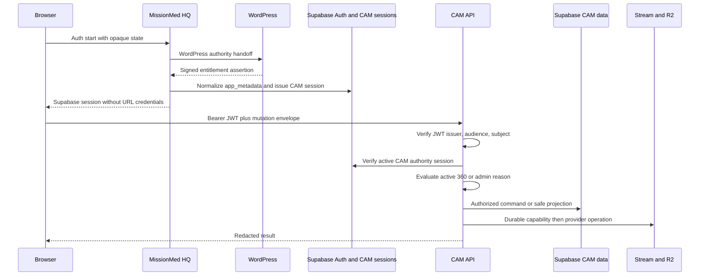

# Y2-3100 Complete Combined Handoff

- Contract: `missionmed.y2.combined-handoff.v1`
- Source files: `21`
- Inclusion law: Every primary source report below is unabridged exactly once.

<!-- BEGIN Y2_3100_DISCOVERY_EXECUTIVE_SUMMARY.md -->
# Y2-3100 Discovery Executive Summary

## Verdict

Read-only discovery is complete. The MissionMed Interviewer Brain is compatible with Y1 only as an additive, default-off capability behind the existing CAM gateway, authentication, entitlement, session, grant, audit, and deletion boundaries. Phase 0 must remain an isolated synthetic text harness.

## Verified Y1 State

- The public CAM dispatcher mounts 40 core contracts and no interview, transcript, or RISE routes: `/Users/brianb/MissionMed_worktrees/Y1-CAM-3000/Y1-CAM-4008A/candidates/cam-api/server.mjs:42` and `src/routes/contracts.mjs:3`.
- JWT signature, issuer, audience, expiry, and subject are validated, followed by active CAM-session enforcement: `src/auth/verifyJwt.mjs:30` and `src/auth/requireCamSession.mjs:40`.
- Entitlement derives from trusted WordPress-originated `app_metadata`; launchers, URLs, and `user_metadata` cannot grant access: `src/routes/entitlements.mjs:48`.
- Mentor access is explicit-grant scoped, and only a human reviewer can author an Order: `src/routes/reviews.mjs:187` and `migrations/20260715190000_y1_cam_4008a_integrity_expand.sql:371`.
- CAM deletion establishes durable intent and requires provider-absence evidence: `src/lib/deletionOrchestrator.mjs:95` and `:334`.
- CIE C0 supplies compatible local session, consent, track-item, Moment, deep-link, and replay contracts, but its production command adapter is absent.

## Contradictions And Gaps

- The Y2 combined handoff is a synopsis, not an unabridged combined package; all five exact sibling documents remain controlling inputs.
- CAM does not have purpose-specific AI consent. Current media provenance says `analysis_consent: not_granted` at `src/routes/media.mjs:227`.
- Current Stream intake is a short video contract capped at 150 seconds; it cannot be assumed to support a 15-25 minute future voice session.
- There is no adaptive interviewer view, long-session audio lifecycle, LiveKit rail, ElevenLabs rail, model adapter, or `CAM_INTERVIEWER_*` feature set in accepted CAM.
- The current MissionMed OS product index has no CAM/IV Prep On-Call passport.

## Decision

Proceed with the isolated Phase 0 Brain harness. Do not mount it into CAM, implement voice, create a provider account, or claim pilot readiness for real learners. Phase 1 requires separate consent, long-session media, device coordination, provider retention/deletion evidence, human IMG accent testing, network impairment, and identical-Brain two-rail comparison.
<!-- END Y2_3100_DISCOVERY_EXECUTIVE_SUMMARY.md -->

<!-- BEGIN Y2_3100_SOURCE_AND_AUTHORITY_MAP.md -->
# Y2-3100 Source And Authority Map

## Canonical Roots

| Authority | Root | Classification |
|---|---|---|
| Founder ticket | `/Users/brianb/.codex/attachments/13bc2e3f-94b6-4a67-b2c1-1cfd9afe84fc/pasted-text.txt` | Active execution authorization |
| Y2 decision package | `/Users/brianb/MissionMed_AI_Sandbox/CLAUDE_FILES/outputs/Y2-3100/` | Exact decisions and research inputs |
| CIE constitution | `/Users/brianb/MissionMed_AI_Sandbox/CLAUDE_FILES/Y1-CIE-5000/` | Proposed constitution |
| CIE amendment | `/Users/brianb/MissionMed_AI_Sandbox/CLAUDE_FILES/Y1-CIE-5000A/` | Ready-for-ratification amendment; explicit errata control |
| CIE atlas | `/Users/brianb/MissionMed_AI_Sandbox/CLAUDE_FILES/Y1-CIE-9000/` | Living planning registry |
| CIE C0 | `/Users/brianb/MissionMed_worktrees/Y1-CIE-C0-0001/` at `5b28931ea8250c385a4184e05725fbceb8282709` | Certified isolated executable foundation |
| Accepted CAM | `/Users/brianb/MissionMed_worktrees/Y1-CAM-3000/Y1-CAM-4008A/` | Current accepted scoped runtime evidence |
| CAM lineage | `/Users/brianb/MissionMed_AI_Sandbox/CLAUDE_FILES/Y1-CAM-3023/` and `Y1-CAM-3024/` | Accepted predecessor lineage |

## Precedence Applied

1. MissionMed Engineering OS and current runtime authority.
2. Founder ticket.
3. Exact Y2 decision and blueprint siblings.
4. CIE 5000A explicit amendments and errata.
5. CIE 5000.
6. Certified C0 executable contracts.
7. CIE 9000 living registry.
8. Accepted CAM runtime contracts.

## Package Integrity

- CIE 5000: all 5 individual files occur unabridged exactly once in its combined handoff.
- CIE 5000A: all 14 individual files occur unabridged exactly once.
- CIE 9000: all 10 individual files occur unabridged exactly once.
- CIE C0: all 15 individual reports occur unabridged exactly once; canonical and mirror combined handoffs are byte-identical at SHA-256 `dbdc0419da1290d422600b7448a22286d925f6fd043647caa05578d35e79222c`.
- Y2-3100: none of the five sibling documents occurs unabridged in `Y2-3100_COMPLETE_COMBINED_HANDOFF.md`; exact decision and blueprint siblings take precedence.

The complete 148-source path, hash, size, modification-time, classification, and conflict ledger is in `Y2_3100_3101_CONTEXT_SOURCE_INVENTORY.json`.
<!-- END Y2_3100_SOURCE_AND_AUTHORITY_MAP.md -->

<!-- BEGIN Y2_3100_DISC_01_API_AND_SESSION_AUTHORITY.md -->
# Y2-3100 DISC-01 API and Session Authority

## Scope

Read-only mapping of the accepted CAM 4008A candidate. This report does not declare that candidate to be the tracked canonical CAM source.

## Findings

- **VERIFIED:** The inspected donor root is `/Users/brianb/MissionMed_worktrees/Y1-CAM-3000/Y1-CAM-4008A/candidates`. Its 4008A handoff treats it as accepted candidate evidence.
- **UNKNOWN:** The exact currently tracked canonical CAM source was not established from the available repository state. No Y2 work may silently promote this donor into canon.
- **VERIFIED:** `/Users/brianb/MissionMed_worktrees/Y1-CAM-3000/Y1-CAM-4008A/candidates/cam-api/server.mjs:6` through `:15` imports the mounted route handlers; `:42` through `:48` identifies protected route families; `:58` through `:94` performs dispatch.
- **VERIFIED:** Mounted public families are `/health`, `/v1`, `/v1/contracts`, `/v1/auth/me`, `/v1/reps*`, `/v1/media/*`, `/v1/reviews/*`, `/v1/vault/*`, and `/v1/entitlements/*`.
- **VERIFIED:** `/Users/brianb/MissionMed_worktrees/Y1-CAM-3000/Y1-CAM-4008A/candidates/cam-api/src/routes/contracts.mjs:3` through `:44` publishes 40 contracts. Lines `:53` through `:60` explicitly exclude transcript and RISE synchronization contracts.
- **VERIFIED:** Transcript and RISE route source files exist but are not imported or mounted by `server.mjs`. Their presence is not a runtime capability.
- **VERIFIED:** `/Users/brianb/MissionMed_worktrees/Y1-CAM-3000/Y1-CAM-4008A/candidates/cam-api/src/auth/verifyJwt.mjs:53` through `:86` validates a bearer JWT against configured JWKS or secret material, issuer, audience, expiry, and a required subject.
- **VERIFIED:** `/Users/brianb/MissionMed_worktrees/Y1-CAM-3000/Y1-CAM-4008A/candidates/cam-api/src/routes/routeHelpers.mjs:44` through `:58` composes JWT verification with an active CAM session requirement.
- **VERIFIED:** `/Users/brianb/MissionMed_worktrees/Y1-CAM-3000/Y1-CAM-4008A/candidates/cam-api/src/auth/requireCamSession.mjs:40` through `:98` checks `cam_auth_sessions` through the server boundary and binds session id, Supabase subject, WordPress user, audience, status, expiries, authority snapshot, entitlement hash, and reason.
- **VERIFIED:** `/Users/brianb/MissionMed_worktrees/Y1-CAM-3000/Y1-CAM-4008A/candidates/cam-api/src/routes/entitlements.mjs:48` through `:58` accepts server-controlled `app_metadata`, not `user_metadata`, as entitlement authority. Lines `:155` through `:252` fail closed for active-360 and administrator decisions.
- **VERIFIED:** `/Users/brianb/MissionMed_worktrees/Y1-CAM-3000/Y1-CAM-4008A/candidates/cam-api/src/middleware/cors.mjs:16` through `:41` implements configured exact-origin checks and conditionally bounded DEV origins. Lines `:31` through `:34` allow authorization and mutation-control headers.
- **VERIFIED:** `/Users/brianb/MissionMed_worktrees/Y1-CAM-3000/Y1-CAM-4008A/candidates/cam-api/src/lib/supabaseServerClient.mjs:3` through `:25` keeps the service-role boundary server-side; `:47` through `:84` applies bounded provider requests and RPC calls.

## Y2 Attachment Contract

- **INFERENCE:** A future `/v1/interviews/*` family would need an explicit handler import, `requiresCamEntitlement`, dispatcher branch, public-contract declaration, audit events, and storage authority. No such family exists today.
- **VERIFIED:** Existing CORS header support is sufficient for bearer authorization, idempotency, expected-version, request, correlation, and causation headers. Origin admission would still require an explicit deployment decision.
- **ASSUMPTION:** Any future interviewer service should consume the same verified CAM authority rather than minting a parallel identity or entitlement system. This is an architectural recommendation, not current implementation evidence.

## Boundary Verdict

The reusable authority chain is strong and fail-closed. The adaptive interviewer API is absent. The Y2 Phase 0 harness remains isolated and must not be represented as a mounted CAM feature.
<!-- END Y2_3100_DISC_01_API_AND_SESSION_AUTHORITY.md -->

<!-- BEGIN Y2_3100_DISC_02_DATA_MODEL_AND_MIGRATIONS.md -->
# Y2-3100 DISC-02 Data Model and Migrations

## Migration Inventory

**VERIFIED:** The accepted CAM donor contains these 21 ordered migrations under `/Users/brianb/MissionMed_worktrees/Y1-CAM-3000/Y1-CAM-4008A/candidates/cam-api/migrations/`:

Every shortened migration citation in this report resolves beneath that exact absolute directory; no second migration root is implied.

1. `20260713030000_y1_cam_4002_rep_metadata.sql`
2. `20260713030100_y1_cam_4002_persistence.sql`
3. `20260713030200_y1_cam_4002_relational_ownership.sql`
4. `20260713030300_y1_cam_4002_mentor_share_access.sql`
5. `20260713030400_y1_cam_4002_soft_delete_rpc.sql`
6. `20260713030500_y1_cam_4002_rep_replay_soft_delete_repair.sql`
7. `20260713030600_y1_cam_4002_one_order_constraint.sql`
8. `20260713120000_y1_cam_4004_runtime_closure.sql`
9. `20260713125000_y1_cam_4004_story_soft_delete.sql`
10. `20260714202000_y1_cam_4005r_auth_session_foundation.sql`
11. `20260714203000_y1_cam_4005r_auth_session_enforcement.sql`
12. `20260715094500_y1_cam_4006_deletion_job_owner_policies.sql`
13. `20260715125500_y1_cam_4006_rep_idempotency_atomic_delete.sql`
14. `20260715133000_y1_cam_4006_atomic_delete_qualification.sql`
15. `20260715190000_y1_cam_4008a_integrity_expand.sql`
16. `20260715193000_y1_cam_4008a_authority_contract.sql`
17. `20260715200000_y1_cam_4008a_provider_replay_closure.sql`
18. `20260715203000_y1_cam_4008a_dev_findings_repair.sql`
19. `20260715210000_y1_cam_4008a_authority_deletion_certification.sql`
20. `20260715213000_y1_cam_4008a_certification_closure_repair.sql`
21. `20260715214000_y1_cam_4008a_review_deletion_race_repair.sql`

## Current Objects

- **VERIFIED:** `20260713030000_y1_cam_4002_rep_metadata.sql:7` defines `cam_rep_metadata`.
- **VERIFIED:** `20260713030100_y1_cam_4002_persistence.sql:23`, `:41`, `:54`, `:68`, `:84`, `:98`, `:112`, `:127`, and `:139` define media assets, replay packages, review grants, review sessions, Vault items, bookmarks, stories, audit events, and deletion jobs.
- **VERIFIED:** `20260713120000_y1_cam_4004_runtime_closure.sql:36` defines coaching quarantine storage.
- **VERIFIED:** `20260714202000_y1_cam_4005r_auth_session_foundation.sql:6` and `:28` define CAM authority sessions and handoff nonces.
- **VERIFIED:** `20260715190000_y1_cam_4008a_integrity_expand.sql:53`, `:70`, `:94`, `:123`, `:141`, `:155`, and `:170` add mutation receipts, provider capability grants, deletion jobs v2, deletion resource steps, review contexts, normalized notes, and normalized Orders.

## Complete Verbatim Object Inventory

The lists below contain each distinct identifier created anywhere in the 21-migration sequence. Later migrations may replace, revoke, or supersede an earlier definition; this is an inventory of creation names, not a claim that every early authority remains effective.

### Tables

**VERIFIED:** The exact table identifiers are:

`cam_rep_metadata`, `cam_media_assets`, `cam_replay_packages`, `cam_review_grants`, `cam_review_sessions`, `cam_vault_items`, `cam_bookmarks`, `cam_stories`, `cam_audit_events`, `cam_deletion_jobs`, `cam_coaching_quarantine`, `cam_auth_sessions`, `cam_auth_handoff_nonces`, `cam_mutation_receipts`, `cam_provider_capability_grants`, `cam_deletion_jobs_v2`, `cam_deletion_resource_steps`, `cam_review_contexts`, `cam_review_notes_v2`, `cam_review_orders_v2`.

Sources: `/Users/brianb/MissionMed_worktrees/Y1-CAM-3000/Y1-CAM-4008A/candidates/cam-api/migrations/20260713030000_y1_cam_4002_rep_metadata.sql:7`; `20260713030100_y1_cam_4002_persistence.sql:23-151`; `20260713120000_y1_cam_4004_runtime_closure.sql:36`; `20260714202000_y1_cam_4005r_auth_session_foundation.sql:6-39`; `20260715190000_y1_cam_4008a_integrity_expand.sql:53-184`.

### Functions

**VERIFIED:** The exact distinct function identifiers are:

`cam_set_updated_at`, `cam_soft_delete_rep_metadata`, `cam_soft_delete_replay_package`, `cam_soft_delete_media_asset`, `cam_soft_delete_vault_item`, `cam_soft_delete_story`, `cam_guard_rep_metadata`, `cam_is_trusted_reviewer`, `cam_reviewer_public_author`, `cam_guard_review_grant`, `cam_guard_review_session`, `cam_cascade_review_revocation`, `cam_audit_review_insert`, `cam_revoke_review_grant`, `cam_append_review_note`, `cam_append_review_order`, `cam_request_claims`, `cam_has_fresh_entitlement`, `cam_has_active_session`, `cam_create_rep_metadata_idempotent`, `cam_delete_rep_metadata_with_evidence`, `cam_increment_row_version`, `cam_issue_auth_session_v2`, `cam_create_review_grant_v2`, `cam_open_review_session_v2`, `cam_attach_review_context_v2`, `cam_revoke_review_context_v2`, `cam_append_review_note_v2`, `cam_append_review_order_v2`, `cam_prevent_unclosed_account_delete`, `cam_bind_upload_capability_v1`, `cam_create_replay_package_v1`, `cam_complete_replay_package_v1`, `cam_acquire_deletion_job_v2`, `cam_revoke_review_grant_v2`, `cam_revoke_review_capabilities_v2`, `cam_renew_deletion_job_v2`, `cam_deletion_closure_verified`, `cam_guard_deletion_completion_v2`, `cam_canonical_jsonb_text`, `cam_canonical_jsonb_sha256`, `cam_guard_active_rep_parent`, `cam_guard_replay_media_parents`, `cam_guard_bookmark_vault_parent`, `cam_guard_story_rep_parents`, `cam_guard_review_context_parent`, `cam_guard_capability_parents`, `cam_guard_deletion_job_identity_v3`, `cam_guard_deletion_step_evidence_v3`, `cam_begin_deletion_job_v3`, `cam_deletion_expected_steps`, `cam_guard_media_identity_v1`, `cam_resource_has_verified_closure`, `cam_lock_active_review_rep_v1`, `cam_guard_review_rep_parent_v1`.

Definition sources by migration:

- **VERIFIED:** `20260713030100_y1_cam_4002_persistence.sql:13` defines `cam_set_updated_at`.
- **VERIFIED:** `20260713030400_y1_cam_4002_soft_delete_rpc.sql:11-79`, `20260713030500_y1_cam_4002_rep_replay_soft_delete_repair.sql:11-57`, and `20260713125000_y1_cam_4004_story_soft_delete.sql:11-31` define the initial `cam_soft_delete_*` functions.
- **VERIFIED:** `20260713120000_y1_cam_4004_runtime_closure.sql:105-607` defines the original rep guard, reviewer authority, review guard/cascade/audit, revoke, note, and Order functions.
- **VERIFIED:** `20260714203000_y1_cam_4005r_auth_session_enforcement.sql:51-170` defines request-claim, fresh-entitlement, and active-session functions; `:244-300` wraps the delete/revoke/review commands.
- **VERIFIED:** `20260715125500_y1_cam_4006_rep_idempotency_atomic_delete.sql:36-165` defines idempotent rep creation and evidence deletion; `20260715133000_y1_cam_4006_atomic_delete_qualification.sql:6-63` replaces the latter.
- **VERIFIED:** `20260715190000_y1_cam_4008a_integrity_expand.sql:33-511` defines row-version, SessionRegistryV2, review v2, rep-provenance guard, and account-delete functions.
- **VERIFIED:** `20260715200000_y1_cam_4008a_provider_replay_closure.sql:33-214` defines upload binding, replay create/complete, deletion lease, and review grant v2 functions.
- **VERIFIED:** `20260715210000_y1_cam_4008a_authority_deletion_certification.sql:43-367` replaces session, active-session, review-revocation, deletion lease/renewal/closure/guard functions.
- **VERIFIED:** `20260715213000_y1_cam_4008a_certification_closure_repair.sql:8-807` defines canonical JSON/hash, final session/parent/deletion/provider guards, deletion job v3, expected-step/closure logic, lease renewal, upload binding, closure lookup, and account-delete prevention.
- **VERIFIED:** `20260715214000_y1_cam_4008a_review_deletion_race_repair.sql:9-281` defines the final review lock, review-parent guard, review cascade/context, open-session, note, and Order functions.

### Policies

**VERIFIED:** Static policy identifiers created in source are:

`cam_rep_metadata_student_select_own`, `cam_rep_metadata_student_insert_own`, `cam_rep_metadata_student_update_own`, `cam_rep_metadata_student_delete_own`, `cam_review_grants_owner_select`, `cam_review_grants_mentor_select`, `cam_review_grants_owner_insert`, `cam_review_grants_owner_update`, `cam_review_sessions_owner_select`, `cam_review_sessions_mentor_select`, `cam_review_sessions_owner_insert`, `cam_review_sessions_mentor_insert`, `cam_review_sessions_owner_update`, `cam_review_sessions_mentor_update`, `cam_audit_events_actor_select`, `cam_audit_events_actor_insert`, `cam_rep_metadata_mentor_select_granted`, `cam_media_assets_mentor_select_granted`, `cam_replay_packages_mentor_select_granted`, `cam_media_assets_owner_insert`, `cam_media_assets_owner_update`, `cam_replay_packages_owner_insert`, `cam_replay_packages_owner_update`, `cam_vault_items_owner_insert`, `cam_vault_items_owner_update`, `cam_bookmarks_owner_insert`, `cam_bookmarks_owner_update`, `cam_stories_owner_insert`, `cam_stories_owner_update`, `cam_deletion_jobs_owner_select`, `cam_deletion_jobs_owner_insert`, `cam_deletion_jobs_owner_update`.

Sources: `20260713030000_y1_cam_4002_rep_metadata.sql:58-81`; `20260713030100_y1_cam_4002_persistence.sql:315-480`; `20260713030200_y1_cam_4002_relational_ownership.sql:14-293`; `20260713030300_y1_cam_4002_mentor_share_access.sql:13-50`; `20260713120000_y1_cam_4004_runtime_closure.sql:618-740`; `20260715094500_y1_cam_4006_deletion_job_owner_policies.sql:14-37`.

**VERIFIED:** `20260713030100_y1_cam_4002_persistence.sql:287-307` dynamically creates `<table>_owner_select`, `<table>_owner_insert`, `<table>_owner_update`, and `<table>_owner_delete` for each of `cam_media_assets`, `cam_replay_packages`, `cam_vault_items`, `cam_bookmarks`, `cam_stories`, and `cam_deletion_jobs`. Expanded exact identifiers are:

`cam_media_assets_owner_select`, `cam_media_assets_owner_insert`, `cam_media_assets_owner_update`, `cam_media_assets_owner_delete`, `cam_replay_packages_owner_select`, `cam_replay_packages_owner_insert`, `cam_replay_packages_owner_update`, `cam_replay_packages_owner_delete`, `cam_vault_items_owner_select`, `cam_vault_items_owner_insert`, `cam_vault_items_owner_update`, `cam_vault_items_owner_delete`, `cam_bookmarks_owner_select`, `cam_bookmarks_owner_insert`, `cam_bookmarks_owner_update`, `cam_bookmarks_owner_delete`, `cam_stories_owner_select`, `cam_stories_owner_insert`, `cam_stories_owner_update`, `cam_stories_owner_delete`, `cam_deletion_jobs_owner_select`, `cam_deletion_jobs_owner_insert`, `cam_deletion_jobs_owner_update`, `cam_deletion_jobs_owner_delete`.

**VERIFIED:** `20260714203000_y1_cam_4005r_auth_session_enforcement.sql:182-213` dynamically creates these restrictive policies:

`cam_rep_metadata_active_cam_session`, `cam_media_assets_active_cam_session`, `cam_replay_packages_active_cam_session`, `cam_review_grants_active_cam_session`, `cam_review_sessions_active_cam_session`, `cam_vault_items_active_cam_session`, `cam_bookmarks_active_cam_session`, `cam_stories_active_cam_session`, `cam_audit_events_active_cam_session`, `cam_deletion_jobs_active_cam_session`, `cam_coaching_quarantine_active_cam_session`.

## Authority Evolution

- **VERIFIED:** `20260713030100_y1_cam_4002_persistence.sql:287` through `:307` originally installs generic owner select/insert/update/delete policies across media, replay, Vault, bookmarks, stories, and deletion jobs.
- **VERIFIED:** `20260714203000_y1_cam_4005r_auth_session_enforcement.sql:182` through `:213` adds restrictive active-session policies across 11 CAM tables.
- **VERIFIED:** `20260715193000_y1_cam_4008a_authority_contract.sql:5` through `:18` revokes authenticated lifecycle writes and unsafe base-media reads.
- **VERIFIED:** `20260715203000_y1_cam_4008a_dev_findings_repair.sql:4` through `:55` exposes safe owner and exact-grant projections instead of provider-bearing base rows.
- **VERIFIED:** `20260715190000_y1_cam_4008a_integrity_expand.sql:462` through `:484` applies FORCE RLS and revokes direct authenticated DML on new internal lifecycle tables.
- **INFERENCE:** The final migration state, not an early permissive policy in isolation, is the relevant authority surface. Any Y2 migration must preserve that expand-then-contract pattern.

## Smallest Additive Y2 Sketch

The following is a design sketch only; it is not implemented or authorized for CAM:

| Object | Minimum server-owned fields | Client-declared fields |
|---|---|---|
| `cam_interview_sessions` | id, owner, authority session, state, plan/persona refs, row version, timestamps | approved plan selection |
| `cam_interview_turn_events` | session, monotonic turn sequence, actor, event type, policy/model refs, request/correlation/causation ids, content hash | bounded answer or instructor input |
| `cam_transcript_revisions` | immutable revision, source event range, provenance, consent ref, status, deletion state | corrections through a command contract only |
| `cam_session_ledger_revisions` | immutable revision and chain hash, reconnect checkpoint, policy snapshot | none directly |
| `cam_interview_consent_receipts` | purpose, policy hash/version, subject, grant/withdrawal/expiry, authority | explicit consent choices |
| `cam_interview_visibility_grants` | exact artifact and grantee, consent basis, issue/revoke/expiry | explicit share request |

- **ASSUMPTION:** These may be separate tables or compatible extensions after a release architecture decision.
- **VERIFIED:** No equivalent interviewer session, turn-event, transcript revision, or session-ledger tables exist in the inspected CAM migration set.
- **INFERENCE:** A conforming additive Y2 schema must copy `row_version`, idempotency key plus canonical request hash, request/correlation/causation ids, server-derived ownership/timestamps, append-only revisions, FORCE RLS, and no direct authenticated lifecycle DML.

## Boundary Verdict

CAM offers mature persistence patterns worth adopting. It does not contain a hidden interviewer schema. Y2 must be additive, versioned, and fail closed, and remains blocked from integration by the current capability kill.
<!-- END Y2_3100_DISC_02_DATA_MODEL_AND_MIGRATIONS.md -->

<!-- BEGIN Y2_3100_DISC_03_DELETION_CLOSURE.md -->
# Y2-3100 DISC-03 Deletion Closure

## Current Orchestrator

- **VERIFIED:** `/Users/brianb/MissionMed_worktrees/Y1-CAM-3000/Y1-CAM-4008A/candidates/cam-api/src/lib/deletionOrchestrator.mjs:8` through `:15` defines supported root resource classes.
- **VERIFIED:** Lines `:65` through `:83` create the deletion closure snapshot before destructive work.
- **VERIFIED:** Lines `:156` through `:171` derive required resource steps, and `:174` through `:187` fail if the exact step set is not present.
- **VERIFIED:** Lines `:235` through `:273` perform provider deletion and verify absence rather than treating a request as proof.
- **VERIFIED:** Lines `:276` through `:299` purge internal artifacts, `:301` through `:315` finalize audit evidence, `:334` through `:385` run the state machine, and `:389` through `:409` reconcile pending work.

## Database Closure

- **VERIFIED:** `/Users/brianb/MissionMed_worktrees/Y1-CAM-3000/Y1-CAM-4008A/candidates/cam-api/migrations/20260715213000_y1_cam_4008a_certification_closure_repair.sql:423` through `:559` creates a durable job and closure snapshot.
- **VERIFIED:** Lines `:507` through `:510` include future derived artifact inventories.
- **VERIFIED:** Lines `:561` through `:578` define expected resource steps.
- **VERIFIED:** Lines `:580` through `:648` verify closure; `:615` through `:624` fail closed if unsupported future arrays are nonempty; `:625` through `:643` require absence evidence.
- **VERIFIED:** Lines `:661` through `:673` block completion until every required step is terminal with the required proof.

## Future Artifact Law

- **VERIFIED:** `/Users/brianb/MissionMed_worktrees/Y1-CAM-3000/Y1-CAM-4008A/4008A_FUTURE_DERIVED_ARTIFACT_DELETION_MAP.md:7` through `:45` enumerates future transcript, analysis, projection, cache, outbox, and related classes with required tombstone, cleanup, and absence behavior.
- **VERIFIED:** Lines `:47` through `:58` prescribe the order: durable intent, tombstone, revoke, provider cleanup, absence proof, purge, audit, completion.
- **VERIFIED:** Lines `:68` through `:74` require deletion workers to remain available during feature rollback and block account deletion until closure.

## Y2 Registration Requirements

- **UNKNOWN:** There is no plugin-style runtime API that lets Y2 dynamically register a deletion class. Current closure classes and SQL steps are explicit.
- **INFERENCE:** Before any integrated interviewer artifact can be written, its schema and orchestrator changes must add the class to the closure snapshot, durable step inventory, tombstone command, idempotent provider cleanup, internal purge, absence verifier, and terminal audit proof.
- **INFERENCE:** At minimum, future registered classes must include interview sessions, turn events, transcript revisions, session-ledger revisions, consent receipts, visibility grants, model/provider artifacts, and any queue/outbox record.
- **INFERENCE:** Applying the verified fail-closed closure law means a missing implementation blocks writes and a nonempty unrecognized class blocks `COMPLETE`.
- **INFERENCE:** Applying the verified rollback law means feature rollback may disable new interviewer sessions and model work but cannot disable deletion reconciliation.

## Boundary Verdict

Deletion is a reusable contract, not an automatic inheritance. No Y2 artifact may be integrated until it is explicitly registered and proven in the same server-owned closure state machine.
<!-- END Y2_3100_DISC_03_DELETION_CLOSURE.md -->

<!-- BEGIN Y2_3100_DISC_04_MEDIA_AND_STORAGE.md -->
# Y2-3100 DISC-04 Media and Storage

## Cloudflare Stream

- **VERIFIED:** `/Users/brianb/MissionMed_worktrees/Y1-CAM-3000/Y1-CAM-4008A/candidates/cam-api/src/lib/cloudflareStreamProvider.mjs:4` through `:12` defines bounded provider constants.
- **VERIFIED:** Lines `:70` through `:74` report readiness without exposing credentials.
- **VERIFIED:** Lines `:87` through `:105` validate media type, size, and duration.
- **VERIFIED:** Lines `:107` through `:151` create a direct-creator upload intent with signed playback required and content-hash metadata.
- **VERIFIED:** Lines `:166` through `:186` issue bounded playback, `:189` through `:211` delete provider media, and `:214` through `:230` validate owner, rep, environment, capability, and content-hash bindings.
- **VERIFIED:** The current allowlist is video-oriented. A generic R2-only audio interview path is not an existing public CAM contract.

## Cloudflare R2

- **VERIFIED:** `/Users/brianb/MissionMed_worktrees/Y1-CAM-3000/Y1-CAM-4008A/candidates/cam-api/src/lib/r2Provider.mjs:20` through `:86` implements server-side SigV4 requests.
- **VERIFIED:** Lines `:89` through `:95` derive bounded object keys.
- **VERIFIED:** Lines `:97` through `:132` write a sidecar, read it back, and verify its hash.
- **VERIFIED:** Lines `:135` through `:148` delete and then verify object absence.

## Durable Capabilities and Routes

- **VERIFIED:** `/Users/brianb/MissionMed_worktrees/Y1-CAM-3000/Y1-CAM-4008A/candidates/cam-api/src/lib/providerCapabilityStore.mjs:54` through `:81` persists an intent and idempotency binding before provider use; `:84` through `:116` binds the returned provider identity with CAS; `:133` through `:149` records proof; `:165` through `:172` evaluates usability.
- **VERIFIED:** `/Users/brianb/MissionMed_worktrees/Y1-CAM-3000/Y1-CAM-4008A/candidates/cam-api/src/routes/media.mjs:228` through `:266` binds content hash and capture provenance.
- **VERIFIED:** Lines `:403` through `:485` create direct-upload intent with compensation; `:526` through `:579` issue playback; `:611` through `:651` persist replay sidecars in R2.

## Y2 Storage Implications

- **INFERENCE:** A playable interactive interview recording should reuse Stream for media and R2 for a versioned metadata/replay sidecar. That is the closest current donor path.
- **INFERENCE:** LiveKit or another future WebRTC egress must first create a durable CAM capability and immutable media identity, then bind a digest, actual MIME/container, consent, capture provenance, and provider result. It must not insert an arbitrary provider UID.
- **UNKNOWN:** No current CAM source establishes LiveKit, TURN, WebRTC room, or egress provider support.
- **VERIFIED:** The amended ticket forbids changing existing rep upload and replay behavior; Y2 cannot replace or reinterpret it during Phase 0.
- **INFERENCE:** Under the verified provider-capability contract, local Brain output, model output, or a WebRTC room response cannot count as durable media proof.

## Boundary Verdict

The media plane is reusable after an explicit integration design. The current Y2 harness has no media provider integration, and the kill result forbids activating one.
<!-- END Y2_3100_DISC_04_MEDIA_AND_STORAGE.md -->

<!-- BEGIN Y2_3100_DISC_05_FRONTEND_RUNTIME.md -->
# Y2-3100 DISC-05 Frontend Runtime

## Current Surface Inventory

- **VERIFIED:** `/Users/brianb/MissionMed_worktrees/Y1-CAM-3000/Y1-CAM-4008A/candidates/cam-hq/public/cam/index.html:1270` through `:1273` registers 15 student views: `home`, `builder`, `qsets`, `cast`, `meet`, `perm`, `station`, `room`, `selfrate`, `analysis`, `order`, `vault`, `ghost`, `season`, and `stories`.
- **VERIFIED:** Lines `:1282` through `:1292` perform view and flow navigation.
- **VERIFIED:** There is no `data-view="interviewer"` adaptive interview room. The label "Interviewer" maps to the scripted `cast` and `meet` steps at lines `:788` through `:820`.
- **VERIFIED:** Four scripted persona cards are present. They are presentation content, not a persona service or adaptive policy engine.
- **VERIFIED:** `PACKS` is empty and `applyPack` is disabled at lines `:2246` through `:2249`.
- **VERIFIED:** The locked premium foundation panel remains at lines `:1062` through `:1071`; it does not prove an active feature.

## Capture Boundary

- **VERIFIED:** The page invokes `getUserMedia` beginning near `index.html:1431`.
- **VERIFIED:** Capture begins through `CaptureSession` at lines `:1579` through `:1594` and finalizes at `:1612` through `:1638`.
- **VERIFIED:** `/Users/brianb/MissionMed_worktrees/Y1-CAM-3000/Y1-CAM-4008A/candidates/cam-hq/public/cam/cam-runtime-integrity.js:55` through `:65` negotiates recording MIME; the capture FSM begins at line `:152`.
- **INFERENCE:** A future WebRTC room must adopt the already-authorized stream or use an explicit handoff state machine. Independently calling `getUserMedia` would create competing device ownership and conflicting consent/recovery state.

## Safe Attachment Points

| Need | Existing surface | Status |
|---|---|---|
| Persona selection | `cast` | Scripted presentation donor only |
| Pre-interview introduction | `meet` | Scripted presentation donor only |
| Device permission and recovery | `perm` / `station` | Reusable capture boundary |
| Live answer capture | `room` | Existing non-adaptive practice surface |
| Instructor review | admin review surface documented in DISC-07 | Reusable only through exact grants |

- **UNKNOWN:** No reusable `PersonaPanel` component was found. Any such name in the blueprint is conceptual.
- **VERIFIED:** The governing kill rule authorizes no student-facing insertion while the Brain capability failure remains active.
- **VERIFIED:** The amended ticket forbids changing existing Foundation labels to imply that the adaptive interviewer works.

## Boundary Verdict

The shell has useful presentation and capture donors. It has no hidden adaptive interviewer UI. Any future attachment requires a separate release ticket after the Brain capability gate passes.
<!-- END Y2_3100_DISC_05_FRONTEND_RUNTIME.md -->

<!-- BEGIN Y2_3100_DISC_06_EVENTS_IDEMPOTENCY_AND_AUDIT.md -->
# Y2-3100 DISC-06 Events, Idempotency, and Audit

## Existing Mutation Envelope

- **VERIFIED:** `/Users/brianb/MissionMed_worktrees/Y1-CAM-3000/Y1-CAM-4008A/candidates/cam-api/src/lib/mutationEnvelope.mjs:19` through `:37` normalizes `idempotency_key`, `request_hash`, `expected_row_version`, `request_id`, `correlation_id`, and `causation_id`.
- **VERIFIED:** Lines `:40` through `:44` reject reuse of one idempotency key with a different canonical request hash.
- **VERIFIED:** `/Users/brianb/MissionMed_worktrees/Y1-CAM-3000/Y1-CAM-4008A/candidates/cam-api/src/lib/mutationReceiptStore.mjs:16` through `:46` begins or replays a durable mutation receipt; `:49` through `:68` records completion or failure.
- **VERIFIED:** `/Users/brianb/MissionMed_worktrees/Y1-CAM-3000/Y1-CAM-4008A/candidates/cam-api/src/lib/auditStore.mjs:7` through `:38` writes server-authoritative actor, owner, event type, resource identity, and bounded details.

## Required Interview Event Shape

The following is a future contract recommendation, not an implemented route:

```text
InterviewTurnEventV1
  event_id
  session_id
  owner_user_id
  turn_sequence
  event_type
  actor_type
  actor_ref
  policy_snapshot_ref
  model_adapter_ref
  grounded_input_refs[]
  safe_projection
  guard_results[]
  request_id
  correlation_id
  causation_id
  idempotency_key
  request_hash
  occurred_at
  content_hash
```

- **INFERENCE:** A production InterviewTurnEventV1 must make identity, sequence, policy/model references, timestamps, hashes, and event state server-owned.
- **INFERENCE:** Applying CAM's verified mutation law means retryable commands use a caller-stable idempotency key; same key plus same hash returns the original result, and same key plus different hash returns conflict.
- **INFERENCE:** Applying the verified evidence law means turn events and ledger revisions are append-only, with a new revision or superseding event for corrections.
- **INFERENCE:** A safe Y2 audit projection may contain bounded decision facts and guard codes but cannot contain raw credentials, hidden chain-of-thought, provider secrets, or unredacted sensitive answer content.
- **INFERENCE:** A future interviewer service should correlate each turn with CAM request and deletion evidence rather than keeping an independent untraceable log.
- **VERIFIED:** The current Phase 0 Y2 file ledger is isolated from CAM. Passing its deterministic local tests does not establish integrated audit or idempotency.

## Boundary Verdict

CAM's mutation envelope and receipt pattern is the correct donor. The Y2 harness has not adopted that production boundary and cannot claim CAM-integrated event authority.
<!-- END Y2_3100_DISC_06_EVENTS_IDEMPOTENCY_AND_AUDIT.md -->

<!-- BEGIN Y2_3100_DISC_07_REVIEW_SURFACES.md -->
# Y2-3100 DISC-07 Review Surfaces

## Review API

- **VERIFIED:** `/Users/brianb/MissionMed_worktrees/Y1-CAM-3000/Y1-CAM-4008A/candidates/cam-api/src/routes/reviews.mjs:49` through `:52` reject caller-supplied reviewer identity.
- **VERIFIED:** Lines `:67` through `:76` define exact review permissions.
- **VERIFIED:** Lines `:94` through `:141` normalize note and Order requests and enforce one Order per review context.
- **VERIFIED:** Lines `:187` through `:199` require the authenticated reviewer to hold the exact active grant.
- **VERIFIED:** Lines `:209` onward dispatch review commands; `:289` through `:309` execute note and Order mutations.
- **VERIFIED:** `/Users/brianb/MissionMed_worktrees/Y1-CAM-3000/Y1-CAM-4008A/candidates/cam-api/src/lib/mentorDirectory.mjs:98` through `:174` limits reviewer resolution to current approved public mentors.
- **VERIFIED:** `/Users/brianb/MissionMed_worktrees/Y1-CAM-3000/Y1-CAM-4008A/candidates/cam-api/migrations/20260715190000_y1_cam_4008a_integrity_expand.sql:170` through `:184` creates normalized review Orders and a one-active-Order uniqueness rule.
- **VERIFIED:** The reviewer RPC functions are defined in `20260713120000_y1_cam_4004_runtime_closure.sql:315` through `:425` and later hardened by 4008A migrations.

## Frontend Review Donors

- **VERIFIED:** `/Users/brianb/MissionMed_worktrees/Y1-CAM-3000/Y1-CAM-4008A/candidates/cam-hq/public/cam/index.html:1149` through `:1217` contains the review-facing views.
- **VERIFIED:** `/Users/brianb/MissionMed_worktrees/Y1-CAM-3000/Y1-CAM-4008A/candidates/cam-hq/public/cam/cam-dev-adapter.js:1722` through `:1892` handles grant creation, review opening, attributed notes, and one Order.

## Y2 Attachment Analysis

- **INFERENCE:** A future Interview Event Summary and Focus Follow-Through panel belongs in an exact-grant reviewer projection, not in an unrestricted model-output endpoint.
- **INFERENCE:** Instructor pre-session configuration should be a separately authorized interview-plan object. It should not masquerade as a mentor note, Order, or broad review grant.
- **INFERENCE:** A future model may propose bounded evidence for review but cannot become the attributed mentor, create an Order, or expose unreviewed raw output.
- **INFERENCE:** A conforming Y2 review projection must preserve artifact-specific, revocable, consent-bound, and non-enumerating authorization.
- **UNKNOWN:** No current CAM review surface implements Y2 Event Summary or Focus Follow-Through semantics.

## Boundary Verdict

The review lane is a viable future projection point. It is not evidence that instructor visibility, adaptive interview summaries, or a production mentor workflow for Y2 currently exists.
<!-- END Y2_3100_DISC_07_REVIEW_SURFACES.md -->

<!-- BEGIN Y2_3100_DISC_08_DEPLOYMENT_AND_ENVIRONMENT.md -->
# Y2-3100 DISC-08 Deployment and Environment

## Deployment Descriptors

- **VERIFIED:** `/Users/brianb/MissionMed_worktrees/Y1-CAM-3000/Y1-CAM-4008A/candidates/cam-api/railway.json:1` through `:12` and `/Users/brianb/MissionMed_worktrees/Y1-CAM-3000/Y1-CAM-4008A/candidates/cam-hq/railway.json:1` through `:12` use Railpack, `npm start`, `/health`, a 120-second health timeout, and 10 restart retries.
- **UNKNOWN:** Railway project, environment, and service identities are not encoded in those files. No dashboard mutation or credentialed infrastructure lookup was performed for Y2.
- **VERIFIED:** `/Users/brianb/MissionMed_worktrees/Y1-CAM-3000/Y1-CAM-4008A/candidates/cam-api/src/routes/health.mjs:3` through `:55` returns redacted runtime and provider readiness without secret values.
- **VERIFIED:** `/Users/brianb/MissionMed_worktrees/Y1-CAM-3000/Y1-CAM-4008A/candidates/cam-api/src/config.mjs:20` through `:100` fails closed on environment/provider requirements; `:102` through `:203` builds normalized configuration.
- **VERIFIED:** `/Users/brianb/MissionMed_worktrees/Y1-CAM-3000/Y1-CAM-4008A/4008A_COMPLETE_COMBINED_HANDOFF.md:57` through `:64` records a dedicated DEV environment `cam-dev`, service `cam-api-dev`, 109 provider-integration checks, and synthetic cleanup.
- **VERIFIED:** `4008A_COMPLETE_COMBINED_HANDOFF.md:66` through `:78` records Railway project `missionmed-hq-fix005`, production environment `cam-production`, API deployment `657fe712-0c8f-468e-bc41-0a8be69cd093`, HQ deployment `efe688fd-810f-4547-889f-ef982e82691e`, and hosted health/browser evidence. This is accepted handoff evidence; Y2 did not contact or mutate those services.

## Accepted Environment Names

**VERIFIED:** `/Users/brianb/MissionMed_worktrees/Y1-CAM-3000/Y1-CAM-4008A/candidates/cam-api/src/environment/missionmedEnvBridge.mjs:17` through `:62` defines the canonical provider and deployment variable map:

- Supabase URL/key/JWT/project names: `SUPABASE_URL`, `MMHQ_SUPABASE_URL`, `MMHQ_MMC_SUPABASE_URL`, `NEXT_PUBLIC_SUPABASE_URL`, `SUPABASE_ANON_KEY`, `MMHQ_SUPABASE_ANON_KEY`, `MMHQ_MMC_SUPABASE_ANON_KEY`, `NEXT_PUBLIC_SUPABASE_ANON_KEY`, `MMHQ_SUPABASE_KEY`, `SUPABASE_SERVICE_ROLE_KEY`, `MMHQ_SUPABASE_SERVICE_ROLE_KEY`, `MMHQ_MMC_SUPABASE_JWT_SECRET`, `SUPABASE_JWT_SECRET`, `SUPABASE_JWKS_URL`, `SUPABASE_JWT_ISSUER`, `SUPABASE_JWT_AUDIENCE`, `MMHQ_MMC_ALLOWED_SUPABASE_PROJECT_REF`, `SUPABASE_PROJECT_REF`.
- Cloudflare and R2 names: `CLOUDFLARE_API_TOKEN`, `CLOUDFLARE_ZONE_ID`, `CLOUDFLARE_ACCOUNT_ID`, `CLOUDFLARE_STREAM_API_TOKEN`, `CLOUDFLARE_STREAM_ACCOUNT_ID`, `R2_ACCOUNT_ID`, `R2_ACCESS_KEY_ID`, `R2_SECRET_ACCESS_KEY`, `R2_BUCKET`, `R2_ENDPOINT_URL`, `R2_REGION`, `R2_CDN_BASE_URL`.
- Postmark names: `POSTMARK_SERVER_TOKEN`, `MMHQ_POSTMARK_SERVER_TOKEN`, `USCE_POSTMARK_SERVER_TOKEN`, `USCE_POSTMARK_FROM_EMAIL`, `SCHEDULER_EMAIL_FROM`, `USCE_POSTMARK_REPLY_TO_EMAIL`.
- WordPress names: `MMHQ_WP_BASE`, `MMHQ_WP_USERNAME`, `MMHQ_WP_APP_PASSWORD`, `MMHQ_ALLOWED_WP_ROLES`.
- Railway map names: `RAILWAY_PROJECT_NAME`, `RAILWAY_SERVICE_NAME`, `RAILWAY_ENVIRONMENT_NAME`, `RAILWAY_ENVIRONMENT`, `RAILWAY_PUBLIC_DOMAIN`, `RAILWAY_PRIVATE_DOMAIN`, and `PORT`.

- **VERIFIED:** `missionmedEnvBridge.mjs:10` through `:15` identifies `CAM_3028_SUPABASE_PROJECT_REF`, `CAM_3028_DEV_PASSWORD`, `SUPABASE_DB_PASSWORD`, and `DATABASE_URL` as retired ticket variables. They are names only and are not approved runtime inputs.
- **VERIFIED:** `missionmedEnvBridge.mjs:123` through `:131` also reads `RAILWAY_PROJECT_ID` and `RAILWAY_SERVICE_ID` only to detect Railway runtime mode.
- **VERIFIED:** `/Users/brianb/MissionMed_worktrees/Y1-CAM-3000/Y1-CAM-4008A/candidates/cam-api/src/config.mjs:20` through `:203`, together with `missionmedEnvBridge.mjs:179` through `:182`, reads these CAM/runtime names: `NODE_ENV`, `CAM_ENV`, `CAM_AUTH_MODE`, `CAM_REP_STORAGE_MODE`, `CAM_BOUNDARY_STORAGE_MODE`, `CAM_ENTITLEMENT_MODE`, `CAM_PRODUCTION_PROVIDER_ENABLE`, `CAM_PROFILE_SCHEMA_MODE`, `CAM_ENTITLEMENT_ENFORCE_API`, `CAM_API_VERSION`, `CAM_SESSION_REGISTRY_ENFORCE`, `CAM_ENTITLEMENT_SOURCE`, `CAM_ENTITLEMENT_CACHE_TTL_SECONDS`, `CAM_360_ALLOWED_COURSE_IDS`, `CAM_360_ALLOWED_PROGRAM_TIERS`, `CAM_MOCK_360_USER_IDS`, `CAM_DEV_360_USER_IDS`, `CAM_MOCK_CAM_ADMIN_USER_IDS`, `CAM_DEV_CAM_ADMIN_USER_IDS`, `CAM_CORS_ALLOWED_ORIGINS`, `CAM_ALLOWED_ORIGINS`, `CAM_DEV_PAGES_PROJECT`, and `CAM_DEBUG_ERRORS`.

## Y2 Deployment Boundary

- **VERIFIED:** No `CAM_INTERVIEWER_*` configuration is present in the inspected CAM donor.
- **UNKNOWN:** WebRTC, TURN, LiveKit, egress, GPU, model-provider network, and worker-service requirements are not established by the current source.
- **INFERENCE:** A separately deployable interviewer worker is a reasonable isolation boundary, but it is architecture only. It is not an existing third Railway service.
- **INFERENCE:** Any future flags must be server-side, default false on missing/unknown values, and incapable of activation by URL, frontend state, Matrix, Arena, or user metadata.
- **VERIFIED:** The current kill result authorizes no environment variable, service, deployment, or public route addition.

## Boundary Verdict

Current CAM deployment descriptors are reusable examples. They do not provide a deployable interviewer service or its network/provider configuration.
<!-- END Y2_3100_DISC_08_DEPLOYMENT_AND_ENVIRONMENT.md -->

<!-- BEGIN Y2_3100_DISC_09_PRIVACY_AND_RETENTION.md -->
# Y2-3100 DISC-09 Privacy and Retention

## Existing Evidence Contract

- **VERIFIED:** `/Users/brianb/MissionMed_worktrees/Y1-CAM-3000/Y1-CAM-4008A/4008A_CAPTURE_TIMELINE_AND_PROVENANCE_CONTRACT.md:7` through `:22` defines clock provenance.
- **VERIFIED:** Lines `:24` through `:43` define immutable media-revision facts including a consent reference.
- **VERIFIED:** Lines `:45` through `:59` define measurement provenance.
- **VERIFIED:** Lines `:61` through `:72` separate capture terminal state, durable persistence, provider lifecycle, and deletion evidence.
- **VERIFIED:** The inspected CAM migrations and mounted routes do not contain a current `cam_consent_receipts` table or consent command family.
- **UNKNOWN:** A current automatic retention duration cannot be derived from the inspected code. Provider objects persist until an explicit deletion workflow or provider policy removes them.

## Required Y2 Consent Purposes

The following is a draft requirement for later legal/founder review, not settled policy:

1. Live microphone capture.
2. Live camera capture when enabled.
3. Cloud media storage.
4. Transcript generation and retention.
5. Automated assistive interview processing.
6. Instructor or mentor review.
7. Optional applicant-pack use.
8. Any separately authorized research use.

- **VERIFIED:** The governing consent doctrine distinguishes membership or entitlement from consent.
- **INFERENCE:** A conforming Y2 consent receipt must bind each purpose to an immutable policy hash/version, subject, scope, grant time, withdrawal state, expiry where applicable, and server authority.
- **VERIFIED:** The governing CAM doctrine keeps optional physiological telemetry independent and owner-private by default; it does not inherit general media or mentor consent.
- **INFERENCE:** Withdrawal during a session should stop new capture and processing, revoke provider capabilities and review grants, seal the ledger truthfully, and start deletion closure.
- **INFERENCE:** Data minimization requires raw sensitive applicant answers not to be retained merely because the response was refused. The current synthetic harness reproduced that privacy defect and is not pilot-ready.
- **VERIFIED:** The amended pilot law requires consent and retention text to be reconciled before a ten-student pilot; the current pilot protocol remains blocked.

## Data Classification

| Data | Minimum classification | Current status |
|---|---|---|
| Audio/video | sensitive student media | Existing CAM provider boundary only |
| Transcript | sensitive derived artifact | Unmounted/inactive |
| Applicant pack | sensitive educational/profile data | Synthetic-only harness input |
| Turn ledger | sensitive decision and conversation record | Isolated local harness only |
| Instructor report | sensitive human-review projection | Synthetic local output only |
| Model/guard traces | restricted operational evidence | Must exclude secrets and hidden reasoning |

## Boundary Verdict

The provenance doctrine is useful, but runtime consent and retention for the adaptive interviewer are absent. That absence independently blocks any student pilot.
<!-- END Y2_3100_DISC_09_PRIVACY_AND_RETENTION.md -->

<!-- BEGIN Y2_3100_DISC_10_REUSE_AND_DEAD_ENDS.md -->
# Y2-3100 DISC-10 Reuse and Dead Ends

## Reuse As-Is or Through a Thin Adapter

- **VERIFIED:** JWT, CAM authority-session, and entitlement evaluation are established donors. Source: `verifyJwt.mjs:53-86`, `requireCamSession.mjs:40-98`, and `entitlements.mjs:155-252` under `/Users/brianb/MissionMed_worktrees/Y1-CAM-3000/Y1-CAM-4008A/candidates/cam-api/src/`.
- **VERIFIED:** Mutation envelopes, durable receipts, and server audit are established donors. Source: `mutationEnvelope.mjs:19-44`, `mutationReceiptStore.mjs:16-68`, and `auditStore.mjs:7-38`.
- **VERIFIED:** Exact review grants, attributed notes, and one Order are established donors. Source: `/src/routes/reviews.mjs:49-199` and the review migrations.
- **VERIFIED:** Server-owned deletion, Stream direct upload, signed playback, and R2 sidecars are established donors. Source: `deletionOrchestrator.mjs`, `cloudflareStreamProvider.mjs`, `r2Provider.mjs`, and `providerCapabilityStore.mjs`.
- **VERIFIED:** The capture FSM and MIME negotiation are established browser donors. Source: `/cam-hq/public/cam/cam-runtime-integrity.js:55-65` and `:152` onward.

## Do Not Reuse as Product Authority

- **VERIFIED:** The amended ticket forbids modification of canonical RC1, Matrix, Arena, WordPress authority, and current CAM production routes.
- **VERIFIED:** The transcript and RISE source files are unmounted and excluded from the 40-contract production surface. Treat them as dead-end placeholders.
- **VERIFIED:** `/Users/brianb/MissionMed_worktrees/Y1-CAM-3000/Y1-CAM-4008A/candidates/cam-hq/server.mjs:5019` through `:5163` contains unrelated DBOC transcript/scoring logic. It is not CAM interviewer authority and must not be imported.
- **VERIFIED:** The `cast` and `meet` views are scripted persona presentation; they are not an adaptive interviewer engine.
- **VERIFIED:** `PACKS` is empty and disabled at `index.html:2246-2249`; it is not a provider-backed interview-plan registry.
- **VERIFIED:** The locked Foundation panel is disclosure only, not implementation.
- **VERIFIED:** The governing CAM exclusion law forbids reuse of Y1-CAM-3031P.

## Current Y2 Harness Classification

- **VERIFIED:** The Phase 0 text Brain is MissionMed-owned, provider-neutral in its public contract, deterministic, synthetic-only, and isolated.
- **VERIFIED:** Its frozen holdout failed central capability after two policy iterations. T1, T3, and T4 failed materially; T2 passed; T5 difficulty adaptation failed; T6 is incomplete; T7 lacks the required human timed review.
- **VERIFIED:** Fresh adversarial probes found protected-topic focus bypass, sensitive-answer persistence after refusal, encoded-injection evasion, Unicode/code-switching rejection, and an overly broad claim contract.
- **VERIFIED:** The kill law forbids tuning frozen policy against the opened holdout; the named defects become Y2-3103 inputs.
- **UNKNOWN:** The exact current canonical CAM tracked source and a merged Engineering OS registration for Y2 were not established. The isolated registration receipt is unmerged and noncanonical.

## Recommended Next Step

**INFERENCE:** The smallest safe continuation is `Y2-3103: Provider-Neutral Semantic Model Adapter Bakeoff and New Frozen Holdout`, preceded by contract/privacy repairs and a new independent evaluation set. Voice, avatar, media, Y1 integration, pilot, staging, and production remain out of scope.

## Boundary Verdict

Adopt mature CAM infrastructure patterns. Reject placeholders, unrelated scoring code, speculative UI labels, and the failed deterministic policy as integration shortcuts.
<!-- END Y2_3100_DISC_10_REUSE_AND_DEAD_ENDS.md -->

<!-- BEGIN Y2_3100_DISCOVERY_SYNTHESIS.md -->
# Y2-3100 Discovery Synthesis

## Truthful Result

`DISCOVERY_COMPLETE_WITH_INTEGRATION_BLOCKED`

The CAM donor provides mature identity, entitlement, persistence, media, review, deletion, and audit boundaries. It does not contain an adaptive interviewer runtime. The isolated Phase 0 Brain failed the frozen central-capability gate, so this synthesis is a map for the next research ticket, not an authorization to integrate.

## Verified Authority Sequence



- **VERIFIED:** Matrix and Arena are launch adapters, not identity or entitlement authorities.
- **VERIFIED:** CAM API is the public policy gateway; provider credentials remain server-side.
- **UNKNOWN:** The exact tracked canonical source corresponding to the inspected accepted 4008A candidate remains unresolved.

## Blueprint Mapping

| Blueprint capability | Repository reality | Classification |
|---|---|---|
| Browser interview room | CAM has capture views and a capture FSM, but no adaptive WebRTC room | Foundation donor only |
| MissionMed Brain | Isolated deterministic Phase 0 harness | Killed by frozen central-capability gate |
| Transcription | Source placeholder exists but is unmounted and excluded | Inactive |
| Session ledger | Isolated file ledger only; not CAM or CIE integrated | Research harness |
| Persona and interview plan | Versioned synthetic harness contracts; CAM has four scripted cards | Research only |
| Model adapter | Public interface exists, but no provider-backed semantic implementation was certified | Partial foundation |
| Voice and avatar | Typed inactive adapters | Inactive |
| Stream and R2 | Durable media and sidecar donors exist | Production CAM donor |
| Mentor review | Exact grants, notes, one Order, safe projections | Production CAM donor |
| CIE timeline/Moments | Separate foundation contracts, no Y2 runtime integration | Future boundary |

## Additive Integration Sketch

If a later capability gate passes, the smallest bounded architecture is:

1. Add server-side default-off interviewer flags and health readiness.
2. Add immutable interview session, turn-event, ledger-revision, consent, visibility, and transcript-revision contracts.
3. Reuse JWT, CAM authority sessions, entitlement, mutation envelopes, receipts, audit, exact grants, Stream/R2 capabilities, and deletion closure.
4. Keep the Brain worker isolated behind an internal job/command contract with no public credentials or broad service-role access.
5. Register every artifact in deletion closure before enabling writes.
6. Run synthetic DEV shadow evaluation only; no student-visible output.
7. Add human reviewer projection only after exact-grant, privacy, and educational-validity gates.
8. Make student activation a separate release decision.

## Contradiction Register

- **VERIFIED:** There is no mounted interviewer route or interviewer persistence table.
- **VERIFIED:** The visible "Interviewer" step is scripted `cast`/`meet`, not adaptive conversation.
- **VERIFIED:** `PACKS` is empty and disabled.
- **VERIFIED:** Transcript and RISE routes are unmounted.
- **VERIFIED:** No runtime consent-receipt table or route was found.
- **VERIFIED:** No reusable `PersonaPanel` component was found.
- **VERIFIED:** Current Stream MIME validation is video-oriented; generic audio-only upload is not an existing contract.
- **VERIFIED:** No WebRTC/TURN/LiveKit/egress configuration or worker service exists in the inspected CAM source.
- **VERIFIED:** The Brain holdout result forbids Y1 integration, voice, avatar, pilot, staging, and production.
- **UNKNOWN:** The inspected accepted CAM candidate has not been proven to be the exact tracked canonical source.
- **UNKNOWN:** The isolated Y2 Engineering OS registration receipt is not merged into current MissionMed_OS authority.

## Workstream Decision

| Workstream | Decision |
|---|---|
| Y2-3100 discovery | Complete with named unknowns |
| Y2-3101 Phase 0 Brain | `KILL_RULE_TRIGGERED` |
| Y2-3102 ten-student pilot | Not authorized and not ready |
| Y1 CAM integration | Not started and not authorized |
| Voice/avatar/vendor work | Inactive |
| Production or staging | Untouched |

## Exact Next Ticket

`Y2-3103: Provider-Neutral Semantic Model Adapter Bakeoff and New Frozen Holdout`

It must first repair protected-topic authority, sensitive-data minimization, Unicode/code-switching support, encoded-injection handling, model/claim provenance, and ledger concurrency. It must then evaluate at least one genuinely semantic provider-neutral adapter against a newly frozen, independently authored holdout. The opened Y2-3101 holdout must not be reused for tuning.
<!-- END Y2_3100_DISCOVERY_SYNTHESIS.md -->

<!-- BEGIN Y2_3100_SESSION_API_AUTH_AND_RLS.md -->
# Y2-3100 Session, API, Auth, And RLS

## Verified Boundaries

| Boundary | Current authority | Future Y2 rule |
|---|---|---|
| Public API | `cam-api/server.mjs:42` dispatches accepted CAM routes | Additive interview routes may mount only through this gateway under a separate release ticket |
| JWT | `src/auth/verifyJwt.mjs:30-86` verifies JOSE signature, issuer, audience, expiry, and subject | Never accept launcher, URL, or model claims as identity |
| Session | `src/auth/requireCamSession.mjs:40-98` requires an active CAM authority session | Future Brain work must bind to the same session authority |
| Entitlement | `src/routes/entitlements.mjs:48-252` uses trusted `app_metadata` and fails revoked/restricted/expired states closed | Interviewer admission remains server-derived and default-off |
| RLS | `20260714203000_y1_cam_4005r_auth_session_enforcement.sql:142-213` requires fresh entitlement and active session | Every future Y2 table needs FORCE RLS and no direct authenticated lifecycle writes |
| Mentor access | `20260713120000_y1_cam_4004_runtime_closure.sql:617-740` requires an exact active grant | No session-wide or cohort-wide review shortcut |

## CIE Attachment

CIE C0 locally defines the compatible session-clock, track-item, Moment, visibility, grant, and deep-link concepts in `/Users/brianb/MissionMed_worktrees/Y1-CIE-C0-0001/cie/src/`. It is not production authority. Future integration must adapt Y2 turn events onto that spine after a separately reviewed production adapter exists.

## Closed Phase 0 Boundary

The harness has no HTTP public service, JWT acceptance, database role, Supabase key, WordPress handoff, Matrix launch, Arena launch, or production endpoint. Synthetic session IDs are local fixture identifiers and cannot be treated as authentication.
<!-- END Y2_3100_SESSION_API_AUTH_AND_RLS.md -->

<!-- BEGIN Y2_3100_MEDIA_CONSENT_DELETION_AND_PROVENANCE.md -->
# Y2-3100 Media, Consent, Deletion, And Provenance

## Media

- Accepted Stream intake is video-only and capped at 150 seconds: `/Users/brianb/MissionMed_worktrees/Y1-CAM-3000/Y1-CAM-4008A/candidates/cam-api/src/lib/cloudflareStreamProvider.mjs:4-10`.
- R2 currently stores replay JSON sidecars, not long-session audio: `src/lib/r2Provider.mjs:93-125`.
- Phase 0 therefore uses text only. It creates no audio, video, provider object, upload intent, playback capability, or recording.

## Consent

CAM has no mounted purpose-specific AI consent store. `src/routes/media.mjs:227` records `analysis_consent: not_granted`. Membership, entitlement, or mentor sharing cannot be interpreted as AI-processing consent.

Future consent must be separate for live AI processing, recording, transcript, applicant-material grounding, instructor focus items, mentor sharing, research reuse, physiology, and retention. Withdrawal must stop new processing and inherit source-level access and deletion rules.

## Deletion

CAM's accepted pattern creates durable deletion intent before provider mutation and verifies absence before completion at `src/lib/deletionOrchestrator.mjs:95` and `:334`. Future Y2 artifact classes must register in that closure before any learner write.

MissionMed-controlled artifacts require verified absence. In-flight processors that expose no absence API may use only a clearly labeled contractual zero-retention evidence class after founder approval; it must never be called cryptographic or verified deletion.

## Provenance

Every Phase 0 decision records synthetic status, persona/plan/policy/model-adapter versions, evidence references, grounding source IDs and hashes, guard outcomes, event order, and a bounded instructor rationale. It stores no private chain-of-thought and no unrestricted prompt log.
<!-- END Y2_3100_MEDIA_CONSENT_DELETION_AND_PROVENANCE.md -->

<!-- BEGIN Y2_3100_REVIEW_UI_FLAGS_AND_ATTACHMENT_POINTS.md -->
# Y2-3100 Review, UI, Flags, And Attachment Points

## Review

Reviewer identity is directory-derived and write authority is grant-bound at `/Users/brianb/MissionMed_worktrees/Y1-CAM-3000/Y1-CAM-4008A/candidates/cam-api/src/routes/reviews.mjs:187`. The database enforces one human Order per lawful review context at `migrations/20260715190000_y1_cam_4008a_integrity_expand.sql:371`.

The Brain may produce evidence-linked turn decisions and an instructor summary. It cannot create an Order, convert an observation into coaching, or publish a learner judgment.

## UI

Current `cast`, `meet`, and `room` surfaces are scripted at `candidates/cam-hq/public/cam/index.html:651`; the shell owns a single media stream at `:1418`. There is no accepted adaptive interviewer surface. Phase 0 therefore exposes only a local instructor-readable report, with no student UI.

## Flags

`candidates/cam-api/src/config.mjs:151-178` explicitly marks transcript and AI storage unimplemented. No `CAM_INTERVIEWER_*`, LiveKit, ElevenLabs, STT, TTS, model-provider, voice, or avatar runtime exists.

Any later flags must be server-side, false when absent or unknown, and incapable of activation from a URL, frontend state, Matrix, Arena, or user metadata. Rollback must disable acceptance and publication while deletion remains active.

## Future Attachment Points

1. Existing CAM API gateway and authority session.
2. Purpose-specific consent receipt.
3. CIE clock/track-item/Moment adapter.
4. Private Brain worker with least-privilege job contract.
5. Explicit mentor review grant and safe projection.
6. Existing audit/deletion orchestrator.
<!-- END Y2_3100_REVIEW_UI_FLAGS_AND_ATTACHMENT_POINTS.md -->

<!-- BEGIN Y2_3100_REUSABLE_AND_PROHIBITED_COMPONENTS.md -->
# Y2-3100 Reusable And Prohibited Components

## Reuse

- CAM JOSE verification and active authority-session check.
- WordPress-derived entitlement evaluation.
- CAM mutation, ownership, explicit-grant, audit, one-Order, provider-capability, and deletion patterns.
- CIE C0 segmented clock, versioned track item, Moment, consent, per-artifact visibility, deep-link, and replay-sync contracts after production adaptation.
- Existing CAM availability-honesty and redacted-error conventions.

## Prohibited Donors

- The rejected 3031P artifact.
- HQ DBOC transcript/scoring functions or numeric SAF feedback.
- Unmounted CAM transcript placeholder routes.
- Direct Supabase service-role access for a Brain worker.
- Current short-video Stream intake as an assumed long-session voice contract.
- Matrix, Arena, URL parameters, or `user_metadata` as authorization.
- Any prototype, stale duplicate, provider SDK, dead endpoint, learner teaser, or reserved UI surface.

## Phase 0 Isolation

The harness implements local deterministic contracts and adapters only. Its future voice and avatar interfaces are inactive declarations with no provider import, network call, credential field, or accepted write path.
<!-- END Y2_3100_REUSABLE_AND_PROHIBITED_COMPONENTS.md -->

<!-- BEGIN Y2_3100_BLUEPRINT_SOURCE_CONTRADICTIONS.md -->
# Y2-3100 Blueprint And Source Contradictions

| Issue | Evidence | Resolution |
|---|---|---|
| Combined handoff is incomplete | Y2 combined embeds 0/5 sibling documents unabridged | Exact decision and blueprint siblings control |
| AI Interviewer is C10/V2 | CIE 5000A places activation after C2 review quality, C3 transcript, and consent review | Founder ticket authorizes isolated synthetic Phase 0 only, not C10 activation |
| Probe cap differs | Y2 allows 1-3 probes; accepted IVOC law allows 1 at rungs 0-1 and 2 at rung 2+ | Apply stricter 1/2 cap; T1 floors cannot force redundant probes |
| T1 probe floor can conflict with educational utility | Complete answers should transition | Use a rung-balanced fixture set and count only substantive incomplete answers for cap-compatible probing; never over-probe to game T1 |
| Purpose-specific consent assumed by future plan | CAM has no mounted AI consent and records `analysis_consent: not_granted` | No real data or provider work in Phase 0; consent is a Phase 1 prerequisite |
| Voice rail assumes media path | CAM Stream path is video-only and <=150 seconds | Design a separate future long-session contract; do not reuse by assumption |
| CIE contracts exist | C0 is certified locally, but has no production command adapter | Use compatible shapes locally; production attachment requires separate review |
| Skill `version` is overloaded | CIE sources use semantic version and integer publication version | Use distinct `contract_version`, `policy_version`, `skill_version`, and `publication_seq` fields |
| T6 contains voice requirements | Dead-air and rail-kill requirements are voice-phase concerns | Phase 0 tests silence-equivalent, malformed input, reconnect, and ledger restoration; voice claims remain unavailable |

No contradiction requires weakening auth, consent, deletion, evidence, review, or deployment law.
<!-- END Y2_3100_BLUEPRINT_SOURCE_CONTRADICTIONS.md -->

<!-- BEGIN Y2_3100_SMALLEST_SAFE_INTEGRATION_SEQUENCE.md -->
# Y2-3100 Smallest Safe Integration Sequence

1. Qualify the isolated synthetic text-first Brain against exact T1-T7, adversarial fixtures, a frozen holdout, and the kill rule.
2. Obtain founder decisions for D3, D4, D5, D6, D7, and D9 before any real learner or provider processing.
3. Build a separately reviewed CIE production adapter; mount turn decisions as versioned events on the existing session clock and evidence spine.
4. Add purpose-specific consent and Y2 artifact classes to the existing server-owned audit/deletion closure before writes.
5. Add default-off interview session, turn event, transcript revision, capability, usage, and deletion contracts through the sole CAM API gateway. Keep routes unmounted during schema qualification.
6. Add a private Brain worker boundary using job-scoped authority, never a general service-role key.
7. Design a distinct long-session voice-media and device-handoff lifecycle; do not assume the 150-second Stream path is sufficient.
8. Exercise the identical frozen Brain behind LiveKit and ElevenLabs only in a separately authorized Phase 1 rig.
9. Pass consented human IMG accent, network impairment, interruption/reconnect, browser/device, processor-retention, transcript fidelity, spend, and withdrawal/deletion gates.
10. Request an independent release decision before any learner-visible flag, staging mount, or production route.

Rollback at every future step must disable new acceptance and publication without disabling audit or deletion.
<!-- END Y2_3100_SMALLEST_SAFE_INTEGRATION_SEQUENCE.md -->

<!-- BEGIN Y2_3100_D3_D9_RATIFICATION_NOTE.md -->
# Y2-3100 D3 And D9 Ratification Note

## Exact D3 Source

> Approve the grounding extension of IVOC-017 §2: follow-ups may ground on (a) consented applicant-materials packs and (b) instructor-set focus items, in addition to the live transcript. Both consent-gated, both evidence-linked.

Source: `/Users/brianb/MissionMed_AI_Sandbox/CLAUDE_FILES/outputs/Y2-3100/Y2-3100_AI_INTERVIEWER_DECISION.md:196`.

## D3 Recommendation

Ratify with conditions. Permit approved MissionMed domain packs, explicitly authorized applicant-material packs, and instructor-set focus items. Every source must be purpose-scoped, allowlisted, evidence-linked, revocable, access-controlled, and deletion-inheriting. Instructor focus may direct attention but is not evidence that an applicant has a weakness. Prohibit unrelated records, silent profile construction, and cross-session reuse.

D3 is not required for the synthetic Phase 0 harness. It is required before real applicant-material grounding.

## Exact D9 Source

> Deletion evidence-class ruling: 4008A law requires provider absence proof, but in-flight processors (STT, LLM, TTS) expose no absence-verification API; their deletion guarantee is contractual zero-data-retention, a weaker evidence class. Brian must either accept contractual ZDR in lieu of absence proof for in-flight processors (recorded as such in the deletion closure, never presented as verified absence) or constrain the vendor set to options where verification exists.

Source: `/Users/brianb/MissionMed_AI_Sandbox/CLAUDE_FILES/outputs/Y2-3100/Y2-3100_AI_INTERVIEWER_DECISION.md:202`.

## D9 Recommendation

Accept only as an explicitly weaker evidence class. MissionMed-controlled artifacts require verified absence or existing Y1 closure proof. A transient processor requires vendor-specific contractual retention/ZDR evidence, configuration proof, contract version, and a recorded limitation. Never label contractual ZDR as cryptographic proof or verified absence.

D9 does not block the synthetic local harness. Unresolved vendor-specific D9 evidence blocks any real-learner processing.
<!-- END Y2_3100_D3_D9_RATIFICATION_NOTE.md -->

<!-- BEGIN Y2_3100_UNKNOWN_AND_BLOCKER_REGISTER.md -->
# Y2-3100 Unknown And Blocker Register

## Phase 0

No external blocker prevents the isolated synthetic text harness. The frozen holdout, evaluator, policy, ledger, fixtures, and local report remain fully local.

## Future Phase 1 Unknowns

- Vendor-specific contractual retention, no-training, region, and deletion evidence.
- LiveKit-to-R2 egress suitability and archival transcript fidelity.
- Long-session media contract, device handoff, and browser support.
- Human IMG accent and code-switching performance.
- TURN/TCP, 100-150 ms RTT, packet-loss, barge-in, and recovery behavior.
- Exact rail cost and usage reconciliation under abandoned/duplicate sessions.
- Production CIE adapter and CAM purpose-specific consent authority.
- Entitlement tier and learner-facing lock copy.
- Stock voice/persona licensing and D4 approval.

## Human Decisions Before Real Processing

- D3 grounding extension.
- D4 voice/persona law.
- D5 entitlement placement.
- D6 consent copy.
- D7 rail checkpoint after mandatory evidence.
- D9 deletion evidence class.

## Hard Blockers To Learner Release

No production adapter; no AI consent; no long-session media; no provider-retention evidence; no human accent benchmark; no network-impairment result; no two-rail result; no real-data deletion closure; no independent release decision. The Arena logging issue recorded by 4008A is external to this read-only mission and remains a broader ecosystem release condition until separately closed.
<!-- END Y2_3100_UNKNOWN_AND_BLOCKER_REGISTER.md -->
